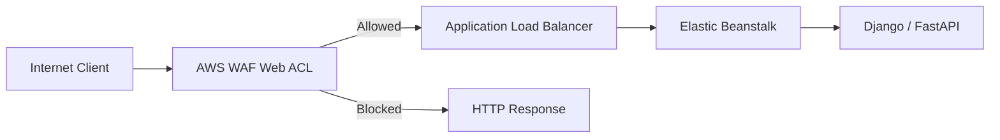
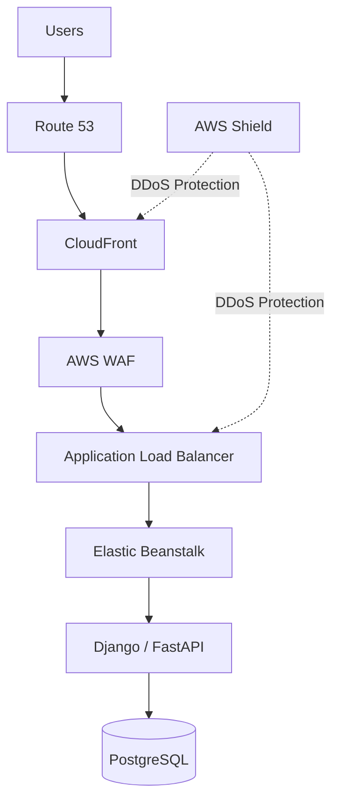
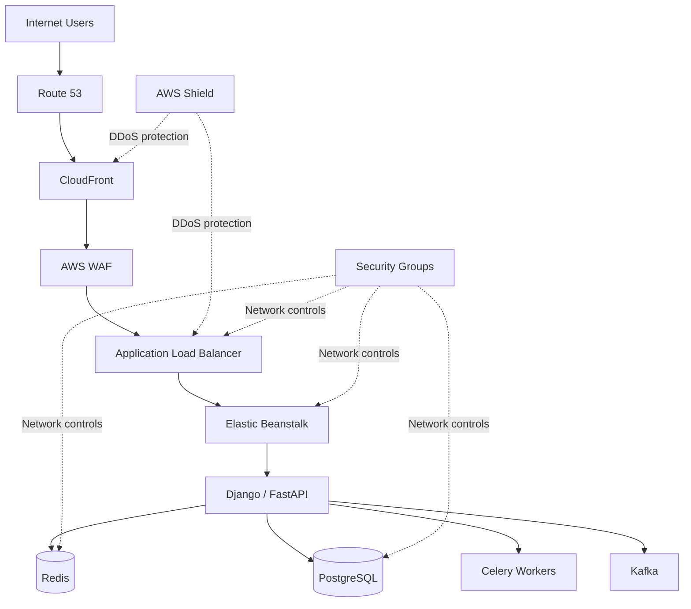

# 08- WAF and DDoS Protection

## Overview

Amazon Elastic Beanstalk does not itself provide a complete application-layer security boundary against malicious HTTP traffic. In a production architecture, Elastic Beanstalk is typically protected by services positioned in front of the environment, most commonly an Application Load Balancer (ALB), AWS WAF, and AWS Shield.

A practical security architecture is:

```text
Internet
   │
   ▼
Route 53
   │
   ▼
CloudFront ───────────────┐
   │                      │
   ▼                      │
AWS WAF                   │
   │                      │
   ▼                      │
Application Load Balancer │
   │                      │
   ▼                      │
Elastic Beanstalk         │
   │                      │
   ▼                      │
Django / FastAPI          │
                          │
AWS Shield ───────────────┘
```

AWS WAF provides HTTP/HTTPS request inspection and filtering, while AWS Shield provides DDoS protection at network, transport, and application layers. AWS WAF can be associated directly with an Application Load Balancer, making it a natural security control for Elastic Beanstalk environments using an ALB. :contentReference[oaicite:0]{index=0}

The important architectural distinction is:

| Service | Primary responsibility |
|---|---|
| Security Groups | Network-level access control |
| Network ACLs | Subnet-level stateless filtering |
| AWS WAF | HTTP/HTTPS request filtering |
| AWS Shield Standard | Baseline DDoS protection |
| AWS Shield Advanced | Enhanced DDoS detection and mitigation |
| CloudFront | Global edge delivery and traffic absorption |
| Route 53 | DNS and routing resilience |
| Elastic Beanstalk | Application deployment and environment management |

WAF and Shield should complement, not replace, the application's own security controls.

## Threat Model

A public Elastic Beanstalk API can be exposed to several classes of attacks:

```text
Internet
   │
   ├── Volumetric DDoS
   ├── HTTP request floods
   ├── SQL injection
   ├── Cross-site scripting
   ├── Malicious bots
   ├── Credential abuse
   ├── Scanner traffic
   ├── Path traversal attempts
   └── Application-specific abuse
```

Different layers address different threats.

| Threat | Primary control |
|---|---|
| Network flood | AWS Shield |
| HTTP flood | AWS WAF rate-based rules |
| SQL injection | AWS WAF managed/custom rules + application validation |
| XSS | AWS WAF managed/custom rules + application output encoding |
| Malicious bots | AWS WAF + bot controls |
| Known malicious IPs | AWS WAF IP sets / managed protections |
| Credential abuse | Application authentication + WAF rate limiting |
| Excessive API requests | AWS WAF rate-based rules |
| Application vulnerability | Secure application design + patching |
| Origin exposure | Security groups + architecture |

No individual control provides complete protection.

## WAF Architecture

AWS WAF is a web application firewall that evaluates HTTP(S) requests and allows, blocks, counts, or otherwise handles requests according to a Web ACL. Rules can inspect characteristics such as IP address, country, headers, query strings, request contents, and malicious patterns. :contentReference[oaicite:1]{index=1}

For an Elastic Beanstalk environment using an ALB:



The ALB is the protected resource.

AWS WAF can associate a regional Web ACL with an Application Load Balancer in the same AWS Region. :contentReference[oaicite:2]{index=2}

## Why Put WAF in Front of Elastic Beanstalk?

Without WAF:

```text
Internet
   │
   ▼
ALB
   │
   ▼
Elastic Beanstalk
```

Every HTTP request reaches the load balancer and may consume downstream resources.

With WAF:

```text
Internet
   │
   ▼
AWS WAF
   │
   ├── malicious → blocked
   │
   └── legitimate
          │
          ▼
         ALB
          │
          ▼
    Elastic Beanstalk
```

Blocking traffic before it reaches the application reduces unnecessary consumption of:

- ALB capacity.
- Application connection pools.
- CPU.
- Memory.
- Database connections.
- Redis connections.
- Worker capacity.

WAF is therefore both a security control and a resource-protection mechanism.

## Web ACL

A Web ACL is the policy container that defines how AWS WAF evaluates incoming requests.

Conceptually:

```text
Web ACL
 │
 ├── Rule 1: AWS Managed Rules
 │
 ├── Rule 2: IP Reputation
 │
 ├── Rule 3: Rate Limiting
 │
 ├── Rule 4: API-specific protection
 │
 └── Default Action
```

A Web ACL defines rules and a default action such as `ALLOW` or `BLOCK`. :contentReference[oaicite:3]{index=3}

A request is evaluated against the rules according to their configured priority and actions.

## WAF Rule Actions

Common actions include:

| Action | Purpose |
|---|---|
| `ALLOW` | Explicitly allow the request |
| `BLOCK` | Reject the request |
| `COUNT` | Observe matching requests without blocking |
| `CAPTCHA` | Challenge suspicious clients |
| `CHALLENGE` | Require client verification |

Use `COUNT` during initial rollout when the impact of a rule is not yet understood.

This is especially useful for managed rule groups because overly aggressive rules can create false positives.

## AWS Managed Rules

AWS Managed Rules provide maintained rule groups designed to protect applications against common web threats. AWS recommends testing and tuning managed rule groups before enforcing them in production because legitimate application traffic can sometimes match security rules. :contentReference[oaicite:4]{index=4}

A typical Web ACL might contain:

```text
Web ACL
 │
 ├── AWS Managed Rules
 │
 ├── Known bad inputs
 │
 ├── IP reputation
 │
 ├── Rate-based rule
 │
 └── Application-specific rules
```

Managed rules reduce the amount of custom security logic that the application team must maintain.

### Advantages

- AWS maintains the rule logic.
- Covers common attack patterns.
- Reduces custom WAF maintenance.
- Can be reused across environments.

### Limitations

- False positives are possible.
- Rules can change over time.
- Application-specific behavior still requires custom rules.
- They do not replace secure application development.

## Rate-Based Rules

Rate-based rules are one of the most important WAF controls for public APIs.

They limit requests according to an aggregation key and threshold. By default, AWS WAF rate-based rules aggregate requests by source IP, although additional aggregation options are available. :contentReference[oaicite:5]{index=5}

Conceptually:

```text
Client IP
   │
   ├── Request 1
   ├── Request 2
   ├── Request 3
   ├── ...
   └── Request N
          │
          ▼
     Rate threshold
          │
     ┌────┴────┐
     │         │
  Under     Over limit
  limit        │
     │         ▼
  Allow      Block
```

AWS WAF rate-based rules support configurable evaluation windows. Current AWS WAF documentation supports 60, 120, 300, and 600 second windows, with 300 seconds as the default. :contentReference[oaicite:6]{index=6}

## Choosing a Rate Limit

Do not choose a rate limit arbitrarily.

Suppose a public endpoint normally receives:

```text
50 requests/minute/IP
```

A limit of:

```text
100 requests/minute/IP
```

may be reasonable for one endpoint but completely inappropriate for another.

Consider:

- Normal traffic distribution.
- NAT behavior.
- Corporate proxies.
- Mobile networks.
- API clients.
- Endpoint sensitivity.
- Authentication state.
- Expected bursts.

A rate limit that is too low can block legitimate customers.

A rate limit that is too high provides little protection.

## Global vs Endpoint-Specific Rate Limiting

A single global rate limit is often insufficient.

For example:

```text
Global API
    └── 10,000 requests / 5 min / IP

Authentication
    └── 100 requests / 5 min / IP

Password reset
    └── 20 requests / 5 min / IP

Expensive search
    └── 200 requests / 5 min / IP
```

Sensitive or expensive endpoints should generally have tighter limits than ordinary read endpoints.

AWS WAF supports scope-down statements that allow rate-based rules to target specific subsets of traffic. :contentReference[oaicite:7]{index=7}

## WAF and Authentication

WAF does not replace application authentication.

For example:

```text
AWS WAF
   │
   ├── Rate limiting
   ├── Malicious request filtering
   └── Bot protection
          │
          ▼
Django / FastAPI
   │
   ├── Authentication
   ├── Authorization
   ├── Input validation
   └── Business rules
```

A request can pass WAF and still be unauthorized.

WAF should therefore be treated as a perimeter control, not as the application's authorization layer.

## WAF and SQL Injection

AWS WAF managed rules can detect patterns associated with SQL injection.

However, WAF should not be considered the primary SQL injection defense.

The application should still use:

```python
User.objects.filter(email=user_email)
```

rather than constructing SQL through string concatenation.

For raw SQL:

```python
cursor.execute(
    "SELECT * FROM users WHERE email = %s",
    [email],
)
```

Use parameterized queries.

The correct security model is:

```text
WAF
  +
Secure application code
  +
Parameterized database access
```

## WAF and XSS

WAF can detect known malicious patterns, but application-level output encoding remains essential.

Django templates, for example, provide automatic HTML escaping in normal template rendering.

The security boundary should therefore be:

```text
WAF
  ↓
Input validation
  ↓
Application logic
  ↓
Context-aware output encoding
```

Do not rely on WAF as the only XSS defense.

## IP Allow Lists

WAF IP sets can be useful for controlled administrative interfaces.

For example:

```text
/admin
    │
    ├── corporate IP → allow
    └── unknown IP → block
```

However, IP allow lists can become operationally fragile when users operate from:

- Dynamic residential IPs.
- Mobile networks.
- VPNs.
- Multiple offices.
- Cloud environments.

For sensitive administrative interfaces, stronger authentication and private access patterns are generally preferable.

## IP Block Lists

IP blocking can be useful for known abusive sources.

```text
Known malicious IPs
        │
        ▼
      IPSet
        │
        ▼
      BLOCK
```

Avoid maintaining enormous manually curated block lists.

IP reputation changes quickly, and large manual lists become difficult to operate safely.

Prefer AWS-managed protections and automated intelligence where appropriate.

## Geo Restrictions

AWS WAF can inspect request origin information and implement country-based controls. :contentReference[oaicite:8]{index=8}

For example:

```text
Application serves only selected countries
        │
        ▼
WAF geographic rule
```

This can reduce unwanted traffic, but it is not a strong security boundary.

Geolocation can be inaccurate or bypassed through proxies and VPNs.

Use geographic filtering primarily when there is a legitimate business or risk-management reason.

## Bot Protection

Public APIs and websites can attract automated clients that are not necessarily traditional attackers.

Examples include:

```text
Scrapers
Credential-stuffing tools
Inventory bots
Content crawlers
Automated scanners
```

AWS WAF provides bot-related protections through its managed capabilities.

Bot mitigation should be designed around business behavior rather than simply blocking all automation.

Some legitimate clients are automated:

```text
Mobile application
Partner integration
Monitoring system
Search crawler
CI/CD webhook
```

## DDoS Fundamentals

A Distributed Denial of Service attack attempts to exhaust the resources required to serve legitimate users.

Common layers include:

```text
Layer 3
Network
    │
    ▼
Layer 4
Transport
    │
    ▼
Layer 7
HTTP / Application
```

Examples:

| Layer | Example |
|---|---|
| L3 | IP/ICMP flood |
| L4 | TCP/UDP flood |
| L7 | HTTP request flood |

AWS Shield provides DDoS protection at network and transport layers and supports application-layer protections. :contentReference[oaicite:9]{index=9}

## AWS Shield Standard

AWS Shield Standard is automatically available to AWS customers without a separate subscription.

It provides baseline protection against common network and transport-layer DDoS attacks. :contentReference[oaicite:10]{index=10}

For many standard workloads:

```text
Route 53
   +
CloudFront / ALB
   +
Shield Standard
   +
WAF
```

provides a strong baseline.

## AWS Shield Advanced

Shield Advanced is a paid subscription that provides expanded DDoS protection and additional capabilities for supported AWS resources. :contentReference[oaicite:11]{index=11}

It is appropriate when the application has:

- High business criticality.
- Significant public exposure.
- High revenue impact from downtime.
- Large-scale attack risk.
- Strong DDoS response requirements.
- Need for advanced monitoring and mitigation capabilities.

Shield Advanced supports enhanced protection for resources such as Application Load Balancers, CloudFront distributions, Route 53 hosted zones, and other supported resources. :contentReference[oaicite:12]{index=12}

## Shield and WAF Work Together

The services have different responsibilities:

```text
                    Internet
                       │
             ┌─────────┴─────────┐
             │                   │
       Shield protection      AWS WAF
       Network / DDoS        HTTP filtering
             │                   │
             └─────────┬─────────┘
                       │
                       ▼
                      ALB
                       │
                       ▼
               Elastic Beanstalk
```

Shield handles DDoS protection.

WAF applies application-layer request policies.

Neither should be treated as a replacement for the other.

## Application-Layer DDoS

Application-layer DDoS attacks can use legitimate-looking HTTP requests.

For example:

```text
GET /search?q=...
GET /search?q=...
GET /search?q=...
...
```

The requests may be syntactically valid but computationally expensive.

A request might trigger:

```text
HTTP request
    ↓
Application
    ↓
Database query
    ↓
Multiple joins
    ↓
Large result set
```

Thousands of such requests can exhaust application or database capacity.

WAF rate-based rules can reduce this class of attack by limiting request rates before traffic reaches the application. :contentReference[oaicite:13]{index=13}

## Protecting Expensive Endpoints

Consider:

```text
GET /health
GET /products
GET /search
POST /login
POST /password-reset
POST /report/generate
```

They do not have equal cost.

An expensive report-generation endpoint may consume:

```text
CPU
Memory
Database connections
Query execution
Celery workers
```

It should therefore have stricter protection.

Example architecture:

```text
WAF
 │
 ├── General API rate rule
 │
 ├── Authentication rate rule
 │
 └── Expensive endpoint rate rule
```

## WAF Rule Ordering

Rule ordering matters because requests are evaluated against the rules configured in the Web ACL.

A practical conceptual ordering is:

```text
1. Explicit trusted/required traffic
2. Known malicious traffic
3. Managed security rules
4. Sensitive endpoint rules
5. Rate-based rules
6. Default action
```

The exact ordering should be designed around the application's traffic model.

Do not assume that adding more rules automatically improves security.

Poorly ordered or overly broad rules can create false positives.

## Count Before Block

A strong production rollout pattern is:

```text
Create rule
   │
   ▼
COUNT
   │
   ▼
Observe matches
   │
   ├── Legitimate → tune
   │
   └── Malicious → BLOCK
```

This is particularly important for managed rules.

AWS explicitly recommends testing and tuning managed rule groups before production enforcement. :contentReference[oaicite:14]{index=14}

## WAF Logging

AWS WAF logs can provide visibility into:

```text
Allowed requests
Blocked requests
Matched rules
Request metadata
Rule actions
```

This is essential when investigating:

```text
Why was a legitimate request blocked?
Why is a malicious request being allowed?
Which rule is matching?
Which endpoint is under attack?
```

WAF logging should itself be protected and retained according to operational requirements.

## WAF Monitoring

Monitor at least:

```text
AllowedRequests
BlockedRequests
CountedRequests
Rule-specific matches
Rate-limit matches
HTTP 4xx
HTTP 5xx
ALB target errors
Target response time
Healthy target count
```

A useful relationship is:

```text
WAF BlockedRequests ↑
        │
        ├── Expected attack
        │
        └── Potential false positive

ALB 5xx ↑
        │
        ├── Application failure
        ├── Dependency failure
        └── Traffic overload
```

WAF metrics alone do not establish whether the application is healthy.

## DDoS Monitoring

DDoS monitoring should correlate multiple signals:

```text
WAF
 │
 ├── Blocked requests
 ├── Rate-limited traffic
 │
 ▼
ALB
 │
 ├── Request count
 ├── 4xx
 ├── 5xx
 └── Latency
 │
 ▼
Elastic Beanstalk
 │
 ├── Instance health
 ├── CPU
 └── Memory
 │
 ▼
Database
 │
 ├── Connections
 ├── CPU
 └── Query latency
```

This prevents a common mistake: assuming that an increase in blocked WAF requests automatically means the application is under attack.

## Origin Protection

If CloudFront is used:

```text
Client
  │
  ▼
CloudFront
  │
  ▼
WAF
  │
  ▼
ALB
  │
  ▼
Elastic Beanstalk
```

The architecture should prevent clients from bypassing the intended edge/security layer whenever the application's design requires that control.

Otherwise an attacker may discover and directly target the ALB/origin.

Origin protection should be designed together with:

- Security groups.
- CloudFront architecture.
- WAF association.
- TLS.
- DNS.
- Application routing.

## CloudFront + WAF + Elastic Beanstalk

For a globally distributed application, a strong architecture is:



CloudFront can absorb and distribute global traffic at the edge while WAF provides HTTP request filtering.

Shield provides DDoS protection appropriate to the protected resource and configuration.

## When CloudFront Is Not Required

CloudFront is not mandatory for every Elastic Beanstalk application.

For an internal or regional API:

```text
Client
   │
   ▼
ALB
   │
   ▼
AWS WAF
   │
   ▼
Elastic Beanstalk
```

may be sufficient.

Choose CloudFront when its capabilities provide value, such as:

- Global distribution.
- Edge caching.
- Lower latency.
- Static content delivery.
- Additional edge security architecture.
- Traffic absorption.

Do not add services solely because they are available.

## Security Groups and WAF

Security groups and WAF operate at different layers.

| Control | Layer | Example |
|---|---|---|
| Security Group | Network | Allow TCP 443 |
| WAF | HTTP | Block SQL injection pattern |
| Application | Business | Require authenticated user |

A security group cannot inspect:

```text
HTTP method
URL path
Query string
Cookie
SQL injection payload
```

WAF can inspect relevant HTTP request characteristics.

## Security Group Design

A typical Elastic Beanstalk architecture is:

```text
Internet
   │
   ▼
ALB Security Group
   │
   │ TCP 443
   ▼
Instance Security Group
   │
   │ Application port
   ▼
EC2
```

The EC2 instances should generally not be directly exposed to the Internet when the architecture is intended to route traffic through the ALB.

WAF protects HTTP traffic.

Security groups restrict network connectivity.

Both controls are necessary.

## Application-Level Rate Limiting

Do not assume WAF is the only rate-limiting layer.

A mature backend may use multiple controls:

```text
AWS WAF
   │
   ▼
Nginx / ALB
   │
   ▼
Application
   │
   ▼
Redis-backed rate limiter
```

For example:

```text
WAF:
10,000 requests / 5 min / IP

Application:
100 authenticated requests / minute / user
```

The WAF protects infrastructure.

The application protects business resources.

## Redis and Rate Limiting

For a Django or FastAPI application, Redis can implement application-level limits based on:

```text
User ID
API key
Tenant ID
Endpoint
Business operation
```

This is different from WAF's perimeter-oriented traffic controls.

Example:

```text
WAF
 └── Protect public edge

Redis
 └── Protect application/business operations
```

This layered approach is particularly useful for multi-tenant APIs.

## Database Protection During Attacks

DDoS protection should consider downstream dependencies.

Suppose:

```text
10,000 requests/sec
      │
      ▼
Elastic Beanstalk
      │
      ▼
PostgreSQL
```

Even if the application instances can scale, PostgreSQL may become the bottleneck.

Therefore:

```text
WAF
 ↓
Application scaling
 ↓
Connection pooling
 ↓
Caching
 ↓
Database capacity
```

should be considered as one capacity-management problem.

Do not rely solely on Auto Scaling to solve database exhaustion.

## Redis Protection

If Redis is used for caching or rate limiting, application-level traffic controls should prevent abusive traffic from turning into:

```text
WAF bypass
    ↓
Application
    ↓
Redis requests
    ↓
Redis saturation
```

Redis should not be directly exposed to the public Internet.

Network access should be restricted using security groups and private networking.

## Kafka and DDoS

Kafka is generally not directly exposed as a public HTTP endpoint.

However, a DDoS attack against the HTTP API can indirectly increase Kafka workload:

```text
HTTP flood
   ↓
API
   ↓
Kafka producer
   ↓
Topic growth
   ↓
Consumer backlog
```

Therefore, rate limiting should happen before unnecessary messages are produced.

The application should also enforce business-level validation before publishing events.

## Celery and DDoS

Similarly:

```text
HTTP flood
   ↓
API
   ↓
Celery task creation
   ↓
Queue growth
   ↓
Worker saturation
```

WAF and application rate limiting can prevent attackers from turning HTTP traffic into unbounded background work.

This is particularly important for expensive tasks such as:

- Report generation.
- Email generation.
- Image processing.
- Data exports.
- External API calls.

## False Positives

A WAF rule can accidentally block legitimate traffic.

Examples:

```text
Legitimate JSON
     ↓
Looks like malicious payload
     ↓
WAF blocks request
```

or:

```text
Search query
     ↓
Contains SQL-like syntax
     ↓
Managed rule matches
```

This is why `COUNT` mode, staged rollout, WAF logs, and rule-specific monitoring are important.

## False Negative Risk

The opposite problem also exists.

A request can pass WAF because:

```text
Attack does not match known signatures
Attack uses valid HTTP
Attack exploits business logic
Attack occurs after authentication
```

Examples:

```text
POST /transfer-money
POST /create-report
POST /checkout
```

can be perfectly valid HTTP requests while still being abused.

WAF cannot understand every application's business semantics.

## Business Logic Abuse

Consider:

```text
POST /generate-report
```

The request is syntactically valid.

The user is authenticated.

The payload is valid.

But the endpoint launches a report requiring:

```text
5 database queries
+
large aggregation
+
background processing
```

WAF may not classify this as malicious.

The application should enforce:

```text
Authentication
Authorization
Per-user quotas
Per-tenant quotas
Concurrency limits
Idempotency
```

This is why DDoS protection extends beyond WAF.

## Cost Considerations

Security controls have operational costs.

Consider:

```text
Traffic volume
     ×
WAF inspection
     ×
Managed rule groups
     ×
CloudWatch logging
     ×
CloudFront requests
```

Excessive logging and unnecessary rule complexity can increase costs.

At the same time, insufficient protection can create much larger costs through:

- Database load.
- Auto Scaling.
- Downstream API consumption.
- Incident response.
- Revenue loss.
- Customer impact.

The correct goal is not minimum security cost.

It is appropriate protection for the application's risk profile.

## High Availability Considerations

WAF and Shield should be part of a highly available architecture.

A typical production design is:

```text
                    Route 53
                       │
                       ▼
                   CloudFront
                       │
                       ▼
                     WAF
                       │
                       ▼
                     ALB
                 ┌─────┴─────┐
                 ▼           ▼
              AZ-A         AZ-B
                │             │
          Elastic Beanstalk instances
                 │           │
                 └─────┬─────┘
                       ▼
                  PostgreSQL
```

Use multiple Availability Zones for the Elastic Beanstalk environment and its load balancer where supported by the architecture.

DDoS protection does not compensate for a single-AZ application architecture.

## Disaster Recovery

DDoS protection is only one part of availability.

A production recovery plan should also cover:

```text
Infrastructure
     +
Application artifact
     +
Database
     +
Secrets
     +
DNS
     +
WAF configuration
     +
CloudFront configuration
```

WAF and CloudFront configuration should ideally be managed through Infrastructure as Code.

Otherwise rebuilding an environment during a disaster may leave the application exposed.

## Infrastructure as Code

Prefer defining security controls using:

- AWS CloudFormation.
- AWS CDK.
- Terraform.

Conceptually:

```text
Infrastructure Repository
        │
        ├── Elastic Beanstalk
        ├── ALB
        ├── WAF
        ├── Shield configuration
        ├── Security Groups
        └── CloudWatch
```

This provides:

- Version control.
- Reviewable changes.
- Repeatability.
- Environment consistency.
- Easier disaster recovery.

## Example Terraform Structure

A conceptual Terraform design might look like:

```text
terraform/
├── elastic-beanstalk.tf
├── alb.tf
├── waf.tf
├── security-groups.tf
├── cloudwatch.tf
└── variables.tf
```

The exact resource configuration depends on whether WAF is attached to an ALB or CloudFront distribution.

## WAF Association

For a regional Application Load Balancer, AWS WAF provides an association between the Web ACL and the ALB resource. :contentReference[oaicite:15]{index=15}

Conceptually:

```text
Web ACL
   │
   │ association
   ▼
Application Load Balancer
   │
   ▼
Elastic Beanstalk
```

If CloudFront is the protected edge resource, the WAF Web ACL is associated with CloudFront instead. AWS documents CloudFront as using the global WAF scope, while regional resources such as ALBs use regional Web ACLs. :contentReference[oaicite:16]{index=16}

## Testing WAF Rules

Never test security rules only in production.

Use:

```text
Development
    ↓
Staging
    ↓
COUNT / monitoring
    ↓
Production
```

Test:

```text
Normal requests
Malformed requests
Large requests
Authentication endpoints
Search endpoints
JSON payloads
File uploads
Known attack patterns
Legitimate security-sensitive requests
```

The goal is to verify both:

```text
Attack detection
      +
Legitimate traffic preservation
```

## Load Testing

Before applying aggressive rate limits, establish baseline traffic.

Measure:

```text
Requests/sec
Requests/min/IP
Endpoint distribution
Latency
4xx
5xx
Database load
Redis load
Worker queue depth
```

Then configure WAF thresholds with sufficient headroom.

A rate limit should not simply equal the observed average.

Traffic has bursts.

## Production Rollout Strategy

A safe WAF rollout can follow:

```text
Define rules
    │
    ▼
Deploy to staging
    │
    ▼
Run functional tests
    │
    ▼
Enable COUNT in production
    │
    ▼
Observe matches
    │
    ▼
Tune exclusions / scope-down
    │
    ▼
Move selected rules to BLOCK
    │
    ▼
Monitor false positives
```

Do not switch a large set of rules directly to `BLOCK` without understanding the traffic patterns.

## Common Mistakes

### Treating WAF as a Complete Security Solution

**Problem:** WAF does not replace authentication, authorization, secure coding, or network controls.

**Better:**

```text
Security Groups
+
WAF
+
Shield
+
Application Security
+
IAM
```

### Putting WAF Only on the Application

**Problem:** Security filtering happens too late if the architecture allows unnecessary traffic to reach application resources.

**Better:** Place WAF at the appropriate managed edge resource such as ALB or CloudFront.

### Using WAF as Authentication

**Problem:** IP-based filtering is not equivalent to user identity.

**Better:** Use application authentication and authorization.

### Setting Rate Limits Too Low

**Problem:** Legitimate customers behind NAT or corporate proxies may share an IP.

**Better:** Establish traffic baselines and use appropriate aggregation and scope-down logic.

### Setting Rate Limits Too High

**Problem:** The rule exists but provides little protection.

**Better:** Base limits on actual endpoint behavior and attack tolerance.

### Blocking Managed Rules Immediately

**Problem:** False positives can break legitimate production traffic.

**Better:** Test, use `COUNT`, inspect matches, tune, then enforce.

AWS specifically recommends testing and tuning managed rule groups before production enforcement. :contentReference[oaicite:17]{index=17}

### Blocking Every Country You Do Not Expect

**Problem:** Geographic filtering can break legitimate users and is not a strong security boundary.

**Better:** Use it only when supported by business requirements and complement it with stronger controls.

### Exposing the Elastic Beanstalk Instances Directly

**Problem:** Attackers may bypass the intended ALB/WAF architecture.

**Better:** Restrict instance security groups so application instances accept traffic only from the intended upstream components.

### Ignoring Database Capacity

**Problem:** Auto Scaling application instances does not guarantee database scalability.

**Better:** Protect expensive endpoints and monitor database connections, CPU, latency, and query load.

### Allowing Unlimited Background Work

**Problem:** HTTP traffic can indirectly overwhelm Celery workers or Kafka consumers.

**Better:** Apply both perimeter and application-level quotas.

### Manually Configuring Production WAF Rules

**Problem:** Configuration drift and poor disaster recovery.

**Better:** Manage security infrastructure through reviewed Infrastructure as Code.

### Forgetting WAF Logs

**Problem:** Engineers cannot easily determine why requests were blocked.

**Better:** Enable WAF logging and retain sufficient telemetry for troubleshooting.

### Assuming Shield Eliminates Application DDoS Risk

**Problem:** Application-layer floods can use legitimate HTTP requests.

**Better:** Combine Shield with WAF rate-based rules and application-level controls.

## Production Security Architecture

A strong public Elastic Beanstalk architecture can look like:



The security layers have distinct responsibilities:

```text
Route 53
    └── DNS resilience

CloudFront
    └── Global edge delivery

Shield
    └── DDoS protection

WAF
    └── HTTP request filtering

ALB
    └── Traffic distribution

Security Groups
    └── Network access control

Elastic Beanstalk
    └── Application platform

Django / FastAPI
    └── Authentication + authorization + validation

Redis / PostgreSQL / Kafka
    └── Private backend resources
```

## Operational Checklist

### WAF

- [ ] Web ACL is associated with the intended resource.
- [ ] AWS Managed Rules have been evaluated.
- [ ] Rate-based rules protect public endpoints.
- [ ] Sensitive endpoints have stricter limits.
- [ ] Rules have been tested before enforcement.
- [ ] False-positive behavior is monitored.
- [ ] WAF logging is enabled where required.

### DDoS Protection

- [ ] Shield Standard protection is understood.
- [ ] Shield Advanced requirements have been evaluated for critical workloads.
- [ ] Application-layer DDoS scenarios have been considered.
- [ ] Rate-based WAF protections exist.
- [ ] Traffic baselines are documented.
- [ ] Incident-response procedures exist.

### Networking

- [ ] ALB is the intended public entry point.
- [ ] EC2 instances are not unnecessarily Internet-facing.
- [ ] Security groups restrict inbound traffic.
- [ ] Private resources are not publicly exposed.
- [ ] CloudFront origin architecture prevents unintended bypass where required.

### Application

- [ ] Authentication is implemented independently of WAF.
- [ ] Authorization is enforced by the application.
- [ ] Input validation exists.
- [ ] SQL queries are parameterized.
- [ ] Expensive endpoints have quotas.
- [ ] Celery task creation is protected.
- [ ] Kafka publishing cannot be abused without limits.

### Monitoring

- [ ] WAF blocked requests are monitored.
- [ ] Rate-limit matches are monitored.
- [ ] ALB 4xx/5xx metrics are monitored.
- [ ] Application latency is monitored.
- [ ] Database capacity is monitored.
- [ ] Redis capacity is monitored.
- [ ] Worker queues are monitored.

### Infrastructure

- [ ] WAF configuration is version controlled.
- [ ] Security groups are managed through IaC.
- [ ] Production changes are auditable.
- [ ] Disaster recovery includes security configuration.
- [ ] Security configuration is tested before deployment.

## Interview Perspective

### What is the difference between AWS WAF and AWS Shield?

AWS WAF is primarily an HTTP/HTTPS application-layer filtering service.

AWS Shield is primarily a DDoS protection service.

```text
WAF
 └── "Should this HTTP request be allowed?"

Shield
 └── "How should AWS protect the resource against DDoS?"
```

Shield Standard is automatically available, while Shield Advanced is a paid subscription with expanded protection capabilities. :contentReference[oaicite:18]{index=18}

### Where would you attach WAF for Elastic Beanstalk?

If the environment uses an Application Load Balancer, a regional WAF Web ACL can be associated with the ALB. :contentReference[oaicite:19]{index=19}

If CloudFront is used as the public edge, WAF can instead protect the CloudFront distribution.

### Does WAF protect against DDoS?

WAF can help protect against application-layer HTTP floods and other malicious HTTP traffic, particularly through rate-based rules.

However, WAF is not a replacement for AWS Shield's DDoS protection.

### Why use rate-based rules?

They limit abusive request rates before traffic reaches the application.

For example:

```text
Attacker
   │
   ▼
WAF
   │
   ├── normal rate → ALB
   │
   └── excessive rate → block
```

This can prevent HTTP floods from consuming application resources. :contentReference[oaicite:20]{index=20}

### Why can a WAF rule cause a production outage?

A legitimate request can match a security rule.

For example:

```text
Legitimate search query
        │
        ▼
SQL-like string
        │
        ▼
Managed SQL injection rule
        │
        ▼
BLOCK
```

This is why WAF rules should be tested and tuned before enforcement. :contentReference[oaicite:21]{index=21}

### Why isn't rate limiting by IP always sufficient?

Many legitimate users may share an IP through:

```text
NAT
Corporate proxy
Mobile carrier
VPN
```

Conversely, attackers may distribute traffic across many IP addresses.

Therefore, rate limiting should be combined with application-level controls based on users, API keys, tenants, endpoints, or other appropriate identities.

### Can WAF stop an authenticated attacker?

Not necessarily.

If the attacker has valid credentials and sends legitimate-looking requests, WAF may have little context to determine that the business operation is abusive.

Application-level controls such as:

```text
Per-user quotas
Per-tenant quotas
Authorization
Concurrency limits
Business rules
```

are still required.

### Does Auto Scaling solve DDoS?

No.

Auto Scaling can increase application capacity, but an attack can scale resource consumption faster than the application can safely scale.

It may also overload downstream systems:

```text
DDoS
 ↓
Auto Scaling
 ↓
More EC2
 ↓
More DB connections
 ↓
Database exhaustion
```

Traffic filtering should happen before unnecessary work reaches the application.

### Why combine CloudFront, WAF, and Shield?

They solve different problems:

```text
CloudFront
 └── Global edge distribution

WAF
 └── HTTP request inspection

Shield
 └── DDoS protection
```

Together they create a stronger edge security architecture.

### Should WAF replace security groups?

No.

Security groups control network connectivity.

WAF evaluates HTTP/HTTPS requests.

```text
Security Group
 └── Can this network connection reach the resource?

WAF
 └── Should this HTTP request be allowed?
```

They operate at different layers.

### How would you protect `/login` from abuse?

A layered design could be:

```text
AWS WAF
 └── Rate limit by source IP

Application
 └── Authentication controls

Redis
 └── Per-user / credential attempt limits

Application
 └── Account lockout or progressive throttling
```

No single layer should be expected to solve credential abuse completely.

### How would you protect an expensive `/report` endpoint?

Use multiple controls:

```text
WAF
 └── Endpoint-specific rate limit

Application
 └── Authentication + authorization

Redis
 └── User/tenant quota

Celery
 └── Controlled task concurrency

PostgreSQL
 └── Query/resource monitoring
```

The important principle is to protect the entire resource chain, not just the HTTP endpoint.

### What happens if WAF cannot be contacted by an ALB?

For an ALB integrated with AWS WAF, the documented default behavior is to return HTTP 500 rather than forward the request if the load balancer cannot get a response from AWS WAF. AWS also provides a WAF fail-open option when that behavior is explicitly required. :contentReference[oaicite:22]{index=22}

The decision should be made based on the application's availability-versus-security requirements.

### Why should WAF configuration be managed through Infrastructure as Code?

Because WAF configuration is production security configuration.

IaC provides:

```text
Version control
+
Code review
+
Repeatability
+
Environment consistency
+
Disaster recovery
```

Manual console changes can create configuration drift and make incident recovery harder.

### What is the difference between WAF and application validation?

WAF is an edge security layer.

Application validation understands the business semantics.

For example:

```text
WAF
 └── Is this request structurally suspicious?

Application
 └── Is this order valid for this user?
```

Both are necessary.

## Key Takeaways

- AWS WAF and AWS Shield solve different security problems and should be used as complementary controls.
- WAF is responsible for HTTP/HTTPS request inspection and filtering.
- Shield provides DDoS protection at network, transport, and application layers. :contentReference[oaicite:23]{index=23}
- Shield Standard is automatically available to AWS customers, while Shield Advanced provides expanded protection through a subscription. :contentReference[oaicite:24]{index=24}
- An Elastic Beanstalk environment using an ALB can be protected by associating a regional WAF Web ACL with the ALB. :contentReference[oaicite:25]{index=25}
- If CloudFront is the public edge, WAF can protect the CloudFront distribution instead.
- Rate-based WAF rules are an important defense against HTTP request floods.
- Rate limits must be based on real traffic characteristics rather than arbitrary numbers.
- Sensitive and computationally expensive endpoints should generally have stricter rate limits.
- Scope-down statements can restrict rate-based rules to specific subsets of traffic. :contentReference[oaicite:26]{index=26}
- AWS Managed Rules provide maintained protections for common application threats but must be tested and tuned for false positives. :contentReference[oaicite:27]{index=27}
- `COUNT` mode is useful when introducing or tuning WAF rules before moving to `BLOCK`.
- WAF does not replace authentication, authorization, secure coding, input validation, or database security.
- WAF should not be treated as the application's business-logic security boundary.
- Security groups and WAF operate at different layers and should complement each other.
- Auto Scaling does not solve DDoS by itself because downstream resources such as PostgreSQL, Redis, Celery, and Kafka can become bottlenecks.
- Application-level rate limiting can complement WAF by limiting requests based on user, tenant, API key, endpoint, or business operation.
- CloudFront can provide a useful global edge layer for public Elastic Beanstalk applications but is not mandatory for every architecture.
- Origin protection should prevent unintended bypass of the intended CloudFront/WAF/ALB security path.
- WAF logging and CloudWatch monitoring are important for understanding blocked requests, false positives, and active attacks.
- DDoS monitoring should correlate WAF, ALB, Elastic Beanstalk, application, database, cache, and worker telemetry.
- WAF configuration should preferably be managed through Infrastructure as Code.
- DDoS protection should be designed as a layered architecture rather than a single AWS service.
- The strongest production design combines **Shield + WAF + CloudFront/ALB + security groups + application security + resource-level quotas**.