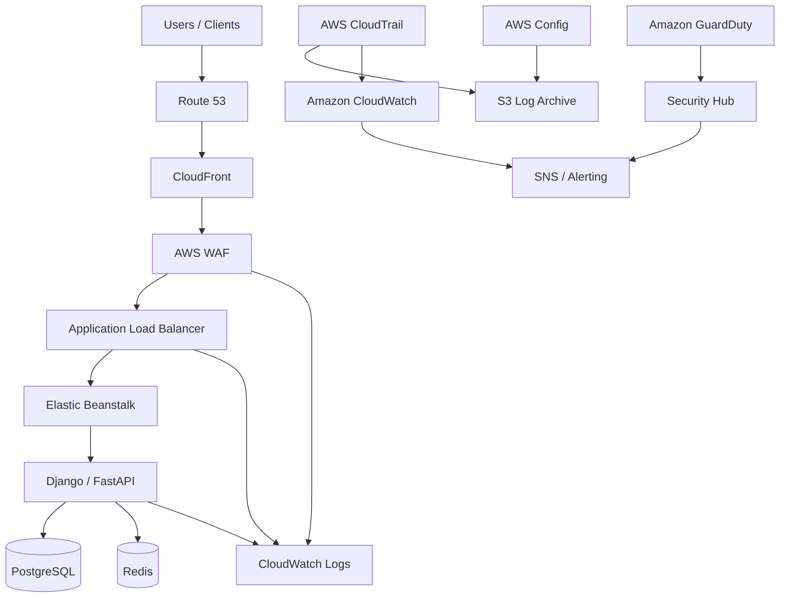
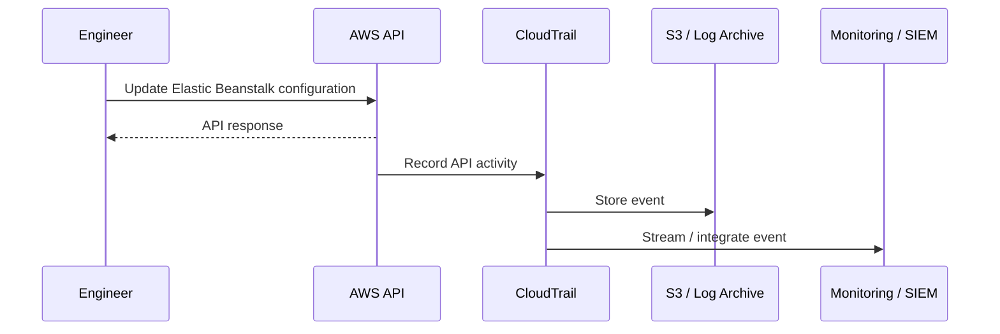
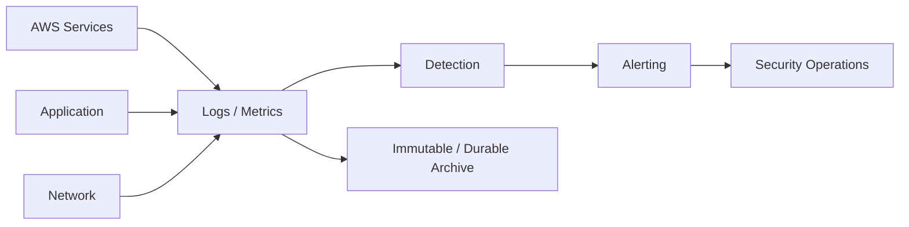
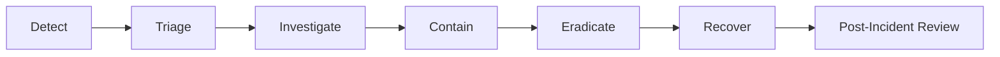

# 09- Security Monitoring and Compliance

## Overview

Security monitoring for an AWS Elastic Beanstalk environment is the continuous process of collecting, correlating, and reviewing security-relevant signals across the application, load balancer, AWS infrastructure, identity layer, and data services.

Elastic Beanstalk simplifies application deployment, but it does not remove the operational responsibility for security visibility. A production environment should be able to answer questions such as:

- Who changed the environment?
- Which IAM principal performed the change?
- Which application version was deployed?
- Which requests were blocked?
- Which security groups or IAM policies changed?
- Did an EC2 instance become unhealthy?
- Did application errors increase after a deployment?
- Are suspicious authentication attempts occurring?
- Can security events be investigated after the fact?
- Can the organization demonstrate compliance with required controls?

A useful production model is:

```text
                    Security Monitoring
                           │
        ┌──────────────────┼──────────────────┐
        │                  │                  │
        ▼                  ▼                  ▼
   AWS Control        Application          Network
     Plane              Layer               Layer
        │                  │                  │
   CloudTrail         App Logs            ALB Logs
   IAM Events         Auth Logs            WAF Logs
   Config Changes     Audit Logs          VPC Flow Logs
        │                  │                  │
        └──────────────────┼──────────────────┘
                           ▼
                    Centralized Logging
                           │
                           ▼
                    Detection / Alerts
                           │
                           ▼
                    Incident Response
```

The goal is not to collect every possible log. The goal is to collect enough trustworthy telemetry to detect, investigate, and respond to security and operational events.

## Security Monitoring Architecture

A production Elastic Beanstalk architecture can integrate several AWS services:



Each service answers a different class of question.

| Service | Primary monitoring purpose |
|---|---|
| CloudTrail | AWS API activity and account actions |
| CloudWatch | Metrics, logs, alarms, operational monitoring |
| CloudWatch Logs | Centralized application and infrastructure logs |
| AWS Config | Resource configuration and compliance state |
| WAF logs | HTTP security decisions |
| ALB access logs | HTTP request traffic |
| VPC Flow Logs | Network flow visibility |
| GuardDuty | Threat detection |
| Security Hub | Security findings aggregation |
| S3 | Durable log archival |
| SNS | Alert delivery |

## Security Monitoring vs Compliance

Security monitoring and compliance overlap, but they are not the same.

**Security monitoring** asks:

> Is something suspicious or dangerous happening now?

**Compliance** asks:

> Can we demonstrate that required security controls exist and operate as expected?

For example:

```text
CloudTrail
    │
    ├── Security monitoring
    │     └── Detect unexpected API activity
    │
    └── Compliance
          └── Demonstrate auditable AWS activity
```

A production environment should support both.

## CloudTrail

AWS CloudTrail records AWS API activity and provides an audit trail for actions performed against AWS resources.

For Elastic Beanstalk, CloudTrail can help identify events such as:

```text
CreateEnvironment
UpdateEnvironment
TerminateEnvironment
UpdateApplicationVersion
ModifyConfigurationTemplate
```

The exact API events depend on the AWS service and operation.

The important operational question is:

```text
Who
  ↓
performed what action
  ↓
on which resource
  ↓
at what time
  ↓
from where?
```

CloudTrail is therefore a foundational component of AWS security auditing.

## CloudTrail Event Flow



CloudTrail should be configured so that security-relevant activity remains available for investigation and audit requirements.

## What CloudTrail Should Answer

A useful CloudTrail investigation should allow you to determine:

| Question | Relevant information |
|---|---|
| Who made the change? | IAM principal |
| What changed? | API event |
| When? | Event timestamp |
| Which resource? | Resource identifiers |
| From where? | Source IP / context |
| How was access obtained? | Identity/session information |
| Was the action successful? | API result |
| Was it automated? | Role/session context |

This makes CloudTrail especially important for investigating unauthorized infrastructure changes.

## CloudTrail and IAM

IAM controls access.

CloudTrail records activity.

```text
IAM
 │
 └── Determines whether action is permitted

CloudTrail
 │
 └── Records the action that occurred
```

These controls complement each other.

A strong security model should use least-privilege IAM policies while retaining audit records of privileged activity.

## CloudTrail Log Storage

Security logs should not depend exclusively on the application environment that is being monitored.

A common architecture is:

```text
Production Account
      │
      ▼
CloudTrail
      │
      ▼
Centralized Log Archive
      │
      ▼
S3
```

This provides separation between:

- The workload.
- The application operators.
- The audit records.

This separation is important because an attacker who compromises an application environment should not automatically be able to erase its security history.

## CloudWatch

Amazon CloudWatch provides metrics, logs, alarms, dashboards, and related monitoring capabilities.

For Elastic Beanstalk, CloudWatch can monitor:

```text
EC2
ALB
Elastic Beanstalk
Application logs
WAF
Database
Redis
Custom application metrics
```

CloudWatch is primarily an operational monitoring platform, but its telemetry can also support security detection.

## Security-Relevant CloudWatch Metrics

Useful signals include:

| Metric / Signal | Security relevance |
|---|---|
| ALB request count | Traffic anomalies |
| ALB 4xx | Client/auth failures |
| ALB 5xx | Application/service failures |
| Target response time | Resource exhaustion |
| WAF blocked requests | Malicious traffic |
| WAF allowed requests | Traffic baseline |
| EC2 CPU | Resource exhaustion |
| EC2 network traffic | Traffic anomalies |
| Application login failures | Credential abuse |
| Database connections | Resource exhaustion |
| Worker queue depth | Abuse of asynchronous workloads |

Security monitoring should correlate multiple signals rather than rely on one metric.

## CloudWatch Logs

Elastic Beanstalk applications commonly produce several classes of logs:

```text
Application logs
Web server logs
Platform logs
Deployment logs
```

A useful logging architecture is:

```text
Elastic Beanstalk
       │
       ├── Application logs
       ├── Web server logs
       └── Platform logs
               │
               ▼
        CloudWatch Logs
               │
        ┌──────┴──────┐
        ▼             ▼
     Search         Alerts
```

Logs should contain enough context to investigate incidents without exposing sensitive information.

## Application Security Logs

Django and FastAPI applications should produce security-relevant events such as:

```text
Authentication failure
Authentication success
Authorization failure
Password reset request
Account state change
Administrative action
Sensitive configuration change
API key creation/revocation
Tenant permission change
```

Do not log passwords, access tokens, session secrets, or other credentials.

## Structured Logging

For production systems, structured JSON logs are generally easier to search and correlate than unstructured strings.

Example:

```json
{
  "timestamp": "2026-08-13T10:30:00Z",
  "level": "WARNING",
  "event": "authentication_failure",
  "user_id": "user-123",
  "request_id": "req-8f7a",
  "source_ip": "203.0.113.10",
  "path": "/api/login"
}
```

The example intentionally avoids recording the user's password or authentication secret.

Useful fields include:

- Timestamp.
- Severity.
- Event name.
- Request ID.
- User or tenant identifier where appropriate.
- Source IP where appropriate.
- HTTP method.
- Endpoint.
- Result.
- Correlation ID.

## Request Correlation

Security investigation becomes significantly easier when requests can be correlated across services.

```text
Client
  │
  ▼
ALB
  │
  ▼
Django / FastAPI
  │
  ├── PostgreSQL
  ├── Redis
  └── Celery
```

A request identifier can connect:

```text
ALB request
    ↓
Application log
    ↓
Database-related log
    ↓
Celery task
```

For distributed systems, correlation IDs become increasingly important.

## Authentication Monitoring

Authentication failures are an important security signal.

Monitor patterns such as:

```text
Repeated failures from one IP
Repeated failures against one account
Failures across many accounts
Successful login after many failures
Impossible geographic patterns
Unusual administrative login activity
```

A single failed login is generally not interesting.

A sudden increase in failures across thousands of accounts is.

## Authorization Monitoring

Authentication establishes identity.

Authorization determines whether the identity may perform an action.

Security logs should therefore distinguish:

```text
401 Unauthorized
```

from:

```text
403 Forbidden
```

A sudden increase in authorization failures may indicate:

- Broken client behavior.
- Permission misconfiguration.
- Enumeration attempts.
- Privilege escalation attempts.
- Abuse of APIs.

## Administrative Activity

Administrative operations should have stronger audit visibility.

Examples:

```text
Create admin user
Delete admin user
Change permissions
Rotate credentials
Modify security groups
Modify IAM policies
Change WAF rules
Change Elastic Beanstalk configuration
Deploy application
Terminate environment
```

These actions should be attributable to a human or automation identity.

Avoid shared administrator accounts.

## AWS Config

AWS Config records resource configuration and can evaluate whether resources comply with defined configuration rules.

For example, an organization may require:

```text
Security groups
 └── Must not allow unrestricted administrative ports

S3 buckets
 └── Must not be publicly accessible

IAM
 └── Privileged access must follow policy

Resources
 └── Required tags must exist
```

AWS Config is therefore useful for configuration compliance rather than request-level security monitoring.

## Configuration Drift

A major operational problem is configuration drift.

For example:

```text
Infrastructure as Code
        │
        ▼
Expected configuration

Production
        │
        ▼
Actual configuration
```

If someone manually changes a security group:

```text
Expected: TCP 443 only
Actual:   TCP 443 + TCP 22 from 0.0.0.0/0
```

the infrastructure is no longer aligned with the intended security baseline.

AWS Config can help identify such configuration differences.

## CloudTrail vs AWS Config

These services answer different questions.

| Question | CloudTrail | AWS Config |
|---|---:|---:|
| Who changed a resource? | Yes | No |
| What API action occurred? | Yes | Indirectly |
| What is the current configuration? | No | Yes |
| Was configuration changed? | Activity | State comparison |
| Compliance evaluation | Limited | Strong |
| Audit trail | Strong | Configuration-focused |

A mature environment can use both.

## VPC Flow Logs

VPC Flow Logs capture information about network traffic flowing through supported network interfaces and other supported VPC resources.

They can help answer:

```text
Which network sources are communicating?
Which destination is receiving traffic?
Which ports are being used?
Is unexpected network communication occurring?
```

Example:

```text
Internet
   │
   ▼
ALB
   │
   ▼
EC2
   │
   ├── PostgreSQL
   └── Redis
```

Flow logs can help investigate unexpected connections between these components.

## VPC Flow Logs Limitations

Flow Logs do not provide full packet contents.

They are primarily network-flow telemetry.

They should therefore complement:

```text
WAF logs
ALB logs
Application logs
CloudTrail
```

rather than replace them.

## WAF Monitoring

AWS WAF provides security telemetry around HTTP request decisions.

Important signals include:

```text
Allowed requests
Blocked requests
Counted requests
Rate-limited requests
Managed rule matches
IP rule matches
```

A sudden increase in blocked requests can indicate:

```text
Attack
   OR
Security scanner
   OR
False positive
```

The event must be correlated with other telemetry.

## ALB Access Logs

ALB access logs provide HTTP-level request information.

Useful fields can help investigate:

```text
Client
Request
Target
Response
Status
Latency
```

A common investigation pattern is:

```text
WAF blocked requests ↑
        │
        ▼
ALB request pattern
        │
        ▼
Application logs
        │
        ▼
Database / dependency metrics
```

This creates an end-to-end view.

## GuardDuty

Amazon GuardDuty is a threat detection service that analyzes AWS account, workload, and network activity to identify potentially malicious behavior.

It can produce findings related to areas such as:

- Credential compromise.
- Suspicious API activity.
- Network reconnaissance.
- Potential malware activity.
- Compromised resources.

GuardDuty complements CloudTrail, CloudWatch, WAF, and application logging.

It does not replace them.

## Security Hub

AWS Security Hub can aggregate security findings and provide a centralized view of security posture.

A larger environment may have:

```text
GuardDuty
AWS Config
IAM-related findings
Other AWS security services
        │
        ▼
Security Hub
        │
        ▼
Security Operations
```

This is useful when multiple security signals need centralized triage.

## Security Monitoring Pipeline

A production monitoring pipeline can look like:



The key distinction is between:

```text
Collection
   ↓
Detection
   ↓
Alerting
   ↓
Response
```

Collecting logs without detection and response does not create an effective security monitoring system.

## Security Alerts

Alerts should represent actionable conditions.

Good alert:

```text
More than 100 failed administrative logins
from multiple source IPs within 5 minutes.
```

Weak alert:

```text
A login failed.
```

The second creates excessive noise.

Alert design should consider:

- Severity.
- Frequency.
- Context.
- Expected behavior.
- Business impact.
- Response procedure.

## Alert Severity

A simple classification can be:

| Severity | Example |
|---|---|
| Critical | Confirmed credential compromise |
| High | Unauthorized privileged action |
| Medium | Suspicious traffic pattern |
| Low | Single authentication anomaly |
| Informational | Normal administrative change |

The exact classification should align with the organization's incident-response policy.

## Security Baselines

Before detecting anomalies, establish a baseline.

Examples:

```text
Normal API requests/minute
Normal login failures
Normal administrative activity
Normal outbound network destinations
Normal deployment frequency
Normal WAF block rate
Normal EC2 network traffic
```

Without a baseline, anomaly detection produces excessive noise.

## Deployment Monitoring

Elastic Beanstalk deployments should be monitored as security-sensitive events.

A deployment changes executable code.

Monitor:

```text
Application version
Deployment identity
Deployment time
Environment
Configuration changes
Health status
Error rate
```

A useful operational correlation is:

```text
Deployment
   │
   ▼
Application errors
   │
   ├── 5xx ↑
   ├── latency ↑
   ├── authentication failures ↑
   └── WAF matches ↑
```

This helps distinguish an attack from a faulty deployment.

## CI/CD Security Monitoring

A CI/CD pipeline should produce auditable deployment events.

Example:

```text
GitHub Actions
      │
      ▼
AWS deployment role
      │
      ▼
Elastic Beanstalk
      │
      ▼
Production
```

The deployment role should be identifiable in CloudTrail.

Avoid giving CI/CD systems broad permanent credentials.

Prefer short-lived or federated access mechanisms where supported by the organization's architecture.

## Monitoring IAM Changes

IAM changes are among the highest-value events to monitor.

Examples include:

```text
CreateUser
CreateRole
AttachPolicy
PutRolePolicy
DeleteRole
UpdateAssumeRolePolicy
CreateAccessKey
DeleteAccessKey
```

Particularly important are changes that increase privileges.

A useful detection concept is:

```text
Privilege policy changed
        │
        ▼
CloudTrail event
        │
        ▼
Security alert
        │
        ▼
Human investigation
```

## Security Log Retention

Retention should be determined by:

- Compliance requirements.
- Incident-response requirements.
- Business requirements.
- Cost.
- Regulatory requirements.
- Data sensitivity.

A common architecture is:

```text
Hot logs
   │
   ▼
CloudWatch Logs

Long-term archive
   │
   ▼
S3
```

Older logs can use lower-cost storage classes where appropriate.

Do not choose retention periods solely based on cost.

Security incidents can be discovered long after the original event.

## Protecting Logs

Security logs themselves require security controls.

Use:

```text
Encryption
+
Least-privilege access
+
Access logging
+
Retention controls
+
Deletion protection where appropriate
```

Security analysts may need read access without having permission to delete evidence.

Application developers should not automatically have unrestricted access to all security logs.

## Sensitive Data in Logs

Logging can create a secondary security vulnerability.

Never casually log:

```text
Passwords
Access tokens
Refresh tokens
API secrets
Private keys
Session cookies
Credit card data
Sensitive personal information
```

A safer pattern is:

```json
{
  "event": "authentication_failure",
  "user_id": "user-123",
  "request_id": "req-456",
  "reason": "invalid_credentials"
}
```

instead of logging the credential itself.

## Log Injection

Applications should also consider log injection.

Untrusted values can contain:

```text
Newlines
Control characters
Fake log entries
Unexpected structured fields
```

Use structured logging libraries and appropriate sanitization.

Do not blindly concatenate arbitrary user input into security logs.

## Compliance Controls

Common compliance requirements can involve controls around:

```text
Identity
Access control
Encryption
Logging
Monitoring
Change management
Network security
Data retention
Incident response
Backup and recovery
```

The exact requirements depend on the applicable framework.

Examples of common frameworks include:

- SOC 2.
- ISO 27001.
- PCI DSS.
- HIPAA.
- GDPR-related controls.

Do not assume that deploying an AWS service automatically makes an application compliant.

Compliance is an organizational and system-level responsibility.

## Shared Responsibility

AWS secures the underlying cloud infrastructure.

The customer remains responsible for configuration and workload security.

For Elastic Beanstalk, this includes areas such as:

```text
IAM
Security groups
Application code
Secrets
Data protection
Logging configuration
Access policies
Network architecture
Operating configuration
```

The exact responsibility depends on the service and deployment architecture.

The practical principle is:

> A managed AWS service reduces operational responsibility; it does not eliminate security responsibility.

## Compliance Evidence

A compliance process often requires evidence such as:

```text
CloudTrail configuration
AWS Config results
IAM policies
Security group configuration
Encryption settings
Log retention settings
Deployment records
Incident records
Backup evidence
Access reviews
```

Evidence should be reproducible rather than manually assembled only when an audit begins.

## Infrastructure as Code and Compliance

Infrastructure as Code makes compliance easier to operationalize.

Example:

```text
Terraform / CloudFormation
        │
        ├── IAM
        ├── Security Groups
        ├── Elastic Beanstalk
        ├── WAF
        ├── Logging
        └── Monitoring
```

A security control can then become part of the deployment process rather than an undocumented manual configuration.

## Preventive vs Detective Controls

Security controls can be divided into categories.

| Control type | Example |
|---|---|
| Preventive | IAM least privilege |
| Preventive | Security group restrictions |
| Preventive | WAF blocking |
| Detective | CloudTrail |
| Detective | GuardDuty |
| Detective | CloudWatch alarms |
| Corrective | Automated remediation |
| Recovery | Backup and restore |

A mature architecture uses all relevant control types.

## Automated Remediation

Some findings can be automatically remediated.

Example:

```text
Security group opens SSH to Internet
          │
          ▼
AWS Config detects violation
          │
          ▼
Event / automation
          │
          ▼
Remediation
```

Automation should be used carefully.

A badly designed remediation can disrupt production.

For critical resources, a safer workflow may be:

```text
Detection
   ↓
Alert
   ↓
Human approval
   ↓
Remediation
```

rather than automatically modifying production networking.

## Incident Response

Security monitoring is valuable only when incidents can be acted upon.

A basic incident flow is:



Monitoring systems should therefore be designed around actual incident-response procedures.

## Example Security Investigation

Suppose WAF blocked requests suddenly increase.

Start with:

```text
WAF
 │
 └── Which rule is matching?
```

Then:

```text
ALB
 │
 └── What is the traffic pattern?
```

Then:

```text
Application
 │
 └── Which endpoints are being targeted?
```

Then:

```text
Database / Redis / Celery
 │
 └── Is downstream capacity affected?
```

Finally:

```text
CloudTrail / GuardDuty
 │
 └── Are there related infrastructure or identity events?
```

This avoids investigating each telemetry source in isolation.

## Security Monitoring for Django and FastAPI

A backend application should expose security-relevant telemetry without exposing sensitive data.

Useful application events include:

```text
authentication_success
authentication_failure
authorization_failure
admin_action
password_reset_requested
api_key_created
api_key_revoked
suspicious_request
rate_limit_exceeded
```

A structured event might look like:

```json
{
  "event": "authorization_failure",
  "request_id": "req-123",
  "user_id": "user-456",
  "tenant_id": "tenant-789",
  "method": "POST",
  "path": "/api/admin/users",
  "status": 403
}
```

The exact fields should follow the application's privacy and security requirements.

## Monitoring Multi-Tenant Applications

For a multi-tenant backend, security monitoring should preserve tenant context where appropriate.

For example:

```text
request_id
user_id
tenant_id
endpoint
action
result
```

This makes it possible to investigate:

```text
Did one tenant access another tenant's resources?
```

However, tenant identifiers may themselves be sensitive depending on the system.

Logging should therefore follow data-classification requirements.

## Security Monitoring for Background Jobs

Security events do not necessarily originate from HTTP requests.

Celery workers can perform sensitive operations such as:

```text
Export data
Send email
Generate reports
Modify records
Call external systems
```

Monitor:

```text
Task type
Task identity
Request correlation ID
Initiating user/tenant
Success/failure
Execution duration
```

For high-value operations, maintain an application-level audit trail.

## Audit Logs vs Application Logs

These should not necessarily be treated as identical.

**Application logs** answer:

```text
What happened during application execution?
```

**Audit logs** answer:

```text
What security-relevant business action occurred?
Who initiated it?
What was changed?
```

For example:

```text
Application log:
"POST /api/users/123 completed with 200"

Audit event:
"user-456 changed user-123 role from viewer to admin"
```

The second is much more useful for compliance and security investigations.

## Immutable Audit Trails

For high-value audit events, consider a design where application users cannot modify the audit record after creation.

A conceptual architecture is:

```text
Application
    │
    ▼
Audit Event
    │
    ▼
Centralized Audit Store
    │
    ├── Restricted write access
    ├── Restricted read access
    └── Controlled retention
```

For regulated environments, additional immutability controls may be appropriate depending on requirements.

## Security Dashboards

A useful security dashboard should focus on actionable signals.

Example:

```text
Security Dashboard
├── WAF blocked requests
├── WAF rate-limit events
├── Authentication failures
├── Authorization failures
├── Privileged IAM changes
├── GuardDuty findings
├── Security Config violations
├── ALB 4xx / 5xx
├── Unusual network activity
└── Recent deployments
```

Avoid dashboards containing hundreds of metrics with no operational interpretation.

## Monitoring Availability and Security Together

Security incidents often manifest as availability problems.

For example:

```text
Attack
  ↓
High request rate
  ↓
CPU saturation
  ↓
Latency increases
  ↓
Database connections increase
  ↓
5xx errors
```

Therefore security monitoring should be integrated with normal reliability monitoring.

A security event is often both:

```text
Security incident
+
Reliability incident
```

## Common Mistakes

### Logging Everything

**Problem:** Excessive logging increases cost and noise and may accidentally expose sensitive data.

**Better:** Define security-relevant events and log structured, useful context.

### Logging Secrets

**Problem:** Passwords, tokens, and API keys become accessible through logs.

**Better:** Redact secrets before logging and enforce logging standards.

### Treating CloudWatch as the Entire Security Strategy

**Problem:** CloudWatch provides monitoring but does not replace IAM, WAF, GuardDuty, CloudTrail, Config, or application security.

**Better:** Build a layered security monitoring architecture.

### Not Monitoring IAM Changes

**Problem:** Privilege escalation can occur without obvious application errors.

**Better:** Monitor privileged IAM API activity through CloudTrail and security tooling.

### No Centralized Log Storage

**Problem:** Logs can become difficult to access during an incident or disappear with the workload.

**Better:** Maintain an appropriately protected centralized archive.

### Allowing Developers to Delete Audit Logs

**Problem:** An application compromise or insider action could destroy investigation evidence.

**Better:** Separate workload access from security log administration.

### No Log Retention Strategy

**Problem:** Security evidence may disappear before an incident is discovered.

**Better:** Define retention according to compliance, business, and incident-response requirements.

### Alerting on Every Authentication Failure

**Problem:** High-volume noise makes useful alerts impossible to identify.

**Better:** Alert on patterns, thresholds, and anomalies.

### Ignoring False Positives

**Problem:** Security teams begin ignoring alerts.

**Better:** Tune detections and establish clear severity levels.

### Treating Compliance as a Checklist

**Problem:** A configuration may pass an audit checklist while the actual system remains insecure.

**Better:** Connect compliance controls to real security and operational risks.

### Relying Only on Manual Audits

**Problem:** Configuration can drift between audits.

**Better:** Continuously evaluate important controls.

### Not Correlating Events

**Problem:** Individual logs provide little context.

**Better:** Use request IDs, user IDs, tenant IDs, timestamps, and consistent event names where appropriate.

### Monitoring Only Infrastructure

**Problem:** Infrastructure can appear healthy while an attacker abuses business logic.

**Better:** Monitor application-level authentication, authorization, and business audit events.

## Production Monitoring Checklist

### AWS Control Plane

- [ ] CloudTrail is enabled according to organizational requirements.
- [ ] Security-relevant API activity is retained.
- [ ] Privileged IAM activity is monitored.
- [ ] CloudTrail logs have appropriate access controls.
- [ ] Security logs are protected from unauthorized deletion.

### Elastic Beanstalk

- [ ] Environment changes are auditable.
- [ ] Application deployments are attributable.
- [ ] Application logs are centralized.
- [ ] Platform and deployment logs are retained appropriately.
- [ ] Environment health is monitored.

### Network

- [ ] ALB access logging is configured where required.
- [ ] WAF logging is configured.
- [ ] VPC Flow Logs are enabled where justified.
- [ ] Security group changes are monitored.
- [ ] Unexpected network flows can be investigated.

### Application

- [ ] Authentication failures are monitored.
- [ ] Authorization failures are monitored.
- [ ] Administrative actions are audited.
- [ ] Sensitive events have structured audit records.
- [ ] Secrets are never written to logs.
- [ ] Request correlation is available.
- [ ] Background jobs can be traced to their initiators where appropriate.

### Detection

- [ ] GuardDuty is evaluated for the environment.
- [ ] Security Hub is evaluated where centralized findings are useful.
- [ ] AWS Config evaluates required configuration controls.
- [ ] Security alerts have defined severity levels.
- [ ] False-positive rates are reviewed.

### Compliance

- [ ] Required controls are documented.
- [ ] Evidence can be reproduced.
- [ ] Log retention matches requirements.
- [ ] Access reviews are performed.
- [ ] Infrastructure configuration is version controlled.
- [ ] Security changes are auditable.

### Incident Response

- [ ] Security alerts have owners.
- [ ] Escalation paths are defined.
- [ ] Incident-response procedures are documented.
- [ ] Security logs remain available during incidents.
- [ ] Recovery procedures have been tested.

## Interview Perspective

### What is the difference between CloudTrail and CloudWatch?

CloudTrail primarily records AWS API activity and provides an audit trail.

CloudWatch primarily provides metrics, logs, dashboards, and alarms.

```text
CloudTrail
 └── "Who performed this AWS API action?"

CloudWatch
 └── "What is happening with the system?"
```

Both can contribute to security monitoring.

### What is the difference between CloudTrail and AWS Config?

CloudTrail focuses on activity.

AWS Config focuses on resource configuration and compliance state.

```text
CloudTrail
 └── Who changed the security group?

AWS Config
 └── Is the security group currently compliant?
```

Using both provides stronger visibility.

### Why should security logs be stored separately from the application?

If an application or workload is compromised, an attacker should not automatically be able to delete the evidence required to investigate the incident.

Centralized, restricted log storage creates separation between:

```text
Workload
   ≠
Security evidence
```

### What should you log for an administrative action?

At minimum, capture enough context to establish:

```text
Who
What
When
Where
Target
Result
```

Avoid logging credentials or unnecessary sensitive data.

### Why are request IDs important?

A request ID allows engineers to correlate events across:

```text
ALB
 ↓
Django / FastAPI
 ↓
Redis
 ↓
PostgreSQL
 ↓
Celery
```

This is especially valuable during distributed-system security investigations.

### Is application logging enough for compliance?

No.

Compliance may require evidence covering:

```text
IAM
Infrastructure
Network
Configuration
Application
Data protection
Change management
Incident response
```

Application logs alone cannot establish all of these controls.

### Why is AWS Config useful?

AWS Config helps determine whether resources conform to desired configuration and compliance requirements.

It is particularly useful for detecting configuration drift.

### What is the difference between monitoring and auditing?

Monitoring focuses on detecting and responding to current or emerging conditions.

Auditing focuses on establishing what happened and providing evidence.

```text
Monitoring
 └── "Is something wrong?"

Auditing
 └── "What happened, who did it, and can we prove it?"
```

### How would you detect an unauthorized security group change?

A layered approach would be:

```text
CloudTrail
   ↓
Detect security group API activity
   ↓
Identify IAM principal
   ↓
Compare configuration
   ↓
AWS Config / policy evaluation
   ↓
Alert security team
```

### How would you investigate suspicious traffic against Elastic Beanstalk?

Correlate:

```text
WAF logs
   ↓
ALB access logs
   ↓
Application logs
   ↓
CloudWatch metrics
   ↓
VPC Flow Logs
   ↓
CloudTrail / GuardDuty
```

The goal is to establish the source, target, behavior, impact, and timeline.

### Why shouldn't every security event generate an alert?

Because alert fatigue reduces the effectiveness of security operations.

A single failed login is usually not actionable.

Thousands of failures across many accounts within minutes may be.

Detection should focus on patterns, thresholds, and anomalies.

### What is the relationship between GuardDuty and CloudTrail?

CloudTrail provides AWS activity data.

GuardDuty analyzes AWS telemetry and other supported data sources to identify potentially malicious behavior.

Conceptually:

```text
AWS activity
     ↓
Telemetry
     ↓
GuardDuty
     ↓
Security finding
```

### Why is Infrastructure as Code important for compliance?

IaC makes infrastructure configuration:

```text
Versioned
Reviewable
Repeatable
Auditable
```

Security controls can therefore become part of the deployment process rather than depending entirely on manual configuration.

## Key Takeaways

- Security monitoring for Elastic Beanstalk must cover AWS control-plane activity, application behavior, network traffic, infrastructure configuration, and security findings.
- CloudTrail provides an audit trail for AWS API activity and is foundational for investigating infrastructure and IAM changes.
- CloudWatch provides metrics, logs, alarms, and dashboards for operational and security monitoring.
- AWS Config focuses on resource configuration and compliance state and is useful for detecting configuration drift.
- WAF logs provide visibility into HTTP security decisions.
- ALB access logs provide request-level traffic visibility.
- VPC Flow Logs provide network-flow telemetry and complement application and WAF logs.
- GuardDuty provides managed threat detection based on supported AWS telemetry and activity.
- Security Hub can provide centralized visibility into security findings.
- Application logs should capture security-relevant events without exposing passwords, tokens, API keys, or other secrets.
- Structured logging improves searchability, correlation, and automated detection.
- Request IDs, user context, and tenant context can significantly improve distributed security investigations when handled appropriately.
- Application logs and audit logs serve different purposes and should not automatically be treated as interchangeable.
- Privileged IAM changes, administrative actions, deployments, and security configuration changes deserve higher monitoring priority.
- Security logs should have appropriate encryption, access controls, retention, and deletion protections.
- Centralized log storage reduces the risk that a compromised workload can destroy its own security evidence.
- Security monitoring and compliance are related but distinct: monitoring detects events, while compliance demonstrates that required controls exist and operate.
- Compliance requirements should drive retention, access control, encryption, audit, and evidence-collection decisions.
- Infrastructure as Code improves security consistency, auditability, and compliance by making infrastructure configuration version controlled and repeatable.
- Effective monitoring requires a complete pipeline: **collection → detection → alerting → investigation → response**.
- Alerts should be actionable and based on meaningful thresholds, patterns, and anomalies rather than individual low-value events.
- Security monitoring should be correlated with availability and performance monitoring because attacks frequently manifest as CPU saturation, latency, database exhaustion, queue growth, or HTTP errors.
- A mature Elastic Beanstalk security model combines **CloudTrail + CloudWatch + AWS Config + WAF + VPC Flow Logs + GuardDuty + application audit logging + centralized log storage** according to the workload's risk and compliance requirements.