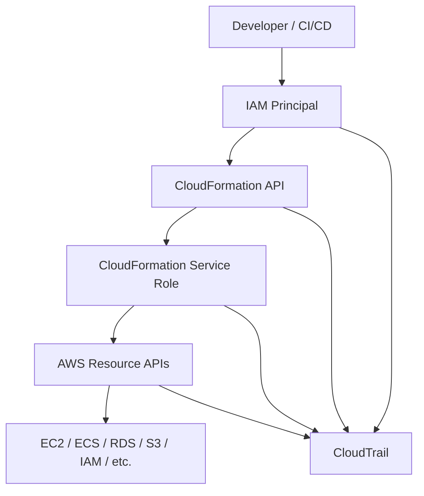
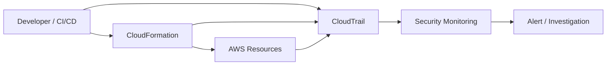
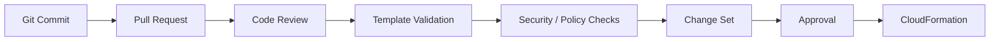
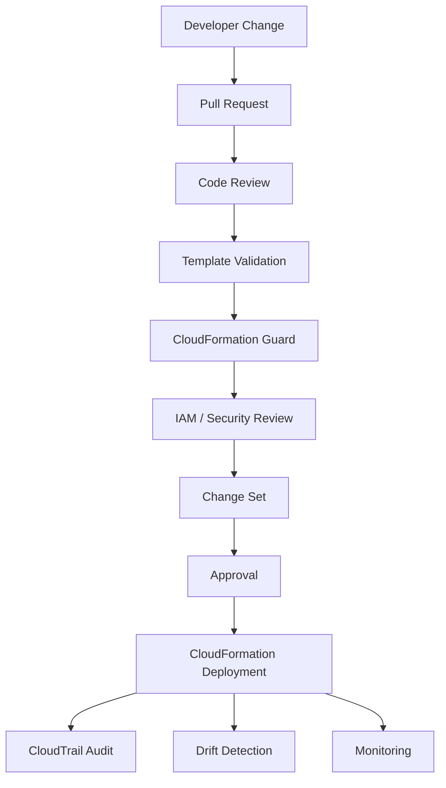

# 01- Security Overview

## Overview

CloudFormation security is the practice of controlling who can deploy infrastructure, what CloudFormation is allowed to provision, which resources can be modified or deleted, and how infrastructure changes are audited.

CloudFormation deserves special security attention because it is an infrastructure control plane. A principal that can create or update CloudFormation stacks may indirectly create, modify, or delete resources across multiple AWS services. Excessive CloudFormation permissions can therefore become a privilege-escalation path.

A production security model should protect several layers:

```text
Developer / CI/CD Principal
          |
          v
    CloudFormation API
          |
          v
   CloudFormation Role
          |
          v
   AWS Resource APIs
          |
          v
     AWS Resources
```

The security boundary is therefore larger than the `cloudformation:*` API itself.

AWS specifically recommends IAM access control, avoiding credentials in templates, CloudTrail auditing, least-privilege permissions, stack policies for critical resources, secure sensitive parameters, and policy-as-code controls such as CloudFormation Guard. :contentReference[oaicite:0]{index=0}

## CloudFormation Security Model

CloudFormation security can be viewed as multiple independent controls:

| Layer | Security Concern | Primary Controls |
|---|---|---|
| Identity | Who can use CloudFormation? | IAM, IAM Identity Center, federation |
| Authorization | What can the principal do? | IAM policies, conditions |
| Provisioning | What can CloudFormation create? | Service roles, SCPs, permissions boundaries |
| Resource Protection | What must not be changed? | Stack policies, termination protection |
| Secrets | How are sensitive values handled? | Secrets Manager, Parameter Store, dynamic references |
| Template Security | Is the template compliant? | Review, validation, CloudFormation Guard |
| Audit | Who changed infrastructure? | CloudTrail |
| Drift | Was infrastructure changed outside IaC? | Drift detection |
| Deployment | How are changes introduced? | CI/CD, Change Sets, approvals |

A strong implementation uses multiple layers rather than relying on a single IAM policy.

## Security Architecture

A production CloudFormation deployment should separate the identity initiating a deployment from the permissions CloudFormation uses to provision resources.



This separation provides a stronger security boundary:

```text
Who can deploy?
        ≠
What the deployment can provision?
```

That distinction becomes especially important in production environments.

## IAM and CloudFormation

IAM controls access to CloudFormation operations.

A principal may require permissions such as:

```text
cloudformation:CreateStack
cloudformation:UpdateStack
cloudformation:DescribeStacks
cloudformation:DescribeStackEvents
cloudformation:DeleteStack
```

The exact permissions should reflect the user's or automation role's responsibility.

AWS recommends granting only the minimum CloudFormation access required rather than giving every engineer unrestricted stack administration. :contentReference[oaicite:1]{index=1}

For example:

```text
Read-Only Engineer
    ↓
Inspect stacks and events

Deployment Role
    ↓
Create / Update stacks

Platform Administrator
    ↓
Broader infrastructure management
```

Do not automatically give every backend engineer:

```text
cloudformation:*
```

especially in production accounts.

## Direct Provisioning vs Service Role

CloudFormation can operate in two important security models.

### Direct Provisioning

Without a CloudFormation service role, CloudFormation uses the credentials of the IAM principal performing the stack operation. That principal therefore needs permissions to provision the resources defined in the template. :contentReference[oaicite:2]{index=2}

```text
Developer Role
      |
      +--> CloudFormation
              |
              +--> EC2
              +--> IAM
              +--> S3
              +--> RDS
```

This can make the deployment principal very powerful.

### Service Role

With a CloudFormation service role:

```text
Developer / CI Role
        |
        v
CloudFormation
        |
        v
CloudFormation Service Role
        |
        +--> EC2
        +--> IAM
        +--> S3
        +--> RDS
```

CloudFormation uses the service role's permissions when creating, updating, or deleting stack resources. :contentReference[oaicite:3]{index=3}

This allows the deployment principal and infrastructure provisioning permissions to be separated.

## CloudFormation Service Roles

A CloudFormation service role is an IAM role that CloudFormation assumes to perform operations on stack resources. :contentReference[oaicite:4]{index=4}

A trust policy typically allows CloudFormation to assume the role:

```yaml
Version: "2012-10-17"

Statement:
  - Effect: Allow
    Principal:
      Service:
        - cloudformation.amazonaws.com
    Action:
      - sts:AssumeRole
```

The permissions policy attached to the role should contain only the actions required by the stacks that use it.

Example:

```yaml
Version: "2012-10-17"

Statement:
  - Effect: Allow
    Action:
      - logs:CreateLogGroup
      - logs:CreateLogStream
      - logs:PutLogEvents
    Resource: "*"
```

The actual production policy should be derived from the resources the CloudFormation templates provision and scoped to resource ARNs wherever practical.

AWS recommends working backward from the templates to create least-privilege service roles. :contentReference[oaicite:5]{index=5}

## Service Role Security Risk

Service roles introduce an important privilege-escalation consideration.

Suppose:

```text
Developer
   |
   | Can deploy CloudFormation
   |
   v
CloudFormation Service Role
   |
   | Can create IAM roles
   | Can create Lambda
   | Can modify infrastructure
   v
AWS Account
```

If a developer can pass a highly privileged service role to CloudFormation, they may effectively obtain the service role's capabilities.

AWS specifically recommends controlling which service roles principals can pass and monitoring principals that can use privileged service roles. :contentReference[oaicite:6]{index=6}

A deployment principal should therefore be restricted with `iam:PassRole`.

Conceptually:

```text
CI/CD Role
    |
    +--> cloudformation:CreateStack
    |
    +--> iam:PassRole
             |
             +--> Only approved CloudFormation role
```

Avoid:

```text
iam:PassRole
Resource: "*"
```

when a narrower resource scope is possible.

## Controlling Service Role Usage

A deployment role can be constrained to specific CloudFormation service roles.

A policy can use the `cloudformation:RoleARN` condition key to restrict which CloudFormation service roles the principal can pass. AWS Prescriptive Guidance specifically recommends this approach as part of preventing privilege escalation. :contentReference[oaicite:7]{index=7}

Conceptually:

```text
CI/CD Role
    |
    | CreateStack
    |
    +--> AllowedRole = ProductionCloudFormationRole
```

This prevents the deployment principal from substituting an arbitrary highly privileged role.

## Least Privilege

Least privilege means granting only the permissions necessary for a task.

For CloudFormation, least privilege must be considered at three levels:

```text
1. CloudFormation API access
2. CloudFormation provisioning permissions
3. Permissions granted to provisioned resources
```

For example:

```text
CI/CD Role
    ↓
Can deploy approved CloudFormation stacks

CloudFormation Role
    ↓
Can create required infrastructure

ECS Task Role
    ↓
Can access only required application resources
```

These roles solve different problems and should not be merged unnecessarily.

AWS recommends applying least privilege to CloudFormation service roles and to the resources provisioned through CloudFormation. :contentReference[oaicite:8]{index=8}

## AWS Managed Policies

AWS provides managed CloudFormation policies such as:

```text
AWSCloudFormationFullAccess
AWSCloudFormationReadOnlyAccess
```

These can be useful for standard use cases, but AWS notes that managed policies may grant broader permissions than a specific workload requires. Customer-managed policies can provide more precise control. :contentReference[oaicite:9]{index=9}

For production deployment pipelines, prefer purpose-built roles with narrowly defined permissions.

## Template Security

CloudFormation templates are infrastructure code.

They can contain:

- IAM policies.
- Security group rules.
- S3 configuration.
- Database configuration.
- Network configuration.
- Encryption settings.
- Resource policies.
- References to sensitive values.

Treat templates with the same security discipline as application source code.

Recommended controls include:

- Git-based version control.
- Pull request review.
- Branch protection.
- Automated validation.
- Security scanning.
- Policy-as-code checks.
- Controlled deployment pipelines.
- Audit history.

AWS recommends code reviews and revision control for CloudFormation templates. :contentReference[oaicite:10]{index=10}

## Never Embed Credentials

Do not place credentials directly in templates:

```yaml
Parameters:

  DatabasePassword:
    Type: String
    Default: "SuperSecretPassword123"
```

This creates unnecessary exposure through source control, deployment artifacts, logs, and operational workflows.

Instead, store sensitive values in services such as:

- AWS Secrets Manager.
- AWS Systems Manager Parameter Store.

CloudFormation dynamic references can retrieve values from these services during stack operations without placing the actual secret value directly in the template. :contentReference[oaicite:11]{index=11}

## Dynamic References

A template can reference a secret managed outside CloudFormation.

For example:

```yaml
Resources:

  Database:
    Type: AWS::RDS::DBInstance
    Properties:
      DBInstanceClass: db.t4g.micro
      Engine: postgres
      MasterUsername: app_user
      MasterUserPassword: "{{resolve:secretsmanager:prod/database:SecretString:password}}"
```

The secret remains managed by Secrets Manager rather than being hardcoded into the template.

The exact resource and secret configuration should be designed according to the target AWS service's supported secret-reference behavior.

## `NoEcho` Is Not a Secret Store

CloudFormation parameters can use:

```yaml
Parameters:

  DatabasePassword:
    Type: String
    NoEcho: true
```

`NoEcho` prevents the parameter value from being displayed in several CloudFormation interfaces.

However, `NoEcho` does not make a value a secure secret-management solution. AWS explicitly notes that `NoEcho` does not prevent sensitive values from being logged by other services or resources that receive them. :contentReference[oaicite:12]{index=12}

Prefer:

```text
Secrets Manager
        ↓
Dynamic Reference
        ↓
CloudFormation Resource
```

for credentials and other secrets.

## Parameter Security

Parameters should use constraints where practical.

Example:

```yaml
Parameters:

  Environment:
    Type: String
    AllowedValues:
      - development
      - staging
      - production

  InstanceType:
    Type: String
    AllowedValues:
      - t3.small
      - t3.medium
      - t3.large
```

This reduces accidental or unauthorized configuration changes.

AWS recommends AWS-specific parameter types and parameter constraints as part of CloudFormation template best practices. :contentReference[oaicite:13]{index=13}

## Stack Policies

A stack policy can protect critical resources from unintended updates.

For example:

```text
Application Stack
│
├── ECS Service
├── Load Balancer
└── RDS Database  ← Critical
```

A stack policy can protect the database from unintended update actions.

Conceptually:

```json
{
  "Statement": [
    {
      "Effect": "Deny",
      "Action": "Update:*",
      "Principal": "*",
      "Resource": "LogicalResourceId/ProductionDatabase"
    }
  ]
}
```

Stack policies are specifically intended to help protect critical stack resources from unintended updates that could interrupt or replace them. :contentReference[oaicite:14]{index=14}

## Stack Policy Limitations

Stack policies should not be treated as a complete authorization mechanism.

They protect stack resource updates, but they do not replace:

- IAM.
- Service control policies.
- Permissions boundaries.
- Resource policies.
- Application-level authorization.

Think of the layers as:

```text
IAM
  ↓
Who can perform CloudFormation operations?

Stack Policy
  ↓
Which protected resources can the stack update?

Resource Policy / IAM
  ↓
What can the resulting resource do?
```

## Termination Protection

Termination protection prevents accidental deletion of a CloudFormation stack.

It is disabled by default and can be enabled for stacks that should not be casually deleted. :contentReference[oaicite:15]{index=15}

Example:

```bash
aws cloudformation update-termination-protection \
  --stack-name production-backend \
  --enable-termination-protection
```

For critical production stacks:

```text
Production Database Stack
        |
        v
Termination Protection
        |
        v
Accidental Delete
        |
        X
```

Termination protection is especially useful for critical environments, but it should not replace proper IAM authorization and deployment controls.

## Stack Policies vs Termination Protection

| Control | Protects Against | Scope |
|---|---|---|
| IAM | Unauthorized operations | API / principal |
| Service Role | Excessive provisioning permissions | Stack execution |
| Stack Policy | Unintended protected-resource updates | Resource updates |
| Termination Protection | Accidental stack deletion | Entire stack |
| SCP | Organization-level restrictions | Account / OU |
| Permissions Boundary | Maximum role permissions | IAM principal |

These controls solve different problems and should be layered.

## Change Sets

Change Sets allow engineers to inspect proposed stack changes before execution.

A production workflow should look like:

```text
Template Change
      |
      v
Validation
      |
      v
Change Set
      |
      v
Review
      |
      v
Execute
```

Change Sets can reveal resources that will be:

- Added.
- Modified.
- Replaced.
- Removed.

AWS recommends using Change Sets to preview changes before executing updates. :contentReference[oaicite:16]{index=16}

## Replacement Risk

Security review should pay particular attention to resource replacement.

For example:

```text
Template Change
      |
      v
RDS Property Change
      |
      v
Replacement Required
      |
      v
Potential Data Loss / Downtime
```

A change that appears small in YAML can have a significant infrastructure consequence.

Review the Change Set rather than assuming that a template diff accurately represents runtime impact.

## Drift Detection

Drift occurs when deployed resources differ from the configuration defined by CloudFormation.

Example:

```text
CloudFormation Template
        |
        v
Expected Security Group
        |
        X
Manual Console Change
        |
        v
Actual Security Group
```

CloudFormation drift detection can identify resources whose configuration has changed outside CloudFormation management. AWS recommends using drift detection regularly. :contentReference[oaicite:17]{index=17}

## Drift Security Risk

Drift can create security vulnerabilities.

For example:

```text
IaC:
Database SG → private application access only

Manual Change:
Database SG → 0.0.0.0/0
```

The source-controlled template may appear secure while the deployed infrastructure is not.

Therefore:

```text
Template Security
       +
Deployed-State Verification
```

are both required.

## CloudTrail Auditing

AWS CloudTrail records CloudFormation API activity, including API calls made through the console, CLI, and APIs. :contentReference[oaicite:18]{index=18}

A security investigation can therefore trace:

```text
Principal
   |
   v
CloudFormation API Call
   |
   v
Stack
   |
   v
Infrastructure Change
```

Useful events include operations such as:

```text
CreateStack
UpdateStack
DeleteStack
CreateChangeSet
ExecuteChangeSet
UpdateStackSet
DeleteStack
```

CloudTrail should be integrated into the organization's broader audit and security monitoring strategy.

## Security Audit Flow



This provides an audit trail for infrastructure operations.

## CI/CD Security

Production CloudFormation deployments should preferably occur through a controlled CI/CD system rather than unrestricted manual console operations.

A secure pipeline can look like:



The pipeline role should have only the permissions required for the approved deployment workflow.

AWS Prescriptive Guidance identifies deployment pipelines as a recommended approach for deploying CloudFormation stacks and StackSets. :contentReference[oaicite:19]{index=19}

## Policy as Code

Security controls should be checked before infrastructure reaches AWS.

AWS CloudFormation Guard provides policy-as-code capabilities for validating templates against organizational rules. :contentReference[oaicite:20]{index=20}

For example, an organization could enforce:

```text
Every S3 bucket
    → Encryption required

Every RDS instance
    → Storage encryption required

Every resource
    → Required tags

Every security group
    → No unrestricted administrative ingress
```

The pipeline becomes:

```text
Template
   |
   v
CloudFormation Guard
   |
   +--> PASS → Continue
   |
   └--> FAIL → Reject
```

This moves security enforcement earlier in the development lifecycle.

## Example Policy Rules

A conceptual policy might require encryption:

```text
rule encrypted_resources {
    Resources.*.Properties.Encrypted == true
}
```

The exact Guard syntax should match the resource schema and organizational policy.

The important architectural principle is:

```text
Security Policy
      ↓
Automated Validation
      ↓
Deployment Gate
```

## Service Control Policies

In AWS Organizations environments, Service Control Policies can provide an additional preventive boundary.

The relationship can be:

```text
CloudFormation Role
        |
        v
IAM Permissions
        |
        v
SCP Boundary
        |
        v
AWS Service
```

Even if the CloudFormation role has an action allowed by IAM, an applicable SCP can still prevent the action.

SCPs are therefore useful for organization-wide restrictions such as preventing certain services, Regions, or dangerous actions.

They should complement, not replace, least-privilege IAM.

## Permissions Boundaries

Permissions boundaries can constrain the maximum permissions that an IAM role created or managed through CloudFormation can receive.

This is particularly useful when templates are allowed to create IAM roles.

Conceptually:

```text
CloudFormation
      |
      v
Create IAM Role
      |
      v
Permissions Boundary
      |
      v
Maximum Effective Permissions
```

This reduces the risk that a template creates an unexpectedly privileged workload role.

## IAM Resource Creation Risk

CloudFormation templates can create IAM resources.

For example:

```yaml
Resources:

  ApplicationRole:
    Type: AWS::IAM::Role
    Properties:
      AssumeRolePolicyDocument:
        Version: "2012-10-17"
        Statement:
          - Effect: Allow
            Principal:
              Service:
                - ecs-tasks.amazonaws.com
            Action:
              - sts:AssumeRole
```

The security review should examine both:

```text
Who can deploy the stack?
        +
What IAM resources can the stack create?
```

A CloudFormation deployment role that can create arbitrary IAM roles is a high-impact privilege.

## Cross-Account Security

In multi-account environments:

```text
Organization
│
├── Security Account
├── Network Account
├── Development Account
└── Production Account
```

StackSets and cross-account deployments introduce additional trust relationships.

Security controls should define:

- Which account can administer StackSets.
- Which OUs can be targeted.
- Which roles can be assumed.
- Which Regions can be deployed to.
- Which resources can be provisioned.
- Which deployment pipelines can initiate changes.

The larger the organization, the more important centralized governance becomes.

## Secrets in Outputs

Do not expose secrets through CloudFormation Outputs.

Avoid:

```yaml
Outputs:

  DatabasePassword:
    Value: !Ref DatabasePassword
```

Outputs can become visible to users and systems with permissions to inspect the stack.

Prefer returning identifiers or non-sensitive metadata:

```yaml
Outputs:

  DatabaseEndpoint:
    Value: !GetAtt Database.Endpoint.Address
```

Sensitive values should remain in dedicated secret-management systems.

## Sensitive Values in Logs

A secure template can still leak secrets if downstream systems log them.

For example:

```text
CloudFormation
      |
      v
Lambda
      |
      v
CloudWatch Logs
```

If Lambda logs a secret retrieved from Secrets Manager, the secret is now exposed in logs.

Therefore:

```text
Secret
   |
   X
Application Logs
```

should be an explicit security invariant.

## Resource-Level Security

CloudFormation itself does not make the resulting resources secure.

A template that creates:

```text
RDS
S3
ECS
Lambda
Security Groups
IAM Roles
```

must apply the security controls of each service.

For example:

```text
CloudFormation
      |
      +--> RDS
      |     └── Encryption / Network Isolation
      |
      +--> S3
      |     └── Encryption / Block Public Access
      |
      +--> ECS
      |     └── Task Role / Network Controls
      |
      +--> IAM
            └── Least Privilege
```

CloudFormation is the provisioning mechanism; service-specific security controls still apply.

## Network Security

CloudFormation templates frequently define networking resources.

Security review should inspect:

- VPC boundaries.
- Subnet placement.
- Route tables.
- Security groups.
- Network ACLs.
- Internet gateways.
- NAT gateways.
- VPC endpoints.
- Load balancer exposure.

A common production backend architecture is:

```text
Internet
   |
   v
ALB
   |
   v
Private Application Subnets
   |
   +--> PostgreSQL
   +--> Redis
```

The CloudFormation template should preserve the intended network isolation.

## Security Groups

Avoid unrestricted ingress unless explicitly required.

Dangerous:

```yaml
SecurityGroupIngress:
  - IpProtocol: tcp
    FromPort: 5432
    ToPort: 5432
    CidrIp: 0.0.0.0/0
```

Prefer security-group-to-security-group relationships where appropriate:

```text
ALB SG
  |
  v
Application SG
  |
  v
Database SG
```

This creates an explicit trust path instead of exposing database ports publicly.

## Encryption

Security-sensitive resources should use encryption where supported and appropriate.

Typical examples include:

```text
S3
RDS
EBS
Secrets Manager
SQS
SNS
CloudWatch Logs
```

Use AWS KMS when customer-managed key control is required.

A production template should make encryption decisions explicit rather than relying on accidental defaults.

## KMS Considerations

Encryption introduces an additional authorization boundary.

```text
CloudFormation Role
       |
       v
AWS Resource
       |
       v
KMS Key
```

The effective security model may therefore depend on both the resource policy and KMS key policy.

When using customer-managed KMS keys, review:

- Key policy.
- IAM permissions.
- Grants.
- Cross-account access.
- Key rotation requirements.
- Deletion protection requirements.

## Monitoring and Alerting

Security monitoring should identify unexpected CloudFormation activity.

Potential alerts include:

```text
Unexpected DeleteStack
Unexpected UpdateStack
Unexpected IAM Resource Creation
Unexpected StackSet Operation
Unexpected Production Deployment
CloudFormation Role Assumption
```

A useful security workflow is:

```text
CloudTrail
    |
    v
Event Detection
    |
    v
Security Rule
    |
    +--> Expected → Record
    |
    └--> Unexpected → Alert
```

## Production Security Baseline

A production CloudFormation environment should generally include:

| Control | Recommended Practice |
|---|---|
| IAM | Least-privilege deployment roles |
| Service Role | Use controlled CloudFormation service roles where appropriate |
| `iam:PassRole` | Restrict to approved roles |
| Secrets | Secrets Manager / Parameter Store |
| Templates | Git + code review |
| Change Sets | Review production changes |
| Stack Policies | Protect critical resources |
| Termination Protection | Enable for critical stacks |
| CloudTrail | Audit CloudFormation API activity |
| Drift Detection | Periodically detect unmanaged changes |
| Policy as Code | CloudFormation Guard or equivalent |
| SCPs | Organization-level preventive controls |
| Permissions Boundaries | Constrain IAM role creation |
| CI/CD | Centralized controlled deployment |
| Encryption | Enable appropriate encryption |
| Logging | Centralized and protected |
| Monitoring | Alert on anomalous infrastructure changes |

## Common Mistakes

### Giving `cloudformation:*`

Broad CloudFormation access can provide significant infrastructure control.

**Avoid it:** grant only the required CloudFormation actions.

### Giving Broad `iam:PassRole`

A principal that can pass an arbitrary privileged role to CloudFormation may effectively obtain that role's capabilities.

**Avoid it:** restrict `iam:PassRole` to approved CloudFormation service roles and monitor privileged role usage. :contentReference[oaicite:21]{index=21}

### Using a Highly Privileged Service Role

A service role with broad permissions can make every stack using it highly privileged.

**Avoid it:** create narrowly scoped service roles based on actual template requirements.

### Hardcoding Passwords

Secrets committed to templates can leak through source control and deployment workflows.

**Avoid it:** use Secrets Manager or Parameter Store with appropriate dynamic references. :contentReference[oaicite:22]{index=22}

### Assuming `NoEcho` Solves Secret Management

`NoEcho` reduces visibility in some CloudFormation interfaces but does not prevent downstream logging or other exposure.

**Avoid it:** use a dedicated secret-management service.

### Ignoring Change Set Replacements

A small template change can trigger resource replacement.

**Avoid it:** inspect Change Sets before production execution.

### No Stack Policy on Critical Resources

A production database may be unintentionally replaced during an update.

**Avoid it:** protect critical resources with appropriate stack policies. :contentReference[oaicite:23]{index=23}

### No Termination Protection

A production stack can be accidentally deleted.

**Avoid it:** enable termination protection for critical stacks and restrict who can change that setting. :contentReference[oaicite:24]{index=24}

### Allowing Manual Changes

Manual changes create drift and make the deployed environment diverge from the reviewed source of truth.

**Avoid it:** manage infrastructure through CloudFormation and monitor for drift. :contentReference[oaicite:25]{index=25}

### Treating CloudFormation as the Only Security Boundary

CloudFormation controls provisioning, but the resulting resources still require service-specific security controls.

**Avoid it:** review IAM, network, encryption, resource policies, and data protection for every provisioned service.

## Production Security Workflow

A strong production workflow can be:



This moves security from a final deployment check into the entire infrastructure lifecycle.

## Security Review Checklist

Before deploying a production CloudFormation stack, verify:

- [ ] Deployment identity uses least-privilege permissions.
- [ ] CloudFormation service role is used where appropriate.
- [ ] `iam:PassRole` is restricted to approved roles.
- [ ] Service role permissions are scoped to required resources and actions.
- [ ] IAM resources in the template have been reviewed.
- [ ] No credentials are hardcoded.
- [ ] Secrets use Secrets Manager or Parameter Store where appropriate.
- [ ] Sensitive parameters are handled correctly.
- [ ] Secrets are not exposed through Outputs.
- [ ] Secrets are not written to logs.
- [ ] Security groups do not expose unnecessary ports.
- [ ] Public access is intentional.
- [ ] Encryption is enabled where required.
- [ ] KMS permissions and key policies have been reviewed.
- [ ] Change Set has been inspected.
- [ ] Potential resource replacements have been evaluated.
- [ ] Critical resources have appropriate stack policies.
- [ ] Critical stacks have termination protection.
- [ ] CloudTrail captures CloudFormation activity.
- [ ] Drift detection is part of operational procedures.
- [ ] CloudFormation Guard or equivalent policy-as-code checks are integrated into CI/CD.
- [ ] SCPs and permissions boundaries are used where appropriate.
- [ ] Production deployment is controlled through CI/CD.
- [ ] Resource-specific AWS security controls have been reviewed.

## Interview Traps

### Is CloudFormation Access the Same as AWS Resource Access?

No.

A principal can have CloudFormation permissions while the actual resource provisioning is performed through a CloudFormation service role.

The resulting security model depends on both layers.

### Why Is `iam:PassRole` Dangerous With CloudFormation?

Because a principal that can pass a highly privileged service role to CloudFormation may be able to cause CloudFormation to perform actions that the principal could not perform directly. :contentReference[oaicite:26]{index=26}

### Does `NoEcho` Encrypt a Secret?

No.

`NoEcho` controls how parameter values are displayed in certain CloudFormation interfaces. It is not a replacement for Secrets Manager or Parameter Store. :contentReference[oaicite:27]{index=27}

### What Protects a Critical Resource From Accidental Updates?

A stack policy can protect designated resources from unintended stack updates. :contentReference[oaicite:28]{index=28}

### What Protects a Stack From Accidental Deletion?

Termination protection prevents deletion of a protected stack until termination protection is disabled. :contentReference[oaicite:29]{index=29}

### How Do You Audit CloudFormation Changes?

Use AWS CloudTrail to record CloudFormation API activity and integrate those events with the organization's monitoring and security investigation workflows. :contentReference[oaicite:30]{index=30}

### How Do You Detect Manual Infrastructure Changes?

Use CloudFormation drift detection to identify resources whose deployed configuration differs from the CloudFormation-defined configuration. :contentReference[oaicite:31]{index=31}

### How Do You Prevent Non-Compliant Templates From Being Deployed?

Use policy-as-code controls such as CloudFormation Guard in CI/CD to validate templates against organizational security requirements before deployment. :contentReference[oaicite:32]{index=32}

## Key Takeaways

- CloudFormation is an infrastructure control plane, so excessive access can create significant privilege-escalation and infrastructure security risks.
- Security must cover both access to CloudFormation and the permissions CloudFormation uses to provision resources.
- Use IAM to control who can create, update, inspect, and delete stacks.
- Use least-privilege CloudFormation service roles where appropriate to separate deployment identity from provisioning permissions.
- Treat `iam:PassRole` as a high-impact permission and restrict it to approved CloudFormation roles.
- Never hardcode passwords, API keys, or other credentials in CloudFormation templates.
- Prefer Secrets Manager or Parameter Store with appropriate dynamic references for sensitive configuration.
- `NoEcho` is a visibility control, not a secret-management system.
- Use stack policies to protect critical resources from unintended updates.
- Enable termination protection for critical stacks to reduce accidental deletion risk.
- Use Change Sets to inspect potentially destructive changes before production execution.
- Use CloudTrail to audit CloudFormation API activity.
- Use drift detection to identify infrastructure changes made outside CloudFormation.
- Use CloudFormation Guard or equivalent policy-as-code controls to enforce security requirements before deployment.
- Use SCPs and permissions boundaries as additional preventive controls in organizations that require stronger governance.
- Review the security configuration of every AWS resource created by CloudFormation; CloudFormation itself does not make those resources secure.
- Treat CloudFormation templates, service roles, deployment pipelines, and infrastructure state as part of the same security boundary.
- The strongest production model combines least privilege, controlled deployment, protected resources, secret management, policy enforcement, auditing, and continuous drift detection.
```