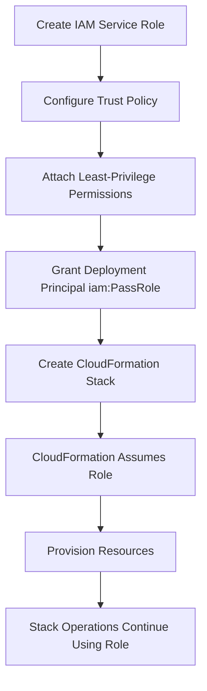
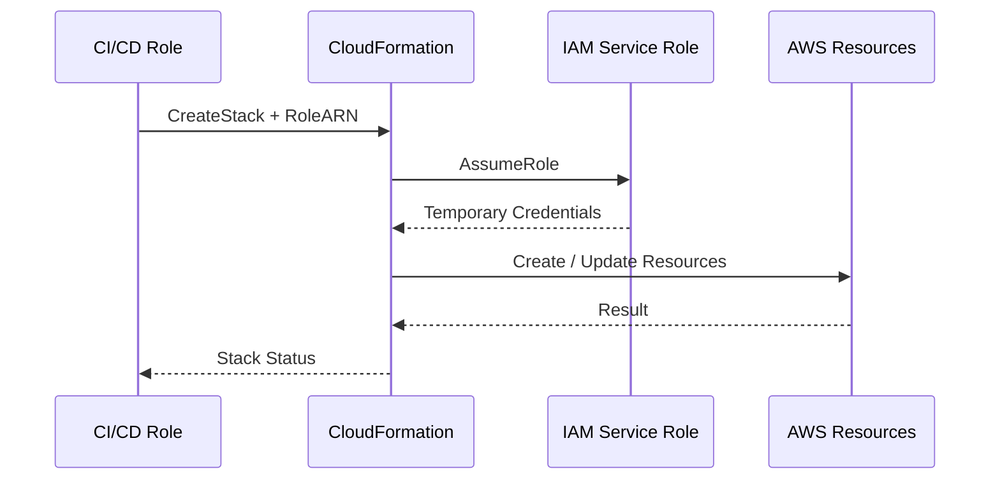
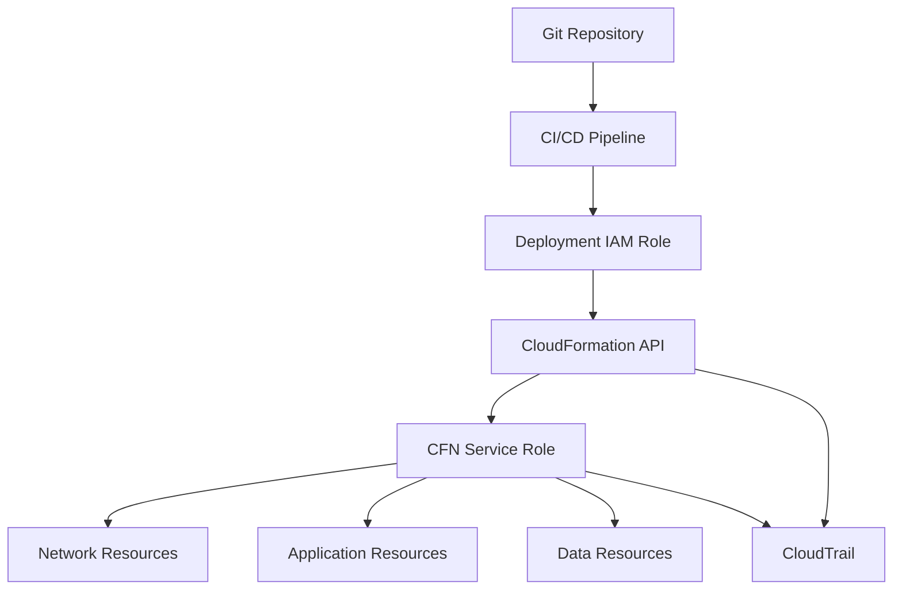

# 02- CloudFormation Service Roles

## Overview

A CloudFormation service role is an IAM role that AWS CloudFormation assumes to create, update, and delete resources in a stack on behalf of the principal that initiated the stack operation. When no service role is specified, CloudFormation uses the credentials of the IAM principal performing the operation. When a service role is specified, CloudFormation uses that role's permissions for stack operations instead. :contentReference[oaicite:0]{index=0}

The important security distinction is:

```text
Deployment Principal
        |
        | CloudFormation API access
        v
AWS CloudFormation
        |
        | assumes
        v
CloudFormation Service Role
        |
        | resource permissions
        v
AWS Resources
```

This separates:

```text
Who is allowed to deploy?
            from
What is CloudFormation allowed to provision?
```

That separation is particularly useful for production CI/CD, platform teams, controlled infrastructure provisioning, and least-privilege AWS environments.

## Why Service Roles Exist

Without a service role, the deployment principal generally needs permissions for both CloudFormation and the AWS resources that the template provisions.

For example:

```text
CI/CD Role
   |
   +--> CloudFormation
   +--> EC2
   +--> ECS
   +--> IAM
   +--> RDS
   +--> S3
```

This can make the CI/CD role unnecessarily powerful.

With a service role:

```text
CI/CD Role
   |
   +--> CloudFormation
   |
   v
CloudFormation Service Role
   |
   +--> EC2
   +--> ECS
   +--> IAM
   +--> RDS
   +--> S3
```

The CI/CD principal does not need direct permissions to provision every resource in the template. CloudFormation uses the service role's permissions instead. :contentReference[oaicite:1]{index=1}

This enables an important production pattern:

```text
Developers
    |
    | deploy infrastructure
    v
CloudFormation
    |
    | controlled provisioning permissions
    v
AWS Environment
```

Rather than:

```text
Developers
    |
    | unrestricted infrastructure permissions
    v
AWS Environment
```

## When to Use a Service Role

Service roles are particularly useful when:

- Infrastructure must be deployed through CI/CD.
- Developers should not have direct permissions to create AWS resources.
- Infrastructure provisioning must be standardized.
- Production deployments require controlled permissions.
- Multiple teams deploy CloudFormation stacks.
- The organization needs a clear separation between deployment access and resource provisioning access.
- Different stack types require different provisioning permissions.
- Infrastructure changes need to be auditable and governed.

AWS Prescriptive Guidance recommends service roles when principals need to provision multiple types of AWS resources through CloudFormation while avoiding broad direct permissions to those services. :contentReference[oaicite:2]{index=2}

## When a Service Role May Not Be Necessary

For small development environments, direct provisioning may be acceptable.

For example:

```text
Developer IAM Role
      |
      v
CloudFormation
      |
      v
Development Resources
```

The security and operational requirements of a temporary development account may not justify the additional role-management complexity.

For production infrastructure, however, a dedicated service-role model generally provides a stronger security boundary.

## Direct Provisioning vs Service Role

| Model | CloudFormation Uses | Main Characteristic |
|---|---|---|
| No service role | Calling principal's credentials | Principal needs resource permissions |
| Service role | CloudFormation service role | Provisioning permissions are separated |
| CI/CD + service role | CI/CD role + CloudFormation service role | Strong production separation |

The distinction is fundamental:

```text
No Service Role:

Principal
   |
   +--> CloudFormation
   +--> AWS Services


Service Role:

Principal
   |
   +--> CloudFormation
            |
            +--> Service Role
                    |
                    +--> AWS Services
```

## Service Role Lifecycle

A typical lifecycle is:



The role is created in IAM first and then associated with the CloudFormation stack during stack creation or through a later stack operation. :contentReference[oaicite:3]{index=3}

## Trust Policy

A CloudFormation service role must trust the CloudFormation service.

A minimal trust policy is:

```json
{
  "Version": "2012-10-17",
  "Statement": [
    {
      "Sid": "AllowCloudFormationAssumeRole",
      "Effect": "Allow",
      "Principal": {
        "Service": "cloudformation.amazonaws.com"
      },
      "Action": "sts:AssumeRole"
    }
  ]
}
```

The important relationship is:

```text
CloudFormation
      |
      | sts:AssumeRole
      v
CloudFormation Service Role
```

The service principal is:

```text
cloudformation.amazonaws.com
```

AWS recommends specifying CloudFormation as the trusted service rather than broadly trusting arbitrary principals or services. :contentReference[oaicite:4]{index=4}

## Permissions Policy

The trust policy answers:

> Who can assume this role?

The permissions policy answers:

> What can the role do after it is assumed?

These are separate security controls.

```text
Trust Policy
    |
    +--> CloudFormation can assume role


Permissions Policy
    |
    +--> EC2
    +--> ECS
    +--> RDS
    +--> IAM
```

A production service role should contain only the permissions required by the stacks that use it.

AWS recommends working backward from the CloudFormation templates to construct least-privilege service-role permissions. :contentReference[oaicite:5]{index=5}

## Example Service Role

Suppose a stack creates:

- CloudWatch log groups.
- ECS resources.
- IAM roles.
- Application load balancer resources.

The service role might require permissions for those services.

A simplified example:

```json
{
  "Version": "2012-10-17",
  "Statement": [
    {
      "Sid": "CloudWatchLogs",
      "Effect": "Allow",
      "Action": [
        "logs:CreateLogGroup",
        "logs:DeleteLogGroup",
        "logs:DescribeLogGroups",
        "logs:PutRetentionPolicy"
      ],
      "Resource": "*"
    }
  ]
}
```

This is illustrative rather than a universal production policy.

The correct policy must be derived from the actual resources and operations in the templates.

## Least Privilege

The most important principle for CloudFormation service roles is:

> Give CloudFormation only the permissions required to manage the resources it is responsible for.

Avoid:

```json
{
  "Effect": "Allow",
  "Action": "*",
  "Resource": "*"
}
```

or:

```json
{
  "Effect": "Allow",
  "Action": [
    "ec2:*",
    "iam:*",
    "s3:*",
    "rds:*"
  ],
  "Resource": "*"
}
```

unless there is a documented and justified administrative requirement.

AWS explicitly recommends least privilege for CloudFormation service roles and recommends using IAM Access Analyzer to identify unused permissions. :contentReference[oaicite:6]{index=6}

## Working Backward From the Template

A practical way to build a service role is:

```text
CloudFormation Template
        |
        v
Identify Resource Types
        |
        v
Identify Required API Actions
        |
        v
Determine Resource Scope
        |
        v
Create IAM Policy
        |
        v
Test Deployment
        |
        v
Analyze Unused Permissions
        |
        v
Tighten Policy
```

For example:

```yaml
Resources:
  ApplicationLogGroup:
    Type: AWS::Logs::LogGroup

  ApplicationBucket:
    Type: AWS::S3::Bucket
```

The service role may require CloudWatch Logs and S3 permissions rather than broad permissions for unrelated AWS services.

## Resource Scoping

Where supported, scope permissions to specific resources.

Prefer:

```json
{
  "Effect": "Allow",
  "Action": [
    "s3:GetBucketLocation"
  ],
  "Resource": "arn:aws:s3:::production-application-data"
}
```

over:

```json
{
  "Effect": "Allow",
  "Action": "s3:*",
  "Resource": "*"
}
```

Not every AWS API supports resource-level permissions, so some actions legitimately require `"Resource": "*"`. The goal is to scope permissions wherever the service supports meaningful resource constraints.

## One Role for Everything

A common anti-pattern is:

```text
CloudFormationServiceRole
        |
        +--> Development
        +--> Staging
        +--> Production
        +--> Network
        +--> Security
        +--> Data
        +--> Application
```

This creates a large blast radius.

A better design is to separate roles according to meaningful use cases:

```text
CloudFormation Roles
│
├── CFN-Network
├── CFN-Security
├── CFN-Application
├── CFN-Data
└── CFN-Production
```

AWS Prescriptive Guidance recommends creating separate CloudFormation service roles for different AWS service/use cases and then restricting which roles principals can pass. :contentReference[oaicite:7]{index=7}

## Service Role Naming

A consistent naming convention makes IAM governance easier.

For example:

```text
CFN-Network-Development
CFN-Network-Production

CFN-Application-Development
CFN-Application-Production

CFN-Data-Production
```

A dedicated IAM path can also help:

```text
/cfnroles/
```

For example:

```text
arn:aws:iam::123456789012:role/cfnroles/CFN-Application-Production
```

AWS Prescriptive Guidance shows role paths and naming prefixes as mechanisms for restricting which service roles an IAM principal can pass. :contentReference[oaicite:8]{index=8}

## `iam:PassRole`

The deployment principal needs permission to pass the CloudFormation service role to CloudFormation.

This permission is:

```text
iam:PassRole
```

The relationship is:



AWS requires the principal specifying a service role to have permission to pass that role. :contentReference[oaicite:9]{index=9}

## Why `iam:PassRole` Is Sensitive

Consider:

```text
CI/CD Role
    |
    | iam:PassRole
    v
Highly Privileged CFN Role
    |
    +--> IAM
    +--> S3
    +--> EC2
    +--> RDS
    +--> Secrets
```

The CI/CD role may not directly have those permissions.

But if it can pass an administrative CloudFormation role to CloudFormation, it may cause CloudFormation to perform privileged operations.

That creates a privilege-escalation risk.

AWS explicitly highlights this risk and recommends closely monitoring principals that can pass privileged CloudFormation service roles. :contentReference[oaicite:10]{index=10}

## Restricting `iam:PassRole`

Avoid:

```json
{
  "Effect": "Allow",
  "Action": "iam:PassRole",
  "Resource": "*"
}
```

Prefer restricting the resource:

```json
{
  "Version": "2012-10-17",
  "Statement": [
    {
      "Sid": "PassApprovedCloudFormationRole",
      "Effect": "Allow",
      "Action": "iam:PassRole",
      "Resource": "arn:aws:iam::123456789012:role/cfnroles/CFN-Application-Production"
    }
  ]
}
```

AWS also recommends using `iam:PassedToService` where appropriate to constrain which service receives the passed role. :contentReference[oaicite:11]{index=11}

Example:

```json
{
  "Effect": "Allow",
  "Action": "iam:PassRole",
  "Resource": "arn:aws:iam::123456789012:role/cfnroles/CFN-Application-Production",
  "Condition": {
    "StringEquals": {
      "iam:PassedToService": "cloudformation.amazonaws.com"
    }
  }
}
```

This makes the intended relationship explicit:

```text
CI/CD Role
    |
    | PassRole
    | only to
    v
CloudFormation
    |
    v
Approved CFN Role
```

## `cloudformation:RoleARN`

CloudFormation provides the `cloudformation:RoleARN` condition key for controlling which service role can be associated with stack operations.

This can provide an additional restriction beyond `iam:PassRole`.

Conceptually:

```text
Deployment Principal
        |
        +--> CloudFormation API
                |
                +--> RoleARN must equal
                     approved service role
```

AWS Prescriptive Guidance specifically recommends using `cloudformation:RoleARN` to control which CloudFormation service roles an IAM principal can pass. :contentReference[oaicite:12]{index=12}

A simplified policy pattern is:

```json
{
  "Version": "2012-10-17",
  "Statement": [
    {
      "Sid": "AllowApprovedCloudFormationRole",
      "Effect": "Allow",
      "Action": [
        "cloudformation:CreateStack",
        "cloudformation:UpdateStack",
        "cloudformation:DeleteStack"
      ],
      "Resource": "*",
      "Condition": {
        "StringEquals": {
          "cloudformation:RoleARN": "arn:aws:iam::123456789012:role/cfnroles/CFN-Application-Production"
        }
      }
    }
  ]
}
```

The exact policy should be adapted to the deployment workflow and supported CloudFormation condition keys.

## Trust Policy vs `iam:PassRole`

These controls are frequently confused.

| Control | Question |
|---|---|
| Trust policy | Who can assume the role? |
| `iam:PassRole` | Who can pass the role to an AWS service? |
| `cloudformation:RoleARN` | Which CloudFormation service role can be specified? |
| Permissions policy | What can the role do? |

For a CloudFormation service role:

```text
Trust Policy
    ↓
CloudFormation can assume it

Deployment Role
    ↓
iam:PassRole
    ↓
Can pass approved role

Service Role Permissions
    ↓
Determine infrastructure actions
```

All three layers matter.

## Attaching the Service Role to a Stack

A service role can be specified during stack creation.

Example:

```bash
aws cloudformation create-stack \
  --stack-name production-api \
  --template-body file://template.yaml \
  --role-arn arn:aws:iam::123456789012:role/cfnroles/CFN-Application-Production
```

The principal executing this command must be permitted to pass the specified role. :contentReference[oaicite:13]{index=13}

The same service role is then used for subsequent operations on that stack.

## Persistent Service Role Association

One of the most important operational details is that when a service role is specified for a stack, CloudFormation continues using that role for operations on the stack. AWS documents that the service role cannot simply be removed from the stack after creation. :contentReference[oaicite:14]{index=14}

This means:

```text
Stack
  |
  +--> CloudFormation Service Role
          |
          +--> Used for stack operations
```

The role therefore becomes part of the stack's security architecture.

Changing or deleting the role without understanding its stack associations can break future stack operations.

## Critical Security Implication

AWS documents an important privilege-escalation scenario:

> Once a service role is associated with a stack, other principals with permission to operate on that stack can use the role for stack operations even if those principals do not themselves have `iam:PassRole`. :contentReference[oaicite:15]{index=15}

For example:

```text
CFN Service Role
    |
    +--> Can create IAM roles

Developer
    |
    +--> Can update existing stack
          |
          v
     CloudFormation
          |
          v
     CFN Service Role
```

The developer may not have direct IAM role-creation permissions, but the stack's service role can.

Therefore, stack-level CloudFormation permissions must be governed carefully.

## CI/CD Architecture

A production deployment pipeline can use:



The deployment role should generally have:

```text
CloudFormation permissions
+
iam:PassRole for approved CFN roles
```

while the CloudFormation service role contains the actual infrastructure provisioning permissions.

## Backend Production Example

Consider a FastAPI application running on ECS:

```text
Production Account
│
├── Network
│   ├── VPC
│   ├── Private Subnets
│   └── Routing
│
├── Application
│   ├── ALB
│   ├── ECS Service
│   └── IAM Roles
│
└── Data
    ├── RDS PostgreSQL
    └── Redis
```

A controlled deployment model could be:

```text
GitHub Actions
      |
      v
Deployment Role
      |
      | PassRole
      v
CFN-Application-Production
      |
      +--> ECS
      +--> ALB
      +--> IAM resources
```

The application deployment pipeline does not need unrestricted direct ECS, ALB, or IAM permissions.

## Environment Separation

Avoid using one highly privileged service role across every environment.

Prefer:

```text
Development
    |
    +--> CFN-Application-Development

Staging
    |
    +--> CFN-Application-Staging

Production
    |
    +--> CFN-Application-Production
```

This limits the blast radius of a compromised deployment principal.

For example:

```text
Development Role
    X
    |
    X---> Production Infrastructure
```

A production deployment role should be independently controlled and ideally require stronger CI/CD and approval controls.

## Service Roles and Multi-Account Architecture

In a multi-account environment:

```text
AWS Organization
│
├── Development Account
│   └── CFN Service Roles
│
├── Staging Account
│   └── CFN Service Roles
│
└── Production Account
    └── CFN Service Roles
```

Each account can maintain roles appropriate to its environment.

Cross-account deployment should use explicit trust relationships and account-specific roles rather than attempting to reuse a role across accounts directly.

IAM `PassRole` applies to roles in the same AWS account as the service receiving the role; cross-account architectures require an appropriate role in the target account and a trust relationship for the deployment mechanism. :contentReference[oaicite:16]{index=16}

## Service Roles and StackSets

StackSets introduce another layer of role management.

Conceptually:

```text
Management / Delegated Administrator
             |
             v
          StackSet
             |
             +--------+--------+
             |                 |
             v                 v
       Account A          Account B
             |                 |
             v                 v
      CFN Execution Role  CFN Execution Role
             |                 |
             v                 v
          Resources          Resources
```

StackSet administration and target-account execution permissions should be designed separately.

The same least-privilege principles apply:

- Restrict who can administer StackSets.
- Restrict target accounts and OUs.
- Restrict Regions.
- Restrict execution roles.
- Monitor privileged operations.

## Service Role and IAM Resources

IAM resources deserve special attention because a CloudFormation service role may itself be allowed to create IAM roles and policies.

For example:

```yaml
Resources:

  ApplicationTaskRole:
    Type: AWS::IAM::Role
    Properties:
      AssumeRolePolicyDocument:
        Version: "2012-10-17"
        Statement:
          - Effect: Allow
            Principal:
              Service:
                - ecs-tasks.amazonaws.com
            Action:
              - sts:AssumeRole
```

If the CloudFormation service role can create this role, the deployment principal can indirectly influence IAM configuration through CloudFormation.

Therefore:

```text
Can deploy stack
        +
Can pass privileged CFN role
        +
CFN role can create IAM
        =
Potential privilege escalation
```

This is why IAM-related permissions in CloudFormation service roles require especially careful review.

## Permissions Boundaries

When CloudFormation creates IAM roles, permissions boundaries can provide an additional security control.

Conceptually:

```text
CloudFormation
      |
      v
Create IAM Role
      |
      v
Permissions Boundary
      |
      v
Maximum Allowed Permissions
```

The resulting role cannot exceed the boundary even if its attached policies attempt to grant broader access.

This is particularly useful in environments where application teams can define some IAM resources but must remain within organizational limits.

## Service Role Policy Design

A practical policy design process is:

### Identify Resources

Start with the CloudFormation templates.

```text
Resources
├── ECS
├── ALB
├── CloudWatch
├── IAM
└── S3
```

### Identify Required Actions

Determine which API operations CloudFormation needs:

```text
Create
Read
Update
Delete
Tag
Describe
```

### Scope Resources

Where supported:

```text
Action → Resource ARN
```

rather than:

```text
Action → *
```

### Remove Unused Permissions

Deploy and observe failures and successful operations.

Then use IAM Access Analyzer and policy review to identify permissions that are not required. AWS recommends Access Analyzer as part of service-role least-privilege management. :contentReference[oaicite:17]{index=17}

## Managed Policies vs Custom Policies

| Approach | Advantage | Risk |
|---|---|---|
| AWS managed policy | Easy to configure | May be broader than required |
| Customer managed policy | Reusable and controlled | Requires maintenance |
| Inline policy | Tightly associated with role | Less reusable |
| Resource-scoped policy | Strong least privilege | More configuration effort |

For production CloudFormation service roles, custom least-privilege policies are generally preferable when the required permission set is known.

## Policy Maintenance

Service roles should evolve with the infrastructure.

A common failure pattern is:

```text
2024
CFN Role
  ↓
10 permissions

2025
Templates grow
  ↓
CFN Role
  ↓
100 permissions
```

without periodic review.

Instead:

```text
Template Change
      |
      v
Required Permissions Review
      |
      v
IAM Policy Update
      |
      v
Deployment
```

Infrastructure permissions should be treated as production code.

## Monitoring Service Roles

Monitor:

- Role assumptions.
- CloudFormation stack operations.
- `iam:PassRole` activity.
- IAM resource creation.
- Production stack updates.
- Stack deletions.
- Unexpected service-role usage.

A useful audit chain is:

```text
Deployment Principal
        |
        v
CloudFormation API
        |
        v
Service Role
        |
        v
AWS Resource API
        |
        v
CloudTrail
```

This allows security teams to correlate infrastructure operations with the identity that initiated them.

## Common Mistakes

### Using `Resource: "*"` Everywhere

Broad permissions increase the blast radius of a compromised service role.

**Avoid it:** scope actions and resources wherever AWS supports resource-level permissions.

### Giving the Deployment Role Direct Resource Permissions

A CI/CD role may accumulate:

```text
ec2:*
ecs:*
iam:*
s3:*
rds:*
```

over time.

**Avoid it:** move infrastructure provisioning permissions into a controlled CloudFormation service role where appropriate.

### Allowing `iam:PassRole` on `*`

This can allow the deployment principal to pass an arbitrary privileged role.

**Avoid it:** restrict `iam:PassRole` to approved CloudFormation service-role ARNs and use appropriate conditions. :contentReference[oaicite:18]{index=18}

### Creating One Administrative CFN Role

One role with:

```text
Action: "*"
Resource: "*"
```

becomes a single high-value privilege-escalation target.

**Avoid it:** create purpose-specific roles with least-privilege permissions.

### Broad Trust Policy

Avoid trust policies that allow arbitrary principals.

Bad:

```json
{
  "Effect": "Allow",
  "Principal": "*",
  "Action": "sts:AssumeRole"
}
```

Prefer CloudFormation's service principal:

```json
{
  "Effect": "Allow",
  "Principal": {
    "Service": "cloudformation.amazonaws.com"
  },
  "Action": "sts:AssumeRole"
}
```

### Forgetting That the Role Persists With the Stack

Changing deployment identities does not automatically remove the stack's service-role association.

**Avoid it:** treat the service role as part of the stack's long-term security configuration. :contentReference[oaicite:19]{index=19}

### Deleting or Renaming an Active Service Role

A stack may depend on its associated role for future operations.

**Avoid it:** determine all stack associations before modifying or retiring a service role.

### Ignoring IAM Creation Permissions

A service role that can create arbitrary IAM roles can be extremely powerful.

**Avoid it:** carefully review IAM permissions and consider permissions boundaries.

### Using the Same Role Across Environments

A compromised development deployment could potentially gain production-level capabilities.

**Avoid it:** separate roles by environment and privilege boundary.

## Production Best Practices

- Use dedicated CloudFormation service roles for production workloads.
- Grant only required provisioning permissions.
- Scope resources wherever possible.
- Avoid wildcard actions and resources unless required.
- Restrict `iam:PassRole`.
- Use `iam:PassedToService` where appropriate.
- Use `cloudformation:RoleARN` to constrain approved CloudFormation roles.
- Keep CloudFormation service-role trust policies specific to CloudFormation.
- Separate service roles by environment and meaningful use case.
- Avoid one highly privileged role for every stack.
- Review IAM permissions whenever templates change.
- Use IAM Access Analyzer to identify unnecessary permissions. :contentReference[oaicite:20]{index=20}
- Monitor privileged service-role usage.
- Protect IAM-related stack operations.
- Use CI/CD rather than unrestricted manual production deployments.
- Combine service roles with SCPs and permissions boundaries where organizational governance requires them.
- Treat service-role policies as production infrastructure code.
- Document ownership and intended stack associations for every service role.

## Security Review Checklist

Before using a CloudFormation service role in production:

- [ ] Trust policy allows CloudFormation to assume the role.
- [ ] No unnecessary principals are trusted.
- [ ] Permissions are derived from actual CloudFormation templates.
- [ ] Wildcard actions have been reviewed.
- [ ] Wildcard resources have been reviewed.
- [ ] IAM permissions are especially restricted.
- [ ] `iam:PassRole` is limited to approved roles.
- [ ] `iam:PassedToService` is used where appropriate.
- [ ] `cloudformation:RoleARN` restrictions are considered.
- [ ] The deployment principal cannot substitute an administrative service role.
- [ ] Development and production roles are separated.
- [ ] Service-role ownership is documented.
- [ ] Stack associations are documented.
- [ ] IAM Access Analyzer has been used for permission review.
- [ ] CloudTrail monitoring covers relevant role and CloudFormation activity.
- [ ] CI/CD deployment permissions are separated from resource provisioning permissions.
- [ ] Permissions boundaries or SCPs are used where appropriate.
- [ ] IAM resource creation has been explicitly reviewed.

## Interview Traps

### What Is a CloudFormation Service Role?

It is an IAM role that CloudFormation assumes to create, update, or delete resources on behalf of the principal performing the stack operation. :contentReference[oaicite:21]{index=21}

### What Happens If You Do Not Specify a Service Role?

CloudFormation uses the credentials of the IAM principal performing the operation. That principal therefore needs the permissions required to provision the resources in the template. :contentReference[oaicite:22]{index=22}

### Why Use a Service Role?

To separate:

```text
Deployment Permissions
        from
Resource Provisioning Permissions
```

This supports least privilege and controlled infrastructure provisioning. :contentReference[oaicite:23]{index=23}

### Does the Developer Need EC2 Permissions When Using a CloudFormation Service Role?

Not necessarily.

If CloudFormation is using a service role with the required EC2 permissions, the deployment principal can avoid having direct EC2 provisioning permissions.

The principal still needs appropriate CloudFormation permissions and permission to pass the service role. :contentReference[oaicite:24]{index=24}

### What Is `iam:PassRole`?

It allows an IAM principal to pass an IAM role to an AWS service so that the service can assume the role and use its permissions. :contentReference[oaicite:25]{index=25}

### Why Is `iam:PassRole` Dangerous?

Because passing a highly privileged role to CloudFormation can allow CloudFormation to perform actions that the calling principal cannot perform directly.

### What Is the Difference Between a Trust Policy and `iam:PassRole`?

```text
Trust Policy
    ↓
Who can assume the role?

iam:PassRole
    ↓
Who can pass the role to a service?
```

Both are required parts of a secure service-role design.

### Can a User Update a Stack Without `iam:PassRole` After the Service Role Is Associated?

Potentially yes.

AWS documents that once a service role is associated with a stack, other users with permission to operate on that stack can use that role for stack operations even without `iam:PassRole`. This is why the service role itself must be least-privileged and stack-level access must be tightly controlled. :contentReference[oaicite:26]{index=26}

### Should Every Environment Use the Same Service Role?

Generally no.

Separate development, staging, and production roles reduce blast radius and make privilege boundaries clearer.

### Should a CloudFormation Service Role Have AdministratorAccess?

Generally no.

Use least privilege and grant only the permissions required by the infrastructure it manages. :contentReference[oaicite:27]{index=27}

## Key Takeaways

- A CloudFormation service role is an IAM role that CloudFormation assumes to provision stack resources.
- Without a service role, CloudFormation generally performs stack operations using the credentials of the calling IAM principal.
- Service roles separate deployment identity from infrastructure provisioning permissions.
- The deployment principal still needs CloudFormation permissions and permission to pass the service role.
- `iam:PassRole` is a high-impact permission and must be tightly restricted.
- `cloudformation:RoleARN` can provide an additional control over which service role a principal can use. :contentReference[oaicite:28]{index=28}
- The service role trust policy should allow CloudFormation to assume the role.
- The service role permissions policy determines which AWS resources CloudFormation can manage.
- Least privilege should be applied to both the deployment principal and the CloudFormation service role.
- Avoid one highly privileged service role for every stack and environment.
- Separate service roles by meaningful use case and privilege boundary.
- IAM permissions inside CloudFormation service roles require special scrutiny because they can create privilege-escalation paths.
- Once associated with a stack, the service role becomes part of that stack's operational security model. :contentReference[oaicite:29]{index=29}
- Service-role permissions should be derived from actual templates and periodically reviewed.
- IAM Access Analyzer can help identify unused permissions. :contentReference[oaicite:30]{index=30}
- Production deployments should combine service roles with CI/CD controls, CloudTrail monitoring, SCPs, permissions boundaries, and other defense-in-depth mechanisms where appropriate.
- The central security principle is:

```text
Deployment Principal
        |
        | limited CloudFormation access
        v
CloudFormation
        |
        | approved service role
        v
Least-Privilege Infrastructure Permissions
        |
        v
AWS Resources
```