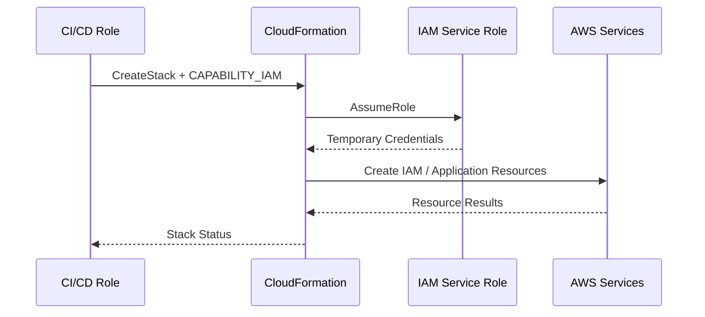
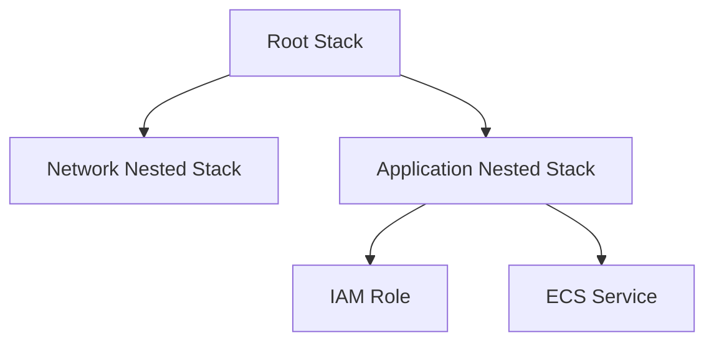

# 03- IAM Capabilities and Permissions

## Overview

AWS CloudFormation can create and modify IAM resources such as roles, policies, users, groups, and instance profiles. Because these resources can change permissions within an AWS account, CloudFormation requires an explicit acknowledgement before certain IAM-capable templates can be deployed.

CloudFormation provides three capability acknowledgements:

| Capability | Purpose |
|---|---|
| `CAPABILITY_IAM` | Acknowledge IAM resources in the template |
| `CAPABILITY_NAMED_IAM` | Acknowledge IAM resources when the template uses custom names |
| `CAPABILITY_AUTO_EXPAND` | Acknowledge direct deployment of templates containing macros |

For IAM resources, the important distinction is:

```text
IAM resource present
        |
        v
Does it have a custom name?
        |
   +----+----+
   |         |
  No        Yes
   |         |
   v         v
CAPABILITY_IAM
             |
             v
CAPABILITY_NAMED_IAM
```

If the required IAM capability is not acknowledged, CloudFormation rejects the stack operation with an `InsufficientCapabilities` error. AWS recommends reviewing the permissions associated with IAM resources before acknowledging these capabilities. :contentReference[oaicite:0]{index=0}

## Why IAM Capabilities Exist

CloudFormation is declarative. A template can contain an IAM role that grants permissions to other AWS services.

For example:

```yaml
Resources:

  ApplicationRole:
    Type: AWS::IAM::Role
    Properties:
      AssumeRolePolicyDocument:
        Version: "2012-10-17"
        Statement:
          - Effect: Allow
            Principal:
              Service:
                - ecs-tasks.amazonaws.com
            Action:
              - sts:AssumeRole

      Policies:
        - PolicyName: ApplicationAccess
          PolicyDocument:
            Version: "2012-10-17"
            Statement:
              - Effect: Allow
                Action:
                  - s3:GetObject
                Resource:
                  - arn:aws:s3:::production-application-data/*
```

Deploying this template does more than create an infrastructure object.

It creates an identity with permissions.

CloudFormation therefore requires the deployment caller to explicitly acknowledge that the template contains IAM resources.

This creates an additional review checkpoint:

```text
CloudFormation Template
        |
        v
IAM Resource Detected
        |
        v
Explicit Capability Acknowledgement
        |
        v
Permission Review
        |
        v
Deployment
```

## IAM Resources Covered by Capabilities

CloudFormation requires `CAPABILITY_IAM` or `CAPABILITY_NAMED_IAM` for templates containing IAM resource types such as:

- `AWS::IAM::AccessKey`
- `AWS::IAM::Group`
- `AWS::IAM::InstanceProfile`
- `AWS::IAM::ManagedPolicy`
- `AWS::IAM::Policy`
- `AWS::IAM::Role`
- `AWS::IAM::User`
- `AWS::IAM::UserToGroupAddition`

AWS documents these resource types as requiring an IAM capability acknowledgement during stack operations. :contentReference[oaicite:1]{index=1}

The security significance is not limited to the resource itself.

For example:

```text
AWS::IAM::Role
      |
      v
Permissions Policy
      |
      v
AWS Service Access
      |
      v
Potential Account Impact
```

An IAM role with broad permissions can be substantially more powerful than many application resources.

## `CAPABILITY_IAM`

`CAPABILITY_IAM` acknowledges that the CloudFormation template contains IAM resources.

For example:

```yaml
Resources:

  ApplicationRole:
    Type: AWS::IAM::Role
    Properties:
      AssumeRolePolicyDocument:
        Version: "2012-10-17"
        Statement:
          - Effect: Allow
            Principal:
              Service:
                - ecs-tasks.amazonaws.com
            Action:
              - sts:AssumeRole
```

A CLI deployment can explicitly acknowledge the capability:

```bash
aws cloudformation create-stack \
  --stack-name production-api \
  --template-body file://template.yaml \
  --capabilities CAPABILITY_IAM
```

AWS states that if IAM resources are present, either `CAPABILITY_IAM` or `CAPABILITY_NAMED_IAM` can be specified, subject to the naming requirement described below. :contentReference[oaicite:2]{index=2}

## `CAPABILITY_NAMED_IAM`

`CAPABILITY_NAMED_IAM` is required when the template contains IAM resources with custom names.

For example:

```yaml
Resources:

  ApplicationRole:
    Type: AWS::IAM::Role
    Properties:
      RoleName: production-api-task-role

      AssumeRolePolicyDocument:
        Version: "2012-10-17"
        Statement:
          - Effect: Allow
            Principal:
              Service:
                - ecs-tasks.amazonaws.com
            Action:
              - sts:AssumeRole
```

The explicit `RoleName` makes this a named IAM resource.

The deployment must acknowledge:

```bash
aws cloudformation create-stack \
  --stack-name production-api \
  --template-body file://template.yaml \
  --capabilities CAPABILITY_NAMED_IAM
```

AWS documents that IAM resources with custom names require `CAPABILITY_NAMED_IAM`. :contentReference[oaicite:3]{index=3}

## `CAPABILITY_IAM` vs `CAPABILITY_NAMED_IAM`

| Scenario | Required Capability |
|---|---|
| IAM resource without custom name | `CAPABILITY_IAM` or `CAPABILITY_NAMED_IAM` |
| IAM resource with custom name | `CAPABILITY_NAMED_IAM` |
| No IAM resources | Neither |
| Template contains macros | Potentially `CAPABILITY_AUTO_EXPAND` |

The important point is that `CAPABILITY_NAMED_IAM` is not simply a more powerful IAM permission.

It is an explicit acknowledgement that the template may create or modify IAM resources using custom names.

## Why Named IAM Resources Need Extra Attention

Custom IAM names have stronger operational implications.

Consider:

```yaml
RoleName: production-api-task-role
```

Now the resource has a predetermined identity.

This can create:

- Name collisions.
- Cross-environment naming problems.
- Replacement constraints.
- Deployment coupling.
- More difficult reuse across accounts or Regions.

For reusable infrastructure, generated physical names are often preferable unless a stable name is an explicit requirement.

For example:

```yaml
Resources:

  ApplicationRole:
    Type: AWS::IAM::Role
    Properties:
      AssumeRolePolicyDocument:
        Version: "2012-10-17"
        Statement:
          - Effect: Allow
            Principal:
              Service:
                - ecs-tasks.amazonaws.com
            Action:
              - sts:AssumeRole
```

CloudFormation can generate the physical name instead of forcing a globally predetermined name within the account.

## IAM Capability Is Not an IAM Permission

A common misconception is:

```text
CAPABILITY_IAM
    =
IAM permission
```

This is incorrect.

The capability is an acknowledgement supplied to CloudFormation.

IAM permissions still determine whether the caller or CloudFormation's service role can actually perform the required operations.

The model is:

```text
IAM Permissions
      +
CloudFormation Capability
      +
CloudFormation Service Role
      |
      v
IAM Resource Creation
```

For example:

```text
Deployment Role
    |
    +--> cloudformation:CreateStack
    |
    +--> iam:PassRole
              |
              v
CloudFormation Service Role
              |
              +--> iam:CreateRole
              +--> iam:PutRolePolicy
```

The capability does not grant any of these permissions.

## Capability vs IAM Authorization

| Mechanism | Role |
|---|---|
| IAM policy | Determines whether an identity can perform an AWS API action |
| `iam:PassRole` | Allows an identity to pass an IAM role to an AWS service |
| CloudFormation service role | Provides permissions CloudFormation uses to provision resources |
| `CAPABILITY_IAM` | Acknowledges IAM resources in a CloudFormation template |
| `CAPABILITY_NAMED_IAM` | Acknowledges named IAM resources |
| Stack policy | Protects selected stack resources from unintended updates |

This distinction is fundamental in production troubleshooting.

## Deployment Authorization Flow

A production deployment may look like:



There are several independent security checks:

```text
1. Can CI/CD call CloudFormation?
2. Can CI/CD pass the service role?
3. Does the template require an IAM capability?
4. Can the CloudFormation role create the requested IAM resource?
5. Are the resulting IAM permissions acceptable?
```

A successful capability acknowledgement does not answer questions 1, 2, 4, or 5.

## `InsufficientCapabilities`

A common error is:

```text
InsufficientCapabilities
```

This usually means CloudFormation detected a capability-sensitive template but the required capability was not acknowledged.

For example:

```bash
aws cloudformation create-stack \
  --stack-name production-api \
  --template-body file://template.yaml
```

If the template contains an IAM role, CloudFormation may reject the operation.

The corrected command is:

```bash
aws cloudformation create-stack \
  --stack-name production-api \
  --template-body file://template.yaml \
  --capabilities CAPABILITY_IAM
```

For a named IAM resource:

```bash
aws cloudformation create-stack \
  --stack-name production-api \
  --template-body file://template.yaml \
  --capabilities CAPABILITY_NAMED_IAM
```

AWS documents `InsufficientCapabilities` as the expected failure when the required capability acknowledgement is missing. :contentReference[oaicite:4]{index=4}

## Detecting Required Capabilities

`GetTemplateSummary` can identify capabilities detected in a template.

For example:

```bash
aws cloudformation get-template-summary \
  --template-body file://template.yaml
```

The response can include:

```text
Capabilities
CapabilitiesReason
```

`CapabilitiesReason` provides information about the resources that caused the capability requirement. :contentReference[oaicite:5]{index=5}

This is useful in CI/CD pipelines because capability requirements can be detected before attempting the actual deployment.

## `ValidateTemplate`

Template validation can also reveal detected capabilities.

```bash
aws cloudformation validate-template \
  --template-body file://template.yaml
```

The response includes capability information when applicable. :contentReference[oaicite:6]{index=6}

A pipeline can therefore perform:

```text
Template
   |
   v
ValidateTemplate
   |
   v
Detect Capabilities
   |
   v
Security Review
   |
   v
Deployment
```

## Capabilities During Stack Updates

Capabilities are relevant to stack updates as well as creation.

For example:

```bash
aws cloudformation update-stack \
  --stack-name production-api \
  --template-body file://template.yaml \
  --capabilities CAPABILITY_NAMED_IAM
```

A template change that introduces an IAM resource may therefore require a capability acknowledgement even if the original stack did not contain IAM resources.

The deployment pipeline should derive capabilities from the current template rather than assuming that a stack's previous configuration determines what is needed.

## Capabilities and Change Sets

Change Sets also accept capability acknowledgements.

For example:

```bash
aws cloudformation create-change-set \
  --stack-name production-api \
  --change-set-name add-task-role \
  --template-body file://template.yaml \
  --change-set-type UPDATE \
  --capabilities CAPABILITY_IAM
```

The Change Set records the capabilities explicitly acknowledged for execution. :contentReference[oaicite:7]{index=7}

A production workflow can therefore be:

```text
Template Change
      |
      v
Detect IAM Resources
      |
      v
Determine Capability
      |
      v
Create Change Set
      |
      v
Review IAM Changes
      |
      v
Execute Change Set
```

## Capability Acknowledgement Is a Security Checkpoint

The capability should not be treated as a meaningless CLI flag.

Bad workflow:

```bash
aws cloudformation create-stack \
  --template-body file://template.yaml \
  --capabilities CAPABILITY_NAMED_IAM
```

without reviewing what the template creates.

Better:

```text
Template
   |
   v
Identify IAM Resources
   |
   v
Review Trust Policies
   |
   v
Review Permissions Policies
   |
   v
Review Resource Scope
   |
   v
Determine Capability
   |
   v
Deploy
```

The capability is an explicit acknowledgement that the template contains security-sensitive infrastructure.

AWS recommends reviewing the permissions associated with IAM resources before deploying templates that require these capabilities. :contentReference[oaicite:8]{index=8}

## IAM Role Security Review

Consider:

```yaml
Resources:

  ApplicationRole:
    Type: AWS::IAM::Role
    Properties:
      AssumeRolePolicyDocument:
        Version: "2012-10-17"
        Statement:
          - Effect: Allow
            Principal:
              Service:
                - ecs-tasks.amazonaws.com
            Action:
              - sts:AssumeRole

      Policies:
        - PolicyName: ApplicationAccess
          PolicyDocument:
            Version: "2012-10-17"
            Statement:
              - Effect: Allow
                Action:
                  - s3:GetObject
                Resource:
                  - arn:aws:s3:::production-application-data/*
```

The security review should examine two different policies.

### Trust Policy

```text
Who can assume this role?
```

In this example:

```text
ECS Tasks
    |
    v
ApplicationRole
```

### Permissions Policy

```text
What can the assumed role do?
```

In this example:

```text
ApplicationRole
    |
    v
s3:GetObject
    |
    v
production-application-data/*
```

Both policies must be reviewed.

## Dangerous IAM Template

Consider:

```yaml
Resources:

  AdministratorRole:
    Type: AWS::IAM::Role
    Properties:
      AssumeRolePolicyDocument:
        Version: "2012-10-17"
        Statement:
          - Effect: Allow
            Principal:
              AWS:
                - arn:aws:iam::123456789012:user/developer
            Action:
              - sts:AssumeRole

      ManagedPolicyArns:
        - arn:aws:iam::aws:policy/AdministratorAccess
```

The capability acknowledgement is not the security decision.

The real security question is:

```text
Should this CloudFormation deployment
be allowed to create this role?
```

A senior engineer reviews:

- Trust policy.
- Permissions.
- Managed policies.
- Resource scope.
- Deployment principal.
- CloudFormation service role.
- `iam:PassRole`.
- Environment.
- Account boundary.

## CloudFormation Service Role Interaction

Suppose a deployment uses:

```text
CI/CD Role
      |
      v
CloudFormation
      |
      v
CFN-Application-Production
```

The service role might have:

```text
iam:CreateRole
iam:AttachRolePolicy
iam:PutRolePolicy
iam:DeleteRole
```

The CI/CD role may not have those IAM permissions directly.

However, the deployment can still create IAM resources through CloudFormation.

Therefore:

```text
CAPABILITY_IAM
        ≠
Permission to create IAM resources

Service Role Permissions
        +
CloudFormation capability
        +
CloudFormation API authorization
        =
Potential IAM resource creation
```

This is why capability review and service-role review must happen together.

## `iam:PassRole` Interaction

Consider:

```text
CI/CD Role
   |
   +--> cloudformation:CreateStack
   |
   +--> iam:PassRole
              |
              v
      CFN Service Role
              |
              +--> iam:CreateRole
```

If the service role is overly privileged and `iam:PassRole` is unrestricted, the deployment boundary can become dangerously broad.

A production deployment role should therefore restrict which CloudFormation roles can be passed.

Example:

```json
{
  "Version": "2012-10-17",
  "Statement": [
    {
      "Sid": "PassProductionCloudFormationRole",
      "Effect": "Allow",
      "Action": "iam:PassRole",
      "Resource": "arn:aws:iam::123456789012:role/cfnroles/CFN-Application-Production",
      "Condition": {
        "StringEquals": {
          "iam:PassedToService": "cloudformation.amazonaws.com"
        }
      }
    }
  ]
}
```

## IAM Capabilities in CI/CD

A production pipeline should not blindly append:

```text
--capabilities CAPABILITY_NAMED_IAM
```

to every deployment.

That hides an important security signal.

A better pipeline can:

```text
Template
    |
    v
GetTemplateSummary
    |
    v
Capabilities Detected
    |
    +---- No IAM ----> Normal Deployment
    |
    +---- IAM -------> Security Validation
                         |
                         v
                    IAM Review
                         |
                         v
                    Deployment
```

This allows capability requirements to become part of the infrastructure security workflow.

## Capability Detection Example

A CI/CD script can inspect the template before deployment.

```bash
CAPABILITIES=$(aws cloudformation get-template-summary \
  --template-body file://template.yaml \
  --query 'Capabilities' \
  --output text)

echo "Detected capabilities: ${CAPABILITIES}"
```

The pipeline can then enforce organization-specific rules.

For example:

```text
No capability
    → Normal deployment

CAPABILITY_IAM
    → IAM policy validation

CAPABILITY_NAMED_IAM
    → Additional named-resource review

CAPABILITY_AUTO_EXPAND
    → Macro review
```

The exact approval policy should be defined by the organization.

## Named IAM Resources in Multi-Environment Deployments

Custom IAM names can cause environment collisions.

For example:

```yaml
RoleName: api-task-role
```

If the same template is deployed into the same account under multiple stacks, the role name may collide.

A more environment-aware design might be:

```yaml
RoleName: !Sub "${Environment}-api-task-role"
```

However, explicitly generated names still introduce lifecycle and replacement considerations.

For reusable templates, allow CloudFormation to generate physical names unless a stable name is required.

## CAPABILITY_AUTO_EXPAND

`CAPABILITY_AUTO_EXPAND` is different from the IAM capabilities.

It acknowledges direct deployment of templates containing macros.

Examples include:

- `AWS::Include`
- `AWS::Serverless`
- Other CloudFormation macros

Macros can transform a template before CloudFormation processes the resulting resources. AWS recommends reviewing the processed template through a Change Set before deployment where practical. :contentReference[oaicite:9]{index=9}

The architecture is:

```text
Original Template
       |
       v
Macro
       |
       v
Transformed Template
       |
       v
CloudFormation Resources
```

The security concern is that the effective infrastructure may differ materially from the source template.

## Why `CAPABILITY_AUTO_EXPAND` Is Sensitive

A macro can perform significant template transformations.

AWS warns that macros rely on underlying Lambda functions and that the Lambda function owner can update the function's behavior without CloudFormation being notified. :contentReference[oaicite:10]{index=10}

Therefore:

```text
Template
   |
   v
Macro
   |
   v
Effective Template
```

must be treated as a security boundary.

A Change Set is preferable when it allows the transformed result to be reviewed before execution.

## IAM Capabilities and Nested Stacks

Nested stacks can contain IAM resources.

For example:



The IAM capability requirement must be considered when deploying the relevant stack architecture.

For nested stacks and macros, capability behavior can depend on how the root stack is created and how the templates are structured. The deployment pipeline should therefore inspect the actual templates rather than assuming that only the root file matters.

## IAM Capabilities and StackSets

StackSets also support:

```text
CAPABILITY_IAM
CAPABILITY_NAMED_IAM
CAPABILITY_AUTO_EXPAND
```

when appropriate. :contentReference[oaicite:11]{index=11}

For example:

```bash
aws cloudformation create-stack-set \
  --stack-set-name security-baseline \
  --template-body file://security-baseline.yaml \
  --capabilities CAPABILITY_NAMED_IAM
```

StackSets require additional governance because a single template can affect multiple accounts and Regions.

A capability acknowledgement therefore deserves organization-level review when the StackSet creates IAM resources.

## Service-Managed StackSets and Macros

AWS documents an important limitation: StackSets using service-managed permissions do not currently support macros, including `AWS::Include` and `AWS::Serverless`, even if `CAPABILITY_AUTO_EXPAND` is specified. :contentReference[oaicite:12]{index=12}

This illustrates why capability handling should not be treated as a generic flag.

The deployment model matters.

## IAM Permissions vs IAM Capabilities

A useful mental model is:

```text
                   CloudFormation Deployment
                              |
             +----------------+----------------+
             |                                 |
             v                                 v
       IAM Authorization                 Capability
             |                                 |
             v                                 v
    "Can this principal             "Does this template
      perform this API?"             contain sensitive
                                      capabilities?"
             |                                 |
             +----------------+----------------+
                              |
                              v
                     CloudFormation
                              |
                              v
                     Resource Creation
```

This distinction is frequently tested in AWS interviews.

## Production Security Model

A production CloudFormation deployment should establish several independent controls:

```text
Developer / CI
      |
      v
Deployment IAM Role
      |
      +--> CloudFormation API Permissions
      |
      +--> Restricted iam:PassRole
      |
      v
CloudFormation
      |
      +--> Required Capability Acknowledgement
      |
      v
CloudFormation Service Role
      |
      +--> Least-Privilege Resource Permissions
      |
      v
AWS Resources
```

For IAM resources:

```text
Template
    |
    v
IAM Capability Detection
    |
    v
IAM Policy Review
    |
    v
Change Set
    |
    v
Approval
    |
    v
Deployment
```

## Security Checklist

Before deploying a CloudFormation template containing IAM resources:

- [ ] Identify every IAM resource in the template.
- [ ] Determine whether custom IAM names are used.
- [ ] Use `CAPABILITY_IAM` when appropriate.
- [ ] Use `CAPABILITY_NAMED_IAM` when custom IAM names are present.
- [ ] Review IAM trust policies.
- [ ] Review IAM permissions policies.
- [ ] Review managed policy attachments.
- [ ] Check for wildcard actions.
- [ ] Check for wildcard resources.
- [ ] Review `iam:PassRole`.
- [ ] Verify the CloudFormation service role.
- [ ] Verify the service role's trust policy.
- [ ] Verify the service role's permissions.
- [ ] Review any permissions boundaries.
- [ ] Review applicable SCPs.
- [ ] Generate a Change Set for significant production changes.
- [ ] Review IAM resource additions, updates, and replacements.
- [ ] Avoid unnecessary custom IAM names.
- [ ] Detect capability requirements in CI/CD.
- [ ] Treat `CAPABILITY_AUTO_EXPAND` as a separate macro-security concern.
- [ ] Audit deployments through CloudTrail.

## Common Mistakes

### Treating `CAPABILITY_IAM` as an IAM Permission

The capability does not grant IAM permissions.

**Avoid it:** distinguish capability acknowledgement from IAM authorization.

### Always Using `CAPABILITY_NAMED_IAM`

Adding `CAPABILITY_NAMED_IAM` to every deployment hides whether the template actually contains named IAM resources.

**Avoid it:** derive capabilities from the template.

### Automatically Adding Capabilities in CI/CD

A pipeline that blindly adds:

```text
CAPABILITY_NAMED_IAM
```

can remove an important security signal.

**Avoid it:** detect capabilities and apply appropriate validation and approval rules.

### Ignoring the IAM Policy

A template may legitimately require `CAPABILITY_IAM` while still containing an excessively privileged role.

**Avoid it:** review the actual trust and permissions policies.

### Ignoring Custom IAM Names

Explicit names can introduce collisions and lifecycle constraints.

**Avoid it:** use generated names unless stable naming is genuinely required.

### Forgetting `iam:PassRole`

A deployment principal may have CloudFormation permissions but fail because it cannot pass the specified service role.

**Avoid it:** explicitly design the deployment role's `iam:PassRole` permissions.

### Granting `iam:PassRole` on `*`

This can allow a deployment principal to pass highly privileged roles.

**Avoid it:** scope `iam:PassRole` to approved role ARNs and restrict the receiving service where appropriate.

### Assuming Capability Acknowledgement Makes IAM Safe

The capability only acknowledges the presence of IAM resources.

**Avoid it:** perform actual IAM policy and trust-policy review.

### Treating `CAPABILITY_AUTO_EXPAND` Like an IAM Capability

`CAPABILITY_AUTO_EXPAND` concerns template macros, not IAM resources.

**Avoid it:** review macro behavior separately.

## Interview Traps

### What Is `CAPABILITY_IAM`?

It is an explicit acknowledgement to CloudFormation that a template contains IAM resources that can affect permissions in the AWS account. :contentReference[oaicite:13]{index=13}

### What Is `CAPABILITY_NAMED_IAM`?

It acknowledges IAM resources when the template uses custom names. AWS requires this capability for named IAM resources. :contentReference[oaicite:14]{index=14}

### Does `CAPABILITY_IAM` Grant IAM Permissions?

No.

It is not an IAM policy or permission.

### What Happens If You Do Not Specify the Required Capability?

CloudFormation rejects the operation with an `InsufficientCapabilities` error. :contentReference[oaicite:15]{index=15}

### Why Does CloudFormation Require This Acknowledgement?

Because IAM resources can change permissions within the AWS account. The capability acts as an explicit acknowledgement that the deployment contains permission-affecting resources.

### What Is the Difference Between `CAPABILITY_IAM` and `CAPABILITY_NAMED_IAM`?

`CAPABILITY_IAM` is sufficient for IAM resources without custom names.

`CAPABILITY_NAMED_IAM` is required when IAM resources have custom names. :contentReference[oaicite:16]{index=16}

### Is `CAPABILITY_NAMED_IAM` More Privileged Than `CAPABILITY_IAM`?

It should not be understood as an IAM permission level.

It is an acknowledgement of the template's IAM resource configuration, specifically including custom IAM names.

### What Is `CAPABILITY_AUTO_EXPAND`?

It acknowledges direct deployment of templates containing macros that can transform the template before resource provisioning. :contentReference[oaicite:17]{index=17}

### How Do You Find Required Capabilities Before Deployment?

Use `get-template-summary` or `validate-template` to inspect the template's detected capabilities. :contentReference[oaicite:18]{index=18}

### Does a Capability Replace IAM Authorization?

No.

A successful deployment still requires the appropriate IAM permissions for the calling principal or CloudFormation service role.

### Why Is `CAPABILITY_NAMED_IAM` Potentially More Operationally Significant?

Custom IAM names create fixed resource identities, which can introduce name collisions and tighter lifecycle coupling.

### What Should You Review Before Acknowledging `CAPABILITY_NAMED_IAM`?

Review:

- IAM roles.
- Trust policies.
- Permission policies.
- Managed policies.
- Resource scope.
- `iam:PassRole`.
- CloudFormation service role.
- Permissions boundaries.
- SCPs.
- Environment and account boundaries.

## Key Takeaways

- CloudFormation capabilities are explicit acknowledgements, not IAM permissions.
- `CAPABILITY_IAM` acknowledges IAM resources in a template.
- `CAPABILITY_NAMED_IAM` is required when IAM resources use custom names.
- Missing required IAM capabilities causes an `InsufficientCapabilities` error. :contentReference[oaicite:19]{index=19}
- IAM capabilities do not grant the caller permission to create IAM resources.
- IAM authorization still comes from IAM policies attached to the deployment principal or CloudFormation service role.
- `iam:PassRole` remains a separate and highly sensitive permission.
- A capability acknowledgement should trigger security review rather than be treated as a routine CLI flag.
- `GetTemplateSummary` and `ValidateTemplate` can help identify capability requirements before deployment. :contentReference[oaicite:20]{index=20}
- Custom IAM names should be used deliberately because they introduce naming and lifecycle constraints.
- CI/CD pipelines should detect capability requirements instead of blindly supplying every capability.
- `CAPABILITY_AUTO_EXPAND` addresses macros and should be reviewed separately from IAM capabilities.
- Macros can materially transform templates, so direct deployment with `CAPABILITY_AUTO_EXPAND` requires careful trust and change review. :contentReference[oaicite:21]{index=21}
- StackSets also support IAM capabilities, making capability review especially important when IAM resources are deployed across multiple accounts or Regions. :contentReference[oaicite:22]{index=22}
- The production security model is:

```text
IAM Authorization
        +
iam:PassRole Controls
        +
CloudFormation Service Role
        +
Capability Acknowledgement
        +
IAM Policy Review
        +
Change Set Review
        =
Controlled IAM Provisioning
```