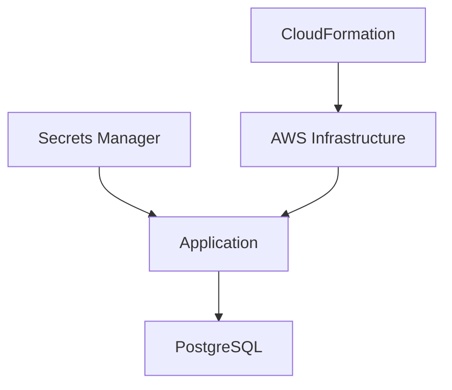
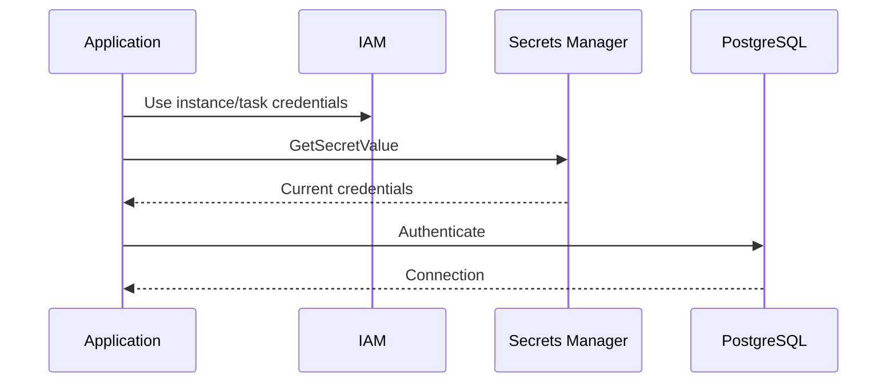
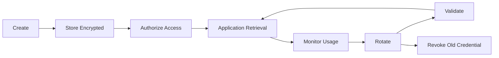

# 04- Secrets and Sensitive Parameters

## Overview

CloudFormation templates frequently require sensitive configuration such as database passwords, API keys, OAuth client secrets, encryption keys, and private configuration values.

The security challenge is not simply how to pass a secret into CloudFormation. The real challenge is preventing the secret from appearing in:

- Source control
- CloudFormation templates
- CloudFormation parameters
- Stack outputs
- CloudFormation events
- CI/CD logs
- Resource metadata
- Generated configuration
- Application logs
- Infrastructure state and artifacts

A production architecture should therefore separate infrastructure definition from secret storage:

```text
CloudFormation Template
        |
        | references secret
        v
Secrets Manager / SSM Parameter Store
        |
        | controlled retrieval
        v
AWS Resource / Application
```

The preferred model is:

```text
Store secret securely
        |
        v
Reference secret from infrastructure
        |
        v
Inject only where required
        |
        v
Prevent secret exposure in logs and outputs
```

## Why Secrets Require Special Handling

Consider a database-backed Django or FastAPI application:

```text
Application
    |
    +--> PostgreSQL
    |
    +--> Redis
    |
    +--> External APIs
```

The application may require:

```text
DATABASE_HOST
DATABASE_NAME
DATABASE_USERNAME
DATABASE_PASSWORD
REDIS_URL
THIRD_PARTY_API_KEY
```

A naive CloudFormation design might place the password directly in the template:

```yaml
Parameters:

  DatabasePassword:
    Type: String
```

and then provide:

```bash
aws cloudformation create-stack \
  --stack-name production-api \
  --template-body file://template.yaml \
  --parameters \
    ParameterKey=DatabasePassword,ParameterValue=super-secret-password
```

This creates multiple security problems.

The password can potentially enter:

```text
Shell history
CI/CD logs
Pipeline configuration
Template artifacts
CloudFormation API requests
Build logs
Debug output
```

The correct question is therefore not:

> How do I hide a password in a CloudFormation parameter?

It is:

> Where should the secret live, and how can CloudFormation or the application retrieve it without unnecessarily exposing the value?

## Secret Storage Options

Common AWS options include:

| Mechanism | Primary Use | Secret Security | Rotation | Typical Usage |
|---|---|---|---|---|
| CloudFormation parameter | Non-sensitive configuration | Low | Manual | Environment/configuration |
| Parameter Store `String` | Configuration | Low | Manual | Non-secret settings |
| Parameter Store `SecureString` | Sensitive configuration | High | Application/process dependent | Passwords, tokens |
| Secrets Manager | Secrets | High | Built-in rotation integrations | Database/API credentials |
| CI/CD secret store | Deployment credentials | Depends on platform | Depends on platform | Pipeline authentication |

For application credentials and secrets requiring lifecycle management, AWS Secrets Manager is generally the stronger choice.

For encrypted configuration values that fit the Parameter Store model, SSM Parameter Store `SecureString` is also useful.

## CloudFormation Parameters

CloudFormation parameters are appropriate for deployment configuration such as:

```yaml
Parameters:

  Environment:
    Type: String
    AllowedValues:
      - development
      - staging
      - production

  InstanceType:
    Type: String
    Default: t3.micro

  LogRetentionDays:
    Type: Number
    Default: 30
```

These values are configuration rather than secrets.

A common mistake is using parameters for every piece of application configuration.

Instead:

```text
CloudFormation Parameters
        |
        +--> Environment
        +--> Region
        +--> Instance Type
        +--> Feature Configuration

Secrets Manager / SSM
        |
        +--> Passwords
        +--> API Keys
        +--> Tokens
        +--> Private Credentials
```

## `NoEcho`

CloudFormation supports the `NoEcho` parameter property for masking parameter values returned through certain CloudFormation APIs.

Example:

```yaml
Parameters:

  DatabasePassword:
    Type: String
    NoEcho: true
```

This is better than:

```yaml
Parameters:

  DatabasePassword:
    Type: String
```

because CloudFormation masks the value in places such as stack descriptions returned through CloudFormation APIs.

However, `NoEcho` does **not** make the value a secure secret store.

It is a masking mechanism, not encryption or secret lifecycle management.

## Limitations of `NoEcho`

`NoEcho` does not protect sensitive values if you deliberately place them somewhere else in the template or stack configuration where CloudFormation does not mask them.

For example:

```yaml
Outputs:

  DatabasePassword:
    Value: !Ref DatabasePassword
```

This is an unsafe design.

Even if:

```yaml
NoEcho: true
```

is configured, exposing the value through an output defeats the security objective.

Sensitive values should not be placed in:

- Outputs
- Resource names
- Resource descriptions
- Metadata
- Tags
- User-facing configuration
- Application logs

AWS explicitly warns that `NoEcho` does not mask information stored in certain template sections such as `Metadata`, `Outputs`, or resource metadata. Therefore it should not be treated as a replacement for proper secret management.

## `NoEcho` vs Secret Management

| Feature | `NoEcho` | Secrets Manager |
|---|---|---|
| Masks CloudFormation parameter output | Yes | Not applicable |
| Secret storage system | No | Yes |
| Encryption at rest | Not its primary purpose | Yes |
| Secret rotation | No | Yes |
| Versioning | No | Yes |
| Fine-grained IAM access | Limited to CloudFormation access | Yes |
| Application secret retrieval | Indirect | Yes |
| Recommended for long-lived production secrets | No | Yes |

The distinction is:

```text
NoEcho
    =
Reduce accidental CloudFormation exposure

Secrets Manager
    =
Store and manage secrets securely
```

## Why Passing Secrets Through CLI Is Risky

Avoid:

```bash
aws cloudformation create-stack \
  --stack-name production-api \
  --template-body file://template.yaml \
  --parameters \
    ParameterKey=DatabasePassword,ParameterValue='super-secret'
```

The secret may be exposed through:

- Shell history
- Process inspection
- CI/CD command logs
- Debug output
- Audit tooling
- Terminal recordings

Even if CloudFormation masks the parameter afterward, the secret may already have leaked before CloudFormation receives it.

A safer approach is to keep the secret in a dedicated secret store and reference it from the infrastructure.

## AWS Secrets Manager

Secrets Manager is designed for storing sensitive values such as:

- Database credentials
- API keys
- OAuth credentials
- Service credentials
- Application secrets

A secret can contain structured JSON:

```json
{
  "username": "application",
  "password": "generated-secret",
  "host": "database.example.internal",
  "port": 5432,
  "dbname": "application"
}
```

The application can retrieve the secret at runtime instead of storing the password in the CloudFormation template.

A production architecture can therefore look like:



The infrastructure and secret lifecycle are separated.

## Creating a Secret

A secret can be created independently:

```bash
aws secretsmanager create-secret \
  --name production/api/database \
  --description "Production API database credentials" \
  --secret-string file://database-secret.json
```

The secret should be protected with IAM permissions so that only authorized workloads can retrieve it.

## Secret Retrieval

An application can retrieve the secret at runtime.

For Python:

```python
import json
import boto3

client = boto3.client("secretsmanager")

response = client.get_secret_value(
    SecretId="production/api/database"
)

secret = json.loads(response["SecretString"])

database_password = secret["password"]
```

In production, the application's IAM role should be allowed to read only the specific secret it requires.

For example:

```json
{
  "Version": "2012-10-17",
  "Statement": [
    {
      "Effect": "Allow",
      "Action": "secretsmanager:GetSecretValue",
      "Resource": "arn:aws:secretsmanager:ap-south-1:123456789012:secret:production/api/database-*"
    }
  ]
}
```

The application should not receive:

```text
secretsmanager:*
Resource: *
```

unless there is a documented requirement.

## Secrets Manager Dynamic References

CloudFormation supports dynamic references to external secret stores.

For Secrets Manager, the general syntax is:

```text
{{resolve:secretsmanager:secret-id:SecretString:json-key}}
```

For example:

```yaml
Resources:

  Database:
    Type: AWS::RDS::DBInstance
    Properties:
      MasterUsername: !Sub "{{resolve:secretsmanager:production/api/database:SecretString:username}}"
      MasterUserPassword: !Sub "{{resolve:secretsmanager:production/api/database:SecretString:password}}"
```

The important architectural property is:

```text
CloudFormation Template
        |
        | Secret reference
        v
Secrets Manager
        |
        | Secret value
        v
Target Resource
```

The secret value itself does not need to be hardcoded into the template.

## Dynamic References

Dynamic references allow CloudFormation to retrieve values from external services during stack processing.

Common forms include:

```text
{{resolve:secretsmanager:...}}
{{resolve:ssm:...}}
{{resolve:ssm-secure:...}}
```

They are useful when a resource property needs a value from:

- AWS Secrets Manager
- SSM Parameter Store

This allows infrastructure code to contain a reference rather than the secret itself.

## Secrets Manager vs SSM Parameter Store

| Requirement | Secrets Manager | SSM Parameter Store |
|---|---:|---:|
| Store secrets | Yes | Yes |
| SecureString | N/A | Yes |
| Automatic rotation integrations | Strong | Limited |
| Secret versioning | Yes | Yes |
| Configuration storage | Yes | Excellent |
| Simple key/value configuration | Good | Excellent |
| Application credentials | Excellent | Good |
| Dynamic CloudFormation references | Yes | Yes |

A practical rule is:

```text
Application secret
    → Secrets Manager

Encrypted configuration value
    → SSM SecureString

Normal configuration
    → SSM String / CloudFormation Parameter
```

The exact choice should follow the application's lifecycle and operational requirements.

## SSM Parameter Store

A secure parameter can be stored using `SecureString`.

Example:

```bash
aws ssm put-parameter \
  --name /production/api/database/password \
  --type SecureString \
  --value 'generated-secret' \
  --overwrite
```

The application can retrieve it using:

```bash
aws ssm get-parameter \
  --name /production/api/database/password \
  --with-decryption
```

The application role should have permission only for the required parameter.

```json
{
  "Version": "2012-10-17",
  "Statement": [
    {
      "Effect": "Allow",
      "Action": "ssm:GetParameter",
      "Resource": "arn:aws:ssm:ap-south-1:123456789012:parameter/production/api/database/password"
    }
  ]
}
```

## SecureString Dynamic Reference

A CloudFormation template can reference an SSM `SecureString` parameter:

```yaml
Resources:

  Application:
    Type: AWS::EC2::Instance
    Properties:
      UserData:
        Fn::Base64: !Sub |
          #!/bin/bash
          DATABASE_PASSWORD='{{resolve:ssm-secure:/production/api/database/password}}'
```

However, injecting secrets into `UserData` requires special care because the resulting data can potentially be inspected through instance metadata, logs, configuration management systems, or other operational tooling.

For production applications, runtime retrieval through Secrets Manager or SSM is often preferable.

## Runtime Secret Retrieval

A strong production architecture is:

```text
CloudFormation
      |
      +--> ECS Task Definition
      |
      +--> IAM Task Role
      |
      +--> Secrets Manager Secret
                 |
                 v
           Application
                 |
                 v
        Runtime Secret Retrieval
```

For example:

```text
FastAPI Container
      |
      | GetSecretValue
      v
Secrets Manager
      |
      | credentials
      v
FastAPI
      |
      v
PostgreSQL
```

The container image does not contain the secret.

The Git repository does not contain the secret.

The CloudFormation template contains only the infrastructure relationship.

## ECS Secret Injection

For ECS workloads, secrets can be injected into containers using the ECS task definition.

Example:

```yaml
Resources:

  ApiTaskDefinition:
    Type: AWS::ECS::TaskDefinition
    Properties:
      Family: production-api
      RequiresCompatibilities:
        - FARGATE
      NetworkMode: awsvpc
      Cpu: "512"
      Memory: "1024"

      ExecutionRoleArn: !GetAtt ExecutionRole.Arn
      TaskRoleArn: !GetAtt ApplicationTaskRole.Arn

      ContainerDefinitions:
        - Name: api
          Image: 123456789012.dkr.ecr.ap-south-1.amazonaws.com/api:latest

          Secrets:
            - Name: DATABASE_PASSWORD
              ValueFrom: arn:aws:secretsmanager:ap-south-1:123456789012:secret:production/api/database-password
```

The task role or execution role requirements depend on the specific ECS secret injection mechanism and configuration.

The application should receive only the secret values it actually requires.

## Secrets and Kubernetes

The same principle applies when CloudFormation provisions infrastructure for Kubernetes.

Avoid:

```text
CloudFormation
      |
      v
Hardcoded Kubernetes Secret
      |
      v
Cluster
```

Prefer:

```text
Secrets Manager
      |
      v
Secrets Integration
      |
      v
Kubernetes Workload
```

The exact implementation can use AWS-supported integrations such as the Secrets Store CSI Driver or an application-level secret retrieval mechanism.

The important principle is independent secret storage and controlled runtime access.

## Secrets and Docker

Never place production secrets in:

```dockerfile
ENV DATABASE_PASSWORD=super-secret
```

or:

```dockerfile
ENV API_KEY=super-secret
```

Secrets baked into an image can remain accessible through:

- Image layers
- Container inspection
- Registries
- Build caches
- CI/CD artifacts

Instead:

```text
Docker Image
    |
    | no secrets
    v
Container Runtime
    |
    v
Secret Store
```

CloudFormation should provision the infrastructure required for runtime secret retrieval rather than embedding credentials into container images.

## Secrets and CI/CD

CI/CD systems should authenticate to AWS using short-lived credentials where possible.

Avoid:

```text
GitHub Actions
    |
    +--> Hardcoded AWS Access Key
    +--> Hardcoded DB Password
```

Prefer:

```text
GitHub Actions
      |
      | OIDC
      v
AWS IAM Role
      |
      v
CloudFormation
      |
      v
AWS Resources
```

Application secrets remain in:

```text
Secrets Manager
```

rather than in GitHub Actions variables unless they genuinely belong to the deployment system.

## Secret Rotation

Secrets should have a defined lifecycle.

For example:

```text
Create
  |
  v
Use
  |
  v
Rotate
  |
  v
Validate
  |
  v
Revoke Old Version
```

Secrets Manager supports rotation mechanisms for supported credential patterns.

The application architecture must tolerate credential changes.

For example:

```text
Application
    |
    +--> Retrieve current credentials
    |
    +--> Connection pool
    |
    +--> Database
```

If credentials rotate while a long-lived application process continues using cached credentials, the application may require reconnection or secret refresh logic.

## Rotation and Connection Pools

A Django or FastAPI application commonly maintains database connection pools.

Consider:

```text
Secret Version 1
      |
      v
Application
      |
      v
PostgreSQL Connections
```

After rotation:

```text
Secret Version 2
      |
      v
Application
      |
      v
New PostgreSQL Connections
```

Existing connections may continue to use credentials established under the old credentials depending on the database and connection lifecycle.

Production applications should therefore define:

- Secret refresh strategy.
- Connection lifetime.
- Retry behavior.
- Rotation coordination.
- Failure handling.

## Secret Versioning

Secrets Manager supports versions and staging labels.

Conceptually:

```text
Secret
 |
 +--> Version A
 |
 +--> Version B
 |
 +--> Version C
```

A deployment should generally consume the current intended version rather than hardcoding historical secret material.

Version-aware designs are especially useful during rotation and rollback.

## Do Not Store Secrets in Outputs

Avoid:

```yaml
Outputs:

  DatabasePassword:
    Description: Database password
    Value: !Ref DatabasePassword
```

Outputs are designed to expose useful stack information.

They are not a secret storage mechanism.

Prefer:

```yaml
Outputs:

  DatabaseEndpoint:
    Description: Database endpoint
    Value: !GetAtt Database.Endpoint.Address
```

An endpoint is generally configuration information, whereas a password is sensitive authentication material.

## Do Not Store Secrets in Resource Names

Avoid:

```yaml
BucketName: !Sub "api-${DatabasePassword}"
```

or:

```yaml
RoleName: !Sub "api-${ApiKey}"
```

Secrets can become embedded into resource identifiers, which may appear in:

- CloudTrail
- AWS console views
- API responses
- Logs
- Metrics
- Resource inventories

Secrets should never influence resource naming.

## Do Not Store Secrets in Tags

Avoid:

```yaml
Tags:
  - Key: DatabasePassword
    Value: !Ref DatabasePassword
```

Tags are operational metadata, not secure storage.

Use tags for:

```text
Environment
Application
Owner
CostCenter
ManagedBy
```

not:

```text
Password
API Key
Token
Private Key
```

## Do Not Store Secrets in Metadata

Avoid:

```yaml
Metadata:
  DatabasePassword: !Ref DatabasePassword
```

Metadata can be exposed through CloudFormation APIs and tooling.

`NoEcho` does not make arbitrary metadata secure.

The correct architecture is:

```text
Secret
   |
   v
Secret Store
   |
   v
Controlled Runtime Access
```

## Secrets in `UserData`

`UserData` deserves special attention.

Avoid:

```yaml
UserData:
  Fn::Base64: !Sub |
    #!/bin/bash
    export DATABASE_PASSWORD="${DatabasePassword}"
```

Even if the parameter uses `NoEcho`, the resulting value can become part of instance initialization data or operational artifacts.

A better design is:

```text
EC2 Instance
    |
    +--> IAM Instance Role
            |
            v
      Secrets Manager
            |
            v
      Runtime Retrieval
```

The instance retrieves the secret when required.

## Secret Retrieval Architecture

A production EC2 application might use:



No static AWS credentials are required inside the application.

## IAM Policy for Secret Access

Least privilege should be applied to secret retrieval.

Prefer:

```json
{
  "Version": "2012-10-17",
  "Statement": [
    {
      "Sid": "ReadApplicationDatabaseSecret",
      "Effect": "Allow",
      "Action": "secretsmanager:GetSecretValue",
      "Resource": "arn:aws:secretsmanager:ap-south-1:123456789012:secret:production/api/database-*"
    }
  ]
}
```

Avoid:

```json
{
  "Effect": "Allow",
  "Action": "secretsmanager:*",
  "Resource": "*"
}
```

The application should not be able to read unrelated secrets.

## KMS and Secrets

Secrets Manager and SSM SecureString can use AWS KMS for encryption.

The architecture can be:

```text
Application IAM Role
        |
        v
Secrets Manager
        |
        v
KMS
        |
        v
Encrypted Secret
```

For customer-managed KMS keys, permissions must be configured correctly across IAM and the KMS key policy.

This creates another authorization layer:

```text
Can application read secret?
        |
        v
Secrets Manager permission
        |
        v
Can required principal use KMS key?
```

KMS permissions should therefore be reviewed whenever customer-managed keys are introduced.

## Secret ARN References

When CloudFormation needs to reference a secret, prefer stable identifiers rather than embedding secret values.

For example:

```yaml
Parameters:

  DatabaseSecretArn:
    Type: String
```

Then:

```yaml
ValueFrom: !Ref DatabaseSecretArn
```

The parameter contains an ARN, not the secret itself.

This is an important pattern:

```text
Safe configuration:

SECRET_ARN
    |
    v
Secret Store
    |
    v
Secret Value
```

rather than:

```text
Unsafe configuration:

SECRET_VALUE
    |
    v
CloudFormation Parameter
```

## Dynamic References and Secret Values

Dynamic references are useful because the template can contain:

```text
Reference
```

instead of:

```text
Secret Value
```

Conceptually:

```text
Template
  |
  | "{{resolve:secretsmanager:...}}"
  v
CloudFormation
  |
  v
Secret Store
  |
  v
Target Resource
```

This reduces the need to expose secret material in infrastructure source code.

However, dynamic references do not mean that the secret is universally invisible.

Once resolved into a target resource property, the resulting resource or service may expose or retain the value according to that service's own behavior.

The security review must therefore cover the destination resource as well.

## Secret References and CloudFormation Events

CloudFormation events can reveal resource operation details.

Avoid designs where sensitive values become part of:

```text
Resource properties
Logical IDs
Resource names
Error messages
Custom resource responses
```

The goal is:

```text
CloudFormation Events
        |
        v
Operational information
        |
        X
No secret values
```

Applications and custom resources should also avoid returning sensitive values in error messages.

## Custom Resources

Custom resources require additional caution.

A custom resource Lambda may receive properties containing sensitive information.

For example:

```yaml
Resources:

  SecretConfiguration:
    Type: Custom::SecretConfiguration
    Properties:
      ServiceToken: !GetAtt SecretHandler.Arn
      SecretArn: !Ref DatabaseSecret
```

Passing the ARN is preferable to passing the actual secret value.

Avoid:

```yaml
Properties:
  Password: !Sub "{{resolve:secretsmanager:production/api/database:SecretString:password}}"
```

The custom resource implementation and CloudFormation integration must be designed carefully because custom resource request and response payloads can become visible through logs or other operational systems.

Prefer passing a secret identifier and having the custom resource retrieve the secret using its IAM role when appropriate.

## Secret Identifiers vs Secret Values

This is a useful production rule:

```text
Secret ARN
    = reference

Secret Value
    = sensitive data
```

Prefer:

```yaml
SecretArn: arn:aws:secretsmanager:...
```

over:

```yaml
Password: actual-password
```

The application or controlled resource should retrieve the actual secret only when required.

## Secrets in CloudFormation Templates

Never commit:

```yaml
DatabasePassword: MyProductionPassword123
```

to Git.

This includes:

- Private repositories.
- Public repositories.
- Infrastructure branches.
- Example production templates.
- Pull requests.
- Git tags.

Git history is persistent.

Deleting the value from the latest commit does not necessarily remove it from historical commits.

If a secret is accidentally committed:

```text
1. Revoke / rotate secret
2. Investigate exposure
3. Remove secret from repository
4. Remove from CI/CD artifacts where applicable
5. Audit access
6. Replace compromised credentials
```

Do not rely solely on Git history rewriting.

## Secret Scanning

Infrastructure repositories should use secret scanning.

Useful controls include:

- GitHub secret scanning.
- Pre-commit secret scanners.
- CI/CD secret scanning.
- AWS-native detection capabilities.
- Repository protection rules.

A production pipeline should reject obvious credential leaks before deployment.

## Secret Handling in Pull Requests

Avoid putting real values in:

```text
Pull request descriptions
Pull request comments
Review screenshots
Test output
CI logs
Issue trackers
```

Use placeholders:

```text
DATABASE_PASSWORD=<stored-in-secrets-manager>
```

rather than:

```text
DATABASE_PASSWORD=production-password
```

## Development vs Production

Development environments should not reuse production secrets.

Prefer:

```text
Development
    |
    +--> /development/api/database

Staging
    |
    +--> /staging/api/database

Production
    |
    +--> /production/api/database
```

rather than:

```text
All environments
    |
    +--> production/database
```

This reduces the impact of compromised development credentials.

## Account-Level Isolation

For organizations using separate AWS accounts:

```text
AWS Organization
│
├── Development Account
│   └── Development Secrets
│
├── Staging Account
│   └── Staging Secrets
│
└── Production Account
    └── Production Secrets
```

This is stronger than merely using different parameter prefixes inside one account.

The account boundary becomes part of the security architecture.

## Secret Lifecycle

A production secret should have a defined lifecycle:



A secret is not adequately managed simply because it is encrypted at rest.

Operational questions include:

- Who owns it?
- Who can retrieve it?
- How is it rotated?
- How is rotation tested?
- What happens if retrieval fails?
- How is compromise detected?
- How is access audited?
- How is the old credential revoked?

## Failure Handling

Applications should treat secret retrieval as a production dependency.

For example:

```text
Application Start
      |
      v
Retrieve Secret
      |
   +--+--+
   |     |
Success  Failure
   |       |
   v       v
Start    Fail Fast
App      or controlled retry
```

For critical credentials such as database authentication, failing fast may be safer than starting an application in a partially configured state.

For transient AWS API failures, bounded retries with exponential backoff can be appropriate.

Avoid infinite retries.

## Secret Caching

Fetching a secret from Secrets Manager on every request is usually unnecessary.

Bad:

```text
HTTP Request
    |
    v
Secrets Manager
    |
    v
Database
```

for every API request.

Prefer:

```text
Application Startup
      |
      v
Secrets Manager
      |
      v
In-Memory Configuration
      |
      v
Application Requests
```

The trade-off is that cached secrets may remain stale after rotation.

A production application should therefore define an appropriate refresh strategy.

## Django Example

A Django application can retrieve configuration from a secret store during startup.

Conceptually:

```python
import json
import boto3
from django.core.exceptions import ImproperlyConfigured

def get_database_secret(secret_id: str) -> dict:
    client = boto3.client("secretsmanager")

    try:
        response = client.get_secret_value(SecretId=secret_id)
    except Exception as exc:
        raise ImproperlyConfigured(
            "Unable to retrieve database credentials"
        ) from exc

    return json.loads(response["SecretString"])
```

The secret identifier can come from normal configuration:

```text
DATABASE_SECRET_ARN
```

while the password remains in Secrets Manager.

The application should avoid logging the returned dictionary.

Bad:

```python
logger.info("Database configuration: %s", secret)
```

Good:

```python
logger.info("Database credentials retrieved successfully")
```

## FastAPI Example

The same model applies to FastAPI.

```python
import json
import boto3

def load_database_credentials(secret_id: str) -> dict:
    client = boto3.client("secretsmanager")

    response = client.get_secret_value(
        SecretId=secret_id
    )

    return json.loads(response["SecretString"])
```

The secret should be loaded into controlled application configuration and never exposed through API responses.

## Secret Exposure Through Logging

One of the most common production failures is accidental logging.

Bad:

```python
logger.info("Configuration: %s", config)
```

if `config` contains:

```text
password
api_key
token
secret
private_key
```

Prefer explicit safe logging:

```python
logger.info(
    "Application configuration loaded",
    extra={
        "environment": environment,
        "secret_loaded": True,
    },
)
```

Never assume that production logs are private enough to justify logging secrets.

## Monitoring

Monitor:

- Secret access.
- Unexpected secret retrieval.
- Failed secret retrieval.
- IAM policy changes.
- KMS access.
- Secret rotation failures.
- Unauthorized access attempts.
- Changes to secret configuration.
- CloudFormation stack changes involving secret references.

CloudTrail should be part of the audit architecture.

```text
Application
    |
    v
Secrets Manager
    |
    v
CloudTrail
    |
    v
Security Monitoring
```

## Cost Considerations

Secrets management introduces operational cost.

Secrets Manager generally costs more than basic configuration storage because it is designed for managed secret lifecycle capabilities.

The decision should consider:

```text
Security Requirements
        +
Rotation Requirements
        +
Operational Complexity
        +
Access Frequency
        +
Cost
```

Do not choose a weaker secret-management mechanism solely to save a small infrastructure cost.

## High Availability

Secret retrieval should not become a single point of application failure.

Applications should define:

- Startup retry behavior.
- Secret caching.
- Connection retry behavior.
- Rotation handling.
- Regional strategy for critical workloads.
- Disaster recovery procedures.

For highly critical workloads, disaster recovery planning should include how secrets are restored or accessed in the recovery environment.

## Disaster Recovery

A production recovery plan should answer:

```text
If the primary environment is unavailable:

Where is the secret?
Who can access it?
Can the recovery workload assume the required IAM role?
Is the KMS key available?
Can the application retrieve the secret?
Are rotated credentials valid?
```

For multi-Region architectures:

```text
Primary Region
    |
    +--> Secrets Manager
    |
    v
Application

Recovery Region
    |
    +--> Secret strategy
    |
    v
Recovery Application
```

The secret strategy must be part of the disaster recovery design rather than an afterthought.

## Production Best Practices

- Never hardcode production secrets in CloudFormation templates.
- Never commit secrets to Git.
- Avoid passing plaintext secrets through CLI arguments.
- Use Secrets Manager for application secrets requiring lifecycle management.
- Use SSM `SecureString` for appropriate encrypted configuration.
- Use CloudFormation dynamic references where they provide a suitable integration.
- Use `NoEcho` only as a masking mechanism, not as a secret store.
- Never place sensitive values in CloudFormation Outputs.
- Never place secrets in resource names or tags.
- Avoid putting secrets into `Metadata`.
- Be careful when injecting secrets into EC2 `UserData`.
- Prefer runtime secret retrieval for application workloads.
- Restrict secret access using least-privilege IAM policies.
- Separate secrets by environment and account.
- Use short-lived AWS credentials for CI/CD where possible.
- Use OIDC-based CI/CD authentication where supported.
- Rotate long-lived credentials.
- Monitor secret access with CloudTrail and security tooling.
- Never log secret values.
- Avoid returning secrets from custom resources.
- Pass secret identifiers rather than secret values when designing integrations.
- Define secret rotation and disaster recovery procedures.
- Test secret rotation before enabling it in production.
- Treat secret access as a production security boundary.

## Security Checklist

Before deploying sensitive configuration:

- [ ] No plaintext secrets exist in the CloudFormation template.
- [ ] No secrets are committed to Git.
- [ ] No secrets are passed through CLI arguments unnecessarily.
- [ ] Secrets are stored in Secrets Manager or SSM SecureString where appropriate.
- [ ] CloudFormation parameters contain references or non-sensitive configuration rather than secret values.
- [ ] `NoEcho` is used where sensitive parameters are unavoidable.
- [ ] Secrets are not exposed through Outputs.
- [ ] Secrets are not stored in Metadata.
- [ ] Secrets are not used in resource names.
- [ ] Secrets are not stored in tags.
- [ ] EC2 UserData does not unnecessarily contain secret values.
- [ ] Secret access uses least-privilege IAM policies.
- [ ] Application roles can access only required secrets.
- [ ] KMS permissions are reviewed where customer-managed keys are used.
- [ ] CI/CD logs cannot expose secrets.
- [ ] Application logs cannot expose secrets.
- [ ] Secret rotation has been tested.
- [ ] Secret retrieval failure behavior is defined.
- [ ] Disaster recovery includes secret availability.
- [ ] CloudTrail monitoring is enabled for relevant secret operations.

## Common Mistakes

### Hardcoding Secrets in Templates

Bad:

```yaml
DatabasePassword: production-password
```

**Why it fails:** the credential becomes part of infrastructure source code and potentially Git history.

**Use instead:** Secrets Manager or SSM SecureString.

### Assuming `NoEcho` Encrypts Secrets

`NoEcho` masks certain CloudFormation API responses. It is not a replacement for secure secret storage.

**Use instead:** a dedicated secret store.

### Exposing Secrets Through Outputs

Bad:

```yaml
Outputs:
  Password:
    Value: !Ref DatabasePassword
```

**Why it fails:** outputs are designed for exposing stack information.

**Use instead:** expose non-sensitive identifiers such as endpoints or ARNs.

### Logging Secret Objects

Bad:

```python
logger.info("Loaded config: %s", config)
```

**Why it fails:** the application may send credentials to centralized logs.

**Use instead:** log only non-sensitive status information.

### Storing Secrets in Docker Images

Bad:

```dockerfile
ENV API_KEY=production-secret
```

**Why it fails:** the secret becomes part of the image configuration or build artifacts.

**Use instead:** runtime secret injection.

### Giving Applications Access to All Secrets

Bad:

```json
{
  "Effect": "Allow",
  "Action": "secretsmanager:GetSecretValue",
  "Resource": "*"
}
```

**Why it fails:** compromise of one workload can expose unrelated application credentials.

**Use instead:** scope access to specific secret ARNs.

### Reusing Production Secrets in Development

**Why it fails:** development environments typically have a larger attack surface.

**Use instead:** separate environment-specific secrets.

### Passing Secrets Through `UserData`

**Why it fails:** instance initialization data can become accessible through operational mechanisms.

**Use instead:** runtime retrieval using the instance role.

### Treating Secret Rotation as an Infrastructure-Only Problem

**Why it fails:** applications often cache credentials or maintain long-lived connections.

**Use instead:** design application refresh and connection lifecycle behavior alongside rotation.

### Putting Secret Values Into Resource Names

**Why it fails:** identifiers can appear in APIs, logs, inventory systems, and audit records.

**Use instead:** use stable non-sensitive identifiers.

## Interview Traps

### Is `NoEcho: true` Enough to Secure a Password?

No.

`NoEcho` masks sensitive parameter values in certain CloudFormation API responses, but it does not turn CloudFormation parameters into a dedicated secret-management system.

### Where Should Production Database Passwords Be Stored?

Typically in AWS Secrets Manager or, for appropriate use cases, SSM Parameter Store `SecureString`.

### Should a Secret Be Passed as a CloudFormation Parameter?

Prefer passing a secret identifier or reference rather than the actual secret value.

### What Is a Dynamic Reference?

A dynamic reference allows CloudFormation to retrieve a value from services such as Secrets Manager or SSM Parameter Store during stack processing.

Example:

```text
{{resolve:secretsmanager:secret-id:SecretString:password}}
```

### Should Secrets Be Stored in CloudFormation Outputs?

No.

Outputs are intended for exposing stack information and should not contain passwords, API keys, tokens, or other sensitive values.

### Is a Secret Safe If It Is in a Private Git Repository?

No.

A private repository reduces public exposure but does not make credentials safe. Repository access, forks, backups, Git history, CI systems, and compromised accounts can still expose the secret.

### Why Is Runtime Secret Retrieval Often Better?

It separates:

```text
Infrastructure
    from
Secret Value
```

The application can retrieve the current secret when needed without embedding credentials into source code or container images.

### What Is the Difference Between Secrets Manager and SSM Parameter Store?

Secrets Manager is purpose-built for secret lifecycle management and rotation. SSM Parameter Store is a broader configuration store that also supports encrypted `SecureString` parameters.

### Should Secrets Be Cached?

Often yes, to avoid unnecessary secret-store calls.

However, caching introduces a rotation trade-off. The application must have a strategy for refreshing credentials when secrets change.

### Can a Secret Be Used in `UserData`?

Technically possible in some designs, but it should be avoided when the value can instead be retrieved securely at runtime. Initialization data can become an operational exposure point.

### What Is the Best Secret Architecture for a FastAPI or Django Application?

A common production model is:

```text
CloudFormation
      |
      +--> IAM Task / Instance Role
      |
      +--> Application Infrastructure
      |
      v
Secrets Manager
      |
      v
FastAPI / Django
      |
      v
PostgreSQL / External Services
```

The application retrieves only the secrets it requires.

### Should CI/CD Store Application Database Passwords?

Prefer not to.

CI/CD should deploy infrastructure and configure secret references. The application workload should retrieve its runtime secrets from AWS.

## Key Takeaways

- Do not hardcode production secrets in CloudFormation templates.
- Do not commit secrets to Git, even in private repositories.
- `NoEcho` masks CloudFormation parameter values in certain API responses; it is not a secret-management system.
- Never expose sensitive parameters through CloudFormation Outputs.
- Never store secrets in resource names, tags, Metadata, or unnecessary `UserData`.
- Use AWS Secrets Manager for application secrets that require secure storage and lifecycle management.
- Use SSM Parameter Store `SecureString` for appropriate encrypted configuration.
- Use dynamic references when CloudFormation needs to reference values stored in Secrets Manager or SSM.
- Prefer passing secret identifiers over secret values.
- Runtime secret retrieval is generally preferable for Django, FastAPI, ECS, EC2, and other long-running workloads.
- Apply least-privilege IAM permissions to secret retrieval.
- Do not grant applications access to all secrets in an account.
- Keep development, staging, and production secrets separated.
- Use short-lived CI/CD authentication rather than long-lived credentials where possible.
- Never log secret values.
- Treat secret rotation as an application lifecycle concern as well as an infrastructure concern.
- Plan for secret availability during disaster recovery.
- Monitor secret access and related IAM activity.
- The core production pattern is:

```text
                    CloudFormation
                          |
                          | provisions
                          v
                  Application IAM Role
                          |
                          | authorized access
                          v
                  Secrets Manager
                          |
                          | current secret
                          v
                  Django / FastAPI
                          |
                          v
                 PostgreSQL / APIs
```

- The fundamental rule is:

```text
Infrastructure code should reference secrets.
It should not contain secrets.
```