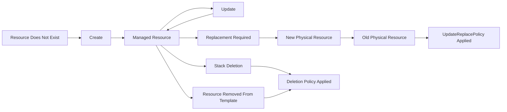
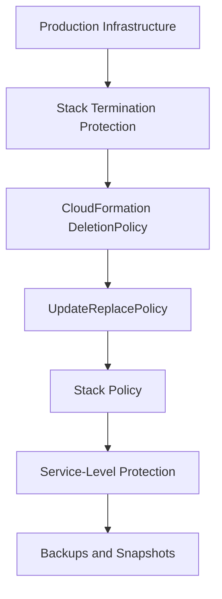
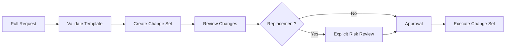
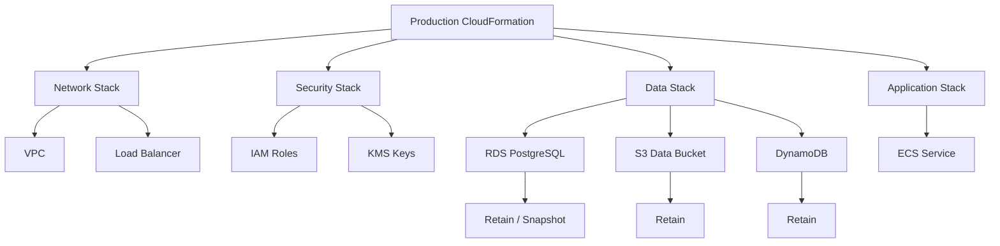

# 05- Resource Protection and Deletion Controls

## Overview

CloudFormation manages resources through a declarative lifecycle. When a stack is created, updated, or deleted, CloudFormation determines which resources must be created, modified, replaced, or removed based on the template and stack state.

For production systems, resource deletion is a high-risk operation. A mistaken template change can potentially delete or replace resources such as:

- Amazon RDS databases
- S3 buckets
- DynamoDB tables
- ECS services
- IAM resources
- VPC networking components
- CloudFormation stacks

CloudFormation provides several mechanisms to control this lifecycle:

| Mechanism | Primary Purpose |
|---|---|
| `DeletionPolicy` | Controls what happens to a resource when it is removed from the stack or the stack is deleted |
| `UpdateReplacePolicy` | Controls what happens to the old physical resource when an update requires replacement |
| Stack termination protection | Prevents accidental stack deletion |
| Resource import | Brings existing resources under CloudFormation management without recreating them |
| Change Sets | Preview resource changes before execution |
| Stack policies | Restrict updates to protected resources |
| Retain resources | Preserve critical data independently of stack lifecycle |
| Nested stack protection strategy | Protect critical child resources in modular architectures |

The key production principle is:

```text
Infrastructure lifecycle
        |
        +--> Application resources
        |
        +--> Stateful resources
        |
        +--> Critical shared resources
                  |
                  v
          Explicit protection
```

## Why Resource Protection Matters

CloudFormation treats infrastructure as code. This provides repeatability, but it also means that an incorrect declaration can cause a real infrastructure change.

Consider an application architecture:

```text
                    CloudFormation Stack
                           |
          +----------------+----------------+
          |                |                |
          v                v                v
      ECS Service       ALB             RDS Database
                                           |
                                           v
                                      Production Data
```

Deleting the stack should normally remove:

```text
ECS Service
ALB
Supporting Infrastructure
```

but deleting:

```text
RDS Database
```

may result in irreversible data loss.

Therefore, infrastructure should distinguish between:

```text
Stateless resource
    → Usually safe to recreate

Stateful resource
    → Requires explicit deletion protection
```

## Resource Lifecycle

A CloudFormation resource can experience several lifecycle events:



The important distinction is that **deletion and replacement are different lifecycle events**.

This distinction is why production templates often need both:

```yaml
DeletionPolicy:
UpdateReplacePolicy:
```

## DeletionPolicy

`DeletionPolicy` controls what CloudFormation does to a resource when the resource is deleted from the stack or when the stack itself is deleted.

Common values include:

```yaml
DeletionPolicy: Delete
```

```yaml
DeletionPolicy: Retain
```

```yaml
DeletionPolicy: Snapshot
```

The correct choice depends on whether the resource contains important persistent state.

## Delete

The default behavior for most resources is effectively:

```yaml
DeletionPolicy: Delete
```

When CloudFormation deletes the resource, the underlying resource is also deleted.

Example:

```yaml
Resources:

  ApplicationBucket:
    Type: AWS::S3::Bucket
    DeletionPolicy: Delete
```

This can be appropriate for disposable resources such as:

- Temporary development resources
- Ephemeral test infrastructure
- Stateless compute resources
- Disposable CI environments

It is dangerous for resources containing business-critical data.

## Retain

`Retain` removes the resource from CloudFormation management while preserving the physical resource.

Example:

```yaml
Resources:

  ProductionBucket:
    Type: AWS::S3::Bucket
    DeletionPolicy: Retain
```

If the stack is deleted:

```text
CloudFormation Stack
        |
        X
     Deleted
        |
        v
S3 Bucket
        |
        v
Still Exists
```

CloudFormation no longer manages the retained resource as part of that stack.

This is useful for:

- Production databases
- Data buckets
- Critical persistent storage
- Shared resources
- Resources requiring manual lifecycle management

## Retain Does Not Mean "Still Managed"

This distinction is important.

Suppose:

```yaml
DeletionPolicy: Retain
```

is applied to an RDS instance.

When the stack is deleted:

```text
CloudFormation
    |
    X stack deleted
    |
    v
RDS instance remains
```

But CloudFormation is no longer managing that resource through the deleted stack.

The resource becomes an independently existing AWS resource.

This can create operational responsibilities:

- Resource discovery
- Cost management
- Backup management
- Security management
- Manual deletion
- Re-importing into CloudFormation if required

`Retain` protects the resource from deletion; it does not automatically provide ongoing infrastructure governance.

## Snapshot

For resource types that support snapshots, `Snapshot` can preserve data by creating a snapshot before deletion.

Example:

```yaml
Resources:

  ProductionDatabase:
    Type: AWS::RDS::DBInstance
    DeletionPolicy: Snapshot
```

The lifecycle becomes:

```text
Stack deletion
      |
      v
RDS instance deletion
      |
      v
Snapshot created
      |
      v
Database instance removed
```

This is useful when you want:

```text
Resource removed
+
Recoverable data
```

rather than:

```text
Resource removed
+
No retained data
```

Snapshot support is resource-type specific, so the behavior must be checked against the resource's CloudFormation documentation.

## Retain vs Snapshot vs Delete

| Policy | Resource Deleted | Data Preserved | Typical Usage |
|---|---:|---:|---|
| `Delete` | Yes | Usually no | Disposable infrastructure |
| `Retain` | No | Yes | Critical persistent resources |
| `Snapshot` | Yes | Snapshot | Stateful resources supporting snapshots |

A common production pattern is:

```text
Development
    → Delete

Staging
    → Snapshot / Retain depending on data requirements

Production
    → Retain or Snapshot
```

The exact policy should be based on recovery requirements rather than environment naming alone.

## UpdateReplacePolicy

`UpdateReplacePolicy` addresses a different scenario.

Some CloudFormation updates cannot be performed in place. CloudFormation must create a new physical resource and replace the old one.

For example:

```text
Existing Resource
       |
       | incompatible property change
       v
Replacement Required
       |
       +--> Create New Resource
       |
       +--> Remove Old Resource
```

`UpdateReplacePolicy` controls what happens to the **old resource** during such a replacement.

Example:

```yaml
Resources:

  ProductionDatabase:
    Type: AWS::RDS::DBInstance

    DeletionPolicy: Retain

    UpdateReplacePolicy: Retain
```

This protects the database both when the stack is deleted and when an update requires replacement.

## Why Both Policies Matter

Consider:

```yaml
DeletionPolicy: Retain
```

without:

```yaml
UpdateReplacePolicy: Retain
```

A developer may assume the database is fully protected.

But an update can cause:

```text
CloudFormation Update
        |
        v
Replacement Required
        |
        v
New DB created
        |
        v
Old DB handled by UpdateReplacePolicy
```

If the old database is deleted during replacement, the `DeletionPolicy` does not necessarily provide the protection you expected for the replacement lifecycle.

For critical stateful resources, explicitly consider both:

```yaml
DeletionPolicy: Retain
UpdateReplacePolicy: Retain
```

or:

```yaml
DeletionPolicy: Snapshot
UpdateReplacePolicy: Snapshot
```

## Production Database Example

A production RDS resource might use:

```yaml
Resources:

  ProductionDatabase:
    Type: AWS::RDS::DBInstance

    DeletionPolicy: Snapshot
    UpdateReplacePolicy: Snapshot

    Properties:
      Engine: postgres
      DBInstanceClass: db.t4g.medium
      AllocatedStorage: 100
      StorageEncrypted: true
      BackupRetentionPeriod: 7
```

The intention is:

```text
Normal update
    |
    +--> Update in place when possible

Replacement required
    |
    +--> Snapshot old database
    +--> Create replacement

Stack deletion
    |
    +--> Snapshot database
    +--> Delete database
```

This provides a recovery mechanism while still allowing infrastructure teardown.

## Retaining Production Data

For especially critical databases, `Retain` may be more appropriate:

```yaml
Resources:

  ProductionDatabase:
    Type: AWS::RDS::DBInstance

    DeletionPolicy: Retain
    UpdateReplacePolicy: Retain
```

This means the database survives CloudFormation deletion and replacement.

The trade-off is operational ownership.

```text
CloudFormation
      |
      | manages lifecycle
      v
RDS

After Retain
      |
      v
RDS remains independently
```

A retained resource must eventually be reconciled with the organization's infrastructure inventory.

## Stack Termination Protection

Stack termination protection protects an entire CloudFormation stack from accidental deletion.

It is particularly useful for:

- Production stacks
- Shared infrastructure
- Networking stacks
- Data stacks
- Security infrastructure

Conceptually:

```text
Delete Stack Request
        |
        v
Termination Protection?
        |
      +---+---+
      |       |
     Yes      No
      |       |
      v       v
Reject     Continue
Deletion    Deletion
```

Enable it with the AWS CLI:

```bash
aws cloudformation update-termination-protection \
  --stack-name production-platform \
  --enable-termination-protection
```

The stack must be explicitly protected before an accidental deletion attempt.

## Termination Protection Is Stack-Level Protection

Termination protection does not mean:

```text
Every resource is protected from every lifecycle operation.
```

It protects against stack deletion.

For example:

```text
Stack Termination Protection
        |
        v
Prevents accidental stack deletion
```

It does not replace:

```text
DeletionPolicy
UpdateReplacePolicy
Stack Policy
Service-specific deletion protection
Backups
```

A mature architecture uses multiple layers.

## Layered Protection Model

A production CloudFormation architecture can use:



Each layer addresses a different failure mode.

| Layer | Protects Against |
|---|---|
| Termination protection | Accidental stack deletion |
| `DeletionPolicy` | Resource deletion during stack lifecycle |
| `UpdateReplacePolicy` | Loss of old resource during replacement |
| Stack policy | Unauthorized or accidental updates |
| Service deletion protection | Service-specific deletion |
| Backups | Data loss and disaster scenarios |

## RDS Deletion Protection

Some AWS services provide their own deletion protection.

For RDS:

```yaml
Resources:

  ProductionDatabase:
    Type: AWS::RDS::DBInstance

    DeletionProtection: true

    DeletionPolicy: Snapshot
    UpdateReplacePolicy: Snapshot
```

These mechanisms operate at different layers.

```text
CloudFormation
    |
    | DeletionPolicy
    v
CloudFormation lifecycle
    |
    | DeletionProtection
    v
RDS service
```

This is stronger than relying on a single protection mechanism.

## S3 Buckets

S3 requires special consideration because a bucket cannot normally be deleted while it contains objects.

A production data bucket might use:

```yaml
Resources:

  ProductionDataBucket:
    Type: AWS::S3::Bucket

    DeletionPolicy: Retain
    UpdateReplacePolicy: Retain

    Properties:
      VersioningConfiguration:
        Status: Enabled
```

This protects the bucket from CloudFormation deletion.

However, `Retain` does not automatically configure:

- Object versioning
- Lifecycle policies
- Replication
- Backup
- Access controls

Those must be configured independently.

## Emptying and Deleting S3 Buckets

For a disposable development bucket:

```yaml
Resources:

  DevelopmentBucket:
    Type: AWS::S3::Bucket

    DeletionPolicy: Delete
```

Stack deletion may still fail if the bucket contains objects.

A production system should not rely on CloudFormation deletion as the mechanism for destructive data cleanup.

For important data, explicit data lifecycle management is safer.

## DynamoDB

A DynamoDB table containing application data should generally have an explicit deletion strategy.

Example:

```yaml
Resources:

  ApplicationTable:
    Type: AWS::DynamoDB::Table

    DeletionPolicy: Retain
    UpdateReplacePolicy: Retain

    Properties:
      BillingMode: PAY_PER_REQUEST

      AttributeDefinitions:
        - AttributeName: id
          AttributeType: S

      KeySchema:
        - AttributeName: id
          KeyType: HASH
```

The exact schema depends on the application's access patterns.

The important point is that infrastructure replacement should not unexpectedly destroy application state.

## Stateful vs Stateless Resources

A useful classification is:

| Resource Type | State | Protection Priority |
|---|---|---|
| EC2 instance | Usually low | Low to medium |
| ECS service | Stateless workload | Medium |
| ALB | Stateless | Low to medium |
| RDS | Persistent | Very high |
| DynamoDB | Persistent | Very high |
| S3 data bucket | Persistent | Very high |
| ElastiCache | Potentially disposable cache | Medium |
| EBS volume | Persistent | High |
| IAM role | Configuration/security state | High |
| VPC | Shared infrastructure | Very high |

The classification should reflect business impact, not simply whether the resource is technically stateful.

## Stack Policies

A CloudFormation stack policy can restrict update operations on protected resources.

A stack policy is useful when certain resources should not be modified casually.

Example:

```json
{
  "Statement": [
    {
      "Effect": "Allow",
      "Action": "Update:*",
      "Principal": "*",
      "Resource": "*"
    },
    {
      "Effect": "Deny",
      "Action": "Update:*",
      "Principal": "*",
      "Resource": "LogicalResourceId/ProductionDatabase"
    }
  ]
}
```

The general strategy is:

```text
Allow normal updates
        |
        v
Explicitly deny updates
        |
        v
Critical resource
```

Stack policies are primarily about protecting resources from updates. They are not a general-purpose IAM authorization system.

## Stack Policy vs IAM

These controls operate at different levels.

| Mechanism | Controls |
|---|---|
| IAM | Who can call AWS APIs |
| Stack policy | Which resources a CloudFormation stack update can modify |
| `DeletionPolicy` | What happens to a resource during deletion |
| `UpdateReplacePolicy` | What happens to the old resource during replacement |
| Service deletion protection | Service-specific destructive operations |

A production security model should not substitute one for another.

## Change Sets

Change Sets allow you to preview how CloudFormation intends to modify a stack before executing the change.

Create one with:

```bash
aws cloudformation create-change-set \
  --stack-name production-api \
  --change-set-name database-change \
  --change-set-type UPDATE \
  --template-body file://template.yaml
```

Inspect it:

```bash
aws cloudformation describe-change-set \
  --stack-name production-api \
  --change-set-name database-change
```

A change set can reveal:

```text
Modify
Replace
Add
Remove
```

Replacement is particularly important for stateful resources.

## Replacement Risk

Suppose an RDS property changes from a supported configuration to one requiring replacement.

The change set may indicate:

```text
Action: Modify
Replacement: True
```

This should trigger an explicit review.

The risk is:

```text
Template change
      |
      v
Resource replacement
      |
      v
Potential data loss / downtime
```

For production databases, a replacement should never be treated as an ordinary configuration update.

## Change Set Review Workflow

A mature deployment pipeline can use:



For high-risk resources, require human approval before execution.

## Detecting Replacement Risk

Review:

- `Replacement: True`
- Resource type
- Logical resource ID
- Physical resource identifier
- Property changes
- Data retention policy
- Downtime impact
- Backup availability
- Rollback behavior

A small template diff can produce a large infrastructure change.

## Logical IDs and Replacement

CloudFormation identifies resources using logical IDs.

Example:

```yaml
Resources:

  ProductionDatabase:
    Type: AWS::RDS::DBInstance
```

Changing the logical ID:

```yaml
Resources:

  PrimaryDatabase:
    Type: AWS::RDS::DBInstance
```

may cause CloudFormation to interpret the change as:

```text
Old Resource
    |
    v
ProductionDatabase

New Resource
    |
    v
PrimaryDatabase
```

This can result in resource replacement or deletion/creation behavior.

Renaming logical IDs should therefore be treated as an infrastructure change, not simply a code refactor.

## Physical IDs

CloudFormation tracks the physical resource created from a logical resource.

For example:

```text
Logical ID:
ProductionDatabase

Physical resource:
prod-api-db-abc123
```

Logical IDs are template identifiers.

Physical IDs identify actual AWS resources.

Protection decisions must consider the physical resource because that is where the actual data and operational state exist.

## Resource Import

Resource import allows an existing AWS resource to be brought under CloudFormation management.

This is useful when:

- Infrastructure existed before CloudFormation.
- A resource was retained after stack deletion.
- An existing resource needs to become managed infrastructure.
- A migration from manually created resources to IaC is underway.

Conceptually:

```text
Existing AWS Resource
        |
        v
Import
        |
        v
CloudFormation Stack
```

Import avoids unnecessarily recreating the resource.

## Retain and Re-Import

A useful recovery pattern is:

```text
CloudFormation Stack
        |
        v
Stack deletion
        |
        v
DeletionPolicy: Retain
        |
        v
Resource remains
        |
        v
New CloudFormation Stack
        |
        v
Resource Import
```

This can be useful for controlled migrations or stack reconstruction.

However, import requires the resource to satisfy the CloudFormation resource and template requirements.

## Nested Stacks and Protection

Nested stacks allow infrastructure to be split into reusable components.

For example:

```text
Root Stack
│
├── Network Stack
├── Security Stack
├── Database Stack
└── Application Stack
```

A critical database should have explicit protection regardless of the parent stack's lifecycle.

The architecture should avoid assuming:

```text
Parent protected
    =
Every child resource protected
```

Instead, critical resources should have their own lifecycle policies.

## Shared Resources

Some resources are consumed by multiple applications.

Examples:

```text
Shared VPC
Shared Route 53 Zone
Shared KMS Key
Shared S3 Bucket
Shared ECR Repository
```

These resources should generally not be coupled to the lifecycle of a single application stack.

A better architecture is:

```text
Infrastructure Stack
        |
        +--> Shared VPC
        +--> Shared KMS
        +--> Shared DNS

Application Stack A
        |
        +--> Uses shared resources

Application Stack B
        |
        +--> Uses shared resources
```

This reduces accidental deletion caused by application stack teardown.

## Stack Separation

A production environment can separate infrastructure into lifecycle boundaries:

```text
Network Stack
    |
    +--> VPC
    +--> Subnets
    +--> NAT
    +--> Route Tables

Data Stack
    |
    +--> RDS
    +--> DynamoDB
    +--> S3

Application Stack
    |
    +--> ECS
    +--> ALB
    +--> Application IAM
```

The goal is to prevent an application deployment from controlling the lifecycle of critical shared data infrastructure.

## Deletion Protection Strategy

A practical strategy is:

```text
Resource Category
        |
        +--> Stateless
        |      |
        |      v
        |   Delete allowed
        |
        +--> Stateful
        |      |
        |      v
        |   Retain / Snapshot
        |
        +--> Shared
               |
               v
          Separate Stack
```

This makes destructive operations more deliberate.

## Production Architecture

A production backend platform might use:



The application stack can be updated frequently without making the database lifecycle equally disposable.

## Update Safety

Before modifying a production template:

```text
Template Change
      |
      v
Validate
      |
      v
Create Change Set
      |
      v
Inspect Replacement
      |
      v
Review Protection Policies
      |
      v
Backup / Snapshot
      |
      v
Approve
      |
      v
Execute
```

For high-risk changes, include:

- Database backup verification
- Snapshot verification
- Maintenance window
- Rollback plan
- Application compatibility validation
- Monitoring
- Incident owner

## Backup vs DeletionPolicy

`DeletionPolicy` is not a backup strategy.

For example:

```yaml
DeletionPolicy: Retain
```

does not provide:

- Point-in-time recovery
- Cross-Region backup
- Backup retention schedules
- Backup integrity verification
- Disaster recovery automation

Similarly:

```yaml
DeletionPolicy: Snapshot
```

does not replace a complete backup strategy.

A production architecture should combine:

```text
CloudFormation Protection
        +
Service Backups
        +
Snapshots
        +
Disaster Recovery
```

## Disaster Recovery

A resource protection strategy should be aligned with recovery objectives.

For example:

```text
RPO
    |
    v
How much data can be lost?

RTO
    |
    v
How quickly must service recover?
```

`Retain` may protect against accidental infrastructure deletion but does not necessarily satisfy an organization's RPO/RTO requirements.

Backups and replication must be designed separately.

## Monitoring and Audit

Resource protection should be auditable.

Monitor:

- CloudFormation stack deletion attempts
- Stack updates
- Change Sets
- IAM policy changes
- Stack policy changes
- RDS deletion protection changes
- Backup configuration changes
- KMS policy changes
- Resource deletion events

CloudTrail provides an important audit trail for AWS API activity.

A mature environment should alert on high-risk actions such as:

```text
DeleteStack
DeleteDBInstance
DeleteTable
DeleteBucket
Disable deletion protection
Modify backup configuration
```

## CI/CD Controls

CI/CD should add another protection layer.

A production pipeline can implement:

```text
Pull Request
    |
    v
Template Validation
    |
    v
Security Checks
    |
    v
Change Set
    |
    v
Replacement Detection
    |
    v
Approval
    |
    v
Production Deployment
```

The pipeline should treat changes involving:

```text
RDS
DynamoDB
S3
KMS
IAM
VPC
```

as potentially high-risk.

## Environment-Specific Policies

Protection should reflect environment requirements.

Example:

| Environment | Stateless Resources | Stateful Resources | Stack Protection |
|---|---|---|---|
| Development | Delete | Delete / Snapshot | Usually disabled |
| Testing | Delete | Delete / Snapshot | Usually disabled |
| Staging | Delete | Snapshot / Retain | Recommended |
| Production | Delete where appropriate | Retain / Snapshot | Strongly recommended |

Do not blindly copy development policies into production.

## Common Mistakes

### Relying Only on Termination Protection

Termination protection prevents stack deletion but does not protect every resource operation.

**Better approach:**

Use layered controls:

```text
Termination Protection
+
DeletionPolicy
+
UpdateReplacePolicy
+
Stack Policy
+
Service-Level Protection
+
Backups
```

### Using `DeletionPolicy: Delete` for Production Databases

Bad:

```yaml
ProductionDatabase:
  Type: AWS::RDS::DBInstance
  DeletionPolicy: Delete
```

**Why it fails:** deleting the stack can delete the database.

**Better:**

```yaml
ProductionDatabase:
  Type: AWS::RDS::DBInstance
  DeletionPolicy: Snapshot
  UpdateReplacePolicy: Snapshot
```

or use `Retain` when independent resource preservation is required.

### Protecting Deletion but Not Replacement

Bad:

```yaml
DeletionPolicy: Retain
```

without considering:

```yaml
UpdateReplacePolicy:
```

**Why it fails:** resource replacement is a separate lifecycle event.

**Better:**

Explicitly define the desired behavior for both lifecycle paths.

### Assuming Retain Means CloudFormation Still Manages the Resource

It does not.

After retention:

```text
Resource
    |
    v
Still exists
    |
    X
No longer managed by deleted stack
```

Operational ownership must be defined.

### Treating Snapshots as Backups

A snapshot can support recovery but does not automatically satisfy an organization's backup and disaster recovery requirements.

### Renaming Logical IDs Casually

Changing:

```yaml
ProductionDatabase:
```

to:

```yaml
PrimaryDatabase:
```

can cause unexpected resource lifecycle behavior.

Logical ID changes should be reviewed carefully.

### Deploying Without a Change Set

Direct production updates can hide replacement risks.

Use Change Sets for high-risk infrastructure changes.

### Coupling Shared Resources to Application Stacks

If multiple services use a shared VPC or shared data resource, allowing one application's stack to control its lifecycle creates unnecessary blast radius.

Separate lifecycle boundaries.

### Assuming CloudFormation Protection Replaces Service Protection

CloudFormation protection and service-level deletion protection address different layers.

Use both where appropriate.

### Ignoring Retained Resource Costs

A retained resource continues to exist and incur applicable AWS charges.

`Retain` prevents deletion; it does not make the resource free.

## Interview Traps

### What Is the Difference Between `DeletionPolicy` and `UpdateReplacePolicy`?

`DeletionPolicy` controls what happens when CloudFormation deletes a resource because the stack is deleted or the resource is removed from the template.

`UpdateReplacePolicy` controls what happens to the old physical resource when a resource update requires replacement.

### Does `DeletionPolicy: Retain` Prevent Resource Replacement?

Not by itself.

Replacement is controlled by the update replacement lifecycle, where `UpdateReplacePolicy` should be considered.

### Does Termination Protection Prevent All Resource Deletions?

No.

It prevents deletion of the protected CloudFormation stack. It does not replace resource-level lifecycle controls or service-level deletion protection.

### What Happens to a Retained Resource?

The physical resource remains after CloudFormation stops managing it as part of the deleted stack.

### Is `Retain` a Backup?

No.

It protects the resource from CloudFormation deletion but does not provide a complete backup or disaster recovery mechanism.

### When Should You Use `Snapshot`?

Use it for supported stateful resource types when you want CloudFormation to create a snapshot before deleting or replacing the resource.

### Why Use Both `DeletionPolicy` and `UpdateReplacePolicy`?

Because stack deletion and resource replacement are separate lifecycle events.

### What Is a Change Set?

A Change Set previews the infrastructure changes CloudFormation intends to make before execution.

It is especially useful for detecting resource replacement.

### What Is a Stack Policy?

A Stack Policy restricts which resources can be updated through CloudFormation stack updates. It provides an additional guardrail for critical resources.

### Should a Production Database Be in the Same Stack as the Application?

Not necessarily.

Separating application and data lifecycle boundaries can reduce accidental deletion and replacement risk.

### Does `Retain` Protect a Resource From Someone Manually Deleting It?

No.

`Retain` controls CloudFormation's lifecycle behavior. IAM permissions and service-level controls govern other deletion paths.

### Does CloudFormation Protection Replace Backups?

No.

Protection prevents or changes destructive infrastructure operations. Backups provide data recovery capabilities.

## Production Checklist

Before deploying a production CloudFormation stack:

- [ ] Identify all stateful resources.
- [ ] Identify shared resources.
- [ ] Define `DeletionPolicy` for critical resources.
- [ ] Define `UpdateReplacePolicy` for critical resources.
- [ ] Enable stack termination protection where appropriate.
- [ ] Enable service-level deletion protection where supported.
- [ ] Review stack policies for critical infrastructure.
- [ ] Configure backups independently from CloudFormation protection.
- [ ] Verify database snapshot and backup behavior.
- [ ] Review Change Sets before high-risk deployments.
- [ ] Investigate every `Replacement: True` change.
- [ ] Avoid unnecessary logical ID changes.
- [ ] Separate shared infrastructure from application lifecycle where appropriate.
- [ ] Document ownership of retained resources.
- [ ] Monitor high-risk deletion operations.
- [ ] Ensure CI/CD requires appropriate approval for destructive changes.
- [ ] Test recovery procedures.
- [ ] Verify disaster recovery requirements.
- [ ] Review retained-resource costs.
- [ ] Ensure protection policies match the environment.

## Key Takeaways

- CloudFormation resource deletion is an infrastructure safety concern, not merely a deployment detail.
- `DeletionPolicy` controls resource behavior when CloudFormation deletes the resource.
- `UpdateReplacePolicy` controls what happens to the old physical resource during replacement.
- For critical stateful resources, explicitly consider both policies.
- `Retain` preserves the physical resource but removes it from the deleted stack's management.
- `Snapshot` preserves recoverable data for supported resource types while allowing the resource itself to be deleted.
- `Delete` is appropriate primarily for disposable resources.
- Stack termination protection protects against accidental stack deletion but is not a complete resource protection mechanism.
- Service-level controls such as RDS deletion protection provide an additional safety layer.
- Stack policies can protect critical resources from unauthorized or accidental updates.
- Change Sets should be reviewed before executing high-risk production changes.
- Any `Replacement: True` result involving stateful resources requires explicit review.
- Shared infrastructure should generally have lifecycle boundaries separate from individual application stacks.
- `Retain` and `Snapshot` are not substitutes for backups or disaster recovery.
- Protection mechanisms should be combined:

```text
                Production Infrastructure
                         |
        +----------------+----------------+
        |                |                |
        v                v                v
Termination         Resource          Service-Level
Protection          Policies           Protection
        |                |                |
        |         +------+-------+        |
        |         |              |        |
        |         v              v        |
        |   DeletionPolicy   UpdateReplacePolicy
        |         |              |
        +---------+--------------+
                  |
                  v
            Backup / Snapshot
                  |
                  v
          Disaster Recovery
```

- The core production principle is:

```text
Never assume that infrastructure code is safe
simply because it is declarative.

For every critical resource, explicitly define:

How it is created
How it is updated
What happens if replacement is required
What happens when the stack is deleted
How the data is recovered
Who is authorized to perform destructive operations
```