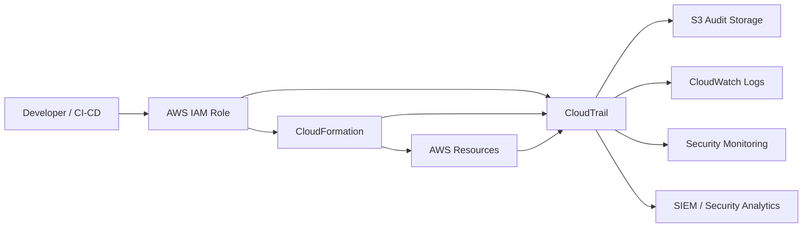
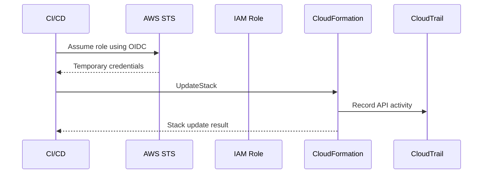
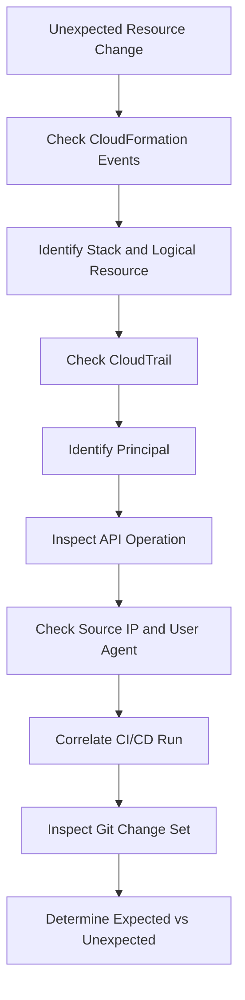
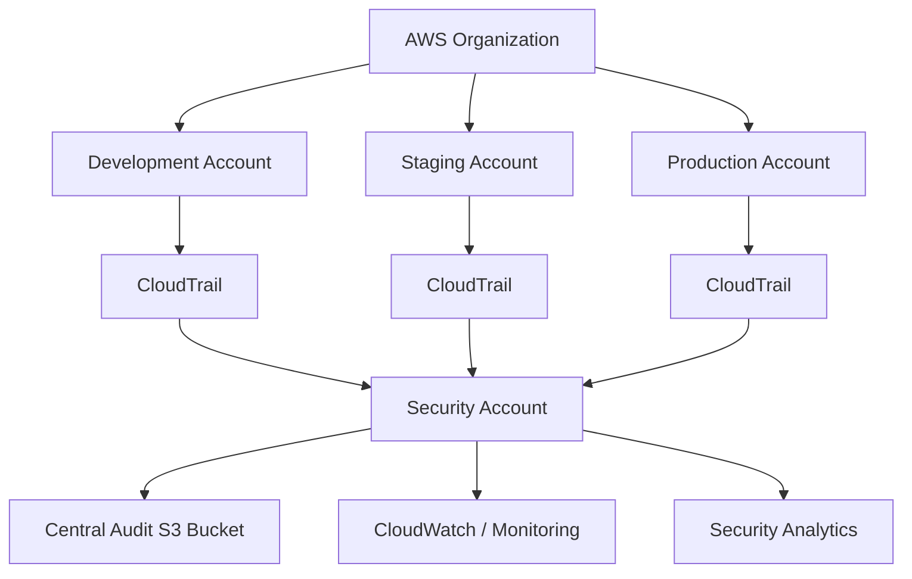

# 06- CloudTrail and Auditability

## Overview

AWS CloudTrail provides an audit trail of AWS API activity. For CloudFormation environments, CloudTrail is particularly important because infrastructure changes can create, modify, replace, or delete production resources.

CloudFormation records the desired infrastructure state, while CloudTrail provides evidence of actions performed against AWS APIs.

```text
CloudFormation Template
        |
        v
CloudFormation Stack
        |
        | AWS API calls
        v
AWS Services
        |
        v
CloudTrail
        |
        +--> Audit
        +--> Security Investigation
        +--> Compliance
        +--> Incident Response
```

For a production backend platform, auditability should answer:

- Who changed the infrastructure?
- What action was performed?
- When did it happen?
- Which AWS account and Region were involved?
- Which resource was affected?
- Which IAM principal performed the action?
- Was the change performed through CloudFormation, CI/CD, CLI, or the AWS Console?
- What happened immediately before and after the change?

CloudTrail does not replace CloudFormation events. The two services provide different perspectives.

| Service | Primary View |
|---|---|
| CloudFormation | Stack and resource deployment lifecycle |
| CloudTrail | AWS API activity and identity |
| CloudWatch | Metrics, logs, and operational telemetry |
| AWS Config | Resource configuration history and compliance |

## Why Auditability Matters

Infrastructure changes are security-sensitive operations.

Consider a production deployment:

```text
Developer
    |
    v
Git Pull Request
    |
    v
CI/CD
    |
    v
CloudFormation
    |
    v
AWS APIs
    |
    +--> IAM
    +--> EC2
    +--> ECS
    +--> RDS
    +--> S3
    +--> VPC
```

If a production database disappears, knowing that CloudFormation reported a failed or successful operation is not enough.

You also need to determine:

```text
Who initiated the operation?
Which role was used?
Which API was called?
From which account?
At what time?
What resource was targeted?
Was the operation expected?
```

CloudTrail provides this audit perspective.

## CloudTrail Event Model

A CloudTrail event represents an AWS API or management activity.

A simplified event contains information such as:

```json
{
  "eventSource": "cloudformation.amazonaws.com",
  "eventName": "UpdateStack",
  "awsRegion": "ap-south-1",
  "eventTime": "2026-08-13T10:30:00Z",
  "userIdentity": {
    "type": "AssumedRole"
  }
}
```

Actual CloudTrail events contain substantially more information, including identity, request, response, source, and event metadata.

The important fields for investigations include:

| Field | Purpose |
|---|---|
| `eventTime` | When the action occurred |
| `eventSource` | AWS service involved |
| `eventName` | API operation |
| `awsRegion` | Region where the operation occurred |
| `userIdentity` | Principal responsible for the request |
| `sourceIPAddress` | Source of the request |
| `requestParameters` | Request details |
| `responseElements` | Response information when available |
| `errorCode` | Failure information |
| `errorMessage` | Failure details when available |
| `eventID` | Unique event identifier |

## CloudFormation and CloudTrail

CloudFormation operations generate AWS API activity.

For example:

```text
CI/CD
  |
  | cloudformation:UpdateStack
  v
CloudFormation
  |
  +--> ec2:Modify...
  +--> ecs:UpdateService
  +--> iam:CreateRole
  +--> rds:ModifyDBInstance
  +--> s3:CreateBucket
```

CloudTrail can therefore provide evidence of both:

```text
CloudFormation-level operations
```

and:

```text
Underlying AWS service API operations
```

This distinction is important during incident investigation.

## CloudFormation Events vs CloudTrail Events

CloudFormation events answer:

```text
What happened to this stack resource?
```

CloudTrail events answer:

```text
Who called the AWS API and what operation was performed?
```

For example:

```text
CloudFormation
    |
    +--> UPDATE_IN_PROGRESS
    +--> UPDATE_COMPLETE
    +--> UPDATE_FAILED

CloudTrail
    |
    +--> UpdateStack
    +--> ModifyDBInstance
    +--> UpdateService
```

Use both when investigating production changes.

## Audit Flow

A typical production architecture is:



This creates multiple audit consumers without requiring application teams to manually maintain audit logs.

## CloudTrail Trails

A CloudTrail trail defines how CloudTrail events are collected and delivered.

A production organization commonly configures a centralized trail that delivers logs to an S3 bucket.

Conceptually:

```text
AWS Accounts
     |
     +--> CloudTrail
     |
     v
Centralized S3 Bucket
     |
     +--> Security
     +--> Compliance
     +--> Incident Response
     +--> Long-Term Retention
```

A centralized design is particularly useful for organizations operating multiple AWS accounts.

## Organization-Level Auditability

For multi-account environments:

```text
AWS Organization
│
├── Security Account
│   └── Audit Storage
│
├── Production Account
│   └── CloudTrail
│
├── Staging Account
│   └── CloudTrail
│
└── Development Account
    └── CloudTrail
```

Centralized logging reduces the risk of individual application teams modifying or deleting their own audit records.

The security account should generally be controlled independently from workload accounts.

## CloudTrail Event Types

CloudTrail provides different categories of events.

For infrastructure auditability, management events are especially important because they capture control-plane operations such as:

```text
Create
Update
Delete
Describe
Attach
Detach
Modify
Put
Remove
```

Examples include:

```text
cloudformation:CreateStack
cloudformation:UpdateStack
cloudformation:DeleteStack
iam:CreateRole
iam:PutRolePolicy
rds:DeleteDBInstance
s3:CreateBucket
ec2:DeleteVpc
```

Data events provide more granular activity for supported services and resource operations.

The required event categories should be determined by the organization's security and compliance requirements.

## CloudFormation API Operations

High-value CloudFormation operations to audit include:

| API Operation | Why It Matters |
|---|---|
| `CreateStack` | New infrastructure deployment |
| `UpdateStack` | Infrastructure modification |
| `DeleteStack` | Potentially destructive operation |
| `CreateChangeSet` | Proposed infrastructure change |
| `ExecuteChangeSet` | Approved change execution |
| `SetStackPolicy` | Changes update protection |
| `UpdateTerminationProtection` | Changes stack deletion protection |
| `ContinueUpdateRollback` | Recovery operation |
| `RollbackStack` | Rollback operation |

These events help establish the infrastructure deployment timeline.

## High-Risk AWS API Operations

CloudTrail should be used to monitor destructive or security-sensitive operations.

Examples include:

```text
cloudformation:DeleteStack
rds:DeleteDBInstance
rds:ModifyDBInstance
dynamodb:DeleteTable
s3:DeleteBucket
iam:DeleteRole
iam:PutRolePolicy
iam:AttachRolePolicy
kms:ScheduleKeyDeletion
ec2:DeleteVpc
```

The exact monitoring list should reflect the organization's threat model and architecture.

## Identity Attribution

One of CloudTrail's most important capabilities is identity attribution.

A production request might look like:

```text
GitHub Actions
      |
      v
AWS IAM Role
      |
      v
CloudFormation
      |
      v
AWS Resource
```

CloudTrail helps establish which principal performed the API operation.

This is particularly important when applications use:

- IAM roles
- AWS STS
- CI/CD federation
- Cross-account roles
- SSO
- Temporary credentials

The investigation should identify the effective principal rather than relying only on a human-readable username.

## IAM Role Attribution

Modern CI/CD systems commonly use short-lived credentials.

For example:

```text
GitHub Actions
      |
      | OIDC
      v
AWS STS
      |
      | AssumeRole
      v
Deployment Role
      |
      v
CloudFormation
```

CloudTrail can show the assumed-role identity associated with the API request.

This is preferable to long-lived access keys because the deployment identity can be scoped and audited.

## CloudTrail and OIDC-Based CI/CD

A production CI/CD architecture might be:



This provides a clear audit trail for infrastructure deployments.

## Source IP and User Agent

CloudTrail events can include:

```text
sourceIPAddress
userAgent
```

These fields can help distinguish between:

```text
AWS Console
AWS CLI
SDK
CI/CD system
Automated service
```

For example:

```text
Source IP
    |
    +--> Corporate network
    +--> CI/CD infrastructure
    +--> Unexpected public address
```

Unexpected access patterns can be valuable indicators during security investigations.

## Request Parameters

CloudTrail can record request parameters for API operations where applicable.

For example, an infrastructure investigation may identify:

```text
eventName:
DeleteStack

requestParameters:
stackName = production-api
```

This can connect the API operation to the affected infrastructure.

Sensitive request parameters must still be handled carefully because audit logs themselves can contain security-sensitive information.

## CloudTrail Logs Are Sensitive

Audit logs should be treated as security-sensitive data.

They can contain:

- IAM identities
- Resource identifiers
- Source IP addresses
- API request information
- Security configuration changes
- Infrastructure metadata

Access to CloudTrail logs should therefore be tightly controlled.

Do not give application teams unrestricted access to the audit bucket.

## S3 Audit Bucket

A common architecture stores CloudTrail logs in S3.

```text
CloudTrail
    |
    v
S3 Audit Bucket
    |
    +--> Versioning
    +--> Encryption
    +--> Lifecycle Policies
    +--> Restricted IAM
    +--> Object Lock where required
```

The audit bucket should be separated from normal application data buckets.

## S3 Bucket Protection

The audit bucket itself is critical infrastructure.

Consider:

```yaml
Resources:

  AuditBucket:
    Type: AWS::S3::Bucket

    DeletionPolicy: Retain
    UpdateReplacePolicy: Retain

    Properties:
      VersioningConfiguration:
        Status: Enabled
```

For high-assurance environments, additional controls may include:

- S3 Object Lock
- Bucket policies
- Encryption
- Restricted principals
- Cross-account ownership
- Lifecycle retention
- Access logging where appropriate

The exact configuration should follow the organization's compliance requirements.

## Preventing Audit Log Tampering

A strong security architecture should make it difficult for workload administrators to modify their own audit records.

Weak model:

```text
Production Admin
      |
      +--> AWS Resources
      |
      +--> CloudTrail
      |
      +--> Audit Logs
```

Stronger model:

```text
Production Account
      |
      v
CloudTrail
      |
      v
Security Account
      |
      v
Central Audit Storage
```

The security account becomes an independent trust boundary.

## Encryption

CloudTrail logs stored in S3 should be encrypted.

AWS-managed encryption may be sufficient for some environments.

Organizations with stronger key-management requirements may use a customer-managed KMS key.

The design becomes:

```text
CloudTrail
    |
    v
S3
    |
    v
KMS
    |
    v
Encrypted Audit Logs
```

When using customer-managed KMS keys, ensure that:

- CloudTrail can use the key.
- The S3 bucket policy permits the required delivery.
- Security administrators can manage the key.
- Workload administrators cannot arbitrarily disable encryption controls.

## CloudTrail Log Validation

CloudTrail supports log file integrity validation.

This can help detect whether delivered CloudTrail log files have been modified.

The principle is:

```text
CloudTrail Logs
      |
      v
Integrity Validation
      |
      v
Evidence of Tampering
```

For regulated environments, log integrity should be considered part of the audit architecture.

## CloudWatch Logs Integration

CloudTrail events can also be delivered to CloudWatch Logs.

This enables near-real-time monitoring and alerting.

```text
CloudTrail
    |
    +--> S3
    |
    +--> CloudWatch Logs
              |
              v
        Metric Filters
              |
              v
            Alerts
```

S3 is useful for durable audit storage.

CloudWatch Logs is useful for operational detection and alerting.

## Security Alerts

High-risk operations can trigger alerts.

Example:

```text
CloudTrail
    |
    v
CloudWatch Logs
    |
    v
Metric Filter
    |
    v
SNS / Alerting
    |
    v
Security Team
```

Potential alert conditions include:

```text
DeleteStack
DeleteDBInstance
ScheduleKeyDeletion
Disable logging
Modify IAM policies
Disable deletion protection
```

The exact alerting policy should avoid excessive noise.

## Example CloudTrail Monitoring Query

If CloudTrail events are available in CloudWatch Logs Insights, a query can identify CloudFormation deletion operations:

```text
fields @timestamp, eventName, userIdentity.arn, sourceIPAddress, awsRegion
| filter eventSource = "cloudformation.amazonaws.com"
| filter eventName in ["DeleteStack", "UpdateStack"]
| sort @timestamp desc
```

A broader query can search for destructive operations:

```text
fields @timestamp, eventSource, eventName, userIdentity.arn, sourceIPAddress
| filter eventName like /Delete/
| sort @timestamp desc
```

Production queries should be refined to reduce false positives.

## CloudTrail and CloudFormation Change Sets

Change Sets provide intent before execution.

CloudTrail provides evidence of execution.

Together:

```text
Change Set
    |
    | Intended change
    v
Approval
    |
    v
Execute Change Set
    |
    v
CloudTrail
    |
    | Actual API activity
    v
Audit Trail
```

This creates a useful distinction between:

```text
What someone planned to deploy
```

and:

```text
What AWS actually received
```

## Deployment Audit Trail

A mature deployment system should connect:

```text
Git Commit
    |
    v
Pull Request
    |
    v
CI/CD Run
    |
    v
Change Set
    |
    v
CloudFormation Execution
    |
    v
CloudTrail Events
    |
    v
AWS Resources
```

This provides end-to-end traceability.

For example:

```text
Git SHA
    |
    +--> CI/CD Run ID
            |
            +--> CloudFormation Change Set
                    |
                    +--> CloudTrail Event ID
                            |
                            +--> Resource Change
```

This is significantly more useful during incident response than simply knowing that a stack changed.

## CloudFormation Drift vs CloudTrail

CloudFormation drift detection and CloudTrail answer different questions.

| Capability | CloudFormation Drift | CloudTrail |
|---|---|---|
| Detect current configuration difference | Yes | No |
| Show API activity | No | Yes |
| Identify actor | No | Yes |
| Show historical API events | No | Yes |
| Detect manual changes | Sometimes indirectly | Yes, if API activity is logged |
| Determine current desired state | Yes | No |

For example:

```text
CloudFormation
    |
    v
Expected configuration

AWS Resource
    |
    v
Actual configuration
```

Drift detection compares these states.

CloudTrail instead answers:

```text
Who changed the resource?
When?
Using which API?
```

Use both for mature infrastructure governance.

## CloudTrail and AWS Config

AWS Config provides resource configuration history and compliance information.

CloudTrail provides API activity.

A useful model is:

```text
CloudTrail
    |
    +--> Who changed it?
    +--> What API was called?
    +--> When?

AWS Config
    |
    +--> What is the resource configuration?
    +--> How did configuration change?
    +--> Does it comply?
```

The services complement one another.

## Investigation Workflow

When a production infrastructure change is discovered:



This workflow combines infrastructure state, API activity, and deployment context.

## Example Incident Investigation

Suppose a production RDS instance was modified unexpectedly.

Start with CloudFormation:

```text
CloudFormation Stack
    |
    v
ProductionDatabase
    |
    v
UPDATE_COMPLETE
```

Then inspect CloudTrail:

```text
eventSource:
rds.amazonaws.com

eventName:
ModifyDBInstance

userIdentity:
assumed-role/production-deployment-role/...

eventTime:
...
```

Then correlate:

```text
CloudTrail Event
      |
      v
Deployment Role
      |
      v
CI/CD Run
      |
      v
Git Commit
      |
      v
Pull Request
```

This can establish whether the change was:

```text
Expected deployment
```

or:

```text
Unauthorized / unexpected operation
```

## Detecting Console Changes

Manual console changes are particularly important to detect in infrastructure-as-code environments.

The desired model is:

```text
Git
  |
  v
CI/CD
  |
  v
CloudFormation
  |
  v
AWS
```

rather than:

```text
Engineer
   |
   v
AWS Console
   |
   v
Manual Infrastructure Change
```

CloudTrail can help identify console-originated operations.

If a resource is changed outside CloudFormation, the CloudTrail event can provide evidence of the API activity.

## Infrastructure-as-Code Governance

A production organization should establish a policy such as:

```text
Production infrastructure
        |
        v
Managed by IaC
        |
        v
CloudFormation
        |
        v
Approved CI/CD
```

Manual changes should be:

- Restricted.
- Audited.
- Documented.
- Used only for approved operational scenarios.

CloudTrail provides the evidence required to enforce this model.

## CloudTrail and IAM Changes

CloudFormation can create and modify IAM resources.

These operations deserve special attention because IAM changes can alter the security boundary of the entire account.

High-risk operations include:

```text
iam:CreateRole
iam:DeleteRole
iam:PutRolePolicy
iam:AttachRolePolicy
iam:DetachRolePolicy
iam:UpdateAssumeRolePolicy
iam:CreatePolicyVersion
iam:SetDefaultPolicyVersion
```

CloudTrail should be used to audit these operations.

## CloudFormation IAM Capabilities

When CloudFormation creates IAM resources, deployment may require capabilities such as:

```bash
aws cloudformation create-stack \
  --stack-name production-api \
  --template-body file://template.yaml \
  --capabilities CAPABILITY_IAM
```

For templates that require broader IAM acknowledgement:

```bash
aws cloudformation create-stack \
  --stack-name production-api \
  --template-body file://template.yaml \
  --capabilities CAPABILITY_NAMED_IAM
```

These operations should be carefully controlled because CloudFormation may create powerful IAM resources.

CloudTrail provides an audit trail of the deployment API request and subsequent AWS activity.

## Monitoring CloudTrail Configuration

CloudTrail itself is security-critical infrastructure.

Monitor changes such as:

```text
StopLogging
DeleteTrail
UpdateTrail
PutEventSelectors
PutInsightSelectors
```

An attacker who can disable audit logging can reduce visibility during an incident.

Therefore:

```text
CloudTrail
    |
    v
Protected Security Configuration
    |
    v
Independent Monitoring
```

The security architecture should make it difficult for a compromised workload account to disable centralized auditing.

## Multi-Account CloudTrail Architecture

For larger AWS environments:



The security account should have stronger administrative separation from application accounts.

This architecture improves:

- Centralized auditing
- Compliance
- Incident response
- Log retention
- Tamper resistance
- Cross-account visibility

## Retention Strategy

Audit retention should reflect organizational requirements.

Potential considerations include:

- Regulatory retention periods
- Security investigation requirements
- Storage cost
- Legal requirements
- Incident response timelines

S3 lifecycle policies can transition older logs to lower-cost storage classes when appropriate.

However, retention policies must not delete audit records required by compliance or ongoing investigations.

## Cost Considerations

CloudTrail introduces storage and analysis costs depending on configuration and event volume.

Costs can come from:

```text
CloudTrail
+
S3 Storage
+
CloudWatch Logs
+
Log Analytics
+
SIEM
+
Data Processing
```

Avoid blindly sending every available event to expensive downstream systems.

Instead:

```text
All required audit events
        |
        v
Durable low-cost storage

High-value security events
        |
        v
Real-time monitoring
```

This separates long-term audit retention from real-time detection.

## Reliability

Audit infrastructure should be more reliable than the workloads it monitors.

Avoid designs where:

```text
Production Application Account
        |
        v
Same account audit storage
        |
        v
Same administrator can delete both
```

Prefer:

```text
Production Account
        |
        v
CloudTrail
        |
        v
Security Account
        |
        v
Central Audit Storage
```

The audit system should survive incidents affecting individual workload accounts.

## Disaster Recovery

Audit logs are security evidence.

The recovery strategy should address:

- Cross-account storage
- Log retention
- S3 versioning
- Object Lock where required
- KMS key availability
- Access recovery
- Regional resilience
- SIEM availability

For critical environments, audit records should remain available even if a workload account is compromised.

## Security Best Practices

- Enable CloudTrail across all production AWS accounts.
- Use centralized audit storage where appropriate.
- Protect the audit bucket with restrictive policies.
- Separate audit administration from workload administration.
- Encrypt audit logs.
- Consider customer-managed KMS keys where required.
- Enable log file integrity validation where appropriate.
- Monitor CloudTrail configuration changes.
- Monitor destructive CloudFormation and AWS operations.
- Audit IAM policy changes.
- Restrict access to CloudTrail logs.
- Use short-lived deployment credentials.
- Prefer OIDC-based CI/CD authentication.
- Correlate CloudTrail events with CI/CD runs.
- Use CloudFormation Change Sets for high-risk changes.
- Combine CloudTrail with CloudFormation events and AWS Config.
- Establish appropriate retention policies.
- Alert on unexpected manual changes.
- Protect audit infrastructure from workload-account compromise.
- Test audit visibility during security exercises.

## Common Mistakes

### Enabling CloudTrail Only in Production

**Why it fails:** security incidents can originate in development or staging and later affect production.

**Better:** define organization-wide audit requirements.

### Storing Audit Logs in the Same Account Without Protection

**Why it fails:** a compromised administrator or account may be able to modify or delete the evidence.

**Better:** use centralized security-account storage.

### Monitoring Only CloudFormation

**Why it fails:** CloudFormation events do not provide the complete identity and API-level context needed for many investigations.

**Better:** correlate CloudFormation events with CloudTrail.

### Monitoring Only CloudTrail

**Why it fails:** CloudTrail does not provide the complete CloudFormation resource lifecycle view.

**Better:** use CloudTrail alongside CloudFormation events.

### Ignoring IAM Changes

**Why it fails:** IAM modifications can fundamentally change the account's security boundary.

**Better:** monitor high-risk IAM APIs.

### Allowing Workload Administrators to Modify Audit Configuration

**Why it fails:** an attacker with sufficient privileges may disable logging.

**Better:** separate audit administration and apply preventative controls.

### Logging Everything to Expensive Systems

**Why it fails:** unnecessary event volume increases storage and analytics costs.

**Better:** retain required audit data durably and route high-value events to real-time detection systems.

### Treating Audit Logs as Ordinary Application Logs

**Why it fails:** audit records may be security evidence and require stronger integrity, retention, and access controls.

**Better:** design audit storage as a security system.

### Failing to Correlate CI/CD and CloudTrail

**Why it fails:** knowing that a deployment role made a change may not identify which commit or pipeline execution caused it.

**Better:** maintain deployment identifiers and correlate them during investigations.

### Assuming CloudTrail Detects Configuration Drift

**Why it fails:** CloudTrail records API activity; it is not a complete desired-vs-actual configuration comparison system.

**Better:** combine CloudTrail with AWS Config and CloudFormation drift detection.

## Interview Traps

### What Is the Difference Between CloudTrail and CloudFormation Events?

CloudFormation events show the lifecycle of resources within a stack.

CloudTrail records AWS API activity and provides identity and request context.

### Why Is CloudTrail Important for CloudFormation?

Because CloudFormation tells you what happened to the stack, while CloudTrail helps establish who performed the API operation and when.

### Can CloudTrail Detect Manual Changes?

Yes, CloudTrail can record the API activity generated by manual AWS operations, assuming the relevant event is captured.

### What Is the Difference Between CloudTrail and AWS Config?

CloudTrail focuses on API activity and identity.

AWS Config focuses on resource configuration and compliance history.

### Why Store CloudTrail Logs in a Separate Security Account?

To reduce the ability of a compromised workload account to modify or delete its own audit evidence.

### Why Should CloudTrail Configuration Changes Be Monitored?

Because disabling or weakening audit logging can reduce security visibility during an attack.

### How Do You Audit a Production CloudFormation Deployment?

A strong workflow correlates:

```text
Git Commit
    |
    v
CI/CD Run
    |
    v
CloudFormation Change Set
    |
    v
CloudFormation Events
    |
    v
CloudTrail Events
    |
    v
AWS Resource
```

### What Should You Monitor for CloudFormation Security?

At minimum, consider:

```text
CreateStack
UpdateStack
DeleteStack
CreateChangeSet
ExecuteChangeSet
SetStackPolicy
UpdateTerminationProtection
```

and high-risk underlying service operations such as:

```text
IAM changes
RDS deletion
S3 deletion
DynamoDB deletion
KMS key deletion
VPC deletion
```

### Is CloudTrail a Backup System?

No.

CloudTrail provides audit records. It does not replace application data backups or disaster recovery systems.

### Should Developers Have Access to CloudTrail Logs?

Access should follow least privilege. Developers may need limited read access for troubleshooting, but unrestricted access to centralized security audit logs is generally inappropriate.

## Production Audit Checklist

- [ ] CloudTrail is enabled for required AWS accounts and Regions.
- [ ] Management events required for infrastructure auditing are captured.
- [ ] High-risk AWS operations are identified.
- [ ] CloudFormation stack operations are monitored.
- [ ] IAM changes are monitored.
- [ ] CloudTrail configuration changes are monitored.
- [ ] Audit logs are delivered to durable storage.
- [ ] Audit storage is protected from workload administrators.
- [ ] Audit logs are encrypted.
- [ ] S3 versioning is enabled where appropriate.
- [ ] Object Lock is considered where compliance requires immutable retention.
- [ ] Log integrity validation is enabled where appropriate.
- [ ] Retention requirements are documented.
- [ ] CloudWatch or equivalent monitoring is configured for high-risk events.
- [ ] Security alerts exist for destructive operations.
- [ ] CI/CD identities use short-lived credentials where possible.
- [ ] CloudFormation deployments can be correlated with CI/CD runs.
- [ ] Change Sets are reviewed for high-risk production changes.
- [ ] CloudFormation events are correlated with CloudTrail.
- [ ] AWS Config or equivalent configuration monitoring is used where appropriate.
- [ ] Audit infrastructure has an independent security boundary.
- [ ] Disaster recovery includes audit-log availability.
- [ ] Access to audit logs follows least privilege.
- [ ] CloudTrail configuration cannot be casually disabled by workload administrators.

## Key Takeaways

- CloudFormation describes infrastructure state; CloudTrail records AWS API activity.
- CloudFormation events and CloudTrail should be used together during infrastructure investigations.
- CloudTrail provides critical identity, timing, source, and API information.
- Audit high-risk CloudFormation operations such as `CreateStack`, `UpdateStack`, `DeleteStack`, and `ExecuteChangeSet`.
- Monitor destructive underlying AWS operations such as database, storage, IAM, KMS, and networking changes.
- Protect CloudTrail configuration because disabling audit logging can severely reduce incident visibility.
- Store important audit records in protected, durable storage.
- Centralized multi-account audit storage provides stronger isolation than keeping logs only inside workload accounts.
- Treat CloudTrail logs as security-sensitive evidence.
- Encrypt audit logs and apply strict access controls.
- Consider S3 versioning, Object Lock, and log integrity validation where required.
- Use CloudWatch Logs or equivalent monitoring for near-real-time detection.
- Do not confuse CloudTrail with AWS Config or CloudFormation drift detection.
- AWS Config answers configuration and compliance questions; CloudTrail answers API activity questions.
- Correlate Git commits, CI/CD runs, Change Sets, CloudFormation events, and CloudTrail events for end-to-end deployment traceability.
- Prefer short-lived CI/CD credentials and OIDC-based authentication where supported.
- Audit IAM changes because they can alter the security boundary of the entire AWS account.
- Audit infrastructure should have a stronger trust boundary than the workloads it monitors.

The production audit model should look like:

```text
                         Git Commit
                             |
                             v
                          CI/CD
                             |
                             v
                       Change Set
                             |
                             v
                       CloudFormation
                             |
                 +-----------+-----------+
                 |                       |
                 v                       v
          AWS Resources             CloudTrail
                                         |
                                         v
                                Central Audit Storage
                                         |
                           +-------------+-------------+
                           |             |             |
                           v             v             v
                       Security      Monitoring       SIEM
                       Analysis       Alerts        Analytics
```

The core principle is:

```text
Infrastructure auditability is not just knowing
that a deployment happened.

A production system should be able to establish:

Who acted
What API was called
When it happened
Which resource was affected
Which deployment caused it
Whether the change was authorized
And what the resulting infrastructure state became
```