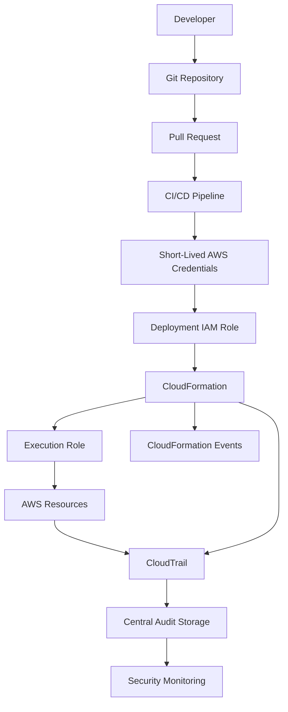

# README

## Overview

This section covers the security, access-control, auditability, and protection mechanisms required to operate AWS CloudFormation safely in production.

CloudFormation is a privileged infrastructure-management service. A deployment can create or modify IAM roles, networking, databases, storage, encryption keys, and other security-sensitive resources. Security therefore needs to be designed around both the CloudFormation service and the resources it provisions.

The documents in this section progress from the overall CloudFormation security model to IAM permissions, secrets handling, resource protection, and centralized auditability.

## Security Architecture

A production CloudFormation security model should establish clear boundaries between:

```text
Developer
    |
    v
Git Repository
    |
    v
CI/CD
    |
    v
Deployment IAM Role
    |
    v
CloudFormation
    |
    +------------------+
    |                  |
    v                  v
AWS Resources      CloudTrail
                       |
                       v
                 Audit Storage
```

The primary security principles are:

- Least-privilege IAM permissions.
- Short-lived deployment credentials.
- Controlled CloudFormation execution roles.
- Protection of critical resources from accidental deletion.
- Secure handling of secrets and sensitive parameters.
- Centralized audit logging.
- Separation between workload administration and security administration.
- Controlled production deployments through CI/CD.
- Explicit governance for IAM-capable CloudFormation templates.

## Quick Navigation

| # | Document | Focus |
|---|---|---|
| 01 | [Security Overview](./01-%20Security%20Overview.md) | CloudFormation security model and production security principles |
| 02 | [CloudFormation Service Roles](./02-%20CloudFormation%20Service%20Roles.md) | Service roles, execution identity, and permission boundaries |
| 03 | [IAM Capabilities and Permissions](./03-%20IAM%20Capabilities%20and%20Permissions.md) | IAM capabilities, permissions, and least-privilege deployment |
| 04 | [Secrets and Sensitive Parameters](./04-%20Secrets%20and%20Sensitive%20Parameters.md) | Secrets, parameters, credentials, and sensitive configuration |
| 05 | [Resource Protection and Deletion Controls](./05-%20Resource%20Protection%20and%20Deletion%20Controls.md) | Deletion protection, termination protection, and resource safety |
| 06 | [CloudTrail and Auditability](./06-%20CloudTrail%20and%20Auditability.md) | Audit trails, CloudTrail, monitoring, and infrastructure traceability |

## Security Topics

### Security Overview

Covers the overall security model for CloudFormation, including:

- CloudFormation security boundaries.
- IAM-based authorization.
- Deployment identity.
- Least privilege.
- Production deployment controls.
- Infrastructure security responsibilities.
- Common CloudFormation security risks.

[Open Security Overview](./01-%20Security%20Overview.md)

### CloudFormation Service Roles

Explains how CloudFormation can operate using an IAM service role and why separating deployment identity from resource execution identity is useful in production.

Key areas include:

- CloudFormation service roles.
- Execution permissions.
- Trust relationships.
- Least-privilege policies.
- Deployment roles.
- Cross-account deployments.
- Service-role security considerations.

[Open CloudFormation Service Roles](./02-%20CloudFormation%20Service%20Roles.md)

### IAM Capabilities and Permissions

Covers the permissions required when CloudFormation templates create or modify IAM resources.

Key areas include:

- `CAPABILITY_IAM`.
- `CAPABILITY_NAMED_IAM`.
- IAM resource creation.
- Least-privilege policies.
- Privileged CloudFormation templates.
- Deployment-role permissions.
- IAM security risks.

[Open IAM Capabilities and Permissions](./03-%20IAM%20Capabilities%20and%20Permissions.md)

### Secrets and Sensitive Parameters

Covers the safe handling of credentials and sensitive configuration within CloudFormation deployments.

Key areas include:

- Sensitive parameters.
- Parameter handling.
- AWS Secrets Manager.
- Systems Manager Parameter Store.
- Dynamic references.
- Secret exposure risks.
- CI/CD secret handling.
- Encryption and access control.

[Open Secrets and Sensitive Parameters](./04-%20Secrets%20and%20Sensitive%20Parameters.md)

### Resource Protection and Deletion Controls

Covers mechanisms that prevent accidental destruction of important infrastructure.

Key areas include:

- `DeletionPolicy`.
- `UpdateReplacePolicy`.
- Stack termination protection.
- Resource replacement.
- Database protection.
- Stateful resource safety.
- Production deletion controls.
- Disaster recovery considerations.

[Open Resource Protection and Deletion Controls](./05-%20Resource%20Protection%20and%20Deletion%20Controls.md)

### CloudTrail and Auditability

Covers infrastructure auditability and the relationship between CloudFormation events and CloudTrail API activity.

Key areas include:

- CloudTrail.
- CloudFormation API events.
- IAM identity attribution.
- Centralized audit storage.
- Security monitoring.
- CI/CD traceability.
- Multi-account auditing.
- Incident investigation.
- Infrastructure change history.

[Open CloudTrail and Auditability](./06-%20CloudTrail%20and%20Auditability.md)

## Recommended Learning Order

The documents should be read in order:

```text
Security Overview
       |
       v
CloudFormation Service Roles
       |
       v
IAM Capabilities and Permissions
       |
       v
Secrets and Sensitive Parameters
       |
       v
Resource Protection and Deletion Controls
       |
       v
CloudTrail and Auditability
```

This progression moves from the security model to authorization, sensitive data, destructive operations, and finally auditability.

## Production Security Model

A mature CloudFormation deployment should resemble:



Each layer should have a clearly defined security responsibility.

| Layer | Primary Security Responsibility |
|---|---|
| Git | Source control and review |
| Pull Request | Change approval |
| CI/CD | Controlled deployment execution |
| IAM | Authentication and authorization |
| CloudFormation | Infrastructure orchestration |
| AWS Resources | Resource-level security |
| CloudTrail | Auditability |
| Security Account | Centralized security controls |

## Core Security Principles

### Least Privilege

Deployment roles should receive only the permissions required to manage the intended infrastructure.

Avoid broad policies such as:

```json
{
  "Effect": "Allow",
  "Action": "*",
  "Resource": "*"
}
```

Prefer service- and resource-specific permissions where practical.

### Short-Lived Credentials

Production deployments should avoid long-lived AWS access keys.

Prefer:

```text
CI/CD
  |
  v
OIDC
  |
  v
AWS STS
  |
  v
Temporary Credentials
  |
  v
Deployment Role
```

This reduces credential exposure and improves auditability.

### Protect Stateful Resources

Databases, storage buckets, and other stateful resources require stronger deletion controls than ephemeral compute resources.

A production deployment should explicitly consider:

```text
Can this resource be replaced?
Can this resource be deleted?
What happens to its data?
Can the operation be recovered?
```

### Protect Secrets

Do not treat CloudFormation templates as secret stores.

Prefer dedicated secret-management systems such as:

- AWS Secrets Manager.
- AWS Systems Manager Parameter Store.
- KMS-backed encryption mechanisms.

### Audit Infrastructure Changes

Every production infrastructure change should be traceable to:

```text
Developer
    |
    v
Git Commit
    |
    v
CI/CD Run
    |
    v
CloudFormation Change
    |
    v
CloudTrail Event
    |
    v
AWS Resource
```

This provides an auditable chain from source code to infrastructure.

## Security Checklist

- [ ] Deployment roles follow least privilege.
- [ ] CloudFormation service roles are scoped appropriately.
- [ ] Production deployments use controlled CI/CD.
- [ ] Long-lived AWS credentials are avoided.
- [ ] OIDC or equivalent federation is used where supported.
- [ ] IAM-capable templates are reviewed carefully.
- [ ] `CAPABILITY_IAM` and `CAPABILITY_NAMED_IAM` usage is controlled.
- [ ] Secrets are not hard-coded in templates.
- [ ] Sensitive configuration uses appropriate AWS secret-management services.
- [ ] Critical resources have deletion protections where appropriate.
- [ ] Stateful resources have explicit retention/replacement strategies.
- [ ] CloudFormation changes are audited.
- [ ] CloudTrail is enabled for required accounts and Regions.
- [ ] High-risk IAM and destructive operations are monitored.
- [ ] Audit logs are stored securely.
- [ ] Security administration is separated from workload administration.
- [ ] Production infrastructure changes are traceable to source control and CI/CD.

## Key Takeaways

- CloudFormation is a privileged infrastructure-management system and must be secured accordingly.
- IAM controls who can deploy and what infrastructure can be modified.
- Service roles can separate deployment authorization from CloudFormation resource execution.
- IAM capabilities require explicit consideration when templates create or modify IAM resources.
- Secrets should be managed through dedicated AWS secret-management mechanisms rather than embedded directly in templates.
- Critical resources require deliberate deletion and replacement protection.
- CloudTrail provides the audit trail needed to investigate infrastructure changes.
- Production security should combine least privilege, controlled deployments, resource protection, secret management, and centralized auditability.
- The strongest model connects source control, CI/CD, IAM, CloudFormation, AWS resources, and CloudTrail into one traceable deployment chain.