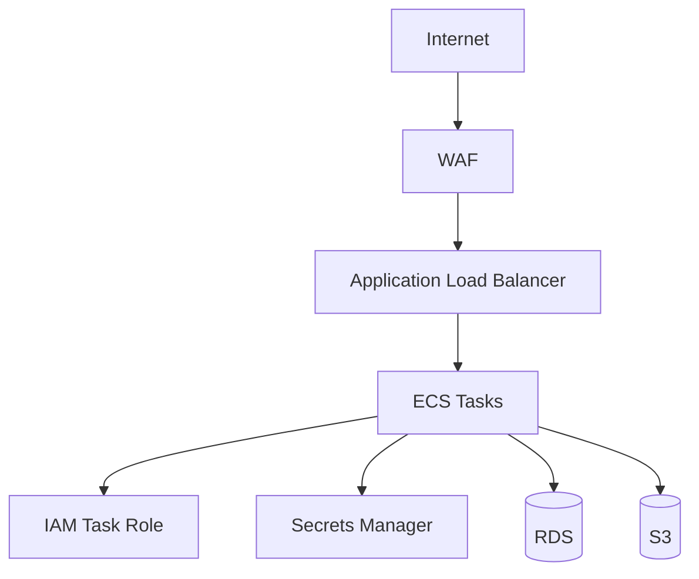

# 01- Security Overview

## Overview

Security in Amazon ECS is a layered responsibility spanning the AWS account, IAM, VPC networking, container runtime, application code, secrets, images, data stores, and observability.

An ECS task should not be treated as a trusted unit simply because it runs inside a private subnet. A production security architecture should assume that individual components can be compromised and should limit the blast radius through least privilege, network segmentation, strong identity controls, encryption, secure configuration, and continuous monitoring.

A useful security model is:

```text
                         AWS Account
                              |
                         IAM Policies
                              |
                              v
                         ECS Service
                              |
              +---------------+---------------+
              |               |               |
              v               v               v
        Network Security   Task Identity   Container
              |               |               |
              v               v               v
        Security Groups   Task Role       Image
              |               |               |
              +---------------+---------------+
                              |
                       Application Code
                              |
                +-------------+-------------+
                |                           |
                v                           v
             Secrets                      Data
                |                           |
                v                           v
       Secrets Manager / SSM        RDS / S3 / Redis
```

The objective is not to eliminate every possible security risk. The objective is to reduce the probability and impact of compromise while making unauthorized activity detectable and recoverable.

## ECS Security Model

ECS security can be divided into several layers:

| Layer | Primary Responsibility |
|---|---|
| AWS account | Account-level security, MFA, organizational controls |
| IAM | Authentication and authorization |
| ECS | Workload and task configuration |
| VPC | Network isolation |
| Security groups | Stateful traffic filtering |
| Container image | Application runtime supply chain |
| Secrets | Credentials and sensitive configuration |
| Application | Authentication, authorization, input validation |
| Data services | Database, object, cache, and queue protection |
| Observability | Detection, auditing, and incident response |

Security controls should be applied at multiple layers rather than relying on a single boundary.

## Shared Responsibility

AWS manages security of the underlying cloud infrastructure, while the customer remains responsible for securing the workloads deployed through ECS.

For example:

```text
AWS Responsibility
    |
    +-- Physical infrastructure
    +-- AWS-managed infrastructure
    +-- Fargate underlying infrastructure

Customer Responsibility
    |
    +-- IAM
    +-- Container images
    +-- Application code
    +-- Secrets
    +-- Security groups
    +-- Network configuration
    +-- Data protection
    +-- Logging and monitoring
```

The exact responsibility boundary depends on whether ECS uses Fargate or EC2.

With ECS on EC2, the customer has additional responsibilities around:

- EC2 operating systems
- Instance patching
- Host configuration
- Instance security
- ECS container instances
- Host-level monitoring

Fargate removes much of the host-management burden, but application and AWS resource security remain customer responsibilities.

## IAM as the Primary Identity Boundary

AWS IAM controls which identities can perform which AWS API operations.

For ECS workloads, distinguish between:

- **Task execution role**
- **Task role**
- **Human or CI/CD roles**

These identities serve different purposes.

```text
                    IAM
                     |
        +------------+-------------+
        |            |             |
        v            v             v
Execution Role    Task Role    Deployment Role
        |            |             |
        v            v             v
ECS Runtime     Application     CI/CD Pipeline
```

### Task Execution Role

The execution role is used by ECS to perform infrastructure-related operations on behalf of the task.

Typical responsibilities include:

- Pulling images from Amazon ECR
- Sending logs to CloudWatch Logs
- Retrieving certain secrets or configuration required during task startup

### Task Role

The task role provides AWS permissions to the application running inside the container.

For example:

```text
FastAPI Container
       |
       v
Task Role
       |
       +---- s3:GetObject
       +---- s3:PutObject
       +---- sqs:SendMessage
```

The application should receive only the permissions it actually needs.

If a Django application only uploads files to one S3 bucket, it should not receive unrestricted permissions such as:

```text
s3:*
Resource: *
```

Prefer narrowly scoped permissions.

## Least Privilege

Least privilege means granting the minimum permissions required to perform a task.

A production task might require:

```text
s3:GetObject
s3:PutObject
```

for a specific bucket and path rather than:

```text
s3:*
```

A simplified policy could look like:

```json
{
  "Version": "2012-10-17",
  "Statement": [
    {
      "Effect": "Allow",
      "Action": [
        "s3:GetObject",
        "s3:PutObject"
      ],
      "Resource": "arn:aws:s3:::example-production-bucket/uploads/*"
    }
  ]
}
```

The exact permissions should be determined by the application's actual AWS API usage.

### Why Least Privilege Matters

If an application container is compromised, its IAM permissions determine what an attacker can potentially access.

```text
Compromised Container
        |
        v
Compromised Application Identity
        |
        +---- Limited permissions
        |        |
        |        v
        |    Smaller blast radius
        |
        +---- Broad permissions
                 |
                 v
             Larger blast radius
```

IAM is therefore both an access-control mechanism and a blast-radius control.

## Network Security

ECS tasks commonly run inside a VPC.

A production architecture often uses:

```text
                    Internet
                       |
                       v
                  Public ALB
                       |
                       v
              Private ECS Tasks
                       |
             +---------+---------+
             |                   |
             v                   v
        Private RDS          Private Redis
```

This architecture prevents direct internet access to application tasks while still allowing controlled inbound traffic through the load balancer.

### Public vs Private Subnets

A common production pattern is:

| Resource | Typical Placement |
|---|---|
| Application Load Balancer | Public subnets |
| ECS tasks | Private subnets |
| RDS | Private subnets |
| ElastiCache | Private subnets |
| Internal load balancer | Private subnets |

The exact design depends on application requirements, but application containers generally should not be publicly exposed unless there is a specific reason.

## Security Groups

Security groups provide stateful network filtering.

A typical architecture is:

```text
Internet
   |
   | HTTPS 443
   v
ALB Security Group
   |
   | Application Port
   v
ECS Security Group
   |
   +---- PostgreSQL 5432 ----> Database Security Group
   |
   +---- Redis 6379 ---------> Redis Security Group
```

The ECS security group should generally accept application traffic from the ALB security group rather than from the entire internet.

Similarly, the database security group should allow PostgreSQL traffic from the ECS security group rather than allowing broad VPC or internet access.

### Example Security Boundary

```text
ALB SG
  |
  | TCP 443
  v
ECS SG
  |
  | TCP 5432
  v
RDS SG
```

This creates explicit trust relationships between application tiers.

## Network Segmentation

Network segmentation reduces the blast radius of a compromised component.

For example:

```text
Public Subnets
    |
    +-- ALB

Private Application Subnets
    |
    +-- ECS

Private Data Subnets
    |
    +-- RDS
    +-- Redis
```

An attacker who compromises an application task should not automatically have unrestricted access to the database or every other internal service.

Security groups, route tables, network ACLs where appropriate, and application-level authorization should work together.

## Container Image Security

The container image is part of the application's software supply chain.

A vulnerable image can introduce risk before the application even starts.

A secure image pipeline should consider:

```text
Source Code
    |
    v
Dependency Installation
    |
    v
Docker Build
    |
    v
Image Scan
    |
    v
Amazon ECR
    |
    v
ECS Deployment
```

Important practices include:

- Use trusted base images.
- Keep base images updated.
- Pin important dependencies.
- Remove unnecessary packages.
- Avoid embedding secrets.
- Scan images for known vulnerabilities.
- Use immutable image versions.
- Minimize the container attack surface.

A smaller image is not automatically a secure image, but unnecessary packages increase the potential attack surface.

## Immutable Container Images

Production deployments should identify images by immutable versions.

Prefer:

```text
my-api:8f31c2a
```

or a specific image digest over:

```text
my-api:latest
```

Mutable tags make it difficult to determine exactly which artifact is running.

Immutable artifacts improve:

- Deployment traceability
- Rollback reliability
- Incident investigation
- Reproducibility
- Supply-chain auditing

## Secrets Management

Secrets should never be hard-coded into:

- Dockerfiles
- Source code
- Git repositories
- Container images
- CI/CD configuration files without appropriate secret protection

Typical secrets include:

- Database passwords
- API keys
- OAuth client secrets
- Third-party credentials
- Encryption material

Use services such as:

- AWS Secrets Manager
- AWS Systems Manager Parameter Store

A typical architecture is:

```text
ECS Task
   |
   | IAM Task Permissions
   v
Secrets Manager
   |
   v
Application Secret
```

The application receives the secret without requiring it to be stored directly in the image.

## Environment Variables

Environment variables are useful for configuration, but sensitive values should be handled carefully.

For example:

```text
DATABASE_HOST=database.internal
DATABASE_PORT=5432
DATABASE_NAME=production
```

Non-sensitive configuration can often be provided through normal environment configuration.

Sensitive values such as:

```text
DATABASE_PASSWORD
AWS_ACCESS_KEY_ID
API_SECRET
```

should not be stored as plain text in source control or task-definition files.

Where supported, use ECS integrations with Secrets Manager or Parameter Store.

## Encryption

Security architecture should consider encryption both at rest and in transit.

```text
Client
   |
   | HTTPS/TLS
   v
ALB
   |
   | TLS where required
   v
ECS
   |
   | Encrypted connection
   v
Database
```

### Encryption in Transit

Use TLS for:

- Client-to-ALB communication
- Sensitive service-to-service communication where required
- Database connections where supported
- External API communication

For internal microservices handling sensitive data, do not assume that private networking alone eliminates the need for transport encryption.

### Encryption at Rest

Common encrypted resources include:

- EBS volumes
- RDS databases
- S3 objects
- EFS
- Secrets Manager secrets
- CloudWatch Logs where applicable
- ECR repositories

AWS KMS is commonly used to manage encryption keys.

## Application-Level Security

Infrastructure security does not replace application security.

A FastAPI or Django service still needs:

- Authentication
- Authorization
- Input validation
- Rate limiting where appropriate
- Secure session management
- CSRF protection where applicable
- Secure file handling
- Dependency management
- Error handling
- Audit logging

For example:

```text
Internet
   |
   v
WAF / ALB
   |
   v
ECS
   |
   v
Django / FastAPI
   |
   +-- Authentication
   +-- Authorization
   +-- Validation
   +-- Business Rules
```

A private ECS task can still be vulnerable to SQL injection, broken authorization, insecure deserialization, or other application-level vulnerabilities.

## ECS with Django

A production Django application running on ECS should separate infrastructure security from application security.

```text
                    ALB
                     |
                     v
              Django ECS Tasks
                     |
          +----------+----------+
          |                     |
          v                     v
      PostgreSQL              Redis
```

Important considerations include:

- Secure `SECRET_KEY` management
- `DEBUG=False` in production
- Secure cookies
- HTTPS enforcement
- CSRF configuration
- Authentication and authorization
- Database credentials through Secrets Manager or Parameter Store
- Secure media storage
- Dependency vulnerability scanning

Django security settings should be configured through environment-specific configuration rather than committed production secrets.

## ECS with FastAPI

FastAPI applications should similarly enforce security at the application layer.

Typical controls include:

- OAuth2/JWT authentication where appropriate
- Authorization checks
- Input validation through Pydantic
- Request size limits
- Secure dependency management
- TLS
- Structured audit logging

A typical flow is:

```text
Client
   |
   v
ALB
   |
   v
FastAPI ECS
   |
   +-- Authenticate
   |
   +-- Authorize
   |
   +-- Validate
   |
   v
Business Logic
```

Authentication answers **who the caller is**.

Authorization answers **what the caller is allowed to do**.

Both are required.

## Service-to-Service Security

Microservices communicating within ECS should not automatically trust each other.

For example:

```text
Order Service
     |
     | gRPC / REST
     v
Payment Service
```

Security considerations include:

- Service authentication
- Authorization
- TLS where required
- Network-level restrictions
- Request validation
- Timeouts
- Audit logging

Security groups can restrict which services can connect, but network access alone should not necessarily authorize a business operation.

For sensitive internal APIs:

```text
Network Access
      +
Service Identity
      +
Application Authorization
```

provides stronger defense in depth.

## ECS and AWS Service Access

A common ECS pattern is:

```text
Application
    |
    v
Task Role
    |
    +---- S3
    +---- SQS
    +---- EventBridge
    +---- Secrets Manager
```

The application should use IAM roles rather than embedding long-lived AWS access keys.

Avoid:

```text
AWS_ACCESS_KEY_ID=...
AWS_SECRET_ACCESS_KEY=...
```

inside the container unless there is an exceptional, well-understood requirement.

IAM roles provide temporary credentials and avoid distributing long-lived credentials with the application.

## IAM Policy Design

IAM policies should be:

- Specific
- Resource-scoped
- Action-scoped
- Environment-aware
- Reviewed periodically

Avoid broad permissions such as:

```json
{
  "Effect": "Allow",
  "Action": "*",
  "Resource": "*"
}
```

unless there is a compelling and explicitly reviewed reason.

A better policy identifies:

```text
Principal
    |
    v
Allowed Actions
    |
    v
Specific Resources
    |
    v
Specific Conditions
```

Conditions can further restrict how permissions are used where appropriate.

## Logging and Auditing

Security requires the ability to answer:

- Who performed an AWS API operation?
- Which ECS service changed?
- Which task definition was deployed?
- When did a permission change?
- Which resources were accessed?
- When did suspicious behavior begin?

Important AWS security and audit mechanisms include:

- AWS CloudTrail
- CloudWatch Logs
- ECS service events
- Application audit logs
- Load balancer logs where required
- VPC Flow Logs where appropriate

A useful architecture is:

```text
AWS APIs ---------> CloudTrail
                         |
ECS Logs ----------> CloudWatch
                         |
Application Logs --> CloudWatch
                         |
                         v
                 Security Monitoring
```

Logs should be protected against unauthorized modification and retained according to operational and compliance requirements.

## Security Monitoring

Security monitoring should detect both infrastructure and application-level anomalies.

Potential signals include:

- Unexpected IAM changes
- Unusual API activity
- ECS task definition changes
- Unexpected deployments
- Repeated authentication failures
- Abnormal network traffic
- Container restarts
- Unexpected outbound connections
- Unusual data access
- Security group changes

Monitoring should produce actionable alerts rather than simply collecting large amounts of data.

## Container Runtime Security

A container should run with the minimum privileges required.

Where supported and appropriate:

- Avoid privileged containers.
- Drop unnecessary Linux capabilities.
- Run as a non-root user.
- Use read-only filesystems where practical.
- Restrict writable paths.
- Minimize installed packages.
- Avoid unnecessary host access.

For example, a Dockerfile can define a non-root application user:

```dockerfile
FROM python:3.12-slim

WORKDIR /app

RUN useradd --create-home --uid 10001 appuser

COPY requirements.txt .
RUN pip install --no-cache-dir -r requirements.txt

COPY . .

USER appuser

CMD ["uvicorn", "app.main:app", "--host", "0.0.0.0", "--port", "8000"]
```

The exact runtime configuration should be validated against the application's filesystem and process requirements.

## Security Boundaries in ECS

A production ECS architecture should establish multiple independent security boundaries.



Each layer addresses a different risk:

| Boundary | Purpose |
|---|---|
| WAF | Application-layer traffic filtering |
| ALB | Controlled application entry point |
| VPC | Network isolation |
| Security groups | Network access control |
| IAM | AWS resource authorization |
| Container security | Runtime restriction |
| Secrets Manager | Credential protection |
| Application security | Business-level authorization |
| Encryption | Data confidentiality |

Defense in depth is important because any individual control can fail.

## Security for Background Workers

Background workers such as Celery or ECS worker services need the same security controls as API services.

```text
API Service
    |
    v
SQS / Broker
    |
    v
Worker Service
    |
    v
Database / S3
```

Worker-specific risks include:

- Malicious or malformed messages
- Excessive permissions
- Arbitrary file processing
- Untrusted URLs
- Resource exhaustion
- Duplicate processing

Workers should have their own IAM task roles where their permissions differ from API services.

For example:

```text
API Task Role
    |
    +-- SQS SendMessage
    +-- S3 PutObject

Worker Task Role
    |
    +-- SQS ReceiveMessage
    +-- SQS DeleteMessage
    +-- S3 GetObject
```

This avoids giving both workloads identical permissions.

## Security for ECS and Kafka

If ECS services consume Kafka or Amazon MSK events, security should cover:

- Broker authentication
- Encryption in transit
- Network access
- Topic-level authorization
- Consumer identity
- Secret management

A consumer service should not receive unrestricted access to every Kafka topic if it only needs a small subset.

The same least-privilege principle applies to event systems as it does to IAM.

## Security for ECS and Redis

Redis should generally remain inside private networking.

```text
Internet
   |
   X
   |
Private ECS
   |
   v
Private Redis
```

Do not expose a production Redis instance directly to the internet.

Depending on the architecture, use:

- Network isolation
- Security groups
- Authentication
- Encryption in transit
- Encryption at rest where supported
- Least-privilege network access

Application code should also avoid treating cached data as automatically trustworthy if the cache can be influenced by untrusted input.

## Security for ECS and PostgreSQL

A typical database security boundary is:

```text
ECS Security Group
        |
        | TCP 5432
        v
RDS Security Group
```

The database should not generally allow:

```text
0.0.0.0/0 -> TCP 5432
```

Instead, allow access only from the application security group or another narrowly defined trusted source.

Additional considerations include:

- TLS
- Encryption at rest
- Strong credentials
- Secrets Manager
- Database auditing
- Least-privilege database users
- Backup protection

The IAM identity of an ECS task and the database identity of the application are separate security boundaries.

## CI/CD Security

CI/CD systems have significant privileges and should be treated as production identities.

A secure pipeline might look like:

```text
GitHub Actions
      |
      v
OIDC / IAM Role
      |
      v
Build and Push
      |
      v
Amazon ECR
      |
      v
ECS Deployment
```

Avoid storing long-lived AWS access keys in GitHub Actions when short-lived OIDC-based authentication can be used.

The deployment role should have only the permissions required to:

- Push images
- Register task definitions
- Update ECS services
- Perform required deployment operations

The CI/CD system should not automatically receive unrestricted administrator permissions.

## Security Scanning

A production pipeline should consider multiple security checks:

```text
Source Code
    |
    +-- SAST
    |
    +-- Dependency Scan
    |
    +-- Secret Scan
    |
    v
Docker Build
    |
    +-- Image Scan
    |
    v
Amazon ECR
    |
    v
ECS
```

Security scanning should cover both source dependencies and container artifacts.

A scan result should be evaluated according to severity, exploitability, application exposure, and organizational policy rather than blindly blocking every finding.

## Common Security Mistakes

### Giving ECS Tasks Administrator Permissions

This creates an unnecessarily large blast radius.

**Better:** create narrowly scoped task roles.

### Using AWS Access Keys Inside Containers

Long-lived credentials can leak through:

- Images
- Logs
- Environment dumps
- Source control
- Debugging tools

**Better:** use IAM roles for ECS tasks.

### Putting Secrets in Dockerfiles

Anything embedded into a Docker image can potentially be extracted from the image layers or registry.

**Better:** retrieve secrets at runtime through appropriate AWS integrations.

### Exposing ECS Tasks Directly to the Internet

Directly accessible tasks increase the attack surface.

**Better:**

```text
Internet
   |
   v
ALB / WAF
   |
   v
Private ECS Tasks
```

### Allowing Database Access from Everywhere

A rule such as:

```text
0.0.0.0/0 -> 5432
```

is an obvious security risk.

**Better:** restrict database access to the application security group.

### Treating Private Subnets as a Complete Security Control

Private networking reduces exposure but does not replace:

- IAM
- Application authorization
- Encryption
- Secrets management
- Logging
- Vulnerability management

### Running Containers as Root

Running as root can increase the impact of a container compromise.

**Better:** use a non-root application user whenever practical.

### Using Mutable Image Tags

Using only `latest` makes security investigations and rollback harder.

**Better:** use immutable image tags or digests.

### Ignoring Worker Permissions

Background workers often receive broader permissions than API services because they perform more operations.

**Better:** create separate task roles based on actual responsibilities.

## Production Security Checklist

| Area | Recommended Practice |
|---|---|
| IAM | Least-privilege task and execution roles |
| AWS credentials | Use IAM roles instead of long-lived access keys |
| Network | Run application tasks in private subnets where appropriate |
| Security groups | Allow only required traffic |
| Database | Restrict access to trusted application security groups |
| Secrets | Use Secrets Manager or Parameter Store |
| Encryption | Encrypt sensitive data at rest and in transit |
| Images | Scan and use immutable versions |
| Containers | Avoid root and unnecessary privileges |
| Application | Enforce authentication and authorization |
| CI/CD | Use short-lived deployment credentials |
| Logging | Centralize and protect security-relevant logs |
| Auditing | Enable CloudTrail and appropriate application auditing |
| Monitoring | Detect abnormal activity and configuration changes |
| Dependencies | Regularly scan and update vulnerable packages |
| Workers | Use separate roles and security boundaries |
| Incident response | Maintain actionable security runbooks |

## Security Review Questions

Before deploying an ECS workload to production, ask:

### Identity

- What AWS permissions does the application actually require?
- Are task and execution roles separated?
- Are CI/CD permissions limited?

### Network

- Does the task need public internet exposure?
- Which security groups can access the task?
- Which resources can the task access?
- Is database access narrowly restricted?

### Secrets

- Are credentials stored outside source control?
- Can the task retrieve secrets without static credentials?
- Are secrets rotated appropriately?

### Containers

- Does the application run as a non-root user?
- Is the image minimal?
- Are dependencies scanned?
- Are image versions immutable?

### Application

- Is authentication enforced?
- Is authorization enforced?
- Is input validated?
- Are sensitive operations audited?

### Data

- Is data encrypted?
- Are backups protected?
- Are database permissions restricted?
- Can the application tolerate dependency failures?

### Operations

- Are security logs centralized?
- Are IAM changes monitored?
- Can suspicious behavior be detected?
- Is there an incident-response process?

## Interview Traps

### Does a Private Subnet Make an ECS Application Secure?

No.

A private subnet reduces direct network exposure, but security also requires IAM, application authorization, secrets management, encryption, container security, vulnerability management, and monitoring.

### What Is the Difference Between a Task Role and Execution Role?

The **execution role** is used by ECS for task infrastructure operations such as image retrieval and logging.

The **task role** provides AWS permissions to the application running inside the container.

### Should ECS Containers Use AWS Access Keys?

Normally no.

ECS tasks should use IAM task roles so the application receives temporary credentials without embedding long-lived credentials.

### Is a Security Group an Authentication Mechanism?

No.

A security group controls network connectivity. It does not determine whether an application user is authorized to perform a business operation.

### Does HTTPS Inside a Private VPC Matter?

It can.

Private networking controls reachability, while TLS protects data in transit. Sensitive service-to-service communication may require both.

### Why Is Least Privilege Important for ECS?

If a task is compromised, the task role limits what the attacker can do through AWS APIs.

The narrower the permissions, the smaller the potential blast radius.

## Key Takeaways

- ECS security is **defense in depth** across IAM, networking, containers, secrets, application controls, encryption, and monitoring.
- Use **separate, least-privilege IAM roles** for ECS task execution and application permissions; never rely on long-lived AWS credentials inside containers.
- Keep production workloads appropriately isolated with **private networking and narrowly scoped security groups**, especially around databases and caches.
- Treat container images, dependencies, CI/CD pipelines, and runtime configuration as part of the **software supply chain security boundary**.
- A secure ECS architecture limits blast radius through **least privilege, network segmentation, immutable artifacts, protected secrets, strong application authorization, and continuous auditing**.