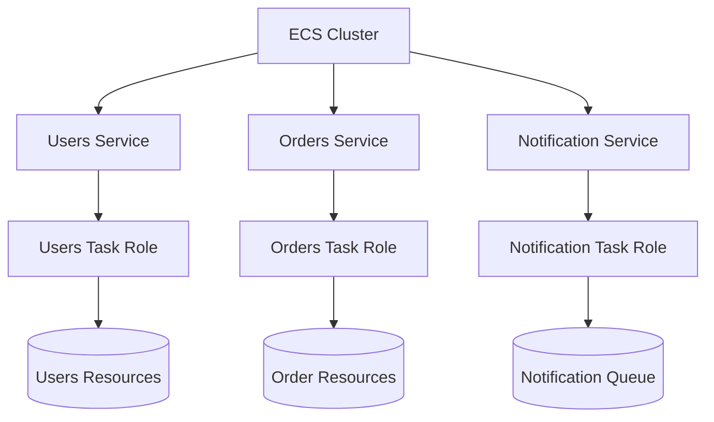
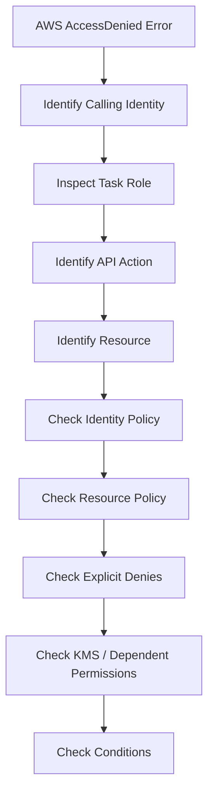

# 03- Task and Execution Role Security

## Overview

Amazon ECS uses IAM roles to separate the permissions required by the ECS runtime from the permissions required by the application running inside a container.

The two most important roles are:

- **Task execution role** — used by ECS to perform runtime operations required to start and operate a task.
- **Task role** — used by application containers to access AWS services.

The distinction is a critical security boundary:

```text
                         ECS Task
                            |
              +-------------+-------------+
              |                           |
              v                           v
      Task Execution Role             Task Role
              |                           |
              v                           v
        ECS Runtime                Application Code
              |                           |
       +------+------+              +-----+------+
       |      |      |              |     |      |
      ECR   Logs   Secrets          S3   SQS   DynamoDB
```

A secure ECS architecture should keep these roles separate and grant each only the permissions required for its responsibility.

If an application container is compromised, the task role determines which AWS resources the attacker may potentially access. If the execution role is unnecessarily broad, the ECS runtime also receives permissions that may not be required.

The security objective is therefore:

```text
Separate Responsibilities
          +
Least Privilege
          +
Resource-Level Permissions
          +
Short-Lived Credentials
          =
Reduced Blast Radius
```

## Task Execution Role

The task execution role is an IAM role that ECS uses on behalf of the task for supported runtime operations.

Typical operations include:

- Pulling private container images from Amazon ECR
- Sending container logs through the `awslogs` logging driver
- Retrieving secrets or configuration values when ECS is configured to inject them into containers
- Supporting other ECS/Fargate runtime integrations that require AWS API access

The application code does not normally use this role directly.

```text
ECS / Fargate Runtime
        |
        v
Task Execution Role
        |
        +---- Amazon ECR
        |
        +---- CloudWatch Logs
        |
        +---- Secrets Manager / SSM
```

### Security Principle

The execution role should contain only permissions required by the task's ECS runtime configuration.

Do not add application permissions to the execution role simply because the application needs them.

For example, if a Django application uploads invoices to S3, this does not mean the execution role should receive:

```text
s3:PutObject
```

That permission normally belongs on the task role because the application is performing the S3 operation.

## Task Role

The task role is the IAM identity available to application containers running inside the ECS task.

For example:

```text
FastAPI Application
        |
        v
    AWS SDK
        |
        v
     Task Role
        |
        +---- S3
        +---- SQS
        +---- DynamoDB
        +---- EventBridge
```

A Python application can use `boto3` without embedding AWS access keys:

```python
import boto3

s3 = boto3.client("s3")

response = s3.get_object(
    Bucket="production-assets",
    Key="reports/report.json",
)

data = response["Body"].read()
```

The AWS SDK obtains credentials through the ECS task-role credential mechanism.

This is preferable to:

```text
Application
    |
    +-- AWS_ACCESS_KEY_ID
    +-- AWS_SECRET_ACCESS_KEY
```

because ECS task credentials are temporary and managed by AWS.

## Task Role vs Execution Role

The distinction should be explicit in every production ECS design.

| Responsibility | Execution Role | Task Role |
|---|---:|---:|
| Pull private ECR image | Yes | No |
| Send logs using ECS logging integration | Yes | No |
| Retrieve ECS-injected secrets | Yes, when required by configuration | Not necessarily |
| Application calls S3 | No | Yes |
| Application sends SQS messages | No | Yes |
| Application reads DynamoDB | No | Yes |
| Application calls EventBridge | No | Yes |
| Used by ECS runtime | Yes | No |
| Used by application code | No | Yes |

The practical rule is:

> **Execution role = ECS runtime permissions. Task role = application permissions.**

## IAM Trust Relationships

An IAM role contains a trust policy that defines which principal can assume the role.

For ECS task roles and execution roles, the trust relationship normally allows the ECS tasks service principal:

```json
{
  "Version": "2012-10-17",
  "Statement": [
    {
      "Effect": "Allow",
      "Principal": {
        "Service": "ecs-tasks.amazonaws.com"
      },
      "Action": "sts:AssumeRole"
    }
  ]
}
```

The trust policy answers:

> Who can assume this role?

The permissions policy answers:

> What can this role do?

These are separate security controls.

```text
IAM Role
   |
   +-- Trust Policy
   |      |
   |      +-- Who can assume the role?
   |
   +-- Permissions Policy
          |
          +-- What can the role access?
```

A permissions policy does not by itself make a role assumable by ECS. The trust relationship must also be correct.

## Task Definition Role Configuration

A task definition can specify both roles.

Example:

```json
{
  "family": "orders-api",
  "executionRoleArn": "arn:aws:iam::123456789012:role/prod-orders-api-execution-role",
  "taskRoleArn": "arn:aws:iam::123456789012:role/prod-orders-api-task-role",
  "containerDefinitions": [
    {
      "name": "api",
      "image": "123456789012.dkr.ecr.ap-south-1.amazonaws.com/orders-api:8f31c2a",
      "essential": true,
      "memory": 512,
      "cpu": 256
    }
  ]
}
```

The resulting security model is:

```text
ECS Task Definition
        |
        +-- executionRoleArn
        |       |
        |       v
        |  ECS Runtime
        |
        +-- taskRoleArn
                |
                v
          Application Code
```

Keeping the role references explicit makes the security model easier to audit.

## Execution Role Security

The execution role should be designed around the ECS features actually used by the task.

For example, a task that:

- Pulls an image from private ECR
- Sends logs to CloudWatch
- Receives a secret through ECS configuration

may require permissions for those runtime operations.

The role should not automatically receive:

```text
AdministratorAccess
```

or broad application permissions such as:

```text
s3:*
dynamodb:*
sqs:*
```

unless the ECS runtime genuinely requires them.

### Why This Matters

If the execution role is unnecessarily broad:

```text
ECS Runtime
     |
     v
Broad Execution Role
     |
     +---- ECR
     +---- Logs
     +---- S3
     +---- DynamoDB
     +---- Secrets
     +---- Other Resources
```

A configuration or runtime compromise can have a larger blast radius.

A better design is:

```text
ECS Runtime
     |
     v
Restricted Execution Role
     |
     +---- Only Required Runtime Resources
```

## Task Role Security

The task role should represent the application's AWS responsibilities.

For example:

```text
Orders API
    |
    +-- Read product images
    +-- Write invoices
    +-- Publish order events
```

Its task role might allow:

```text
S3
    s3:GetObject
    s3:PutObject

SQS
    sqs:SendMessage
```

It should not automatically receive:

```text
iam:*
ec2:*
kms:*
s3:*
dynamodb:*
```

unless those operations are required.

The task role is effectively part of the application's runtime security boundary.

## Least Privilege

Least privilege means granting only the permissions required by the application.

A useful model is:

```text
Application Requirement
        |
        v
Required AWS API
        |
        v
Specific Action
        |
        v
Specific Resource
        |
        v
Optional Conditions
```

For example:

```json
{
  "Version": "2012-10-17",
  "Statement": [
    {
      "Sid": "ReadProductImages",
      "Effect": "Allow",
      "Action": "s3:GetObject",
      "Resource": "arn:aws:s3:::prod-product-assets/images/*"
    }
  ]
}
```

This is preferable to:

```json
{
  "Effect": "Allow",
  "Action": "s3:*",
  "Resource": "*"
}
```

The narrower policy reduces the impact of application compromise.

## Resource-Level Restrictions

Where supported, scope permissions to specific resources.

For S3:

```text
Bucket:
    prod-product-assets

Allowed path:
    images/*
```

For SQS:

```text
Queue:
    prod-order-events
```

For Secrets Manager:

```text
Secret:
    prod/orders-api/*
```

The objective is to avoid policies where a compromised task can enumerate or modify unrelated resources.

## Separate Roles by Service

Different ECS services should normally have different task roles when their AWS responsibilities differ.



For example:

```text
Users Service
    |
    +-- users-task-role

Orders Service
    |
    +-- orders-task-role

Notification Service
    |
    +-- notification-task-role
```

Avoid:

```text
All Services
    |
    v
shared-admin-task-role
```

A shared role creates unnecessary permission coupling.

## Service-Specific Permissions

Consider an order-processing system.

### Orders API

```text
S3:
    GetObject
    PutObject

SQS:
    SendMessage
```

### Notification Worker

```text
SQS:
    ReceiveMessage
    DeleteMessage

SES:
    SendEmail
```

### Reporting Service

```text
S3:
    GetObject
    PutObject
```

The roles should reflect these boundaries.

```text
Orders Role
     |
     +---- S3
     +---- SQS

Notification Role
     |
     +---- SQS
     +---- SES

Reporting Role
     |
     +---- S3
```

A compromised reporting service should not automatically gain permission to publish orders or send emails.

## Separate Roles by Environment

Development, staging, and production should not normally share the same task role.

Prefer:

```text
Development
    |
    +-- dev-orders-task-role

Staging
    |
    +-- staging-orders-task-role

Production
    |
    +-- prod-orders-task-role
```

The resources should also be separated:

```text
dev-orders-task-role
    |
    +-- dev S3 bucket
    +-- dev queue

prod-orders-task-role
    |
    +-- prod S3 bucket
    +-- prod queue
```

This reduces the possibility of a development workload accessing production resources.

For stronger isolation, separate AWS accounts are preferable for major environments.

## Secrets Injection

ECS can provide secrets to containers using supported integrations with AWS Secrets Manager or Systems Manager Parameter Store.

Conceptually:

```text
ECS
 |
 v
Task Definition
 |
 v
Secret Reference
 |
 v
Secrets Manager
 |
 v
Container
```

The execution role may require permissions to retrieve the secret when ECS performs the injection.

This is different from application code explicitly calling Secrets Manager:

```text
Application
    |
    v
AWS SDK
    |
    v
Secrets Manager
```

In that case, the application's task role requires the corresponding permission.

The IAM design must therefore match the access mechanism.

## Execution Role and Secret Injection

Consider a task definition that injects a database password:

```json
{
  "containerDefinitions": [
    {
      "name": "api",
      "secrets": [
        {
          "name": "DATABASE_PASSWORD",
          "valueFrom": "arn:aws:secretsmanager:ap-south-1:123456789012:secret:prod/orders-db-password"
        }
      ]
    }
  ]
}
```

The ECS runtime needs permission to retrieve the secret as part of starting the task.

If the secret uses a customer-managed KMS key, additional KMS authorization may also be required.

The security flow becomes:

```text
ECS Runtime
    |
    v
Execution Role
    |
    v
Secrets Manager
    |
    v
KMS, if applicable
    |
    v
Secret
    |
    v
Container
```

## Task Role and Application Secret Access

If the application explicitly calls Secrets Manager:

```python
import boto3

client = boto3.client("secretsmanager")

response = client.get_secret_value(
    SecretId="prod/orders-api/database",
)

secret = response["SecretString"]
```

the application requires the corresponding permission through its task role.

For example:

```json
{
  "Version": "2012-10-17",
  "Statement": [
    {
      "Effect": "Allow",
      "Action": "secretsmanager:GetSecretValue",
      "Resource": "arn:aws:secretsmanager:ap-south-1:123456789012:secret:prod/orders-api/database-*"
    }
  ]
}
```

Do not grant `secretsmanager:*` when only `GetSecretValue` is required.

## KMS and Role Security

Encrypted secrets and other AWS resources can introduce an additional authorization layer.

For example:

```text
Task
 |
 v
Secrets Manager
 |
 v
KMS Key
```

The task may appear to have the correct Secrets Manager permission but still receive an authorization failure because access to the customer-managed KMS key is not allowed.

When debugging encrypted resources, check:

- IAM policy
- KMS key policy
- Resource policy
- Explicit denies
- Required conditions
- Region and account

The effective authorization is determined by the complete policy chain.

## Container Credential Security

ECS provides task-role credentials to application containers through the ECS task metadata credential mechanism.

The application should use the AWS SDK's default credential provider chain.

For Python:

```python
import boto3

s3 = boto3.client("s3")
```

Avoid manually retrieving and storing task credentials in application configuration.

The AWS SDK should handle credential retrieval and refresh.

The security model is:

```text
ECS
 |
 v
Temporary Task Credentials
 |
 v
Application
 |
 v
AWS API
```

This avoids long-lived static credentials.

## Container Isolation Considerations

The task role protects AWS API access, but the application still runs inside a container.

Security should also consider:

- Running as a non-root user
- Avoiding privileged containers
- Minimizing Linux capabilities
- Restricting writable filesystem areas where practical
- Keeping images minimal
- Scanning dependencies
- Avoiding shell/debug tooling in production images where unnecessary

A compromised application should have as few local and AWS privileges as possible.

```text
Container
   |
   +-- Limited Linux privileges
   |
   +-- Limited filesystem access
   |
   +-- Limited IAM permissions
   |
   +-- Limited network access
```

Defense in depth matters because IAM is not a replacement for container security.

## Preventing Credential Abuse

If an attacker gains code execution inside a task, they may attempt to obtain the task role credentials.

The defense is not to assume credentials cannot be reached. Instead:

1. Minimize task-role permissions.
2. Restrict network access.
3. Keep containers patched.
4. Scan dependencies and images.
5. Monitor AWS API activity.
6. Avoid unnecessary credentials in the container.
7. Use separate roles for separate workloads.

The goal is to make stolen runtime credentials as limited and short-lived as possible.

## IAM Policies for a Python Backend

Consider a FastAPI service that:

- Stores user uploads in S3.
- Publishes asynchronous jobs to SQS.
- Reads application configuration from Secrets Manager.

Its application permissions could be:

```json
{
  "Version": "2012-10-17",
  "Statement": [
    {
      "Sid": "UploadUserFiles",
      "Effect": "Allow",
      "Action": "s3:PutObject",
      "Resource": "arn:aws:s3:::prod-user-files/uploads/*"
    },
    {
      "Sid": "PublishJobs",
      "Effect": "Allow",
      "Action": "sqs:SendMessage",
      "Resource": "arn:aws:sqs:ap-south-1:123456789012:backend-jobs"
    },
    {
      "Sid": "ReadApplicationSecret",
      "Effect": "Allow",
      "Action": "secretsmanager:GetSecretValue",
      "Resource": "arn:aws:secretsmanager:ap-south-1:123456789012:secret:prod/fastapi/*"
    }
  ]
}
```

The task role now directly represents the application's AWS dependencies.

## API Service vs Worker Role

An API and its background worker should not automatically use the same task role.

For example:

```text
FastAPI API
    |
    +-- Task Role
          |
          +-- S3 PutObject
          +-- SQS SendMessage

Celery / ECS Worker
    |
    +-- Task Role
          |
          +-- SQS ReceiveMessage
          +-- SQS DeleteMessage
          +-- S3 GetObject
```

The worker may have different permissions because it performs a different function.

This is especially important for Celery-style architectures where workers process untrusted or externally generated jobs.

## Cross-Service IAM Boundaries

Service-to-service communication has two separate concerns:

```text
Network Authorization
        +
AWS Authorization
```

For example:

```text
Order Service
    |
    | HTTP / gRPC
    v
Payment Service
```

Security groups can control network connectivity.

IAM controls AWS API access.

Application-level authentication and authorization may still be required for the service request itself.

Do not assume:

```text
Private Network
    =
Trusted Application
```

## Execution Role Permission Review

The execution role should be reviewed against the task definition.

For example:

```text
Task Definition
    |
    +-- ECR Image
    +-- Log Configuration
    +-- Secret References
    +-- Other Runtime Integrations
```

For every configuration item, identify the AWS API operation required by ECS.

Then remove permissions that are not required.

This makes the execution role easier to audit and reduces unnecessary access.

## Task Role Permission Review

The task role should be reviewed against application code and AWS SDK usage.

A practical review process is:

```text
Application
    |
    v
List AWS APIs Used
    |
    v
Map APIs to Resources
    |
    v
Create IAM Policy
    |
    v
Deploy
    |
    v
Observe Actual Usage
    |
    v
Remove Unused Permissions
```

For Python applications, search for AWS SDK clients and resource usage:

```python
boto3.client("s3")
boto3.client("sqs")
boto3.client("secretsmanager")
```

Then map the actual operations to IAM permissions.

Do not blindly grant an entire AWS service because the application uses one client.

## IAM Policy Versioning

Task definitions are versioned, and IAM policies should also be managed as controlled infrastructure.

Use infrastructure-as-code tools such as:

- Terraform
- AWS CloudFormation
- AWS CDK

This allows IAM changes to be reviewed through code changes.

A production change should ideally have:

```text
Pull Request
    |
    v
IAM Policy Review
    |
    v
Automated Validation
    |
    v
Deployment
    |
    v
Audit Trail
```

Avoid making production IAM changes manually without a documented operational reason.

## IAM and CI/CD

The deployment pipeline should not reuse the application's task role.

Use separate identities:

```text
GitHub Actions
      |
      v
Deployment Role
      |
      +-- ECR
      +-- ECS
      +-- Required Infrastructure

ECS Application
      |
      v
Task Role
      |
      +-- S3
      +-- SQS
      +-- Application Dependencies
```

The deployment role needs deployment permissions.

The task role needs runtime application permissions.

Mixing the two creates unnecessary privilege.

## GitHub Actions OIDC

A modern deployment pipeline can use GitHub Actions OIDC instead of long-lived AWS access keys.

```text
GitHub Actions
      |
      v
OIDC Token
      |
      v
AWS STS
      |
      v
Deployment Role
      |
      v
ECS / ECR
```

The trust policy should restrict which GitHub repository and supported workflow claims can assume the role.

The deployment role should also contain only the permissions required by the deployment process.

## Monitoring Task Role Usage

IAM security is not finished when the policy is deployed.

Monitor actual usage to identify:

- Unused permissions
- Unexpected AWS API calls
- Unexpected resource access
- New application dependencies
- Suspicious activity

A useful security lifecycle is:

```text
Design
  |
  v
Least-Privilege Policy
  |
  v
Deploy
  |
  v
Observe
  |
  v
Review
  |
  v
Reduce Permissions
```

Least privilege should be continuously refined.

## Detecting Suspicious Activity

A compromised ECS application may use its task-role credentials to perform unexpected AWS operations.

Examples include:

```text
Unexpected S3 access
Unexpected Secrets Manager access
Unexpected IAM API calls
Unexpected region activity
Unexpected resource creation
```

CloudTrail and other AWS security monitoring mechanisms can help identify this behavior.

A production security architecture should be able to answer:

- Which role performed the action?
- Which service or workload owns that role?
- Which resource was accessed?
- When did the activity occur?
- Was the action expected?

Good role naming and service-specific roles make this investigation easier.

## Common Security Mistakes

### Putting Application Permissions on the Execution Role

This mixes ECS runtime permissions with application permissions.

**Better:** application AWS API permissions belong on the task role.

### Giving Both Roles Administrator Access

This defeats the purpose of separating the roles.

**Better:** scope each role to its actual responsibility.

### Using the Same Role for Every ECS Service

This creates unnecessary permission sharing.

**Better:** separate roles according to service boundaries and security requirements.

### Using Long-Lived AWS Credentials

Embedding AWS keys inside containers increases credential exposure and rotation complexity.

**Better:** use ECS task-role credentials.

### Granting Wildcard Actions

Examples:

```text
Action: "*"
Resource: "*"
```

These policies create a large blast radius.

**Better:** explicitly define required actions and resources.

### Forgetting KMS Permissions

Secrets Manager or other encrypted resources may depend on KMS authorization.

**Better:** evaluate the complete authorization chain.

### Giving Development Tasks Production Roles

A vulnerable development workload should not have unrestricted production access.

**Better:** separate roles, resources, and preferably AWS accounts.

### Sharing API and Worker Roles

Workers often require different permissions from APIs.

**Better:** create separate roles when their responsibilities differ.

### Treating Private Networking as Sufficient

A private subnet does not replace IAM authorization.

**Better:** combine network isolation with workload identity and application authorization.

### Changing IAM Policies Without Reviewing the Application

Removing a permission can break production workloads.

**Better:** map IAM policies to actual application behavior and validate changes through CI/CD.

## Production Security Checklist

| Area | Recommendation |
|---|---|
| Execution role | Only ECS runtime permissions |
| Task role | Only application AWS permissions |
| Trust policy | Allow only the intended principal |
| Actions | Scope to required API operations |
| Resources | Scope to required resources |
| Services | Separate roles when responsibilities differ |
| Environments | Separate production and non-production access |
| Credentials | Use temporary ECS task credentials |
| Secrets | Restrict access to required secrets |
| KMS | Review key policies and IAM together |
| Containers | Avoid root and unnecessary privileges |
| CI/CD | Use a separate deployment role |
| GitHub Actions | Prefer OIDC and short-lived credentials |
| Monitoring | Review actual IAM usage |
| Auditing | Monitor role and policy changes |
| Infrastructure | Manage IAM as code |
| Incident response | Revoke or restrict compromised roles quickly |

## Troubleshooting Access Denied Errors

When an ECS application receives an AWS authorization error:

```text
AccessDeniedException
```

do not immediately add broader permissions.

Use a structured process:



For ECS workloads, first determine whether the request is actually coming from the expected task role.

Then verify:

- Role ARN
- AWS account
- Region
- API operation
- Resource ARN
- Identity policy
- Resource policy
- Permissions boundary
- SCP
- KMS key policy
- Explicit deny
- Policy conditions

## Interview Traps

### What Is the Security Difference Between the Two Roles?

The execution role represents the permissions required by ECS to run the task.

The task role represents the permissions required by the application running inside the task.

### If an Application Needs S3 Access, Which Role Should Get the Permission?

The task role, because the application itself is making the S3 API request.

### If ECS Injects a Secret Into the Container, Which Role Is Involved?

The ECS runtime uses the execution role for the secret retrieval required by the ECS configuration. If application code independently calls Secrets Manager, the task role needs the corresponding permission.

### Can the Task Role Be Used for Deployment?

It technically can be configured with additional permissions, but this is poor security architecture.

The deployment system should use a dedicated deployment identity.

### What Happens if an Attacker Compromises an ECS Container?

The attacker may attempt to use the task's runtime credentials.

The impact is constrained primarily by:

- Task-role permissions
- Resource policies
- Network controls
- Credential lifetime
- Application and container security
- Monitoring and detection

This is why least privilege is a practical blast-radius control.

### Why Separate Roles Between API and Worker Services?

They have different responsibilities and therefore different permission requirements.

Separate roles prevent a compromise in one workload from automatically granting access required only by another workload.

## Key Takeaways

- The **task execution role belongs to the ECS runtime**, while the **task role belongs to the application**, and keeping these responsibilities separate is a fundamental ECS security practice.
- Task roles should follow **least privilege**, with narrowly scoped actions and resource ARNs based on the application's actual AWS API usage.
- Separate roles by **service and environment** when their responsibilities or trust boundaries differ to reduce the blast radius of a compromised workload.
- ECS task credentials should be **temporary and role-based**; avoid embedding long-lived AWS access keys in containers, images, or application configuration.
- Secure role design requires more than IAM permissions: evaluate **trust policies, resource policies, KMS authorization, SCPs, permissions boundaries, network controls, and runtime behavior** as one security system.