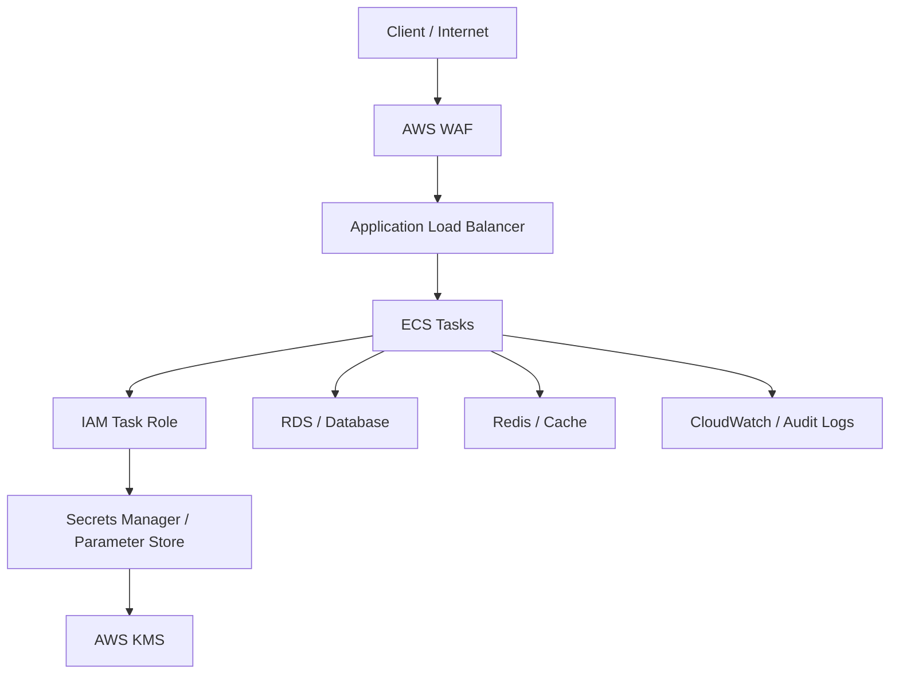

# README

## Overview

This section covers the security architecture and operational controls required to run Amazon ECS workloads securely in production.

The focus is on protecting ECS workloads across the identity, secrets, encryption, and network layers. The documents progress from the overall security model to specific controls used to secure ECS tasks and their communication paths.

The security model can be viewed as:

```text
                    Amazon ECS Security
                           |
          +----------------+----------------+
          |                |                |
          v                v                v
       Identity         Secrets          Network
          |                |                |
       IAM Roles      Encryption/KMS   Security Groups
          |                |                |
          v                v                v
     Task Access      Secret Access    Traffic Control
          |                |                |
          +----------------+----------------+
                           |
                           v
                    Secure Workloads
```

## Quick Navigation

| # | Topic | Coverage |
|---|---|---|
| 01 | [Security Overview](01-%20Security%20Overview.md) | General security posture for Amazon ECS. |
| 02 | [IAM Roles and Permissions](02-%20IAM%20Roles%20and%20Permissions.md) | IAM configuration and least privilege. |
| 03 | [Task and Execution Role Security](03-%20Task%20and%20Execution%20Role%20Security.md) | Securing task and execution roles. |
| 04 | [Secrets and Encryption](04-%20Secrets%20and%20Encryption.md) | Managing secrets with Secrets Manager and Parameter Store. |
| 05 | [Network Security](05-%20Network%20Security.md) | VPC, security groups, and endpoint security for ECS. |
| 06 | [Security Best Practices](06-%20Security%20Best%20Practices.md) | Hardening ECS clusters and tasks. |

## Security Architecture

A production ECS workload should separate security responsibilities across multiple layers.



Each layer has a distinct responsibility:

| Security Layer | Primary Responsibility |
|---|---|
| IAM | Control what ECS workloads are allowed to access |
| Task Role | Authorize application-level AWS API calls |
| Execution Role | Authorize ECS runtime operations |
| Secrets Manager | Store and manage sensitive credentials |
| KMS | Protect encryption keys and encrypted data |
| VPC | Isolate the workload network |
| Security Groups | Control network connectivity |
| TLS | Protect data in transit |
| WAF | Filter malicious HTTP traffic |
| CloudWatch / Audit Logs | Provide operational and security visibility |

## Recommended Reading Order

Read the documents in order because each document builds on the previous security layer.

### Security Fundamentals

[01- Security Overview](./01-%20Security%20Overview.md)

Start here to understand the ECS security model and the different security boundaries surrounding a containerized workload.

### Identity and Permissions

[02- IAM Roles and Permissions](./02-%20IAM%20Roles%20and%20Permissions.md)

Learn how ECS workloads obtain AWS permissions and how IAM policies should be designed around least privilege.

[03- Task and Execution Role Security](./03-%20Task%20and%20Execution%20Role%20Security.md)

Understand the important distinction between the ECS task role and task execution role and why mixing their responsibilities creates security problems.

### Secrets and Encryption

[04- Secrets and Encryption](./04-%20Secrets%20and%20Encryption.md)

Learn how production credentials are stored, injected, accessed, rotated, and encrypted using AWS security services.

### Network Security

[05- Network Security](./05-%20Network%20Security.md)

Understand how VPCs, private subnets, security groups, load balancers, TLS, egress controls, and network segmentation protect ECS workloads.

## Core ECS Security Model

A secure ECS deployment should follow the principle of least privilege at both the identity and network layers.

```text
                    ┌──────────────────────┐
                    │       Internet       │
                    └──────────┬───────────┘
                               │
                               v
                    ┌──────────────────────┐
                    │      WAF / ALB       │
                    └──────────┬───────────┘
                               │
                         Allowed Traffic
                               │
                               v
                    ┌──────────────────────┐
                    │      ECS Tasks       │
                    │   Private Subnets    │
                    └──────┬───────┬───────┘
                           │       │
                 IAM       │       │       Network
                           │       │
                           v       v
                       AWS APIs  Data Tier
                           │       │
                           v       v
                     AWS Services RDS / Redis
```

The primary security principles are:

- **Least privilege** — workloads receive only the AWS permissions they require.
- **Network isolation** — ECS tasks should generally remain in private subnets.
- **Explicit trust boundaries** — security groups should permit only required traffic.
- **Secret isolation** — credentials should not be embedded in source code or container images.
- **Encryption** — sensitive data should be protected at rest and in transit.
- **Defense in depth** — IAM, networking, encryption, application security, and monitoring should complement each other.
- **Auditable infrastructure** — security configuration should preferably be managed through infrastructure as code.

## Security Decision Framework

When designing an ECS workload, evaluate security controls in this order:

| Question | Primary Control |
|---|---|
| Who can invoke the application? | ALB / WAF / Application Authentication |
| Which network can reach the task? | VPC / Subnets / Security Groups |
| Which AWS APIs can the application call? | Task Role / IAM |
| Which AWS APIs does ECS need to start the task? | Execution Role |
| Where are credentials stored? | Secrets Manager / Parameter Store |
| How are sensitive values encrypted? | KMS |
| Is traffic protected while moving? | TLS |
| Can compromised workloads move laterally? | Network Segmentation / Security Groups |
| Can suspicious activity be investigated? | CloudWatch / VPC Flow Logs / Audit Logs |
| Can the security architecture be reproduced? | Infrastructure as Code |

## Production Security Checklist

Before considering an ECS workload production-ready, verify:

- ECS tasks do not require public IP addresses unless explicitly justified.
- Public traffic enters through a controlled ingress layer.
- Security groups use narrowly scoped rules.
- Database ports are not publicly accessible.
- Redis and other internal services remain private.
- Task roles follow least privilege.
- Execution roles contain only ECS runtime permissions.
- Production secrets are not stored in source control.
- Production secrets are not embedded in Docker images.
- Sensitive configuration is retrieved through an approved secret-management mechanism.
- Encryption at rest is enabled where required.
- TLS is used for sensitive network communication.
- Outbound traffic requirements are understood.
- VPC endpoints are considered for supported AWS services.
- Security logging and monitoring are enabled according to operational requirements.
- Security configuration is managed through infrastructure as code where practical.
- Disaster recovery environments reproduce the required network and identity controls.

## Interview Focus

The most important ECS security concepts to be able to explain clearly are:

| Topic | Interview Question |
|---|---|
| IAM | Why should ECS use IAM roles instead of static AWS credentials? |
| Task Role | What permissions does the application receive? |
| Execution Role | What does ECS itself need permission to do? |
| Secrets | Where should database passwords be stored? |
| KMS | What role does KMS play in encryption? |
| Security Groups | How do you restrict ALB-to-ECS traffic? |
| Private Subnets | Why should ECS tasks usually be private? |
| Network Segmentation | How do you restrict ECS-to-RDS access? |
| TLS | Does a private VPC eliminate the need for encryption in transit? |
| Egress | How can outbound traffic from ECS be controlled? |
| WAF | How does WAF complement security groups? |
| Defense in Depth | Why are IAM and network security both required? |

## Key Takeaways

- ECS security is a **defense-in-depth model** combining IAM, secrets management, encryption, network isolation, application security, and monitoring.
- Keep **identity and network permissions narrowly scoped** so a compromised workload cannot automatically access unrelated AWS resources or internal services.
- Separate the responsibilities of the **task role, execution role, Secrets Manager/KMS, and security groups** rather than treating ECS security as a single control.
- The documents in this folder should be used together when designing a production ECS architecture, because **identity, secrets, encryption, and network security are interdependent**.
- Prefer **least privilege, private networking, encrypted communication, centralized secret management, and infrastructure as code** as baseline production practices.