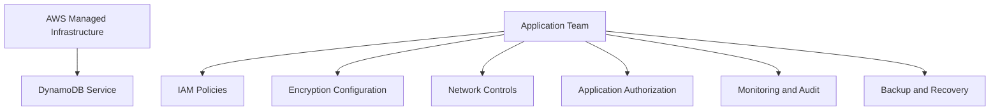
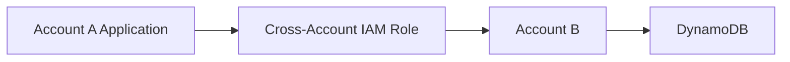
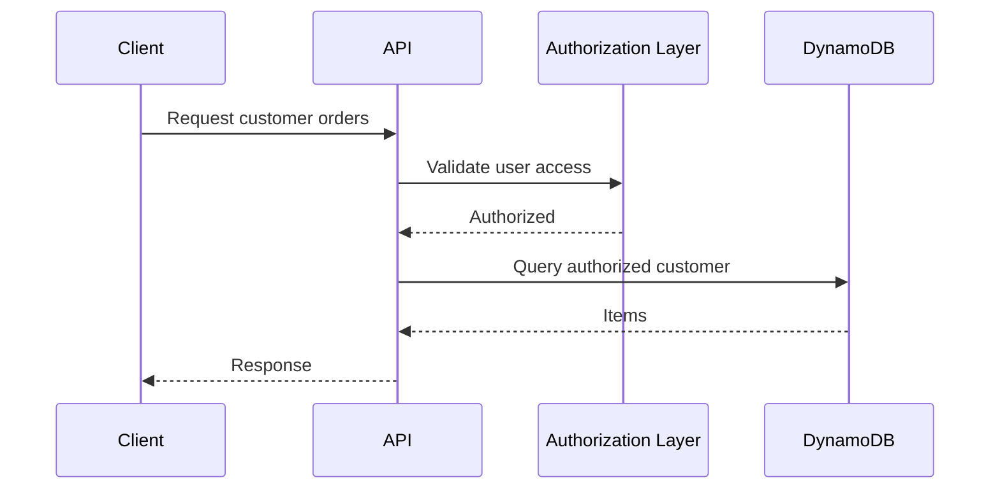
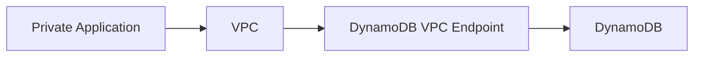
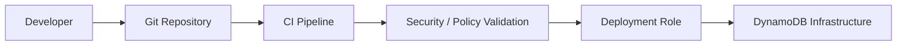
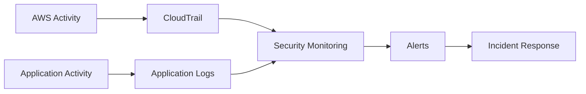

# 01- Security Overview

## Overview

DynamoDB security is based on controlling who can access data, what operations they can perform, how data is protected in transit and at rest, and how access and changes are monitored.

A production DynamoDB security architecture typically combines:

```text
Identity
   ↓
IAM Authorization
   ↓
Network Controls
   ↓
DynamoDB Resource Policies
   ↓
Encryption
   ↓
Application-Level Authorization
   ↓
Monitoring and Auditing
```

DynamoDB is a managed AWS service, so infrastructure security is shared between AWS and the application team. AWS manages the underlying service infrastructure, while the application owner is responsible for identities, permissions, data access policies, encryption configuration where applicable, application authorization, monitoring, and operational controls.

---

## DynamoDB Security Model

A production DynamoDB security architecture should address multiple layers.

| Security layer | Primary responsibility |
|---|---|
| Identity | Determine who or what is making the request |
| IAM | Authorize AWS API operations |
| Resource policies | Control access at the DynamoDB resource boundary |
| Application authorization | Determine which application user can access which data |
| Encryption at rest | Protect stored data |
| TLS | Protect data in transit |
| Network controls | Restrict how private workloads reach DynamoDB |
| Monitoring | Detect suspicious or incorrect activity |
| Audit | Establish who performed which AWS API operation |
| Backup and recovery | Protect against accidental deletion or corruption |

Security should therefore not be treated as simply:

```text
IAM Policy + Encryption = Secure DynamoDB
```

A secure production system requires defense in depth.

---

## Shared Responsibility

AWS secures the underlying DynamoDB service infrastructure.

The application team remains responsible for configuration and usage.

Conceptually:



The exact responsibility boundary depends on the configuration and services used, but application teams should assume responsibility for everything above the managed service boundary.

---

## Identity and Authentication

AWS identity determines which principal is making a DynamoDB API request.

Common identities include:

- IAM roles
- IAM users
- IAM Identity Center identities
- AWS service roles
- Workload identities

Production workloads should generally use IAM roles rather than long-lived access keys.

For example:

```text
ECS Task
   ↓
IAM Task Role
   ↓
DynamoDB
```

or:

```text
Lambda
   ↓
Execution Role
   ↓
DynamoDB
```

The application should not contain static AWS credentials.

---

## IAM Authorization

IAM determines whether an authenticated AWS principal is authorized to perform an operation.

For example:

```text
Application Role
      |
      v
IAM Policy
      |
      v
dynamodb:GetItem
      |
      v
Orders Table
```

Typical DynamoDB permissions include:

```text
dynamodb:GetItem
dynamodb:PutItem
dynamodb:UpdateItem
dynamodb:DeleteItem
dynamodb:Query
dynamodb:Scan
dynamodb:BatchGetItem
dynamodb:BatchWriteItem
```

Administrative permissions include operations such as:

```text
dynamodb:CreateTable
dynamodb:DeleteTable
dynamodb:UpdateTable
```

Application roles should generally not require administrative permissions.

---

## Least Privilege

Least privilege means granting only the permissions required by a workload.

For example, a service that only retrieves orders might require:

```json
{
  "Effect": "Allow",
  "Action": [
    "dynamodb:GetItem",
    "dynamodb:Query"
  ],
  "Resource": "arn:aws:dynamodb:REGION:ACCOUNT_ID:table/Orders"
}
```

A service that does not modify DynamoDB should not receive:

```text
dynamodb:PutItem
dynamodb:UpdateItem
dynamodb:DeleteItem
```

Likewise, an application should not receive:

```text
dynamodb:*
```

unless there is a specific administrative requirement.

---

## Table-Level Access

IAM policies can restrict access to specific DynamoDB tables.

For example:

```text
Order Service Role
        |
        +---- Orders table
        |
        +---- OrderEvents table
```

while preventing access to unrelated tables.

This limits blast radius if an application is compromised.

A useful production model is:

```text
Service A
    ↓
Service A IAM Role
    ↓
Only Service A tables

Service B
    ↓
Service B IAM Role
    ↓
Only Service B tables
```

Avoid using one highly privileged IAM role for every backend service.

---

## Index-Level Access

DynamoDB resources include indexes as part of the resource hierarchy.

Where required, IAM policies can restrict access to specific indexes.

This is useful when a workload should access a table only through particular access paths.

However, table and index permissions should be designed carefully so that an application cannot bypass intended access restrictions through another available operation.

---

## Resource-Based Policies

DynamoDB also supports resource-based policies for supported resources and access scenarios.

This provides another authorization layer in addition to identity-based IAM policies.

Conceptually:

```text
Request
   |
   +---- Identity Policy
   |
   +---- Resource Policy
   |
   v
Authorization Decision
```

Resource policies can be useful for controlled cross-account access and centralized resource-level authorization.

Use them deliberately because combining identity-based and resource-based policies can make authorization behavior harder to reason about.

---

## Cross-Account Access

Cross-account DynamoDB access should normally use explicit IAM trust and resource authorization patterns.

For example:



A production design should clearly define:

- Which account owns the table
- Which account owns the workload
- Which principal can assume the role
- Which DynamoDB actions are allowed
- Which resources are accessible
- How access is audited

Avoid granting broad cross-account permissions when only one table or one operation is required.

---

## Application-Level Authorization

IAM does not replace application authorization.

Suppose an API allows:

```text
GET /customers/{customer_id}/orders
```

IAM may correctly authorize the application to query the Orders table.

That does **not** mean the end user should be allowed to access every customer.

The authorization flow is:



The application must enforce tenant, user, ownership, and business authorization rules.

---

## Multi-Tenant Security

Multi-tenant applications require careful separation of tenant data.

A common DynamoDB design is:

```text
PK = TENANT#123
SK = ORDER#456
```

Application authorization must ensure that:

```text
Authenticated Tenant
        =
Requested Tenant
```

For example:

```python
if requested_tenant_id != authenticated_tenant_id:
    raise PermissionError("Tenant access denied")
```

The exact authorization implementation depends on the application architecture.

The critical principle is:

> A valid DynamoDB permission does not imply permission to access every tenant's data.

---

## Fine-Grained Access Patterns

For sensitive workloads, authorization can be reinforced through data-model design.

For example:

```text
PK = TENANT#123
SK = USER#456#ORDER#789
```

This can make tenant and user boundaries explicit in the data model.

However, key structure should not be treated as the only security boundary.

The application must still validate authorization.

---

## Encryption at Rest

DynamoDB encrypts data at rest.

Encryption protects stored data from unauthorized access to the underlying storage infrastructure.

The architecture can use AWS-managed encryption or a customer-managed AWS KMS key depending on organizational requirements.

Conceptually:

```text
Application
    ↓
DynamoDB
    ↓
Encrypted Storage
    ↓
KMS-backed Key Management
```

Encryption at rest should be considered together with IAM and KMS authorization.

Encryption does not determine whether an application user is allowed to read a record.

---

## AWS KMS Integration

Customer-managed KMS keys can provide additional control over encryption key management.

They may be required when organizations need:

- Explicit key ownership
- Key policies
- Centralized key management
- Compliance controls
- Key usage auditing

However, introducing a customer-managed key also introduces an operational dependency on the key and its policy configuration.

A restrictive or incorrectly modified KMS policy can prevent authorized workloads from functioning correctly.

---

## KMS Security Considerations

When using a customer-managed KMS key, protect:

- Key policies
- IAM permissions
- Key administrators
- Key users
- Rotation configuration
- Deletion controls

Separate key administration from application administration where organizational policy requires it.

Avoid granting application workloads unnecessary KMS administrative permissions such as:

```text
kms:ScheduleKeyDeletion
kms:DisableKey
kms:PutKeyPolicy
```

An application generally needs to use a key, not administer it.

---

## Encryption in Transit

DynamoDB API communication uses TLS.

A typical request path is:

```text
Application
    |
    | TLS
    v
AWS DynamoDB Endpoint
```

Applications should use current AWS SDKs and standard HTTPS communication.

Do not disable certificate verification or introduce custom insecure HTTP behavior.

For Python applications, the AWS SDK handles the standard TLS communication.

---

## Network Security

DynamoDB is an AWS-managed service rather than a database server deployed inside an application subnet.

Applications running in private environments can use a VPC endpoint to access DynamoDB without requiring the workload to traverse the public internet.

Conceptually:



This can be useful for private application architectures.

Network controls should complement, not replace, IAM authorization.

---

## DynamoDB VPC Endpoints

A DynamoDB VPC endpoint can provide private connectivity from a VPC to DynamoDB.

When configuring one, review:

- Route configuration
- Endpoint policy
- IAM permissions
- DNS behavior
- Application subnet configuration

A restrictive endpoint policy can block valid application requests.

For example:

```text
Application IAM Role
        |
        v
VPC Endpoint Policy
        |
        v
DynamoDB Resource
```

All relevant authorization layers must permit the operation.

---

## Endpoint Policies

VPC endpoint policies can restrict which DynamoDB resources or operations are accessible through the endpoint.

This provides another layer of defense.

For example, a private application environment might be permitted to access:

```text
Orders table
Payments table
```

while preventing access to unrelated DynamoDB resources.

Do not use endpoint policies as a replacement for IAM.

Use multiple layers where the security model justifies them.

---

## Secrets Management

DynamoDB does not eliminate the need for secrets management.

Applications may still need credentials for:

- External APIs
- Database integrations
- Third-party services
- Encryption systems

Use appropriate AWS services such as:

- AWS Secrets Manager
- AWS Systems Manager Parameter Store

Do not store secrets inside:

```text
Source code
Docker images
Git repositories
Application logs
DynamoDB items
```

unless there is a specific and justified encryption architecture.

---

## Logging and Sensitive Data

Application logs should not expose sensitive DynamoDB data.

Avoid logging:

```text
Full customer records
Payment information
Authentication tokens
Secrets
Personal data
Sensitive partition keys
```

Prefer structured metadata:

```json
{
  "request_id": "req-123",
  "operation": "GetOrder",
  "table": "Orders",
  "status": "success",
  "duration_ms": 12
}
```

Logging should provide operational visibility without creating a second sensitive-data repository.

---

## CloudTrail Auditing

AWS CloudTrail can record AWS API activity.

For DynamoDB, this can help answer:

```text
Who performed an AWS API operation?
When did it happen?
Which resource was affected?
Which AWS principal made the request?
```

CloudTrail is particularly useful for:

- Security investigations
- Configuration changes
- Administrative operations
- Compliance
- Incident response

CloudTrail should complement application logging rather than replace it.

---

## DynamoDB Streams and Security

DynamoDB Streams can expose changes to table items for downstream processing.

Stream consumers should be treated as trusted data-processing workloads.

For example:

```text
DynamoDB
    |
    v
DynamoDB Stream
    |
    v
Lambda
    |
    v
SQS / External System
```

If the table contains sensitive data, downstream consumers may receive sensitive information as part of stream records.

Apply least privilege to stream consumers and avoid unnecessarily forwarding sensitive attributes to external systems.

---

## Stream Consumer Permissions

A stream-processing Lambda should receive only the permissions it requires.

For example:

```text
Lambda Execution Role
    |
    +---- Read DynamoDB Stream
    |
    +---- Write to required destination
```

It should not automatically receive:

```text
dynamodb:*
```

or access to unrelated tables.

This limits the impact of a compromised consumer.

---

## Backup and Recovery Security

Backups are part of the security model because data loss and data corruption are security and operational concerns.

Production systems should consider:

- Point-in-Time Recovery
- On-demand backups
- Backup retention
- Restore authorization
- Backup access controls
- Restore testing

A backup should be protected against unauthorized deletion or modification.

---

## Point-in-Time Recovery

Point-in-Time Recovery provides a mechanism for recovering a DynamoDB table to an earlier point in time within the configured recovery window.

This is particularly important for:

```text
Accidental deletion
Accidental overwrite
Application bugs
Bad migrations
Data corruption
```

PITR is not a substitute for access control.

A malicious or compromised application should not be able to modify production data simply because recovery is available.

---

## Backup Isolation

For critical systems, backup protection should consider separation of privileges.

A useful model is:

```text
Application Role
    |
    +---- Read / Write application data

Backup Operator
    |
    +---- Backup / Restore permissions

Security Administrator
    |
    +---- IAM / KMS administration
```

Separating operational roles reduces the blast radius of a compromised application identity.

---

## Data Classification

DynamoDB security requirements should be based on the sensitivity of stored data.

For example:

| Data classification | Typical controls |
|---|---|
| Public | Basic IAM and encryption |
| Internal | Least privilege, encryption, auditing |
| Confidential | Strong IAM, encryption, monitoring, restricted access |
| Highly sensitive | Strong isolation, strict authorization, KMS controls, auditing, recovery controls |

The exact classification should follow organizational policy.

Security architecture should not assume that every DynamoDB table has the same risk profile.

---

## Data Minimization

Avoid storing data that the application does not need.

For example, if a service only needs:

```text
customer_id
order_id
status
created_at
```

do not replicate unnecessary sensitive attributes into every item.

Data minimization reduces:

- Breach impact
- Storage requirements
- Backup exposure
- Logging risks
- Compliance scope

A smaller data footprint is easier to secure.

---

## Application Security Boundaries

A secure backend should enforce authorization before accessing DynamoDB.

For example:

```text
Client
   |
   v
Authentication
   |
   v
Authorization
   |
   v
Input Validation
   |
   v
Business Logic
   |
   v
DynamoDB
```

Do not allow a client to directly control arbitrary DynamoDB keys without authorization validation.

For example, this is dangerous:

```text
GET /orders/{id}
```

if the backend simply trusts `{id}` and returns the item without verifying ownership.

---

## Input Validation

DynamoDB expressions and application queries should be constructed using SDK-supported parameterization mechanisms rather than string concatenation.

Use expression attribute values and names where appropriate.

For example:

```python
response = table.query(
    KeyConditionExpression="#pk = :pk",
    ExpressionAttributeNames={
        "#pk": "PK",
    },
    ExpressionAttributeValues={
        ":pk": f"TENANT#{tenant_id}",
    },
)
```

Validate identifiers and business inputs before constructing database operations.

---

## IAM Policy Conditions

IAM policies can use conditions to make permissions more restrictive.

Depending on the architecture, policies can restrict access based on conditions such as:

- Principal attributes
- Requested resources
- Network context
- Tags
- Source identity

Use policy conditions when they materially strengthen the security boundary.

Complex policies should be tested carefully because an overly restrictive condition can break production workloads.

---

## Environment Isolation

Production, staging, and development environments should have separate security boundaries.

A typical model is:

```text
Development Account
    |
    +---- Development DynamoDB

Staging Account
    |
    +---- Staging DynamoDB

Production Account
    |
    +---- Production DynamoDB
```

Avoid allowing development workloads to use production IAM roles or production tables.

Separate AWS accounts can provide a stronger isolation boundary than simply using different table names.

---

## Deployment Security

Infrastructure changes should be deployed through controlled CI/CD pipelines.

A secure deployment model is:



The CI/CD deployment identity should be separated from runtime application identities.

For example:

```text
Deployment Role
    ↓
Create / modify DynamoDB resources

Application Role
    ↓
Read / write application data
```

An application should not require infrastructure-management privileges.

---

## Infrastructure as Code

Use Infrastructure as Code to make security configuration reproducible.

Security-sensitive configuration can include:

- IAM policies
- DynamoDB tables
- Encryption settings
- VPC endpoints
- Resource policies
- CloudWatch alarms
- Backup configuration

Infrastructure changes should be reviewed before deployment.

Avoid manually modifying production IAM or DynamoDB security configuration without an auditable change process.

---

## Security Monitoring

A production security monitoring strategy should detect:

- Unexpected table access
- Unauthorized API calls
- IAM policy changes
- Resource policy changes
- KMS configuration changes
- Unusual access patterns
- Unexpected data exports
- Administrative operations

A useful monitoring flow is:



Monitoring should distinguish normal high-throughput activity from suspicious access.

---

## Common Security Mistakes

### Using `dynamodb:*`

Granting all DynamoDB permissions to an application creates unnecessary blast radius.

Use specific actions and resources.

### Hard-Coding AWS Credentials

Static credentials can leak through repositories, logs, images, or developer machines.

Use IAM roles for workloads.

### Confusing IAM with User Authorization

IAM may authorize the application to access a table, but it does not automatically authorize every end user to access every record.

### Storing Secrets in DynamoDB

DynamoDB is a data store, not a general-purpose secret-management system.

Use dedicated secret-management services.

### Logging Sensitive Items

Operational logs can become a secondary source of sensitive data.

Log identifiers and metadata rather than complete records.

### Overly Broad Cross-Account Access

Cross-account roles should grant only the required actions and resources.

### Ignoring GSI Access

Security policies should consider access through tables and indexes where applicable.

### Weak Backup Permissions

Application identities should not automatically be allowed to delete or manipulate production backups.

### Treating Encryption as Complete Security

Encryption protects data at rest, but it does not prevent an authorized but compromised application from reading sensitive records.

### Sharing Production Roles

Using the same IAM role for deployment, application runtime, developers, and administrators makes incident investigation and privilege isolation much harder.

---

## Production Security Checklist

### Identity

- [ ] Production workloads use IAM roles.
- [ ] Static AWS credentials are not embedded in applications.
- [ ] Runtime and deployment identities are separated.
- [ ] Administrative identities are separated from application identities.

### IAM

- [ ] Least-privilege permissions are implemented.
- [ ] Application roles access only required tables.
- [ ] Administrative DynamoDB permissions are restricted.
- [ ] Cross-account permissions are explicitly controlled.
- [ ] IAM policies are reviewed and tested.

### Application Authorization

- [ ] Authentication occurs before data access.
- [ ] Tenant isolation is enforced.
- [ ] Resource ownership is validated.
- [ ] Client-controlled identifiers are authorized.
- [ ] Input validation is implemented.

### Encryption

- [ ] Encryption at rest requirements are defined.
- [ ] KMS usage is reviewed where applicable.
- [ ] KMS permissions follow least privilege.
- [ ] Encryption in transit uses TLS.
- [ ] Key-management responsibilities are documented.

### Networking

- [ ] Private workloads use appropriate VPC connectivity.
- [ ] DynamoDB VPC endpoint policies are reviewed where applicable.
- [ ] Network controls complement IAM.
- [ ] Public access assumptions are explicitly reviewed.

### Data Protection

- [ ] Sensitive data is classified.
- [ ] Unnecessary sensitive data is not stored.
- [ ] PITR is enabled where required.
- [ ] Backups are protected.
- [ ] Restore procedures are tested.

### Monitoring

- [ ] CloudTrail auditing is enabled where required.
- [ ] DynamoDB administrative activity is monitored.
- [ ] IAM changes are monitored.
- [ ] KMS changes are monitored.
- [ ] Application access is logged safely.
- [ ] Sensitive data is excluded from logs.

### Operations

- [ ] Security configuration is managed through IaC.
- [ ] Production access is auditable.
- [ ] CI/CD uses dedicated deployment roles.
- [ ] Development and production environments are isolated.
- [ ] Security incident procedures are documented.

---

## Key Takeaways

- DynamoDB security requires defense in depth across IAM, application authorization, encryption, networking, monitoring, and data recovery.
- Production workloads should use least-privilege IAM roles and separate runtime, deployment, administrative, and cross-account identities.
- IAM authorizes AWS resource access but does not replace application-level authorization such as tenant isolation and resource ownership checks.
- Encryption, backups, CloudTrail, safe logging, and monitoring protect different parts of the security lifecycle and should be designed together.
- The strongest DynamoDB security architecture minimizes data exposure, limits privilege and blast radius, isolates environments, and makes security-sensitive operations auditable.