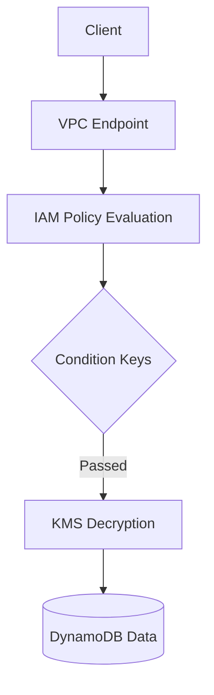

# 08- AWS DynamoDB

## Overview

This section covers the security model of Amazon DynamoDB, including IAM policies, encryption, and compliance.

## 08- AWS DynamoDB Files

| File | Topic | Primary Focus |
|---|---|---|
| [01- Security Overview](./01-%20Security%20Overview.md) | Security Overview | DynamoDB security is based on controlling who can access ... |
| [02- IAM Authentication & Authorization](./02-%20IAM%20Authentication%20%26%20Authorization.md) | IAM Authentication & Authorization | Security is one of the most important aspects of any Dyna... |
| [03- Fine-Grained Access Control (FGAC)](./03-%20Fine-Grained%20Access%20Control%20%28FGAC%29.md) | Grained Access Control (FGAC) | In most production applications, granting access to an en... |
| [04- Encryption & AWS KMS](./04-%20Encryption%20%26%20AWS%20KMS.md) | Encryption & AWS KMS | Data security is one of the core responsibilities of any ... |
| [05- VPC Endpoints](./05-%20VPC%20Endpoints.md) | VPC Endpoints | By default, applications access Amazon DynamoDB through *... |
| [06- CloudTrail, CloudWatch & Auditing](./06-%20CloudTrail%2C%20CloudWatch%20%26%20Auditing.md) | CloudTrail, CloudWatch & Auditing | Security does not end with authentication and authorization |
| [07- Data Protection & Compliance](./07-%20Data%20Protection%20%26%20Compliance.md) | Data Protection & Compliance | For many organizations, securing a DynamoDB table is only... |
| [08- Security Best Practices](./08-%20Security%20Best%20Practices.md) | Security Best Practices | Building a secure DynamoDB application is not about enabl... |

## Progression

The documentation in this section builds conceptually according to the following flow:



## Core Concepts

### Fine-Grained Access Control (FGAC)
Restricting access to specific items or attributes based on the caller's identity.

### Encryption at Rest
Securing physical storage media using AWS KMS.

## Engineering Patterns

- **Tenant Isolation:** Using `dynamodb:LeadingKeys` to restrict SaaS users to their own data partitions.
- **Attribute-Based Access Control:** Masking PII fields using `dynamodb:Attributes`.

## Practical Considerations

Customer Managed Keys (CMKs) incur per-request KMS charges which can significantly increase costs for high-throughput tables.

## Common Mistakes

- Using wildcard (`*`) resources in DynamoDB IAM policies.
- Forgetting to secure GSIs in the IAM policy.
- Accessing DynamoDB over the public internet from a VPC.

## Recommended Reading Order

To maximize comprehension, study the files in this sequence:

1. [01- Security Overview](./01-%20Security%20Overview.md)
2. [02- IAM Authentication & Authorization](./02-%20IAM%20Authentication%20%26%20Authorization.md)
3. [03- Fine-Grained Access Control (FGAC)](./03-%20Fine-Grained%20Access%20Control%20%28FGAC%29.md)
4. [04- Encryption & AWS KMS](./04-%20Encryption%20%26%20AWS%20KMS.md)
5. [05- VPC Endpoints](./05-%20VPC%20Endpoints.md)
6. [06- CloudTrail, CloudWatch & Auditing](./06-%20CloudTrail%2C%20CloudWatch%20%26%20Auditing.md)
7. [07- Data Protection & Compliance](./07-%20Data%20Protection%20%26%20Compliance.md)
8. [08- Security Best Practices](./08-%20Security%20Best%20Practices.md)

## Decision Checklist

- [ ] Are VPC Gateway Endpoints configured?
- [ ] Do IAM roles follow the Principle of Least Privilege?
- [ ] Is FGAC utilized for multi-tenant tables?

## Mental Model

DynamoDB security pushes authorization down to the infrastructure layer, allowing IAM to enforce row-level database security.

## Key Takeaways

- Master the concepts before writing code.
- Understand the capacity implications of your designs.
- Continuously monitor production metrics.

## Folder Structure

```text
08- AWS DynamoDB/
    01- Security Overview.md
    02- IAM Authentication & Authorization.md
    03- Fine-Grained Access Control (FGAC).md
    04- Encryption & AWS KMS.md
    05- VPC Endpoints.md
    06- CloudTrail, CloudWatch & Auditing.md
    07- Data Protection & Compliance.md
    08- Security Best Practices.md
    README.md
```

---

## Repository Navigation

- [AWS Concepts](../../01-%20Concepts/README.md)
- [AWS Architecture](../../02-%20Architecture/README.md)
- [AWS Operations](../../04-%20Operations/README.md)
- [AWS Security](../../05-%20Security/README.md)
- [AWS Troubleshooting](../../07-%20Troubleshooting/README.md)
- [AWS Interview Questions](../../08-%20Interview%20Questions/README.md)
- [AWS Integrations](../../09-%20Integrations/README.md)
