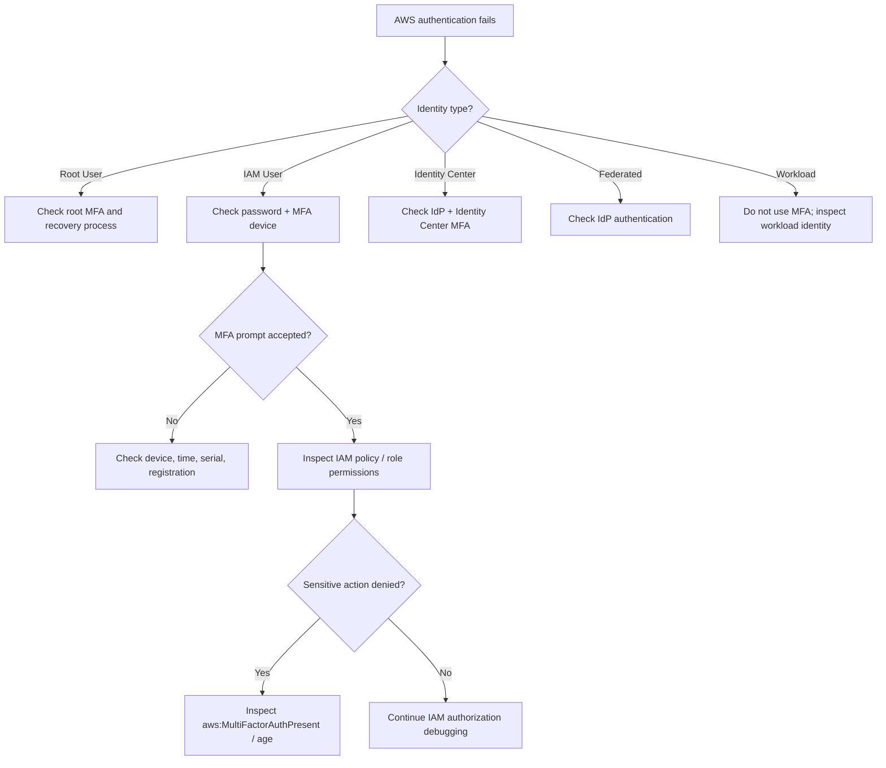

# 01- MFA

## Overview

Multi-factor authentication (MFA) adds an additional authentication factor to AWS identity access. Instead of relying only on a password or long-term credential, the user must also prove possession of an authenticator or another supported factor.

The core model is:

```text
Primary Credential
    +
MFA Factor
    ↓
Authenticated Session
    ↓
AWS Authorization
    ↓
AWS Resources
```

AWS recommends phishing-resistant MFA, such as passkeys and security keys, wherever possible. AWS also recommends MFA for IAM users when IAM users are required and for AWS account root users. ([AWS IAM security best practices](https://docs.aws.amazon.com/IAM/latest/UserGuide/best-practices.html), [AWS MFA in IAM](https://docs.aws.amazon.com/IAM/latest/UserGuide/id_credentials_mfa.html))

MFA is an **authentication control**. It does not grant permissions by itself.

For example:

```text
MFA
    answers:
    "Did the user authenticate with the required second factor?"

IAM Policy
    answers:
    "What is the authenticated principal allowed to do?"
```

This distinction is important when designing and troubleshooting production IAM.

---

## Why MFA Matters

A password or long-lived credential is a single authentication factor.

If an attacker obtains it:

```text
Compromised Password
        ↓
Sign In
        ↓
AWS Access
```

With MFA:

```text
Compromised Password
        ↓
Attacker
        ↓
MFA Challenge
        ↓
Cannot authenticate without second factor
```

MFA therefore reduces the impact of:

- Password theft
- Credential stuffing
- Phishing of passwords
- Reused credentials
- Certain account takeover scenarios

MFA does not protect against every attack. An attacker may still compromise a session, steal temporary credentials, compromise an authenticator, or exploit an already-authorized workload.

MFA should therefore be treated as one layer in a broader IAM security architecture.

---

## Authentication Factors

AWS supports several MFA mechanisms.

### Knowledge Factor

Something the user knows:

```text
Password
PIN
```

### Possession Factor

Something the user has:

```text
Security key
Authenticator device
Hardware TOTP token
```

### Inherence Factor

Something the user is:

```text
Fingerprint
Face recognition
```

With passkeys, biometric verification typically unlocks a credential managed by the device or credential manager; the biometric itself is not sent to AWS as the authentication secret.

The security principle is:

```text
Multiple independent factors
        ↓
Stronger authentication
```

---

## AWS MFA Device Types

Current AWS documentation supports these MFA categories for root users and IAM users:

| MFA type | Technology | Phishing resistance | Typical use |
|---|---|---:|---|
| Passkey / security key | FIDO | Strong | Preferred |
| Virtual MFA | TOTP | Lower than FIDO | Common fallback |
| Hardware TOTP | Time-based OTP | Lower than FIDO | Dedicated hardware environments |

AWS recommends passkeys and security keys because FIDO-based authentication is designed to resist phishing, man-in-the-middle, and replay attacks. ([AWS MFA for root user](https://docs.aws.amazon.com/IAM/latest/UserGuide/enable-mfa-for-root.html), [AWS MFA in IAM](https://docs.aws.amazon.com/IAM/latest/UserGuide/id_credentials_mfa.html))

---

## Passkeys and Security Keys

Passkeys and FIDO security keys use public-key cryptography.

Conceptually:

```text
AWS
    stores / verifies
    public key

Authenticator
    protects
    private key

Authentication
    ↓
Cryptographic challenge
    ↓
Private-key operation
    ↓
AWS verifies with public key
```

The private key is not shared with AWS.

This is fundamentally different from TOTP, where a shared secret is used to generate time-based one-time passwords.

AWS supports both:

```text
Device-bound passkeys
    Often implemented by a physical security key

Synced passkeys
    Stored through supported credential managers
```

AWS currently recommends passkeys or security keys wherever possible. ([AWS passkeys and security keys](https://docs.aws.amazon.com/IAM/latest/UserGuide/id_credentials_mfa_fido.html))

---

## Virtual MFA

A virtual MFA device is an authenticator application that generates six-digit TOTP codes.

The flow is:

```text
Password
    ↓
AWS MFA Prompt
    ↓
Authenticator App
    ↓
Six-Digit TOTP
    ↓
AWS Authentication
```

The TOTP code changes periodically based on the device's shared secret and current time.

Virtual MFA is practical for:

- Development accounts
- Small teams
- Temporary environments
- Environments where hardware approval is pending

AWS recommends phishing-resistant FIDO methods first, with virtual MFA as an alternative when appropriate. ([AWS virtual MFA](https://docs.aws.amazon.com/IAM/latest/UserGuide/id_credentials_mfa_enable_virtual.html))

---

## Hardware TOTP

A hardware TOTP device generates time-based one-time passwords without relying on a phone application.

The model is:

```text
Hardware Token
    ↓
Current Time
    ↓
TOTP Algorithm
    ↓
Six-Digit Code
```

This can be useful where:

```text
Mobile devices are restricted
Shared administrative procedures require dedicated hardware
Enterprise policy requires hardware authenticators
```

AWS recommends FIDO security keys over hardware TOTP where possible because of stronger phishing resistance. ([AWS MFA for root user](https://docs.aws.amazon.com/IAM/latest/UserGuide/enable-mfa-for-root.html))

---

## MFA for the AWS Account Root User

The root user is the identity created when an AWS account is created.

It has extremely broad privileges and should be used only for tasks that specifically require root credentials.

AWS currently requires MFA to be configured for the root user of standalone, management, and member accounts. New root-user sign-in flows have a grace period for MFA registration, after which MFA is required for console access. ([AWS root user MFA](https://docs.aws.amazon.com/IAM/latest/UserGuide/enable-mfa-for-root.html))

The recommended architecture is:

```text
Root User
    ↓
MFA
    ↓
Very limited emergency / root-only operations
```

Normal engineering work should use:

```text
IAM Identity Center
or
Appropriate IAM Role
```

rather than the root user.

---

## Root User Security

The root user should be treated as a break-glass identity.

Recommended controls include:

```text
Strong unique password
+
MFA
+
No root access keys
+
Restricted recovery process
+
Audit / monitoring
```

AWS recommends not creating root-user access keys. ([AWS root user best practices](https://docs.aws.amazon.com/IAM/latest/UserGuide/root-user-best-practices.html))

For multi-account AWS Organizations environments, AWS also provides a mechanism to centrally manage member-account root access and remove member-account root credentials. When root credentials are removed through that mechanism, the member account cannot be used to sign in as the root user or perform root password recovery. ([AWS root user best practices](https://docs.aws.amazon.com/IAM/latest/UserGuide/root-user-best-practices.html))

---

## Multiple MFA Devices

AWS currently allows up to **eight MFA devices** to be registered for an AWS account root user or an IAM user. ([AWS MFA in IAM](https://docs.aws.amazon.com/IAM/latest/UserGuide/id_credentials_mfa.html))

This is useful for resilience.

Example:

```text
Production Root
    ├── Primary FIDO Security Key
    ├── Backup FIDO Security Key
    └── Recovery / approved secondary factor
```

For privileged accounts, using more than one registered factor can reduce the risk of lockout if one device is lost or unavailable.

A backup device should itself be protected according to the organization's security policy.

---

## IAM User MFA

MFA can be configured for IAM users.

Example:

```text
IAM User
    ↓
Password
    +
MFA
    ↓
Console Session
```

However, AWS recommends IAM roles and federated identities for human users wherever possible.

The modern workforce pattern is generally:

```text
Corporate Identity Provider
        ↓
IAM Identity Center
        ↓
Temporary AWS Session
        ↓
AWS Accounts
```

rather than:

```text
Employee
    ↓
IAM User
    ↓
Permanent Access Key
```

AWS recommends federation for human access and temporary credentials for workloads. ([AWS IAM security best practices](https://docs.aws.amazon.com/IAM/latest/UserGuide/best-practices.html))

---

## MFA for IAM Users vs IAM Identity Center

These are different identity architectures.

### IAM User

```text
IAM User
    ↓
Password
    +
MFA
    ↓
AWS Console
```

### IAM Identity Center

```text
Corporate Identity
    ↓
Identity Provider
    ↓
IAM Identity Center
    ↓
MFA
    ↓
Temporary AWS Session
```

Identity Center is generally the preferred model for workforce access across multiple AWS accounts because it centralizes identity and permission assignment.

The exact MFA behavior depends on the Identity Center identity source and configuration. AWS provides built-in MFA capabilities for supported identity sources and recommends MFA as part of centralized workforce access. ([AWS IAM Identity Center MFA](https://docs.aws.amazon.com/singlesignon/latest/userguide/enable-mfa.html))

---

## MFA and Temporary Credentials

MFA can be combined with temporary credentials.

For example:

```text
IAM User
    ↓
MFA
    ↓
GetSessionToken
    ↓
Temporary Credentials
    ↓
AWS API
```

This is a legacy or specialized pattern for IAM-user-based programmatic access.

For modern workforce access, prefer federation and role sessions where possible.

Temporary credentials reduce credential lifetime, while MFA strengthens authentication.

These controls solve different problems:

```text
MFA
    Authentication strength

Temporary credentials
    Credential lifetime
```

---

## `aws:MultiFactorAuthPresent`

AWS exposes the global condition key:

```text
aws:MultiFactorAuthPresent
```

It can be used in IAM policies to require or restrict actions based on MFA authentication context.

Example:

```json
{
    "Version": "2012-10-17",
    "Statement": [
        {
            "Sid": "DenySensitiveActionsWithoutMFA",
            "Effect": "Deny",
            "Action": [
                "ec2:StopInstances",
                "ec2:TerminateInstances"
            ],
            "Resource": "*",
            "Condition": {
                "BoolIfExists": {
                    "aws:MultiFactorAuthPresent": "false"
                }
            }
        }
    ]
}
```

The use of `BoolIfExists` is important.

AWS documents that `aws:MultiFactorAuthPresent` may be absent from the request context for long-term access-key requests. Using `Bool` alone in this type of deny statement can therefore produce unintended behavior. AWS recommends `BoolIfExists` when the policy is intended to deny requests that do not have MFA authentication context. ([AWS global condition keys](https://docs.aws.amazon.com/IAM/latest/UserGuide/reference_policies_condition-keys.html), [AWS MFA policy example](https://docs.aws.amazon.com/IAM/latest/UserGuide/reference_policies_examples_ec2_require-mfa.html))

---

## `aws:MultiFactorAuthAge`

AWS also provides:

```text
aws:MultiFactorAuthAge
```

This represents the age of the MFA authentication context in seconds.

For example:

```json
{
    "Effect": "Allow",
    "Action": [
        "iam:DeactivateMFADevice"
    ],
    "Resource": "arn:aws:iam::*:user/${aws:username}",
    "Condition": {
        "NumericLessThanEquals": {
            "aws:MultiFactorAuthAge": "3600"
        }
    }
}
```

This pattern means the action is allowed only when the MFA authentication occurred within the preceding hour.

AWS documents `aws:MultiFactorAuthAge` for controlling the freshness of MFA authentication. ([AWS IAM condition context keys](https://docs.aws.amazon.com/IAM/latest/UserGuide/reference_policies_condition.html))

---

## MFA Requirement vs MFA Authentication Context

These concepts should not be confused:

```text
MFA configured
    ≠
MFA used for this request
```

An IAM user can have an MFA device registered but still make an API request with long-term access keys.

Therefore, policies that require MFA for specific actions should examine the **request context**, not merely whether an MFA device exists.

The important distinction is:

```text
MFA device registration
    Account / identity configuration

MFA authentication context
    Current request/session
```

---

## MFA and Console Sign-In

For console access, MFA is part of the interactive authentication flow.

Conceptually:

```text
Username
    ↓
Password
    ↓
MFA Challenge
    ↓
Authenticated Console Session
```

AWS's console generates temporary credentials behind the scenes for many subsequent service operations.

This means that application code should not try to reproduce the browser's MFA process.

MFA belongs at the identity boundary, not inside Django/FastAPI business logic.

---

## MFA and AWS CLI

For IAM-user workflows that require MFA, a common pattern is:

```text
Long-Term IAM User Credentials
        +
MFA
        ↓
STS GetSessionToken
        ↓
Temporary CLI Session
```

Example:

```bash
aws sts get-session-token \
    --serial-number arn:aws:iam::123456789012:mfa/alice \
    --token-code 123456
```

The resulting credentials can then be used for programmatic AWS API calls.

AWS documents `GetSessionToken` as a mechanism commonly used when an IAM user must authenticate with MFA. ([AWS GetSessionToken and MFA](https://docs.aws.amazon.com/IAM/latest/UserGuide/id_credentials_temp_control-access_getsessiontoken.html))

---

## MFA With `AssumeRole`

MFA can also be required when an IAM user assumes a role.

The architecture is:

```text
IAM User
    ↓
MFA
    ↓
AssumeRole
    ↓
Temporary Role Session
    ↓
AWS APIs
```

The target role trust policy can require:

```text
aws:MultiFactorAuthPresent = true
```

A conceptual trust policy is:

```json
{
    "Version": "2012-10-17",
    "Statement": [
        {
            "Sid": "RequireMFAForPrivilegedRole",
            "Effect": "Allow",
            "Principal": {
                "AWS": "arn:aws:iam::123456789012:root"
            },
            "Action": "sts:AssumeRole",
            "Condition": {
                "Bool": {
                    "aws:MultiFactorAuthPresent": "true"
                }
            }
        }
    ]
}
```

AWS documents this pattern for restricting role assumption to sessions authenticated with MFA. ([AWS role creation with MFA](https://docs.aws.amazon.com/IAM/latest/UserGuide/id_roles_create_for-user.html))

The trust policy should still be narrowly scoped to the intended principal.

---

## MFA With `AssumeRole` CLI

When assuming a role with MFA, the CLI can supply the MFA device and code:

```bash
aws sts assume-role \
    --role-arn arn:aws:iam::222233334444:role/ProductionOperatorRole \
    --role-session-name production-operator \
    --serial-number arn:aws:iam::111122223333:mfa/alice \
    --token-code 123456
```

The resulting session carries MFA authentication context that can be evaluated by applicable policies.

This is useful for privileged human access.

For automated workloads, MFA is generally not a replacement for workload identity.

---

## MFA and Role Chaining

MFA becomes more subtle when roles are chained.

Consider:

```text
IAM User
    ↓ MFA
Role A
    ↓
Role B
```

The role session's MFA context must be understood when role B's trust policy or permissions depend on MFA.

If an architecture requires MFA to remain part of the authorization chain, model it explicitly and test the complete session flow.

Do not assume:

```text
User used MFA once
    =
Every subsequent role session automatically satisfies every MFA condition
```

Role chaining and session context should be tested rather than inferred.

---

## MFA With Cross-Account Access

A privileged cross-account architecture can require MFA:

```text
Account A
    IAM User / Federated Human
          ↓
        MFA
          ↓
      AssumeRole
          ↓
Account B
    ProductionOperatorRole
          ↓
    Production Resources
```

The target role trust policy can enforce the MFA condition.

This creates two layers:

```text
Cross-account trust
+
MFA authentication context
```

For workforce environments using IAM Identity Center, centralized identity and MFA are generally preferable to maintaining individual IAM users for every employee.

---

## MFA for Privileged Operations

Not every action necessarily needs an MFA gate if the user already accesses AWS through a strong centralized identity architecture.

A useful pattern for legacy IAM-user environments is to require MFA for especially sensitive actions:

```text
Terminate EC2
Delete production resources
Change security settings
Modify IAM credentials
Disable logging
Change network controls
```

Example:

```text
Normal read operation
    ↓
No additional MFA requirement

Privileged destructive operation
    ↓
Recent MFA authentication required
```

This can reduce friction while adding stronger authentication for high-impact operations.

---

## MFA Policy Design

A production policy should clearly define:

```text
Who requires MFA?
Which actions require MFA?
How fresh must the MFA authentication be?
What happens for programmatic access?
Which actions are exempt for recovery?
```

Avoid a policy that simply says:

```text
MFA everywhere
```

without understanding the authentication mechanisms used by the identity.

For example:

```text
IAM user with access keys
```

and:

```text
Federated user using Identity Center
```

have different credential and session behavior.

---

## MFA Policy Example: Protect Sensitive Actions

A narrow deny is often easier to reason about.

```json
{
    "Version": "2012-10-17",
    "Statement": [
        {
            "Sid": "DenyHighRiskOperationsWithoutMFA",
            "Effect": "Deny",
            "Action": [
                "ec2:TerminateInstances",
                "rds:DeleteDBInstance",
                "s3:DeleteBucket"
            ],
            "Resource": "*",
            "Condition": {
                "BoolIfExists": {
                    "aws:MultiFactorAuthPresent": "false"
                }
            }
        }
    ]
}
```

The actual resource scope should be narrowed wherever practical.

The `Deny` statement provides a clear guardrail:

```text
No MFA
    ↓
Sensitive operation denied
```

However, the correct implementation depends on the organization's identity model.

---

## MFA and Explicit Deny

Remember:

```text
Explicit Deny
    overrides
Allow
```

Example:

```text
Identity Policy
    Allow ec2:TerminateInstances

MFA Guardrail
    Deny when MFA is absent

Result
    Denied without MFA
```

This makes MFA-based conditions useful as authorization guardrails for selected operations.

---

## MFA and Least Privilege

MFA is not a substitute for least privilege.

Bad:

```text
AdministratorAccess
+
MFA
```

Better:

```text
Least-PrivilegeRole
+
MFA where required
```

MFA reduces the probability that a compromised password is enough to authenticate.

Least privilege reduces what the authenticated identity can do.

The controls protect against different failure modes:

```text
MFA
    Authentication strength

Least privilege
    Authorization scope
```

---

## Phishing-Resistant MFA

FIDO-based methods are designed to resist phishing because authentication is bound to the registered origin.

Conceptually:

```text
Phishing Site
    ↓
Cannot normally use
credential registered for
different legitimate origin
```

By contrast, a TOTP code can potentially be captured by a real-time phishing proxy.

Therefore:

```text
FIDO passkey / security key
        >
TOTP
```

in terms of phishing resistance.

AWS currently recommends passkeys and security keys wherever possible. ([AWS MFA in IAM](https://docs.aws.amazon.com/IAM/latest/UserGuide/id_credentials_mfa.html))

---

## Passkeys vs Security Keys

Both are FIDO-based, but their storage model differs.

| Type | Description | Typical use |
|---|---|---|
| Device-bound passkey | Credential bound to a hardware/device authenticator | High-security workstation or security key |
| Synced passkey | Credential synchronized by a supported credential manager | Workforce convenience and recoverability |
| Physical security key | Dedicated FIDO hardware such as a security key | Privileged / break-glass access |

AWS currently supports both device-bound and synced passkeys for supported configurations. ([AWS passkeys and security keys](https://docs.aws.amazon.com/IAM/latest/UserGuide/id_credentials_mfa_fido.html))

For highly privileged identities, organizations may prefer dedicated hardware security keys because the private key remains isolated from ordinary workstation credential stores.

---

## Hardware Security Keys for Root

A production organization can register multiple FIDO security keys for the root user.

Example:

```text
Root Account
    ├── Primary Security Key
    └── Backup Security Key
```

An operational procedure can require:

```text
Password custodian
        +
MFA-key custodian
        ↓
Root sign-in
```

AWS explicitly recommends considering multi-person approval for root access. ([AWS root user best practices](https://docs.aws.amazon.com/IAM/latest/UserGuide/root-user-best-practices.html))

This is especially relevant for production organizations where root access is intentionally rare.

---

## MFA Recovery

MFA introduces an availability concern:

```text
Strong MFA
    +
Lost device
    ↓
Potential account lockout
```

Therefore, production MFA design must include:

```text
Backup device
+
Recovery process
+
Ownership model
+
Audit trail
```

For root-user MFA, AWS provides account-recovery mechanisms involving verification of registered account information if the MFA device is lost or unavailable. ([AWS root MFA](https://docs.aws.amazon.com/IAM/latest/UserGuide/enable-mfa-for-root.html))

Recovery procedures should be documented before an emergency occurs.

---

## MFA and Multiple Administrators

Avoid making a single person the only holder of:

```text
Root password
+
Root MFA
+
Recovery email
```

A resilient organization can separate responsibilities.

Example:

```text
Security Administrator
    → Controls MFA device

Account Administrator
    → Controls recovery process

Break-glass Procedure
    → Requires approved multi-person access
```

The precise process depends on organizational governance requirements.

---

## MFA and Human Identity Architecture

For modern AWS environments:

```text
Employee
    ↓
Corporate IdP
    ↓
IAM Identity Center
    ↓
MFA
    ↓
Permission Set
    ↓
Temporary AWS Session
```

This is generally preferable to:

```text
Employee
    ↓
IAM User
    ↓
Password + MFA
    ↓
Permanent AWS identity
```

AWS recommends federating human users through an identity provider and using temporary credentials. ([AWS IAM security best practices](https://docs.aws.amazon.com/IAM/latest/UserGuide/best-practices.html))

---

## MFA and Workload Identity

MFA is usually designed for interactive human authentication.

Do not attempt to build:

```text
ECS Task
    ↓
MFA Code
    ↓
STS
```

or:

```text
Kubernetes Pod
    ↓
Virtual MFA Device
```

This introduces unnecessary secret-management and operational complexity.

Use workload identity instead:

```text
ECS
    ↓
Task Role

EKS
    ↓
Pod Identity / IRSA

EC2
    ↓
Instance Role

Lambda
    ↓
Execution Role

CI/CD
    ↓
OIDC
```

AWS recommends temporary credentials with IAM roles for workloads. ([AWS IAM security best practices](https://docs.aws.amazon.com/IAM/latest/UserGuide/best-practices.html))

---

## MFA and CI/CD

CI/CD systems should generally use OIDC federation rather than MFA codes.

Preferred:

```text
GitHub Actions
    ↓
OIDC
    ↓
AWS STS
    ↓
Deployment Role
    ↓
Temporary Credentials
```

Avoid:

```text
GitHub Actions
    ↓
IAM User Password
    +
MFA Secret
    ↓
AWS
```

The latter creates difficult-to-secure automation credentials.

OIDC is designed for machine identity and provides a more appropriate trust model.

---

## MFA and Backend Applications

Django and FastAPI applications should generally not know whether a human operator used MFA.

Example:

```text
Django
    ↓
AWS SDK
    ↓
ECS Task Role
    ↓
S3
```

MFA belongs to the authentication layer for human identities.

Application authorization should remain separate:

```text
End User
    ↓
Application Authentication
    ↓
Django / FastAPI Authorization
```

and:

```text
Django / FastAPI
    ↓
AWS IAM Workload Identity
```

This avoids coupling application business logic to AWS administrator authentication.

---

## MFA and Privileged Developer Access

A developer who needs temporary production access can use:

```text
Corporate IdP
    ↓
MFA
    ↓
IAM Identity Center
    ↓
Production Permission Set
    ↓
Temporary AWS Session
```

This is generally safer than giving the developer:

```text
Production IAM User
+
Long-lived access key
```

A privileged permission set or role can then restrict access to approved production operations.

---

## MFA and Emergency Access

A production environment should have a documented break-glass model.

Example:

```text
Normal Access
    ↓
IAM Identity Center
    +
MFA
    +
Standard Permission Set

Emergency Access
    ↓
Break-Glass Role / Account
    +
Strong MFA
    +
Additional approval
    +
Audit
```

The emergency identity should not become the normal operational path.

---

## MFA CLI Administration

### List MFA Devices for an IAM User

```bash
aws iam list-mfa-devices \
    --user-name <username>
```

### List Unassigned Virtual MFA Devices

```bash
aws iam list-virtual-mfa-devices \
    --assignment-status Unassigned
```

### Create a Virtual MFA Device

```bash
aws iam create-virtual-mfa-device \
    --virtual-mfa-device-name <device-name> \
    --outfile <seed-file>
```

The exact CLI output and enrollment flow depend on the MFA method and command options.

### Enable MFA for an IAM User

For a virtual TOTP device:

```bash
aws iam enable-mfa-device \
    --user-name <username> \
    --serial-number arn:aws:iam::<account-id>:mfa/<device-name> \
    --authentication-code1 123456 \
    --authentication-code2 789012
```

The two codes must be valid sequential TOTP values.

---

## MFA Device Rotation

When replacing an authenticator:

```text
Existing MFA
    ↓
Register new MFA
    ↓
Verify new MFA
    ↓
Remove old MFA
```

Do not remove the old device first unless a recovery procedure is already available.

For highly privileged accounts:

```text
Register replacement
    ↓
Verify replacement works
    ↓
Retire old device
```

This reduces accidental lockout.

---

## MFA Resynchronization

TOTP devices depend on time synchronization.

Symptoms of drift can include:

```text
Correct-looking code
    +
AWS rejects code
```

AWS provides:

```text
iam:ResyncMFADevice
```

for supported IAM-user MFA recovery scenarios.

Use resynchronization only when appropriate and follow the AWS enrollment procedure.

If repeated codes fail, verify:

```text
Device time
Authenticator setup
Correct MFA serial
Correct user
```

before modifying IAM policies.

---

## MFA and Credential Rotation

MFA does not replace credential lifecycle management.

You still need:

```text
Access key lifecycle
Password lifecycle
Role lifecycle
Session lifecycle
MFA device lifecycle
```

For long-lived credentials that cannot be eliminated:

```text
Rotate access keys
+
MFA where appropriate
+
Least privilege
+
Monitoring
```

For modern workloads:

```text
Replace long-lived keys
        with
Temporary role credentials
```

whenever possible.

---

## MFA Operational Inventory

Track privileged identities and MFA status.

Useful inventory fields:

| Attribute | Example |
|---|---|
| Identity | Production Admin |
| Identity type | Identity Center / IAM user |
| MFA enabled | Yes |
| MFA type | FIDO security key |
| Backup device | Yes |
| Last access review | 2026-09-01 |
| Privilege level | Production admin |
| Recovery owner | Security Team |

AWS Config, Security Hub CSPM, and Trusted Advisor can help evaluate certain root-user MFA and related security controls. ([AWS root user best practices](https://docs.aws.amazon.com/IAM/latest/UserGuide/root-user-best-practices.html))

---

## MFA Monitoring

MFA should be monitored as part of the identity security program.

Relevant signals include:

```text
MFA configuration changes
MFA device replacement
Root-user activity
Privileged role assumption
Console sign-in
Failed authentication
Unexpected account recovery
```

CloudTrail provides audit events for many IAM and AWS management operations.

The objective is not simply:

```text
MFA = Enabled
```

but:

```text
MFA configuration
+
MFA usage
+
Privileged access monitoring
+
Recovery governance
```

---

## Security Hub and AWS Config

Security posture tools can help identify accounts or identities that do not satisfy security requirements.

Common uses include monitoring:

```text
Root MFA
IAM credential configuration
Access keys
Identity security posture
```

AWS documents AWS Config and Security Hub CSPM as mechanisms that can help evaluate root-user MFA and related IAM controls. ([AWS root user best practices](https://docs.aws.amazon.com/IAM/latest/UserGuide/root-user-best-practices.html))

These tools should complement, not replace, direct IAM governance.

---

## Common Mistakes

| Mistake | Why it happens | Better approach |
|---|---|---|
| Treating MFA as authorization | MFA feels like a permission control | Separate authentication from authorization |
| Using TOTP when FIDO is available | Authenticator apps are familiar | Prefer passkeys/security keys where practical |
| Enabling MFA but keeping root access keys | MFA is mistaken for complete root protection | Remove root access keys |
| Using MFA codes in CI/CD | Trying to automate a human authentication pattern | Use OIDC federation |
| Requiring MFA from workloads | Applying human controls to machines | Use IAM workload roles |
| Using `Bool` instead of `BoolIfExists` incorrectly | Misunderstanding missing context keys | Follow AWS documented MFA condition patterns |
| Requiring MFA globally without testing | Policy impacts unexpected clients | Scope MFA requirements carefully |
| Removing old MFA before registering the replacement | Poor device-rotation procedure | Register and validate replacement first |
| Keeping only one admin MFA device | No recovery redundancy | Register approved backup devices |
| Treating MFA registration as proof of MFA use | Confusing configuration and request context | Evaluate `aws:MultiFactorAuthPresent` where appropriate |
| Using shared MFA devices without governance | Several people need one account | Prefer named federated identities and centralized access |
| Putting MFA implementation into Django/FastAPI | Mixing application and AWS authentication | Keep MFA at the identity layer |

---

## MFA Troubleshooting

A useful diagnostic flow is:



---

## Troubleshooting MFA Policy Conditions

If a policy requires MFA and the request is unexpectedly denied, inspect:

```text
Identity type
Credential type
MFA authentication context
Condition operator
Action
Resource
Explicit denies
```

A common production mistake is assuming this always works:

```json
{
    "Condition": {
        "Bool": {
            "aws:MultiFactorAuthPresent": "false"
        }
    }
}
```

AWS explicitly warns that the condition key may be absent for long-term credentials and documents `BoolIfExists` for deny policies intended to reject requests that lack MFA context. ([AWS global condition keys](https://docs.aws.amazon.com/IAM/latest/UserGuide/reference_policies_condition-keys.html))

---

## Troubleshooting TOTP Failures

Check:

```text
Correct IAM identity
Correct MFA device
Correct serial number
Current device time
Correct authentication code
Device registration state
```

For virtual MFA:

```text
Phone / authenticator
    ↓
Verify time synchronization
    ↓
Generate current TOTP
    ↓
Retry
```

If the device remains out of sync, use the supported MFA resynchronization procedure.

---

## Troubleshooting Root MFA

When root MFA is unavailable:

```text
Do not repeatedly attempt random MFA changes.
```

Use the AWS root-user recovery process and verify that:

```text
Account email
Contact information
Recovery mechanisms
```

are current.

For production organizations, root recovery should be documented before it is needed.

AWS recommends securing root recovery mechanisms and using controlled access procedures for root credentials. ([AWS root user best practices](https://docs.aws.amazon.com/IAM/latest/UserGuide/root-user-best-practices.html))

---

## MFA and Reliability

Security controls can create availability risks if poorly operated.

The most important reliability problem with MFA is:

```text
Only authenticator
        ↓
Authenticator lost
        ↓
Identity unavailable
```

Mitigate this with:

```text
Multiple registered authenticators
+
Documented recovery
+
Break-glass procedures
+
Multiple authorized administrators
```

For root accounts, AWS supports multiple MFA devices specifically to improve resilience. ([AWS MFA in IAM](https://docs.aws.amazon.com/IAM/latest/UserGuide/id_credentials_mfa.html))

---

## MFA and Disaster Recovery

MFA should be included in disaster-recovery planning.

Consider:

```text
Primary authenticator lost
Backup authenticator unavailable
Administrator unavailable
Corporate IdP outage
Identity Center outage
AWS account recovery required
```

Document:

```text
Who owns the recovery process?
Where are backup devices stored?
Who can authorize emergency access?
How is recovery audited?
```

A recovery mechanism should not depend on the same identity or infrastructure that has already failed.

---

## MFA and Multi-Account AWS

A multi-account architecture should centrally manage human identity:

```text
Corporate IdP
      ↓
IAM Identity Center
      ↓
MFA
      ↓
Permission Sets
      ↓
AWS Organizations Accounts
```

For example:

```text
Developer
    ↓
MFA
    ↓
Developer Permission Set
    ├── Development
    └── Staging

Production Operator
    ↓
MFA
    ↓
Production Permission Set
```

This is usually more maintainable than creating IAM users and manually configured MFA devices in every account.

---

## MFA and Break-Glass Access

A production break-glass account or role should have:

```text
Strong authentication
+
FIDO MFA where possible
+
Limited authorized operators
+
Additional approval
+
Continuous audit
```

Break-glass access should be:

```text
Rare
Controlled
Audited
Tested
```

Do not make the break-glass path the normal development workflow.

---

## MFA and Privileged Role Assumption

For especially sensitive roles:

```text
Workforce Identity
    ↓
MFA
    ↓
AssumeRole
    ↓
Privileged Role
    ↓
Production
```

The target role can use:

```text
aws:MultiFactorAuthPresent
```

to ensure the role is not assumed without MFA context.

This is useful for:

```text
Production administration
Security operations
Incident response
IAM administration
Account recovery
```

---

## MFA and Session Freshness

MFA authentication can be made time-sensitive using:

```text
aws:MultiFactorAuthAge
```

For example:

```text
MFA within 15 minutes
    ↓
Allow destructive production action
```

This provides a stronger requirement than simply:

```text
MFA was used at some point
```

For highly sensitive operations, recent authentication context can reduce the risk of relying on an old authentication event.

---

## Senior-Level Mental Model

Treat MFA as one layer in a multi-layer identity architecture:

```text
Authentication
    |
    +-- Password
    +-- Passkey / Security Key
    +-- TOTP
    +-- Federated Identity

Session
    |
    +-- Temporary Credentials
    +-- MFA Context
    +-- Session Duration
    +-- Session Tags

Authorization
    |
    +-- Identity Policies
    +-- Resource Policies
    +-- Permissions Boundaries
    +-- Session Policies
    +-- SCPs
    +-- Conditions

Resource
    |
    +-- AWS Service
    +-- Resource Policy
    +-- KMS
    +-- Network Controls
```

A secure system does not rely on MFA alone.

It combines:

```text
Strong authentication
+
Temporary credentials
+
Least privilege
+
Explicit trust
+
Authorization guardrails
+
Auditability
```

---

## Interview Perspective

### What Is MFA?

MFA requires more than one authentication factor to establish identity.

### Is MFA an Authorization Mechanism?

No.

```text
MFA
    Authentication control

IAM policy
    Authorization control
```

### Which MFA Method Does AWS Recommend?

AWS recommends phishing-resistant passkeys and security keys wherever possible. ([AWS MFA in IAM](https://docs.aws.amazon.com/IAM/latest/UserGuide/id_credentials_mfa.html))

### What Is `aws:MultiFactorAuthPresent`?

A global IAM condition context key that can indicate whether MFA authentication context is present for a request. ([AWS global condition keys](https://docs.aws.amazon.com/IAM/latest/UserGuide/reference_policies_condition-keys.html))

### Why Use `BoolIfExists`?

Because the MFA condition key may be absent for some requests, including requests using long-term access keys. AWS documents `BoolIfExists` for denying requests that do not have MFA authentication context. ([AWS global condition keys](https://docs.aws.amazon.com/IAM/latest/UserGuide/reference_policies_condition-keys.html))

### What Is `aws:MultiFactorAuthAge`?

It represents how long ago MFA authentication occurred and can be used to require recent MFA authentication for sensitive operations. ([AWS IAM condition keys](https://docs.aws.amazon.com/IAM/latest/UserGuide/reference_policies_condition.html))

### Can Workloads Use MFA?

Generally, no.

Use:

```text
IAM roles
ECS task roles
EC2 instance roles
Lambda execution roles
EKS Pod Identity / IRSA
OIDC for CI/CD
```

instead.

### How Can MFA Be Required for AssumeRole?

The target role trust policy can require:

```json
{
    "Bool": {
        "aws:MultiFactorAuthPresent": "true"
    }
}
```

and the caller must provide the appropriate MFA authentication context when assuming the role. ([AWS role creation with MFA](https://docs.aws.amazon.com/IAM/latest/UserGuide/id_roles_create_for-user.html))

### Is an IAM User With MFA Equivalent to IAM Identity Center?

No.

MFA on an IAM user protects that IAM identity. IAM Identity Center provides centralized workforce identity and account access management.

### Can Root User MFA Be Disabled?

AWS currently requires MFA to be configured for root users. In AWS Organizations, an organization can centrally manage member-account root access and remove member-account root credentials, including MFA, when that feature is used. ([AWS root user MFA](https://docs.aws.amazon.com/IAM/latest/UserGuide/enable-mfa-for-root.html))

### What Is the Strongest Practical MFA Pattern?

For privileged identities:

```text
Federated workforce identity
+
Phishing-resistant FIDO MFA
+
Temporary AWS session
+
Least-privilege permissions
```

---

## Production Checklist

Before approving an MFA design, verify:

```text
Root
    □ Root MFA is configured
    □ Root access keys do not exist
    □ Root recovery is documented
    □ Backup MFA devices are available
    □ Root access is treated as break-glass

Workforce
    □ Human users use federation / Identity Center where possible
    □ MFA is enabled for privileged access
    □ Phishing-resistant MFA is preferred
    □ Permission sets / roles follow least privilege

IAM Users
    □ IAM users exist only where justified
    □ MFA is enabled for required IAM users
    □ Access keys are minimized
    □ MFA-specific IAM policies are tested

Role Assumption
    □ Sensitive roles can require MFA
    □ Trust policies are narrow
    □ Cross-account MFA requirements are tested
    □ MFA session context is understood

Policies
    □ aws:MultiFactorAuthPresent is used correctly
    □ BoolIfExists is understood
    □ MFA age requirements are appropriate
    □ Explicit denies are tested

Workloads
    □ Applications do not use MFA codes
    □ Workloads use IAM roles
    □ CI/CD uses OIDC where possible
    □ Temporary credentials are preferred

Operations
    □ MFA device lifecycle is documented
    □ Backup devices exist for critical identities
    □ Recovery procedures are tested
    □ MFA configuration changes are audited
    □ CloudTrail / security monitoring covers privileged access
```

## AWS Documentation Links

- [AWS Multi-factor authentication in IAM](https://docs.aws.amazon.com/IAM/latest/UserGuide/id_credentials_mfa.html)
- [AWS security best practices in IAM](https://docs.aws.amazon.com/IAM/latest/UserGuide/best-practices.html)
- [AWS account root user MFA](https://docs.aws.amazon.com/IAM/latest/UserGuide/enable-mfa-for-root.html)
- [AWS root user best practices](https://docs.aws.amazon.com/IAM/latest/UserGuide/root-user-best-practices.html)
- [AWS passkeys and security keys](https://docs.aws.amazon.com/IAM/latest/UserGuide/id_credentials_mfa_fido.html)
- [AWS supported FIDO configurations](https://docs.aws.amazon.com/IAM/latest/UserGuide/id_credentials_mfa_fido_supported_configurations.html)
- [AWS virtual MFA devices](https://docs.aws.amazon.com/IAM/latest/UserGuide/id_credentials_mfa_enable_virtual.html)
- [AWS global condition context keys](https://docs.aws.amazon.com/IAM/latest/UserGuide/reference_policies_condition-keys.html)
- [AWS IAM condition elements](https://docs.aws.amazon.com/IAM/latest/UserGuide/reference_policies_condition.html)
- [AWS IAM condition operators](https://docs.aws.amazon.com/IAM/latest/UserGuide/reference_policies_elements_condition_operators.html)
- [AWS MFA policy example](https://docs.aws.amazon.com/IAM/latest/UserGuide/reference_policies_examples_ec2_require-mfa.html)
- [AWS GetSessionToken with MFA](https://docs.aws.amazon.com/IAM/latest/UserGuide/id_credentials_temp_control-access_getsessiontoken.html)
- [AWS requesting credentials with MFA](https://docs.aws.amazon.com/IAM/latest/UserGuide/id_credentials_mfa_sample-code.html)
- [AWS role assumption with MFA](https://docs.aws.amazon.com/IAM/latest/UserGuide/id_roles_create_for-user.html)
- [AWS IAM Identity Center MFA](https://docs.aws.amazon.com/singlesignon/latest/userguide/enable-mfa.html)

## Key Takeaways

- **MFA strengthens authentication; it does not grant authorization.** IAM policies, roles, resource policies, boundaries, and SCPs still determine what an authenticated identity can do.
- **AWS recommends phishing-resistant passkeys and FIDO security keys wherever possible**, with virtual or hardware TOTP available for supported scenarios. ([AWS MFA in IAM](https://docs.aws.amazon.com/IAM/latest/UserGuide/id_credentials_mfa.html))
- **Use `aws:MultiFactorAuthPresent` and `aws:MultiFactorAuthAge` carefully**, especially when writing deny policies; AWS documents `BoolIfExists` as the safer pattern for denying requests that lack MFA context. ([AWS global condition keys](https://docs.aws.amazon.com/IAM/latest/UserGuide/reference_policies_condition-keys.html))
- **MFA is primarily a human-access control.** Modern workloads should use IAM roles, temporary credentials, workload identity, and OIDC rather than trying to automate MFA codes.
- **Production MFA requires resilience as well as security:** protect root access, use centralized workforce identity, maintain backup authenticators and recovery procedures, and audit privileged authentication events.