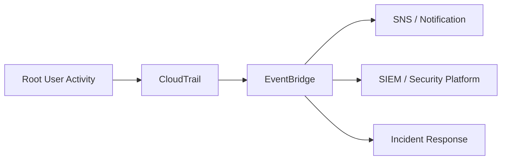
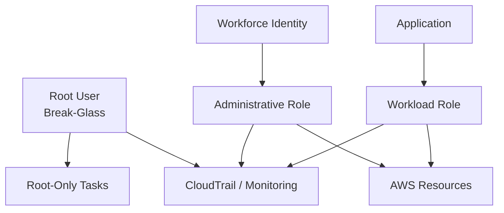
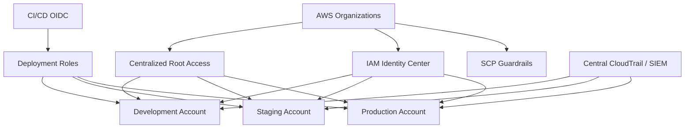

# 02- Root Account Best Practices

## Overview

The AWS account root user is the original identity created with an AWS account. It has unrestricted access to the account's AWS resources and is associated with the email address and password used to create the account. Because the root user has exceptionally broad authority, AWS recommends using it only for tasks that specifically require root credentials. :contentReference[oaicite:0]{index=0}

The production model should be:

```text
Root User
    ↓
Break-Glass / Root-Only Operations

Workforce Identity
    ↓
IAM Identity Center
    ↓
Temporary Role Session
    ↓
Daily AWS Administration

Workload Identity
    ↓
IAM Role
    ↓
Temporary Credentials
    ↓
AWS APIs
```

The root account should therefore be treated as a **break-glass identity**, not as the normal administrator account.

This distinction is important because granting a human `AdministratorAccess` does not make that identity equivalent to root. Some account-level operations are reserved for root credentials, while many everyday administrative operations should be performed through IAM roles or IAM Identity Center instead. AWS maintains a current list of tasks that require root credentials because the set can evolve over time. ([AWS root-user tasks](https://docs.aws.amazon.com/IAM/latest/UserGuide/id_root-user.html))

---

## Why the Root User Is High Risk

The root user has complete access to all AWS services and resources in the account, including billing-related information. Root credentials are therefore different from an ordinary administrator role.

A compromise can look like:

```text
Root Email
    +
Root Password
    +
MFA / Recovery Path
        ↓
Full Account Control
```

An ordinary workload role might instead be limited to:

```text
S3 read
+
SQS publish
+
CloudWatch logs
```

The security principle is:

```text
Maximum privilege
    +
Rare usage
    ↓
Strongest protection
```

AWS explicitly recommends protecting root credentials and using them only for tasks that require them. :contentReference[oaicite:1]{index=1}

---

## Root User vs Administrative Role

A common misconception is:

```text
AdministratorAccess role
    =
Root user
```

They are not equivalent.

| Capability | Root user | Administrator role |
|---|---|---|
| Access to all supported AWS resources | Unrestricted | Depends on policy |
| Uses IAM permission policies | No IAM policy restriction | Yes |
| Intended for daily operations | No | Yes |
| Can perform some root-only tasks | Yes | No |
| Can be federated | Not as a normal IAM identity | Yes |
| Temporary credentials | Not the normal model | Yes |
| Recommended for applications | No | No |
| Appropriate for break-glass | Yes | Sometimes |

Even an administrator role with broad permissions should remain the normal path for operations.

The root identity exists for the limited set of tasks where AWS specifically requires it.

---

## Root Account Security Model

A secure account should separate:

```text
Daily Administration
        ↓
IAM Identity Center / IAM Role
```

from:

```text
Root-Level Operations
        ↓
Root User
        ↓
MFA
        ↓
Break-Glass Procedure
```

And workload access should be separate again:

```text
Django / FastAPI / Celery / ECS / EKS
        ↓
IAM Workload Role
        ↓
Temporary Credentials
```

This separation prevents root credentials from becoming an application dependency.

---

## Initial Account Setup

When an AWS account is created, immediately establish a secure administrative path.

A typical sequence is:

```text
Create AWS Account
        ↓
Secure Root Password
        ↓
Configure Root MFA
        ↓
Remove / avoid Root Access Keys
        ↓
Configure Administrative Identity
        ↓
Configure IAM Identity Center where appropriate
        ↓
Create Least-Privilege Roles / Permission Sets
        ↓
Use Root Only for Root-Required Operations
```

AWS recommends creating an administrative identity for normal account administration and avoiding everyday use of the root user. :contentReference[oaicite:2]{index=2}

---

## Root User Password

The root password should be:

```text
Unique
Long
Random
Stored in an approved password manager
Not reused elsewhere
Not stored in source control
```

Do not use:

```text
CompanyName2026!
Password123
AWS@123
DeveloperName@Company
```

The password protects one of the highest-privilege identities in the environment.

AWS currently requires root-user passwords to satisfy specific length and character-composition rules. Rather than relying on static requirements in internal documentation, follow the current AWS account-management requirements when setting or changing the password. ([AWS root-user password](https://docs.aws.amazon.com/IAM/latest/UserGuide/root-user-password.html))

---

## Root User Password Storage

The root password should not be stored in the same system that depends on that password for access.

For example, this is a poor design:

```text
AWS Secrets Manager
    ↓
Root Password
```

when the same root credentials are required to access the Secrets Manager secret.

AWS explicitly recommends avoiding storage arrangements that depend on the same root credentials being protected and recommends prioritizing resilience and multi-person authorization for root credential storage. :contentReference[oaicite:3]{index=3}

A stronger model is:

```text
Enterprise Password Manager
        +
Restricted Root Credential Record
        +
Access Logging
        +
Multi-Person Approval
```

The exact implementation depends on organizational security requirements.

---

## Group Email for the Root User

Use a business-controlled email address for the root user rather than a personal employee mailbox.

Example:

```text
cloud-root@company.example
```

instead of:

```text
john.doe@company.example
```

The objective is continuity.

If the only person who controls the root mailbox:

```text
Leaves organization
    ↓
Root access recovery risk
```

A business-managed mailbox can route notifications to an approved group while keeping root identity ownership organizational.

AWS explicitly recommends using a group email address for root-user credentials in business environments. :contentReference[oaicite:4]{index=4}

---

## Separate Root Email From Normal Email

The root email address should ideally be dedicated to account ownership and recovery functions.

Do not reuse it for:

```text
Developer accounts
Marketing
Customer support
Application notifications
Personal services
```

This reduces the number of systems that can expose or compromise the root identity.

A useful model is:

```text
Root Email
    ↓
AWS Account Ownership

Workforce Email
    ↓
Corporate Identity Provider
    ↓
IAM Identity Center
```

---

## Root MFA

Root MFA is mandatory in current AWS account-security guidance.

AWS currently requires MFA to be configured for root users across standalone, management, and member accounts. AWS also recommends registering multiple MFA devices for resilience. Up to eight MFA devices can be associated with a root user. :contentReference[oaicite:5]{index=5}

Recommended pattern:

```text
Root Password
      +
Primary FIDO Security Key
      +
Backup FIDO Security Key
```

For high-security environments, physical FIDO security keys provide strong phishing resistance.

---

## Preferred MFA Methods

AWS supports multiple MFA mechanisms.

| Method | Typical security property | Root suitability |
|---|---|---|
| FIDO security key | Phishing-resistant | Strong choice |
| Passkey | Phishing-resistant | Strong choice |
| Virtual TOTP | One-time password | Useful fallback |
| Hardware TOTP | One-time password | Useful where required |

AWS recommends phishing-resistant passkeys and security keys wherever possible. :contentReference[oaicite:6]{index=6}

The security model should prioritize:

```text
Phishing resistance
+
Backup factor
+
Controlled ownership
+
Recovery procedure
```

---

## Multiple Root MFA Devices

Using only one MFA device creates an availability risk:

```text
Single Security Key
        ↓
Lost / damaged
        ↓
Root access unavailable
```

A more resilient model is:

```text
Root
 ├── Primary Security Key
 └── Backup Security Key
```

Keep the backup device protected and separately controlled.

AWS recommends multiple MFA devices for root-user flexibility and resilience. :contentReference[oaicite:7]{index=7}

---

## MFA Ownership

For highly privileged root credentials, separate custody can reduce the risk of one person unilaterally accessing the account.

Example:

```text
Person A
    Root Password

Person B
    Root MFA Device

Both
    ↓
Approved Root Access
```

AWS recommends considering multi-person approval for root-user sign-in where possible. :contentReference[oaicite:8]{index=8}

This is especially relevant for:

```text
Production AWS Organization
Regulated environments
High-value data
Financial systems
Security administration
```

---

## Root Access Keys

Do **not** create access keys for the root user unless there is an exceptional, documented reason.

A root access key looks like:

```text
AWS CLI / SDK
      ↓
Root Access Key
      ↓
Unrestricted AWS API access
```

If the key leaks:

```text
Credential Leak
    ↓
Attacker
    ↓
Programmatic Root Access
```

AWS strongly recommends not creating root-user access keys. :contentReference[oaicite:9]{index=9}

---

## Why Root Access Keys Are Particularly Dangerous

A normal workload role might have:

```json
{
    "Action": [
        "s3:GetObject"
    ],
    "Resource": "arn:aws:s3:::company-reports/*"
}
```

A root credential is not constrained by an equivalent customer-created IAM permission boundary.

Therefore:

```text
Root Access Key
    ≈
Programmatic Account Ownership
```

This is much more dangerous than a narrowly scoped application credential.

---

## Root Access Keys and Applications

Never configure:

```bash
AWS_ACCESS_KEY_ID=<root-key>
AWS_SECRET_ACCESS_KEY=<root-secret>
```

inside:

```text
Dockerfile
.env
GitHub Actions
Kubernetes Secret
Django settings
FastAPI configuration
Celery environment
EC2 user data
```

Applications should use workload identity:

```text
ECS → Task Role
EC2 → Instance Role
Lambda → Execution Role
EKS → Pod Identity / IRSA
CI/CD → OIDC
```

AWS recommends temporary credentials through roles for workloads. :contentReference[oaicite:10]{index=10}

---

## Root User and IAM Identity Center

For workforce administration, prefer:

```text
Corporate IdP
    ↓
IAM Identity Center
    ↓
Permission Set
    ↓
AWS Account
    ↓
Temporary Session
```

The root user should not become the daily login for:

```text
Developers
DevOps engineers
SREs
Platform engineers
Security analysts
Application teams
```

AWS recommends IAM Identity Center for managing workforce access across multiple AWS accounts. :contentReference[oaicite:11]{index=11}

---

## Root User and IAM Roles

For a standalone AWS account, IAM roles provide temporary sessions for administrators and other users.

Example:

```text
Engineer
    ↓
Federated Identity
    ↓
AdminRole
    ↓
Temporary Credentials
    ↓
AWS APIs
```

A role has no permanent password or access keys associated with the role itself.

This is fundamentally different from:

```text
IAM User
    ↓
Permanent Access Key
```

AWS recommends temporary credentials through roles instead of long-term IAM-user credentials wherever possible. :contentReference[oaicite:12]{index=12}

---

## Root User and Workloads

Root credentials should never be part of application architecture.

For example, a production FastAPI service should use:

```text
FastAPI
    ↓
ECS Task Role
    ↓
Temporary Credentials
    ↓
S3 / SQS / Secrets Manager
```

Not:

```text
FastAPI
    ↓
Root Access Key
    ↓
AWS
```

This applies equally to:

```text
Django
FastAPI
Celery
Airflow
Kubernetes
Docker
GitHub Actions
Terraform
Lambda
ECS
EC2
```

---

## Root User and CI/CD

CI/CD should never depend on a root access key.

Preferred:

```text
GitHub Actions
    ↓
OIDC
    ↓
AWS STS
    ↓
Deployment Role
    ↓
Temporary Credentials
```

The deployment role should contain only the actions required by the deployment process.

For example:

```text
ECR push
ECS update
CloudFormation deployment
```

rather than:

```text
AdministratorAccess
```

The root user belongs outside the normal CI/CD path.

---

## Root User and Terraform

Terraform should use a dedicated deployment identity.

Good:

```text
Terraform
    ↓
OIDC / IAM Identity Center / Role
    ↓
Deployment Role
```

Bad:

```text
Terraform
    ↓
Root Access Key
    ↓
AWS
```

An infrastructure pipeline may have significant permissions, but those permissions should still be explicit and auditable.

Root credentials make the blast radius unnecessarily large.

---

## Root User and CloudFormation

CloudFormation service roles should be used where appropriate.

A typical deployment architecture is:

```text
CI/CD
    ↓
Deployment Role
    ↓
CloudFormation
    ↓
CloudFormation Service Role
    ↓
AWS Resources
```

Do not use the root identity as the CloudFormation service identity.

This separation improves:

```text
Least privilege
Auditability
Deployment isolation
Credential security
```

---

## Root User and Security Operations

Security teams should also avoid routine root access.

Prefer:

```text
Security Administrator Role
SecurityAudit Role
IncidentResponse Role
```

with controlled permissions.

Root access should generally be reserved for:

```text
Root-only account operations
Emergency recovery
Exceptional administrative cases
```

AWS publishes the current set of operations that require root credentials. Review that list before escalating to root. ([AWS root-user tasks](https://docs.aws.amazon.com/IAM/latest/UserGuide/id_root-user.html))

---

## Tasks That Require Root

AWS maintains a current list of tasks that require root credentials. Examples include certain account-level operations, some billing operations, and specific service recovery or account-management actions.

Current AWS documentation includes examples such as:

| Area | Example |
|---|---|
| Account management | Some standalone-account root settings |
| Account closure | Closing a standalone AWS account |
| IAM recovery | Restoring IAM administrator permissions in certain lockout scenarios |
| Billing | Certain root-only billing tasks |
| S3 | Specific recovery/configuration tasks |
| SQS | Specific resource-policy recovery tasks |
| GovCloud | Certain account operations |
| Service-specific | Certain legacy or specialized operations |

The exact list should not be copied into permanently maintained operational procedures without verification because AWS can change which tasks require root credentials. Refer to the AWS root-user task reference during an incident or change procedure. ([AWS root-user tasks](https://docs.aws.amazon.com/IAM/latest/UserGuide/id_root-user.html))

---

## Example: IAM Administrator Lockout

A classic emergency scenario is:

```text
Only IAM Administrator
        ↓
Accidentally removes own permissions
        ↓
No usable admin role
        ↓
Root recovery path required
```

AWS documents restoring IAM-user permissions as one of the tasks that can require root credentials. :contentReference[oaicite:13]{index=13}

The operational lesson is:

```text
Do not rely on one administrator identity.
```

Maintain:

```text
Multiple administrators
+
Centralized workforce identity
+
Break-glass procedure
+
Tested recovery path
```

---

## Root User and AWS Organizations

In a multi-account AWS Organization, each member account historically has its own root identity.

A large-scale architecture should avoid treating every member-account root user as an independently managed daily credential.

AWS provides **centralized root access** for member accounts, allowing organizations to centrally remove and manage root credentials for member accounts. :contentReference[oaicite:14]{index=14}

The architecture becomes:

```text
AWS Organizations
        ↓
Centralized Root Access
        ↓
Member Accounts
        ↓
No persistent root credentials
```

AWS states that new accounts created in Organizations can have no root user credentials by default when centralized root access is enabled. :contentReference[oaicite:15]{index=15}

---

## Centralized Root Access

Centralized root access is particularly important at scale.

Without centralization:

```text
100 AWS Accounts
    ↓
100 Root Users
    ↓
100 Credential / MFA / Recovery Lifecycles
```

With centralized management:

```text
AWS Organizations
    ↓
Central Root Governance
    ↓
Member Accounts
```

This reduces the amount of persistent root credential material across the organization.

AWS recommends centrally securing root access for AWS Organizations member accounts. :contentReference[oaicite:16]{index=16}

---

## Removing Member-Account Root Credentials

After centralized root access is enabled, AWS Organizations can remove root credentials from member accounts.

AWS documents that this can remove:

```text
Root password
Root access keys
Root signing certificates
Root MFA
```

Afterward, member-account root login and password recovery are unavailable unless root recovery is explicitly enabled for the required task. :contentReference[oaicite:17]{index=17}

This creates a strong default posture:

```text
Member Account
    ↓
No persistent root credentials
    ↓
Normal access through delegated identities
```

This is especially valuable in large multi-account organizations.

---

## Root Recovery in Organizations

Centralized root access does not mean root operations disappear entirely.

Some tasks may still require access to the member account's root identity.

AWS provides a privileged recovery workflow that can temporarily allow root password recovery for a member account. After the required task is completed, AWS recommends deleting the recovered root credentials again. :contentReference[oaicite:18]{index=18}

Conceptually:

```text
Member Account
    ↓
No root credentials
    ↓
Privileged root-only task required
    ↓
Authorized recovery
    ↓
Perform task
    ↓
Remove root credentials again
```

This is closer to a break-glass model than a normal login workflow.

---

## Root User and SCPs

SCPs can provide additional organizational controls.

If member accounts still retain root credentials, an organization can use an SCP to restrict root-user activity except for specifically required root-only actions.

Conceptually:

```text
Member Account
    ↓
Root User
    ↓
SCP
    ↓
Allowed / Denied
```

AWS recommends using preventative controls such as SCPs when appropriate and separately recommends centralized removal of member-account root credentials. :contentReference[oaicite:19]{index=19}

SCPs should be tested carefully because a badly designed organization-level deny can affect legitimate recovery workflows.

---

## Root User Activity Monitoring

Root-user activity should be considered high-signal security telemetry.

A production account should monitor:

```text
Root console sign-in
Root authentication events
Root access-key usage
Root account changes
Root credential changes
Sensitive account settings
```

The desired state is generally:

```text
Normal period
    ↓
No root activity

Exceptional event
    ↓
Root activity
    ↓
Immediate alert + audit
```

AWS provides guidance for monitoring root-user activity and recommends monitoring because root activity may indicate a legitimate root-only operation or a compromise. :contentReference[oaicite:20]{index=20}

---

## CloudTrail Monitoring

CloudTrail should be enabled according to the organization's audit requirements.

Root-user activity can be identified through CloudTrail events where the identity type indicates:

```text
Root
```

A monitoring architecture can be:

```text
AWS Accounts
    ↓
CloudTrail
    ↓
Central Log Archive
    ↓
EventBridge / SIEM / Security Monitoring
    ↓
Root Activity Alert
```

This is particularly useful for centralized multi-account environments.

---

## Event-Driven Root Alerts

A typical architecture is:



The alert should include useful context such as:

```text
AWS account
Event name
Timestamp
Region
Source IP
User agent where available
CloudTrail event ID
```

Do not expose root credentials in the alert.

---

## Root Account Security Monitoring

A good monitoring program can combine:

```text
CloudTrail
AWS Config
Security Hub CSPM
Trusted Advisor
GuardDuty
EventBridge
Central SIEM
```

AWS documents AWS Config, Security Hub CSPM, and Trusted Advisor as tools that can help assess root-user MFA and related controls. :contentReference[oaicite:21]{index=21}

The specific services used should match the organization's security architecture and compliance requirements.

---

## AWS Config and Root Security

AWS Config can evaluate selected root-user security controls using managed rules.

Useful checks can include:

```text
Root MFA state
Root access keys
Other account-level IAM controls
```

The purpose is continuous posture monitoring:

```text
Configuration
    ↓
AWS Config Evaluation
    ↓
Compliant / Non-Compliant
```

This helps prevent security controls from degrading silently over time.

---

## Security Hub

Security Hub CSPM can provide a centralized view of account security posture.

For root-user security, it can surface findings related to:

```text
Root MFA
Root access keys
Identity security controls
```

This is useful in multi-account environments where security teams need a consolidated view.

AWS documents Security Hub CSPM support for evaluating several IAM security best practices. :contentReference[oaicite:22]{index=22}

---

## Trusted Advisor

Trusted Advisor can provide account-level security checks, including root-user MFA status.

It can be useful as an additional operational signal:

```text
AWS Account
    ↓
Trusted Advisor
    ↓
Security Check
```

It should not be the only control.

For continuous governance, combine:

```text
Preventive controls
+
Configuration monitoring
+
Audit logs
+
Security findings
```

---

## Root Credentials and Secrets Management

Root credentials should be handled like highly restricted break-glass secrets.

Recommended controls:

```text
Dedicated credential record
+
Strong password
+
FIDO MFA
+
Backup authenticator
+
Restricted access
+
Access logging
+
Periodic validation
```

Avoid:

```text
.env
Git repository
Shared team chat
Ticket comments
Wiki
Docker image
Plaintext file
Application secret
```

The root identity should not appear in normal development workflows.

---

## Root Credentials and Disaster Recovery

Root access is itself a recovery mechanism, so its storage must survive failure.

Consider:

```text
Corporate IdP unavailable
Password manager unavailable
Primary administrator unavailable
Primary MFA device lost
AWS account administrator locked out
Security incident affecting identity systems
```

The organization should answer:

```text
Who can access root credentials?

Where are they stored?

Who controls the backup MFA?

Who approves root access?

How is emergency access audited?
```

A security control that cannot be recovered during an emergency can become an operational failure.

---

## Multi-Person Approval

For highly sensitive environments:

```text
Root Access Request
        ↓
Approval A
+
Approval B
        ↓
Credential Retrieval
        ↓
Root Sign-In
        ↓
Task Execution
        ↓
Credential Access Audit
```

This reduces the risk of a single compromised administrator obtaining unrestricted account access.

AWS recommends considering multi-person approval for root access where possible. :contentReference[oaicite:23]{index=23}

---

## Root Account and Least Privilege

Least privilege still applies to the broader AWS architecture even though root itself is unrestricted.

You cannot make root itself "least privilege" through IAM policies.

Instead, reduce root usage:

```text
Root
    ↓
Only root-required tasks

Identity Center / Roles
    ↓
Everything else
```

This is the practical way to minimize the blast radius of root credentials.

---

## Root User and Temporary Credentials

AWS recommends temporary credentials for human and workload access rather than long-lived IAM-user credentials.

The preferred architecture is:

```text
Human
    ↓
Federation / Identity Center
    ↓
Temporary Session
```

and:

```text
Workload
    ↓
IAM Role
    ↓
Temporary Credentials
```

Root remains the exception for root-required operations.

AWS explicitly recommends temporary credentials through IAM roles and federated principals. :contentReference[oaicite:24]{index=24}

---

## Root User and Emergency IAM User

Some organizations maintain an emergency IAM user as a separate break-glass mechanism.

Where such an identity exists, AWS recommends restricting IAM users to specific cases that require long-term credentials, such as emergency access, rather than using them for normal workforce access. :contentReference[oaicite:25]{index=25}

A mature design should distinguish:

```text
Root Break-Glass
    Highest privilege

Emergency IAM User
    Exceptional long-term credential case

Normal Workforce
    Identity Center / Federation

Application Workload
    IAM Role
```

Do not create an emergency IAM user merely as a replacement for a poor root-user management process.

---

## Root User and Access Keys Incident Response

If root access keys exist unexpectedly:

```text
Treat as security-sensitive
        ↓
Identify whether they are used
        ↓
Rotate / delete according to incident procedure
        ↓
Review CloudTrail
        ↓
Review account changes
        ↓
Investigate credential exposure
```

AWS strongly recommends that root-user access keys not exist under normal operating conditions. :contentReference[oaicite:26]{index=26}

Do not publish the key identifier or secret during incident discussions.

---

## Root User and Account Takeover

If root credentials may be compromised:

```text
Potential Compromise
        ↓
Preserve evidence
        ↓
Secure / recover root access
        ↓
Rotate compromised credentials
        ↓
Review MFA
        ↓
Review CloudTrail
        ↓
Review IAM changes
        ↓
Review resource changes
        ↓
Review persistence mechanisms
        ↓
Contain and remediate
```

Investigate at minimum:

```text
IAM users
IAM roles
Access keys
Trust policies
Federation
CloudTrail
S3 policies
Security groups
EC2 instances
Lambda functions
EventBridge rules
Secrets
KMS policies
```

Root compromise should be treated as an account-level security incident.

---

## Root User and Recovery of IAM Permissions

A common lockout scenario:

```text
Administrator Role
    ↓
Incorrect policy update
    ↓
All admin permissions removed
```

If no other administrator is available, the root user can sometimes be used to restore IAM permissions.

AWS explicitly lists restoring IAM user permissions as a root-level task. :contentReference[oaicite:27]{index=27}

This is one reason root credentials should remain recoverable and protected even when they are rarely used.

---

## Root User and S3 Recovery

AWS documents specific root-level or privileged recovery paths for certain S3 bucket policy configurations that deny all principals.

Example failure:

```text
S3 Bucket Policy
    ↓
Deny everyone
    ↓
Administrators locked out
```

AWS documents root or privileged recovery mechanisms for such situations. ([AWS root-user tasks](https://docs.aws.amazon.com/IAM/latest/UserGuide/id_root-user.html))

Operational lesson:

```text
Do not test dangerous deny policies only in production.
```

Validate resource-policy changes in non-production environments.

---

## Root User and SQS Recovery

A similar recovery scenario exists for SQS resource-based policies that deny all principals.

Example:

```text
SQS Queue Policy
    ↓
Deny everyone
    ↓
Administrative access lost
```

AWS documents a root/privileged recovery path for this scenario. :contentReference[oaicite:28]{index=28}

This demonstrates why root is a recovery identity rather than a normal application administrator.

---

## Root User and Billing

Some AWS billing operations are limited to root credentials or have root-specific access requirements.

Billing should therefore be treated as another reason the root identity cannot simply be deleted from every account without understanding AWS's supported account-management model.

For daily operations, grant appropriate billing permissions through IAM Identity Center or IAM roles where AWS supports them.

AWS maintains the current root-only billing task list separately from IAM general guidance. ([AWS account root user](https://docs.aws.amazon.com/IAM/latest/UserGuide/id_root-user.html))

---

## Root User and Account Closure

Closing a standalone AWS account can require root credentials.

For AWS Organizations member accounts, AWS documents that authorized identities in the management or delegated administrator accounts can centrally close member accounts without requiring member-account root sign-in. :contentReference[oaicite:29]{index=29}

Therefore:

```text
Standalone Account
    ↓
Some account operations require root

Organizations Member Account
    ↓
Many operations can be centralized
```

This is an important operational benefit of multi-account governance.

---

## Single-Account Architecture

For a standalone account:



The goal is:

```text
Root
    minimal use

Workforce
    temporary role access

Workload
    dedicated temporary role
```

---

## Multi-Account Architecture

For an AWS Organization:



The organization becomes the primary governance boundary.

Root credentials should be minimized across member accounts through centralized root access where appropriate. :contentReference[oaicite:30]{index=30}

---

## Operational Root Access Workflow

A production root access procedure should be explicit.

```text
1. Identify the root-only task.

2. Verify that the task cannot be performed
   through an administrative role.

3. Create an approved change / incident record.

4. Obtain required approvals.

5. Retrieve root credentials from the controlled store.

6. Authenticate with MFA.

7. Perform only the required operation.

8. Sign out.

9. Record the result and evidence.

10. Confirm no credentials or session data remain exposed.
```

For centralized member-account root access, use AWS's supported privileged-task workflow instead of restoring persistent root credentials unnecessarily. ([AWS centralized root access](https://docs.aws.amazon.com/IAM/latest/UserGuide/id_root-enable-root-access.html))

---

## Root Usage Logging

Every root login should answer:

```text
Who authorized it?
Why was it required?
What operation was performed?
Which account?
When?
What changed?
Was recovery performed?
Were root credentials removed afterward?
```

This creates accountability around an otherwise unrestricted identity.

---

## Root User Security Controls

A useful control matrix is:

| Control | Purpose |
|---|---|
| Strong unique password | Protect primary authentication |
| FIDO MFA | Phishing-resistant authentication |
| Backup MFA | Recovery resilience |
| No root access keys | Remove permanent programmatic root access |
| Restricted email | Protect account recovery |
| Multi-person approval | Reduce single-person compromise |
| CloudTrail monitoring | Audit root activity |
| AWS Config | Continuous posture checks |
| Security Hub | Centralized security findings |
| SCPs | Organization-level guardrails |
| IAM Identity Center | Replace root for daily workforce access |
| Centralized root access | Reduce persistent member-account root credentials |

---

## Common Mistakes

| Mistake | Why it happens | Better approach |
|---|---|---|
| Using root for daily AWS administration | Root can do everything | Use IAM Identity Center / roles |
| Creating root access keys | CLI setup appears convenient | Avoid root keys; use supported temporary access |
| Keeping one root MFA device | Simpler setup | Register approved backup MFA devices |
| Using a personal email for root | Account created by one engineer | Use business-controlled root email |
| Sharing root credentials over chat | Emergency access convenience | Use controlled credential storage |
| Storing root credentials in application secrets | Treating root like an API account | Never use root for workloads |
| Using root in Terraform | Simplifies permissions | Use deployment roles / OIDC |
| Using root in CI/CD | Broad permissions appear convenient | Use OIDC + deployment role |
| Granting everyone root credentials | Avoiding IAM administration | Use centralized workforce identity |
| Assuming AdministratorAccess equals root | Both appear powerful | Understand root-only operations |
| Deleting root credentials without recovery planning | Trying to eliminate risk | Use centralized root management and documented recovery |
| Ignoring root activity | Root should rarely be used | Alert on unexpected root use |
| Using SCPs without testing root recovery paths | Organization controls can interact unexpectedly | Test break-glass procedures |
| Storing root password in AWS Secrets Manager | Circular recovery dependency | Use independent credential storage |
| Keeping root credentials permanently available to one person | Operational convenience | Use controlled break-glass access |

---

## Production Pitfalls

### Single Administrator Dependency

Bad:

```text
One Person
    ↓
Only Admin
    ↓
Only Recovery Path
```

Better:

```text
Multiple Administrative Identities
+
Centralized Identity
+
Break-Glass Recovery
```

### No Tested Recovery Path

A documented recovery process is not enough.

Test it in a controlled way:

```text
Who can recover?
What information is required?
Who approves?
What happens after recovery?
```

### Root Access During Routine Deployments

If production deployment requires root:

```text
IAM architecture is probably incomplete
```

Use:

```text
CI/CD role
+
Deployment role
+
Service roles
```

instead.

### Root Secrets in Developer Machines

Avoid:

```text
AWS root access keys
AWS root password
Root MFA secrets
```

on normal developer workstations.

---

## Security Review Questions

During an IAM or cloud-security review, ask:

```text
1. Does the root user have access keys?

2. Is root MFA configured?

3. Are multiple MFA devices registered for critical accounts?

4. Who controls the root email?

5. Where are root credentials stored?

6. Can one person access both password and MFA?

7. Is root access monitored?

8. Are root-only operations documented?

9. Are member-account root credentials centrally managed?

10. Are production workloads completely independent of root?

11. Does CI/CD ever use root credentials?

12. Can an administrator recover from IAM lockout?

13. Are backup administrators available?

14. Are SCPs tested against emergency workflows?

15. Are recovery procedures tested?
```

---

## Senior-Level Mental Model

The correct goal is not:

```text
Eliminate the root user
```

because AWS accounts inherently have a root identity and some operations still use root-level workflows.

The goal is:

```text
Minimize root exposure
        +
Protect root strongly
        +
Make root usage exceptional
        +
Monitor root usage
        +
Maintain reliable recovery
```

The architecture should look like:

```text
                    AWS Account
                         |
          +--------------+--------------+
          |              |              |
       Root          Workforce      Workloads
          |              |              |
    Break-Glass      Identity      IAM Roles
          |           Center/SSO        |
          |              |        Temporary Credentials
          |        Temporary Session    |
          |                             |
          +------------ Audit -----------+
                         |
                      CloudTrail
```

Root is therefore part of the **recovery architecture**, not the normal application architecture.

---

## Interview Perspective

### What Is the AWS Account Root User?

It is the initial AWS account identity with unrestricted access to the account's AWS resources. :contentReference[oaicite:31]{index=31}

### Should the Root User Be Used for Daily Administration?

No. AWS recommends using the root user only for tasks that require root credentials. :contentReference[oaicite:32]{index=32}

### Should You Create Root Access Keys?

No, not for normal operation. AWS strongly recommends not creating root access keys. :contentReference[oaicite:33]{index=33}

### Does `AdministratorAccess` Equal Root?

No.

```text
AdministratorAccess
    IAM policy-based administrative access

Root
    Account-level unrestricted identity
```

Certain operations remain root-specific. ([AWS root-user tasks](https://docs.aws.amazon.com/IAM/latest/UserGuide/id_root-user.html))

### Why Use IAM Identity Center?

It provides centralized workforce access and permission assignment across AWS accounts, reducing the need for long-lived IAM users. :contentReference[oaicite:34]{index=34}

### What Should Applications Use Instead of Root Credentials?

```text
EC2 → Instance Role
ECS → Task Role
Lambda → Execution Role
EKS → Pod Identity / IRSA
CI/CD → OIDC + IAM Role
```

### Why Is Root Activity Worth Monitoring?

Because root has unrestricted account access and is normally used rarely. Unexpected root activity can therefore be a high-value security signal. :contentReference[oaicite:35]{index=35}

### What Is Centralized Root Access?

It is an AWS Organizations capability that allows organizations to centrally manage privileged root-user access for member accounts and remove persistent root credentials from those accounts. :contentReference[oaicite:36]{index=36}

### What Happens If Member Root Credentials Are Removed?

The member account cannot normally sign in as root or perform root password recovery until the appropriate recovery workflow is enabled. AWS recommends removing the recovered credentials again after the root-only task is complete. :contentReference[oaicite:37]{index=37}

### What Is the Most Important Root Security Principle?

```text
Use root rarely.
Protect it strongly.
Keep it independent from normal operations.
Monitor every use.
Maintain tested recovery.
```

---

## Production Checklist

Before considering an AWS account production-ready, verify:

```text
Root Identity
    □ Root email is business-controlled
    □ Root email is dedicated to account ownership/recovery
    □ Root password is strong and unique
    □ Root credentials are stored in an approved secure system

MFA
    □ Root MFA is configured
    □ Phishing-resistant MFA is preferred
    □ Backup MFA device exists for critical accounts
    □ MFA ownership and recovery are documented

Programmatic Access
    □ Root access keys do not exist
    □ Root credentials are not used by applications
    □ Root is not used by CI/CD
    □ Workloads use IAM roles / temporary credentials

Workforce Access
    □ IAM Identity Center / federation is used where appropriate
    □ Daily administration uses roles
    □ Administrative access is least-privileged where possible
    □ Multiple administrators exist

Organizations
    □ Member-account root access is centrally managed where appropriate
    □ Persistent root credentials are removed from member accounts where feasible
    □ SCP guardrails are tested
    □ Root recovery procedures are documented

Monitoring
    □ CloudTrail is enabled according to audit requirements
    □ Root activity generates security alerts
    □ AWS Config checks relevant root posture
    □ Security Hub findings are monitored
    □ Unexpected root access triggers investigation

Recovery
    □ Root-only tasks are documented
    □ IAM administrator lockout procedure exists
    □ Backup MFA exists
    □ Multi-person approval is considered
    □ Root recovery has been tested

Operations
    □ Root is excluded from normal deployment workflows
    □ Root is excluded from application architecture
    □ Root access is approved and logged
    □ Post-incident credential cleanup is defined
```

## AWS Documentation Links

- [Root user best practices](https://docs.aws.amazon.com/IAM/latest/UserGuide/root-user-best-practices.html)
- [AWS account root user](https://docs.aws.amazon.com/IAM/latest/UserGuide/id_root-user.html)
- [Tasks that require root user credentials](https://docs.aws.amazon.com/IAM/latest/UserGuide/id_root-user.html)
- [Centrally manage root access for member accounts](https://docs.aws.amazon.com/IAM/latest/UserGuide/id_root-enable-root-access.html)
- [Root user password management](https://docs.aws.amazon.com/IAM/latest/UserGuide/root-user-password.html)
- [AWS security best practices in IAM](https://docs.aws.amazon.com/IAM/latest/UserGuide/best-practices.html)
- [AWS security credentials](https://docs.aws.amazon.com/IAM/latest/UserGuide/security-creds.html)
- [AWS root-user sign-in](https://docs.aws.amazon.com/signin/latest/userguide/introduction-to-root-user-sign-in-tutorial.html)
- [Monitor IAM root user activity](https://docs.aws.amazon.com/prescriptive-guidance/latest/patterns/monitor-iam-root-user-activity.html)
- [AWS Organizations centralized root access](https://docs.aws.amazon.com/IAM/latest/UserGuide/id_root-enable-root-access.html)

## Key Takeaways

- **Treat the AWS root user as a break-glass identity, not a daily administrator:** use IAM Identity Center, federation, and IAM roles for normal human and workload access. :contentReference[oaicite:38]{index=38}
- **Protect root credentials aggressively:** use strong credentials, phishing-resistant MFA where possible, backup MFA, restricted recovery, and multi-person approval for high-security environments. :contentReference[oaicite:39]{index=39}
- **Do not create or distribute root access keys for normal operations.** Applications, Docker containers, Kubernetes workloads, Terraform, and CI/CD should use temporary role credentials instead. :contentReference[oaicite:40]{index=40}
- **Monitor root activity and keep recovery procedures tested:** unexpected root usage is a high-value security signal, while root recovery remains important for exceptional account-level operations. :contentReference[oaicite:41]{index=41}
- **For AWS Organizations, use centralized root access where appropriate to reduce persistent member-account root credentials and manage exceptional root-only operations through controlled recovery workflows.** :contentReference[oaicite:42]{index=42}