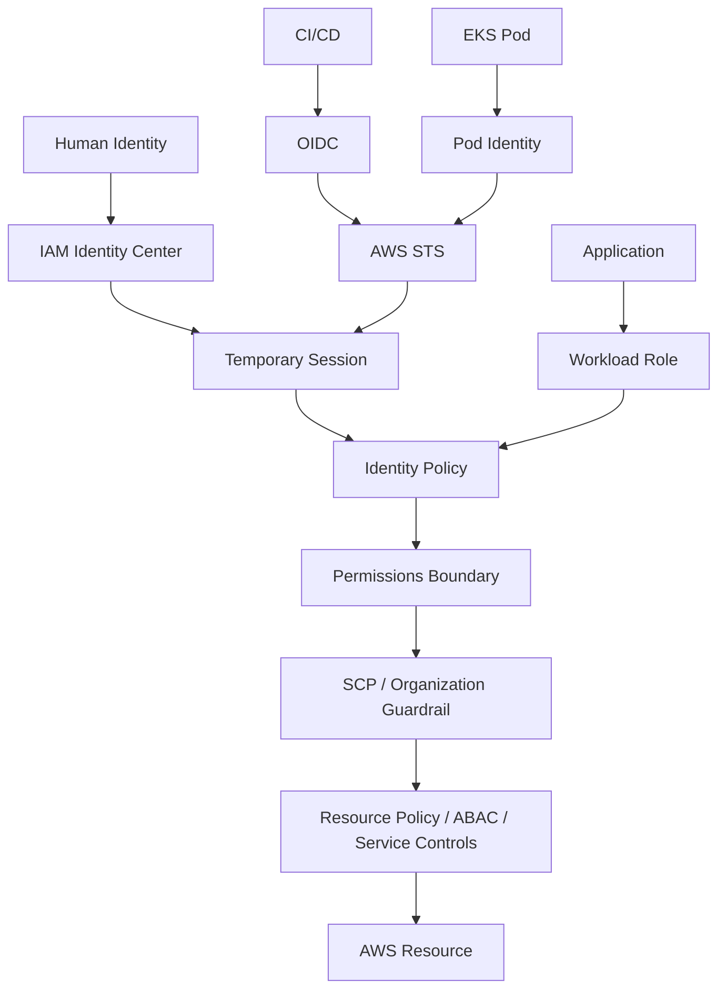
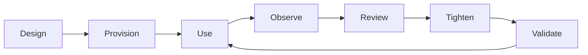

# 03- Least Privilege

## Overview

**Least privilege** is the practice of granting an identity only the permissions required to perform its intended tasks, for only the required resources, under the required conditions.

In AWS, the goal is not simply:

```text
"Make the API call work."
```

It is:

```text
Allow exactly what is required
        +
Deny everything unnecessary
        +
Keep access understandable
        +
Review and reduce access over time
```

AWS explicitly identifies least privilege as a core IAM security best practice. AWS also recommends using IAM Access Analyzer to generate policies from observed access activity and regularly reviewing unused permissions and credentials. ([AWS IAM security best practices](https://docs.aws.amazon.com/IAM/latest/UserGuide/best-practices.html))

For backend engineering, least privilege should be applied to:

```text
Human identities
CI/CD
ECS tasks
EC2 instances
Lambda functions
EKS workloads
Cross-account roles
Third-party integrations
Service roles
Database and storage access
Secrets access
Administrative roles
```

Least privilege is therefore an **architecture property**, not just a policy-writing technique.

---

## Why Least Privilege Matters

Without least privilege, a compromised identity can often do far more than the workload actually requires.

Example:

```text
FastAPI service
    Needs:
        s3:GetObject

Role:
    AdministratorAccess
```

If the service is compromised:

```text
Application compromise
    ↓
Administrator credentials
    ↓
Broad AWS account access
```

With least privilege:

```text
Application compromise
    ↓
Workload role
    ↓
s3:GetObject
    ↓
Specific bucket / prefix
```

The blast radius is substantially smaller.

Least privilege therefore protects against:

- Credential compromise
- Application compromise
- Supply-chain attacks
- Accidental destructive operations
- Privilege escalation
- Lateral movement
- Misconfiguration
- Insider misuse

---

## Principle of Least Privilege

A useful model is:

```text
Minimum Actions
+
Minimum Resources
+
Minimum Context
+
Minimum Lifetime
```

For example:

```text
Action:
    s3:GetObject

Resource:
    arn:aws:s3:::company-reports-prod/reports/*

Context:
    Environment = production

Lifetime:
    Temporary role credentials
```

This is stronger than:

```text
Action:
    s3:*

Resource:
    *
```

Least privilege is therefore multidimensional.

---

## Four Dimensions of Least Privilege

| Dimension | Question |
|---|---|
| Action | What API operation is required? |
| Resource | Which exact resources are required? |
| Context | Under what conditions is access valid? |
| Lifetime | How long should the identity remain usable? |

Additional dimensions often matter:

```text
Principal scope
Session scope
Network context
Environment
Organization
Data classification
```

A mature IAM policy combines these controls rather than relying only on the action list.

---

## Identity Scope

The first least-privilege decision is:

```text
Which identity should receive the permission?
```

Avoid:

```text
One SharedApplicationRole
```

for unrelated workloads.

Prefer:

```text
OrdersServiceRole
PaymentsServiceRole
ReportingServiceRole
DeploymentRole
SecurityAuditRole
```

This creates separate identity boundaries.

Example:

```text
Orders Service
    ↓
OrdersRole

Payments Service
    ↓
PaymentsRole
```

Compromise of one workload does not automatically provide the permissions of another workload.

---

## Workload Identity

Modern AWS workloads should generally use IAM roles and temporary credentials rather than long-lived IAM user credentials.

Examples:

```text
EC2
    ↓
Instance Role

ECS
    ↓
Task Role

Lambda
    ↓
Execution Role

EKS
    ↓
Pod Identity / IRSA

CI/CD
    ↓
OIDC + IAM Role
```

AWS explicitly recommends temporary credentials through IAM roles for workloads. ([AWS IAM security best practices](https://docs.aws.amazon.com/IAM/latest/UserGuide/best-practices.html))

This combines:

```text
Least privilege
+
Short credential lifetime
```

---

## Action-Level Least Privilege

Avoid:

```json
{
    "Effect": "Allow",
    "Action": "s3:*",
    "Resource": "*"
}
```

when the application only needs:

```json
{
    "Effect": "Allow",
    "Action": [
        "s3:GetObject"
    ],
    "Resource": "arn:aws:s3:::company-reports-prod/reports/*"
}
```

The second policy exposes a smaller attack surface.

However, do not blindly replace every wildcard with individual actions.

Some AWS services require supporting actions or resource-level permissions for an operation.

The correct goal is:

```text
Smallest functional permission set
```

not:

```text
Smallest-looking JSON
```

---

## Resource-Level Least Privilege

Action restriction alone is insufficient.

Compare:

```json
{
    "Effect": "Allow",
    "Action": "s3:GetObject",
    "Resource": "*"
}
```

with:

```json
{
    "Effect": "Allow",
    "Action": "s3:GetObject",
    "Resource": "arn:aws:s3:::company-reports-prod/reports/*"
}
```

Both allow the same API action, but the second restricts the target.

A strong policy generally asks:

```text
Which action?
Which resource?
Which account?
Which environment?
Which path / prefix?
```

---

## ARN Scoping

Use ARNs to narrow permissions wherever the AWS service supports resource-level permissions.

Example:

```json
{
    "Effect": "Allow",
    "Action": [
        "secretsmanager:GetSecretValue"
    ],
    "Resource": "arn:aws:secretsmanager:ap-south-1:123456789012:secret:prod/payments/*"
}
```

Instead of:

```json
{
    "Effect": "Allow",
    "Action": "secretsmanager:GetSecretValue",
    "Resource": "*"
}
```

Always verify the resource-level permissions supported by the specific service and action.

The AWS Service Authorization Reference provides supported resources and condition keys for each service action.

---

## Conditions as Least-Privilege Controls

Conditions can further narrow access.

Example:

```json
{
    "Effect": "Allow",
    "Action": "s3:GetObject",
    "Resource": "arn:aws:s3:::company-data-prod/*",
    "Condition": {
        "StringEquals": {
            "aws:PrincipalTag/Environment": "Production"
        }
    }
}
```

Other useful contextual controls include:

```text
MFA
Source account
Source ARN
Organization
Principal ARN
IP address
VPC endpoint
Request tags
Resource tags
Time
Encryption context
```

AWS recommends using IAM policy conditions to further restrict access. ([AWS IAM security best practices](https://docs.aws.amazon.com/IAM/latest/UserGuide/best-practices.html))

---

## Resource Policies and Least Privilege

Least privilege applies to resource-based policies as well.

For example, an S3 bucket policy should avoid:

```json
{
    "Principal": "*",
    "Action": "s3:*",
    "Resource": "*"
}
```

when the bucket only needs access from:

```text
Specific account
Specific role
Specific service
Specific network path
```

Prefer:

```text
Specific principal
+
Specific actions
+
Specific resources
+
Specific conditions
```

The same principle applies to:

```text
SQS
SNS
KMS
Secrets Manager
S3
EventBridge
```

where resource-based authorization is supported.

---

## Trust-Policy Least Privilege

Least privilege is not limited to permissions policies.

A trust policy must also be narrow.

Bad:

```json
{
    "Effect": "Allow",
    "Principal": {
        "AWS": "*"
    },
    "Action": "sts:AssumeRole"
}
```

Better:

```json
{
    "Effect": "Allow",
    "Principal": {
        "AWS": "arn:aws:iam::111122223333:role/DeploymentRole"
    },
    "Action": "sts:AssumeRole"
}
```

The question is:

```text
Who can obtain this role's permissions?
```

A highly restricted permission policy is still dangerous if an unintended principal can assume the role.

---

## Least Privilege Across Accounts

Cross-account roles should limit both:

```text
Who can assume the role
```

and:

```text
What the role can do
```

Example:

```text
Account A
    GitHubActionsRole
        |
        | AssumeRole
        v
Account B
    ProductionDeployRole
        |
        +-- ECS deployment
        +-- ECR access
```

Avoid:

```text
ProductionAdminRole
```

when the CI/CD pipeline only requires deployment capabilities.

Cross-account least privilege is therefore:

```text
Narrow Trust
+
Narrow Permissions
```

---

## Least Privilege and Temporary Credentials

Temporary credentials limit **lifetime**, but not necessarily **permissions**.

Example:

```text
Administrator role
    +
15-minute session
```

is still highly privileged.

Compare:

```text
ReadOnlyReportingRole
    +
15-minute session
```

The second has a smaller authorization surface.

A useful model is:

```text
Privilege Scope
    +
Credential Lifetime
    =
Exposure Window
```

Use both least privilege and short-lived credentials.

---

## Least Privilege and Session Policies

Session policies can further restrict temporary role sessions.

Conceptually:

```text
Role Permissions
        ∩
Session Policy
        ↓
Effective Session Permissions
```

For example:

```text
Base Role:
    Read S3 reports across several projects

Specific Session:
    Read only project-alpha reports
```

Session policies are useful for delegated workflows where the same role supports multiple contexts.

They are a restriction mechanism, not a way to grant permissions that the role does not already support.

---

## Permissions Boundaries

A permissions boundary defines the maximum permissions an IAM user or role can receive from identity-based policies.

Conceptually:

```text
Identity Policy
        ∩
Permissions Boundary
        ↓
Effective Permissions
```

Example:

```text
Developer-created Role
    Identity Policy:
        Allow many services

Boundary:
        Only application runtime services

Effective:
        Limited to the boundary
```

AWS documents permissions boundaries as maximum-permission controls rather than permission grants. ([AWS permissions boundaries](https://docs.aws.amazon.com/IAM/latest/UserGuide/access_policies_boundaries.html))

This is particularly useful for delegated IAM administration.

---

## Least Privilege and SCPs

AWS Organizations SCPs can establish maximum permission guardrails across accounts.

For example:

```text
Account Role
    Allows ec2:TerminateInstances

SCP
    Does not allow ec2:TerminateInstances

Effective result
    Denied
```

SCPs do not grant permissions themselves. They restrict the maximum permissions available to principals in member accounts. ([AWS IAM security best practices](https://docs.aws.amazon.com/IAM/latest/UserGuide/best-practices.html), [AWS policy evaluation](https://docs.aws.amazon.com/IAM/latest/UserGuide/reference_policies_evaluation-logic_policy-eval-reqcontext.html))

A production least-privilege architecture can therefore use:

```text
SCP
    Organization-wide guardrail

Permission Boundary
    Delegated role ceiling

Identity Policy
    Functional permissions

Resource Policy
    Resource-side restriction

ABAC
    Dynamic attribute restriction
```

---

## Least Privilege and ABAC

ABAC can reduce policy duplication while preserving fine-grained access.

Example:

```text
Principal.Team = Payments
        ==
Resource.Team = Payments
```

The same policy can apply to multiple teams.

This is useful when:

```text
Resources change frequently
Teams change frequently
Accounts contain many similar workloads
```

However, ABAC requires trusted attributes.

If developers can change:

```text
Environment = Production
```

then the tag cannot safely serve as an authorization boundary.

Least privilege therefore depends on:

```text
Permission restriction
+
Attribute integrity
```

---

## Least Privilege for Humans

For workforce access, use:

```text
Corporate IdP
    ↓
IAM Identity Center
    ↓
Permission Set
    ↓
AWS Account
```

Design permission sets around job responsibilities:

```text
Developer
ReadOnly
Operations
SecurityAudit
ProductionOperator
```

Avoid giving every engineer:

```text
AdministratorAccess
```

simply because it is convenient.

AWS recommends federation and temporary credentials for human users. ([AWS IAM security best practices](https://docs.aws.amazon.com/IAM/latest/UserGuide/best-practices.html))

---

## Just-in-Time Privileged Access

For sensitive production operations, prefer temporary elevation where organizational tooling supports it.

Example:

```text
Normal developer access
        ↓
Read / limited permissions

Approved production operation
        ↓
Temporary elevated role
        ↓
Perform operation
        ↓
Session expires
```

This reduces the amount of time high privileges remain available.

The goal is:

```text
Privileged access
    when needed
```

rather than:

```text
Privileged access
    permanently
```

---

## Least Privilege for CI/CD

CI/CD roles should be designed around deployment operations.

Example:

```text
GitHub Actions
    ↓
OIDC
    ↓
ProductionDeployRole
```

The role may require:

```text
ecr:GetAuthorizationToken
ecr:BatchGetImage
ecs:UpdateService
ecs:DescribeServices
```

but not necessarily:

```text
iam:*
ec2:*
s3:*
secretsmanager:*
```

unless the deployment actually requires those operations.

A strong deployment role represents the deployment workflow, not the entire platform team.

---

## Least Privilege for ECS

An ECS workload may need multiple identities:

```text
ECS Control Plane
    ↓
Service-Linked Role

Task Startup
    ↓
Execution Role

Application Container
    ↓
Task Role
```

The application should receive only its required permissions.

Example:

```text
Django application
    ↓
TaskRole
    ↓
s3:GetObject
    ↓
reports bucket
```

Do not place application permissions into an unrelated execution or service-linked role.

---

## Least Privilege for Lambda

A Lambda execution role should include only the services the function requires.

Example:

```text
Order Processor Lambda
    ↓
SQS ReceiveMessage
SQS DeleteMessage
DynamoDB UpdateItem
CloudWatch Logs
```

Avoid assigning:

```text
AdministratorAccess
```

to every Lambda because deployment is easier.

Different Lambda functions should usually have different roles when their required access differs materially.

---

## Least Privilege for EC2

An EC2 instance profile should reflect the workload running on the instance.

Example:

```text
Monitoring Agent
    ↓
CloudWatch metrics/log permissions

Application Server
    ↓
S3 + Secrets Manager

Batch Worker
    ↓
SQS + S3
```

Avoid one account-wide instance role shared by unrelated server fleets.

A compromised application should not automatically gain credentials for unrelated infrastructure.

---

## Least Privilege for EKS

For Kubernetes:

```text
Pod
    ↓
Service Account
    ↓
Pod Identity / IRSA
    ↓
IAM Role
```

Each service should receive an appropriately scoped role.

Example:

```text
orders-api
    ↓
OrdersRole
    ↓
sqs:SendMessage
    ↓
orders-events queue
```

not:

```text
DefaultPodRole
    ↓
AdministratorAccess
```

AWS currently recommends EKS Pod Identity for new supported EKS workloads and supports IRSA as an alternative or existing model. Least privilege applies equally to either identity mechanism.

---

## Least Privilege for Secrets Manager

Secret access should be restricted to the exact secret set required.

Good:

```json
{
    "Effect": "Allow",
    "Action": "secretsmanager:GetSecretValue",
    "Resource": "arn:aws:secretsmanager:ap-south-1:123456789012:secret:prod/payments/database-*"
}
```

Avoid:

```json
{
    "Effect": "Allow",
    "Action": "secretsmanager:*",
    "Resource": "*"
}
```

When secrets use customer-managed KMS keys, also consider:

```text
KMS key policy
kms:Decrypt
Encryption context
```

Least privilege must cover the complete secret-decryption path.

---

## Least Privilege for S3

S3 frequently demonstrates why action and resource scoping both matter.

Example:

```json
{
    "Version": "2012-10-17",
    "Statement": [
        {
            "Sid": "ReadReports",
            "Effect": "Allow",
            "Action": [
                "s3:GetObject"
            ],
            "Resource": "arn:aws:s3:::company-reports-prod/reports/*"
        },
        {
            "Sid": "ListReportsPrefix",
            "Effect": "Allow",
            "Action": [
                "s3:ListBucket"
            ],
            "Resource": "arn:aws:s3:::company-reports-prod",
            "Condition": {
                "StringLike": {
                    "s3:prefix": [
                        "reports/*"
                    ]
                }
            }
        }
    ]
}
```

Notice that:

```text
GetObject
    → Object ARN

ListBucket
    → Bucket ARN
```

Different S3 APIs can require different resource scopes and conditions.

---

## Least Privilege for SQS

An application that publishes messages might require:

```text
sqs:GetQueueAttributes
sqs:SendMessage
```

but not:

```text
sqs:DeleteQueue
sqs:SetQueueAttributes
```

Example:

```json
{
    "Version": "2012-10-17",
    "Statement": [
        {
            "Effect": "Allow",
            "Action": [
                "sqs:GetQueueAttributes",
                "sqs:SendMessage"
            ],
            "Resource": "arn:aws:sqs:ap-south-1:123456789012:orders-events"
        }
    ]
}
```

A consumer needs a different set:

```text
ReceiveMessage
DeleteMessage
ChangeMessageVisibility
GetQueueAttributes
```

Producer and consumer identities should normally be separate.

---

## Least Privilege for SNS

A producer generally needs:

```text
sns:Publish
```

for specific topics.

Example:

```json
{
    "Effect": "Allow",
    "Action": "sns:Publish",
    "Resource": "arn:aws:sns:ap-south-1:123456789012:order-events"
}
```

Do not give application identities permission to:

```text
sns:CreateTopic
sns:DeleteTopic
sns:SetTopicAttributes
```

unless the application is explicitly responsible for topic lifecycle.

---

## Least Privilege for CloudFormation

Infrastructure deployment roles often require more permissions than application roles, but they still should be scoped.

A common architecture is:

```text
CI/CD
    ↓
Deployment Role
    ↓
CloudFormation
    ↓
Service Role
    ↓
AWS Resources
```

Separate:

```text
"Who may deploy?"
```

from:

```text
"What resources can CloudFormation create?"
```

This supports stronger change-control and auditing.

---

## Least Privilege for Database Access

IAM least privilege does not replace database authorization.

A backend service may use:

```text
IAM
    ↓
Secrets Manager
    ↓
Database Credential
    ↓
PostgreSQL
    ↓
DB Role
    ↓
Tables
```

There are two authorization systems:

```text
AWS IAM
    Access to secret / infrastructure

PostgreSQL
    Access to tables / schemas / data
```

Least privilege should be applied at both layers.

---

## Least Privilege for Redis

For Redis-backed applications:

```text
Application
    ↓
Secrets Manager / Parameter Store
    ↓
Redis credentials
    ↓
Redis authorization
```

AWS IAM controls access to AWS resources and secret material, while Redis itself enforces its own authorization model.

Do not assume IAM automatically limits Redis commands.

---

## Least Privilege for Kafka

For managed AWS Kafka environments, IAM permissions may control cluster or API access depending on the authentication and authorization model.

The same principle applies:

```text
Identity
    ↓
Kafka permission
    ↓
Specific cluster / topic capability
```

Avoid giving every producer and consumer broad administrative permissions.

Application identities should normally map to distinct producer/consumer roles.

---

## Least Privilege and Privilege Escalation

Privilege escalation occurs when an identity with limited permissions can use those permissions to obtain broader permissions.

For example:

```text
Developer
    ↓
Can modify IAM policy
    ↓
Adds AdministratorAccess
    ↓
Administrator
```

The original permission might not look dangerous:

```text
iam:PutRolePolicy
```

but its effective impact can be extreme.

Least-privilege reviews must therefore consider:

```text
What can this action indirectly enable?
```

not just:

```text
Is this action commonly used?
```

---

## High-Risk IAM Actions

Some IAM permissions require special scrutiny because they can modify the authorization system itself.

Examples include:

```text
iam:AttachRolePolicy
iam:PutRolePolicy
iam:PutUserPolicy
iam:CreatePolicyVersion
iam:SetDefaultPolicyVersion
iam:PassRole
iam:UpdateAssumeRolePolicy
iam:CreateRole
iam:CreateAccessKey
```

The exact escalation risk depends on what resources and policies the identity can manipulate.

`iam:PassRole` is especially important because it can allow a principal to cause an AWS service to operate under another role.

Least privilege should therefore include privilege-escalation analysis.

---

## `iam:PassRole`

Consider:

```text
Developer
    ↓
Can pass AdministratorRole
    ↓
AWS service assumes AdministratorRole
    ↓
Developer gains indirect administrator capabilities
```

The policy should restrict:

```text
Which role can be passed
```

to:

```text
Which service
```

for:

```text
Which use case
```

Example:

```json
{
    "Version": "2012-10-17",
    "Statement": [
        {
            "Sid": "PassDeploymentRoleToCloudFormation",
            "Effect": "Allow",
            "Action": "iam:PassRole",
            "Resource": "arn:aws:iam::123456789012:role/CloudFormationDeploymentRole",
            "Condition": {
                "StringEquals": {
                    "iam:PassedToService": "cloudformation.amazonaws.com"
                }
            }
        }
    ]
}
```

This is a classic senior-level IAM review item.

---

## Permissions That Modify Policies

Policy-management permissions deserve stronger controls than ordinary application permissions.

For example:

```text
s3:GetObject
```

generally affects application data access.

Whereas:

```text
iam:PutRolePolicy
```

can modify authorization itself.

A useful risk hierarchy is:

```text
Read application data
        ↓
Modify application resources
        ↓
Modify security-sensitive resources
        ↓
Modify identities / policies
```

The higher the identity sits in the control plane, the narrower and more carefully governed its permissions should be.

---

## Deny-Based Guardrails

Least privilege does not require creating explicit `Deny` statements for every unneeded action.

Normally:

```text
No Allow
    ↓
Implicit Deny
```

is sufficient.

Explicit denies are more useful for:

```text
Organization-wide guardrails
Sensitive actions
Exception handling
Mandatory security controls
```

Example:

```text
SCP
    Explicitly deny
    disabling CloudTrail
```

Avoid massive deny lists that make IAM behavior difficult to reason about.

---

## Least Privilege and Policy Evaluation

Effective permissions are determined by all applicable policy layers.

AWS evaluates:

```text
Identity-based policies
Resource-based policies
Permissions boundaries
Session policies
SCPs
RCPs
Conditions
Explicit denies
```

An explicit deny overrides an applicable allow. ([AWS policy evaluation](https://docs.aws.amazon.com/IAM/latest/UserGuide/reference_policies_evaluation-logic_policy-eval-denyallow.html))

A permissions boundary or SCP can reduce the effective permission set even when an identity policy grants an action. ([AWS permissions boundaries](https://docs.aws.amazon.com/IAM/latest/UserGuide/access_policies_boundaries.html))

Therefore, least privilege should be reviewed at the **effective permission** level, not merely by reading one attached policy.

---

## AWS Managed Policies

AWS managed policies are convenient starting points.

However, AWS explicitly notes that AWS managed policies may grant more permissions than a specific workload needs because they are designed for broad reuse. AWS recommends moving toward customer-managed policies tailored to the use case. ([AWS IAM security best practices](https://docs.aws.amazon.com/IAM/latest/UserGuide/best-practices.html))

A practical progression is:

```text
Prototype
    ↓
AWS Managed Policy

Observed workload
    ↓
Measure actual access

Policy refinement
    ↓
Customer-managed least-privilege policy

Production
    ↓
Continuously review
```

Do not assume:

```text
AWS managed
    =
least privilege
```

---

## Customer-Managed Policies

Customer-managed policies provide more control over the permission set.

Example:

```text
PaymentsServiceS3ReadPolicy
```

instead of:

```text
AmazonS3FullAccess
```

A customer-managed policy can be tailored to:

```text
Specific services
Specific actions
Specific resources
Specific environments
Specific conditions
```

This improves auditability and change control.

---

## Inline Policies

Inline policies tightly bind policy lifecycle to one identity.

They can be useful when:

```text
The permission is intentionally unique to one role
```

but they can make centralized governance harder.

For repeated permission sets, prefer customer-managed policies where that improves reuse and lifecycle management.

Least privilege is about permission scope, not whether a policy is inline or managed.

---

## Managed Policy Versioning

Customer-managed policies can have multiple versions.

This allows controlled changes:

```text
Policy v1
    ↓
Policy v2
    ↓
Test
    ↓
Set default version
```

This can improve operational safety.

Before reducing permissions in production:

```text
Validate
+
Deploy
+
Monitor
+
Rollback if necessary
```

Use infrastructure as code and version control for important policies.

---

## Least Privilege and Infrastructure as Code

IAM should ideally be managed declaratively.

Example Terraform:

```hcl
resource "aws_iam_role_policy" "orders_s3" {
  role = aws_iam_role.orders.name

  policy = jsonencode({
    Version = "2012-10-17"
    Statement = [
      {
        Effect = "Allow"
        Action = [
          "s3:GetObject"
        ]
        Resource = "arn:aws:s3:::company-orders-prod/orders/*"
      }
    ]
  })
}
```

Benefits include:

```text
Code review
Version history
Automated validation
Repeatability
Rollback
Environment consistency
```

Avoid manually editing production IAM policies without recording the change in the source of truth.

---

## Least Privilege in CI/CD Reviews

A strong CI/CD pipeline should validate IAM changes before deployment.

Typical controls:

```text
Terraform plan
    ↓
Policy linting
    ↓
IAM Access Analyzer validation
    ↓
Security review
    ↓
Deploy
```

IAM Access Analyzer provides policy validation and custom policy checks that can identify security and functional issues before deployment. ([AWS IAM Access Analyzer](https://docs.aws.amazon.com/IAM/latest/UserGuide/what-is-access-analyzer.html))

---

## IAM Access Analyzer

IAM Access Analyzer is one of the most important AWS tools for least-privilege programs.

It can help with:

```text
Policy validation
Policy generation
External access analysis
Internal access analysis
Unused access analysis
```

AWS describes IAM Access Analyzer as providing capabilities for setting, verifying, and refining IAM policies. ([AWS IAM Access Analyzer](https://docs.aws.amazon.com/access-analyzer/latest/APIReference/Welcome.html))

---

## Policy Validation

IAM Access Analyzer can validate IAM policies against AWS policy grammar and recommended best practices.

For example:

```text
Policy
    ↓
IAM Access Analyzer
    ↓
Warnings / Errors / Suggestions
```

This catches issues before deployment.

Typical workflow:

```text
Write policy
    ↓
Validate policy
    ↓
Review findings
    ↓
Test authorization
    ↓
Deploy
```

Policy validation should be part of CI/CD for infrastructure repositories.

---

## Policy Generation From Access Activity

IAM Access Analyzer can generate policies from access activity recorded in CloudTrail.

Conceptually:

```text
Workload
    ↓
AWS API Usage
    ↓
CloudTrail
    ↓
IAM Access Analyzer
    ↓
Generated Policy
    ↓
Human Review
    ↓
Test
    ↓
Deploy
```

AWS recommends generating policies from observed access, testing them, and then deploying the refined policy. ([AWS IAM policy generation](https://docs.aws.amazon.com/IAM/latest/UserGuide/access-analyzer-policy-generation.html))

This is especially useful for reducing broad development-time permissions.

---

## Do Not Blindly Trust Generated Policies

Observed access is evidence, not a complete specification.

A workload may have:

```text
Monthly batch job
Quarterly report
Disaster-recovery path
Rare operational action
```

that does not appear during a short observation period.

Therefore:

```text
Generated Policy
    ≠
Automatically correct production policy
```

Use generated policies as a starting point.

AWS itself recommends reviewing and testing generated policies before production deployment. ([AWS IAM security best practices](https://docs.aws.amazon.com/IAM/latest/UserGuide/best-practices.html))

---

## Last Accessed Information

IAM provides last accessed information that can help identify permissions and services that have not been used.

You can examine:

```text
Users
Groups
Roles
Policies
AWS Organizations entities
```

and identify service or action usage where AWS provides the tracking information. ([AWS last accessed information](https://docs.aws.amazon.com/IAM/latest/UserGuide/access_policies_last-accessed.html))

This is useful for permission reduction.

---

## Last Accessed Information Limitations

Do not interpret:

```text
Not accessed
```

as proof that a permission is unnecessary.

AWS notes that:

- Tracking coverage varies by service and action.
- The reports include attempts, not only successful calls.
- Different policy types are not all represented in the same report.
- Recent activity can take time to appear.
- Absence of tracking data should not be the sole basis for removing permissions. ([AWS last accessed information](https://docs.aws.amazon.com/IAM/latest/UserGuide/access_policies_last-accessed.html))

Use the data as:

```text
Evidence
+
Operational context
+
Application knowledge
```

rather than as an automatic deletion signal.

---

## Unused Access Analysis

IAM Access Analyzer can generate unused-access findings for:

```text
Unused roles
Unused access keys
Unused console passwords
Unused service permissions
Unused action-level permissions
```

The analysis can be performed across selected AWS accounts or an organization depending on the analyzer configuration. ([AWS IAM Access Analyzer unused access](https://docs.aws.amazon.com/IAM/latest/UserGuide/access-analyzer-findings.html))

This supports a continuous least-privilege lifecycle:

```text
Grant
    ↓
Use
    ↓
Observe
    ↓
Review
    ↓
Reduce
    ↓
Repeat
```

---

## Permission Review Lifecycle

Least privilege should not be a one-time exercise.

Use:

```text
Design
    ↓
Deploy
    ↓
Observe
    ↓
Review
    ↓
Reduce
    ↓
Validate
    ↓
Repeat
```

A practical review cycle may include:

```text
On deployment
Monthly
Quarterly
After team changes
After architecture changes
After security incidents
```

The exact frequency should reflect the sensitivity and change rate of the environment.

---

## Access Reviews

Review access at multiple levels.

### Identity Review

```text
Who has access?
```

### Permission Review

```text
What actions are allowed?
```

### Resource Review

```text
What resources are accessible?
```

### Trust Review

```text
Who can assume this role?
```

### Usage Review

```text
What permissions are actually used?
```

### Organizational Review

```text
What is prevented by SCPs / RCPs?
```

This is more complete than simply looking at IAM users.

---

## Role Lifecycle

A least-privilege role should have an owner.

Example:

```text
Role:
    PaymentsWorkerRole

Owner:
    Payments Platform Team

Purpose:
    Process payment events

Permissions:
    SQS receive
    Secrets read
    CloudWatch logs

Review:
    Quarterly
```

Without ownership:

```text
Role exists
    ↓
No one knows why
    ↓
Permissions grow
    ↓
Role becomes dangerous
```

Every production role should have a clear purpose and lifecycle owner.

---

## Policy Lifecycle

A policy should evolve with the workload.

Example:

```text
v1
    S3 GetObject

v2
    S3 GetObject
    SQS SendMessage

v3
    S3 prefix narrowed

v4
    Unused permission removed
```

Each change should answer:

```text
Why is this permission needed?
```

and ideally be traceable to:

```text
Application change
Infrastructure change
Incident
Security review
Compliance requirement
```

---

## Least Privilege and Temporary Access

Temporary privileged roles are a useful pattern:

```text
Default:
    ReadOnly

Approved operation:
    Assume ProductionOperatorRole

After operation:
    Session expires
```

This reduces the period during which elevated access is usable.

The combination is:

```text
Least privilege
+
Just-in-time elevation
+
Temporary credentials
```

---

## Production Architecture

A layered least-privilege architecture can look like:



Not every request passes through every layer in exactly this form, but the model illustrates the layered nature of AWS authorization.

---

## Least Privilege for Multi-Account Architectures

Use separate accounts to create stronger security boundaries:

```text
Security Account
Shared Services
Development
Staging
Production
```

Then combine:

```text
Identity Center
+
Cross-account roles
+
SCPs
+
Least-privilege workload roles
```

Example:

```text
CI/CD
    ↓
ProductionDeployRole
    ↓
ECS / ECR / CloudFormation
```

rather than:

```text
CI/CD
    ↓
OrganizationAdministrator
```

---

## Least Privilege and Resource Isolation

Separate production resources whenever possible:

```text
Development Account
    Dev resources

Production Account
    Prod resources
```

This is stronger than relying only on:

```text
Environment=production
```

ABAC can supplement account-level isolation, but it should not be used to compensate for poor environment boundaries when separate accounts are practical.

---

## Least Privilege and Network Security

IAM does not replace network controls.

A production service may require:

```text
IAM
+
VPC
+
Security Groups
+
Network ACLs
+
Private endpoints
+
Resource policies
```

For example:

```text
S3 access
    IAM authorization

Database access
    Security Group
    + DB credentials / authorization

Secrets access
    IAM
    + KMS
```

Least privilege is strongest when combined with multiple independent controls.

---

## Least Privilege and KMS

Encryption introduces a separate authorization layer.

Example:

```text
Application Role
    ↓
Secrets Manager
    ↓
KMS Decrypt
    ↓
Encrypted Secret
```

A role may have:

```text
secretsmanager:GetSecretValue
```

but still fail because:

```text
kms:Decrypt
```

is not allowed.

Conversely, granting broad KMS decrypt access can expose many encrypted resources.

KMS permissions should therefore be scoped to the exact keys and encryption contexts required by the workload.

---

## Least Privilege and Data Classification

For sensitive data, permissions should be narrowed by:

```text
Resource
Data class
Environment
Purpose
Identity
```

Example:

```text
PaymentsRole
    ↓
Confidential payment data
```

should not automatically imply:

```text
Customer support data
Analytics datasets
Security logs
```

Segmentation reduces lateral movement after compromise.

---

## Least Privilege and Application Authorization

IAM does not replace application authorization.

Consider:

```text
Django
    ↓
Authenticated Application User
    ↓
Can access invoice 123?

Application Authorization
```

Then:

```text
Django
    ↓
S3 GetObject
    ↓
AWS IAM
```

The two authorization layers solve different problems.

A secure backend often needs:

```text
Application-level authorization
+
Infrastructure-level authorization
```

---

## Least Privilege and Secrets in Backend Services

A FastAPI service should receive only the secrets it needs.

Example:

```text
Orders API
    ↓
Secrets Manager
    ↓
orders/database
```

It should not have:

```text
secretsmanager:GetSecretValue
    on all secrets
```

Use secret-specific resource ARNs where supported.

The same principle applies to:

```text
Django
Celery
Airflow
Workers
Cron jobs
Kubernetes pods
```

Each workload should receive only its required secret access.

---

## Testing Least Privilege

Least privilege should be tested like application functionality.

Test:

```text
Expected allow
Expected deny
Expected cross-account deny
Expected wrong-resource deny
Expected wrong-environment deny
Expected missing-tag deny
Expected expired-session behavior
```

Example:

```text
OrdersRole
    GET orders bucket object
        ✅

OrdersRole
    DELETE orders bucket object
        ❌

OrdersRole
    Read payments bucket
        ❌
```

Negative authorization tests are particularly valuable.

---

## IAM Policy Simulator

The IAM Policy Simulator can help test policy behavior before changing production access.

Example:

```bash
aws iam simulate-principal-policy \
    --policy-source-arn arn:aws:iam::123456789012:role/OrdersRole \
    --action-names s3:GetObject \
    --resource-arns arn:aws:s3:::company-orders-prod/orders/order-123.json
```

Use simulation to validate expected policy behavior, but remember that real authorization can involve other policy sources and service-specific semantics.

Simulation is therefore a validation tool, not a replacement for testing the actual architecture.

---

## CI/CD Policy Testing

A production pipeline can enforce IAM checks:

```text
Pull Request
    ↓
Terraform Plan
    ↓
IAM Policy Validation
    ↓
Access Analyzer Checks
    ↓
Security Tests
    ↓
Code Review
    ↓
Deployment
```

Potential checks include:

```text
Policy syntax
Wildcard permissions
Unscoped resources
Dangerous IAM actions
Trust policy breadth
Known privilege-escalation patterns
ABAC condition correctness
```

AWS IAM Access Analyzer supports policy validation and custom policy checks that can be integrated into policy-development workflows. ([AWS IAM Access Analyzer](https://docs.aws.amazon.com/IAM/latest/UserGuide/what-is-access-analyzer.html))

---

## Common Mistakes

| Mistake | Why it happens | Better approach |
|---|---|---|
| `Action: "*"` | Fastest way to unblock development | Scope required actions |
| `Resource: "*"` everywhere | Some examples use it for convenience | Scope resources where supported |
| `AdministratorAccess` for applications | Easy deployment | Create workload-specific roles |
| One role for every service | Fewer IAM objects | Separate identities by trust and function |
| Only reviewing action names | Resource scope ignored | Review action + resource + conditions |
| Ignoring trust policies | Focus only on permissions | Review who can assume the role |
| Ignoring `iam:PassRole` | Looks like deployment plumbing | Analyze as a privilege-escalation capability |
| Relying only on last-access data | Easy automation | Combine usage evidence with application knowledge |
| Removing permissions too quickly | "Unused" appears in reports | Verify workload lifecycle and edge cases |
| Using ABAC without tag controls | Tags look harmless | Protect authorization attributes |
| Using SCPs as permission grants | Misunderstanding SCPs | Use SCPs as guardrails |
| Overusing explicit Deny | Attempts to encode every restriction | Prefer implicit deny unless a guardrail is required |
| Giving engineers permanent admin access | Operational convenience | Use scoped roles and temporary elevation |
| Giving CI/CD administrator access | Simplifies deployment | Build a dedicated deployment role |
| Sharing workload roles | Reduces IAM objects | Separate identities where privilege boundaries differ |
| Never revisiting policies | IAM configured once | Run continuous access reviews |

---

## Production Pitfalls

### Least Privilege Can Become Too Narrow

A policy that is technically minimal but operationally incomplete can cause production failures.

Example:

```text
Batch Job
    runs monthly

Observed access
    last 30 days

Unused permission
    appears unnecessary

Permission removed
    ↓
Monthly job fails
```

Least privilege requires understanding workload lifecycle, not just current traffic.

---

### Least Privilege Can Become Too Broad

The opposite failure is:

```text
Fix AccessDenied
    ↓
Add AdministratorAccess
```

This solves authorization symptoms while creating security debt.

A better workflow is:

```text
Identify missing action
    ↓
Identify required resource
    ↓
Add narrow permission
    ↓
Test
    ↓
Review
```

---

### Shared Roles Hide Blast Radius

If:

```text
Orders
Payments
Billing
```

share one role, removing one permission can break all services and granting one permission can expose all services.

Separate trust boundaries make least privilege easier to maintain.

---

### Permissions Grow Over Time

A role often evolves like:

```text
Initial:
    S3 read

Later:
    + SQS write
    + Secrets read
    + ECR
    + DynamoDB
    + CloudWatch
```

Without review:

```text
Unused permissions accumulate
```

This is why least privilege is a lifecycle discipline.

---

## Access Review Strategy

A practical access review can use:

```text
Role Inventory
    ↓
Owner Verification
    ↓
Policy Analysis
    ↓
Last Accessed
    ↓
Unused Access Analyzer
    ↓
CloudTrail / Application Evidence
    ↓
Permission Reduction
    ↓
Testing
    ↓
Approval
```

Do not automate deletion solely from "not accessed" results.

AWS explicitly notes that last accessed data should inform least-privilege decisions rather than serve as the only basis for removing permissions. ([AWS last accessed information](https://docs.aws.amazon.com/IAM/latest/UserGuide/access_policies_last-accessed.html))

---

## Continuous Least Privilege

A mature process looks like:



This is better than:

```text
Create role once
    ↓
Never review again
```

Least privilege degrades naturally as systems evolve unless access is continuously reviewed.

---

## Least Privilege Metrics

Avoid reducing least privilege to a single percentage score.

Useful operational measurements include:

```text
Number of unused roles
Number of unused permissions
Number of wildcard actions
Number of wildcard resources
Number of IAM users
Number of long-lived access keys
Number of externally shared resources
Number of roles with broad trust
Number of roles with high-risk IAM actions
Age of access reviews
```

These metrics provide actionable signals without pretending that "permission count" alone measures security quality.

---

## Cost Considerations

Least privilege can indirectly reduce operational and security costs by:

```text
Reducing unnecessary resource access
Reducing incident blast radius
Reducing IAM complexity
Reducing credential-management burden
Reducing audit scope
```

IAM Access Analyzer has different pricing characteristics by analyzer type. AWS documents charges for unused-access analyzers based on IAM identities analyzed and for internal-access analyzers based on monitored resources; external access findings are available without analyzer charges. ([AWS IAM Access Analyzer findings](https://docs.aws.amazon.com/IAM/latest/UserGuide/access-analyzer-findings.html))

Cost should therefore be considered when designing continuous large-scale access analysis.

---

## Disaster Recovery Considerations

Least-privilege policies must remain usable during disaster recovery.

For example:

```text
Primary Region
    ↓
ProductionRole
    ↓
S3 / KMS / Secrets

Failover Region
    ↓
Same or alternate role
    ↓
Recovery resources
```

Review:

```text
Recovery account
Recovery role
Backup S3 resources
KMS keys
Secrets
Cross-account roles
SCPs
Network access
```

A security policy that works only in the primary environment is not production-complete.

---

## Senior-Level Mental Model

Least privilege is not:

```text
"Use fewer permissions."
```

It is:

```text
Model the workload
        ↓
Identify exact operations
        ↓
Identify exact resources
        ↓
Identify trust boundary
        ↓
Add contextual constraints
        ↓
Use temporary credentials
        ↓
Deploy
        ↓
Observe actual usage
        ↓
Review and reduce
```

The most important senior-level question is:

```text
What is the smallest authorization surface
that still guarantees correct business operation?
```

That includes:

```text
Identity
Trust
Actions
Resources
Conditions
Session lifetime
Delegation paths
Organization guardrails
Application boundaries
```

---

## Interview Perspective

### What Is Least Privilege?

Granting only the permissions necessary for an identity to perform its intended tasks.

### Is Least Privilege the Same as Explicit Deny?

No.

Most unused actions remain denied because they are not allowed in the first place:

```text
No Allow
    ↓
Implicit Deny
```

Explicit denies are mainly useful for security guardrails and exceptions.

### Does `AdministratorAccess` With MFA Follow Least Privilege?

MFA strengthens authentication, but the administrator role still grants broad authorization.

```text
Strong authentication
    ≠
Least privilege
```

### What Is More Important: Action or Resource Scope?

Both.

```text
Action
    What can the identity do?

Resource
    Where can it do it?
```

### What Is `iam:PassRole` and Why Does It Matter?

It allows a principal to pass an IAM role to an AWS service. Depending on the target role and service, this can become an indirect privilege-escalation path, so `iam:PassRole` should be tightly scoped.

### Do SCPs Grant Permissions?

No.

SCPs constrain the maximum permissions available to principals in member accounts. They do not grant permissions themselves. ([AWS IAM security best practices](https://docs.aws.amazon.com/IAM/latest/UserGuide/best-practices.html))

### Do Permissions Boundaries Grant Permissions?

No.

They limit the maximum permissions an IAM user or role can receive from applicable identity-based policies. ([AWS permissions boundaries](https://docs.aws.amazon.com/IAM/latest/UserGuide/access_policies_boundaries.html))

### Can Least Privilege Be Automated?

Partially.

Useful AWS mechanisms include:

```text
IAM Access Analyzer
Policy validation
Policy generation
Last accessed information
Unused access findings
Policy simulation
```

But production decisions still require application and operational context. ([AWS IAM Access Analyzer](https://docs.aws.amazon.com/IAM/latest/UserGuide/what-is-access-analyzer.html))

### Why Is Last Accessed Data Not Sufficient by Itself?

Because AWS does not track every possible action equally, activity can be seasonal, and different policy types are not all represented in the same report. ([AWS last accessed information](https://docs.aws.amazon.com/IAM/latest/UserGuide/access_policies_last-accessed.html))

### How Do You Apply Least Privilege to a FastAPI Service?

Use:

```text
Dedicated workload role
    ↓
Specific AWS actions
    ↓
Specific resource ARNs
    ↓
Conditions where useful
    ↓
Temporary credentials
```

### How Do You Apply Least Privilege to Kubernetes?

Use:

```text
Service Account
    ↓
EKS Pod Identity / IRSA
    ↓
Dedicated IAM Role
    ↓
Only required AWS permissions
```

### What Is a Strong Least-Privilege Review Question?

```text
"What happens if this identity is compromised?"
```

Then determine:

```text
What can it access?
What can it modify?
What can it delete?
What roles can it pass?
What roles can it assume?
What identities can it create?
What policies can it modify?
```

That analysis is more valuable than simply counting permissions.

---

## Production Checklist

Before approving an IAM design, verify:

```text
Identity
    □ Dedicated workload / workforce identity
    □ No unnecessary shared roles
    □ Long-lived credentials minimized

Trust
    □ Role trust is narrow
    □ Cross-account trust is explicit
    □ Federation claims are restricted

Permissions
    □ Actions are scoped
    □ Resources are scoped
    □ Conditions are used where beneficial
    □ Wildcards are justified
    □ High-risk IAM actions are restricted

Delegation
    □ iam:PassRole is narrowly scoped
    □ AssumeRole targets are restricted
    □ Policy-management permissions are restricted
    □ Privilege-escalation paths are reviewed

Guardrails
    □ SCPs are considered
    □ Permissions boundaries are considered
    □ Session policies are considered
    □ Resource policies are considered
    □ ABAC attributes are governed

Credentials
    □ Temporary credentials are preferred
    □ Credential refresh is automatic
    □ Root credentials are excluded
    □ Workload keys are not hard-coded

Validation
    □ IAM Access Analyzer policy validation is used
    □ Generated policies are reviewed
    □ Policy simulation is used where appropriate
    □ Negative authorization tests exist

Operations
    □ Every production role has an owner
    □ Access reviews are scheduled
    □ Last accessed data is reviewed
    □ Unused access is investigated
    □ Policy changes are version controlled

Reliability
    □ Rare workloads are accounted for
    □ Batch / scheduled workloads are considered
    □ Disaster-recovery permissions are tested
    □ Emergency access remains available

Monitoring
    □ CloudTrail provides auditability
    □ IAM Access Analyzer is used where appropriate
    □ High-risk identity changes are monitored
    □ External resource sharing is reviewed
```

## AWS Documentation Links

- [AWS IAM security best practices](https://docs.aws.amazon.com/IAM/latest/UserGuide/best-practices.html)
- [IAM Access Analyzer](https://docs.aws.amazon.com/IAM/latest/UserGuide/what-is-access-analyzer.html)
- [IAM Access Analyzer policy generation](https://docs.aws.amazon.com/IAM/latest/UserGuide/access-analyzer-policy-generation.html)
- [IAM Access Analyzer findings](https://docs.aws.amazon.com/IAM/latest/UserGuide/access-analyzer-findings.html)
- [Refine permissions using last accessed information](https://docs.aws.amazon.com/IAM/latest/UserGuide/access_policies_last-accessed.html)
- [View last accessed information](https://docs.aws.amazon.com/IAM/latest/UserGuide/access_policies_last-accessed-view-data.html)
- [Permissions boundaries](https://docs.aws.amazon.com/IAM/latest/UserGuide/access_policies_boundaries.html)
- [Policy evaluation logic](https://docs.aws.amazon.com/IAM/latest/UserGuide/reference_policies_evaluation-logic_policy-eval-denyallow.html)
- [Policy evaluation request context](https://docs.aws.amazon.com/IAM/latest/UserGuide/reference_policies_evaluation-logic_policy-eval-reqcontext.html)
- [AWS IAM condition keys](https://docs.aws.amazon.com/IAM/latest/UserGuide/reference_policies_condition-keys.html)
- [AWS IAM policy variables](https://docs.aws.amazon.com/IAM/latest/UserGuide/reference_policies_variables.html)
- [AWS Service Authorization Reference](https://docs.aws.amazon.com/service-authorization/latest/reference/reference_policies_actions-resources-contextkeys.html)

## Key Takeaways

- **Least privilege means minimizing the complete authorization surface:** identity, trust, actions, resources, conditions, delegation paths, and credential lifetime—not simply reducing the number of policy statements.
- **Dedicated workload and workforce identities are foundational:** use IAM roles and temporary credentials for ECS, EC2, Lambda, EKS, CI/CD, and human access rather than shared or long-lived credentials. ([AWS IAM security best practices](https://docs.aws.amazon.com/IAM/latest/UserGuide/best-practices.html))
- **IAM Access Analyzer, policy validation, policy generation, last accessed information, and unused-access analysis provide strong tooling for continuous permission refinement, but observed activity must be combined with application and operational knowledge.** ([AWS IAM Access Analyzer](https://docs.aws.amazon.com/IAM/latest/UserGuide/what-is-access-analyzer.html))
- **Review privilege-escalation paths, not just business permissions:** `iam:PassRole`, role assumption, policy modification, and identity-management permissions can create capabilities far beyond their apparent individual actions.
- **Least privilege is continuous:** design narrowly, observe real usage, review regularly, remove unnecessary access, test negative authorization paths, and preserve enough capability for scheduled, recovery, and disaster-recovery workflows.