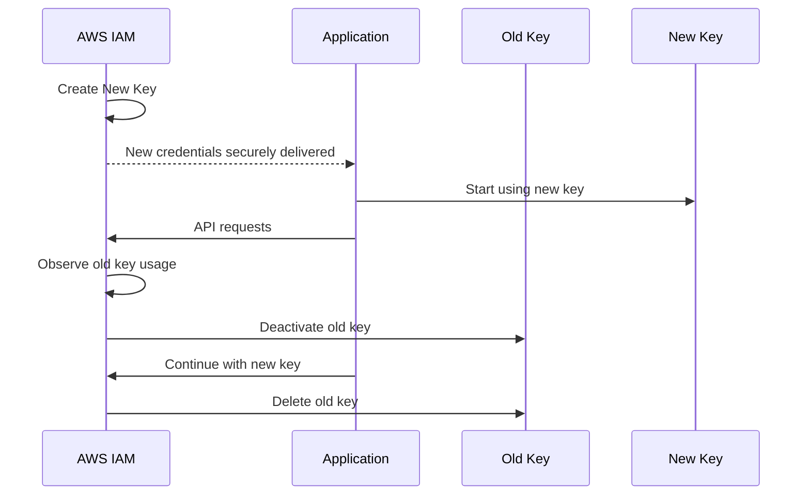
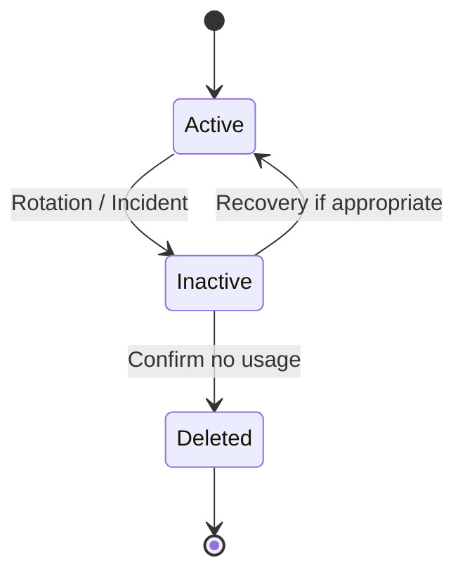
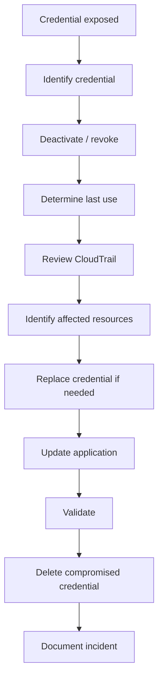
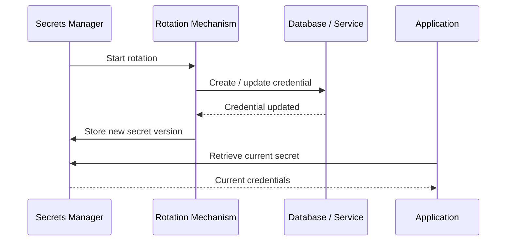
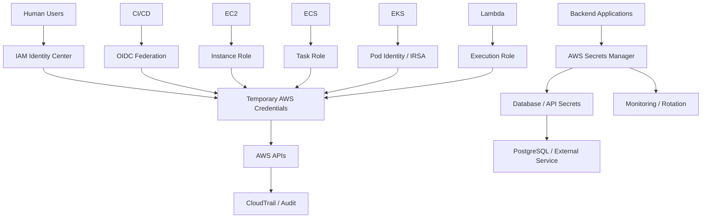

# 04- Credential Management and Rotation

## Overview

AWS credential management covers the complete lifecycle of authentication material:

```text
Create
  ↓
Store
  ↓
Use
  ↓
Monitor
  ↓
Rotate / Refresh
  ↓
Revoke
  ↓
Delete
```

The strongest production strategy is to avoid long-lived credentials wherever possible.

AWS recommends:

```text
Human users
    → Federation / IAM Identity Center
    → Temporary credentials

Workloads
    → IAM roles
    → Temporary credentials

Long-lived IAM access keys
    → Only when a specific use case requires them
```

AWS explicitly recommends temporary credentials for human users and workloads and recommends updating long-term access keys only for use cases that still require them. ([AWS IAM security best practices](https://docs.aws.amazon.com/IAM/latest/UserGuide/best-practices.html), [AWS secure access keys](https://docs.aws.amazon.com/IAM/latest/UserGuide/securing_access-keys.html))

Credential management is therefore broader than "rotate passwords every 90 days."

A production credential strategy must answer:

```text
Who owns the credential?
Where is it stored?
How is it obtained?
How long does it live?
How is it refreshed?
How is it rotated?
How is compromise detected?
How is it revoked?
What happens during rotation failure?
```

---

## Credential Types

AWS uses several credential models.

| Credential type | Typical lifetime | Example use | Rotation strategy |
|---|---|---|---|
| Root credentials | Long-lived identity | Root-only account operations | Protect, rarely use |
| IAM user password | Long-lived | Legacy console access | MFA + lifecycle controls |
| IAM user access key | Long-lived | Legacy programmatic access | Planned overlap rotation |
| Role credentials | Temporary | Workloads, humans, cross-account | Automatic refresh |
| STS session credentials | Temporary | `AssumeRole`, federation | Refresh/re-assume |
| IAM Identity Center credentials | Temporary | Workforce CLI / SDK | Automatic refresh through SSO session |
| Application secret | Depends | DB/API credentials | Secrets Manager rotation |
| OAuth/API token | Depends | Third-party integrations | Provider-specific rotation |
| SSH key | Long-lived unless rotated | SSH access | Prefer alternatives such as Instance Connect |

AWS specifically distinguishes long-term access keys from temporary credentials and recommends temporary security credentials wherever practical. ([AWS security credentials](https://docs.aws.amazon.com/IAM/latest/UserGuide/security-creds.html))

---

## Credential Management Principles

A strong production model follows these principles:

```text
Prefer temporary over long-lived
Prefer workload roles over access keys
Prefer federation over IAM users
Prefer managed secret rotation over custom rotation
Minimize credential distribution
Minimize credential lifetime
Monitor credential usage
Rotate deliberately
Revoke quickly after exposure
Keep recovery paths independent
```

The most important optimization is often not better rotation.

It is:

```text
Eliminate the credential that needs rotation.
```

For example:

```text
Static ECS access key
        ↓
Replace with ECS task role
        ↓
No manual key rotation
```

---

## Long-Lived vs Temporary Credentials

### Long-Lived Access Key

```text
IAM User
    ↓
Access Key ID
Secret Access Key
    ↓
Application
```

The key remains valid until it is:

```text
Deactivated
Deleted
Otherwise invalidated
```

### Temporary Credentials

```text
IAM Role
    ↓
STS
    ↓
Temporary Access Key
Temporary Secret
Session Token
Expiration
```

The credentials expire automatically.

AWS recommends temporary credentials because their limited lifetime reduces the exposure window if they are accidentally disclosed. ([AWS secure access keys](https://docs.aws.amazon.com/IAM/latest/UserGuide/securing_access-keys.html))

---

## Why Static Credentials Are Risky

Consider:

```text
Git repository
    ↓
AWS access key leaked
    ↓
Attacker obtains credentials
    ↓
Key remains valid
    ↓
Attacker can continue using it
```

Temporary credentials change the final stage:

```text
Credential leak
    ↓
Attacker uses credentials
    ↓
Expiration
    ↓
Credentials stop working
```

This does not eliminate the incident, but it can substantially reduce the credential's useful lifetime.

---

## Prefer IAM Roles for Workloads

The preferred production model is:

```text
Application
    ↓
Runtime Identity
    ↓
IAM Role
    ↓
Temporary Credentials
```

Examples:

```text
EC2
    → Instance profile / role

ECS
    → Task role

Lambda
    → Execution role

EKS
    → Pod Identity / IRSA

CI/CD
    → OIDC + IAM role
```

AWS explicitly recommends using IAM roles and temporary credentials for workloads. ([AWS IAM security best practices](https://docs.aws.amazon.com/IAM/latest/UserGuide/best-practices.html))

This eliminates a large class of manual key-rotation problems.

---

## Human Credential Strategy

Modern workforce access should normally look like:

```text
Employee
    ↓
Corporate Identity Provider
    ↓
IAM Identity Center
    ↓
Permission Set
    ↓
Temporary AWS Session
```

For CLI access:

```bash
aws configure sso --profile company-dev
```

Then:

```bash
aws sso login --profile company-dev
```

The AWS CLI retrieves temporary AWS credentials from the IAM Identity Center session and can refresh them while the SSO session remains active. ([AWS CLI IAM Identity Center configuration](https://docs.aws.amazon.com/cli/latest/userguide/cli-configure-sso.html))

This is preferable to distributing IAM user access keys to developers.

---

## Credential Storage Hierarchy

A useful hierarchy is:

```text
Best
 ├── AWS-managed temporary credentials
 │
 ├── IAM Identity Center temporary credentials
 │
 ├── Federated OIDC / SAML credentials
 │
 ├── Secrets Manager / managed secret storage
 │
 └── Long-lived access keys
     Worst option when avoidable
```

This is not a universal ranking of security because different credential types solve different problems, but it reflects the general AWS guidance to minimize long-lived static credentials.

---

## Where Credentials Should Not Be Stored

Do not place long-lived AWS credentials in:

```text
Git repositories
Dockerfiles
Docker images
Source code
Frontend JavaScript
Mobile application bundles
Kubernetes manifests
Terraform state unless deliberately protected
CI/CD logs
Application logs
Redis
Kafka messages
Celery task payloads
Database tables without strong secret-management controls
```

Especially avoid:

```python
boto3.client(
    "s3",
    aws_access_key_id="AKIA...",
    aws_secret_access_key="..."
)
```

in application code.

Use the AWS SDK credential provider chain instead.

---

## Environment Variables

Environment variables are convenient:

```text
AWS_ACCESS_KEY_ID
AWS_SECRET_ACCESS_KEY
AWS_SESSION_TOKEN
```

but they are not inherently secure.

Risks include:

```text
Process inspection
Crash diagnostics
Debug logging
Container metadata exposure
Incorrect CI/CD masking
Shell history mistakes
Accidental environment dumps
```

Environment variables can be acceptable for short-lived local or controlled runtime credentials, but long-lived credentials should not be placed there when a role-based identity is available.

---

## `.env` Files

Avoid:

```text
.env
AWS_ACCESS_KEY_ID=...
AWS_SECRET_ACCESS_KEY=...
```

for production AWS credentials.

Even when `.env` is listed in `.gitignore`, the secret may still leak through:

```text
Backups
Zip files
Logs
Developer tooling
Container build contexts
IDE metadata
Accidental commits
```

For local development, prefer:

```text
AWS CLI / IAM Identity Center
```

or other supported credential providers.

---

## AWS Credential Provider Chain

AWS SDKs can obtain credentials from multiple providers.

Conceptually:

```text
Application
    ↓
AWS SDK Credential Provider Chain
    ↓
Environment / profile / SSO / web identity /
container credentials / instance metadata
    ↓
Valid Credentials
```

The exact provider ordering differs by SDK and configuration.

The architectural goal is:

```text
Application code
    ↓
AWS SDK
    ↓
Credential source selected by runtime
```

rather than:

```text
Application code
    ↓
Hard-coded credential
```

This makes credential management an infrastructure concern.

---

## Boto3 Example

A FastAPI application should normally initialize a client without explicitly supplying long-lived credentials:

```python
import boto3
from fastapi import FastAPI

app = FastAPI()

s3 = boto3.client(
    "s3",
    region_name="ap-south-1",
)


@app.get("/health")
def health() -> dict[str, str]:
    return {"status": "ok"}
```

The application can run with:

```text
ECS task role
EC2 instance role
EKS workload identity
IAM Identity Center
OIDC
AssumeRole profile
```

without changing business code.

---

## Temporary Credential Refresh

Temporary credentials expire.

A long-running service must therefore handle:

```text
Credential acquisition
        ↓
Credential use
        ↓
Credential expiration approaches
        ↓
Credential refresh
        ↓
Continue
```

Supported AWS SDK credential providers can automatically refresh credentials where the underlying provider supports refresh.

This is why production applications should not manually copy an STS credential response into a static configuration object and expect it to remain valid indefinitely.

---

## Long-Lived Access Keys

Long-lived access keys should be considered an exception.

Valid use cases can include workloads that cannot use IAM roles or other temporary-credential mechanisms.

AWS explicitly acknowledges that some scenarios still require IAM-user programmatic credentials, while recommending temporary credentials whenever possible. ([AWS IAM security best practices](https://docs.aws.amazon.com/IAM/latest/UserGuide/best-practices.html))

When long-lived access keys are unavoidable:

```text
Dedicated identity
+
Least privilege
+
Secure storage
+
Usage monitoring
+
Planned rotation
+
Fast revocation
```

---

## Access Key Limits

An IAM user can have a maximum of **two access keys**.

This is important because AWS intentionally supports two active keys to enable overlap during rotation. ([AWS credential report](https://docs.aws.amazon.com/IAM/latest/UserGuide/id_credentials_getting-report.html))

The normal zero-downtime sequence is:

```text
Existing Key A
    ↓
Create Key B
    ↓
Deploy Key B
    ↓
Validate Key B
    ↓
Deactivate Key A
    ↓
Observe
    ↓
Delete Key A
```

This is preferable to:

```text
Delete Key A
    ↓
Create Key B
```

because the second approach creates an avoidable outage window.

---

## Standard Access Key Rotation

AWS documents the following workflow for updating an access key:

```text
1. Create second access key.

2. Update applications and tools.

3. Verify old key is no longer used.

4. Deactivate old key.

5. Validate production behavior.

6. Delete old key.
```

AWS recommends waiting and checking whether the old key is still being used before deleting it, and recommends deactivating it before permanent deletion. ([AWS update access keys](https://docs.aws.amazon.com/IAM/latest/UserGuide/id-credentials-access-keys-update.html))

---

## Zero-Downtime Access Key Rotation

The preferred sequence is:



The critical requirement is:

```text
Never rotate by deleting the only working credential first.
```

---

## CLI: List Access Keys

For an IAM user:

```bash
aws iam list-access-keys \
    --user-name <username>
```

Example output:

```json
{
    "AccessKeyMetadata": [
        {
            "UserName": "deployment-user",
            "AccessKeyId": "AKIA...",
            "Status": "Active",
            "CreateDate": "2026-06-01T10:00:00+00:00"
        }
    ]
}
```

Use this to determine:

```text
Which keys exist?
Which are active?
When were they created?
```

---

## CLI: Create a New Access Key

```bash
aws iam create-access-key \
    --user-name <username>
```

The response contains the secret access key only at creation time.

Treat the response as sensitive.

Do not:

```text
Paste it into chat
Commit it to Git
Print it in CI logs
Store it in plaintext
```

Deliver it directly into the approved credential store.

---

## CLI: Check Access Key Usage

```bash
aws iam get-access-key-last-used \
    --access-key-id <access-key-id>
```

AWS returns the most recent use time plus the AWS service and Region associated with that use. ([AWS `GetAccessKeyLastUsed`](https://docs.aws.amazon.com/IAM/latest/APIReference/API_GetAccessKeyLastUsed.html))

This is useful for deciding whether an old key is still active in practice.

Example:

```json
{
    "UserName": "deployment-user",
    "AccessKeyLastUsed": {
        "ServiceName": "s3",
        "Region": "ap-south-1",
        "LastUsedDate": "2026-09-17T12:00:00Z"
    }
}
```

Do not treat a single last-used timestamp as complete proof that a key is safe to delete.

---

## CLI: Deactivate a Key

```bash
aws iam update-access-key \
    --user-name <username> \
    --access-key-id <access-key-id> \
    --status Inactive
```

This is a useful intermediate step.

The desired lifecycle is:

```text
Active
    ↓
Inactive
    ↓
Observe
    ↓
Delete
```

AWS specifically recommends deactivation before deletion during access-key rotation. ([AWS update access keys](https://docs.aws.amazon.com/IAM/latest/UserGuide/id-credentials-access-keys-update.html))

---

## CLI: Delete a Key

```bash
aws iam delete-access-key \
    --user-name <username> \
    --access-key-id <access-key-id>
```

Deletion is permanent.

Before deleting:

```text
Verify application migration
Verify no active consumers
Verify deployment success
Verify no hidden automation uses the key
```

Keep the inactive period long enough to detect unexpected dependencies according to the organization's risk tolerance.

---

## Access Key Status Lifecycle



The intermediate `Inactive` state is useful because it provides a reversible checkpoint.

Deletion should be the final step.

---

## Emergency Credential Revocation

Normal rotation is planned.

Credential compromise is different.

If an access key is exposed:

```text
Suspected Exposure
    ↓
Identify key
    ↓
Deactivate immediately
    ↓
Investigate usage
    ↓
Review CloudTrail
    ↓
Create replacement only if required
    ↓
Update consumers
    ↓
Delete compromised key
```

Do not wait for the normal rotation schedule after confirmed exposure.

The priority is:

```text
Containment
    >
Investigation
    >
Replacement
```

---

## Credential Exposure Incident Flow



The response should be automated wherever practical.

For high-risk environments, a leaked access key should trigger immediate security investigation.

---

## Credential Reports

AWS IAM can generate a **credential report** containing credential status information for IAM users.

The report includes fields related to:

```text
Password
Password last used
MFA activation
Access keys
Access key rotation
Access key last used
Signing certificates
```

AWS documents the credential report as a CSV report covering account IAM credential posture. ([AWS credential reports](https://docs.aws.amazon.com/IAM/latest/UserGuide/id_credentials_getting-report.html))

Generate one with:

```bash
aws iam generate-credential-report
```

Then retrieve:

```bash
aws iam get-credential-report
```

The response is Base64-encoded CSV.

---

## Credential Report in Operations

A security review can extract:

```text
IAM users with active keys
Keys older than policy threshold
Users without MFA
Unused passwords
Unused access keys
Root credential state
```

The report is useful for periodic access reviews.

Example:

```text
Credential Report
    ↓
Identify long-lived credentials
    ↓
Check business justification
    ↓
Migrate to temporary access
    ↓
Disable / delete unnecessary keys
```

A report is an inventory mechanism, not a complete credential-security solution.

---

## Example Credential Review

Suppose a report identifies:

```text
deployment-user
    AccessKey1
    Active
    240 days old
    Last used yesterday
```

Do not immediately delete it.

First identify:

```text
What uses the key?
Which application?
Which pipeline?
Can it use OIDC?
Can it use a role?
```

Then migrate the consumer:

```text
Static Key
    ↓
OIDC / AssumeRole
    ↓
Temporary Credentials
```

This is better than simply rotating the same static credential forever.

---

## Access Key Age vs Usage

These are different dimensions.

```text
Key age
    How long since credential creation / update?

Last used
    When was it last used?
```

Example:

```text
Key age:
    400 days

Last used:
    2 hours ago
```

The key is old but active.

Another:

```text
Key age:
    400 days

Last used:
    250 days ago
```

This may indicate a migration or cleanup opportunity.

Use both metrics.

---

## Access Key Rotation Policy

Do not blindly define:

```text
Rotate every 30 days
```

for every credential type.

The stronger design is:

```text
Eliminate long-lived keys when possible
```

For keys that remain necessary:

```text
Document owner
+
Document purpose
+
Monitor use
+
Set policy-based lifecycle
+
Rotate safely
```

AWS's current guidance emphasizes updating keys when needed for use cases that require long-term credentials rather than treating access-key rotation as a replacement for temporary credentials. ([AWS IAM security best practices](https://docs.aws.amazon.com/IAM/latest/UserGuide/best-practices.html))

---

## Rotation vs Expiration

Do not confuse:

```text
Rotation
```

with:

```text
Expiration
```

### Rotation

You intentionally replace a credential:

```text
Key A
    ↓
Key B
```

### Expiration

The credential automatically becomes invalid:

```text
Temporary Credential
    ↓
Expiration Time
    ↓
Invalid
```

Temporary STS credentials generally should not be manually "rotated."

They should be refreshed by the role or credential provider mechanism.

---

## Credential Rotation vs Secret Rotation

These are also different.

### AWS Access Key Rotation

```text
IAM
    ↓
Create new access key
    ↓
Update consumers
    ↓
Deactivate old key
    ↓
Delete old key
```

### Application Secret Rotation

```text
Secrets Manager
    ↓
Generate new database/API secret
    ↓
Update target system
    ↓
Validate
    ↓
Application retrieves new version
```

The target system must support both sides of the change.

---

## AWS Secrets Manager

AWS Secrets Manager is designed to store and rotate application secrets such as:

```text
Database credentials
API credentials
OAuth tokens
Application credentials
```

AWS specifically recommends IAM for AWS credentials rather than storing AWS access keys in Secrets Manager. ([AWS Secrets Manager](https://docs.aws.amazon.com/secretsmanager/latest/userguide/intro.html))

The preferred separation is:

```text
AWS authentication
    → IAM roles / federation

Application secrets
    → Secrets Manager
```

---

## Secrets Manager Rotation

Rotation changes the secret in both:

```text
Secrets Manager
+
Target database / service
```

AWS supports managed rotation for several AWS-managed secret types and Lambda-based rotation for other secret types. ([AWS Secrets Manager rotation](https://docs.aws.amazon.com/secretsmanager/latest/userguide/rotating-secrets.html))

Conceptually:



---

## Single-User vs Alternating-Users Rotation

For database credentials, AWS provides different rotation strategies.

### Single User

```text
ApplicationUser
    ↓
Password changed
    ↓
Database + Secrets Manager updated
```

This is simpler but can create a brief synchronization or availability concern during rotation.

### Alternating Users

```text
User A
User B
```

One account remains usable while the other credential is rotated.

Conceptually:

```text
Active User A
    ↓
Rotate User B
    ↓
Switch
    ↓
Rotate User A
```

AWS documents alternating-users rotation as a strategy for improving availability during credential changes. ([AWS Secrets Manager rotation templates](https://docs.aws.amazon.com/secretsmanager/latest/userguide/reference_available-rotation-templates.html))

---

## Credential Rotation and Applications

Rotation is only successful if applications can consume the new credentials.

Bad architecture:

```text
App
    ↓
Reads secret once at startup
    ↓
Credential rotates
    ↓
App continues using old credential
    ↓
Authentication failure
```

Better:

```text
App
    ↓
Credential provider / secret client
    ↓
Refresh when required
    ↓
New credential
```

For Django/FastAPI applications, avoid loading a rotatable secret once into a process for the entire lifetime of the process unless the application has a deliberate refresh strategy.

---

## Django Example

Suppose Django uses a PostgreSQL credential stored in Secrets Manager.

A robust architecture is:

```text
Django
    ↓
Secrets Manager
    ↓
PostgreSQL Credentials
    ↓
PostgreSQL
```

The ECS task role needs:

```text
secretsmanager:GetSecretValue
```

for the specific secret.

If the secret uses a customer-managed KMS key, the workload may additionally require the corresponding KMS decryption authorization.

The application should never receive unrelated production secrets.

---

## FastAPI Example

A FastAPI service should retrieve only the secret it requires.

```python
import json

import boto3


secrets = boto3.client(
    "secretsmanager",
    region_name="ap-south-1",
)


def get_database_credentials(secret_arn: str) -> dict[str, str]:
    response = secrets.get_secret_value(
        SecretId=secret_arn,
    )

    return json.loads(response["SecretString"])
```

The application role should have access only to:

```text
arn:aws:secretsmanager:ap-south-1:123456789012:secret:prod/orders/database-*
```

rather than all secrets.

---

## Credential Caching

Repeatedly fetching secrets or STS credentials on every request is inefficient.

Bad:

```text
Every HTTP request
    ↓
Secrets Manager
```

Better:

```text
Application
    ↓
Credential / Secret Cache
    ↓
Refresh according to lifecycle
```

Caching must respect:

```text
Credential expiration
Secret rotation interval
Failure handling
Staleness tolerance
```

For highly dynamic secrets, use the AWS SDK or supported secret retrieval patterns rather than implementing an unlimited cache.

---

## Secret Rotation and Connection Pools

Database credential rotation is especially important for long-running processes.

Example:

```text
Django
    ↓
PostgreSQL connection pool
    ↓
Credentials rotate
```

Existing connections may continue to work until closed, while new connections may need the new credential.

A robust rotation design must consider:

```text
Connection lifetime
Pool recycling
Credential refresh
Retry behavior
Application restart behavior
Database user activation/deactivation
```

For high-availability systems, validate credential rotation under real connection-pool behavior.

---

## Rotation Failure Modes

Rotation can fail because:

```text
New credential not accepted
Target service unavailable
Rotation Lambda cannot reach database
Network path unavailable
KMS authorization denied
Secret policy denies access
Application keeps stale credentials
Connection pool keeps old credentials
Rotation function times out
```

Therefore:

```text
Secret rotation
    ≠
Just changing a password
```

It is a distributed state transition.

---

## Safe Rotation State Machine

A useful model is:

```text
Current
   ↓
Create New
   ↓
Validate New
   ↓
Publish New
   ↓
Consumers Switch
   ↓
Observe
   ↓
Revoke Old
```

Avoid:

```text
Delete Old
   ↓
Create New
```

because it creates an unnecessary outage window.

---

## Grace Periods

When rotating a credential that cannot switch atomically, a controlled overlap period may be necessary.

Example:

```text
Credential A
Credential B

A remains valid
while consumers migrate to B
```

Then:

```text
B validated
    ↓
A revoked
```

This is particularly useful for:

```text
API keys
Database users
Third-party credentials
IAM access keys
```

The overlap period should be finite.

---

## Rotation and Zero Downtime

For a production service:

```text
Old credential
      |
      +---- Existing connections
      |
New credential
      |
      +---- New connections
```

The system should allow enough overlap for:

```text
Credential distribution
Application reload
Connection refresh
Cache refresh
Health checks
```

Only then should the old credential be revoked.

---

## Credential Revocation

Rotation is planned replacement.

Revocation is immediate invalidation.

Examples:

```text
Key leaked
User terminated
Vendor access revoked
Compromised token
Service decommissioned
```

Response:

```text
Deactivate / revoke
    ↓
Investigate
    ↓
Replace
    ↓
Remove old credential
```

Do not wait for scheduled rotation after confirmed compromise.

---

## Employee Offboarding

When an employee leaves the organization:

```text
Disable workforce identity
    ↓
Revoke active sessions where supported
    ↓
Remove account assignments
    ↓
Deactivate legacy access keys
    ↓
Review roles / permissions
    ↓
Review service ownership
```

AWS specifically recommends updating access keys when employees leave for use cases where long-lived access keys still exist. ([AWS IAM security best practices](https://docs.aws.amazon.com/IAM/latest/UserGuide/best-practices.html))

The key principle is:

```text
Identity deprovisioning
    +
Credential revocation
```

not just disabling one login.

---

## Credential Rotation for Service Accounts

Avoid service-account access keys when possible.

Bad:

```text
payments-service-user
    ↓
Access Key
    ↓
Kubernetes Secret
```

Better:

```text
payments-api
    ↓
EKS Pod Identity
    ↓
IAM Role
```

If a legacy service cannot migrate:

```text
Dedicated IAM user
+
Minimal policy
+
Secure secret store
+
Access monitoring
+
Zero-downtime rotation
```

Treat the IAM user as temporary architecture, not the preferred end state.

---

## CI/CD Credential Rotation

Modern CI/CD should not need static AWS access-key rotation.

Preferred:

```text
CI/CD
    ↓
OIDC
    ↓
STS
    ↓
Temporary Deployment Role
```

This changes the operational problem from:

```text
Rotate AWS secret in CI
```

to:

```text
Maintain correct OIDC trust
```

This is a major improvement because the AWS credential lifetime becomes tied to the workload session.

---

## Local Developer Credentials

Prefer:

```text
AWS IAM Identity Center
    ↓
aws sso login
    ↓
Temporary CLI credentials
```

Example:

```bash
aws configure sso --profile company-dev
```

```bash
aws sso login --profile company-dev
```

```bash
aws sts get-caller-identity \
    --profile company-dev
```

The AWS CLI caches IAM Identity Center authentication and can automatically retrieve temporary credentials for the selected role while the SSO session remains active. ([AWS CLI IAM Identity Center](https://docs.aws.amazon.com/cli/latest/userguide/cli-configure-sso.html))

---

## Local Developer Access Keys

Avoid:

```text
~/.aws/credentials
    ↓
Permanent access key
```

when IAM Identity Center or another federated mechanism is available.

A local developer key creates:

```text
Credential persistence
+
Rotation burden
+
Leak risk
+
Offboarding burden
```

With SSO:

```text
Employee account
    ↓
MFA
    ↓
Temporary AWS session
```

The lifecycle is centralized.

---

## Credential Revocation and Sessions

Deleting or deactivating a long-lived access key prevents future use of that credential.

Temporary sessions behave differently.

For example:

```text
AssumeRole
    ↓
Temporary session
    ↓
Credentials valid until expiration
```

Do not assume deleting the IAM role instantly invalidates every already-issued session in every scenario.

For incident response, use the supported AWS mechanisms appropriate to the credential type and inspect active trust/policy paths.

The practical rule is:

```text
Compromise
    ↓
Immediately restrict future access
    ↓
Invalidate / revoke credentials where supported
    ↓
Reduce effective permissions
    ↓
Investigate active sessions and API activity
```

---

## Credential Exposure Detection

Monitor for:

```text
Access key created unexpectedly
Access key used from unusual region
Access key used by unexpected service
Root credential usage
New IAM users
New access keys
Role trust changes
Policy changes
Unexpected AssumeRole
Unexpected federation
Secrets retrieval anomalies
```

CloudTrail should be correlated with:

```text
Credential identity
Source IP
Region
Service
API action
Resource
Timestamp
```

IAM Access Analyzer can additionally help identify unintended resource access and external sharing.

---

## Access Key Last Used

Use:

```bash
aws iam get-access-key-last-used \
    --access-key-id <access-key-id>
```

to inspect recent usage. AWS documents that this provides the last-use date, service, and Region. ([AWS `GetAccessKeyLastUsed`](https://docs.aws.amazon.com/IAM/latest/APIReference/API_GetAccessKeyLastUsed.html))

However:

```text
Last used yesterday
```

does not mean:

```text
Safe to keep indefinitely
```

and:

```text
Not recently used
```

does not automatically mean:

```text
Safe to delete
```

Check application ownership and operational schedules first.

---

## Credential Report

Generate:

```bash
aws iam generate-credential-report
```

Then:

```bash
aws iam get-credential-report
```

A credential report can help identify:

```text
Users with active passwords
Users without MFA
Active access keys
Access key age
Access key last use
Signing certificates
```

AWS documents that IAM credential reports include credential status for IAM users and related account credential fields. ([AWS credential report](https://docs.aws.amazon.com/IAM/latest/UserGuide/id_credentials_getting-report.html))

---

## Access Key Age Queries

List users and keys:

```bash
aws iam list-users \
    --query 'Users[].UserName' \
    --output text
```

Then:

```bash
aws iam list-access-keys \
    --user-name <username>
```

For operational automation, combine:

```text
Creation date
Status
Last used
Owner
Application dependency
```

before deciding whether to rotate or remove a key.

---

## Rotation Automation

A mature organization can automate:

```text
Credential inventory
    ↓
Age threshold detection
    ↓
Usage check
    ↓
Owner notification
    ↓
Rotation workflow
    ↓
Validation
    ↓
Old credential deactivation
    ↓
Deletion
```

Do not automatically delete based solely on credential age.

Automation should distinguish:

```text
Unused
Active
Critical
Legacy
Break-glass
Compromised
```

and use different workflows.

---

## Secrets Manager Rotation Automation

Secrets Manager supports scheduled rotation.

A rotation schedule can use:

```text
rate()
```

or:

```text
cron()
```

AWS documents rotation windows and schedules and supports frequent rotation for supported secrets. ([AWS Secrets Manager rotation schedules](https://docs.aws.amazon.com/secretsmanager/latest/userguide/rotate-secrets_schedule.html))

Example:

```bash
aws secretsmanager rotate-secret \
    --secret-id MySecret
```

This starts an immediate rotation when rotation is already configured. ([AWS rotate secret immediately](https://docs.aws.amazon.com/secretsmanager/latest/userguide/rotate-secrets_now.html))

---

## Managed Rotation vs Lambda Rotation

Secrets Manager supports:

```text
Managed rotation
```

for several AWS-managed secret types.

It also supports:

```text
Lambda-based rotation
```

for other secret types.

Comparison:

| Model | Rotation owner | Typical use |
|---|---|---|
| Managed rotation | AWS service | Supported AWS-managed secrets |
| Lambda rotation | Customer-configured Lambda | Custom / supported non-managed secrets |
| Manual rotation | Operator | Exceptional cases |

Prefer managed rotation where the target service supports it because it reduces custom rotation code and operational failure modes. ([AWS managed rotation](https://docs.aws.amazon.com/secretsmanager/latest/userguide/rotate-secrets_managed.html))

---

## Alternating-User Rotation

For databases, alternating users can improve availability.

Example:

```text
App User A
App User B
```

Rotation:

```text
A active
B standby

Rotate B
    ↓
Validate B
    ↓
App uses B

Rotate A
    ↓
Validate A
    ↓
App uses A
```

AWS provides an alternating-users strategy and notes it can help eliminate downtime during credential changes. ([AWS Secrets Manager rotation templates](https://docs.aws.amazon.com/secretsmanager/latest/userguide/reference_available-rotation-templates.html))

---

## Credential Rotation and Connection Pools

For PostgreSQL or MySQL:

```text
Application
    ↓
Connection Pool
    ↓
Database
```

Password rotation introduces a lifecycle problem:

```text
New connections
    → New password

Existing connections
    → Existing authentication state
```

Therefore, the application must not assume that changing the secret immediately changes every existing database connection.

Design for:

```text
Connection recycling
Retry
Credential refresh
Secret cache expiration
Pool configuration
Graceful reconnection
```

This is particularly important for:

```text
Django
SQLAlchemy
Celery workers
FastAPI
Long-running background services
```

---

## Rotation and Blue/Green Deployments

Credential changes can be coordinated with deployment strategies.

Example:

```text
Blue
    Old credential

Green
    New credential

Switch traffic
    ↓
Verify Green
    ↓
Retire Blue credential
```

This can reduce the risk of an application-wide outage during credential migration.

The pattern is particularly useful for:

```text
Database credentials
Third-party API keys
Service credentials
Major authentication changes
```

---

## Credential Rotation and Kubernetes

Avoid storing long-lived AWS access keys in:

```yaml
apiVersion: v1
kind: Secret
```

when EKS workload identity is available.

Prefer:

```text
Pod
    ↓
EKS Pod Identity / IRSA
    ↓
Temporary AWS credentials
```

For non-AWS application secrets:

```text
Pod
    ↓
Secrets Manager integration
    ↓
Application credential
```

Then implement secret refresh according to the application's requirements.

---

## Credential Rotation and Docker

Never bake credentials into an image:

```dockerfile
ENV AWS_ACCESS_KEY_ID=...
ENV AWS_SECRET_ACCESS_KEY=...
```

A Docker image can be stored in:

```text
Local registry
ECR
CI cache
Developer workstation
Backup
Artifact repository
```

Once a secret enters an image layer, removing it from the latest Dockerfile does not necessarily remove it from historical image layers.

Use runtime identity instead.

---

## Credential Rotation and GitHub Actions

Avoid:

```yaml
env:
  AWS_ACCESS_KEY_ID: ${{ secrets.AWS_ACCESS_KEY_ID }}
  AWS_SECRET_ACCESS_KEY: ${{ secrets.AWS_SECRET_ACCESS_KEY }}
```

for long-lived AWS credentials.

Prefer OIDC:

```yaml
permissions:
  id-token: write
  contents: read
```

and:

```yaml
- name: Configure AWS credentials
  uses: aws-actions/configure-aws-credentials@v5
  with:
    role-to-assume: arn:aws:iam::123456789012:role/DeployRole
    aws-region: ap-south-1
```

The AWS role session expires automatically.

This removes the need for routine AWS access-key rotation in the CI/CD platform.

---

## Credential Rotation and Third-Party APIs

Not all credentials are AWS credentials.

Examples:

```text
Stripe API key
GitHub token
Slack token
Database password
OAuth client secret
Private API credential
```

These should use an appropriate secret-management system.

For AWS-hosted applications:

```text
Secrets Manager
    ↓
Application
```

can provide controlled storage and rotation where supported.

AWS Secrets Manager supports database/application/API credentials and scheduled rotation. ([AWS Secrets Manager](https://docs.aws.amazon.com/secretsmanager/latest/userguide/intro.html))

---

## Secret Rotation Ownership

Every rotatable secret should have:

```text
Owner
Purpose
Target system
Rotation mechanism
Rotation frequency
Consumer list
Recovery procedure
Last successful rotation
Next scheduled rotation
```

Example:

| Secret | Owner | Target | Rotation | Consumer |
|---|---|---|---|---|
| `prod/orders/db` | Orders Team | PostgreSQL | Automatic | Django API |
| `prod/payments/api` | Payments Team | Payment provider | Managed/custom | Celery |
| `prod/ci/deploy` | Platform | CI provider | Prefer OIDC instead | GitHub Actions |

The strongest improvement is often replacing the secret rather than improving its rotation.

---

## Credential Lifecycle Ownership

The same principle applies to IAM access keys.

Every long-lived key should have:

```text
Identity owner
Application owner
Business purpose
Creation date
Last used
Rotation date
Decommission date
Emergency contact
```

Unknown credentials should be treated as technical debt and potential security risk.

---

## Common Mistakes

| Mistake | Why it happens | Better approach |
|---|---|---|
| Rotating keys instead of eliminating them | Rotation is familiar | Move to IAM roles / temporary credentials |
| Deleting old key immediately | Simplifies cleanup | Deactivate, validate, then delete |
| Rotating only the secret store value | Target system still uses old credential | Rotate both credential store and target |
| Putting AWS keys in Secrets Manager by default | Secrets Manager feels universal | Use IAM roles for AWS authentication |
| Reading secrets once at startup forever | Simple application design | Implement refresh / restart strategy |
| Rotating database passwords without testing connection pools | Secret update looks atomic | Test existing and new DB connections |
| Rotating CI/CD keys manually | Legacy pipeline design | Use OIDC federation |
| Hard-coding credentials in Docker images | Easy container setup | Inject runtime identity |
| Storing secrets in Git | Convenient configuration | Use secret management |
| Treating key age as compromise | Old does not mean compromised | Combine age, usage, ownership, and risk |
| Treating last-used as perfect evidence | Report appears authoritative | Consider scheduled/rare workloads |
| Rotating only during office hours | Operational convenience | Use controlled maintenance or overlap |
| No rollback plan | Rotation assumed to be instant | Design old/new credential overlap |
| One person owns all recovery credentials | Simple administration | Use controlled shared recovery procedures |
| Logging credential values during rotation | Debugging | Log metadata and version IDs, never secret values |

---

## Security Considerations

Credential management should protect against:

```text
Credential theft
Credential leakage
Credential reuse
Credential persistence
Privilege escalation
Unauthorized credential creation
Unauthorized rotation
Failed rotation
Delayed revocation
```

Protect both:

```text
Credential value
+
Credential lifecycle API
```

For example, protecting an access key while allowing any developer to create unlimited new access keys for a powerful IAM user still creates a security problem.

Monitor sensitive actions such as:

```text
iam:CreateAccessKey
iam:UpdateAccessKey
iam:DeleteAccessKey
iam:CreateLoginProfile
iam:UpdateLoginProfile
iam:CreateServiceSpecificCredential
iam:UpdateAssumeRolePolicy
```

The exact monitoring scope should reflect the account's architecture.

---

## Secrets Should Be Redacted

Application logs should never contain:

```text
AWS_SECRET_ACCESS_KEY
AWS_SESSION_TOKEN
Database Password
API Key
OAuth Secret
Private Key
```

Instead log:

```text
Credential type
Credential ID / suffix where safe
Rotation operation
Success/failure
Version
Timestamp
Owner
```

For example:

```text
Rotated secret prod/orders/db
version=AWSCURRENT
status=success
```

Do not log the secret value.

---

## Rotation Telemetry

For production rotation, monitor:

```text
Rotation started
Rotation succeeded
Rotation failed
Credential activated
Old credential deactivated
Old credential deleted
Application health
Authentication failures
```

A useful operational metric is:

```text
Rotation success rate
```

Another is:

```text
Authentication failures within rotation window
```

These signals often identify rotation-related incidents before users report them.

---

## Rotation Failure Handling

A production rotation workflow should define:

```text
What happens if new credential creation fails?
What happens if target update fails?
What happens if application deployment fails?
What happens if validation fails?
What happens if old credential cannot be revoked?
```

A robust workflow is:

```text
Create New
    ↓
Validate New
    ↓
Switch Consumer
    ↓
Validate Consumer
    ↓
Revoke Old
```

If validation fails:

```text
Keep Old
    ↓
Restore Consumer
    ↓
Investigate
```

Do not revoke the last known-good credential before the replacement is proven usable.

---

## High Availability

For high-availability applications:

```text
Credential rotation
    ↓
Should not equal
    ↓
Application outage
```

Use:

```text
Dual credentials
Blue/green deployment
Alternating database users
Connection pool refresh
Credential overlap
Graceful reload
```

where appropriate.

AWS Secrets Manager provides an alternating-users strategy specifically to improve database credential rotation availability. ([AWS Secrets Manager rotation templates](https://docs.aws.amazon.com/secretsmanager/latest/userguide/reference_available-rotation-templates.html))

---

## Scalability

At small scale:

```text
10 secrets
5 workloads
```

manual tracking may appear manageable.

At large scale:

```text
10,000 secrets
1,000 workloads
100 AWS accounts
```

manual rotation becomes an operational risk.

Use:

```text
Secrets Manager
IAM Identity Center
IAM roles
OIDC
Infrastructure as Code
Credential reports
Access Analyzer
CloudTrail
Automated inventory
```

The goal is to turn credential management into an automated lifecycle.

---

## Reliability

Credential systems are infrastructure dependencies.

For example:

```text
FastAPI
    ↓
Secrets Manager
    ↓
Database Credentials
    ↓
PostgreSQL
```

If secret retrieval fails:

```text
Application
    ↓
Cannot authenticate
    ↓
Requests fail
```

For critical applications:

- Cache credentials appropriately.
- Implement bounded retry behavior.
- Avoid refreshing on every request.
- Test secret rotation.
- Test credential-provider refresh.
- Monitor authentication failures.
- Include credential infrastructure in disaster-recovery tests.

---

## Disaster Recovery

A credential strategy is incomplete without recovery.

Consider:

```text
Credential accidentally deleted
Secret rotation failed
Primary region unavailable
Secret store unavailable
Identity provider unavailable
Access key compromised
MFA unavailable
Application stuck with stale credentials
```

Recovery procedures should define:

```text
Backup identity
Credential owner
Recovery permissions
Replacement mechanism
Old credential revocation
Application restart / refresh
Audit requirements
```

Do not rely on a single long-lived administrator credential as the universal recovery mechanism.

---

## Cost Considerations

Credential management has operational cost:

```text
Secrets Manager storage
API calls
Rotation Lambda
Monitoring
Audit storage
Security tooling
Engineering maintenance
Incident response
```

Reducing static credentials can also reduce the cost of manual rotation and incident response.

The economic objective is not:

```text
Rotate every secret as often as possible.
```

It is:

```text
Use the safest practical credential architecture
with manageable operational overhead.
```

---

## Credential Management Architecture

A mature backend platform can use:



The architecture separates:

```text
AWS identity
```

from:

```text
Application secret management
```

This is an important distinction.

---

## Recommended Credential Strategy by Environment

| Environment | Human access | Workload access | Secret management |
|---|---|---|---|
| Local development | IAM Identity Center | Local role/profile | Secrets Manager / local dev mechanism |
| Development | IAM Identity Center | IAM roles | Secrets Manager |
| Staging | IAM Identity Center | IAM roles / OIDC | Secrets Manager |
| Production | Federated workforce + MFA | IAM roles / OIDC | Secrets Manager + rotation |
| CI/CD | OIDC | Temporary role | Prefer no static AWS secrets |
| EKS | Federated human access | Pod Identity / IRSA | Secrets Manager |
| Emergency access | Controlled break-glass | Temporary role | Restricted recovery store |

---

## Production Credential Review

A useful recurring review can identify:

```text
Long-lived access keys
Old access keys
Unused access keys
IAM users
Users without MFA
Root access keys
Secrets without rotation
Expired credentials
Unowned credentials
Broadly accessible secrets
Roles with static credentials embedded
CI/CD static keys
Credentials used by decommissioned workloads
```

Then classify each:

```text
Keep
Rotate
Migrate
Deactivate
Delete
Investigate
```

---

## Senior-Level Credential Lifecycle

The complete lifecycle is:

```text
Identity Design
    ↓
Credential Issuance
    ↓
Secure Storage / Delivery
    ↓
Runtime Use
    ↓
Monitoring
    ↓
Refresh
    ↓
Rotation
    ↓
Validation
    ↓
Revocation
    ↓
Deletion
    ↓
Audit
```

For temporary credentials:

```text
Issue
    ↓
Use
    ↓
Automatic refresh
    ↓
Expiration
```

For static credentials:

```text
Create
    ↓
Deploy
    ↓
Monitor
    ↓
Create replacement
    ↓
Migrate
    ↓
Deactivate
    ↓
Validate
    ↓
Delete
```

The best architecture minimizes the second lifecycle.

---

## Interview Perspective

### What Is Credential Rotation?

Credential rotation is the controlled replacement of authentication material with a new credential while maintaining application availability.

### Should Every AWS Access Key Be Rotated on a Fixed Schedule?

Not necessarily.

AWS recommends temporary credentials whenever possible. Long-lived access keys should be used only when required and updated as needed, with usage information used to support safe lifecycle management. ([AWS IAM security best practices](https://docs.aws.amazon.com/IAM/latest/UserGuide/best-practices.html))

### How Do You Rotate an IAM Access Key Without Downtime?

```text
Create second key
    ↓
Deploy second key
    ↓
Validate
    ↓
Check old-key usage
    ↓
Deactivate old key
    ↓
Observe
    ↓
Delete old key
```

AWS documents this exact overlap-based approach. ([AWS update access keys](https://docs.aws.amazon.com/IAM/latest/UserGuide/id-credentials-access-keys-update.html))

### Why Can an IAM User Have Two Access Keys?

To support non-disruptive rotation.

```text
Key A
    +
Key B
```

can overlap during migration. ([AWS credential reports](https://docs.aws.amazon.com/IAM/latest/UserGuide/id_credentials_getting-report.html))

### How Do You Detect Whether an Access Key Is Still Used?

Use:

```bash
aws iam get-access-key-last-used \
    --access-key-id <access-key-id>
```

and combine that information with application ownership and operational knowledge. ([AWS `GetAccessKeyLastUsed`](https://docs.aws.amazon.com/IAM/latest/APIReference/API_GetAccessKeyLastUsed.html))

### Should AWS Access Keys Be Stored in Secrets Manager?

For application authentication to AWS, prefer IAM roles and temporary credentials. AWS positions Secrets Manager for application credentials and other secrets rather than as the preferred storage mechanism for AWS access keys. ([AWS Secrets Manager](https://docs.aws.amazon.com/secretsmanager/latest/userguide/intro.html))

### How Should CI/CD AWS Credentials Be Managed?

Prefer:

```text
OIDC
    ↓
STS
    ↓
Temporary IAM Role
```

instead of rotating permanent AWS keys stored as CI/CD secrets.

### What Is the Difference Between Rotation and Revocation?

```text
Rotation
    Planned replacement

Revocation
    Immediate invalidation
```

A compromised credential should be revoked immediately rather than waiting for scheduled rotation.

### How Does Secrets Manager Rotation Work?

Secrets Manager can update both the stored secret and the target database/service credential through managed rotation or rotation functions. ([AWS Secrets Manager rotation](https://docs.aws.amazon.com/secretsmanager/latest/userguide/rotating-secrets.html))

### What Is the Most Important Credential Management Principle?

```text
Eliminate long-lived credentials first.
Rotate what cannot be eliminated.
Revoke compromised credentials immediately.
```

---

## Production Checklist

Before approving a production credential architecture, verify:

```text
Identity
    □ Human users use federation / IAM Identity Center
    □ Workloads use IAM roles
    □ CI/CD uses OIDC where possible
    □ Long-lived IAM user keys are exceptional

Storage
    □ Credentials are not stored in source control
    □ Credentials are not baked into images
    □ Secrets are not written to logs
    □ Application secrets use an approved secret store

Access Keys
    □ Ownership is documented
    □ Business justification exists
    □ Last-used data is monitored
    □ Age is reviewed
    □ Rotation procedure exists
    □ Two-key overlap is used during rotation
    □ Old keys are deactivated before deletion

Temporary Credentials
    □ SDK credential providers are used
    □ Refresh behavior is tested
    □ Session expiration is understood
    □ STS is not called unnecessarily on the hot path

Secrets Manager
    □ Appropriate secrets use Secrets Manager
    □ Rotation is enabled where appropriate
    □ Rotation target and secret remain synchronized
    □ Rotation failures are monitored
    □ Applications handle credential refresh

Incident Response
    □ Credential exposure procedure exists
    □ Revocation can be performed quickly
    □ CloudTrail is available
    □ Credential owners are known
    □ Replacement procedure is documented

Operations
    □ Credential reports are reviewed
    □ Unused credentials are investigated
    □ Offboarding revokes access
    □ Recovery procedures are tested
    □ Credential lifecycle is auditable

Architecture
    □ No root credentials are used by applications
    □ No shared static credentials span unrelated workloads
    □ IAM roles are least-privileged
    □ Sensitive credentials have appropriate rotation and recovery
```

## AWS Documentation Links

- [AWS IAM security best practices](https://docs.aws.amazon.com/IAM/latest/UserGuide/best-practices.html)
- [AWS security credentials](https://docs.aws.amazon.com/IAM/latest/UserGuide/security-creds.html)
- [Secure access keys](https://docs.aws.amazon.com/IAM/latest/UserGuide/securing_access-keys.html)
- [Update access keys safely](https://docs.aws.amazon.com/IAM/latest/UserGuide/id-credentials-access-keys-update.html)
- [GetAccessKeyLastUsed API](https://docs.aws.amazon.com/IAM/latest/APIReference/API_GetAccessKeyLastUsed.html)
- [Manage IAM user access keys](https://docs.aws.amazon.com/IAM/latest/UserGuide/access-keys-admin-managed.html)
- [Generate IAM credential reports](https://docs.aws.amazon.com/IAM/latest/UserGuide/id_credentials_getting-report.html)
- [GetCredentialReport API](https://docs.aws.amazon.com/IAM/latest/APIReference/API_GetCredentialReport.html)
- [AWS CLI IAM Identity Center configuration](https://docs.aws.amazon.com/cli/latest/userguide/cli-configure-sso.html)
- [AWS IAM Identity Center credentials](https://docs.aws.amazon.com/singlesignon/latest/userguide/howtogetcredentials.html)
- [AWS Secrets Manager](https://docs.aws.amazon.com/secretsmanager/latest/userguide/intro.html)
- [Rotate AWS Secrets Manager secrets](https://docs.aws.amazon.com/secretsmanager/latest/userguide/rotating-secrets.html)
- [Managed rotation](https://docs.aws.amazon.com/secretsmanager/latest/userguide/rotate-secrets_managed.html)
- [Rotation schedules](https://docs.aws.amazon.com/secretsmanager/latest/userguide/rotate-secrets_schedule.html)
- [Secrets Manager rotation templates](https://docs.aws.amazon.com/secretsmanager/latest/userguide/reference_available-rotation-templates.html)

## Key Takeaways

- **Prefer eliminating long-lived credentials over repeatedly rotating them:** use IAM roles, temporary STS credentials, IAM Identity Center, workload identity, and OIDC wherever the architecture supports them.
- **For IAM access keys that remain necessary, use zero-downtime rotation:** create the second key, migrate consumers, verify usage, deactivate the old key, observe, and then delete it. ([AWS update access keys](https://docs.aws.amazon.com/IAM/latest/UserGuide/id-credentials-access-keys-update.html))
- **Treat credential rotation as a distributed lifecycle, not a password change:** the credential store, target service, application caches, connection pools, deployments, and monitoring must all transition safely.
- **Use Secrets Manager for application secrets rather than treating it as the default storage location for AWS credentials;** AWS recommends IAM roles and temporary credentials for AWS authentication. ([AWS Secrets Manager](https://docs.aws.amazon.com/secretsmanager/latest/userguide/intro.html), [AWS IAM security best practices](https://docs.aws.amazon.com/IAM/latest/UserGuide/best-practices.html))
- **Credential security is continuous:** inventory credentials, monitor usage, rotate or migrate them, revoke compromised credentials immediately, test recovery paths, and remove credentials that no longer have a valid owner or purpose.