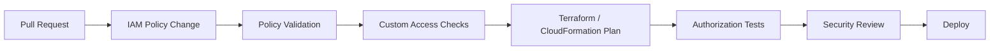
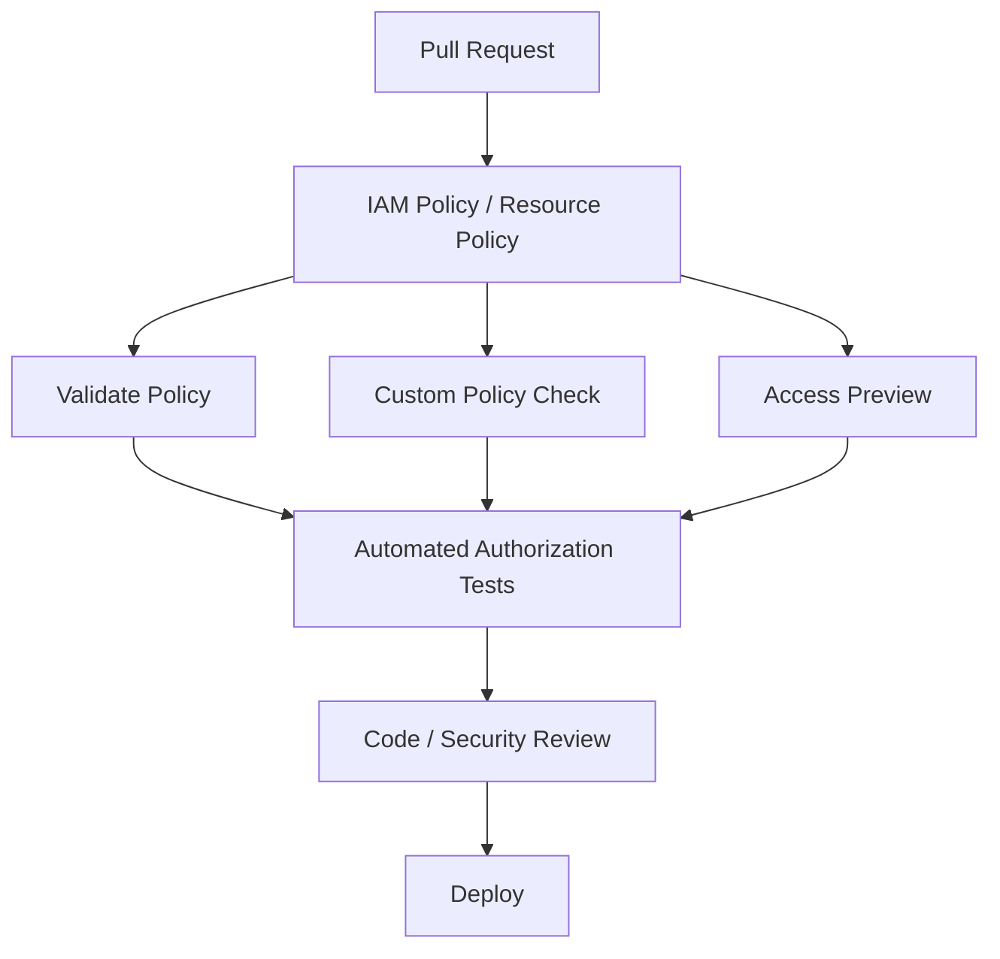
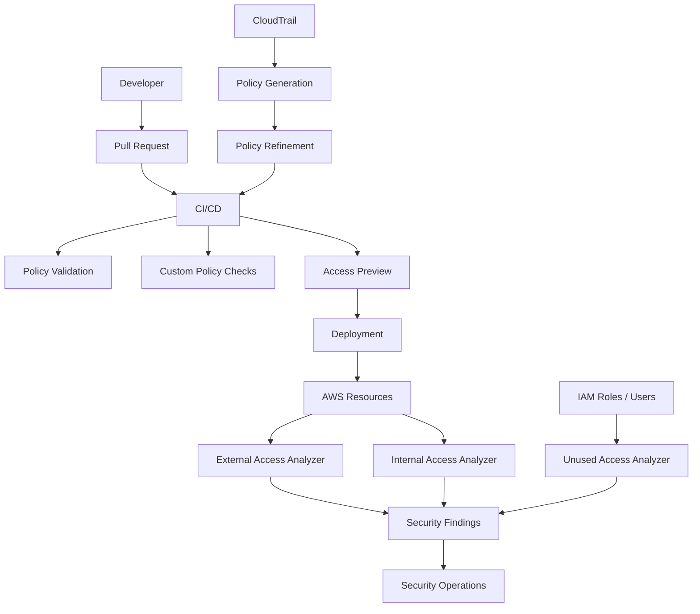

# 05- IAM Access Analyzer

## Overview

**IAM Access Analyzer** is an AWS security service that helps you analyze, validate, generate, and refine IAM permissions.

It is not a replacement for IAM policy evaluation. Instead, it provides a set of analysis capabilities around the authorization model:

```text
AWS IAM
    |
    +-- Policy Validation
    +-- External Access Analysis
    +-- Internal Access Analysis
    +-- Unused Access Analysis
    +-- Policy Generation
    +-- Custom Policy Checks
    +-- Access Previews
```

AWS describes IAM Access Analyzer as a suite for setting, verifying, and refining IAM policies. Its capabilities include findings for external, internal, and unused access, policy validation, custom policy checks, policy generation, and access previews. ([AWS IAM Access Analyzer](https://docs.aws.amazon.com/IAM/latest/UserGuide/what-is-access-analyzer.html))

For production backend engineering, the most important use cases are:

```text
1. Detect unintended public or cross-account access.
2. Detect unused roles and permissions.
3. Validate IAM policies before deployment.
4. Generate narrower policies from observed activity.
5. Preview the authorization impact of resource-policy changes.
6. Enforce organization-specific policy standards.
```

Access Analyzer is therefore best understood as an **IAM analysis and assurance layer** around your existing authorization architecture.

---

## Why IAM Access Analyzer Matters

IAM policies become difficult to manage as infrastructure grows.

A production organization may have:

```text
Hundreds of AWS accounts
Thousands of IAM roles
Thousands of policies
ECS services
EKS workloads
Lambda functions
Cross-account roles
S3 bucket policies
SQS/SNS resource policies
KMS key policies
CI/CD identities
Federated users
```

Manually reviewing all possible access paths is not realistic.

Access Analyzer helps answer questions such as:

```text
Who outside my trust boundary can access this S3 bucket?

Which internal principals can access this sensitive resource?

Which IAM roles have not been used?

Which permissions have not been used?

Does this policy introduce new access?

Does this resource policy expose a resource publicly?

What permissions were actually used by this role?
```

The service uses automated reasoning for access analysis and policy evaluation scenarios instead of relying only on text pattern matching. ([AWS IAM Access Analyzer findings](https://docs.aws.amazon.com/IAM/latest/UserGuide/access-analyzer-findings.html))

---

## What IAM Access Analyzer Is Not

Access Analyzer should not be treated as:

```text
A replacement for IAM
A replacement for CloudTrail
A replacement for application authorization
A vulnerability scanner for all AWS resources
A guarantee that every policy is least privilege
A replacement for security architecture
```

Instead:

```text
IAM
    Defines authorization

CloudTrail
    Records activity

IAM Access Analyzer
    Analyzes access relationships and policies

Security monitoring
    Detects operational and security events
```

These systems complement one another.

---

## Access Analyzer Capability Map

| Capability | Main question | Primary input |
|---|---|---|
| External access | Who outside the trust boundary can access this resource? | Resource-based policies |
| Internal access | Which trusted principals can access selected resources? | IAM/resource authorization |
| Unused access | Which roles, credentials, or permissions are unused? | IAM usage/access activity |
| Policy validation | Is this policy syntactically and semantically sound? | Policy JSON |
| Custom policy checks | Does this policy violate my authorization standard? | Policy + custom rule |
| Policy generation | What permissions did this identity actually use? | CloudTrail activity |
| Access preview | What access would exist if this resource policy were deployed? | Proposed resource configuration |

AWS currently documents these as separate Access Analyzer capabilities with different analyzer types and workflows. ([AWS Access Analyzer](https://docs.aws.amazon.com/IAM/latest/UserGuide/what-is-access-analyzer.html))

---

## External Access Analysis

External access analysis identifies resources that may be accessible by principals outside the analyzer's zone of trust.

For example:

```text
Production Account
    |
    └── S3 Bucket
          |
          └── Bucket Policy
                 |
                 └── External Account
```

Access Analyzer can report this as an external-access finding.

External principals can include:

```text
Another AWS account
IAM user
IAM role
Federated principal
AWS service
Anonymous/public principal
Root principal
```

AWS uses automated reasoning over resource-based policies to identify these access paths. ([AWS Access Analyzer external access](https://docs.aws.amazon.com/IAM/latest/UserGuide/access-analyzer-findings.html))

---

## Zone of Trust

The **zone of trust** defines the principals or accounts that are considered trusted for a particular analyzer.

Conceptually:

```text
AWS Organization
+-----------------------------+
|        Zone of Trust        |
|                             |
|  Account A                  |
|  Account B                  |
|  Account C                  |
|                             |
+-----------------------------+

             |
             | Access
             v

External Account
    ↓
Potential Finding
```

For an organization-level analyzer, the organization's accounts form the defined trust boundary for external-access analysis.

The result is:

```text
Inside zone of trust
    → Expected / trusted

Outside zone of trust
    → Potential external-access finding
```

The finding does not automatically mean the access is malicious or incorrect.

It means:

```text
There is an access path that crosses the analyzer's
defined trust boundary.
```

That path must then be reviewed against the intended architecture.

---

## External Access Example

Suppose a production S3 bucket has:

```json
{
    "Version": "2012-10-17",
    "Statement": [
        {
            "Sid": "ExternalRead",
            "Effect": "Allow",
            "Principal": {
                "AWS": "arn:aws:iam::999988887777:role/ReportingRole"
            },
            "Action": "s3:GetObject",
            "Resource": "arn:aws:s3:::company-prod-reports/*"
        }
    ]
}
```

If account `999988887777` is outside the analyzer's zone of trust, Access Analyzer can identify the cross-account relationship.

The important engineering workflow is:

```text
Finding
    ↓
Is external access intentional?
    ↓
Yes → Document / archive if appropriate
No  → Fix policy
```

---

## Public Access Findings

External access analysis can also identify access paths involving anonymous/public principals.

Example:

```text
S3 Bucket
    ↓
Bucket Policy
    ↓
Principal = "*"
    ↓
Public Access
```

This is particularly useful for resources such as:

```text
S3
SQS
SNS
KMS
Secrets Manager
ECR
IAM roles
Lambda
EFS
Snapshots
```

The exact resources supported by Access Analyzer vary by capability and AWS service. The current IAM documentation should be used when designing coverage. ([AWS Access Analyzer findings](https://docs.aws.amazon.com/IAM/latest/UserGuide/access-analyzer-findings.html))

---

## Internal Access Analysis

Internal access analysis answers a different question:

```text
Which principals inside my trusted environment
can access a selected resource?
```

This is useful when the organization wants to verify that sensitive resources are accessible only by intended internal identities.

Conceptually:

```text
AWS Organization
        |
        +-- Account A
        |     Role A
        |
        +-- Account B
              Role B

Sensitive Resource
        ↓
Internal Access Analyzer
        ↓
Which trusted principals can access it?
```

AWS currently supports internal-access analyzers for selected resource types and allows configuration to focus the analysis on selected accounts, resource types, or resource ARNs. ([AWS `create-analyzer`](https://docs.aws.amazon.com/cli/latest/reference/accessanalyzer/create-analyzer.html))

---

## External vs Internal Access

| Characteristic | External access | Internal access |
|---|---|---|
| Main goal | Detect access outside trust boundary | Understand access inside trust boundary |
| Typical concern | Public / cross-account sharing | Excessive internal access |
| Analyzer scope | Account / organization trust boundary | Selected internal resources |
| Finding type | `ExternalAccess` | `InternalAccess` |
| Typical use | S3 bucket exposure | Sensitive data access review |

The two capabilities answer different questions.

A resource can have:

```text
No external access
```

while still being accessible by too many internal principals.

This is why internal and external analysis should be considered separately.

---

## Unused Access Analysis

Unused-access analysis is focused on stale authorization.

It can identify findings such as:

```text
Unused IAM role
Unused IAM user access key
Unused IAM user password
Unused permissions
```

AWS documents these finding types for unused-access analyzers. ([AWS unused access findings](https://docs.aws.amazon.com/IAM/latest/UserGuide/access-analyzer-findings.html))

A useful lifecycle is:

```text
Permission granted
    ↓
Workload operates
    ↓
Usage observed
    ↓
No usage for defined window
    ↓
Finding
    ↓
Owner review
    ↓
Reduce / remove / document exception
```

Unused access analysis is one of the most useful tools for maintaining least privilege over time.

---

## Unused Access Analyzer Scope

Unused-access analyzers can be created for:

```text
Single account
```

or:

```text
AWS Organization
```

The analysis age can be configured from **1 to 365 days**. AWS states that unused access findings are based on the configured usage window. ([AWS unused access analyzer configuration](https://docs.aws.amazon.com/cli/latest/reference/accessanalyzer/create-analyzer.html))

For example:

```text
Unused access age = 90 days
```

means Access Analyzer can identify access that has not been used for 90 or more days based on its analysis.

A 90-day window should not automatically be treated as universally correct.

Choose the window based on:

```text
Workload frequency
Compliance requirements
Business cycles
Operational workflows
Disaster-recovery procedures
Seasonal jobs
```

---

## Unused Role Detection

Example:

```text
PaymentsWorkerRole
    Created: 8 months ago
    Last activity: never
```

This can indicate:

```text
Unused deployment
Deleted application
Stale infrastructure
Abandoned experiment
Incomplete migration
```

Do not immediately delete the role.

First identify:

```text
Owner
Purpose
Infrastructure reference
IaC definition
Scheduled usage
Disaster-recovery dependency
```

---

## Unused Permission Detection

A role can be active while still having unnecessary permissions.

Example:

```text
OrdersWorkerRole

Used:
    sqs:ReceiveMessage
    sqs:DeleteMessage
    cloudwatch:PutMetricData

Unused:
    s3:DeleteObject
    iam:PassRole
    ec2:TerminateInstances
```

This is much more valuable than simply identifying the whole role as "used."

Unused permission findings can therefore support fine-grained least-privilege reduction. ([AWS IAM Access Analyzer findings](https://docs.aws.amazon.com/IAM/latest/UserGuide/access-analyzer-findings.html))

---

## Unused Access Key Detection

Legacy IAM-user access keys are a common source of credential debt.

Example:

```text
deployment-user
    AccessKey A
        Active
        Last used: 270 days ago
```

The appropriate response might be:

```text
Identify owner
    ↓
Confirm no scheduled dependency
    ↓
Deactivate
    ↓
Monitor
    ↓
Delete
```

This should complement the broader strategy of migrating from IAM-user keys to role-based temporary credentials.

---

## Unused Password Detection

Unused-access analysis can also identify IAM user console passwords that have not been used during the configured analysis period.

This is useful for identifying:

```text
Legacy IAM users
Unused console access
Offboarded users
Emergency accounts no longer required
```

The correct response may be:

```text
Remove IAM user
or
Remove password
or
Migrate identity to federation / Identity Center
```

---

## Policy Validation

Policy validation is a static analysis capability.

It evaluates a policy against:

```text
IAM policy grammar
AWS best-practice checks
Known policy issues
Security warnings
Suggestions
```

You can use it before attaching or deploying a policy.

The recommended workflow is:

```text
Write policy
    ↓
Validate with Access Analyzer
    ↓
Resolve findings
    ↓
Run authorization tests
    ↓
Deploy
```

AWS recommends IAM Access Analyzer policy validation for customer-managed IAM policies created through the console or CLI. ([AWS policy validation](https://docs.aws.amazon.com/IAM/latest/UserGuide/access-analyzer-policy-validation.html))

---

## Policy Validation vs Policy Evaluation

These are different.

### Policy Validation

```text
Is this policy well-formed and does it contain
known problems or warnings?
```

### Policy Evaluation

```text
Given this request context,
should AWS allow or deny the request?
```

Example:

```text
Policy:
    syntactically valid

Access Analyzer:
    no validation error

Actual request:
    AccessDenied
```

This can still happen because:

```text
SCP
Permissions boundary
Resource policy
Trust policy
Condition context
Explicit deny
Credential identity
```

may affect the final decision.

Access Analyzer validates policy definitions; it does not replace runtime IAM authorization troubleshooting.

---

## Policy Validation Finding Types

Access Analyzer policy validation can produce findings such as:

```text
Errors
Security warnings
General warnings
Suggestions
```

The significance depends on the finding.

A production CI/CD pipeline should distinguish:

```text
Blocking findings
Advisory findings
Accepted exceptions
```

rather than treating every message identically.

AWS recommends resolving policy validation findings and thoroughly testing modified policies before using them in production. ([AWS policy validation](https://docs.aws.amazon.com/IAM/latest/UserGuide/access-analyzer-policy-validation.html))

---

## CLI: Validate a Policy

Create a policy file:

```json
{
    "Version": "2012-10-17",
    "Statement": [
        {
            "Sid": "ReadReports",
            "Effect": "Allow",
            "Action": "s3:GetObject",
            "Resource": "arn:aws:s3:::company-reports-prod/reports/*"
        }
    ]
}
```

Validate it:

```bash
aws accessanalyzer validate-policy \
    --policy-document file://policy.json \
    --policy-type IDENTITY_POLICY
```

For a resource policy:

```bash
aws accessanalyzer validate-policy \
    --policy-document file://bucket-policy.json \
    --policy-type RESOURCE_POLICY
```

AWS exposes `validate-policy` through both the CLI and API. ([AWS `ValidatePolicy`](https://docs.aws.amazon.com/access-analyzer/latest/APIReference/API_ValidatePolicy.html))

---

## Custom Policy Checks

Custom policy checks allow you to enforce organization-specific authorization standards.

Examples:

```text
Do not grant iam:*
Do not grant s3:DeleteBucket
Do not grant AdministratorAccess
Do not grant access to production resources
Do not introduce access beyond the approved reference policy
```

AWS provides custom checks for:

```text
Check for new access
Check that specific access is not granted
Check for public access
```

These checks are available through AWS CLI, API, and applicable IAM console workflows. ([AWS custom policy checks](https://docs.aws.amazon.com/IAM/latest/UserGuide/access-analyzer-custom-policy-checks.html))

---

## Check for New Access

Suppose your current policy is:

```text
s3:GetObject
```

and a pull request changes it to:

```text
s3:GetObject
s3:DeleteObject
```

A custom policy check can compare:

```text
Existing Policy
      vs
New Policy
```

and identify that new access has been introduced.

The workflow becomes:

```text
Existing policy
    ↓
Pull request changes policy
    ↓
CheckNoNewAccess
    ↓
New permission detected
    ↓
Security review
```

AWS exposes this through the `CheckNoNewAccess` API and corresponding CLI capability. ([AWS `CheckNoNewAccess`](https://docs.aws.amazon.com/access-analyzer/latest/APIReference/API_CheckNoNewAccess.html))

---

## Check Access Not Granted

Custom policy checks can also verify that specific actions or resources are not granted.

For example:

```text
Forbidden:
    iam:CreateAccessKey
    iam:CreateUser
```

A CI pipeline can reject a policy that grants them.

This is useful for:

```text
Security guardrails
Production deployment roles
Application policies
Developer-created roles
Infrastructure repositories
```

AWS documents `check-access-not-granted` as one of the custom policy-check operations. ([AWS custom policy checks](https://docs.aws.amazon.com/IAM/latest/UserGuide/access-analyzer-custom-policy-checks.html))

---

## Check No Public Access

Resource policies can accidentally introduce public access.

A custom policy check can test whether a policy would grant public access for a supported resource type.

Example:

```text
S3 bucket policy
    ↓
CheckNoPublicAccess
    ↓
Potential public access?
```

This can be integrated into infrastructure CI/CD before production deployment.

AWS distinguishes this from access previews: the custom check evaluates whether the policy can grant public access without requiring an account-level access analyzer preview. ([AWS custom policy checks](https://docs.aws.amazon.com/IAM/latest/UserGuide/access-analyzer-checks-validating-policies.html))

---

## Custom Checks in CI/CD

A mature IAM pipeline can look like:



This shifts authorization validation left.

The important principle is:

```text
Security review before permission deployment
```

rather than:

```text
Deploy broadly
    ↓
Investigate later
```

---

## Policy Generation

IAM Access Analyzer can generate an IAM policy based on actual access activity recorded in CloudTrail.

The flow is:

```text
Broad Policy
    ↓
Application Runs
    ↓
CloudTrail Records API Calls
    ↓
Access Analyzer Analyzes Activity
    ↓
Generated Policy Template
    ↓
Engineer Reviews
    ↓
Policy Refined
```

AWS supports policy generation for IAM users and roles based on CloudTrail activity and service-last-accessed information. ([AWS IAM Access Analyzer policy generation](https://docs.aws.amazon.com/IAM/latest/UserGuide/access-analyzer-policy-generation.html))

---

## Policy Generation Time Window

IAM Access Analyzer policy generation can analyze a historical CloudTrail period of up to **90 days**. AWS documents a 90-day maximum for policy-generation CloudTrail analysis. ([AWS IAM Access Analyzer quotas](https://docs.aws.amazon.com/IAM/latest/UserGuide/access-analyzer-quotas.html))

This is important when analyzing:

```text
Batch workloads
Monthly jobs
Quarterly jobs
Disaster-recovery processes
Seasonal workloads
Rare operator workflows
```

A short observation period may produce an incomplete policy.

---

## Policy Generation Example

Suppose:

```text
Legacy Role
    AdministratorAccess
```

is used by a reporting service.

After observing the workload:

```text
CloudTrail
    ↓
Access Analyzer
    ↓
Detected:
    s3:GetObject
    secretsmanager:GetSecretValue
    cloudwatch:PutMetricData
```

The generated policy can become a starting point for:

```text
S3 read
+
specific secret access
+
CloudWatch metrics
```

This can substantially reduce permissions.

---

## Policy Generation Is Not Automatic Least Privilege

Generated policies are evidence-based, not guaranteed complete.

AWS specifically notes limitations around policy generation, including:

```text
Data events such as S3 data-event activity are not included
iam:PassRole is not tracked by CloudTrail for generation
Activity outside the selected period may be missing
Resources may require additional refinement
```

AWS recommends reviewing and customizing generated policies before attaching them to the entity. ([AWS policy generation](https://docs.aws.amazon.com/IAM/latest/UserGuide/access-analyzer-policy-generation.html))

Therefore:

```text
Generated Policy
    ≠
Production Policy
```

It is a strong starting point.

---

## `iam:PassRole` Limitation

`iam:PassRole` is especially important.

AWS documents that policy generation does not include `iam:PassRole` because this action is not tracked by CloudTrail in the way required by the generation workflow. ([AWS policy generation](https://docs.aws.amazon.com/IAM/latest/UserGuide/access-analyzer-policy-generation.html))

This means a generated policy may look complete while still missing:

```text
iam:PassRole
```

where the workload requires it.

Always review role-delegation requirements manually.

---

## Data Events Limitation

Policy generation does not identify action-level activity for data events such as Amazon S3 data events.

Therefore:

```text
CloudTrail management events
    ≠
Every application data operation
```

For applications that heavily use:

```text
S3 object operations
```

do not assume policy generation has observed every required S3 access. ([AWS policy generation](https://docs.aws.amazon.com/IAM/latest/UserGuide/access-analyzer-policy-generation.html))

This is an important production limitation.

---

## Access Preview

Access previews allow you to estimate Access Analyzer findings **before** deploying a resource-policy change.

For example:

```text
Current S3 Bucket Policy
        +
Proposed Bucket Policy
        ↓
Access Preview
        ↓
Expected access findings
```

This is valuable for infrastructure changes involving:

```text
S3
SQS
SNS
KMS
Secrets Manager
IAM roles
Lambda
ECR
Other supported resources
```

AWS documents access previews as a way to preview IAM Access Analyzer findings before deploying resource permissions. ([AWS `CreateAccessPreview`](https://docs.aws.amazon.com/access-analyzer/latest/APIReference/API_CreateAccessPreview.html))

---

## Access Preview vs Custom Public-Access Check

These are related but different.

| Capability | Access preview | Custom public-access check |
|---|---|---|
| Main purpose | Preview resulting access findings | Check whether policy can grant public access |
| Requires analyzer | Yes | No account/external analyzer context required |
| Works with proposed resource configuration | Yes | Policy input |
| Useful for | Change impact analysis | CI/CD guardrail |
| Typical use | Pre-deployment review | Policy validation |

AWS explicitly distinguishes access previews from custom public-access checks. ([AWS custom policy checks](https://docs.aws.amazon.com/IAM/latest/UserGuide/access-analyzer-checks-validating-policies.html))

---

## CLI: Create an Analyzer

For external-access analysis in a single account:

```bash
aws accessanalyzer create-analyzer \
    --analyzer-name production-external \
    --type ACCOUNT \
    --region ap-south-1
```

For an organization:

```bash
aws accessanalyzer create-analyzer \
    --analyzer-name organization-external \
    --type ORGANIZATION \
    --region ap-south-1
```

AWS supports account- and organization-level analyzers, with analyzer types also available for unused and internal access. ([AWS CLI `create-analyzer`](https://docs.aws.amazon.com/cli/latest/reference/accessanalyzer/create-analyzer.html))

---

## Unused Access Analyzer CLI Example

For an account-level unused-access analyzer with a 90-day window:

```bash
aws accessanalyzer create-analyzer \
    --analyzer-name production-unused \
    --type ACCOUNT_UNUSED_ACCESS \
    --configuration '{"unusedAccess":{"unusedAccessAge":90}}' \
    --region ap-south-1
```

Organization-level unused access can use:

```text
ORGANIZATION_UNUSED_ACCESS
```

AWS documents the supported analyzer types and the `unusedAccessAge` configuration. ([AWS CLI `create-analyzer`](https://docs.aws.amazon.com/cli/latest/reference/accessanalyzer/create-analyzer.html))

---

## List Analyzers

```bash
aws accessanalyzer list-analyzers \
    --region ap-south-1
```

Useful filtering:

```bash
aws accessanalyzer list-analyzers \
    --region ap-south-1 \
    --query 'analyzers[].{Name:name,Type:type,Status:status,Arn:arn}' \
    --output table
```

This helps establish:

```text
Which analyzers exist?
Which analyzer type?
Which Region?
What is the current status?
```

---

## List Findings

For current-generation findings:

```bash
aws accessanalyzer list-findings-v2 \
    --analyzer-arn arn:aws:access-analyzer:ap-south-1:123456789012:analyzer/production-external
```

Filter examples:

```bash
aws accessanalyzer list-findings-v2 \
    --analyzer-arn arn:aws:access-analyzer:ap-south-1:123456789012:analyzer/production-external \
    --filter '{"status":{"eq":["ACTIVE"]}}'
```

`list-findings-v2` supports external, internal, and unused access findings and is paginated. ([AWS CLI `list-findings-v2`](https://docs.aws.amazon.com/cli/latest/reference/accessanalyzer/list-findings-v2.html))

---

## Get a Finding

External-access findings can be inspected with:

```bash
aws accessanalyzer get-finding \
    --analyzer-arn arn:aws:access-analyzer:ap-south-1:123456789012:analyzer/production-external \
    --id <finding-id>
```

For internal and unused access findings, use:

```bash
aws accessanalyzer get-finding-v2 \
    --analyzer-arn arn:aws:access-analyzer:ap-south-1:123456789012:analyzer/production-unused \
    --id <finding-id>
```

AWS documents that `GetFinding` is for external-access analyzers, while `GetFindingV2` is used for internal and unused access findings. ([AWS `GetFinding`](https://docs.aws.amazon.com/IAM/latest/APIReference/API_GetFinding.html), [AWS CLI `get-finding-v2`](https://docs.aws.amazon.com/cli/latest/reference/accessanalyzer/get-finding-v2.html))

---

## Finding Lifecycle

Findings have operational states.

A common lifecycle is:

```text
ACTIVE
   ↓
Investigate
   ↓
Fix / intentionally accept
   ↓
RESOLVED or ARCHIVED
```

Typical statuses include:

```text
ACTIVE
ARCHIVED
RESOLVED
```

AWS documents these statuses for current Access Analyzer findings. ([AWS CLI `list-findings-v2`](https://docs.aws.amazon.com/cli/latest/reference/accessanalyzer/list-findings-v2.html))

---

## Active vs Archived Findings

### Active

The access relationship currently requires attention.

```text
Finding
    ↓
Security / architecture review
```

### Archived

The finding matches an intentional exception or archive rule.

For example:

```text
Known cross-account analytics role
    ↓
Approved architecture
    ↓
Archive rule
```

Archiving should not mean:

```text
Ignore forever
```

It should mean:

```text
Known and intentionally accepted
```

---

## Archive Rules

Archive rules automatically archive findings matching defined criteria.

Useful examples:

```text
Approved external account
Approved resource
Known third-party integration
Approved service principal
```

A mature organization should keep archive rules:

```text
Specific
Documented
Reviewed
Owned
```

Avoid a broad rule such as:

```text
Archive every external access finding
```

because it destroys the value of the analyzer.

AWS supports archive rules when creating or managing analyzers. ([AWS CLI `create-analyzer`](https://docs.aws.amazon.com/cli/latest/reference/accessanalyzer/create-analyzer.html))

---

## Zone of Trust Design

A poor zone-of-trust design can produce either:

```text
Too many findings
```

or:

```text
Too little visibility
```

For example:

```text
Only Production Account trusted
```

may cause every intended Development → Production relationship to appear as external.

That may be useful if the organization deliberately wants to review all cross-account boundaries.

The analyzer's trust boundary should therefore reflect the security architecture rather than simply matching organizational convenience.

---

## Organization-Level Analyzer

For a large AWS Organization:

```text
Management / Security Account
        ↓
Organization-Level Analyzer
        ↓
Member Accounts
        ↓
Central Findings
```

This can simplify:

```text
External-access analysis
Unused-access analysis
Security review
```

For unused access, AWS explicitly supports organization-level analyzers and notes that analysis is not region-dependent for unused-access findings, so creating one unused-access analyzer in every resource Region is not necessary. ([AWS create unused access analyzer](https://docs.aws.amazon.com/IAM/latest/UserGuide/access-analyzer-create-unused.html))

---

## Regional Behavior

Access Analyzer is regional for several analyzer types and resource analyses.

For example:

```text
Account-level external analyzer
    ↓
Created in a Region
```

The service quotas also define account-level and organization-level analyzer limits per Region for applicable analyzer types. ([AWS Access Analyzer quotas](https://docs.aws.amazon.com/IAM/latest/UserGuide/access-analyzer-quotas.html))

Unused access analysis is different: AWS documents that unused-access findings do not change based on Region, so you do not need one unused-access analyzer in every resource Region. ([AWS create unused access analyzer](https://docs.aws.amazon.com/IAM/latest/UserGuide/access-analyzer-create-unused.html))

Always distinguish:

```text
Analyzer configuration scope
```

from:

```text
AWS resource Region
```

---

## Analyzer Quotas

Current Access Analyzer quotas include:

| Resource | Default |
|---|---:|
| Account-level analyzers per type per account per Region | 1 |
| Organization-level external/unused analyzers per account per Region | 5 |
| Organization-level internal analyzers per organization per Region | 1 |
| Archive rules per analyzer | 100 |
| Access previews per analyzer per hour | 1,000 |
| Concurrent policy generations | 1 |
| Policy-generation CloudTrail window | 90 days |
| Policy-generation CloudTrail data | 25 GB |

Some quotas are adjustable. AWS maintains the current quota values separately because service limits can change. ([AWS IAM Access Analyzer quotas](https://docs.aws.amazon.com/IAM/latest/UserGuide/access-analyzer-quotas.html), [AWS General Reference](https://docs.aws.amazon.com/general/latest/gr/access-analyzer.html))

---

## IAM Access Analyzer Permissions

The identity operating Access Analyzer requires IAM permissions for the actions it performs.

Examples include:

```text
access-analyzer:CreateAnalyzer
access-analyzer:ListAnalyzers
access-analyzer:ListFindings
access-analyzer:GetFinding
access-analyzer:GetFindingV2
access-analyzer:ValidatePolicy
access-analyzer:StartPolicyGeneration
access-analyzer:GetGeneratedPolicy
access-analyzer:CheckNoNewAccess
```

Policy-generation workflows can additionally require:

```text
CloudTrail permissions
IAM role permissions
Service-specific read permissions
```

AWS documents the permissions required by policy-generation workflows and other Access Analyzer operations. ([AWS policy generation](https://docs.aws.amazon.com/IAM/latest/UserGuide/access-analyzer-policy-generation.html))

---

## Policy Generation Service Role

Policy generation requires Access Analyzer to inspect CloudTrail data.

Conceptually:

```text
Access Analyzer
    ↓
Service Role
    ↓
CloudTrail Trail
    ↓
S3 / CloudTrail data
```

The generated policy is based on observed access activity during the selected period.

The service role must be appropriately configured to allow Access Analyzer to retrieve the required information. AWS documents the required permissions and setup for policy generation. ([AWS policy generation](https://docs.aws.amazon.com/IAM/latest/UserGuide/access-analyzer-policy-generation.html))

---

## CloudTrail Dependency

Policy generation depends on CloudTrail data.

The architecture is:

```text
Application
    ↓
AWS API calls
    ↓
CloudTrail
    ↓
Access Analyzer
    ↓
Generated policy
```

If the relevant activity was not recorded:

```text
No CloudTrail event
    ↓
No evidence for policy generation
```

This makes CloudTrail configuration an important prerequisite for effective policy-generation workflows.

---

## Access Analyzer vs CloudTrail

| Capability | Access Analyzer | CloudTrail |
|---|---|---|
| Record AWS API activity | No | Yes |
| Analyze external resource sharing | Yes | No |
| Detect unused access | Yes | Indirect input |
| Validate IAM policies | Yes | No |
| Generate IAM policy | Yes | Provides activity data |
| Incident investigation | Supporting tool | Primary audit source |
| Authorization preview | Yes | No |

CloudTrail should remain the authoritative audit source for API activity.

AWS explicitly recommends using CloudTrail for auditing rather than relying on policy generation. ([AWS policy generation](https://docs.aws.amazon.com/IAM/latest/UserGuide/access-analyzer-policy-generation.html))

---

## Access Analyzer vs IAM Policy Simulator

These tools solve different problems.

| Tool | Main purpose |
|---|---|
| IAM Policy Simulator | Test whether a specific principal/request is allowed |
| Access Analyzer | Analyze access relationships and policy behavior |
| Access Analyzer validation | Validate policy syntax and best-practice findings |
| Access Analyzer policy generation | Derive policy from observed activity |
| Access Analyzer preview | Preview proposed resource access |

A production workflow can use several together.

Example:

```text
Policy change
    ↓
Access Analyzer validation
    ↓
Custom policy check
    ↓
Access preview
    ↓
Policy Simulator / integration tests
    ↓
Deploy
```

---

## Access Analyzer vs Access Advisor

Access Advisor provides last-accessed information for services and actions associated with IAM entities.

Access Analyzer goes further by providing:

```text
External access findings
Internal access analysis
Unused access findings
Policy validation
Policy generation
Custom policy checks
Access previews
```

Last-accessed information remains useful for permission review, but Access Analyzer can provide a broader continuous analysis model. ([AWS IAM Access Analyzer](https://docs.aws.amazon.com/IAM/latest/UserGuide/what-is-access-analyzer.html))

---

## Access Analyzer and Least Privilege

A strong least-privilege workflow is:

```text
Broad initial policy
        ↓
Workload runs
        ↓
CloudTrail captures usage
        ↓
Policy generation
        ↓
Human review
        ↓
Narrow policy
        ↓
Unused-access monitoring
        ↓
Continuous refinement
```

This is stronger than attempting to predict every permission before the workload has operated.

However, rare and future operations must still be considered.

---

## Policy Generation and Scheduled Jobs

Suppose a role runs:

```text
Daily:
    S3 read

Monthly:
    Billing API
```

If the observation period or usage window does not include the monthly operation, generated or unused-access analysis can produce misleading results.

Therefore:

```text
Usage window
    must reflect
    workload schedule
```

This is especially important for:

```text
Airflow
Celery beat
Monthly billing jobs
Quarterly reporting
Disaster recovery
Security automation
```

---

## Access Analyzer With Django

A Django service might have:

```text
Django
    ↓
ECS Task Role
    ↓
S3 + Secrets Manager + SQS
```

Access Analyzer can help:

```text
Validate the task-role policy
Detect unintended external resource sharing
Identify unused role permissions
Generate a policy from observed API usage
```

The Django code does not need to integrate directly with Access Analyzer.

Access Analyzer operates as an infrastructure/security control around the workload.

---

## Access Analyzer With FastAPI

For a FastAPI service:

```text
FastAPI
    ↓
Task Role
    ↓
SQS
    ↓
S3
```

A least-privilege workflow could be:

```text
1. Start with required role access.
2. Generate or validate policy.
3. Run the service.
4. Observe CloudTrail activity.
5. Generate a candidate policy.
6. Review missing or unnecessary actions.
7. Run integration tests.
8. Deploy refined policy.
9. Monitor unused permissions.
```

This is especially useful for microservices where each service should have its own IAM identity.

---

## Access Analyzer With EKS

For EKS:

```text
Pod
    ↓
EKS Pod Identity / IRSA
    ↓
IAM Role
    ↓
AWS APIs
```

Access Analyzer can help analyze:

```text
External resource exposure
Role permissions
Unused permissions
Policy correctness
```

The workload identity mechanism remains separate from Access Analyzer.

```text
EKS Pod Identity
    Establishes AWS identity

Access Analyzer
    Evaluates / analyzes authorization posture
```

---

## Access Analyzer With CI/CD

A strong CI/CD IAM control plane can be:



This allows policy failures to be detected before deployment.

For critical production policy changes:

```text
No validation
    →
No deployment
```

can be enforced as a CI/CD policy where organizational requirements justify it.

---

## Terraform Integration Pattern

IAM Access Analyzer is generally consumed alongside infrastructure-as-code rather than embedded in Terraform resource definitions themselves.

A pipeline can run:

```text
Terraform
    ↓
Render policy JSON
    ↓
Access Analyzer validation
    ↓
Custom policy checks
    ↓
Access preview where applicable
    ↓
Terraform plan
    ↓
Human review
    ↓
Apply
```

This keeps the authorization analysis close to the infrastructure change.

---

## Policy Review Example

Suppose a pull request changes:

```json
{
    "Action": [
        "s3:GetObject"
    ]
}
```

to:

```json
{
    "Action": [
        "s3:GetObject",
        "s3:DeleteObject",
        "s3:PutObject"
    ]
}
```

A custom `CheckNoNewAccess` workflow can identify that the new policy adds capabilities.

The security reviewer can then ask:

```text
Why does this service need write access?
Why does it need delete access?
Which bucket?
Which prefix?
Is the permission required in production?
```

This shifts review from:

```text
"Does the JSON look correct?"
```

to:

```text
"What authorization capability is changing?"
```

---

## Finding Triage

Not every finding represents a vulnerability.

A useful classification is:

| Finding | Possible interpretation |
|---|---|
| Unexpected public access | Likely security issue |
| Approved cross-account role | Expected architecture |
| Unused role | Candidate for cleanup |
| Unused permission | Candidate for reduction |
| Internal access by platform role | Possibly expected |
| Third-party external access | May be intentional |
| Unknown principal | Requires investigation |

Treat findings as:

```text
Evidence for review
```

rather than:

```text
Automatic proof of compromise
```

---

## Finding Ownership

Every persistent finding should have an owner.

Example:

```text
Finding:
    S3 bucket externally accessible

Owner:
    Data Platform Team

Reason:
    Approved analytics account

Disposition:
    Archived

Review:
    Quarterly
```

Without ownership:

```text
Finding
    ↓
Ignored
    ↓
Security backlog grows
    ↓
Real findings get buried
```

Access Analyzer is only useful when findings become operational work.

---

## Finding SLA

A mature security program can define response expectations:

```text
Critical public exposure
    Immediate

Unexpected production cross-account access
    Same business day

Unused privileged role
    Defined remediation window

Low-risk unused permission
    Scheduled review
```

The exact SLA is organization-specific.

The important point is to distinguish:

```text
Risk
+
Business criticality
+
Expected architecture
```

rather than treating every finding equally.

---

## Archive Strategy

Archive a finding only when:

```text
Access is intentional
+
Owner is known
+
Reason is documented
+
Exception is acceptable
```

Example:

```text
Central Security Account
    ↓
Production S3 buckets
```

may intentionally require cross-account access.

That relationship should be:

```text
Approved
Documented
Monitored
Archived when appropriate
```

An archive rule should encode the stable exception rather than suppressing an entire class of security findings.

---

## Security Considerations

IAM Access Analyzer itself should be protected with least privilege.

Not every developer needs:

```text
access-analyzer:CreateAnalyzer
access-analyzer:DeleteAnalyzer
access-analyzer:UpdateAnalyzer
```

A practical separation is:

```text
Platform / Security
    Manage analyzers

Developers
    Validate policies
    View relevant findings

CI/CD
    Run policy checks
```

The exact permissions should reflect organizational governance.

---

## Sensitive Findings

Findings can contain:

```text
Resource ARN
Principal ARN
Account IDs
Actions
Conditions
Policy-related details
```

Treat Access Analyzer findings as security-sensitive metadata.

Protect:

```text
Security dashboards
Tickets
SIEM exports
Chat notifications
CI logs
Automation output
```

Do not unnecessarily expose internal account topology.

---

## Access Analyzer and Security Hub

Access Analyzer findings can be integrated into broader AWS security workflows.

A mature environment may centralize:

```text
IAM Access Analyzer
AWS Config
Security Hub
GuardDuty
CloudTrail
EventBridge
SIEM
```

Conceptually:

```text
AWS Accounts
    ↓
Security Services
    ↓
Central Security Account
    ↓
Findings / Events
    ↓
SOC / Platform Team
```

The exact integration depends on the organization's security architecture.

---

## Reliability Considerations

Access Analyzer is a security-assurance tool, not usually part of the application request path.

Therefore:

```text
Access Analyzer unavailable
    ≠
Application unavailable
```

This is desirable.

Policy validation and analysis should occur:

```text
Before deployment
During review
During continuous monitoring
```

rather than becoming a runtime dependency for every API request.

---

## Scalability Considerations

Large organizations should choose analyzer scope carefully.

For example:

```text
Organization-level external analyzer
    ↓
Centralized review

Organization-level unused analyzer
    ↓
Centralized stale-access review

Account-level analyzers
    ↓
Specialized account-specific analysis
```

Do not create analyzers independently in every account and Region without understanding:

```text
Analyzer quotas
Duplicate coverage
Operational ownership
Cost
Finding volume
```

AWS has explicit quotas for analyzer counts, archive rules, access previews, and policy-generation workloads. ([AWS IAM Access Analyzer quotas](https://docs.aws.amazon.com/IAM/latest/UserGuide/access-analyzer-quotas.html))

---

## Cost Considerations

Access Analyzer pricing differs by capability.

AWS currently documents that:

```text
External access analysis
    No charge

Unused access analysis
    Charged based on IAM roles/users analyzed

Internal access analysis
    Charged based on resources monitored

Custom policy checks
    Charges associated with checks for new access
```

AWS pricing can change, so production cost models should reference the current IAM Access Analyzer pricing documentation rather than hard-coding pricing assumptions into internal runbooks. ([AWS IAM Access Analyzer](https://docs.aws.amazon.com/IAM/latest/UserGuide/what-is-access-analyzer.html), [AWS IAM Access Analyzer pricing](https://aws.amazon.com/iam/access-analyzer/pricing/))

---

## Operational Runbook

A useful operational workflow is:

```text
Daily
    ↓
Review critical active findings

Weekly
    ↓
Review new external/public findings

Monthly
    ↓
Review unused roles/permissions
    ↓
Review archived exceptions

Per IAM change
    ↓
Validate policy
    ↓
Run custom checks
    ↓
Preview resource access where applicable

Quarterly
    ↓
Review trust boundaries
    ↓
Review analyzer scope
    ↓
Review archive rules
    ↓
Review analyzer costs
```

The frequency should match the organization's risk profile.

---

## Policy Quality Gate

A practical IAM policy quality gate can be:

```text
Policy JSON
    ↓
Syntax validation
    ↓
Access Analyzer validation
    ↓
Custom security checks
    ↓
Resource scope review
    ↓
Trust review
    ↓
Access preview
    ↓
Integration test
    ↓
Deployment
```

For application roles, also verify:

```text
Expected API calls succeed
Unexpected API calls fail
```

Negative authorization tests are especially valuable.

---

## Negative Authorization Testing

Example:

```text
OrdersRole

sqs:SendMessage
    orders-events
    ✅

sqs:SendMessage
    payments-events
    ❌

sqs:DeleteQueue
    orders-events
    ❌

iam:PassRole
    production-admin
    ❌
```

Access Analyzer can improve policy analysis, but authorization tests should still verify application behavior.

The combination is stronger than either technique alone.

---

## Access Analyzer and Incident Response

During a security incident, Access Analyzer can help answer:

```text
Which resources are publicly accessible?

Which resources are shared with external accounts?

Which principals have access?

Which roles have unused or stale permissions?

Did a policy change expose a resource?
```

Combine the analysis with CloudTrail:

```text
Access Analyzer
    What access is possible?

CloudTrail
    What actually happened?
```

This distinction is essential in incident response.

---

## Incident Example

Suppose an S3 bucket policy is accidentally changed:

```text
Before:
    Internal platform role only

After:
    External account + public principal
```

A strong control system is:

```text
Pull Request
    ↓
Access Analyzer validation
    ↓
Custom public-access check
    ↓
Access preview
    ↓
Policy rejected before deployment
```

If the change reaches production:

```text
Access Analyzer finding
    ↓
Security alert
    ↓
CloudTrail policy-change event
    ↓
Incident response
```

This provides both preventive and detective controls.

---

## Common Mistakes

| Mistake | Why it happens | Better approach |
|---|---|---|
| Treating Access Analyzer as a firewall | Tool sounds like enforcement | Understand it as analysis/validation |
| Validating policy only after deployment | IAM changes are seen as configuration | Add validation to CI/CD |
| Archiving every finding | Finding volume becomes inconvenient | Archive only approved exceptions |
| Assuming every finding is a vulnerability | Findings are interpreted literally | Review business intent and trust boundary |
| Relying only on policy generation | Generated policy looks authoritative | Review rare and missing activity |
| Ignoring `iam:PassRole` during policy generation | Generation does not include it | Review role delegation manually |
| Ignoring CloudTrail configuration | Generation has incomplete evidence | Ensure required CloudTrail logging exists |
| Treating last-used data as perfect | "Unused" seems definitive | Consider schedules and dormant workflows |
| Creating analyzers everywhere | More analyzers feel safer | Design scope intentionally |
| Ignoring regional scope | Access Analyzer behavior varies by analyzer type | Understand analyzer/resource Region model |
| Using `get-finding` for every analyzer type | Older API is familiar | Use `get-finding-v2` for internal/unused findings |
| Sending all findings to developers | Security metadata can be noisy | Route findings according to ownership and severity |
| Allowing developers to suppress findings freely | Reduces operational noise | Govern archive rules |
| Skipping negative tests | Policy validation passes | Test expected denies |

---

## Policy Generation Pitfalls

### Short Observation Windows

```text
Analyze 7 days
    ↓
Monthly job not observed
    ↓
Generated policy incomplete
```

### Data Events Missing

```text
S3 object access
    ↓
Not represented as action-level activity
    ↓
Generated policy may be incomplete
```

### `iam:PassRole` Missing

```text
Policy generation
    ↓
PassRole not included
    ↓
Deployment policy appears incomplete
```

AWS documents these limitations explicitly. ([AWS policy generation](https://docs.aws.amazon.com/IAM/latest/UserGuide/access-analyzer-policy-generation.html))

---

## Unused Access Pitfalls

### Seasonal Workloads

```text
Quarterly reporting role
    ↓
No activity for 80 days
    ↓
Unused finding
```

The role may be entirely legitimate.

### Disaster Recovery Roles

```text
Primary environment
    ↓
DRRole not used for months
```

That does not mean the role should necessarily be deleted.

### Break-Glass Access

Emergency roles are expected to be unused most of the time.

Therefore:

```text
Unused
    ≠
Unnecessary
```

The correct operational response is:

```text
Review
+
Document
+
Classify
```

not automatic deletion.

---

## Policy Validation Pitfalls

A policy can:

```text
Pass syntax validation
```

and still be:

```text
Overly broad
Operationally wrong
Incompatible with an SCP
Incompatible with a permissions boundary
Too broad for production
```

Therefore:

```text
Validation
    +
Authorization testing
    +
Architecture review
```

are all required.

---

## Senior-Level Mental Model

Think of IAM Access Analyzer as a set of specialized analysis engines:

```text
                 IAM Access Analyzer
                         |
        +----------------+----------------+
        |                |                |
   Access Findings   Policy Analysis   Policy Refinement
        |                |                |
        |                |                |
    External          Validation      Generation
    Internal          Custom Checks
    Unused            Previews
```

The key distinction is:

```text
Finding
    tells you about access

Validation
    tells you about policy quality

Generation
    suggests policy from observed usage

Preview
    estimates future access

IAM
    ultimately enforces authorization
```

This mental model prevents overestimating what Access Analyzer does.

---

## Production Architecture

A mature AWS security platform can integrate Access Analyzer into both prevention and detection:



This creates two complementary loops:

```text
Preventive loop
    Policy change
    ↓
    Validate
    ↓
    Preview
    ↓
    Deploy

Detective / refinement loop
    AWS environment
    ↓
    Analyze
    ↓
    Find
    ↓
    Review
    ↓
    Remediate
```

---

## Recommended Adoption Strategy

### Stage One: Visibility

Start with:

```text
External access analyzer
```

and establish visibility into:

```text
Public access
Cross-account access
Third-party integrations
```

### Stage Two: Least Privilege

Add:

```text
Unused access analyzer
```

and review:

```text
Unused roles
Unused permissions
Unused access keys
Unused passwords
```

### Stage Three: Policy Quality

Add:

```text
Policy validation
Custom policy checks
```

to IAM infrastructure CI/CD.

### Stage Four: Policy Refinement

Use:

```text
CloudTrail
+
Policy generation
```

to reduce broad permissions.

### Stage Five: Preventive Access Preview

For sensitive resource-policy changes:

```text
Access Preview
```

can be added before deployment.

This progression avoids trying to automate everything at once.

---

## Governance Model

A centralized IAM governance model might assign responsibilities like:

| Responsibility | Typical owner |
|---|---|
| Analyzer configuration | Cloud Security / Platform |
| Archive-rule governance | Security |
| IAM policy development | Application / Platform teams |
| Custom policy standards | Security |
| Finding remediation | Resource owner |
| Policy-generation review | Application / Platform owner |
| CloudTrail retention | Security / Platform |
| Organization-level analyzers | Cloud Security |
| CI/CD integration | Platform Engineering |

Clear ownership prevents Access Analyzer from becoming another dashboard that nobody operates.

---

## Production Checklist

Before adopting IAM Access Analyzer as a production security control, verify:

```text
Analyzer Strategy
    □ External access analyzers are configured
    □ Internal access analysis is evaluated for sensitive resources
    □ Unused access analysis is configured where appropriate
    □ Analyzer scope matches account / organization boundaries
    □ Regional behavior is understood

Policy Quality
    □ IAM policies are validated before deployment
    □ Custom policy checks enforce organization standards
    □ New-access checks protect sensitive policy changes
    □ Public-access checks are used for critical resource policies
    □ Access previews are used for high-impact resource changes

Least Privilege
    □ Unused roles are reviewed
    □ Unused permissions are reviewed
    □ Unused credentials are reviewed
    □ IAM user populations are reviewed
    □ Generated policies are manually refined

CloudTrail
    □ Required trails exist
    □ Policy-generation data is available
    □ Retention supports the review window
    □ Data-event limitations are understood
    □ iam:PassRole limitations are understood

Findings
    □ Findings have owners
    □ Severity / business impact is classified
    □ Archive rules are documented
    □ Archive rules are reviewed
    □ Critical findings have defined response SLAs

CI/CD
    □ Policy validation runs in pull requests
    □ Custom checks run before production
    □ Authorization tests include expected denies
    □ IAM changes are version controlled

Operations
    □ Analyzer health is monitored
    □ Finding volume is reviewed
    □ Analyzer quotas are understood
    □ Access Analyzer costs are monitored
    □ Security teams can investigate findings centrally

Architecture
    □ Access Analyzer is not treated as the runtime authorization engine
    □ CloudTrail remains the audit source
    □ IAM policy evaluation remains the enforcement mechanism
    □ Application authorization remains separate from IAM
```

## AWS Documentation Links

- [Using IAM Access Analyzer](https://docs.aws.amazon.com/IAM/latest/UserGuide/what-is-access-analyzer.html)
- [IAM Access Analyzer findings](https://docs.aws.amazon.com/IAM/latest/UserGuide/access-analyzer-findings.html)
- [Understanding Access Analyzer findings](https://docs.aws.amazon.com/IAM/latest/UserGuide/access-analyzer-concepts.html)
- [Policy validation with IAM Access Analyzer](https://docs.aws.amazon.com/IAM/latest/UserGuide/access-analyzer-policy-validation.html)
- [Custom policy checks](https://docs.aws.amazon.com/IAM/latest/UserGuide/access-analyzer-custom-policy-checks.html)
- [Checks for validating policies](https://docs.aws.amazon.com/IAM/latest/UserGuide/access-analyzer-checks-validating-policies.html)
- [IAM Access Analyzer policy generation](https://docs.aws.amazon.com/IAM/latest/UserGuide/access-analyzer-policy-generation.html)
- [Generate policies from access activity](https://docs.aws.amazon.com/IAM/latest/UserGuide/getting-started_reduce-permissions-edit-policy.html)
- [Create unused access analyzer](https://docs.aws.amazon.com/IAM/latest/UserGuide/access-analyzer-create-unused.html)
- [Manage unused access analyzer](https://docs.aws.amazon.com/IAM/latest/UserGuide/access-analyzer-manage-unused.html)
- [IAM Access Analyzer quotas](https://docs.aws.amazon.com/IAM/latest/UserGuide/access-analyzer-quotas.html)
- [AWS CLI Access Analyzer commands](https://docs.aws.amazon.com/cli/latest/reference/accessanalyzer/)
- [AWS CLI `create-analyzer`](https://docs.aws.amazon.com/cli/latest/reference/accessanalyzer/create-analyzer.html)
- [AWS CLI `list-findings-v2`](https://docs.aws.amazon.com/cli/latest/reference/accessanalyzer/list-findings-v2.html)
- [AWS CLI `get-finding-v2`](https://docs.aws.amazon.com/cli/latest/reference/accessanalyzer/get-finding-v2.html)
- [AWS CLI Access Analyzer examples](https://docs.aws.amazon.com/cli/latest/userguide/cli_accessanalyzer_code_examples.html)
- [IAM Access Analyzer API Reference](https://docs.aws.amazon.com/access-analyzer/latest/APIReference/Welcome.html)
- [IAM Access Analyzer pricing](https://aws.amazon.com/iam/access-analyzer/pricing/)

## Key Takeaways

- **IAM Access Analyzer is an analysis and assurance layer around IAM, not a replacement for IAM enforcement:** it helps identify external, internal, and unused access, validate policies, generate policy candidates, run custom security checks, and preview access before deployment.
- **Use the right capability for the right question:** external analysis finds access outside the trust boundary, internal analysis examines trusted-principal access, unused analysis identifies stale permissions and credentials, while validation and custom checks protect policy changes.
- **Policy generation is a refinement tool, not an automatic least-privilege solution:** it relies on CloudTrail activity, supports up to a 90-day analysis period, and has important limitations including data-event coverage and `iam:PassRole`. ([AWS policy generation](https://docs.aws.amazon.com/IAM/latest/UserGuide/access-analyzer-policy-generation.html))
- **Integrate Access Analyzer into the IAM lifecycle:** validate policies and run custom checks before deployment, use access previews for sensitive resource-policy changes, then continuously review findings and unused access after deployment.
- **The highest-value production model combines Access Analyzer with IAM, CloudTrail, CI/CD, and security operations:** IAM enforces permissions, CloudTrail records activity, Access Analyzer analyzes authorization posture, and engineering/security teams own remediation.