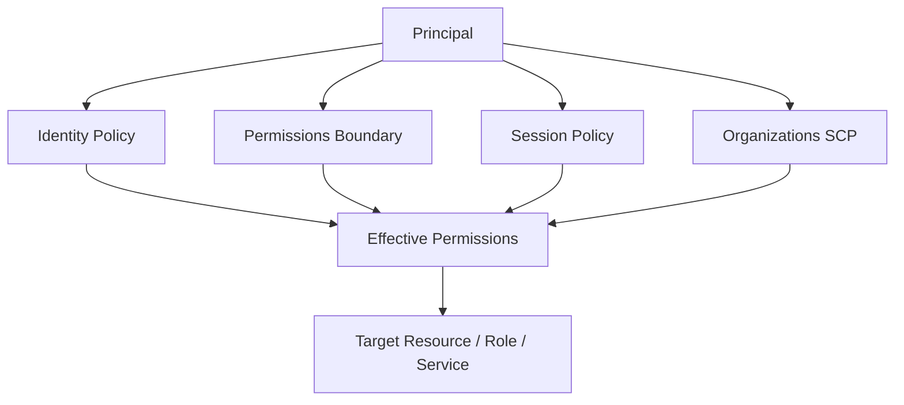
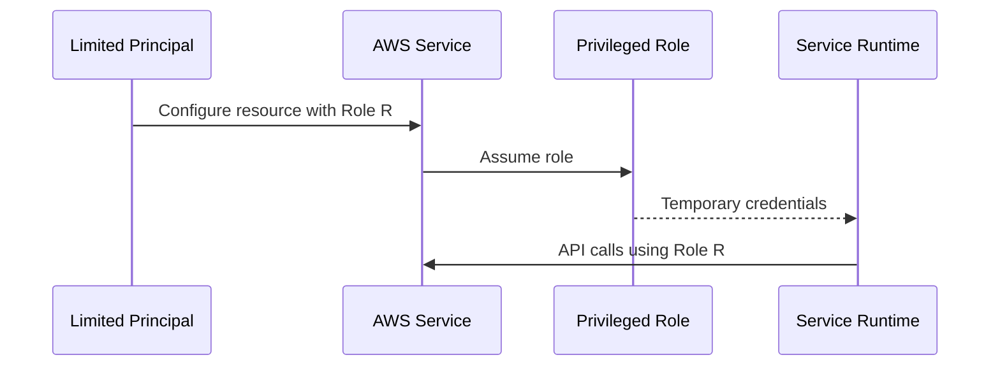
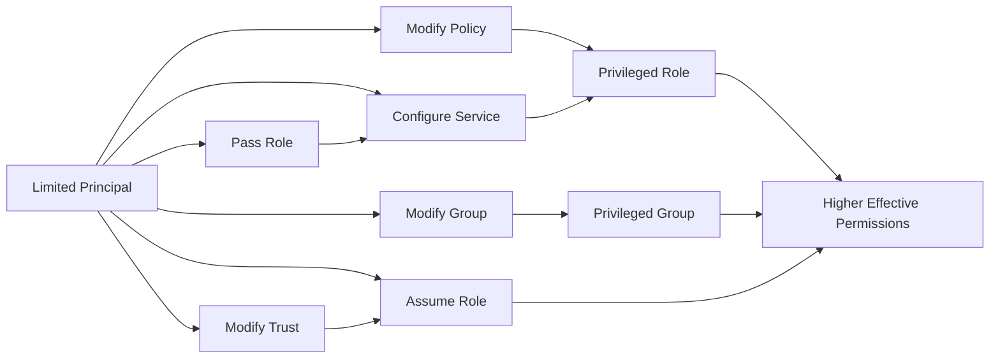
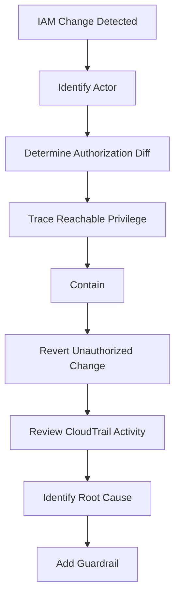

# 06- IAM Privilege Escalation Paths

## Overview

IAM privilege escalation occurs when an AWS principal that has limited permissions can use those permissions, directly or indirectly, to obtain broader permissions than intended.

The important engineering question is not:

```text
"Does this role have AdministratorAccess?"
```

It is:

```text
"Can this principal reach a principal, resource, or service
that gives it more effective authority than intended?"
```

A privilege-escalation path is usually a chain:

```text
Current permissions
    ↓
Delegation / policy / role / service permission
    ↓
New identity or execution context
    ↓
Broader permissions
    ↓
Higher effective authority
```

Examples include:

```text
iam:PassRole
        +
privileged service role
        ↓
AWS service executes with elevated permissions

iam:CreatePolicyVersion
        ↓
Modify an attached customer-managed policy
        ↓
Broader permissions

iam:UpdateAssumeRolePolicy
        ↓
Change who can assume a privileged role
        ↓
Privilege obtained through AssumeRole

iam:AttachRolePolicy
        +
privileged role
        ↓
Add broader permissions to an assumable role
```

AWS specifically recommends using permissions boundaries when delegating role-management responsibilities and restricting `iam:PassRole` to only the roles that a principal needs to pass. :contentReference[oaicite:0]{index=0}

---

## Why Privilege Escalation Matters

Privilege escalation is particularly dangerous in environments where developers, CI/CD systems, application roles, or automation accounts have partial IAM administration.

A principal may not have:

```text
iam:*
```

yet still have enough permissions to reach:

```text
AdministratorAccess
```

through a multi-step authorization chain.

For example:

```text
DeveloperRole
    |
    +-- lambda:UpdateFunctionConfiguration
    |
    +-- iam:PassRole
            |
            v
       AdminExecutionRole
            |
            v
       Broad AWS permissions
```

The developer does not directly have administrative permissions.

The dangerous capability is the **combination** of permissions.

---

## Privilege Escalation vs Privilege Expansion

These terms are related but not identical.

### Privilege Expansion

A principal intentionally receives additional permissions through normal administration.

```text
Security Team
    ↓
Modify role policy
    ↓
Developer receives approved permission
```

This is legitimate authorization management.

### Privilege Escalation

A principal uses permissions it already has to obtain authority beyond what it was intended to possess.

```text
DeveloperRole
    ↓
Can modify privileged role
    ↓
Assumes modified role
    ↓
Administrative access
```

The core security concern is unauthorized movement across an authorization boundary.

---

## The Effective-Privilege Mental Model

Do not reason about IAM permissions one action at a time.

Reason about the reachable authorization graph:

```text
Principal
    |
    +-- Can modify policy?
    |
    +-- Can modify trust?
    |
    +-- Can pass a role?
    |
    +-- Can create an identity?
    |
    +-- Can modify a service using another role?
    |
    +-- Can assume another role?
    |
    +-- Can modify a resource policy?
    |
    v
Higher-privilege identity or execution context
```

A senior IAM review therefore asks:

```text
What can this principal directly do?

What identities can it modify?

What identities can it assume?

What roles can it pass?

What AWS services can execute with those roles?

What resource policies can it change?

What policy versions can it control?

What guardrails constrain those actions?
```

---

## IAM Authorization Layers That Affect Escalation

An escalation path can be blocked or enabled by multiple policy layers.



AWS evaluates identity-based policies, resource-based policies, permissions boundaries, Organizations policies, session policies, and request context when determining authorization. Explicit denies override allows. :contentReference[oaicite:1]{index=1}

This means escalation analysis must include the guardrails, not only the identity policy.

---

## Common Privilege Escalation Classes

| Escalation class | Typical dangerous capability |
|---|---|
| Policy modification | Modify permissions attached to a powerful identity |
| Policy attachment | Attach an existing powerful policy |
| Trust-policy modification | Change who can assume a privileged role |
| Role creation | Create a new role and combine it with other permissions |
| Role assumption | Assume a higher-privilege role |
| `iam:PassRole` | Cause an AWS service to operate under a powerful role |
| Resource-policy modification | Grant access through a resource-based policy |
| Group membership modification | Add a principal to a privileged group |
| Access-key management | Create or replace credentials for a powerful identity |
| Service delegation | Use CloudFormation, Lambda, ECS, or another service with an elevated role |
| Cross-account delegation | Reach permissions in another account |
| Guardrail modification | Change permissions boundaries or other authorization controls |

Not every permission in one of these categories is automatically dangerous. Escalation depends on the complete chain and the target resources.

---

## The `iam:PassRole` Escalation Class

`iam:PassRole` is one of the most important IAM escalation mechanisms to understand.

It allows a principal to pass an IAM role to an AWS service so that the service can later operate using that role.

AWS describes this as a mechanism used when configuring services such as EC2 and other AWS resources with IAM roles. :contentReference[oaicite:2]{index=2}

Conceptually:



If:

```text
Principal
    +
iam:PassRole on PrivilegedRole
    +
ability to configure a service
```

then the principal may be able to cause that service to act with the privileged role.

This is why unrestricted `iam:PassRole` is dangerous.

---

## Why `iam:PassRole` Alone Is Not Enough

`iam:PassRole` does not itself provide the permissions contained in the target role.

The complete path requires another capability.

Conceptually:

```text
iam:PassRole
    +
service configuration API
    +
privileged target role
    +
service can execute using the role
```

Therefore the security review must analyze combinations.

For example:

```text
iam:PassRole
+
lambda:UpdateFunctionConfiguration
```

may be more significant than either permission by itself because Lambda functions can reference an execution role. AWS documents that Lambda function configuration includes an execution-role ARN. :contentReference[oaicite:3]{index=3}

---

## Restricting `iam:PassRole`

A common production mistake is:

```json
{
    "Effect": "Allow",
    "Action": "iam:PassRole",
    "Resource": "*"
}
```

Prefer explicit role scoping:

```json
{
    "Version": "2012-10-17",
    "Statement": [
        {
            "Sid": "PassOnlyApprovedApplicationRoles",
            "Effect": "Allow",
            "Action": "iam:PassRole",
            "Resource": [
                "arn:aws:iam::123456789012:role/application/*"
            ]
        }
    ]
}
```

AWS recommends specifying the roles that can be passed rather than granting unrestricted `Resource: "*"`. AWS also documents the `iam:PassedToService` condition key as an additional way to constrain which AWS services can receive a role. :contentReference[oaicite:4]{index=4}

Example:

```json
{
    "Version": "2012-10-17",
    "Statement": [
        {
            "Sid": "PassRolesOnlyToLambda",
            "Effect": "Allow",
            "Action": "iam:PassRole",
            "Resource": "arn:aws:iam::123456789012:role/application/*",
            "Condition": {
                "StringEquals": {
                    "iam:PassedToService": "lambda.amazonaws.com"
                }
            }
        }
    ]
}
```

The role ARN and service restriction should match the actual deployment architecture.

---

## `iam:PassRole` and CloudFormation

CloudFormation is a particularly important example because a CloudFormation service role can create, update, and delete stack resources using the service role's permissions.

AWS explicitly warns that a principal that can pass a highly privileged CloudFormation service role may unintentionally escalate permissions. :contentReference[oaicite:5]{index=5}

Conceptually:

```text
Developer
    |
    +-- cloudformation:CreateStack
    |
    +-- iam:PassRole
             |
             v
      Powerful CFN Service Role
             |
             v
      CloudFormation operations
             |
             v
      Broad resource authority
```

The defensive control is:

```text
Allow CloudFormation operations
+
Allow PassRole only for approved CFN roles
+
Restrict the service role policy
+
Restrict the service role trust policy
```

AWS recommends using `cloudformation:RoleARN` and narrowly scoped `iam:PassRole` permissions for CloudFormation service roles. :contentReference[oaicite:6]{index=6}

---

## Policy Version Escalation

Customer-managed IAM policies support multiple versions.

A policy can have up to five versions, and one version is the default operative version. AWS documents that `CreatePolicyVersion` can create a version and optionally make it the default. :contentReference[oaicite:7]{index=7}

This creates an escalation pattern:

```text
Principal
    ↓
Can modify a customer-managed policy
    ↓
Policy attached to privileged identity
    ↓
Policy default version changes
    ↓
Effective permissions change
```

The dangerous permissions include:

```text
iam:CreatePolicyVersion
iam:SetDefaultPolicyVersion
```

AWS explicitly notes that preventing changes to a policy's default version requires denying both `iam:CreatePolicyVersion` and `iam:SetDefaultPolicyVersion`. :contentReference[oaicite:8]{index=8}

---

## Why Policy Attachment Matters

Suppose:

```text
Role: ProductionDeploymentRole

Attached policy:
    ProductionAccessPolicy
```

If a lower-privileged principal can alter `ProductionAccessPolicy`, the principal may indirectly control the role.

Therefore:

```text
Can edit role?
```

is not the only question.

Also ask:

```text
Can edit policy attached to role?

Can change policy version?

Can attach a different policy?

Can change who can assume the role?
```

Privilege analysis must follow references between IAM objects.

---

## `iam:AttachRolePolicy`

`iam:AttachRolePolicy` attaches a managed policy to a role and makes that policy part of the role's permission policy. :contentReference[oaicite:9]{index=9}

Conceptually:

```text
LimitedPrincipal
    |
    +-- iam:AttachRolePolicy
    |
    v
PrivilegedRole
    |
    +-- Administrator-capable policy
```

This becomes an escalation path when:

```text
The role can be assumed by the principal
```

or when the principal can otherwise cause the role to execute.

The defensive question is therefore:

```text
Can this principal attach arbitrary policies to a role
that it can later reach?
```

---

## `iam:PutRolePolicy`

Inline policies can also create escalation paths.

`iam:PutRolePolicy` adds or updates an inline policy directly on a role. AWS documents that inline policies become part of the role's access policy. :contentReference[oaicite:10]{index=10}

Conceptually:

```text
LimitedPrincipal
    |
    +-- iam:PutRolePolicy
    |
    v
PrivilegedRole
    |
    v
Expanded permissions
```

The risk increases substantially when the principal can also:

```text
Assume the role
or
Cause a service to use the role
```

---

## Managed Policy vs Inline Policy Escalation

| Path | Modification capability |
|---|---|
| `CreatePolicyVersion` | Modify customer-managed managed policy |
| `SetDefaultPolicyVersion` | Select operative managed-policy version |
| `AttachRolePolicy` | Attach a managed policy to a role |
| `PutRolePolicy` | Add/change role inline policy |
| `AttachUserPolicy` | Attach managed policy to user |
| `PutUserPolicy` | Add/change user inline policy |
| `AttachGroupPolicy` | Attach managed policy to group |
| `PutGroupPolicy` | Add/change group inline policy |

The risk depends on:

```text
Target identity
+
Current trust relationships
+
Ability to assume/use target identity
+
Policy contents
```

---

## Trust-Policy Escalation

An IAM role has two conceptually different policy surfaces:

```text
Trust policy
    Who may assume the role?

Permission policy
    What may the role do?
```

A principal that can modify a privileged role's trust policy can potentially change who is allowed to assume that role.

AWS exposes this operation through `UpdateAssumeRolePolicy`. :contentReference[oaicite:11]{index=11}

Conceptually:

```text
PrivilegedRole
    |
    +-- Trust Policy
           |
           +-- ApprovedPrincipal
```

Changing the trust relationship changes the set of principals that can request a role session.

---

## Trust-Policy Escalation Chain

The important chain is:

```text
Can modify trust policy
        +
Can make self / controlled principal trusted
        +
Can call sts:AssumeRole
        +
Role contains broader permissions
        ↓
Higher effective authority
```

This is why `UpdateAssumeRolePolicy` should be treated as a high-impact IAM administration permission.

---

## Trust Policy Example

A tightly scoped trust policy might look like:

```json
{
    "Version": "2012-10-17",
    "Statement": [
        {
            "Sid": "AllowDeploymentRole",
            "Effect": "Allow",
            "Principal": {
                "AWS": "arn:aws:iam::123456789012:role/DeploymentRole"
            },
            "Action": "sts:AssumeRole"
        }
    ]
}
```

A production review should verify:

```text
Principal scope
External account scope
Organization conditions
Session conditions
MFA requirements where appropriate
ExternalId for third-party access
```

---

## Role Creation as an Escalation Building Block

`iam:CreateRole` does not automatically grant privilege escalation.

However, it becomes important when combined with other capabilities.

For example:

```text
CreateRole
+
AttachRolePolicy / PutRolePolicy
+
UpdateAssumeRolePolicy
+
AssumeRole
```

forms an identity-construction chain.

The important engineering principle is:

```text
Do not analyze CreateRole in isolation.
```

Ask:

```text
What policies can the principal attach?

What trust policy can it configure?

Can it assume the resulting role?

Is a permissions boundary mandatory?
```

---

## Permissions Boundaries and Role Creation

Permissions boundaries are designed to set the maximum permissions an IAM user or role can receive through identity-based policies. AWS recommends them specifically when delegating IAM role management. :contentReference[oaicite:12]{index=12}

A common delegated-development design is:

```text
Developer
    |
    +-- Can create application roles
    |
    +-- Must attach approved boundary
    |
    v
ApplicationRole
    |
    +-- Boundary limits maximum permissions
```

The boundary does not grant permissions by itself.

Effective permissions are constrained by the intersection of applicable policies and the boundary. Explicit denies override allows. :contentReference[oaicite:13]{index=13}

---

## Boundary Bypass Risk

A weak delegation model may look like:

```text
Developer can create role
Developer can attach policies
Developer can choose boundary
Developer can modify boundary
```

This defeats the purpose of using a boundary.

A stronger model is:

```text
Approved boundary policy
    ↓
Developer can attach it
    ↓
Developer cannot modify it
    ↓
Developer cannot remove it
    ↓
Developer cannot create roles outside the guardrail
```

The governance policy should also prevent delegated principals from modifying the boundary policy itself.

---

## SCPs as an Escalation Guardrail

AWS Organizations Service Control Policies limit the maximum permissions available to principals in member accounts. SCPs do not grant permissions; identity-based or resource-based policies are still required. :contentReference[oaicite:14]{index=14}

Conceptually:

```text
Identity Policy
      +
Permissions Boundary
      +
SCP
      ↓
Maximum Effective Permissions
```

An escalation path can therefore be blocked at the organization level.

Example controls can restrict:

```text
iam:CreateUser
iam:CreateAccessKey
iam:CreateRole
iam:PutRolePolicy
iam:AttachRolePolicy
iam:PassRole
iam:UpdateAssumeRolePolicy
```

The exact SCP should be based on architecture rather than simply denying all IAM administration.

---

## Resource-Policy Escalation

Resource-based policies can create authorization paths that are not visible from an identity's attached policies alone.

Examples include:

```text
S3 bucket policy
SQS queue policy
SNS topic policy
KMS key policy
Secrets Manager resource policy
```

Conceptually:

```text
Principal
    ↓
Resource Policy
    ↓
Resource access
```

A security review therefore needs to inspect both:

```text
Identity-based authorization
+
Resource-based authorization
```

AWS policy evaluation considers resource-based policies alongside identity-based policies and other applicable policy controls. :contentReference[oaicite:15]{index=15}

---

## Group Membership Escalation

IAM groups can also form indirect privilege paths.

Example:

```text
LimitedUser
    |
    +-- AddUserToGroup
    |
    v
PrivilegedGroup
    |
    v
Administrative policy
```

A principal with permission to modify group membership can therefore gain access through the group's policies.

Review:

```text
iam:AddUserToGroup
iam:AttachGroupPolicy
iam:PutGroupPolicy
```

in addition to direct user permissions.

---

## Access-Key Escalation

Access-key management can become dangerous when one principal can create credentials for another privileged IAM user.

The relevant capability includes:

```text
iam:CreateAccessKey
```

The risk is particularly high when:

```text
Privileged IAM user
    +
Principal can create access key
    +
Credential can be retrieved and used
```

Modern production architectures should generally avoid long-lived IAM-user credentials and use workload roles or workforce federation instead.

This is one reason AWS recommends temporary credentials and minimizing long-term credentials in IAM security practices. :contentReference[oaicite:16]{index=16}

---

## Service Delegation Paths

Some of the hardest escalation paths involve AWS services.

Typical structure:

```text
Limited IAM Principal
        |
        +-- Configure AWS service
        |
        +-- Pass elevated role
        |
        v
AWS service
        |
        +-- Execute operation
        |
        v
Elevated authorization context
```

Common services that deserve careful review include:

```text
Lambda
CloudFormation
ECS
EC2
Step Functions
Glue
EMR
CodeBuild
```

The exact escalation mechanism depends on the service and the operations it permits.

---

## Lambda Execution-Role Path

Lambda functions have execution roles.

AWS documents that Lambda configuration includes the execution role ARN and that the role determines the permissions available to the function. :contentReference[oaicite:17]{index=17}

A security review therefore asks:

```text
Can principal modify Lambda configuration?
+
Can principal pass a privileged role?
```

The defensive model is:

```text
lambda:UpdateFunctionConfiguration
    +
iam:PassRole
    ↓
Only approved application roles
```

The application role should itself follow least privilege.

---

## CloudFormation Service-Role Path

CloudFormation deserves special treatment because the service role can perform stack operations on behalf of the principal.

AWS warns that users who can operate a stack associated with a powerful service role may effectively use that role even if they do not individually have `iam:PassRole`. :contentReference[oaicite:18]{index=18}

Therefore:

```text
CreateStack
UpdateStack
ExecuteChangeSet
```

must sometimes be analyzed together with:

```text
CloudFormation service role permissions
```

and not only the caller's direct IAM policy.

---

## ECS and Container Deployment Paths

For ECS-based microservices, consider:

```text
CI/CD role
    |
    +-- ecs:UpdateService
    +-- iam:PassRole
            |
            v
      ECS task role
            |
            v
     Application permissions
```

The security boundary becomes:

```text
CI/CD permissions
    +
Task-role permissions
    +
PassRole scope
```

A CI/CD role should not be able to pass arbitrary roles.

Instead:

```text
ci-role
    → PassRole
       arn:aws:iam::123456789012:role/ecs-orders-task
```

rather than:

```text
arn:aws:iam::123456789012:role/*
```

---

## CI/CD Privilege Escalation

CI/CD systems are high-value principals because they often have:

```text
Deploy permissions
Infrastructure permissions
Container registry permissions
IAM role usage
Secrets access
CloudFormation / Terraform access
```

A dangerous design is:

```text
GitHub Actions OIDC
    ↓
DeploymentRole
    ↓
iam:PassRole *
```

combined with:

```text
CloudFormation / Lambda / ECS administration
```

The deployment role can then become a general infrastructure-control identity.

A stronger design is:

```text
GitHub OIDC
    ↓
Repository-scoped trust
    ↓
DeploymentRole
    ↓
Specific deployment APIs
    ↓
Specific application roles
```

---

## Cross-Account Escalation

Cross-account access introduces another trust boundary.

For a role in Account B:

```text
Account A principal
        |
        | sts:AssumeRole
        v
Account B role
        |
        v
Account B permissions
```

Both sides matter.

AWS documents that cross-account access requires authorization in the trusted account and a resource-based permission in the trusting account, depending on the access pattern. :contentReference[oaicite:19]{index=19}

A privilege-escalation review should therefore ask:

```text
Can this principal assume roles in another account?

Can it modify trust policies there?

Can it pass roles there?

Is the target role privileged?

Are Organizations guardrails applied?
```

---

## External Trust Risk

A privileged role with a broad trust policy can turn an otherwise low-risk permission into a much larger issue.

For example:

```text
Role:
    ProductionAdminRole

Trust:
    ExternalPrincipal
```

Even if the role's own permission policy is secure, excessive trust can expose that authority to unwanted principals.

For third-party access:

```text
ExternalId
+
specific trusted principal
+
least-privilege role
```

should be considered where appropriate.

---

## Privilege Escalation Graph

Senior-level IAM reviews are easier when modeled as a graph.



The goal is to identify edges that allow:

```text
Current Principal
    →
Higher-privilege Authorization Context
```

---

## High-Risk IAM Actions

The following actions deserve particularly careful review when assigned to non-administrative principals.

| Action | Why it matters |
|---|---|
| `iam:PassRole` | Can delegate a role to an AWS service |
| `iam:CreatePolicyVersion` | Can change customer-managed policy version |
| `iam:SetDefaultPolicyVersion` | Can activate another policy version |
| `iam:AttachRolePolicy` | Can attach managed policies to roles |
| `iam:PutRolePolicy` | Can modify inline role permissions |
| `iam:UpdateAssumeRolePolicy` | Can modify role trust |
| `iam:CreateRole` | Can create new authorization identities |
| `iam:CreateAccessKey` | Can create long-lived credentials for users |
| `iam:AddUserToGroup` | Can indirectly grant group permissions |
| `iam:AttachUserPolicy` | Can attach managed policy to user |
| `iam:PutUserPolicy` | Can modify inline user permissions |
| `iam:AttachGroupPolicy` | Can change group authority |
| `iam:PutGroupPolicy` | Can modify group inline permissions |
| `sts:AssumeRole` | Can enter another authorization context |
| Service-specific deployment APIs | Can become escalation primitives when combined with `PassRole` |

The existence of an action in a policy does not prove escalation. The target resource and available combinations determine the actual path.

---

## Dangerous Combinations

Single permissions are often less important than combinations.

| Combination | Potential concern |
|---|---|
| `iam:PassRole` + service configuration | Service executes with another role |
| `CreateRole` + `PutRolePolicy` + `AssumeRole` | Create and enter a custom elevated identity |
| `AttachRolePolicy` + `AssumeRole` | Add powerful policy to reachable role |
| `CreatePolicyVersion` + policy attached to privileged role | Change effective role permissions |
| `SetDefaultPolicyVersion` + existing privileged version | Switch operative policy |
| `UpdateAssumeRolePolicy` + `AssumeRole` | Change trust and enter role |
| `AddUserToGroup` + privileged group | Gain group-derived authority |
| `AttachUserPolicy` + own user | Directly expand user authority |
| `CreateAccessKey` + privileged IAM user | Obtain persistent credentials |
| `CloudFormation` + unrestricted `PassRole` | Delegate infrastructure operations |
| `Lambda` administration + unrestricted `PassRole` | Delegate execution to privileged roles |
| Cross-account `AssumeRole` + privileged target | Move into another account's authority |

---

## Why Wildcards Are Dangerous

This policy:

```json
{
    "Effect": "Allow",
    "Action": "iam:PassRole",
    "Resource": "*"
}
```

is substantially broader than:

```json
{
    "Effect": "Allow",
    "Action": "iam:PassRole",
    "Resource": "arn:aws:iam::123456789012:role/application/orders"
}
```

Similarly:

```json
{
    "Effect": "Allow",
    "Action": [
        "iam:AttachRolePolicy",
        "iam:PutRolePolicy"
    ],
    "Resource": "*"
}
```

may allow a principal to modify many roles.

Prefer:

```text
Specific actions
+
Specific resources
+
Context conditions
+
Explicit boundaries
```

---

## Path Discovery Methodology

When reviewing a role for privilege escalation, use a systematic process.

### Start With Direct Permissions

Inspect:

```text
Identity policies
Inline policies
Group policies
Permissions boundary
Session policy
SCPs
```

Then identify sensitive IAM and STS actions.

### Identify Reachable Identities

For each sensitive action, ask:

```text
Which role?
Which user?
Which group?
Which policy?
Which service?
Which account?
```

### Follow the Chain

For example:

```text
PassRole
    ↓
Which role can be passed?
    ↓
What permissions does the role have?
    ↓
Which service can receive it?
    ↓
Can the principal operate that service?
```

### Verify Guardrails

Finally inspect:

```text
Permissions boundary
SCP
Trust policy
Resource policy
Conditions
```

This prevents false positives.

---

## A Practical Review Algorithm

```text
1. Enumerate principal permissions.

2. Identify sensitive IAM / STS actions.

3. Enumerate target resources for those actions.

4. Inspect target role or policy permissions.

5. Inspect target trust policies.

6. Identify AWS services that can receive delegated roles.

7. Check whether permissions boundaries constrain the target.

8. Check SCP / organization guardrails.

9. Check resource-based policies.

10. Build the shortest path to higher authority.

11. Validate whether the path is actually executable.

12. Remove or constrain unnecessary edges.
```

This is more reliable than searching for one "bad" permission.

---

## Inspecting a Principal

Start with the attached policies:

```bash
aws iam list-attached-role-policies \
    --role-name OrdersServiceRole

aws iam list-role-policies \
    --role-name OrdersServiceRole
```

Inspect the role:

```bash
aws iam get-role \
    --role-name OrdersServiceRole
```

Inspect the policy versions:

```bash
aws iam list-policy-versions \
    --policy-arn arn:aws:iam::123456789012:policy/OrdersServicePolicy
```

Then retrieve the operative version:

```bash
aws iam get-policy-version \
    --policy-arn arn:aws:iam::123456789012:policy/OrdersServicePolicy \
    --version-id v3
```

The purpose is to reconstruct the authorization graph rather than simply inspect one policy document.

---

## Finding Roles With PassRole

Search policy documents for:

```text
iam:PassRole
```

For example, after retrieving policy JSON:

```bash
aws iam get-policy-version \
    --policy-arn arn:aws:iam::123456789012:policy/DeploymentPolicy \
    --version-id v4 \
    --query 'PolicyVersion.Document'
```

Review:

```text
Action
Resource
Condition
```

especially:

```text
Resource: "*"
```

and:

```text
iam:PassedToService
```

---

## Checking a Role Trust Policy

```bash
aws iam get-role \
    --role-name ProductionDeploymentRole \
    --query 'Role.AssumeRolePolicyDocument'
```

Look for:

```text
AWS account principals
Role principals
Service principals
Federated principals
Wildcards
ExternalId conditions
Organization conditions
```

A privileged role with an unexpectedly broad trust policy deserves immediate review.

---

## Checking Policy Attachments

Identify where a customer-managed policy is used:

```bash
aws iam list-entities-for-policy \
    --policy-arn arn:aws:iam::123456789012:policy/ProductionAccess
```

This is critical when reviewing:

```text
CreatePolicyVersion
SetDefaultPolicyVersion
```

because changing one managed policy can affect every attached identity.

AWS documents that changing the default version affects all users, groups, and roles to which the policy is attached. :contentReference[oaicite:20]{index=20}

---

## Detecting Risky `PassRole` Policies

A policy with:

```json
{
    "Action": "iam:PassRole",
    "Resource": "*"
}
```

should usually trigger a security review.

Questions:

```text
Why does this principal need PassRole?

Which services should receive roles?

Which exact roles should be passed?

Can those roles access sensitive resources?

Can the principal configure those services?

Can the role be used to control production infrastructure?
```

This is a better security review than simply labeling every `PassRole` grant as insecure.

---

## Access Analyzer for Privilege-Escalation Prevention

IAM Access Analyzer can contribute to prevention through:

```text
Policy validation
Custom policy checks
Check for new access
Check for access not granted
Policy generation
Access previews
```

Custom policy checks can compare a proposed policy against a reference policy or verify that specified actions/resources are not granted. :contentReference[oaicite:21]{index=21}

Example CI/CD control:

```text
Pull Request
    ↓
IAM Policy Changed
    ↓
Access Analyzer
    ↓
Check for new access
    ↓
Unexpected authorization capability
    ↓
Reject deployment
```

This does not automatically solve privilege escalation, but it reduces policy changes that introduce unexpected authority.

---

## Reference Policy Checks

Suppose a role currently has:

```text
s3:GetObject
sqs:ReceiveMessage
sqs:DeleteMessage
```

A new policy introduces:

```text
iam:PassRole
```

A custom policy check against the previous version can detect new access.

The security control becomes:

```text
Existing policy
    +
Proposed policy
    ↓
CheckNoNewAccess
```

AWS documents `CheckNoNewAccess` specifically for checking whether an updated policy grants new access compared with a reference policy. :contentReference[oaicite:22]{index=22}

---

## Explicitly Denying High-Risk Actions

Where appropriate, organizations can use explicit denies to create strong guardrails.

Example:

```json
{
    "Version": "2012-10-17",
    "Statement": [
        {
            "Sid": "DenyUnrestrictedPassRole",
            "Effect": "Deny",
            "Action": "iam:PassRole",
            "Resource": "*"
        }
    ]
}
```

However, broad explicit denies can break legitimate automation.

A more practical architecture is often:

```text
Allow PassRole
    only for approved role ARNs

Deny
    dangerous exceptions
```

and enforce the maximum boundary with an SCP or permissions boundary where appropriate.

---

## Permissions Boundary Pattern

A delegated development account can use:

```text
DeveloperRole
    |
    +-- Can create application roles
    |
    +-- Can attach approved policies
    |
    +-- Cannot exceed boundary
    |
    v
ApplicationRole
```

Example boundary:

```json
{
    "Version": "2012-10-17",
    "Statement": [
        {
            "Sid": "AllowApplicationServices",
            "Effect": "Allow",
            "Action": [
                "s3:GetObject",
                "sqs:ReceiveMessage",
                "sqs:DeleteMessage",
                "logs:CreateLogStream",
                "logs:PutLogEvents"
            ],
            "Resource": "*"
        }
    ]
}
```

The boundary is a maximum-permission control, not an authorization grant. AWS explicitly documents that permissions boundaries do not grant permissions by themselves. :contentReference[oaicite:23]{index=23}

---

## SCP Guardrail Pattern

At the organization layer:

```text
AWS Organization
    |
    +-- Security OU
    |
    +-- Production OU
    |      |
    |      +-- SCP
    |
    +-- Development OU
           |
           +-- SCP
```

Production accounts may use stricter restrictions around:

```text
IAM policy changes
Role trust changes
Access-key creation
PassRole
Resource policy modification
Cross-account access
```

SCPs limit maximum available permissions but do not grant permissions. :contentReference[oaicite:24]{index=24}

---

## Production IAM Architecture

A robust architecture usually separates:

```text
Human identities
    ↓
IAM Identity Center / federation
    ↓
Permission sets

CI/CD identities
    ↓
OIDC federation
    ↓
Deployment roles

Applications
    ↓
ECS / Lambda / EKS workload identity
    ↓
Application roles

Security administrators
    ↓
Dedicated privileged roles
    ↓
Strong MFA / controlled access
```

The objective is to minimize:

```text
Long-lived credentials
Shared IAM users
Broad administrative roles
Unrestricted PassRole
Delegated IAM administration
```

---

## Microservice Architecture

For microservices:

```text
Orders Service
    ↓
OrdersTaskRole
    ↓
SQS + PostgreSQL secret + S3 prefix

Payments Service
    ↓
PaymentsTaskRole
    ↓
KMS + payment-specific secrets

Reporting Service
    ↓
ReportingTaskRole
    ↓
Read-only reporting data
```

Avoid:

```text
AllServicesRole
    ↓
AdministratorAccess
```

A broad shared role increases the blast radius of:

```text
Application compromise
Credential exposure
Deployment compromise
Privilege escalation
```

---

## Kubernetes Architecture

For EKS:

```text
Pod
    ↓
Workload identity
    ↓
Service-specific IAM role
    ↓
AWS APIs
```

Each workload should receive only the permissions required by its service.

Avoid:

```text
cluster-wide application role
    +
AdministratorAccess
```

especially when multiple namespaces or teams share the cluster.

---

## Backend Application Considerations

Django and FastAPI applications generally should not directly manipulate IAM administrative APIs unless the application is specifically a security or infrastructure-management service.

A normal application should typically use:

```text
Application IAM role
    ↓
S3
Secrets Manager
SQS
SNS
CloudWatch
KMS
```

rather than:

```text
Application
    ↓
iam:*
```

Avoid embedding IAM administration permissions in:

```text
Docker containers
Celery workers
Cron jobs
Airflow tasks
REST APIs
gRPC services
```

unless there is a deliberate control-plane use case.

---

## Security Monitoring

Privilege-escalation monitoring should focus on high-impact changes.

Monitor CloudTrail for events involving:

```text
CreatePolicyVersion
SetDefaultPolicyVersion
AttachRolePolicy
PutRolePolicy
UpdateAssumeRolePolicy
PassRole
CreateRole
CreateAccessKey
AddUserToGroup
AttachUserPolicy
PutUserPolicy
AttachGroupPolicy
PutGroupPolicy
CreateLoginProfile
UpdateLoginProfile
```

Also monitor:

```text
sts:AssumeRole
```

when the target roles are privileged.

The monitoring goal is:

```text
Who changed authorization?
What changed?
Which identity was affected?
Was the change expected?
What downstream authority changed?
```

---

## Detecting Suspicious Role Changes

A security workflow can trigger when:

```text
Privileged role trust policy changes
```

or:

```text
PassRole scope expands
```

or:

```text
Customer-managed policy gains IAM administrative actions
```

or:

```text
Production deployment role gains unrestricted role delegation
```

These events should receive stronger review than ordinary application configuration changes.

---

## Privilege Escalation Response Workflow

When a suspicious IAM change is detected:



The key step is **authorization diff**.

Do not only ask:

```text
"What policy changed?"
```

Ask:

```text
"What new authority became reachable?"
```

---

## Authorization Diff

An authorization diff compares:

```text
Before
    ↓
Who could do what?

After
    ↓
Who can now do what?
```

For example:

```text
Before:
DeploymentRole
    s3:GetObject

After:
DeploymentRole
    s3:GetObject
    iam:PassRole on production-admin-role
```

The significant change is not the number of JSON lines.

It is:

```text
The deployment role can now delegate a privileged role.
```

This is the level at which senior IAM reviews should operate.

---

## Preventive Controls

Use multiple layers.

| Control | Purpose |
|---|---|
| Least privilege | Reduce starting authority |
| Permissions boundaries | Limit delegated identity permissions |
| SCPs | Organization-wide maximum permission guardrails |
| Scoped `PassRole` | Restrict service delegation |
| Narrow trust policies | Restrict role assumption |
| Access Analyzer | Analyze access and policy changes |
| CloudTrail | Record authorization-management activity |
| IaC | Make IAM changes reviewable |
| CI/CD policy checks | Prevent unsafe changes before deployment |
| MFA / federation | Protect privileged human access |
| Short-lived credentials | Reduce credential persistence |
| Separate admin roles | Isolate high-impact permissions |

The strongest security posture does not rely on one of these controls.

---

## Infrastructure as Code

IAM permissions should normally be managed through:

```text
Terraform
CloudFormation
CDK
Other controlled IaC
```

rather than ad hoc console changes.

Benefits include:

```text
Code review
Version history
Policy diffs
Automated validation
Rollback
Ownership
Change approval
```

However, IaC itself can become an escalation mechanism if the deployment role is too powerful.

Therefore:

```text
IaC
    +
Least-privilege deployment role
    +
PassRole restrictions
    +
Policy validation
```

should be considered together.

---

## Privileged Role Separation

Avoid using one role for everything.

A better pattern is:

```text
DeveloperRole
    ↓
Read-only / development permissions

DeploymentRole
    ↓
Approved deployment actions

SecurityAdminRole
    ↓
IAM / security administration

BreakGlassRole
    ↓
Emergency administration
```

The separation reduces the blast radius of:

```text
Credential compromise
CI/CD compromise
Application compromise
Developer mistake
Policy misconfiguration
```

---

## Break-Glass Roles

Emergency administrative roles are intentionally powerful.

They should therefore have:

```text
Strict trust policy
MFA
Limited assignment
Strong monitoring
Clear ownership
Documented emergency procedure
Regular access review
```

An unused break-glass role is not automatically suspicious.

The security objective is:

```text
Hard to use accidentally
Easy to use deliberately during a real incident
Strongly audited when used
```

---

## Common Mistakes

| Mistake | Why it happens | Better approach |
|---|---|---|
| Treating `iam:PassRole` as harmless | It does not directly grant permissions | Analyze it with service permissions and target roles |
| Granting `PassRole` on `*` | Deployment convenience | Scope role ARNs and service conditions |
| Reviewing only direct permissions | IAM is graph-based | Follow roles, policies, trust and services |
| Ignoring trust policies | Focus stays on permission policies | Review who can enter every privileged role |
| Allowing arbitrary policy attachment | Developers need flexibility | Use boundaries and controlled role paths |
| Allowing policy-version changes | Considered "policy management" | Protect `CreatePolicyVersion` and `SetDefaultPolicyVersion` |
| Ignoring CloudFormation roles | CFN is treated as only infrastructure tooling | Review service-role permissions and `RoleARN` |
| Giving CI/CD `iam:*` | Deployment initially fails without it | Build specific deployment permissions |
| Sharing one role across services | Simpler operations | Use service-specific roles |
| Relying only on SCPs | Organization guardrail feels sufficient | SCPs limit permissions but do not grant them |
| Assuming a permissions boundary grants access | Boundary appears like a policy | Attach an actual permission policy too |
| Ignoring cross-account trust | Focus is on local policies | Review both accounts and trust relationships |
| Assuming unused roles are unnecessary | Access Analyzer reports no usage | Check scheduled and emergency workflows |
| Treating every IAM admin action as equivalent | Large permission lists are difficult to reason about | Prioritize reachable privilege paths |

---

## Production Pitfalls

### Unrestricted `PassRole`

```text
iam:PassRole
Resource: "*"
```

is one of the most important patterns to eliminate or justify.

### Privileged Service Roles

A low-privileged human role can become effectively powerful if it can cause a service to operate with a highly privileged service role.

### Shared Customer-Managed Policies

If many roles share one policy:

```text
Policy modification
    ↓
Many identities change simultaneously
```

The blast radius becomes much larger.

### Broad Trust Policies

A policy granting:

```text
Principal: "*"
```

or a large external trust domain on a privileged role should receive careful review.

### Uncontrolled Role Creation

Allowing developers to create arbitrary roles without an approved boundary can undermine delegated IAM administration.

---

## Interview Traps

### "Does `iam:PassRole` give the caller the role's permissions?"

No.

It allows the caller to pass a role to an AWS service. The escalation risk appears when the caller can also configure or invoke a service that executes using that role. :contentReference[oaicite:25]{index=25}

### "Is `iam:CreateRole` an escalation by itself?"

Not necessarily.

The escalation depends on what additional actions are available:

```text
CreateRole
+
AttachRolePolicy / PutRolePolicy
+
AssumeRole
```

or another path that causes the role to execute.

### "Does a permissions boundary grant permissions?"

No.

It limits what identity-based policies can grant. A separate permission policy is still required. :contentReference[oaicite:26]{index=26}

### "Can SCPs grant permissions?"

No.

SCPs establish maximum available permissions for principals in member accounts; they do not grant permissions. :contentReference[oaicite:27]{index=27}

### "Is an IAM policy with AdministratorAccess necessarily an escalation?"

Not by itself.

It becomes an escalation issue when a lower-privileged principal can attach, modify, assume, or otherwise reach the identity that has that policy.

---

## Senior-Level Interview Reasoning

When given an IAM privilege-escalation scenario, reason in this order:

```text
1. What permissions does the starting principal have?

2. Which permissions modify authorization objects?

3. Which roles / users / groups / policies can those actions affect?

4. Can the principal enter the modified authorization context?

5. Can an AWS service execute using the modified context?

6. Are permissions boundaries involved?

7. Are SCPs involved?

8. Are resource policies involved?

9. Is cross-account access involved?

10. What is the final effective permission set?
```

This demonstrates authorization reasoning rather than memorization of IAM action names.

---

## Example Senior-Level Scenario

Suppose:

```text
DeploymentRole can:

cloudformation:CreateStack
iam:PassRole on *
```

and:

```text
DeploymentServiceRole can:

ec2:*
s3:*
iam:*
```

The important observation is:

```text
DeploymentRole
    ↓
Can use CloudFormation
    ↓
Can pass an unrestricted role
    ↓
CloudFormation can operate using DeploymentServiceRole
    ↓
DeploymentRole has an indirect path to broad infrastructure authority
```

The remediation is not necessarily:

```text
Remove CloudFormation
```

Instead:

```text
Restrict PassRole
+
Restrict CloudFormation role
+
Restrict service role trust
+
Restrict service role permissions
+
Add organization guardrails
```

AWS recommends narrowly scoped CloudFormation service roles and restricting `iam:PassRole` to approved roles. :contentReference[oaicite:28]{index=28}

---

## Example: Managed Policy Path

Suppose:

```text
DeveloperRole
    |
    +-- iam:CreatePolicyVersion
            |
            v
       DeploymentPolicy
            |
            v
       ProductionRole
```

and `DeploymentPolicy` is attached to `ProductionRole`.

The security problem is:

```text
DeveloperRole
    ↓
Can change policy
    ↓
Can indirectly change ProductionRole
    ↓
ProductionRole's effective permissions change
```

The correct control is to prevent delegated developers from modifying policy objects that are trusted by privileged identities.

AWS notes that controlling default versions requires protecting both `CreatePolicyVersion` and `SetDefaultPolicyVersion`. :contentReference[oaicite:29]{index=29}

---

## Example: Trust-Policy Path

Suppose:

```text
DeveloperRole
    |
    +-- iam:UpdateAssumeRolePolicy
              |
              v
       ProductionAdminRole
              |
              v
        sts:AssumeRole
```

The problem is not merely:

```text
DeveloperRole can call UpdateAssumeRolePolicy
```

The important question is:

```text
Which role can it modify?
```

If the target is a privileged role, trust-policy modification becomes a high-impact authorization operation.

---

## Example: Group Path

```text
DeveloperUser
    |
    +-- iam:AddUserToGroup
            |
            v
       ProductionAdmins
            |
            v
      Administrative policy
```

A permission that looks like basic group administration can therefore become privilege escalation.

The security review must inspect the permissions assigned to the target group.

---

## Resource Scope Matters

Compare:

```json
{
    "Effect": "Allow",
    "Action": "iam:PassRole",
    "Resource": "*"
}
```

with:

```json
{
    "Effect": "Allow",
    "Action": "iam:PassRole",
    "Resource": [
        "arn:aws:iam::123456789012:role/ecs/orders-task",
        "arn:aws:iam::123456789012:role/lambda/orders-worker"
    ]
}
```

The second policy creates a smaller authorization graph.

Privilege escalation prevention is therefore largely about controlling:

```text
Edges
+
Targets
+
Trust
+
Context
```

---

## Condition Keys

Conditions can further reduce escalation paths.

Useful IAM context keys include:

```text
iam:PassedToService
aws:PrincipalArn
aws:PrincipalAccount
aws:PrincipalOrgID
aws:SourceArn
aws:SourceAccount
aws:MultiFactorAuthPresent
```

Not every condition key applies to every action.

Use service-specific documentation to verify supported condition keys before deploying a control.

---

## ABAC and Privilege Escalation

Attribute-Based Access Control can constrain role or resource access based on tags and request context.

For example:

```text
Role:
    Environment=production
    Team=payments
```

An authorization policy can require matching tags.

ABAC can reduce broad wildcard delegation when tagging is governed correctly.

However, tag-management permissions can themselves become sensitive.

For example:

```text
Can modify authorization-relevant tag
```

may change the outcome of a tag-based policy.

Therefore:

```text
ABAC
    +
Tag governance
```

must be reviewed together.

---

## Preventing Tag-Based Escalation

If access depends on:

```text
aws:ResourceTag/Environment = production
```

then carefully control:

```text
CreateTags
DeleteTags
TagRole
UntagRole
TagResource
```

where applicable.

The general rule is:

```text
Authorization attribute
    →
Attribute modification
```

must itself be protected.

Otherwise:

```text
Principal
    ↓
Changes tag
    ↓
Policy condition changes
    ↓
Effective authorization changes
```

---

## Least-Privilege Design Rules

For delegated IAM administration:

```text
1. Scope IAM actions to exact resources.

2. Scope PassRole to exact role ARNs.

3. Restrict PassedToService where applicable.

4. Protect customer-managed policies attached to privileged roles.

5. Protect privileged trust policies.

6. Require permissions boundaries for delegated role creation.

7. Prevent boundary modification by delegated principals.

8. Apply SCP guardrails across production accounts.

9. Separate deployment roles from security administration.

10. Use service-specific application roles.

11. Prefer short-lived credentials.

12. Monitor authorization-management API calls.
```

These controls are consistent with AWS guidance around permissions boundaries, policy validation, and controlled role delegation. :contentReference[oaicite:30]{index=30}

---

## IAM Access Analyzer and Guardrail Validation

A production pipeline can combine policy validation with privilege-escalation controls:

```mermaid
flowchart LR
    CHANGE["IAM Policy Change"] --> VALIDATE["Access Analyzer Validation"]
    VALIDATE --> NEW["Check for New Access"]
    NEW --> FORBIDDEN["Check Access Not Granted"]
    FORBIDDEN --> PASSROLE["Review PassRole / IAM Admin Actions"]
    PASSROLE --> BOUNDARY["Check Boundary / SCP"]
    BOUNDARY --> TEST["Authorization Tests"]
    TEST --> REVIEW["Security Review"]
    REVIEW --> DEPLOY["Deploy"]
```



Access Analyzer custom checks are especially useful when the organization has a known reference policy or explicit actions/resources that must not be granted. :contentReference[oaicite:31]{index=31}

---

## Operational Review Checklist

### Principal

```text
□ What identity is being reviewed?
□ Human, CI/CD, or workload?
□ What direct permissions exist?
□ What boundary applies?
□ What session policy applies?
□ What SCP applies?
```

### IAM Administration

```text
□ Can it modify policies?
□ Can it modify trust policies?
□ Can it create roles?
□ Can it attach policies?
□ Can it add users to groups?
□ Can it create access keys?
```

### Delegation

```text
□ Can it use iam:PassRole?
□ Which exact roles?
□ Which AWS services?
□ Are service conditions enforced?
```

### Reachability

```text
□ Which privileged roles can it assume?
□ Which roles can it modify?
□ Which policies are attached to privileged identities?
□ Which groups are privileged?
□ Which resource policies can it change?
```

### Guardrails

```text
□ Permissions boundary?
□ SCP?
□ Resource policy restrictions?
□ Trust conditions?
□ MFA?
□ Organization conditions?
```

### Monitoring

```text
□ CloudTrail coverage?
□ IAM-change monitoring?
□ Alerting?
□ Change ownership?
□ Rollback process?
```

---

## Production Security Checklist

```text
□ No unnecessary iam:*
□ No unrestricted iam:PassRole
□ PassRole scoped to required role ARNs
□ iam:PassedToService used where useful
□ Privileged role trust policies protected
□ Privileged customer-managed policies protected
□ CreatePolicyVersion controlled
□ SetDefaultPolicyVersion controlled
□ Role creation governed by permissions boundaries
□ Boundary policies protected from modification
□ Group membership changes restricted
□ Access-key creation restricted
□ Cross-account trust tightly scoped
□ CI/CD roles separated from security administration
□ CloudFormation service roles least privileged
□ Lambda / ECS deployment roles scoped
□ SCPs protect production IAM guardrails
□ CloudTrail monitors high-impact IAM changes
□ Access Analyzer policy checks are part of CI/CD
□ Authorization changes are reviewed as capability changes
□ Privileged roles are regularly reviewed
□ Emergency access is separately controlled
```

## AWS Documentation Links

- [IAM Security Best Practices](https://docs.aws.amazon.com/IAM/latest/UserGuide/best-practices.html)
- [IAM Policy Evaluation Logic](https://docs.aws.amazon.com/IAM/latest/UserGuide/reference_policies_evaluation-logic.html)
- [How AWS enforcement code evaluates requests](https://docs.aws.amazon.com/IAM/latest/UserGuide/reference_policies_evaluation-logic_policy-eval-denyallow.html)
- [Permissions Boundaries for IAM Entities](https://docs.aws.amazon.com/IAM/latest/UserGuide/access_policies_boundaries.html)
- [Grant a User Permissions to Pass a Role](https://docs.aws.amazon.com/IAM/latest/UserGuide/id_roles_use_passrole.html)
- [IAM `PassRole` API Reference](https://docs.aws.amazon.com/IAM/latest/APIReference/API_PassRole.html)
- [CreatePolicyVersion](https://docs.aws.amazon.com/IAM/latest/APIReference/API_CreatePolicyVersion.html)
- [Versioning IAM Policies](https://docs.aws.amazon.com/IAM/latest/UserGuide/access_policies_managed-versioning.html)
- [SetDefaultPolicyVersion](https://docs.aws.amazon.com/IAM/latest/APIReference/API_SetDefaultPolicyVersion.html)
- [AttachRolePolicy](https://docs.aws.amazon.com/IAM/latest/APIReference/API_AttachRolePolicy.html)
- [PutRolePolicy](https://docs.aws.amazon.com/IAM/latest/APIReference/API_PutRolePolicy.html)
- [UpdateAssumeRolePolicy](https://docs.aws.amazon.com/IAM/latest/APIReference/API_UpdateAssumeRolePolicy.html)
- [CloudFormation Service Roles](https://docs.aws.amazon.com/AWSCloudFormation/latest/UserGuide/using-iam-servicerole.html)
- [Least-Privilege CloudFormation Service Roles](https://docs.aws.amazon.com/prescriptive-guidance/latest/least-privilege-cloudformation/service-roles-for-cloudformation.html)
- [Lambda Execution Roles](https://docs.aws.amazon.com/lambda/latest/dg/permissions-executionrole-update.html)
- [IAM Access Analyzer](https://docs.aws.amazon.com/IAM/latest/UserGuide/what-is-access-analyzer.html)
- [Access Analyzer Policy Checks](https://docs.aws.amazon.com/IAM/latest/UserGuide/access-analyzer-checks-validating-policies.html)
- [Access Analyzer Custom Policy Checks](https://docs.aws.amazon.com/IAM/latest/UserGuide/access-analyzer-custom-policy-checks.html)

## Key Takeaways

- **IAM privilege escalation is a graph problem, not a single-permission problem:** analyze how policies, roles, trust relationships, groups, AWS services, resource policies, and cross-account relationships combine to create reachable authority.
- **`iam:PassRole`, policy modification, and trust-policy modification are high-impact capabilities:** their risk depends on the target role, resource scope, service capabilities, and whether the resulting authorization context is reachable.
- **Permissions boundaries and SCPs are guardrails, not permission grants:** use them to limit delegated administration and prevent lower-privileged principals from constructing identities that exceed organizational limits. :contentReference[oaicite:32]{index=32}
- **CI/CD and infrastructure services are common escalation surfaces:** tightly scope deployment roles, CloudFormation service roles, Lambda/ECS execution roles, and `iam:PassRole` rather than granting broad infrastructure authority. :contentReference[oaicite:33]{index=33}
- **Senior IAM reviews should focus on effective authority:** compare the before-and-after authorization graph, trace the shortest path to higher privilege, and combine least privilege, Access Analyzer, CloudTrail, permissions boundaries, and SCPs to break the path.