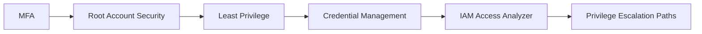
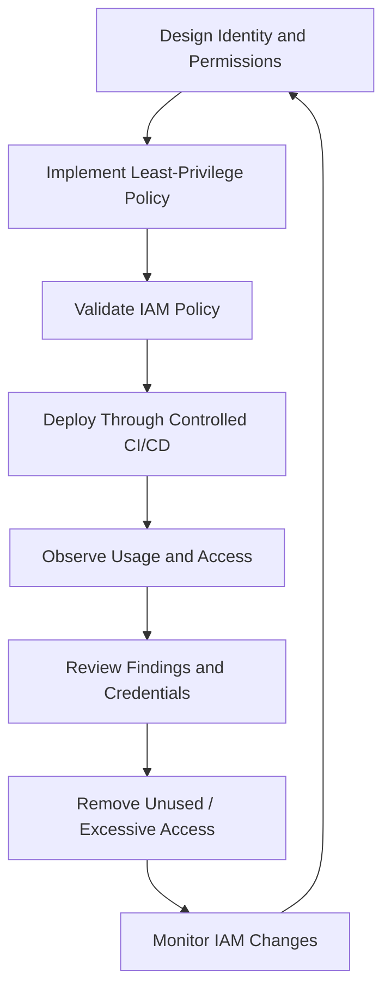

# README

## Overview

This folder contains production-oriented documentation for **AWS IAM security** within the Backend Engineering Playbook.

The material focuses on protecting identities, credentials, authorization boundaries, and IAM administration capabilities in production AWS environments.

It complements the broader IAM concepts documentation by concentrating on:

```text
Identity Security
    ↓
Credential Protection
    ↓
Least Privilege
    ↓
Authorization Analysis
    ↓
Privilege-Escalation Prevention
    ↓
Continuous IAM Security Operations
```

For foundational IAM concepts such as policies, roles, STS, trust policies, cross-account access, and workload identity, see the [IAM Concepts documentation](<../../01- Concepts/10- IAM/README.md>).

---

## Folder Structure

```text
09- IAM/
│
├── 01- MFA.md
├── 02- Root Account Best Practices.md
├── 03- Least Privilege.md
├── 04- Credential Management and Rotation.md
├── 05- IAM Access Analyzer.md
├── 06- IAM Privilege Escalation Paths.md
└── README.md
```

---

## Navigation

| # | File | Description |
|---|---|---|
| 01 | [01- MFA](./01-%20MFA.md) | MFA architecture, enforcement, conditions, privileged access, and operational considerations |
| 02 | [02- Root Account Best Practices](./02-%20Root%20Account%20Best%20Practices.md) | Root-account protection, MFA, access-key controls, monitoring, and recovery |
| 03 | [03- Least Privilege](./03-%20Least%20Privilege.md) | Least-privilege design for users, roles, workloads, CI/CD, policies, and production systems |
| 04 | [04- Credential Management and Rotation](./04-%20Credential%20Management%20and%20Rotation.md) | Access-key lifecycle, temporary credentials, rotation, credential exposure, and operational management |
| 05 | [05- IAM Access Analyzer](./05-%20IAM%20Access%20Analyzer.md) | External/internal access analysis, unused access, policy validation, policy generation, and access previews |
| 06 | [06- IAM Privilege Escalation Paths](./06-%20IAM%20Privilege%20Escalation%20Paths.md) | IAM privilege-escalation chains, iam:PassRole, policy modification, trust manipulation, and guardrails |

---

## Recommended Reading Order

The documents build from identity protection toward senior-level authorization security.



### Start With Identity Protection

Read:

```text
01- MFA
02- Root Account Best Practices
```

These establish the security baseline for privileged human access and the AWS account root identity.

### Build Least-Privilege Design

Read:

```text
03- Least Privilege
04- Credential Management and Rotation
```

These focus on limiting permissions and reducing the security exposure of long-lived credentials.

### Add Continuous IAM Analysis

Read:

```text
05- IAM Access Analyzer
```

This introduces automated analysis of:

```text
External access
Internal access
Unused access
Policy quality
Policy generation
Access previews
```

### Finish With Privilege-Escalation Analysis

Read:

```text
06- IAM Privilege Escalation Paths
```

This moves from individual permissions to authorization graphs and indirect escalation paths.

---

## Security Control Model

The folder can be viewed as a layered IAM security model:

```text
                    AWS IAM Security
                           |
        +------------------+------------------+
        |                  |                  |
     Identity          Credentials       Authorization
        |                  |                  |
       MFA             Rotation          Least Privilege
       Root            Temporary         Boundaries
       Federation      Credentials       SCPs
                                           |
                                           v
                                  Access Analysis
                                           |
                                           v
                                  Escalation Defense
```

Each layer addresses a different failure mode.

| Layer | Primary concern |
|---|---|
| MFA | Unauthorized use of human credentials |
| Root security | Protection of the highest account-level identity |
| Least privilege | Excessive permissions |
| Credential management | Long-lived or exposed credentials |
| Access Analyzer | Unexpected or unused access |
| Privilege-escalation analysis | Indirect paths to higher authority |

---

## Backend Engineering Relevance

IAM security should be designed together with the backend architecture.

Typical production relationships include:

```text
Django / FastAPI
    ↓
ECS / EKS / Lambda
    ↓
Workload IAM Role
    ↓
AWS Services
```

For CI/CD:

```text
GitHub Actions / CI Platform
    ↓
OIDC Federation
    ↓
Deployment Role
    ↓
AWS Infrastructure
```

For microservices:

```text
Orders Service
    ↓
OrdersTaskRole
    ↓
SQS / S3 / Secrets Manager

Payments Service
    ↓
PaymentsTaskRole
    ↓
KMS / Secrets Manager / SQS
```

The IAM security goal is to ensure each identity receives only the authority required for its actual responsibility.

---

## Senior-Level Focus

The most important concepts to reason about at senior level are:

```text
Identity
    ↓
Policy
    ↓
Effective Permissions
    ↓
Trust Relationships
    ↓
Delegation
    ↓
Resource Access
    ↓
Potential Escalation
```

A senior IAM review should ask:

```text
Who is the principal?

What permissions does it have?

What policies affect those permissions?

What identities can it modify?

What roles can it assume?

What roles can it pass?

What AWS services can it configure?

What resource policies can it change?

What permissions boundaries apply?

What SCPs apply?

What cross-account relationships exist?

Can the principal reach a higher-privileged authorization context?
```

---

## Key IAM Security Relationships

| Concept | Security question |
|---|---|
| MFA | Can stolen credentials be used without an additional factor? |
| Root account | Can the highest-level account identity be abused? |
| Least privilege | Does the identity have more permissions than required? |
| Credentials | Can long-lived credentials be exposed or reused? |
| Access Analyzer | Can unexpected access paths be detected automatically? |
| Privilege escalation | Can limited permissions be combined to obtain greater authority? |
| Permissions boundary | Can delegated identities exceed an approved permission ceiling? |
| SCP | Can organization-wide guardrails restrict dangerous capabilities? |
| Trust policy | Who can enter a privileged role? |
| `iam:PassRole` | Can a principal cause another role to execute through an AWS service? |

---

## Production IAM Security Workflow

A mature IAM workflow should operate continuously:



This creates a continuous security lifecycle rather than treating IAM as one-time configuration.

---

## Production Checklist

```text
Identity
    □ MFA enabled for privileged human access
    □ Root account strongly protected
    □ IAM users minimized
    □ Workforce identities use federation / Identity Center where appropriate

Credentials
    □ Long-lived credentials minimized
    □ Workloads use IAM roles
    □ Access keys are inventoried and rotated when required
    □ Credential exposure is monitored

Permissions
    □ Least privilege applied
    □ Resource scope is narrow
    □ Conditions are used where appropriate
    □ Permissions boundaries protect delegated administration
    □ SCPs provide organization-level guardrails

Analysis
    □ IAM Access Analyzer is configured
    □ External access is reviewed
    □ Unused access is reviewed
    □ Policy validation is part of IAM change management

Privilege Escalation
    □ iam:PassRole is tightly scoped
    □ Privileged policies are protected
    □ Privileged trust policies are protected
    □ Role creation is governed
    □ Group-based privilege paths are reviewed
    □ Cross-account trust is reviewed

Operations
    □ CloudTrail records IAM changes
    □ IAM changes are auditable
    □ Findings have owners
    □ Exceptions are documented
    □ Privileged roles are periodically reviewed
```

---

## Related IAM Concepts

For foundational IAM topics, use:

[**IAM Concepts**](<../../01- Concepts/10- IAM/README.md>)

That documentation covers the core authorization model, including:

```text
IAM Users
IAM Groups
IAM Roles
IAM Policies
Policy Evaluation
Trust Policies
STS
Temporary Credentials
Cross-Account Access
Federation
Workload Identity
ABAC
IAM CLI
IAM Troubleshooting
IAM Architecture
```

This security folder builds on those concepts and concentrates on how to secure and operate them in production.

---

## Key Takeaways

- **IAM security is layered:** MFA, root protection, least privilege, credential controls, access analysis, and privilege-escalation prevention address different parts of the authorization threat surface.
- **Least privilege is continuous:** permissions and credentials should be reviewed as workloads, teams, services, and AWS architectures evolve.
- **IAM Access Analyzer adds continuous analysis:** use it to identify unexpected access, unused permissions, and unsafe policy changes rather than relying only on manual review.
- **Privilege escalation requires graph-based reasoning:** analyze combinations of IAM permissions, trust policies, `iam:PassRole`, delegated services, resource policies, boundaries, and SCPs.
- **Production IAM should be integrated with the backend delivery lifecycle:** infrastructure-as-code, CI/CD, workload identity, CloudTrail, policy validation, and operational reviews should work together.