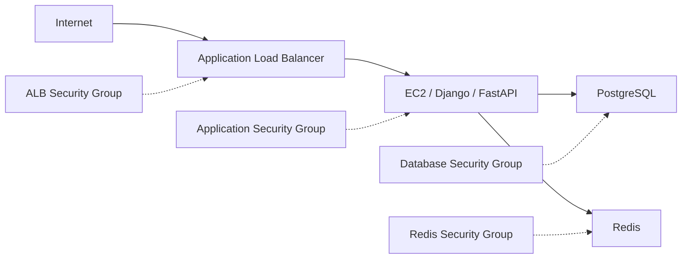
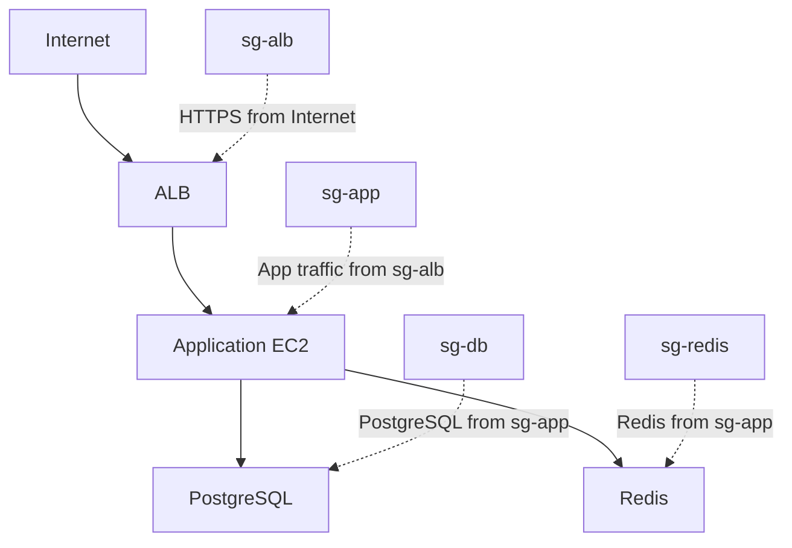

# 01- Security Groups

## Overview

AWS Security Groups are stateful virtual firewalls attached to resources such as EC2 instances and network interfaces. They control inbound and outbound network traffic based on rules for protocols, ports, and source or destination addresses.

For EC2 workloads, Security Groups form a primary network security boundary between:

- Internet clients and load balancers
- Load balancers and application servers
- Application servers and databases
- Application servers and Redis
- Application servers and other internal services

A typical backend architecture is:



The important architectural principle is:

> Allow traffic between trusted security boundaries instead of broadly opening ports to the network.

---

## What Is a Security Group?

A Security Group is a virtual firewall associated with an AWS resource's network interface.

For EC2, the Security Group controls whether traffic is allowed to reach or leave the instance.

A rule generally contains:

| Component | Example |
|---|---|
| Protocol | TCP |
| Port | 443 |
| Source | `0.0.0.0/0` |
| Source Security Group | `sg-0123456789abcdef0` |
| IPv6 source | `::/0` |
| Description | `HTTPS from Internet` |

Security Groups support:

- Inbound rules
- Outbound rules
- IPv4 CIDR sources/destinations
- IPv6 CIDR sources/destinations
- Security Group references
- Protocol and port restrictions

Security Groups operate at the network interface level rather than being installed inside the operating system.

---

## Why Security Groups Exist

EC2 instances need network-level access control before application-level authentication is reached.

For example, a FastAPI application may listen on:

```text
0.0.0.0:8000
```

That does not mean port `8000` should be reachable from the entire internet.

A Security Group can enforce:

```text
Internet
   |
   | HTTPS :443
   v
ALB
   |
   | TCP :8000
   v
EC2
```

The EC2 Security Group can therefore allow port `8000` only from the ALB Security Group.

---

## Stateful Behavior

Security Groups are **stateful**.

If an inbound connection is allowed, the response traffic is automatically allowed back through the Security Group without requiring a separate outbound rule specifically for that response.

For example:

```text
Client
  |
  | TCP 443
  v
EC2
  |
  | Response
  v
Client
```

If the inbound connection is permitted, the return traffic is tracked as part of that connection.

This differs from stateless network ACL behavior.

---

## Stateful Example

Suppose an EC2 instance has:

```text
Inbound:
TCP 443 from 0.0.0.0/0

Outbound:
No explicit matching rule
```

If the outbound policy does not permit the response, the connection can still behave according to the Security Group's stateful connection tracking semantics when the inbound flow is allowed.

However, production configurations should still explicitly define appropriate outbound policy rather than relying on accidental or overly broad defaults.

---

## Security Group Rules

An inbound rule can be represented as:

```text
Protocol    Port    Source
--------------------------------
TCP         443     0.0.0.0/0
TCP         22      10.0.10.0/24
TCP         8000    sg-alb
```

Interpretation:

- HTTPS is available publicly.
- SSH is available only from a trusted administrative network.
- Application traffic on port `8000` is available only from the load balancer Security Group.

---

## Inbound vs Outbound Rules

Security Groups have two independent rule sets.

### Inbound

Controls traffic entering the resource.

```text
Client
   |
   v
[ Inbound SG Rules ]
   |
   v
EC2
```

### Outbound

Controls traffic leaving the resource.

```text
EC2
   |
   v
[ Outbound SG Rules ]
   |
   v
Destination
```

For a backend server:

```text
Inbound:
    8000 from ALB SG

Outbound:
    5432 to Database SG
    6379 to Redis SG
    443 to required AWS/external services
```

---

## Security Group References

One of the most useful production patterns is referencing another Security Group instead of specifying an IP address.

For example:

```text
ALB SG
    |
    | TCP 8000
    v
Application SG
```

The application Security Group rule can conceptually be:

```text
Protocol: TCP
Port: 8000
Source: ALB Security Group
```

This is better than:

```text
TCP 8000
Source: 10.0.1.0/24
```

when the intent is specifically:

> Allow traffic from load balancers.

The relationship follows the Security Group rather than a fixed subnet CIDR.

---

## Three-Tier Security Group Architecture

A common production architecture is:



Example policy:

| Resource | Port | Source |
|---|---:|---|
| ALB | 443 | Internet |
| Application EC2 | 8000 | ALB SG |
| PostgreSQL | 5432 | Application SG |
| Redis | 6379 | Application SG |

This creates explicit trust boundaries.

---

## Security Group Chaining

Security Group chaining allows access to follow application relationships.

For example:

```text
ALB SG
  |
  +--> App SG
          |
          +--> DB SG
          |
          +--> Redis SG
```

The application layer does not need to know the IP addresses of database or Redis instances.

The security relationship becomes:

```text
Who may connect?
        |
        v
Application SG
```

rather than:

```text
Which IP addresses may connect?
```

This is especially useful when resources scale dynamically.

---

## CIDR-Based Rules

Security Groups can also use CIDR ranges.

Examples:

```text
10.0.0.0/16
10.10.0.0/24
192.168.1.10/32
0.0.0.0/0
```

The prefix length controls the address range.

| CIDR | Scope |
|---|---|
| `/32` | One IPv4 address |
| `/24` | 256 IPv4 addresses |
| `/16` | 65,536 IPv4 addresses |
| `/0` | Entire IPv4 address space |

Use the narrowest practical range.

---

## Public vs Private Access

A common mistake is assuming that an EC2 instance needs a public Security Group rule simply because the application needs internet access.

For example:

```text
Internet
   |
   v
ALB
   |
   v
Private EC2
```

The EC2 instance can remain in a private subnet while receiving traffic from the ALB.

Outbound internet access, if required, can be provided through appropriate VPC networking.

This provides a stronger security boundary:

```text
Public:
    ALB

Private:
    EC2
    Database
    Redis
```

---

## Common Production Pattern

For a Django or FastAPI service:

```text
ALB
 |
 | HTTPS 443
 v
EC2
 |
 | PostgreSQL 5432
 v
Database

EC2
 |
 | Redis 6379
 v
Redis
```

Security Groups:

```text
sg-alb
    Inbound:
        443 from 0.0.0.0/0

sg-app
    Inbound:
        8000 from sg-alb

sg-db
    Inbound:
        5432 from sg-app

sg-redis
    Inbound:
        6379 from sg-app
```

This is significantly safer than:

```text
sg-app
    Inbound:
        8000 from 0.0.0.0/0

sg-db
    Inbound:
        5432 from 0.0.0.0/0

sg-redis
    Inbound:
        6379 from 0.0.0.0/0
```

---

## Ports and Protocols

Security Groups can restrict traffic by protocol and port.

Common backend ports include:

| Port | Protocol | Typical Use |
|---:|---|---|
| 22 | TCP | SSH |
| 80 | TCP | HTTP |
| 443 | TCP | HTTPS |
| 8000 | TCP | FastAPI / Django development or internal application |
| 8080 | TCP | Application service |
| 5432 | TCP | PostgreSQL |
| 3306 | TCP | MySQL |
| 6379 | TCP | Redis |
| 9092 | TCP | Kafka |
| 2049 | TCP | NFS / EFS |

Do not open a port merely because an application happens to listen on it.

First identify:

```text
Who needs access?
From where?
For what protocol?
For what purpose?
```

---

## SSH Access

SSH is a common source of unnecessary exposure.

Avoid:

```text
TCP 22
Source: 0.0.0.0/0
```

when possible.

Prefer controlled administrative access through mechanisms such as:

- AWS Systems Manager Session Manager
- VPN
- Bastion architecture where justified
- Restricted administrative CIDRs

If SSH must be exposed:

```text
TCP 22
Source: trusted administrative CIDR
```

Do not treat changing the SSH port as a substitute for proper access control.

---

## HTTP and HTTPS

For a public application:

```text
Internet
   |
   | TCP 443
   v
ALB
```

The ALB can terminate TLS and forward traffic to EC2.

For example:

```text
Internet
    |
    | HTTPS 443
    v
ALB SG
    |
    | HTTP/TCP 8000
    v
App SG
```

Whether traffic between the ALB and EC2 should also use TLS depends on the application's security requirements and architecture.

---

## Database Security Groups

A database should generally not be publicly reachable.

Avoid:

```text
PostgreSQL
    |
    +-- 5432 from 0.0.0.0/0
```

Prefer:

```text
Application SG
       |
       | 5432
       v
Database SG
```

This expresses the intended architecture directly:

> Only application workloads may initiate PostgreSQL connections.

---

## Redis Security Groups

Redis should similarly be isolated.

Prefer:

```text
Application SG
       |
       | 6379
       v
Redis SG
```

Avoid exposing Redis publicly.

Redis is often trusted as an internal service, so unrestricted network access can create significant security exposure.

---

## Security Group Rule Evaluation

Security Groups are allow-list based.

There is no traditional explicit `DENY` rule.

Traffic is allowed when an applicable rule permits it.

For example:

```text
Inbound rules:

TCP 443 from 0.0.0.0/0
TCP 8000 from 10.0.0.0/16
```

There is no rule such as:

```text
DENY TCP 8000 from 10.0.5.10
```

If more granular deny behavior is required, evaluate other controls such as:

- Network ACLs
- AWS Network Firewall
- Application-level authorization
- Service-specific policy controls

---

## Multiple Security Groups

An EC2 network interface can have multiple Security Groups.

Conceptually:

```text
EC2
 |
 +-- sg-common
 +-- sg-monitoring
 +-- sg-application
```

Rules from the attached Security Groups are evaluated together.

This means adding another Security Group can expand the effective allowed traffic.

Be careful when troubleshooting because access may come from a Security Group that is not obvious from the application's primary configuration.

---

## Security Group Design Strategies

There are two common approaches.

### Role-Based Security Groups

Create Security Groups around workload roles.

```text
sg-alb
sg-api
sg-worker
sg-db
sg-redis
```

This is generally easier to reason about at scale.

### Instance-Specific Security Groups

Create highly specific groups for individual instances.

This can become difficult to maintain:

```text
sg-instance-001
sg-instance-002
sg-instance-003
...
```

For dynamic EC2 environments, role-based Security Groups are usually easier to operate.

---

## Application and Worker Separation

Django/FastAPI applications and Celery workers may have different network requirements.

For example:

```text
sg-api
    |
    +--> PostgreSQL
    +--> Redis

sg-worker
    |
    +--> PostgreSQL
    +--> Redis

sg-alb
    |
    +--> sg-api
```

The worker does not need to accept HTTP traffic from the ALB.

This reduces the attack surface.

---

## Security Groups and Microservices

In a microservice architecture:

```text
API Gateway / ALB
       |
       v
Service A
       |
       v
Service B
       |
       v
Service C
```

Security Groups can express service-level network relationships.

For example:

```text
sg-service-a
    |
    +--> TCP 9000 to sg-service-b

sg-service-b
    |
    +--> TCP 9001 to sg-service-c
```

However, Security Groups provide network-level access control, not business authorization.

A request being allowed through a Security Group does not mean the caller is authorized to perform a particular operation.

---

## Security Groups and NACLs

Security Groups and Network ACLs operate at different levels.

| Feature | Security Group | Network ACL |
|---|---|---|
| Scope | Resource / ENI | Subnet |
| State | Stateful | Stateless |
| Rules | Allow | Allow and deny |
| Rule direction | Inbound / outbound | Inbound / outbound |
| Typical use | Workload-level access control | Subnet-level traffic filtering |
| Rule evaluation | Aggregate allow rules | Ordered rules |
| Primary backend use | Service boundaries | Additional network boundary |

For most EC2 application architectures, Security Groups are the primary resource-level network control.

---

## Security Groups and IAM

Security Groups and IAM solve different problems.

```text
Security Group
    |
    v
Can this network connection reach the resource?

IAM
    |
    v
Is this identity authorized to perform this AWS/API action?
```

For example:

```text
Security Group:
    EC2 can connect to S3 endpoint

IAM:
    EC2 role can read objects from bucket X
```

Both controls may be required.

---

## Security Groups and Application Authentication

Network access does not replace application authentication.

For example:

```text
ALB
  |
  v
EC2
```

A Security Group can restrict which systems can connect to EC2.

The application may still need:

- Authentication
- Authorization
- JWT validation
- OAuth/OIDC
- API keys
- mTLS
- Role-based access control

Security Groups provide network trust, not user identity.

---

## Default Security Group

Every VPC includes a default Security Group.

Its behavior can be surprising because it allows traffic between resources that use the same default Security Group.

Avoid using the default Security Group as the intentional production security boundary.

Instead, create purpose-specific Security Groups with documented rules.

---

## Default Outbound Rules

New Security Groups commonly begin with an outbound rule that allows all IPv4 traffic.

For example:

```text
Outbound:
All traffic
0.0.0.0/0
```

This is convenient but may be broader than required for a security-sensitive environment.

A mature security model can restrict outbound access based on actual application requirements.

For example:

```text
Application EC2
    |
    +--> PostgreSQL :5432
    +--> Redis :6379
    +--> HTTPS :443
```

Outbound restriction requires careful dependency mapping because application startup, package installation, monitoring, AWS APIs, DNS, and external services may all require network access.

---

## Least Privilege

Apply least privilege to both inbound and outbound traffic.

Instead of:

```text
TCP 1-65535
Source: 0.0.0.0/0
```

define the actual requirement:

```text
TCP 443
Source: trusted clients
```

Instead of:

```text
TCP 5432
Source: 0.0.0.0/0
```

use:

```text
TCP 5432
Source: sg-app
```

Least privilege reduces the blast radius of compromised resources.

---

## Rule Descriptions

Security Group rules should include meaningful descriptions.

Example:

```text
Allow ALB to reach Django application
Allow application servers to reach PostgreSQL
Allow worker nodes to reach Redis
```

Avoid:

```text
test
temp
abc
new rule
```

Descriptions become operational documentation when engineers investigate connectivity months later.

---

## Infrastructure as Code

Production Security Groups should generally be managed through Infrastructure as Code.

Terraform example:

```hcl
resource "aws_security_group" "app" {
  name        = "app-sg"
  description = "Application tier security group"
  vpc_id      = var.vpc_id

  ingress {
    description     = "Application traffic from ALB"
    protocol        = "tcp"
    from_port       = 8000
    to_port         = 8000
    security_groups = [aws_security_group.alb.id]
  }

  egress {
    description     = "HTTPS outbound"
    protocol        = "tcp"
    from_port       = 443
    to_port         = 443
    cidr_blocks     = ["0.0.0.0/0"]
  }
}
```

The exact outbound policy should reflect the application's real dependencies.

IaC provides:

- Version control
- Reviewable changes
- Repeatability
- Drift detection
- Automated deployment
- Auditability

---

## AWS CLI

List Security Groups:

```bash
aws ec2 describe-security-groups
```

List Security Groups in a specific VPC:

```bash
aws ec2 describe-security-groups \
  --filters Name=vpc-id,Values=vpc-0123456789abcdef0
```

Get a specific Security Group:

```bash
aws ec2 describe-security-groups \
  --group-ids sg-0123456789abcdef0
```

Create a Security Group:

```bash
aws ec2 create-security-group \
  --group-name app-sg \
  --description "Application tier security group" \
  --vpc-id vpc-0123456789abcdef0
```

Add an ingress rule:

```bash
aws ec2 authorize-security-group-ingress \
  --group-id sg-0123456789abcdef0 \
  --ip-permissions '[
    {
      "IpProtocol": "tcp",
      "FromPort": 8000,
      "ToPort": 8000,
      "UserIdGroupPairs": [
        {
          "GroupId": "sg-0fedcba9876543210",
          "Description": "Allow application traffic from ALB"
        }
      ]
    }
  ]'
```

Add a CIDR-based HTTPS rule:

```bash
aws ec2 authorize-security-group-ingress \
  --group-id sg-0123456789abcdef0 \
  --protocol tcp \
  --port 443 \
  --cidr 0.0.0.0/0
```

Revoke a rule:

```bash
aws ec2 revoke-security-group-ingress \
  --group-id sg-0123456789abcdef0 \
  --protocol tcp \
  --port 443 \
  --cidr 0.0.0.0/0
```

List Security Groups attached to an instance:

```bash
aws ec2 describe-instances \
  --instance-ids i-0123456789abcdef0 \
  --query 'Reservations[].Instances[].SecurityGroups[].{ID:GroupId,Name:GroupName}' \
  --output table
```

---

## Finding Overly Broad Rules

Useful queries can identify publicly exposed ports.

For example:

```bash
aws ec2 describe-security-groups \
  --query 'SecurityGroups[].{GroupId:GroupId,Name:GroupName,Ingress:IpPermissions}'
```

When reviewing results, pay particular attention to:

```text
0.0.0.0/0
::/0
```

combined with sensitive ports such as:

```text
22
3306
5432
6379
9200
27017
```

A public rule is not automatically incorrect, but it should have a clear architectural reason.

---

## Troubleshooting Connectivity

When an application cannot connect to another service, inspect the path systematically.

```text
Client
  |
  v
Route / DNS
  |
  v
Network path
  |
  v
Security Group
  |
  v
NACL
  |
  v
Route Table
  |
  v
Target service
  |
  v
Application listener
```

Check:

1. Destination IP or DNS resolution
2. Destination port
3. Source IP or Security Group
4. Security Group rules
5. Network ACLs
6. Route tables
7. Subnet configuration
8. Application process
9. Operating-system firewall
10. Service configuration

A Security Group issue is only one possible cause of connectivity failure.

---

## Example: ALB to FastAPI

Suppose FastAPI listens on:

```text
0.0.0.0:8000
```

Architecture:

```text
Internet
   |
   | HTTPS :443
   v
ALB
   |
   | TCP :8000
   v
FastAPI EC2
```

Security Groups:

```text
ALB SG

Inbound:
    TCP 443 from 0.0.0.0/0

App SG

Inbound:
    TCP 8000 from ALB SG
```

The application instance does not need:

```text
TCP 8000 from 0.0.0.0/0
```

This keeps the backend port private to the intended traffic source.

---

## Example: Django to PostgreSQL

Architecture:

```text
Django EC2
    |
    | TCP 5432
    v
PostgreSQL
```

Security Groups:

```text
App SG
    |
    | 5432
    v
DB SG
```

Database Security Group:

```text
Inbound:
    PostgreSQL TCP 5432
    Source: App SG
```

No public database access is required.

---

## Example: Celery to Redis

Architecture:

```text
Django / FastAPI
       |
       v
Celery Queue / Redis
       ^
       |
Celery Workers
```

Security Group relationship:

```text
sg-api    ----\
               +----> sg-redis :6379
sg-worker ----/
```

Only the application and worker tiers that actually require Redis should be permitted to connect.

---

## High Availability Considerations

Security Groups are not a single-instance configuration concern.

In an Auto Scaling architecture:

```text
ALB
 |
 +--> EC2-A
 +--> EC2-B
 +--> EC2-C
 +--> EC2-D
```

All application instances should use a consistent Security Group policy.

Security Group rules should therefore be associated with workload roles rather than individual instance IP addresses whenever possible.

This allows new instances to become operational without manually changing network rules.

---

## Security Group Limits and Scaling

Large environments can encounter Security Group and rule-management limits.

Potential causes include:

- Excessive individual rules
- Excessive Security Group attachments
- Overly fragmented workload design
- Large numbers of CIDR entries
- Complex microservice-to-microservice relationships

At scale:

- Reuse role-based Security Groups where appropriate.
- Avoid unnecessary per-instance rules.
- Prefer Security Group references for service relationships.
- Review AWS quotas before large architectural changes.
- Use automation rather than manual rule management.

Do not create a unique Security Group for every EC2 instance without a strong reason.

---

## Monitoring and Auditing

Security Group configuration should be monitored for unexpected changes.

Useful AWS capabilities include:

- CloudTrail for API activity
- AWS Config for configuration tracking
- VPC Flow Logs for network-flow visibility
- Security Hub for security findings where applicable
- IAM controls around who can modify network configuration

A useful operational question is:

> Who changed this Security Group rule, when, and what traffic does the change permit?

Network-level observability and API-level audit logs answer different parts of that question.

---

## Security Considerations

### Avoid Public Database Access

Do not expose PostgreSQL, MySQL, Redis, Kafka, or similar internal services to the internet unless there is an explicitly justified architecture.

### Restrict Administrative Access

Use controlled administrative paths instead of unrestricted SSH.

### Avoid Broad Port Ranges

Prefer:

```text
TCP 443
```

over:

```text
TCP 1-65535
```

when possible.

### Restrict IPv6 as Well as IPv4

If IPv6 is enabled, review:

```text
0.0.0.0/0
```

and:

```text
::/0
```

independently.

An application protected only by IPv4 rules may still be unintentionally reachable through IPv6 if IPv6 networking is configured.

### Review Outbound Access

Unrestricted outbound access can allow a compromised instance to communicate with arbitrary destinations.

Outbound restrictions should be introduced carefully because they can also break legitimate dependencies.

---

## Common Mistakes

### Opening Every Port to the Internet

```text
0.0.0.0/0
TCP 1-65535
```

This dramatically increases the attack surface.

### Publicly Exposing Databases

```text
5432 from 0.0.0.0/0
```

A database should normally be reachable only from the application tier or another explicitly authorized workload.

### Allowing Application Ports Publicly

If an ALB is the public entry point, the EC2 application port should generally only accept traffic from the ALB Security Group.

### Using IP Addresses Instead of Security Group References

Fixed IP-based rules become difficult to maintain when instances are replaced or scaled.

### Depending on the Default Security Group

The default Security Group is convenient for experimentation but can create unclear trust relationships in production.

### Forgetting IPv6

Review both IPv4 and IPv6 rules when IPv6 is enabled.

### Assuming Security Groups Block Everything

Security Groups are one network security layer. They do not replace:

- IAM
- Application authentication
- Network ACLs
- Host security
- Encryption
- Secrets management

### Changing Rules Manually in Production

Manual changes can create configuration drift.

Prefer IaC and controlled change processes.

---

## Production Best Practices

1. Create Security Groups around workload roles rather than individual instances.
2. Allow only required ports and protocols.
3. Prefer Security Group references for service-to-service communication.
4. Keep application instances private when a public load balancer is sufficient.
5. Never expose databases or Redis publicly without a deliberate architectural requirement.
6. Use controlled administrative access rather than unrestricted SSH.
7. Document every production rule with a meaningful description.
8. Manage Security Groups through Infrastructure as Code where practical.
9. Monitor changes through CloudTrail and configuration controls.
10. Review both inbound and outbound access.
11. Review IPv4 and IPv6 independently.
12. Regularly identify stale and overly broad rules.
13. Test connectivity after rule changes.
14. Account for Security Group and VPC-related quotas when designing large systems.

---

## Security Group Design Checklist

### Architecture

- [ ] Security Groups are organized by workload role.
- [ ] Public traffic terminates at the intended entry point.
- [ ] Application instances are private where appropriate.
- [ ] Database access is restricted to authorized workloads.
- [ ] Redis access is restricted to authorized workloads.

### Rules

- [ ] Only required ports are open.
- [ ] Source ranges are as narrow as practical.
- [ ] Security Group references are used for internal service relationships.
- [ ] IPv4 rules have been reviewed.
- [ ] IPv6 rules have been reviewed where applicable.
- [ ] Outbound access has been evaluated.

### Operations

- [ ] Rules have meaningful descriptions.
- [ ] Changes are managed through an approved process.
- [ ] Infrastructure as Code is used where practical.
- [ ] CloudTrail auditing is available.
- [ ] Network troubleshooting procedures are documented.
- [ ] Stale rules are periodically reviewed.

### Security

- [ ] SSH is not unnecessarily public.
- [ ] Databases are not publicly exposed.
- [ ] Redis is not publicly exposed.
- [ ] Broad `0.0.0.0/0` rules have explicit justification.
- [ ] Security Group permissions complement IAM and application authorization.

---

## Interview Considerations

### Are Security Groups stateful or stateless?

Security Groups are stateful. Return traffic for an allowed connection is tracked automatically.

### Can a Security Group explicitly deny traffic?

No. Security Groups provide allow rules rather than traditional explicit deny rules.

### Can one Security Group reference another?

Yes. Security Group references are commonly used to express service-to-service access relationships.

### Why use a Security Group reference instead of an IP address?

Because the rule follows the workload's Security Group membership rather than depending on dynamically changing instance IP addresses.

### Can an EC2 instance have multiple Security Groups?

Yes. The effective rules are the combined permissions of the attached Security Groups.

### What is the difference between Security Groups and NACLs?

Security Groups are stateful, resource-level controls. NACLs operate at the subnet level and are stateless with ordered allow/deny rules.

### How would you secure an ALB-to-EC2 architecture?

A common pattern is:

```text
Internet
   |
   | 443
   v
ALB SG
   |
   | 8000
   v
App SG
```

The application Security Group allows port `8000` from the ALB Security Group rather than from the public internet.

### How would you secure PostgreSQL?

Use a database Security Group that permits TCP `5432` only from the application Security Group:

```text
App SG
   |
   | 5432
   v
DB SG
```

### Do Security Groups provide application authorization?

No. They provide network-level access control. Authentication and authorization must still be implemented at the application or identity layer.

## Key Takeaways

- **Security Groups are stateful, resource-level firewalls and should be designed around explicit workload trust boundaries.**
- **Prefer Security Group references for service-to-service access, such as ALB → application, application → PostgreSQL, and application → Redis.**
- **Expose only required ports and sources; avoid public access to databases, Redis, SSH, and internal application ports.**
- **Security Groups complement rather than replace IAM, application authorization, encryption, host security, NACLs, and network observability.**
- **Manage production rules through controlled automation or Infrastructure as Code, and continuously audit for overly broad, stale, or unexpected access.**