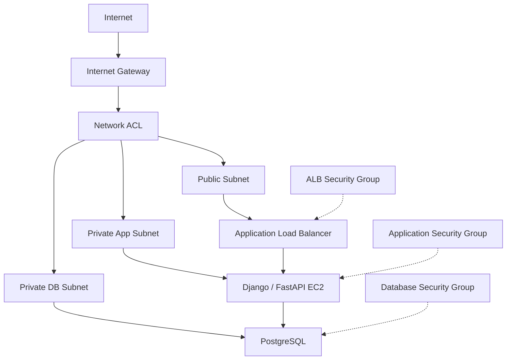
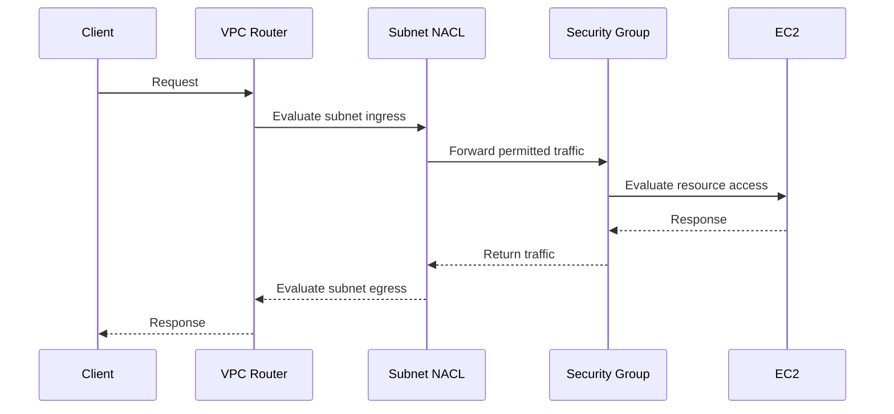
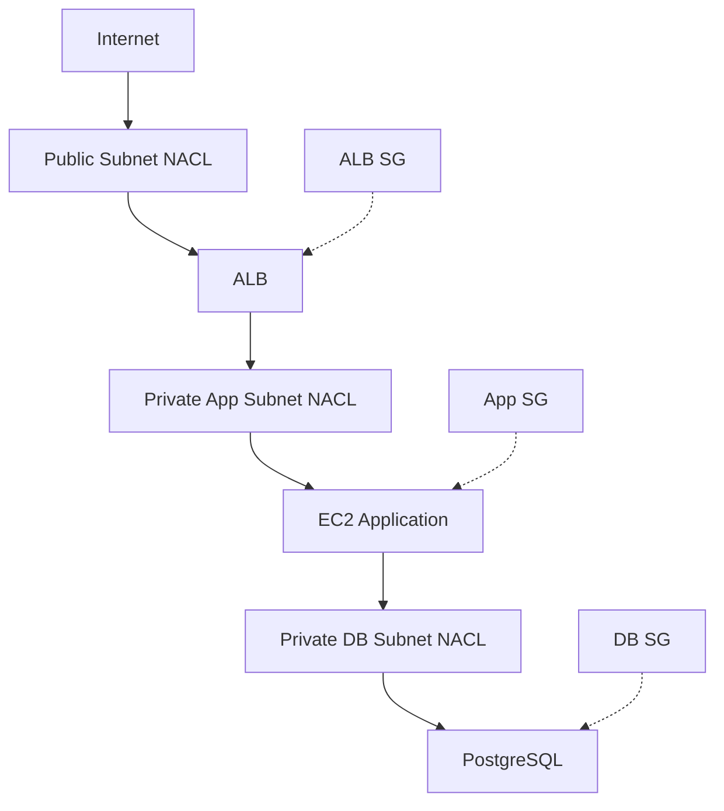

# 02- Network ACLs vs Security Groups

## Overview

AWS Network Access Control Lists (NACLs) and Security Groups are VPC network security controls, but they operate at different layers and solve different problems.

The most important distinction is:

```text
Security Group
    -> Resource-level
    -> Stateful
    -> Allow rules
    -> Primary workload access control

Network ACL
    -> Subnet-level
    -> Stateless
    -> Allow and deny rules
    -> Coarse-grained / defense-in-depth control
```

AWS recommends Security Groups as the primary mechanism for controlling network access to resources, with Network ACLs used when subnet-level, stateless controls are required. :contentReference[oaicite:0]{index=0}

A typical production architecture can use both:



The NACL provides a subnet-level boundary, while Security Groups enforce resource-level access.

---

## Why Both Exist

A single network security mechanism is often insufficient for layered infrastructure security.

Consider an application architecture:

```text
Internet
    |
    v
ALB
    |
    v
Django / FastAPI
    |
    v
PostgreSQL
```

Security Groups can express:

```text
Internet -> ALB :443
ALB -> Application :8000
Application -> PostgreSQL :5432
```

A NACL can additionally enforce subnet-level restrictions such as:

```text
Application subnet:
    Deny traffic from a known malicious CIDR
```

This creates defense in depth.

AWS specifically describes NACLs as useful for coarse-grained subnet controls and as an additional layer of defense behind Security Groups. :contentReference[oaicite:1]{index=1}

---

## Security Groups

A Security Group is associated with a resource's network interface and controls allowed inbound and outbound traffic.

For EC2:

```text
EC2
 |
 +-- Security Group
       |
       +-- Inbound rules
       +-- Outbound rules
```

Security Groups are:

- Stateful
- Resource-level
- Allow-only
- Suitable for application/service boundaries
- Capable of referencing other Security Groups

AWS describes Security Groups as the primary mechanism for controlling network access to VPC resources. :contentReference[oaicite:2]{index=2}

---

## Network ACLs

A Network ACL is associated with a subnet and controls traffic entering and leaving that subnet.

```text
Subnet
 |
 +-- Network ACL
       |
       +-- Inbound rules
       +-- Outbound rules
```

A NACL applies to traffic for all resources in the associated subnet.

NACLs are:

- Stateless
- Subnet-level
- Allow and deny based
- Rule-number ordered
- Useful for coarse-grained subnet controls
- Useful as an additional defense layer

Each subnet must have a NACL association; if no custom NACL is explicitly associated, the subnet uses the VPC's default NACL. :contentReference[oaicite:3]{index=3}

---

## Core Comparison

| Characteristic | Security Group | Network ACL |
|---|---|---|
| Scope | Resource / network interface | Subnet |
| Primary purpose | Workload-level access control | Subnet-level traffic filtering |
| Stateful | Yes | No |
| Rules | Allow only | Allow and deny |
| Rule evaluation | Rules considered together | Lowest matching rule number wins |
| Return traffic | Automatically allowed for established flows | Must be explicitly allowed |
| Security Group references | Yes | No |
| Applies to | Associated resources | Every resource in associated subnet |
| Typical use | Application/service boundaries | Coarse subnet guardrails |
| Typical recommendation | Primary control | Secondary / defense in depth |

These differences are fundamental to designing and troubleshooting AWS VPC networking. :contentReference[oaicite:4]{index=4}

---

## Stateful vs Stateless

The most important technical difference is connection state.

### Security Group: Stateful

Suppose an EC2 instance allows:

```text
Inbound:
TCP 443 from 0.0.0.0/0
```

A client establishes:

```text
Client -> EC2 :443
```

The response:

```text
EC2 -> Client
```

is automatically permitted as part of the established flow.

You do not need a separate outbound rule specifically for that response flow. :contentReference[oaicite:5]{index=5}

---

### Network ACL: Stateless

NACLs evaluate packets independently.

If inbound traffic is allowed:

```text
Client -> Subnet -> EC2 :443
```

the response traffic:

```text
EC2 -> Subnet -> Client
```

must also be permitted by the outbound NACL rules.

AWS explicitly documents this requirement for NACLs. :contentReference[oaicite:6]{index=6}

---

## Stateful vs Stateless Example

Consider:

```text
Client
  |
  | TCP 443
  v
EC2
```

Security Group:

```text
Inbound:
    TCP 443 ALLOW

Outbound:
    No specific response rule required
```

NACL:

```text
Inbound:
    TCP 443 ALLOW

Outbound:
    Ephemeral destination ports ALLOW
```

The NACL must account for the client's ephemeral source port because the response is a separate packet flow from the perspective of a stateless filter.

---

## NACL Rule Evaluation

NACL rules have rule numbers.

For example:

```text
Rule 100 -> ALLOW TCP 443
Rule 200 -> DENY TCP 443
Rule *   -> DENY
```

The lower-numbered matching rule is evaluated first.

If rule `100` matches, evaluation stops.

Therefore:

```text
100 ALLOW
200 DENY
```

means the traffic is allowed if it matches rule 100.

Reversing the order:

```text
100 DENY
200 ALLOW
```

means the traffic is denied before rule 200 can allow it.

AWS evaluates NACL rules in ascending rule-number order and stops at the first matching rule. :contentReference[oaicite:7]{index=7}

---

## Rule Numbering Strategy

Use gaps between rule numbers.

Prefer:

```text
100
200
300
```

instead of:

```text
1
2
3
```

This leaves room to insert rules later.

For example:

```text
100 ALLOW HTTPS
150 DENY malicious CIDR
200 ALLOW internal traffic
```

AWS recommends using increments such as 10 or 100 to make future rule insertion easier. :contentReference[oaicite:8]{index=8}

---

## Security Group Rule Evaluation

Security Groups work differently.

They do not use the same ordered-rule model as NACLs.

Conceptually:

```text
Security Group
    |
    +-- Rule A
    +-- Rule B
    +-- Rule C
```

AWS evaluates the applicable Security Group rules together when determining whether traffic is allowed. There is no ordered first-match allow/deny model comparable to NACLs. :contentReference[oaicite:9]{index=9}

This makes Security Groups easier to reason about for service-level access control.

---

## Resource Level vs Subnet Level

Consider:

```text
VPC
 |
 +-- Subnet A
 |     |
 |     +-- EC2-1
 |     +-- EC2-2
 |
 +-- Subnet B
       |
       +-- EC2-3
```

A NACL associated with Subnet A affects:

```text
EC2-1
EC2-2
```

A Security Group attached only to EC2-1 affects:

```text
EC2-1
```

This distinction is important when designing shared subnet boundaries.

---

## Traffic Flow

A simplified traffic path can be visualized as:



The exact packet-processing implementation is abstracted by AWS, but the architecture is useful for troubleshooting.

---

## Production Architecture

A common three-tier design is:



Security Groups define the intended application relationships:

```text
Internet
    |
    +--> ALB SG :443

ALB SG
    |
    +--> App SG :8000

App SG
    |
    +--> DB SG :5432
```

NACLs can then provide subnet-level restrictions.

---

## When to Use Security Groups

Security Groups should be the default choice for most EC2 workload access control.

Use them for:

- ALB-to-EC2 access
- EC2-to-database access
- EC2-to-Redis access
- Service-to-service communication
- SSH or administrative access
- Application port restrictions
- Microservice network boundaries

For example:

```text
ALB SG
    |
    +--> App SG :8000

App SG
    |
    +--> PostgreSQL SG :5432
    +--> Redis SG :6379
```

This is the natural Security Group use case.

---

## When to Use Network ACLs

NACLs are appropriate when subnet-level controls are useful.

Typical reasons include:

- Defense in depth
- Blocking a known CIDR range
- Enforcing coarse subnet boundaries
- Applying controls across all resources in a subnet
- Providing a subnet-level guardrail
- Supporting specific compliance or network segmentation requirements

AWS recommends using NACLs when necessary rather than treating them as the primary mechanism for ordinary resource access control. :contentReference[oaicite:10]{index=10}

---

## When NACLs Are Especially Useful

Suppose an application subnet contains several resources:

```text
Private App Subnet
 |
 +-- EC2-1
 +-- EC2-2
 +-- EC2-3
```

A NACL can enforce a subnet-wide rule:

```text
Deny:
10.50.20.0/24
```

This applies at the subnet boundary rather than requiring a matching deny rule on every Security Group.

This is useful when the requirement itself is subnet-oriented.

---

## NACLs as Defense in Depth

A NACL can protect against certain configuration mistakes.

For example:

```text
Expected:

Internet
   |
   v
ALB
   |
   v
Application EC2
```

But someone accidentally changes the application Security Group:

```text
App SG
    TCP 8000
    Source: 0.0.0.0/0
```

A subnet NACL can provide another restriction layer if designed appropriately.

AWS specifically identifies this as a possible use of NACLs: they can provide a backup or guardrail if an instance is launched or configured with an incorrect Security Group. :contentReference[oaicite:11]{index=11}

---

## NACLs and Ephemeral Ports

This is one of the most common NACL interview and troubleshooting topics.

Suppose a client connects to:

```text
EC2:443
```

The client may use an ephemeral source port:

```text
Client:49152 -> EC2:443
```

The response is:

```text
EC2:443 -> Client:49152
```

Because NACLs are stateless, the NACL must permit the return traffic to the client's ephemeral port.

A conceptual rule might be:

```text
Outbound:
TCP 1024-65535
Destination: client CIDR
```

The exact ephemeral range depends on the initiating client and operating system.

AWS notes that different clients use different ephemeral ranges and that Elastic Load Balancing, NAT gateways, Linux, and Windows can use different ranges. :contentReference[oaicite:12]{index=12}

---

## Why NACL Troubleshooting Can Be Difficult

Security Groups are usually straightforward:

```text
Is source allowed?
Is destination port allowed?
```

NACL troubleshooting requires considering both directions:

```text
Inbound request
      |
      v
Inbound NACL
      |
      v
Security Group
      |
      v
Application
      |
      v
Outbound NACL
      |
      v
Response
```

A missing return-path rule can cause apparently valid connections to fail.

---

## Example: Web Application NACL

Suppose a public subnet contains an ALB.

A simplified NACL might allow:

```text
Inbound:
100 ALLOW TCP 443 from 0.0.0.0/0
200 ALLOW TCP 1024-65535 from 0.0.0.0/0
*   DENY ALL

Outbound:
100 ALLOW TCP 443 to 0.0.0.0/0
200 ALLOW TCP 1024-65535 to 0.0.0.0/0
*   DENY ALL
```

This is only an illustrative pattern.

The correct rules depend on:

- Traffic direction
- Client behavior
- Load balancer behavior
- Application architecture
- IPv4/IPv6
- NAT
- Other AWS services
- Required protocols

Do not blindly copy an ephemeral-port range into every NACL.

---

## Example: Application Subnet

Suppose:

```text
ALB
  |
  | TCP 8000
  v
Application subnet
```

The application NACL must allow the traffic required to reach the application and the return traffic required for established connections.

The application Security Group can then enforce the more precise rule:

```text
TCP 8000
Source: ALB SG
```

This demonstrates the intended division of responsibility:

```text
NACL:
    Coarse subnet boundary

Security Group:
    Precise workload relationship
```

---

## Example: Database Subnet

A database subnet can use a NACL as an additional boundary while the database Security Group provides the primary access control.

```text
Application SG
      |
      | TCP 5432
      v
Database SG
      |
      v
Database subnet NACL
```

The database NACL should not be treated as a replacement for the database Security Group.

---

## Allow vs Deny

This is a major difference.

Security Groups:

```text
ALLOW
ALLOW
ALLOW
```

No explicit deny rules.

NACLs:

```text
ALLOW
DENY
ALLOW
DENY
```

This makes NACLs useful for explicit subnet-level blocking.

For example:

```text
100 ALLOW TCP 443
110 DENY 10.10.10.0/24
120 ALLOW TCP 443
```

The ordering matters.

If traffic from `10.10.10.0/24` reaches rule 110, it is denied and later rules are not evaluated.

---

## Common Architecture Pattern

A practical production design is:

```text
                 Internet
                    |
                    v
             Public Subnet
                    |
               Public NACL
                    |
                    v
                   ALB
                    |
                    v
             Private App Subnet
                    |
                App NACL
                    |
                    v
              EC2 / ASG
                    |
                    v
              Private DB Subnet
                    |
                 DB NACL
                    |
                    v
               PostgreSQL
```

Security Groups:

```text
ALB SG
  |
  +--> App SG

App SG
  |
  +--> DB SG
```

This gives two distinct control planes:

```text
NACL:
    Subnet-level guardrail

Security Group:
    Resource-level policy
```

---

## Kubernetes Comparison

The concepts can be compared loosely with Kubernetes networking, but they should not be treated as equivalent.

In Kubernetes:

```text
NetworkPolicy
    |
    v
Pod-level traffic policy
```

In AWS:

```text
Security Group
    |
    v
Resource / ENI-level network policy
```

NACLs are closer to a subnet boundary than a Kubernetes Pod-level policy.

Kubernetes clusters running on EC2 may involve multiple network-control layers:

```text
VPC NACL
    |
Security Group
    |
Kubernetes NetworkPolicy
    |
Application
```

Each layer solves a different problem.

---

## Security Group vs NACL Decision Guide

| Requirement | Preferred Control |
|---|---|
| ALB → EC2 | Security Group |
| EC2 → PostgreSQL | Security Group |
| EC2 → Redis | Security Group |
| Microservice access | Security Group |
| Restrict one workload | Security Group |
| Block a CIDR across an entire subnet | NACL |
| Subnet-wide deny rule | NACL |
| Defense in depth | NACL + Security Group |
| Explicit deny requirement | NACL |
| Stateful connection tracking | Security Group |
| Fine-grained service relationship | Security Group |

The general rule is:

> Use Security Groups for workload relationships; use NACLs when you need subnet-level stateless controls.

---

## AWS CLI

List NACLs:

```bash
aws ec2 describe-network-acls
```

List NACLs for a VPC:

```bash
aws ec2 describe-network-acls \
  --filters Name=vpc-id,Values=vpc-0123456789abcdef0
```

Inspect a specific NACL:

```bash
aws ec2 describe-network-acls \
  --network-acl-ids acl-0123456789abcdef0
```

List Security Groups:

```bash
aws ec2 describe-security-groups \
  --filters Name=vpc-id,Values=vpc-0123456789abcdef0
```

Find the NACL associated with a subnet:

```bash
aws ec2 describe-network-acls \
  --filters Name=association.subnet-id,Values=subnet-0123456789abcdef0
```

Inspect NACL entries:

```bash
aws ec2 describe-network-acls \
  --network-acl-ids acl-0123456789abcdef0 \
  --query 'NetworkAcls[].Entries[].{Rule:RuleNumber,Protocol:Protocol,Action:RuleAction,Inbound:Egress,CIDR:CidrBlock,PortRange:PortRange}' \
  --output table
```

---

## Troubleshooting Workflow

When an EC2 connection fails, do not immediately modify the Security Group.

Inspect the complete path.

### Check the Destination

```text
Is the application listening?
```

For example:

```bash
ss -lntp
```

### Check Routing

Verify:

- Route table
- Subnet
- Internet Gateway
- NAT Gateway
- VPC peering
- Transit Gateway
- VPN / Direct Connect

### Check NACL

Inspect:

- Inbound rule
- Outbound rule
- Rule ordering
- Source/destination CIDR
- Protocol
- Port
- Ephemeral return ports

### Check Security Group

Inspect:

- Source
- Destination
- Protocol
- Port
- Attached Security Groups

### Check Host Firewall

Examples:

```text
iptables
nftables
firewalld
Windows Firewall
```

### Check the Application

Verify:

- Process is running
- Correct bind address
- Correct port
- TLS configuration
- Application logs

---

## VPC Flow Logs

VPC Flow Logs are useful for diagnosing traffic that is accepted or rejected at the VPC networking layer.

They can help investigate:

```text
Source IP
Destination IP
Source port
Destination port
Protocol
Traffic action
```

Flow Logs can be configured for a VPC, subnet, or network interface and can help diagnose overly restrictive or permissive Security Group and NACL rules. :contentReference[oaicite:13]{index=13}

A useful troubleshooting flow is:

```text
Connection failure
      |
      v
VPC Flow Logs
      |
      +--> ACCEPT
      |
      +--> REJECT
```

A `REJECT` result narrows the investigation, but you still need to determine which network control or routing condition caused the failure.

---

## Security Considerations

### Prefer Security Groups for Application Access

Security Groups provide stateful access control and Security Group references, making them well suited for service-to-service relationships. :contentReference[oaicite:14]{index=14}

### Use NACLs Deliberately

NACLs can become difficult to operate when they contain many tightly coupled rules.

Every change must account for:

- Inbound traffic
- Outbound traffic
- Return traffic
- Ephemeral ports
- Rule ordering
- Multiple protocols
- IPv4
- IPv6

### Avoid Overly Broad Rules

Do not use:

```text
ALLOW ALL
0.0.0.0/0
```

unless there is a deliberate architectural reason.

### Protect Against Configuration Drift

Manage network controls through:

- Infrastructure as Code
- Change review
- AWS Config
- CloudTrail
- Security monitoring

### Consider Additional Controls

Security Groups and NACLs are not the only network security mechanisms.

Depending on the architecture, additional controls may include:

- AWS Network Firewall
- AWS WAF
- VPC Flow Logs
- Route 53 Resolver DNS Firewall
- VPN
- PrivateLink
- IAM
- Application-level authentication

AWS documents these as separate controls for different network-security requirements. :contentReference[oaicite:15]{index=15}

---

## Common Mistakes

### Treating NACLs Like Security Groups

This often results in missing return-traffic rules.

Remember:

```text
Security Group -> Stateful
NACL            -> Stateless
```

### Forgetting Ephemeral Ports

A request can reach the server while the response is blocked by the NACL.

### Misordering NACL Rules

A broad earlier rule can prevent a more specific later rule from ever being evaluated.

### Using NACLs for Every Application Rule

This creates unnecessary operational complexity.

Prefer Security Groups for normal service-to-service access.

### Adding a Deny Rule Without Considering Existing Traffic

A subnet-level deny affects every applicable resource in that subnet.

### Assuming a Security Group Deny Exists

Security Groups do not support explicit deny rules.

### Ignoring IPv6

If IPv6 is enabled, inspect IPv6 NACL and Security Group rules as well.

### Changing Both NACL and Security Group During Troubleshooting

Changing multiple controls simultaneously makes root-cause analysis harder.

Change one layer at a time when practical.

### Using a NACL as the Only Security Control

NACLs are subnet-level controls and should not replace workload-specific Security Groups.

---

## Production Best Practices

1. Use Security Groups as the primary EC2 network access-control mechanism.
2. Use Security Group references for internal service relationships.
3. Use NACLs when subnet-level allow/deny controls provide meaningful value.
4. Keep NACL rules simple and well documented.
5. Leave sufficient gaps between NACL rule numbers for future changes.
6. Always account for return traffic because NACLs are stateless.
7. Explicitly review ephemeral port requirements.
8. Use NACLs as defense in depth rather than duplicating every Security Group rule unnecessarily.
9. Monitor traffic with VPC Flow Logs where appropriate.
10. Manage Security Groups and NACLs through Infrastructure as Code in production.
11. Review both IPv4 and IPv6 rules.
12. Test network changes in a controlled environment before production rollout.
13. Keep subnet boundaries aligned with meaningful architectural or security boundaries.
14. Document why a NACL rule exists, not just what traffic it permits or denies.

---

## Interview Considerations

### What is the biggest difference between a Security Group and a NACL?

Security Groups are stateful resource-level controls, while NACLs are stateless subnet-level controls.

### Which one supports deny rules?

NACLs support both allow and deny rules.

Security Groups support allow rules only.

### Why do NACLs require return traffic rules?

Because NACLs are stateless. Each direction of traffic is evaluated independently.

### Why can Security Groups use another Security Group as a source?

Because Security Groups are designed to express resource-level trust relationships.

For example:

```text
ALB SG
   |
   v
App SG
```

This allows the application tier to trust the load-balancer tier without depending on dynamically changing instance IP addresses.

### Which should be the primary EC2 network security control?

Security Groups are generally the primary control. AWS recommends NACLs when additional subnet-level, stateless controls are needed. :contentReference[oaicite:16]{index=16}

### Can a NACL replace a Security Group?

Technically, a NACL can filter traffic at the subnet boundary, but it is not a practical replacement for Security Groups in normal EC2 application architectures.

NACLs lack:

- Stateful connection tracking
- Security Group references
- Resource-level targeting

### How would you secure a three-tier application?

Use Security Groups for the service relationships:

```text
ALB SG
   |
   +--> App SG :8000

App SG
   |
   +--> DB SG :5432
```

Optionally use NACLs as subnet-level guardrails:

```text
Public subnet
    -> Public NACL

Application subnet
    -> App NACL

Database subnet
    -> DB NACL
```

### How would you troubleshoot a connection blocked by a NACL?

Check:

```text
Route
  |
NACL inbound
  |
Security Group
  |
Application
  |
NACL outbound
  |
Return traffic
```

Then inspect ephemeral ports, rule ordering, CIDRs, protocol, and VPC Flow Logs.

## Key Takeaways

- **Security Groups are stateful, resource-level controls and should normally be the primary network access mechanism for EC2 workloads.**
- **NACLs are stateless, subnet-level controls that support explicit allow and deny rules and are useful for coarse-grained guardrails and defense in depth.**
- **Because NACLs are stateless, both directions of a connection must be explicitly permitted, including appropriate ephemeral-port traffic for responses.**
- **Use Security Groups for service relationships such as ALB → application and application → PostgreSQL; use NACLs when the security requirement is inherently subnet-wide.**
- **NACL rule ordering, return traffic, ephemeral ports, and VPC Flow Logs are critical to understanding and troubleshooting production network failures.**