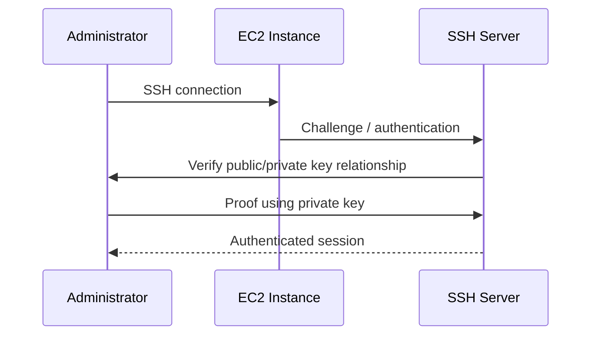
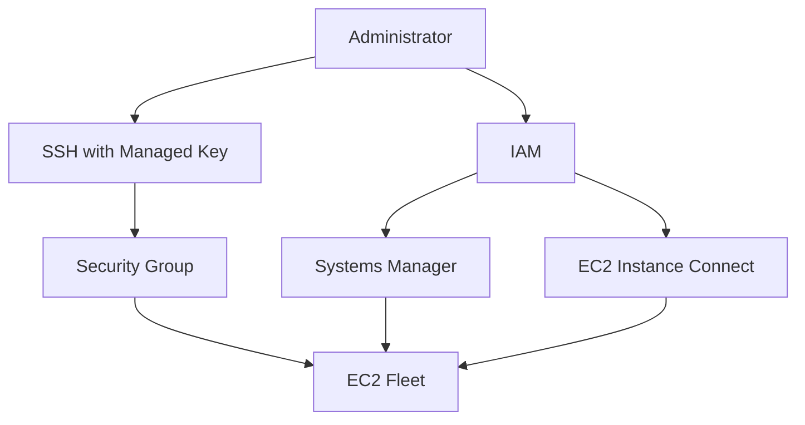

# 03- Key Pairs

## Overview

An Amazon EC2 key pair is a public-key authentication mechanism used to securely access EC2 instances.

A key pair consists of:

- A **public key**, which AWS associates with the EC2 instance.
- A **private key**, which you must securely retain.

For Linux instances, the private key is commonly used for SSH authentication. For Windows instances, the private key can be used to decrypt the initial Administrator password before connecting through RDP. AWS does not retain a copy of the private key. :contentReference[oaicite:0]{index=0}

The basic authentication flow is:



The key architectural principle is:

> AWS stores or associates the public key with EC2; the private key remains under your control.

---

## Why EC2 Key Pairs Exist

EC2 instances need a secure administrative authentication mechanism.

Traditional password-based SSH access is undesirable for production infrastructure because passwords can be:

- Guessed
- Brute-forced
- Reused
- Accidentally exposed
- Difficult to rotate safely

Public-key authentication avoids transmitting the private key to the server.

The server stores the public key:

```text
EC2
 |
 +-- ~/.ssh/authorized_keys
 |      |
 |      +-- Public Key
```

The administrator retains:

```text
Administrator workstation
 |
 +-- Private Key
```

Authentication proves possession of the corresponding private key without sending the private key to the EC2 instance.

---

## Public Key vs Private Key

| Property | Public Key | Private Key |
|---|---|---|
| Stored by AWS | Yes | No |
| Stored on instance | Yes, for Linux SSH | No |
| Stored by administrator | Optional | Yes |
| Safe to share | Generally yes | Never |
| Used for authentication | Verification | Proof of possession |
| Recoverable from AWS | Public key can be retrieved | No |
| Security sensitivity | Lower | Extremely high |

The private key is the critical secret.

If someone obtains it and the corresponding EC2 access remains valid, they may be able to authenticate to instances that trust that key.

---

## How EC2 Uses a Key Pair

When launching an EC2 instance, you can specify a key pair.

For a Linux instance, the public key is placed into the instance's SSH configuration, commonly:

```text
~/.ssh/authorized_keys
```

The resulting relationship is:

```text
AWS EC2 Key Pair
        |
        +-- Public Key
        |      |
        |      v
        |   EC2 Instance
        |
        +-- Private Key
               |
               v
        Administrator
```

When the administrator connects:

```text
ssh -i private-key.pem ec2-user@host
```

the SSH client uses the private key to prove possession of the key corresponding to the public key trusted by the server.

---

## Key Pair Scope

EC2 key pairs are **Regional resources**.

A key pair created in one AWS Region is not automatically available in another Region. If the same key pair is required in multiple Regions, the public key must be imported into each Region where it will be used. :contentReference[oaicite:1]{index=1}

For example:

```text
ap-south-1
    |
    +-- production-key

us-east-1
    |
    +-- production-key
```

These are separate EC2 key-pair resources even if they contain the same public key material.

This matters for:

- Multi-Region deployments
- Disaster recovery
- Infrastructure as Code
- Automated instance provisioning
- Cross-Region AMI deployments

---

## Supported Key Types

EC2 supports:

| Key Type | Linux | Windows |
|---|---|---|
| RSA | Yes | Yes |
| ED25519 | Yes | No |

AWS currently supports 2048-bit RSA and ED25519 when creating EC2 key pairs through the service. ED25519 is not supported for Windows instances. :contentReference[oaicite:2]{index=2}

For Linux workloads, ED25519 is a modern option when supported by the operating environment and tooling.

For Windows EC2 instances, use RSA.

---

## Key Formats

When AWS generates a key pair, the private key can be saved in formats such as:

```text
.pem
.ppk
```

Typical usage:

| Format | Common Client |
|---|---|
| `.pem` | OpenSSH |
| `.ppk` | PuTTY |

AWS supports PEM and PPK formats for EC2 key-pair private keys. :contentReference[oaicite:3]{index=3}

On modern Windows systems, OpenSSH is commonly available, so `.pem` can often be used directly with `ssh`.

---

## Creating a Key Pair

### AWS Console

The EC2 console provides:

```text
EC2
 |
 +-- Network & Security
       |
       +-- Key Pairs
             |
             +-- Create key pair
```

When creating a key pair, select:

- Name
- Key type
- Private key format
- Tags where appropriate

The private key is downloaded when the key pair is created.

AWS explicitly states that this is the only opportunity to save the private key generated by EC2. :contentReference[oaicite:4]{index=4}

---

## AWS CLI

Create an RSA key pair:

```bash
aws ec2 create-key-pair \
  --key-name production-linux \
  --key-type rsa \
  --key-format pem \
  --query 'KeyMaterial' \
  --output text > production-linux.pem
```

Create an ED25519 key pair:

```bash
aws ec2 create-key-pair \
  --key-name production-linux-ed25519 \
  --key-type ed25519 \
  --key-format pem \
  --query 'KeyMaterial' \
  --output text > production-linux-ed25519.pem
```

AWS returns the private key material only when the key pair is created. It is not stored by EC2 for later retrieval. :contentReference[oaicite:5]{index=5}

---

## Protecting the Private Key

On Linux or macOS, restrict the private key permissions:

```bash
chmod 400 production-linux.pem
```

SSH commonly refuses to use a private key if it is accessible by other users.

Verify:

```bash
ls -l production-linux.pem
```

A typical result should resemble:

```text
-r-------- 1 user user ... production-linux.pem
```

AWS recommends restrictive permissions such as `chmod 400` for private key files used with SSH. :contentReference[oaicite:6]{index=6}

---

## Connecting to a Linux EC2 Instance

A typical SSH connection is:

```bash
ssh -i production-linux.pem ec2-user@203.0.113.10
```

The username depends on the AMI.

Common examples include:

| AMI / OS | Typical User |
|---|---|
| Amazon Linux | `ec2-user` |
| Ubuntu | `ubuntu` |
| Debian | `admin` or image-specific user |
| RHEL | `ec2-user` or image-specific user |

Do not assume the username is always `ec2-user`.

The complete network path must also permit SSH:

```text
Administrator
     |
     | TCP 22
     v
Security Group
     |
     v
EC2
     |
     v
SSH daemon
```

A correct private key alone does not guarantee connectivity.

---

## Security Group Relationship

SSH access requires both network access and successful authentication.

For example:

```text
Internet / Admin Network
          |
          | TCP 22
          v
    EC2 Security Group
          |
          v
       EC2 :22
          |
          v
    SSH Authentication
          |
          v
      Private Key
```

There are therefore two separate controls:

```text
Security Group
    -> Can the connection reach SSH?

SSH Key
    -> Can the connecting user authenticate?
```

A valid key does not bypass a Security Group restriction.

---

## Key Pair vs Security Group

These controls solve different problems.

| Control | Answers |
|---|---|
| Security Group | Can network traffic reach the instance? |
| Key Pair | Can the user authenticate through the configured key? |
| IAM | Can an identity perform AWS API actions? |
| OS permissions | What can the authenticated user do on the instance? |

For example:

```text
IAM
 |
 +-- Can modify EC2 configuration?

Security Group
 |
 +-- Can TCP 22 reach the instance?

SSH Key
 |
 +-- Can the user authenticate?

Linux permissions
 |
 +-- What can the user access after login?
```

A secure EC2 environment requires all relevant layers to be considered.

---

## Importing an Existing Key

You do not have to generate the private key through AWS.

You can generate a key pair locally and import the public key into EC2.

For example:

```bash
ssh-keygen -t ed25519 -f ~/.ssh/ec2-production
```

This produces:

```text
~/.ssh/ec2-production
~/.ssh/ec2-production.pub
```

Import the public key:

```bash
aws ec2 import-key-pair \
  --key-name ec2-production \
  --public-key-material fileb://~/.ssh/ec2-production.pub
```

AWS receives the public key only. The private key remains on your system. :contentReference[oaicite:7]{index=7}

This approach is useful when:

- Your organization already manages SSH keys.
- You want the private key generated locally.
- You use an existing key-management process.
- You need the same public key imported into multiple Regions.

---

## Existing Key vs AWS-Generated Key

| Approach | Private Key Generated By | Private Key Sent to AWS |
|---|---|---|
| AWS-generated key | AWS | No |
| Imported key | You / external tool | No |
| AWS-managed public key | AWS stores public component | No private key |

In both cases, AWS does not need your private key.

For production environments, generating keys under your organization's established key-management process can provide stronger control over private-key custody.

---

## Private Key Loss

AWS does not retain your private key.

Therefore:

```text
Lost private key
      |
      v
Cannot download it from EC2
```

You may still be able to regain access using other mechanisms, such as:

- Existing administrative access
- AWS Systems Manager Session Manager
- EC2 Instance Connect where supported and configured
- Offline recovery procedures
- Replacing the authorized public key through another administrative path

The exact recovery process depends on the instance configuration.

AWS explicitly recommends alternatives such as Systems Manager Session Manager when you want to connect without relying on an EC2 key pair. :contentReference[oaicite:8]{index=8}

---

## Key Rotation

Key pairs should be rotated when:

- A private key may have been exposed.
- An administrator leaves the organization.
- Access ownership changes.
- A security policy requires periodic rotation.
- A key has been used beyond its intended lifecycle.

A safe rotation process is:


Do not delete the old key pair from AWS before confirming that the new access path works.

---

## Important Distinction: Delete Key Pair vs Remove Access

Deleting an EC2 key-pair object does not automatically remove an already-installed public key from an instance's `authorized_keys`.

This distinction is important:

```text
EC2 Key Pair Resource
        |
        v
AWS metadata / launch configuration
```

versus:

```text
Running Linux Instance
        |
        v
~/.ssh/authorized_keys
        |
        v
Actual SSH authorization
```

For existing instances, access must be managed at the instance's operating-system level or through an appropriate access-management mechanism.

---

## Key Rotation on Linux

If you already have administrative access, you can add a new public key:

```bash
mkdir -p ~/.ssh
chmod 700 ~/.ssh

cat >> ~/.ssh/authorized_keys <<'EOF'
ssh-ed25519 AAAAC3NzaC1lZDI1NTE5AAAA... new-key
EOF

chmod 600 ~/.ssh/authorized_keys
```

Then test the new private key from a separate session:

```bash
ssh -i ~/.ssh/ec2-production ubuntu@203.0.113.10
```

Only after successful validation should the old public key be removed.

Avoid blindly replacing `authorized_keys` if multiple administrators or automation processes depend on existing entries.

---

## Auto Scaling Considerations

For an Auto Scaling Group, manually managing SSH keys on individual instances is fragile.

Consider:

```text
ASG
 |
 +-- EC2-1
 +-- EC2-2
 +-- EC2-3
```

If every instance requires manual SSH configuration:

```text
EC2-1 -> configure
EC2-2 -> configure
EC2-3 -> configure
```

new instances will not necessarily have the same access configuration.

For production fleets, prefer centralized access mechanisms such as:

- AWS Systems Manager Session Manager
- Automated configuration
- Instance bootstrap where appropriate
- EC2 Instance Connect where supported
- Controlled administrative tooling

This aligns better with immutable and replaceable infrastructure.

---

## Systems Manager as an Alternative

For many production environments, SSH key pairs do not need to be the primary administrative access mechanism.

A common model is:

```text
Administrator
     |
     v
AWS IAM
     |
     v
Systems Manager
     |
     v
Private EC2
```

Advantages include:

- No inbound SSH port required
- Centralized IAM-based access control
- Session auditing capabilities
- Better fit for private instances
- Reduced private-key distribution

This is particularly useful for EC2 Auto Scaling fleets where instances are frequently replaced.

---

## EC2 Instance Connect

EC2 Instance Connect provides another mechanism for connecting to supported EC2 instances without relying on a permanently stored private key on the instance.

The general model is:

```text
Administrator
      |
      v
Temporary public key
      |
      v
EC2 Instance
      |
      v
SSH session
```

This can reduce the need for long-lived SSH credentials.

The exact availability and workflow depend on the operating system, instance configuration, and AWS Region.

---

## Key Pair and User Data

A Launch Template can specify an EC2 key pair for instances.

Conceptually:

```text
Launch Template
 |
 +-- AMI
 +-- Instance Type
 +-- Security Groups
 +-- Key Pair
 +-- IAM Role
 +-- User Data
 |
 v
Auto Scaling Group
 |
 v
EC2 Instances
```

The key pair should be treated as one part of the instance access design rather than the complete administrative-security model.

---

## Key Pair and Launch Templates

For an Auto Scaling environment:

```text
Launch Template
      |
      v
Auto Scaling Group
      |
      +--> EC2-A
      +--> EC2-B
      +--> EC2-C
```

The Launch Template can specify the intended key pair.

This ensures newly launched instances receive consistent initial access configuration.

However, production systems should avoid depending exclusively on SSH keys for routine operations.

---

## Key Pair Naming

Use descriptive, environment-aware names.

Examples:

```text
dev-linux-admin
staging-linux-admin
prod-linux-admin
prod-recovery
prod-windows-admin
```

Avoid ambiguous names:

```text
key1
test
new-key
mykey
final-key
final-key-new
```

A good name should communicate:

- Environment
- Intended operating system
- Access purpose
- Ownership or role where useful

Do not place secrets in the key-pair name.

---

## Tags

EC2 key pairs can be tagged.

Useful tags include:

```text
Environment = production
Owner       = platform-team
Purpose     = emergency-access
ManagedBy   = terraform
```

Tags improve:

- Inventory
- Ownership
- Auditing
- Automation
- Cleanup

However, tags are metadata, not access-control mechanisms.

---

## Key Pair Fingerprints

EC2 provides key-pair fingerprints that can be used to identify and verify key material.

For example:

```bash
aws ec2 describe-key-pairs \
  --key-names prod-linux-admin
```

You can inspect the fingerprint:

```bash
aws ec2 describe-key-pairs \
  --key-names prod-linux-admin \
  --query 'KeyPairs[].{Name:KeyName,Fingerprint:KeyFingerprint}' \
  --output table
```

Fingerprint behavior depends on whether the key was generated by EC2 or imported and on the key type. AWS documents different hashing behavior for RSA and ED25519 fingerprints. :contentReference[oaicite:9]{index=9}

Fingerprints are useful when validating that the expected public key is associated with the intended EC2 key-pair resource.

---

## AWS CLI Operations

List key pairs:

```bash
aws ec2 describe-key-pairs
```

List key-pair names:

```bash
aws ec2 describe-key-pairs \
  --query 'KeyPairs[].KeyName' \
  --output table
```

Inspect a specific key pair:

```bash
aws ec2 describe-key-pairs \
  --key-names prod-linux-admin
```

Create an RSA key pair:

```bash
aws ec2 create-key-pair \
  --key-name prod-linux-admin \
  --key-type rsa \
  --key-format pem \
  --query 'KeyMaterial' \
  --output text > prod-linux-admin.pem
```

Create an ED25519 key pair:

```bash
aws ec2 create-key-pair \
  --key-name prod-linux-admin-ed25519 \
  --key-type ed25519 \
  --key-format pem \
  --query 'KeyMaterial' \
  --output text > prod-linux-admin-ed25519.pem
```

Import a public key:

```bash
aws ec2 import-key-pair \
  --key-name prod-linux-admin \
  --public-key-material fileb://~/.ssh/ec2-production.pub
```

Delete a key-pair resource:

```bash
aws ec2 delete-key-pair \
  --key-name old-admin-key
```

The private key should be securely backed up before performing destructive key-management operations, and deletion should only occur after confirming that the key is no longer required.

---

## Finding Instances Using a Key Pair

To inspect instances associated with a key name:

```bash
aws ec2 describe-instances \
  --filters Name=key-name,Values=prod-linux-admin \
  --query 'Reservations[].Instances[].{Instance:InstanceId,State:State.Name,AZ:Placement.AvailabilityZone,IP:PrivateIpAddress}' \
  --output table
```

This is useful before rotating or retiring a key pair.

A safe operational sequence is:

```text
Find instances
      |
      v
Verify replacement access
      |
      v
Rotate instance access
      |
      v
Confirm access
      |
      v
Retire old key
```

---

## Private Key Storage

Treat private keys as credentials.

Good storage locations include:

- Encrypted password managers
- Secure administrative workstations
- Enterprise secrets-management systems
- Encrypted storage with restricted access

Avoid:

```text
Git repository
Public cloud bucket
Shared network drive
Slack / chat
Email attachment
Unencrypted shared folder
```

Never commit:

```text
*.pem
*.ppk
private-key files
```

to source control.

A useful `.gitignore` rule is:

```gitignore
*.pem
*.ppk
```

Do not rely solely on `.gitignore`; ensure private keys are never staged or committed in the first place.

---

## Compromised Private Key

If a private key may have been exposed, treat it as compromised.

Do not simply delete the key-pair object from AWS and assume access has been revoked.

A safer response is:

```text
Potential compromise
       |
       v
Identify affected instances
       |
       v
Create replacement key
       |
       v
Add replacement public key
       |
       v
Verify new access
       |
       v
Remove compromised public key
       |
       v
Retire compromised private key
```

Also investigate:

- CloudTrail activity
- SSH logs
- System logs
- Unexpected users
- `authorized_keys`
- Running processes
- Network connections
- Other credentials that may have been exposed

The appropriate incident-response process depends on the severity and scope of the exposure.

---

## High Availability Considerations

Key pairs are not themselves an HA mechanism.

For production EC2 fleets:

```text
Application HA
    |
    +-- ALB
    +-- Multi-AZ ASG
    +-- Health Checks
    +-- Automated Replacement
```

Administrative access should also remain available when individual instances are replaced.

This is why centralized access mechanisms are valuable:

```text
Administrator
      |
      v
IAM / SSM
      |
      +--> EC2-A
      +--> EC2-B
      +--> EC2-C
```

A production operations model should not depend on manually maintaining one SSH key on every ephemeral instance.

---

## Disaster Recovery Considerations

A key pair can become part of the recovery process.

For example:

```text
Region A
    |
    +-- production key
    +-- EC2 instances
```

After a regional recovery:

```text
Region B
    |
    +-- imported public key
    +-- recovered EC2 instances
```

If the same public key must be used in another Region, it must be imported into that Region. :contentReference[oaicite:10]{index=10}

More importantly, recovery should have an alternative administrative path so that loss of one private key does not block the entire recovery operation.

---

## Security Considerations

### Never Share Private Keys

A private key should belong to an individual or controlled operational process.

Avoid using one private key across a large organization when individual accountability is required.

### Prefer Short-Lived or Centralized Access

Where practical, use:

- Systems Manager
- EC2 Instance Connect
- IAM-controlled administrative workflows

instead of distributing long-lived private keys.

### Encrypt Private-Key Storage

The private key should be protected at rest.

### Restrict File Permissions

For OpenSSH:

```bash
chmod 400 production.pem
```

### Rotate When Ownership Changes

If an administrator leaves an organization or loses control of a key, rotate access rather than relying on the old key indefinitely.

### Monitor Administrative Access

Use centralized logging and auditing where available.

### Do Not Put Secrets in AMIs

A private key should never be baked into a machine image.

---

## Common Mistakes

### Losing the Private Key

AWS does not provide a way to download the private key later.

Create a secure backup when the key is generated. :contentReference[oaicite:11]{index=11}

### Committing `.pem` Files to Git

Private keys are credentials and must never be treated as normal source files.

### Opening SSH to the Entire Internet

```text
TCP 22
0.0.0.0/0
```

creates unnecessary exposure.

Restrict SSH access or use a centralized administrative mechanism.

### Assuming Deleting a Key Pair Revokes Existing Access

The key-pair resource and the public key already installed on an instance are separate concerns.

### Sharing One Private Key With Everyone

This destroys individual accountability and makes rotation difficult.

### Manually Configuring Every ASG Instance

Ephemeral instances should use automated and centralized access mechanisms.

### Using ED25519 for Windows EC2

EC2 currently supports ED25519 key pairs for Linux, but not Windows instances. Use RSA for Windows. :contentReference[oaicite:12]{index=12}

### Forgetting Regional Scope

A key pair created in one Region is not automatically available in another Region.

### Deleting a Key Too Early

Always confirm replacement access before retiring an old key.

---

## Production Best Practices

1. Treat private keys as sensitive credentials.
2. Store private keys in secure, access-controlled locations.
3. Never commit private keys to source control.
4. Use restrictive file permissions for local SSH keys.
5. Prefer centralized access mechanisms for production fleets.
6. Use descriptive key-pair names and tags.
7. Use Security Groups to restrict the network path independently of key authentication.
8. Rotate access when keys are compromised or ownership changes.
9. Verify new access before removing old access.
10. Maintain an administrative recovery path independent of a single private key.
11. Import public keys into each required Region for multi-Region environments.
12. Avoid embedding private keys in AMIs, user data, container images, or CI/CD artifacts.
13. Audit which instances depend on a key before retiring it.
14. Consider Systems Manager or EC2 Instance Connect for ephemeral and production workloads.

---

## Production Access Architecture

A modern EC2 environment can separate routine operations from emergency access:



This provides multiple controlled access paths without making long-lived SSH keys the only way to operate the fleet.

---

## Interview Considerations

### What is an EC2 key pair?

It is a public/private key pair used to authenticate access to EC2 instances. AWS stores or associates the public key, while the user retains the private key.

### Does AWS store the private key?

No. When AWS generates the key pair, the private key is returned to you once and is not retained by EC2. :contentReference[oaicite:13]{index=13}

### What happens if you lose the private key?

You cannot retrieve the same private key from EC2. You need another valid access path to the instance and should establish a new key or use an alternative such as Systems Manager. :contentReference[oaicite:14]{index=14}

### Are EC2 key pairs global?

No. EC2 key pairs are Regional resources. The public key must be imported into other Regions if it needs to be used there. :contentReference[oaicite:15]{index=15}

### Can you import an existing SSH key?

Yes. You can generate the key pair externally and import only the public key into EC2. The private key never needs to be transferred to AWS. :contentReference[oaicite:16]{index=16}

### What is the difference between a key pair and a Security Group?

A Security Group controls whether network traffic can reach the instance. The key pair controls authentication after the network path is available.

```text
Security Group
    |
    v
Can traffic reach port 22?

Key Pair
    |
    v
Can the user authenticate?
```

### Should production EC2 instances always use SSH key pairs?

Not necessarily. Systems Manager Session Manager or EC2 Instance Connect can reduce the need for long-lived SSH credentials, depending on the operating system, networking, and operational requirements.

### How would you rotate an EC2 SSH key safely?

```text
Create replacement key
        |
        v
Add new public key
        |
        v
Test access
        |
        v
Remove old public key
        |
        v
Retire old key
```

The important point is to validate the replacement path before removing the existing access mechanism.

## Key Takeaways

- **An EC2 key pair uses public-key authentication: AWS associates the public key with EC2, while the private key remains under your control and is never recoverable from AWS.**
- **Protect private keys like credentials; never commit them to Git, share them casually, embed them in images, or leave them with broad filesystem permissions.**
- **Key pairs are Regional resources, and the public key must be imported separately into other Regions when the same key material is required there.**
- **For production and Auto Scaling environments, prefer centralized access mechanisms such as Systems Manager or EC2 Instance Connect where appropriate instead of relying exclusively on long-lived SSH keys.**
- **Rotate compromised or obsolete access safely by adding and testing the replacement key before removing the old public key from affected instances.**