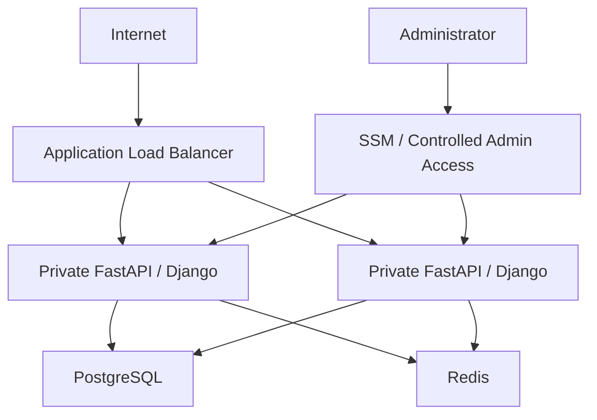
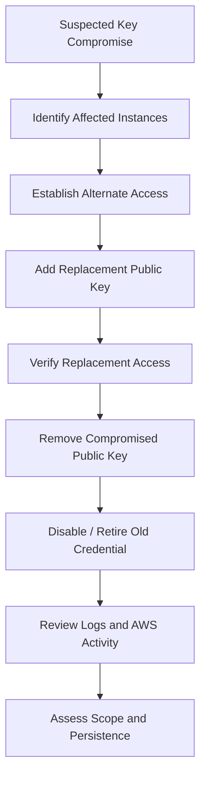
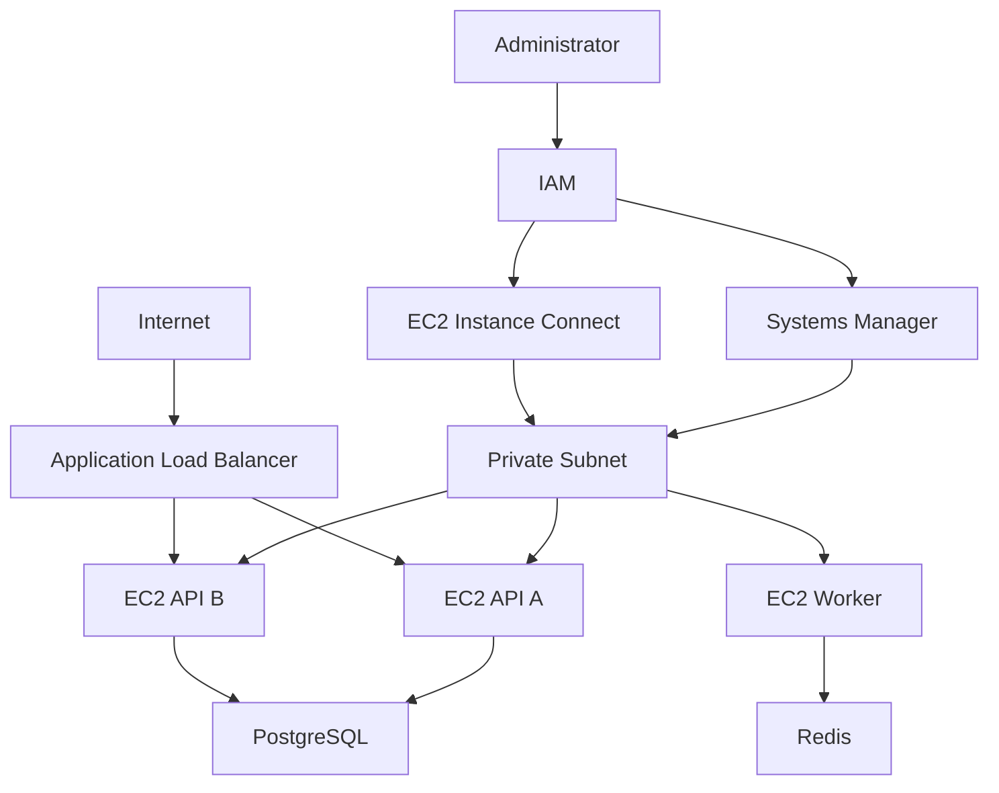

# 04- SSH Security

## Overview

SSH (Secure Shell) is a secure remote-access protocol commonly used to administer Linux EC2 instances. It provides encrypted communication and strong authentication, but exposing SSH directly to the internet creates an administrative attack surface that must be deliberately controlled.

For EC2, SSH security is not just about protecting a `.pem` file. A secure design considers the entire access path:

```text
Administrator
     |
     | Identity / IAM
     v
Access Mechanism
     |
     +---- SSH Client
     |       |
     |       v
     |   Network Path
     |       |
     |       v
     |   Security Group
     |       |
     |       v
     |   TCP 22
     |       |
     |       v
     |   sshd
     |       |
     |       v
     |   OS User
     |
     +---- Session Manager
     |
     +---- EC2 Instance Connect
```

AWS recommends reducing unnecessary interactive access and, where practical, using Systems Manager or EC2 Instance Connect instead of maintaining long-lived SSH access. :contentReference[oaicite:0]{index=0}

SSH remains useful for:

- Emergency administration
- Debugging
- OS-level troubleshooting
- Infrastructure maintenance
- Development environments
- Systems where centralized management is not available

For production EC2 fleets, SSH should generally be treated as a controlled administrative capability rather than a default application-access mechanism.

---

## SSH Security Model

An SSH connection succeeds only when multiple layers permit it.


Each layer answers a different question:

| Layer | Question |
|---|---|
| Network | Can the administrator reach the instance? |
| Security Group | Is TCP/22 allowed from the source? |
| NACL / routing | Can traffic traverse the subnet/network path? |
| `sshd` | Is the SSH service listening and accepting the connection? |
| Authentication | Does the user possess a valid credential? |
| OS authorization | Is that user permitted to perform the requested operation? |
| `sudo` / filesystem permissions | What can the authenticated user actually do? |

A failure at any layer can prevent access.

---

## SSH Authentication

For EC2 Linux instances, public-key authentication is the standard approach.

At launch, the EC2 public key is placed into the instance's `~/.ssh/authorized_keys`. The administrator retains the corresponding private key. :contentReference[oaicite:1]{index=1}

Conceptually:

```text
Private Key
Administrator
     |
     | proves possession
     v
SSH Client
     |
     | encrypted connection
     v
sshd
     |
     | checks
     v
authorized_keys
     |
     v
Public Key
```

The private key should never be transmitted to the EC2 instance.

---

## Security Group Protection

The Security Group is the first major control for direct SSH access.

A typical rule is:

```text
Protocol: TCP
Port:     22
Source:   Administrator public IP / trusted CIDR
```

For example:

```text
203.0.113.10/32
```

is substantially more restrictive than:

```text
0.0.0.0/0
```

AWS recommends restricting SSH sources to specific IP addresses or ranges rather than allowing unrestricted internet access. :contentReference[oaicite:2]{index=2}

A simplified path is:

```text
Administrator Public IP
        |
        | TCP 22
        v
+-------------------+
| Security Group    |
|                   |
| Allow TCP 22 from |
| 203.0.113.10/32   |
+-------------------+
        |
        v
   EC2 Instance
```

---

## Why `0.0.0.0/0` for SSH Is Risky

This rule:

```text
TCP 22
0.0.0.0/0
```

allows any IPv4 address to attempt a connection to the SSH service.

The SSH authentication layer may still prevent unauthorized login, but exposing the service globally increases:

- Internet scanning
- Authentication attempts
- Log noise
- Exploit exposure
- Operational risk
- Attack surface

If IPv6 is enabled, an equivalent unrestricted rule using `::/0` has the same fundamental problem. AWS explicitly warns that these rules allow access from all IPv4 or IPv6 addresses. :contentReference[oaicite:3]{index=3}

---

## Restricting SSH to an Administrative IP

For a fixed administrative IP:

```bash
aws ec2 authorize-security-group-ingress \
  --group-id sg-0123456789abcdef0 \
  --protocol tcp \
  --port 22 \
  --cidr 203.0.113.10/32
```

Inspect the resulting rule:

```bash
aws ec2 describe-security-groups \
  --group-ids sg-0123456789abcdef0 \
  --query 'SecurityGroups[].IpPermissions'
```

Revoke it when it is no longer required:

```bash
aws ec2 revoke-security-group-ingress \
  --group-id sg-0123456789abcdef0 \
  --protocol tcp \
  --port 22 \
  --cidr 203.0.113.10/32
```

This model works well for controlled administrative networks, but it becomes inconvenient when administrator IPs change frequently.

---

## SSH Through a Bastion Host

A bastion host, or jump host, provides a controlled entry point into private infrastructure.


The public-facing security group can allow SSH only to the bastion:

```text
Internet
   |
   | TCP 22
   v
Bastion SG
```

The private instances can then allow SSH only from the bastion security group:

```text
Bastion SG
    |
    | TCP 22
    v
Private EC2 SG
```

This is safer than exposing every private workload directly to the internet, but it still introduces a server that must be secured, patched, monitored, and operated.

AWS provides modern alternatives that can reduce or eliminate the need for publicly exposed bastion hosts. :contentReference[oaicite:4]{index=4}

---

## SSH ProxyJump

When a bastion is required, OpenSSH can use `ProxyJump`.

Example:

```bash
ssh -J bastion-user@bastion.example.com \
  app-user@10.0.20.15
```

A reusable SSH configuration is preferable for repeated administration:

```sshconfig
Host bastion
    HostName bastion.example.com
    User ec2-user
    IdentityFile ~/.ssh/bastion.pem

Host private-api
    HostName 10.0.20.15
    User ubuntu
    IdentityFile ~/.ssh/production.pem
    ProxyJump bastion
```

Then:

```bash
ssh private-api
```

This keeps the private EC2 instance unreachable directly from the public internet.

---

## Private Subnet SSH

A production EC2 instance does not need a public IP simply because administrators need SSH access.

A common architecture is:

```text
                 Internet
                    |
                    v
             Admin Network
                    |
                    v
              Bastion / SSM
                    |
             +------+------+
             |             |
             v             v
        Private EC2-A  Private EC2-B
```

For application servers, this is generally preferable to:

```text
Internet
   |
   +--> Public EC2-A :22
   +--> Public EC2-B :22
   +--> Public EC2-C :22
```

The second architecture expands the external attack surface unnecessarily.

---

## Disable Password Authentication

For Linux EC2 systems using key-based SSH, password authentication is generally unnecessary.

A typical OpenSSH configuration is:

```text
PasswordAuthentication no
```

This prevents password-based SSH authentication.

Amazon Linux 2 disables password authentication by default and does not allow remote root SSH login by default. :contentReference[oaicite:5]{index=5}

Before changing SSH configuration, validate the configuration:

```bash
sudo sshd -t
```

Then reload the service using the operating system's service manager.

For systems using systemd:

```bash
sudo systemctl reload sshd
```

Some distributions use:

```bash
sudo systemctl reload ssh
```

Do not disable password authentication until you have confirmed that the intended key-based or centralized access mechanism works.

---

## Disable Direct Root Login

Direct root SSH access should generally be disabled.

A typical configuration is:

```text
PermitRootLogin no
```

The preferred model is:

```text
SSH
 |
 v
Non-root user
 |
 +-- sudo
```

rather than:

```text
SSH
 |
 v
root
```

Using a named administrative account improves:

- Accountability
- Auditability
- Permission control
- Credential separation
- Incident investigation

Modern Amazon Linux releases ship with hardened SSH defaults that disable root login by default. :contentReference[oaicite:6]{index=6}

---

## Principle of Least Privilege

The SSH user should receive only the privileges required for the task.

For example:

```text
deploy-user
    |
    +-- application deployment
    +-- service restart

ops-user
    |
    +-- operational diagnostics
    +-- controlled sudo commands

admin-user
    |
    +-- broader administrative privileges
```

Avoid using the same highly privileged account for every activity.

For backend infrastructure, application processes should also run as non-root users wherever practical.

---

## SSH User Selection

The username depends on the AMI.

Examples include:

| Distribution | Typical User |
|---|---|
| Amazon Linux | `ec2-user` |
| Ubuntu | `ubuntu` |
| Debian | `admin` |
| RHEL | `ec2-user` |
| Fedora | `fedora` |
| Rocky Linux | `rocky` |

AWS documents AMI-specific default usernames and recommends checking the AMI provider when uncertain. :contentReference[oaicite:7]{index=7}

For example:

```bash
ssh -i production.pem ubuntu@203.0.113.20
```

Using the wrong username can produce:

```text
Permission denied (publickey)
```

even when the private key itself is correct.

---

## Protecting Private Keys

Private keys are credentials.

On Linux and macOS:

```bash
chmod 400 ~/.ssh/production.pem
```

Check permissions:

```bash
ls -l ~/.ssh/production.pem
```

Avoid storing private keys in:

- Git repositories
- Docker images
- AMIs
- Public buckets
- CI logs
- Chat messages
- Shared unencrypted directories
- Application source code

A repository should normally contain:

```gitignore
*.pem
*.key
*.ppk
```

But `.gitignore` is not a security boundary. A private key that was already committed remains part of repository history until it is properly removed and the credential is rotated.

---

## SSH Agent

An SSH agent can keep private keys loaded in memory so that the private key does not need to be repeatedly specified.

Example:

```bash
eval "$(ssh-agent -s)"
ssh-add ~/.ssh/production.pem
```

List loaded keys:

```bash
ssh-add -l
```

Remove a specific key:

```bash
ssh-add -d ~/.ssh/production.pem
```

Remove all loaded keys:

```bash
ssh-add -D
```

Use an agent carefully on shared or untrusted systems. Agent forwarding introduces additional security considerations.

---

## Avoid Unnecessary SSH Agent Forwarding

Agent forwarding allows a remote host to use the SSH agent exposed through your connection.

For example:

```bash
ssh -A bastion.example.com
```

This can be convenient for multi-hop administration, but it increases the trust relationship with the remote host.

A compromised bastion could potentially interact with the forwarded agent during the session.

Prefer:

```text
ProxyJump
```

over unnecessary agent forwarding.

Example:

```bash
ssh -J bastion-user@bastion.example.com private-user@10.0.20.15
```

This generally avoids exposing the local SSH agent to the bastion.

---

## SSH Host Key Verification

SSH also protects the client from connecting unknowingly to an unexpected server.

The client records server host keys in:

```text
~/.ssh/known_hosts
```

The first connection may display:

```text
The authenticity of host 'example.com' can't be established.
```

The host key fingerprint should be verified through a trusted source before accepting it.

Do not blindly suppress verification with options such as:

```bash
-o StrictHostKeyChecking=no
```

in production workflows.

Disabling host verification can make man-in-the-middle attacks significantly easier.

---

## Host Key Changes

A warning such as:

```text
WARNING: REMOTE HOST IDENTIFICATION HAS CHANGED!
```

should not automatically be treated as something to delete and ignore.

Possible explanations include:

- Instance replacement
- OS rebuild
- Host key rotation
- DNS pointing to another machine
- Incorrect endpoint
- Potential man-in-the-middle attack

Investigate first.

If the change is known and legitimate, update the entry carefully:

```bash
ssh-keygen -R example.com
```

Then reconnect and verify the new fingerprint.

---

## SSH Configuration

A local SSH configuration can centralize secure connection settings.

Example:

```sshconfig
Host production-api
    HostName 203.0.113.20
    User ubuntu
    IdentityFile ~/.ssh/production.pem
    IdentitiesOnly yes
    ServerAliveInterval 60
    ServerAliveCountMax 3
```

Useful controls include:

| Option | Purpose |
|---|---|
| `HostName` | Target hostname/IP |
| `User` | Remote OS user |
| `IdentityFile` | Private key |
| `IdentitiesOnly` | Restrict key selection |
| `ServerAliveInterval` | Keep idle sessions detectable |
| `ServerAliveCountMax` | Number of unanswered keepalive probes |
| `ProxyJump` | Connect through a bastion |

Avoid putting secrets or private key material directly into SSH configuration.

---

## SSH Keepalives

Long-lived administrative sessions can terminate because of:

- NAT timeouts
- Firewall idle timeouts
- VPN behavior
- Network interruptions

Client-side keepalives can help:

```sshconfig
Host production-*
    ServerAliveInterval 60
    ServerAliveCountMax 3
```

These settings do not make an unreliable network reliable. They simply help detect dead connections and prevent some idle-session timeouts.

---

## SSH Port Changes

Changing SSH from port `22` to another port is sometimes used to reduce automated scanning noise.

For example:

```text
TCP 2222
```

This can reduce low-value scanning but should not be considered a primary security control.

The important controls remain:

- Restricted source networks
- Strong authentication
- Disabled password authentication
- Least privilege
- Patch management
- Centralized access
- Monitoring

Changing the port without addressing these controls provides limited security value.

---

## Network-Level Protection

For direct SSH access:

```text
Source
  |
  | TCP 22
  v
Security Group
  |
  v
Network ACL
  |
  v
Route Table
  |
  v
EC2 ENI
  |
  v
sshd
```

Troubleshooting should follow this path rather than immediately changing SSH configuration.

A connection timeout commonly indicates a network path or security-control problem, while `Permission denied (publickey)` usually indicates an authentication or user/key problem. AWS documents these distinctions in its EC2 connection troubleshooting guidance. :contentReference[oaicite:8]{index=8}

---

## SSH and Network ACLs

Security Groups are stateful, while Network ACLs are subnet-level controls.

If a Network ACL is involved, both directions of traffic must be considered.

For example:

```text
Client
  |
  | TCP 22
  v
EC2

EC2
  |
  | Ephemeral response
  v
Client
```

A restrictive NACL can block the response traffic even when the Security Group is correctly configured.

Therefore, debugging should inspect:

- Security Group
- Network ACL
- Route table
- Subnet
- Network interface
- Instance state
- `sshd`
- Host firewall

---

## Host Firewall

Linux hosts may also have local firewall controls such as:

- `nftables`
- `iptables`
- `ufw`
- Distribution-specific firewall tooling

The complete path can therefore include:

```text
Security Group
      |
      v
Network ACL
      |
      v
Host Network Stack
      |
      v
Host Firewall
      |
      v
sshd
```

Opening TCP/22 in the Security Group does not guarantee that the host firewall allows it.

---

## Checking SSH Listening State

On the instance:

```bash
sudo ss -lntp | grep ':22'
```

Typical output indicates that `sshd` is listening:

```text
LISTEN 0 128 0.0.0.0:22
```

Check service status:

```bash
sudo systemctl status sshd
```

On some distributions:

```bash
sudo systemctl status ssh
```

Check configuration:

```bash
sudo sshd -t
```

This is safer than restarting `sshd` after an unvalidated configuration change.

---

## SSH Logs

SSH authentication failures should be investigated using the operating system's authentication logs.

Examples include:

```bash
sudo journalctl -u sshd
```

On systems using traditional authentication logs:

```bash
sudo tail -f /var/log/secure
```

or:

```bash
sudo tail -f /var/log/auth.log
```

The exact log location depends on the distribution and logging configuration.

Useful events include:

- Authentication failures
- Invalid users
- Successful logins
- `sudo` activity
- Connection attempts
- SSH configuration errors

---

## Brute-Force Protection

Internet-exposed SSH endpoints may receive large numbers of automated authentication attempts.

A layered defense includes:

```text
Restricted Source IPs
        +
Key-Based Authentication
        +
No Password Authentication
        +
No Direct Root Login
        +
Patching
        +
Monitoring
        +
Centralized Access
```

Do not rely solely on tools such as `fail2ban` to protect a production EC2 environment.

Reducing network exposure is generally more effective than allowing the entire internet to reach SSH and attempting to block attackers after they connect.

---

## SSH and Fail2ban

`fail2ban` can monitor authentication failures and temporarily block suspicious source addresses.

Conceptually:

```text
SSH Logs
   |
   v
Fail2ban
   |
   v
Temporary Block
```

It can be useful on systems where SSH must remain exposed, but it should supplement rather than replace:

- Security Group restrictions
- Strong authentication
- OS hardening
- Patch management
- Centralized access

For AWS-managed environments, network-level restrictions and Systems Manager may eliminate the need for public SSH altogether.

---

## Patch Management

SSH security depends on the OpenSSH server and underlying operating system remaining patched.

A production patching process should include:

```text
AMI / OS Baseline
       |
       v
Patch Management
       |
       v
Validation
       |
       v
Staged Deployment
       |
       v
Production Rollout
```

For immutable EC2 infrastructure, rebuilding instances from updated AMIs can be preferable to manually patching long-lived servers.

---

## SSH and Auto Scaling

SSH becomes more operationally difficult as the number of instances grows.

Consider:

```text
ASG
 |
 +-- Instance A
 +-- Instance B
 +-- Instance C
 +-- Instance D
 +-- Instance E
```

If administrators manually configure each instance:

```text
SSH key management
User management
authorized_keys
Patching
Firewall
Logging
```

the fleet becomes difficult to maintain consistently.

A stronger production model is:

```text
IAM
 |
 v
Systems Manager
 |
 +--> Instance A
 +--> Instance B
 +--> Instance C
 +--> Instance D
```

This aligns administrative access with immutable infrastructure and automated instance replacement.

---

## Systems Manager Session Manager

Session Manager provides interactive access to managed EC2 instances through AWS Systems Manager without requiring inbound SSH access. AWS documents Session Manager as a browser-based or AWS CLI-based interactive shell capability. :contentReference[oaicite:9]{index=9}

A typical architecture is:

```text
Administrator
      |
      v
     IAM
      |
      v
Systems Manager
      |
      v
Private EC2
```

This can eliminate the need for:

- Public IP addresses
- Public TCP/22
- Bastion hosts for routine administration
- Long-lived SSH keys

Session Manager requires appropriate Systems Manager setup, including a managed instance and appropriate IAM permissions. :contentReference[oaicite:10]{index=10}

AWS recommends using Session Manager and logging session activity where appropriate for auditability. :contentReference[oaicite:11]{index=11}

---

## EC2 Instance Connect

EC2 Instance Connect provides another way to establish SSH access without relying on a permanently stored SSH public key.

When connecting through supported EC2 Instance Connect workflows, AWS can push a temporary public key to the instance; AWS documents that the key remains available for 60 seconds. :contentReference[oaicite:12]{index=12}

Conceptually:

```text
Administrator
      |
      | IAM-authorized request
      v
EC2 Instance Connect
      |
      | Temporary public key
      v
EC2 Instance
      |
      v
SSH Session
```

This reduces the need to distribute long-lived private keys.

EC2 Instance Connect still requires the appropriate network connectivity and IAM permissions. :contentReference[oaicite:13]{index=13}

---

## Session Manager vs SSH vs EC2 Instance Connect

| Capability | Direct SSH | EC2 Instance Connect | Session Manager |
|---|---|---|---|
| Requires SSH daemon | Yes | Yes | No |
| Requires inbound TCP/22 | Yes | Depends on connection method | No |
| Long-lived private key | Usually | Not necessarily | No |
| IAM authorization | Not for normal SSH | Yes | Yes |
| Works well with private instances | With network path | Yes with appropriate endpoint/networking | Yes |
| Centralized access | Limited | Better | Strong |
| Session auditing | OS-dependent | OS-dependent | Strong integration |
| Best use | Direct administration | Controlled SSH access | Routine fleet administration |

AWS lists SSH, EC2 Instance Connect, and Session Manager as distinct EC2 connection methods with different networking and IAM requirements. :contentReference[oaicite:14]{index=14}

---

## SSH for Backend Servers

A typical backend architecture should not expose application servers directly to the internet merely to enable SSH.

Prefer:



Application traffic and administrative traffic are separate concerns.

```text
Application Traffic
Internet --> ALB --> Private EC2

Administrative Traffic
Administrator --> SSM / controlled SSH --> Private EC2
```

This separation reduces the number of services exposed to untrusted networks.

---

## SSH and Nginx

Nginx does not replace SSH security.

A common architecture is:

```text
Internet
   |
   v
Nginx / ALB
   |
   v
Django / FastAPI
```

SSH should not normally be routed through the application proxy.

Administrative access should use a separate path:

```text
Administrator
      |
      v
SSM / Bastion / Controlled SSH
      |
      v
EC2
```

Do not expose an application endpoint merely to create an administrative shell.

---

## SSH and Containers

When running backend services inside Docker, avoid using SSH as the primary way to operate application containers.

Prefer:

```text
CI/CD
  |
  v
Container Image
  |
  v
Deployment Platform
```

rather than:

```text
SSH
  |
  v
docker exec
  |
  v
Manual production changes
```

For EC2-based Docker deployments, SSH may still be useful for emergency diagnostics, but repeatable changes should be automated through CI/CD or infrastructure tooling.

---

## SSH and Kubernetes

For Kubernetes workloads running on EC2, SSH should generally be an infrastructure troubleshooting mechanism rather than the normal way to administer workloads.

Prefer:

```text
kubectl
   |
   v
Kubernetes API
   |
   v
Workload
```

rather than:

```text
SSH to EC2
   |
   v
Manual container modification
```

If EC2 nodes require direct access, use the cluster's operational access model and centralized AWS access controls.

---

## Monitoring SSH Access

Monitor at multiple layers.

### Network

Consider:

- VPC Flow Logs
- Security Group changes
- Unexpected source addresses
- Unexpected port exposure

### EC2 / OS

Monitor:

- Successful SSH logins
- Failed authentication attempts
- Invalid users
- `sudo` activity
- SSH configuration changes

### AWS

Monitor:

- Security Group changes
- IAM activity
- Systems Manager sessions
- EC2 Instance Connect activity
- Infrastructure changes

AWS recommends using VPC Flow Logs and security services such as GuardDuty and Security Hub to improve visibility into EC2 security events. :contentReference[oaicite:15]{index=15}

---

## Detecting Unwanted SSH Exposure

A production security process should detect Security Groups that unexpectedly expose:

```text
TCP 22
0.0.0.0/0
```

or:

```text
TCP 22
::/0
```

AWS recommends detection and alerting for inappropriate SSH exposure as part of reducing manual remote access. :contentReference[oaicite:16]{index=16}

A useful governance model is:

```text
Infrastructure Change
        |
        v
Security Group Change
        |
        v
Automated Detection
        |
        +--> Approved
        |
        +--> Alert / Remediate
```

---

## Incident Response for Compromised SSH Credentials

If a private key is suspected to be compromised:



Do not simply delete the EC2 key-pair resource.

The public key may already exist in an instance's `authorized_keys`, so actual instance access must also be removed or replaced.

Investigate:

- SSH authentication logs
- `authorized_keys`
- New local users
- `sudoers`
- Running processes
- Cron jobs
- Systemd services
- Network connections
- CloudTrail events
- Security Group modifications
- IAM activity

The exact response should follow the organization's incident-response process.

---

## SSH Hardening Checklist

### Network

- [ ] Avoid public SSH where possible.
- [ ] Restrict TCP/22 to trusted sources when SSH is required.
- [ ] Avoid `0.0.0.0/0` and `::/0`.
- [ ] Review Network ACLs and routing.
- [ ] Consider private subnets.
- [ ] Use a bastion only when there is a clear operational requirement.

### Authentication

- [ ] Use public-key authentication.
- [ ] Protect private keys.
- [ ] Disable password authentication where appropriate.
- [ ] Disable direct root SSH login.
- [ ] Use individual administrative identities.
- [ ] Rotate compromised or obsolete credentials.

### Host

- [ ] Keep OpenSSH and the OS patched.
- [ ] Validate `sshd` configuration before reload/restart.
- [ ] Restrict OS permissions.
- [ ] Monitor authentication logs.
- [ ] Use host firewalls appropriately.

### AWS

- [ ] Restrict Security Group ingress.
- [ ] Monitor Security Group changes.
- [ ] Prefer Systems Manager for routine access where practical.
- [ ] Consider EC2 Instance Connect for controlled SSH access.
- [ ] Enable appropriate logging and monitoring.

### Operations

- [ ] Maintain an emergency access path.
- [ ] Automate fleet configuration.
- [ ] Avoid manual changes to Auto Scaling instances.
- [ ] Avoid using SSH as the primary deployment mechanism.
- [ ] Document recovery procedures.

---

## Common Mistakes

### Allowing SSH From Anywhere

```text
TCP 22 -> 0.0.0.0/0
```

This creates unnecessary exposure.

**Better:**

```text
TCP 22 -> Trusted administrative CIDR
```

or eliminate inbound SSH using Session Manager.

---

### Using Password Authentication

Passwords create an unnecessary authentication surface for many EC2 Linux environments.

Prefer key-based or centralized authentication.

---

### Enabling Root SSH

Direct root login reduces accountability and bypasses the separation between authentication and privilege escalation.

Use a named user with controlled `sudo` privileges instead.

---

### Sharing One Private Key

A shared private key makes it difficult to determine who accessed the system and complicates credential rotation.

Prefer individual identities and centralized access.

---

### Disabling Host Key Verification

Using:

```bash
-o StrictHostKeyChecking=no
```

to suppress warnings may hide genuine host identity changes.

Investigate host-key changes instead of blindly accepting them.

---

### Forwarding the SSH Agent Unnecessarily

Agent forwarding can increase the security impact of a compromised bastion.

Prefer `ProxyJump` when possible.

---

### Changing the SSH Port and Calling It Hardening

Moving SSH from port `22` to `2222` does not replace:

- Strong authentication
- Restricted network access
- Patching
- Monitoring
- Least privilege

It may reduce automated scanning noise but is not a fundamental security boundary.

---

### Manual SSH Configuration on Auto Scaling Instances

Instances in an ASG are replaceable.

Manual changes to one instance disappear when the instance is replaced.

Use:

- Launch Templates
- Configuration management
- Systems Manager
- Immutable AMIs
- Automated deployment

---

### Using SSH for Application Deployment

A deployment process such as:

```text
CI/CD
   |
   v
SSH
   |
   v
docker pull
   |
   v
restart application
```

can work for small environments but becomes difficult to audit and scale.

Prefer declarative or automated deployment mechanisms appropriate to the infrastructure.

---

## Troubleshooting SSH

### Connection Timeout

Example:

```text
Connection timed out
```

Check:

```text
Instance running?
      |
      v
Correct IP/DNS?
      |
      v
Route exists?
      |
      v
Security Group allows TCP/22?
      |
      v
NACL allows both directions?
      |
      v
Host firewall allows SSH?
      |
      v
sshd listening?
```

AWS specifically recommends checking Security Group rules when SSH connections time out. :contentReference[oaicite:17]{index=17}

---

### Permission Denied

Example:

```text
Permission denied (publickey)
```

Check:

1. Correct username
2. Correct private key
3. Public key installed on the instance
4. File permissions
5. SSH server configuration
6. User account state

Example:

```bash
ssh -vvv -i ~/.ssh/production.pem ubuntu@203.0.113.20
```

The verbose output can identify which authentication methods are being attempted.

Do not paste private keys or sensitive authentication data into tickets or chat while troubleshooting.

---

### SSH Service Not Listening

Check:

```bash
sudo systemctl status sshd
```

Then:

```bash
sudo ss -lntp | grep ':22'
```

Validate configuration:

```bash
sudo sshd -t
```

If configuration is invalid, fix it before restarting the service.

---

### Correct Key, Wrong User

This is a common source of:

```text
Permission denied (publickey)
```

For example:

```bash
ssh -i production.pem root@203.0.113.20
```

may fail even though:

```bash
ssh -i production.pem ec2-user@203.0.113.20
```

works.

The correct login user depends on the AMI. :contentReference[oaicite:18]{index=18}

---

## Production SSH Architecture

For a modern production environment, prefer eliminating public SSH when practical:



This architecture separates:

- Application ingress
- Administrative access
- Database access
- Internal service communication

If direct SSH is required, constrain it to a dedicated administrative path rather than exposing every application server.

---

## Operational Decision Framework

Use the following model when deciding how administrators should access EC2:

| Requirement | Appropriate Approach |
|---|---|
| Routine production shell access | Systems Manager Session Manager |
| Temporary SSH-style access | EC2 Instance Connect |
| Private network administration | Session Manager / controlled private SSH |
| Existing controlled administrative network | Restricted SSH |
| Multi-hop legacy environment | Bastion + ProxyJump |
| Ephemeral Auto Scaling fleet | Centralized access |
| Emergency break-glass access | Documented restricted SSH or recovery mechanism |
| Public SSH for convenience | Avoid where possible |

The goal is not to eliminate SSH in every environment. The goal is to make interactive access deliberate, restricted, auditable, and replaceable.

---

## Interview Considerations

### Why is exposing SSH to `0.0.0.0/0` a security concern?

It allows every IPv4 address to attempt a connection to TCP/22. Authentication may still protect the instance, but the externally reachable attack surface is unnecessarily large. AWS recommends restricting SSH sources to specific IP ranges. :contentReference[oaicite:19]{index=19}

### Is changing SSH from port 22 to 2222 sufficient security?

No. Port changes can reduce automated scanning noise but do not replace strong authentication, restricted network access, patching, least privilege, and monitoring.

### What is the difference between SSH authentication and authorization?

Authentication establishes who the user is.

Authorization determines what that authenticated user can do.

```text
Authentication
    |
    v
Who are you?

Authorization
    |
    v
What are you allowed to do?
```

### Why disable direct root SSH access?

It reduces direct privileged access and improves accountability by requiring administrators to authenticate as identifiable users and elevate privileges through controlled mechanisms.

### Why is Session Manager useful for EC2?

It provides interactive access through AWS Systems Manager without requiring inbound SSH access, provided the required Systems Manager setup and IAM permissions are configured. :contentReference[oaicite:20]{index=20}

### What should you check when SSH times out?

Check the network path first:

```text
IP/DNS
  -> Route
  -> Security Group
  -> NACL
  -> Host Firewall
  -> sshd
```

### What should you check for `Permission denied (publickey)`?

Check:

```text
Username
   +
Private Key
   +
Public Key
   +
authorized_keys
   +
sshd configuration
```

### Why is SSH problematic for Auto Scaling Groups?

Instances are ephemeral and can be replaced at any time. Manual SSH configuration does not scale reliably across a changing fleet. Centralized access and automated configuration are better suited to replaceable infrastructure.

### What is a safer alternative to a public bastion?

Systems Manager Session Manager can provide interactive access without requiring inbound SSH exposure, while EC2 Instance Connect can provide controlled SSH-style access depending on the environment. AWS recommends reducing unnecessary manual interactive access. :contentReference[oaicite:21]{index=21}

## Key Takeaways

- **SSH security is a layered problem: network reachability, Security Groups, NACLs, `sshd`, authentication, OS authorization, and privilege controls all matter.**
- **Avoid public SSH exposure where practical; when TCP/22 is required, restrict the source to trusted networks instead of using `0.0.0.0/0` or `::/0`.**
- **Use strong key-based authentication, disable unnecessary password/root access, protect private keys, verify host keys, and maintain a controlled credential-rotation process.**
- **For production EC2 fleets, especially Auto Scaling environments, prefer centralized access such as Systems Manager Session Manager or controlled EC2 Instance Connect over manually managed long-lived SSH access.**
- **Treat SSH as an administrative capability, not an application dependency; automate deployment and operations so routine production changes do not require interactive shell access.**