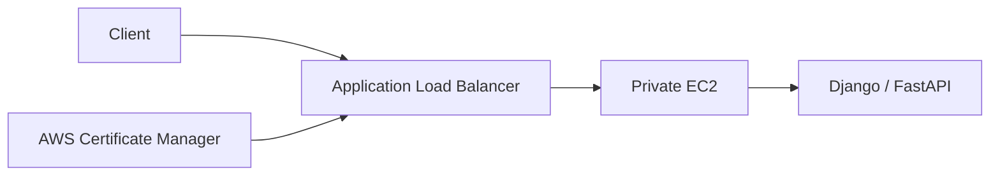
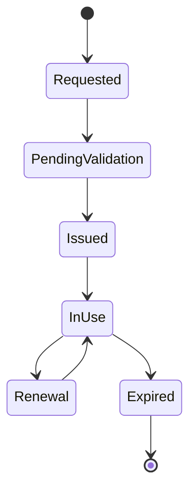
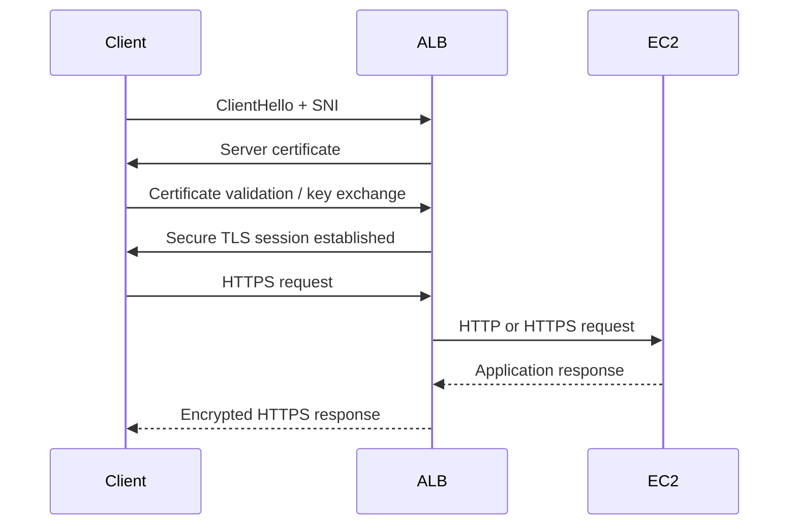
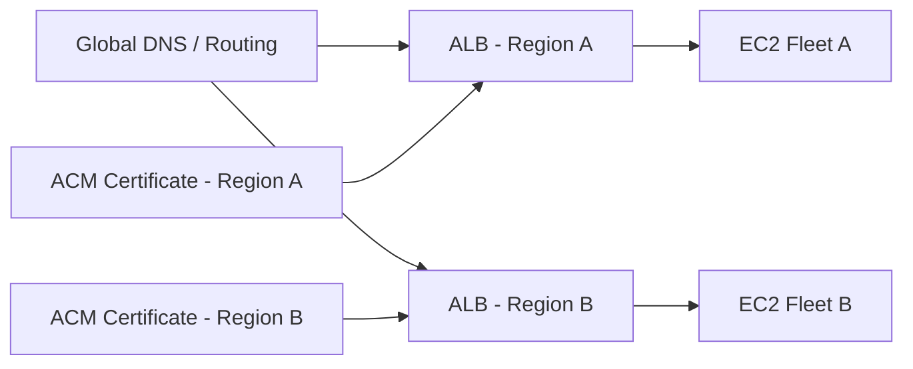

# 05- SSL Certificates

## Overview

SSL certificates are digital certificates used with TLS to authenticate a server and establish encrypted communication between clients and services.

The term **SSL certificate** is still widely used, but modern systems use **TLS**. SSL itself is obsolete; production systems should use current TLS versions and appropriate cipher/security policies.

For EC2-based applications, certificates commonly appear at the load-balancer layer:

```text
Client
  |
  | HTTPS / TLS
  v
Application Load Balancer
  |
  | HTTP or HTTPS
  v
EC2
  |
  +--> Nginx
        |
        +--> Django / FastAPI
```

AWS Certificate Manager (ACM) integrates with AWS services such as Elastic Load Balancing and CloudFront and can manage certificates without requiring administrators to manually copy private keys onto EC2 instances. ACM certificates are Regional resources. :contentReference[oaicite:0]{index=0}

For most AWS web applications, the preferred architecture is to terminate TLS at an Application Load Balancer (ALB), keep EC2 instances private, and forward application traffic from the load balancer to the backend.

---

## TLS vs SSL

| Term | Meaning | Production Use |
|---|---|---|
| SSL | Older secure protocol family | Obsolete |
| TLS | Modern successor to SSL | Yes |
| SSL certificate | Common terminology for a server certificate | Common but technically imprecise |
| TLS certificate | Certificate used during TLS authentication | Preferred terminology |

A certificate is not the encryption protocol itself.

The certificate primarily provides:

- Server identity
- Public key
- Domain identity
- Certificate validity information
- Certificate-authority signature

TLS uses the certificate as part of establishing a secure session.

---

## Why Certificates Exist

Without server authentication, encryption alone does not reliably establish that the client is communicating with the intended server.

The client needs to establish:

```text
"Am I really talking to api.example.com?"
```

A trusted certificate provides a chain of trust:

```text
Root CA
   |
   v
Intermediate CA
   |
   v
Server Certificate
   |
   v
api.example.com
```

The certificate contains information such as:

- Subject / domain identity
- Subject Alternative Names
- Public key
- Validity period
- Serial number
- Issuer
- Digital signature

An Application Load Balancer requires an X.509 server certificate for an HTTPS listener. :contentReference[oaicite:1]{index=1}

---

## Certificate Components

A simplified certificate contains:

```text
X.509 Certificate
 |
 +-- Subject
 |     |
 |     +-- example.com
 |
 +-- Subject Alternative Names
 |     |
 |     +-- example.com
 |     +-- api.example.com
 |
 +-- Public Key
 |
 +-- Validity
 |     |
 |     +-- Not Before
 |     +-- Not After
 |
 +-- Issuer
 |
 +-- Serial Number
 |
 +-- Signature
```

The private key is associated with the certificate but is not contained in the public certificate.

The security relationship is:

```text
Private Key
     |
     | cryptographic relationship
     |
Public Key
     |
     v
Certificate
```

The private key must remain confidential.

---

## Certificate Authority

A Certificate Authority (CA) issues certificates after validating domain or organizational ownership according to its validation process.

For a public certificate:

```text
Application
    |
    | Certificate request
    v
Certificate Authority
    |
    | Domain validation
    v
Certificate
```

Browsers and operating systems maintain trust stores containing trusted root CAs.

The client validates the certificate chain:

```text
Server Certificate
       |
       v
Intermediate CA
       |
       v
Trusted Root CA
```

If the chain is trusted and the hostname and validity checks pass, the certificate can be accepted.

---

## Public vs Private Certificates

| Certificate Type | Typical Use |
|---|---|
| Public certificate | Internet-facing APIs and websites |
| Private certificate | Internal services and private PKI |
| Self-signed certificate | Development, controlled internal scenarios |
| ACM public certificate | Publicly trusted AWS workloads |
| ACM Private CA certificate | Internal/private PKI |

For an internet-facing Django or FastAPI API:

```text
api.example.com
       |
       v
Public ACM Certificate
       |
       v
ALB HTTPS Listener
```

For internal service-to-service communication:

```text
service-a.internal
       |
       v
Private CA Certificate
       |
       v
Service B
```

Do not use publicly trusted certificates merely because they are available when the workload is intended to remain private.

---

## AWS Certificate Manager

AWS Certificate Manager (ACM) provides certificate lifecycle management for AWS-integrated services and supports public and private certificate workflows.

For AWS-managed public certificates, ACM can handle issuance, validation, and managed renewal. :contentReference[oaicite:2]{index=2}

Common AWS architecture:



The certificate is attached to the ALB HTTPS listener rather than copied to every EC2 instance.

---

## ACM Certificate Types

ACM commonly fits into two broad workflows:

### ACM Public Certificates

Used for publicly trusted domains.

Examples:

```text
example.com
api.example.com
*.example.com
```

ACM public certificates can be used with integrated AWS services such as Elastic Load Balancing and CloudFront. Current ACM also supports exportable public certificates for supported customer-managed infrastructure. :contentReference[oaicite:3]{index=3}

### ACM Private Certificates

Used for private PKI environments.

Examples:

```text
api.internal.example
postgres.internal.example
service-a.internal
```

These are useful for internal service-to-service TLS where a public CA is inappropriate.

---

## Domain Validation

Before ACM issues a public certificate, domain ownership or control must be validated.

ACM supports validation methods including:

- DNS validation
- Email validation

DNS validation is generally preferred when you control DNS because the validation record can remain in place and ACM can use it for managed renewal. :contentReference[oaicite:4]{index=4}

---

## DNS Validation

With DNS validation, ACM provides a CNAME record.

Conceptually:

```text
ACM
 |
 | Generate validation CNAME
 v
DNS
 |
 | Proves domain control
 v
ACM Certificate Authority
 |
 v
Certificate Issued
```

Example:

```text
_acme-challenge.example.com
        |
        v
CNAME -> ACM validation target
```

The exact ACM-generated record differs for each certificate/domain.

For Route 53-managed domains, the validation record can be created automatically through supported workflows.

---

## Why DNS Validation Is Preferred

DNS validation is generally better suited to production automation because:

- It avoids manual approval emails.
- The validation record can remain in DNS.
- ACM can automatically renew eligible certificates.
- Certificate replacement can be automated.
- Infrastructure as Code can manage the validation record.

ACM automatically renews DNS-validated certificates when the required CNAME records remain available and the certificate meets the renewal criteria. :contentReference[oaicite:5]{index=5}

---

## Email Validation

Email validation requires the domain owner to approve validation messages.

ACM sends validation messages to standard administrative addresses such as:

```text
admin@example.com
administrator@example.com
hostmaster@example.com
postmaster@example.com
webmaster@example.com
```

Email validation requires operational access to the relevant domain email addresses and requires action during renewal. :contentReference[oaicite:6]{index=6}

For automated production environments, DNS validation is generally preferable when DNS can be managed programmatically.

---

## Certificate Lifecycle

A typical ACM public certificate lifecycle is:



A production workflow should make renewal effectively invisible to application users.

The goal is:

```text
Request
  |
  v
Validate
  |
  v
Deploy
  |
  v
Monitor
  |
  v
Automatically Renew
  |
  v
Replace / Propagate
```

ACM public certificates currently have a 198-day validity period and ACM attempts managed renewal before expiration. :contentReference[oaicite:7]{index=7}

---

## Certificate Renewal

DNS-validated ACM certificates can be renewed automatically when ACM can verify the domain and the certificate is eligible for managed renewal. :contentReference[oaicite:8]{index=8}

The critical operational dependency is the validation record:

```text
Certificate
     |
     v
ACM Renewal
     |
     v
DNS CNAME still exists?
     |
   +---+---+
   |       |
  Yes      No
   |       |
   v       v
Renew    Renewal Risk
```

Do not remove ACM validation CNAME records merely because the certificate has already been issued.

---

## Renewal Monitoring

Automatic renewal does not eliminate the need for monitoring.

Monitor:

- Certificate expiration
- Renewal status
- Validation status
- Certificate deployment
- EventBridge events
- Load balancer listener configuration

ACM can emit AWS Health and EventBridge events when renewal cannot proceed automatically. :contentReference[oaicite:9]{index=9}

A production monitoring flow can be:

```text
ACM
 |
 v
Renewal Event
 |
 v
EventBridge
 |
 +--> Alert
 +--> Ticket
 +--> Automated remediation
```

---

## ACM and AWS Regions

ACM certificates are Regional resources.

If you have:

```text
ap-south-1
    |
    +-- ALB
```

and:

```text
us-east-1
    |
    +-- ALB
```

you generally need certificates available in each relevant Region.

```text
ACM ap-south-1
      |
      v
ALB ap-south-1

ACM us-east-1
      |
      v
ALB us-east-1
```

AWS states that ACM certificates cannot simply be copied between Regions; certificates need to be requested or imported for each Region where they are required. :contentReference[oaicite:10]{index=10}

This is important for:

- Multi-Region APIs
- Disaster recovery
- Active-active architectures
- Regional failover

---

## ALB HTTPS Listener

An Application Load Balancer HTTPS listener requires a certificate.

A common configuration is:

```text
Client
  |
  | HTTPS :443
  v
ALB
  |
  | HTTP :8000
  v
FastAPI / Django
```

The ALB terminates TLS:

```text
TLS encrypted
     |
     v
    ALB
     |
     | decrypted HTTP
     v
    EC2
```

AWS documents that an HTTPS listener terminates the frontend TLS connection and then forwards the request to its targets. :contentReference[oaicite:11]{index=11}

---

## End-to-End TLS

You can also encrypt traffic between the ALB and EC2.

```text
Client
  |
  | HTTPS
  v
ALB
  |
  | HTTPS
  v
EC2 / Nginx
  |
  v
Django / FastAPI
```

This provides encryption on both segments:

```text
Client ===== TLS =====> ALB ===== TLS =====> EC2
```

Use this when requirements justify encryption inside the VPC, such as:

- Regulatory requirements
- Zero-trust architecture
- Sensitive internal traffic
- Strict encryption-in-transit requirements
- Untrusted intermediate network boundaries

The operational trade-off is additional certificate management on the backend.

---

## TLS Termination vs TLS Passthrough

### TLS Termination

```text
Client
  |
  | TLS
  v
ALB
  |
  | HTTP/HTTPS
  v
EC2
```

Advantages:

- Centralized certificate management
- Centralized TLS policy
- Reduced CPU work on EC2
- Easier certificate rotation
- Simpler backend configuration

ALB supports HTTPS listeners that terminate TLS at the load balancer. :contentReference[oaicite:12]{index=12}

### TLS Passthrough

```text
Client
  |
  | TLS
  v
Load Balancer
  |
  | TLS
  v
EC2
```

The load balancer does not decrypt the application traffic.

This can be useful when the backend must terminate TLS itself, but certificate management becomes distributed.

For Network Load Balancers, a TLS listener can terminate TLS at the load balancer; a TCP listener can instead pass encrypted traffic through without TLS termination at the load balancer. :contentReference[oaicite:13]{index=13}

---

## Choosing a TLS Architecture

| Architecture | TLS Termination | Complexity | Typical Use |
|---|---|---:|---|
| Client → ALB → HTTP → EC2 | ALB | Low | Most standard web APIs |
| Client → ALB → HTTPS → EC2 | ALB + EC2 | Medium | End-to-end encryption |
| Client → NLB TCP → EC2 TLS | EC2 | Medium | TLS passthrough |
| Client → NLB TLS → EC2 | NLB | Medium | TLS-aware L4 workloads |
| Client → EC2 HTTPS | EC2 | Higher operational burden | Small/private systems |

For a typical Django/FastAPI application, centralized TLS termination at the ALB is usually the simplest architecture.

---

## Certificate Domain Matching

A certificate must cover the hostname used by the client.

For example:

```text
Client requests:
https://api.example.com
```

The certificate must include:

```text
api.example.com
```

or an applicable wildcard/SAN.

A certificate for:

```text
example.com
```

does not automatically cover:

```text
api.example.com
```

Similarly, a wildcard:

```text
*.example.com
```

covers:

```text
api.example.com
www.example.com
```

but does not cover the apex:

```text
example.com
```

AWS documents this wildcard behavior for ELB certificates. :contentReference[oaicite:14]{index=14}

---

## Subject Alternative Names

A certificate can contain multiple DNS names using Subject Alternative Names (SANs).

For example:

```text
example.com
api.example.com
admin.example.com
app.example.com
```

A single certificate can therefore cover multiple hostnames.

This can simplify:

```text
                  +--> example.com
                  |
Certificate ------+--> api.example.com
                  |
                  +--> admin.example.com
```

However, avoid putting unrelated domains or excessive names into one certificate when separate lifecycle ownership is more appropriate.

---

## Wildcard Certificates

A wildcard certificate such as:

```text
*.example.com
```

can cover multiple first-level subdomains.

Examples:

```text
api.example.com
admin.example.com
app.example.com
```

It does not cover:

```text
example.com
foo.api.example.com
```

A wildcard can simplify certificate management but increases the blast radius if its private key is compromised.

For centralized AWS-managed certificates, consider whether SAN-specific certificates provide better isolation.

---

## SNI

Server Name Indication (SNI) allows a TLS client to indicate the hostname it is connecting to during the TLS handshake.

This allows a single ALB listener to serve different certificates:

```text
Client
  |
  | SNI: api.example.com
  v
ALB :443
  |
  +--> api.example.com certificate
  |
  +--> admin.example.com certificate
  |
  +--> shop.example.com certificate
```

An ALB can associate multiple certificates with a secure listener and use SNI to select the appropriate certificate. :contentReference[oaicite:15]{index=15}

This is particularly useful for multi-domain architectures.

---

## Default Certificate

An HTTPS listener has a default certificate.

If the client does not provide SNI or no matching certificate is selected, the listener uses the default certificate. :contentReference[oaicite:16]{index=16}

Therefore:

```text
HTTPS Listener
 |
 +-- Default Certificate
 |
 +-- Certificate A
 |
 +-- Certificate B
 |
 +-- Certificate C
```

The default certificate should normally represent the primary domain of the listener.

---

## TLS Security Policies

The certificate is only one part of TLS security.

The listener also needs a TLS security policy defining supported:

- Protocol versions
- Cipher suites
- Cryptographic algorithms

AWS provides predefined security policies for load balancers. :contentReference[oaicite:17]{index=17}

Conceptually:

```text
HTTPS Listener
 |
 +-- Certificate
 |
 +-- TLS Security Policy
 |
 +-- Port 443
```

Avoid treating certificate installation as equivalent to complete TLS hardening.

---

## TLS Handshake

A simplified TLS connection looks like:



The exact TLS handshake depends on the negotiated TLS version and cryptographic parameters.

The important architectural distinction is that the ALB terminates the external TLS session when using an HTTPS listener.

---

## TLS and HTTP Headers

When TLS terminates at the ALB:

```text
Client
  |
  | HTTPS
  v
ALB
  |
  | HTTP
  v
Django / FastAPI
```

The backend must correctly understand that the original client connection was HTTPS.

Applications commonly rely on forwarded headers such as:

```text
X-Forwarded-Proto: https
```

Django, FastAPI, Uvicorn, and Nginx must be configured appropriately for the deployment topology.

For Django, incorrect proxy configuration can cause issues such as:

- HTTP redirects instead of HTTPS
- Incorrect secure-cookie behavior
- CSRF origin problems
- Redirect loops
- Incorrect generated URLs

Do not blindly trust forwarded headers from arbitrary clients. The application should only trust proxy headers when traffic is known to come through the controlled proxy/load-balancer path.

---

## Django Behind an HTTPS Load Balancer

A typical architecture is:

```text
Browser
   |
 HTTPS
   |
   v
ALB
   |
 HTTP
   |
   v
Nginx
   |
   v
Django
```

Django needs to understand that the original request was HTTPS.

A common configuration pattern is:

```python
SECURE_PROXY_SSL_HEADER = ("HTTP_X_FORWARDED_PROTO", "https")
```

Only use this when the proxy infrastructure is configured so that clients cannot directly inject a trusted `X-Forwarded-Proto` value into requests reaching Django.

Additional production settings commonly include:

```python
SESSION_COOKIE_SECURE = True
CSRF_COOKIE_SECURE = True
```

HTTPS enforcement should be designed consistently across the ALB, proxy, and Django application.

---

## FastAPI Behind an HTTPS Load Balancer

FastAPI/Uvicorn also needs to understand proxy headers when TLS terminates upstream.

A typical deployment might be:

```text
Internet
   |
 HTTPS
   v
ALB
   |
 HTTP
   v
Nginx
   |
 HTTP
   v
Uvicorn
   |
   v
FastAPI
```

If Uvicorn is configured to trust proxy headers, restrict that trust to the expected proxy network rather than trusting arbitrary clients.

For example:

```bash
uvicorn app.main:app \
  --host 0.0.0.0 \
  --port 8000 \
  --proxy-headers
```

Proxy-header trust should be considered together with the network topology and Uvicorn's trusted-proxy configuration.

---

## Certificate Deployment to ALB

A typical workflow is:

```text
Request ACM Certificate
        |
        v
Validate Domain
        |
        v
Certificate Issued
        |
        v
Create HTTPS Listener
        |
        v
Attach Certificate
        |
        v
Forward to Target Group
```

AWS CLI example:

```bash
aws elbv2 create-listener \
  --load-balancer-arn "$ALB_ARN" \
  --protocol HTTPS \
  --port 443 \
  --ssl-policy ELBSecurityPolicy-TLS13-1-2-2021-06 \
  --certificates CertificateArn="$CERTIFICATE_ARN" \
  --default-actions Type=forward,TargetGroupArn="$TARGET_GROUP_ARN"
```

AWS documents this listener creation pattern for ALB HTTPS listeners. :contentReference[oaicite:18]{index=18}

---

## Inspecting Certificates

List certificates:

```bash
aws acm list-certificates
```

Inspect a certificate:

```bash
aws acm describe-certificate \
  --certificate-arn "$CERTIFICATE_ARN"
```

Extract useful fields:

```bash
aws acm describe-certificate \
  --certificate-arn "$CERTIFICATE_ARN" \
  --query 'Certificate.{Domain:DomainName,Status:Status,NotBefore:NotBefore,NotAfter:NotAfter,Renewal:RenewalSummary.RenewalStatus}' \
  --output table
```

Check certificates attached to an ALB listener:

```bash
aws elbv2 describe-listener-certificates \
  --listener-arn "$LISTENER_ARN"
```

Inspect the listener:

```bash
aws elbv2 describe-listeners \
  --listener-arns "$LISTENER_ARN"
```

---

## Replacing an ALB Certificate

A certificate can be replaced without changing the load balancer itself.

```bash
aws elbv2 modify-listener \
  --listener-arn "$LISTENER_ARN" \
  --certificates CertificateArn="$NEW_CERTIFICATE_ARN"
```

AWS documents `modify-listener` for replacing the default certificate. :contentReference[oaicite:19]{index=19}

A production rotation should look like:

```text
New Certificate
      |
      v
Validate
      |
      v
Attach / Replace
      |
      v
Test HTTPS
      |
      v
Monitor
      |
      v
Retire Old Certificate
```

Do not delete the old certificate before confirming that no required listener or resource still depends on it.

---

## Certificate Rotation

For ACM-managed certificates, renewal and deployment are separate operational concerns.

```text
ACM
 |
 +-- Renews certificate
 |
 v
New certificate version
 |
 v
AWS-integrated service
 |
 v
Traffic uses renewed certificate
```

For exported certificates, ACM can manage renewal, but you remain responsible for deploying the renewed certificate to your customer-managed infrastructure. :contentReference[oaicite:20]{index=20}

This distinction matters for:

- EC2 Nginx
- Custom reverse proxies
- Containers
- Kubernetes
- On-premises systems

---

## Certificates Directly on EC2

You can terminate TLS directly on EC2:

```text
Client
  |
  | HTTPS
  v
EC2
  |
  v
Nginx
  |
  v
Django / FastAPI
```

The certificate and private key are stored on the server.

For example:

```nginx
server {
    listen 443 ssl;
    server_name api.example.com;

    ssl_certificate     /etc/nginx/tls/fullchain.pem;
    ssl_certificate_key /etc/nginx/tls/privkey.pem;

    location / {
        proxy_pass http://127.0.0.1:8000;
    }
}
```

This provides direct control but creates additional operational responsibilities:

- Private-key storage
- Certificate renewal
- Certificate deployment
- Nginx reloads
- Secret distribution
- Rotation
- Monitoring

For a fleet of EC2 instances, this complexity grows quickly.

---

## Certificate Management on an EC2 Fleet

Consider:

```text
ALB
 |
 +--> EC2-1
 +--> EC2-2
 +--> EC2-3
 +--> EC2-4
```

If TLS terminates on every instance:

```text
Certificate
    |
    +--> EC2-1
    +--> EC2-2
    +--> EC2-3
    +--> EC2-4
```

Every instance becomes part of the certificate deployment process.

With ALB termination:

```text
Certificate
    |
    v
ALB
    |
    +--> EC2-1
    +--> EC2-2
    +--> EC2-3
    +--> EC2-4
```

This centralizes certificate lifecycle management.

---

## Exportable ACM Public Certificates

Current ACM supports exportable public certificates for customer-managed infrastructure.

The workflow is:

```text
ACM
 |
 v
Request Exportable Public Certificate
 |
 v
Domain Validation
 |
 v
Certificate Issued
 |
 v
Export Certificate + Encrypted Private Key
 |
 v
Deploy to EC2 / Kubernetes / Other Infrastructure
```

AWS requires a passphrase when exporting the certificate's private key. :contentReference[oaicite:21]{index=21}

Exported private keys must be treated as sensitive secrets.

The main operational difference is:

```text
ACM-managed AWS integration
    |
    +--> AWS handles service-side deployment

Exported certificate
    |
    +--> You handle deployment
```

ACM can renew exportable certificates, but your deployment system must distribute the renewed certificate to the actual server or application. :contentReference[oaicite:22]{index=22}

---

## Certificate Private-Key Security

The private key is the most sensitive component.

Never store it in:

```text
Git
Dockerfile
Docker image
Public S3 bucket
Application source
Plain CI variables
Chat messages
Unencrypted shared folders
```

Prefer:

- AWS Secrets Manager
- AWS Systems Manager Parameter Store where appropriate
- Encrypted secret stores
- Restricted filesystem permissions
- Automated secret deployment
- Short-lived access where practical

For ALB + ACM architectures, the private key does not need to be copied onto the EC2 instances.

---

## Certificate Revocation

If a certificate's private key is compromised or the certificate should no longer be trusted, revocation may be required.

For ACM certificates, use the certificate lifecycle and revocation mechanisms appropriate to the certificate type.

A compromised private key should be treated as a security incident:

```text
Key compromise
      |
      v
Identify affected certificate
      |
      v
Issue replacement certificate
      |
      v
Deploy replacement
      |
      v
Revoke compromised certificate
      |
      v
Investigate exposure
```

Do not merely replace the certificate while leaving the compromised private key active elsewhere.

---

## High Availability

Certificates should not become a single point of failure.

With an ALB:

```text
                    +--> EC2-A
Client --> ALB -----+--> EC2-B
                    +--> EC2-C
```

The certificate is attached to the load-balancer listener rather than a single EC2 instance.

This works naturally with:

- Multi-AZ ALBs
- Auto Scaling Groups
- Immutable EC2 instances
- Rolling deployments

Certificate management therefore remains independent of individual instance replacement.

---

## Multi-Region Architecture

For active-active regional deployments:



Because ACM certificates are Regional resources, each Region requires its own certificate resource for regional load balancers. :contentReference[oaicite:23]{index=23}

A DR runbook should therefore include:

- Certificate availability
- DNS validation
- Regional certificate provisioning
- ALB listener configuration
- Certificate renewal monitoring

---

## Monitoring and Observability

Certificate monitoring should include:

| Signal | Why It Matters |
|---|---|
| Certificate expiration | Prevent outages |
| Renewal status | Detect failed automation |
| Domain validation | Detect validation problems |
| Listener certificate | Verify deployment |
| TLS handshake failures | Detect protocol/configuration problems |
| Hostname mismatch | Detect DNS/certificate mismatch |
| Certificate chain errors | Detect incomplete or invalid deployment |

For ACM-managed certificates, monitor EventBridge/Health events associated with renewal failures. :contentReference[oaicite:24]{index=24}

For exported certificates, also monitor the actual deployment state because renewal in ACM does not automatically update arbitrary EC2/Nginx installations. :contentReference[oaicite:25]{index=25}

---

## Testing a Certificate

From a client machine:

```bash
curl -Iv https://api.example.com
```

Useful information includes:

- Certificate subject
- Certificate issuer
- Expiration
- TLS version
- HTTP response
- Redirect behavior

OpenSSL can inspect the TLS handshake:

```bash
openssl s_client \
  -connect api.example.com:443 \
  -servername api.example.com \
  -showcerts
```

The `-servername` option is important when testing SNI-based multi-domain listeners.

Inspect the certificate:

```bash
openssl s_client \
  -connect api.example.com:443 \
  -servername api.example.com </dev/null 2>/dev/null \
  | openssl x509 -noout -subject -issuer -dates
```

---

## Certificate Chain Problems

A certificate can be valid while the deployed chain is incomplete.

The intended chain is:

```text
Server Certificate
       |
       v
Intermediate Certificate
       |
       v
Trusted Root
```

A missing intermediate certificate can cause some clients to reject the connection even when other clients appear to work.

This is particularly important when certificates are installed manually on:

- Nginx
- Apache
- Kubernetes ingress
- Custom TLS servers

Managed AWS integrations reduce some of this operational complexity.

---

## Certificate and DNS Mismatch

A common production problem is:

```text
DNS:
api.example.com
      |
      v
ALB
      |
      v
Certificate:
other.example.com
```

The TLS connection can fail hostname validation.

The correct relationship is:

```text
DNS hostname
     |
     v
Certificate SAN / wildcard
     |
     v
HTTPS Listener
```

Always test the exact public hostname used by clients.

---

## Certificate and Load Balancer Security Groups

TLS termination does not replace network controls.

A typical configuration is:

```text
Internet
   |
   | TCP 443
   v
ALB Security Group
   |
   | Application port
   v
EC2 Security Group
```

The EC2 Security Group should normally allow application traffic only from the ALB Security Group rather than from the entire internet. AWS recommends restricting EC2 inbound traffic to the load balancer where the load balancer is the intended entry point. :contentReference[oaicite:26]{index=26}

For example:

```text
ALB SG:
  inbound TCP 443 <- Internet

EC2 SG:
  inbound TCP 8000 <- ALB SG
```

---

## HTTP to HTTPS Redirect

A common production configuration is:

```text
HTTP :80
   |
   v
Redirect to HTTPS :443
```

The ALB can perform the redirect before forwarding the request to the backend.

Conceptually:

```text
http://api.example.com
        |
        v
ALB :80
        |
        | 301/302
        v
https://api.example.com
        |
        v
ALB :443
        |
        v
Backend
```

This keeps the application from having to implement the redirect itself.

---

## Backend Redirect Loops

A common mistake occurs when TLS terminates at the ALB but the backend believes every request is HTTP.

Example:

```text
Client
  |
 HTTPS
  v
ALB
  |
 HTTP
  v
Django
  |
  | "Request is HTTP"
  v
HTTPS redirect
  |
  v
ALB
```

This can produce an infinite redirect loop.

The solution is to correctly configure proxy-awareness and forwarded-protocol handling.

---

## mTLS

Mutual TLS (mTLS) extends normal server authentication by authenticating the client as well.

Normal TLS:

```text
Client ---> Verify Server
```

mTLS:

```text
Client <--> Verify Each Other
```

A simplified architecture is:

```text
Client Certificate
       |
       v
ALB / TLS Endpoint
       |
       | Verify client identity
       v
Backend
```

mTLS is useful for:

- Service-to-service authentication
- Partner APIs
- Device authentication
- High-trust internal APIs

Application Load Balancers support mutual authentication configuration for HTTPS listeners. :contentReference[oaicite:27]{index=27}

mTLS adds certificate issuance, distribution, revocation, and client-identity lifecycle complexity, so it should be introduced when the authentication requirement justifies that operational cost.

---

## gRPC and TLS

gRPC commonly runs over HTTP/2 and TLS.

A typical AWS architecture is:

```text
gRPC Client
    |
    | TLS / HTTP2
    v
ALB
    |
    | HTTP2 / gRPC
    v
FastAPI / gRPC Service
```

Certificate management remains part of the frontend TLS layer.

For gRPC microservices, internal TLS can additionally be used:

```text
Service A
    |
    | mTLS
    v
Service B
```

This is a separate design decision from public HTTPS termination.

---

## Certificate Management in CI/CD

Certificate infrastructure should ideally be managed declaratively.

For example:

```text
Git
 |
 v
Terraform / CloudFormation
 |
 +--> ACM Certificate
 +--> DNS Validation
 +--> ALB Listener
 +--> Certificate Association
```

The application deployment pipeline should not need access to private certificate keys when ACM manages the certificate directly on an AWS-integrated service.

For exported certificates, the deployment pipeline may need controlled access to certificate material or a secret-management workflow.

---

## Infrastructure as Code Example

A simplified Terraform-style architecture is:

```hcl
resource "aws_acm_certificate" "api" {
  domain_name       = "api.example.com"
  validation_method = "DNS"

  lifecycle {
    create_before_destroy = true
  }
}

resource "aws_lb_listener" "https" {
  load_balancer_arn = aws_lb.api.arn
  port              = 443
  protocol          = "HTTPS"

  ssl_policy = "ELBSecurityPolicy-TLS13-1-2-2021-06"

  certificate_arn = aws_acm_certificate.api.arn

  default_action {
    type             = "forward"
    target_group_arn = aws_lb_target_group.api.arn
  }
}
```

The actual DNS validation resources and provider configuration should be implemented according to the organization's Terraform conventions.

---

## Cost Considerations

ACM public certificates used with integrated AWS services do not generally carry an additional certificate charge; you pay for the AWS resources using the certificates. :contentReference[oaicite:28]{index=28}

Exportable public certificates have separate pricing considerations. AWS currently documents additional charges for exportable public certificates. :contentReference[oaicite:29]{index=29}

Cost decisions should therefore consider:

- Number of certificates
- Export requirements
- Load balancer costs
- Private CA costs
- Certificate deployment infrastructure
- Operational overhead

Do not consolidate unrelated certificates solely to reduce certificate count if it increases security or operational risk.

---

## Common Mistakes

### Using Expired Certificates

Certificates have finite validity periods.

**Prevention:**

- Use ACM managed renewal where possible.
- Monitor expiration.
- Monitor renewal status.
- Alert before expiry.

---

### Deleting DNS Validation Records

Removing the ACM validation CNAME can prevent future automatic renewal. :contentReference[oaicite:30]{index=30}

Keep required validation records in DNS.

---

### Using Email Validation for Highly Automated Infrastructure

Email validation introduces human dependency.

Prefer DNS validation when you control DNS.

---

### Assuming ACM Is Global

ACM certificates are Regional resources.

A certificate in `ap-south-1` cannot simply be attached to an ALB in `us-east-1`. :contentReference[oaicite:31]{index=31}

---

### Storing Certificates and Private Keys in Git

Never commit:

```text
certificate.pem
private-key.pem
fullchain.pem
```

if they contain sensitive private-key material.

---

### Terminating TLS on Every EC2 Instance Without Need

This creates unnecessary certificate-distribution and rotation complexity.

Prefer centralized ALB termination when the architecture permits it.

---

### Forgetting Backend Encryption Requirements

Some environments require:

```text
Client --> TLS --> ALB --> TLS --> EC2
```

rather than:

```text
Client --> TLS --> ALB --> HTTP --> EC2
```

Choose deliberately based on security and compliance requirements.

---

### Incorrect Proxy Configuration

Incorrect handling of `X-Forwarded-Proto` can cause:

- Redirect loops
- Incorrect secure cookies
- Incorrect URL generation
- CSRF problems

---

### Using a Wildcard Without Considering Blast Radius

If:

```text
*.example.com
```

is compromised, multiple subdomains may be affected.

Use certificate boundaries that match security and ownership boundaries.

---

### Deleting the Old Certificate Too Early

An old certificate may still be referenced by:

- ALB listeners
- NLB listeners
- Other AWS services
- Customer-managed infrastructure

Verify dependencies before deletion.

---

## Production Certificate Checklist

### Certificate

- [ ] Correct domain names
- [ ] Correct SANs
- [ ] Appropriate wildcard usage
- [ ] Trusted public or private CA
- [ ] Appropriate key algorithm
- [ ] Correct Region

### Validation

- [ ] DNS validation preferred where practical
- [ ] ACM validation records retained
- [ ] Domain ownership verified
- [ ] Renewal status monitored

### Load Balancer

- [ ] HTTPS listener on 443
- [ ] Correct certificate attached
- [ ] Appropriate TLS security policy
- [ ] SNI configured where multiple domains are required
- [ ] HTTP redirected to HTTPS where appropriate

### Backend

- [ ] Correct `X-Forwarded-Proto` handling
- [ ] Secure cookies enabled where applicable
- [ ] Application does not blindly trust client-supplied proxy headers
- [ ] Backend TLS enabled when required

### Operations

- [ ] Certificate expiration monitored
- [ ] Renewal failures alerting configured
- [ ] Certificate rotation tested
- [ ] Old certificates removed only after dependency verification
- [ ] Emergency recovery procedure documented

---

## Troubleshooting

### Certificate Not Found on ALB

Check:

```bash
aws acm list-certificates \
  --region ap-south-1
```

Verify that the certificate exists in the same Region as the ALB. ACM certificates are Regional resources. :contentReference[oaicite:32]{index=32}

---

### Certificate Is `PENDING_VALIDATION`

Check:

```bash
aws acm describe-certificate \
  --certificate-arn "$CERTIFICATE_ARN"
```

Inspect:

```text
DomainValidationOptions
Status
ResourceRecord
```

For DNS validation, confirm that the ACM-provided CNAME exists in public DNS.

---

### Browser Reports Certificate Mismatch

Check:

```bash
openssl s_client \
  -connect api.example.com:443 \
  -servername api.example.com </dev/null 2>/dev/null \
  | openssl x509 -noout -subject -issuer -dates
```

Verify:

- Hostname
- SAN
- Certificate attached to listener
- SNI
- DNS target

---

### Browser Reports Expired Certificate

Check:

```bash
aws acm describe-certificate \
  --certificate-arn "$CERTIFICATE_ARN" \
  --query 'Certificate.{Status:Status,NotAfter:NotAfter,Renewal:RenewalSummary.RenewalStatus}'
```

Then inspect:

- DNS validation records
- Renewal status
- Certificate association
- Listener certificate
- EventBridge/Health events

---

### HTTPS Works but Application Redirects Forever

Inspect the proxy chain:

```text
Client HTTPS
    |
    v
ALB
    |
    | HTTP
    v
Nginx
    |
    v
Django / FastAPI
```

Verify that the application correctly recognizes the original HTTPS scheme.

---

### TLS Works but Backend Is Unreachable

TLS termination can succeed while backend connectivity fails.

Separate the problem:

```text
Client
  |
  | TLS
  v
ALB
  |
  +--> Certificate problem?
  |
  +--> Listener problem?
  |
  +--> Target health?
  |
  +--> Security Group?
  |
  +--> Backend port?
  |
  v
EC2
```

Do not assume a successful TLS handshake means the application is healthy.

---

## Interview Considerations

### What is an SSL/TLS certificate?

It is an X.509 digital certificate used to authenticate a server and provide a public key as part of establishing a secure TLS connection.

### Where should TLS terminate in a typical AWS web architecture?

Commonly at the Application Load Balancer:

```text
Client
  |
 HTTPS
  v
ALB
  |
 HTTP/HTTPS
  v
EC2
```

This centralizes certificate management and TLS policy.

### What is the difference between TLS termination and TLS passthrough?

TLS termination means the load balancer decrypts the client connection.

TLS passthrough means encrypted traffic remains encrypted through the load balancer until it reaches the backend TLS endpoint.

### Why use ACM?

ACM simplifies certificate issuance, validation, deployment to integrated AWS services, and managed renewal. :contentReference[oaicite:33]{index=33}

### Why is DNS validation preferred?

The validation CNAME can remain in DNS, allowing ACM to automatically validate ownership for managed renewal when the certificate remains eligible. :contentReference[oaicite:34]{index=34}

### Are ACM certificates global?

No. ACM certificates are Regional resources. Regional load balancers require certificates in the appropriate Region. :contentReference[oaicite:35]{index=35}

### What is SNI?

SNI allows a TLS client to indicate the hostname during the handshake, allowing a secure listener to select the appropriate certificate for multiple domains. :contentReference[oaicite:36]{index=36}

### Why can HTTPS terminate at an ALB while the backend uses HTTP?

TLS protects the client-to-ALB connection. The ALB can decrypt the request and forward it to the backend over HTTP when the internal network and security requirements permit it.

If encryption is required across the entire path:

```text
Client
  |
 TLS
  v
ALB
  |
 TLS
  v
EC2
```

### What happens if an ACM DNS validation record is deleted?

The existing certificate may continue to work until expiration, but ACM may no longer be able to automatically validate the domain for renewal. :contentReference[oaicite:37]{index=37}

### What changes when an ACM certificate is exported?

ACM can renew the certificate, but the customer becomes responsible for deploying the renewed certificate to customer-managed infrastructure. :contentReference[oaicite:38]{index=38}

### Why should EC2 Security Groups allow application traffic only from the ALB?

It separates public ingress from backend access:

```text
Internet
   |
   v
ALB SG :443
   |
   v
EC2 SG :8000 <- ALB SG only
```

This prevents clients from bypassing the load balancer and reaching backend instances directly.

## Key Takeaways

- **TLS certificates authenticate server identities and participate in establishing encrypted connections; SSL is obsolete terminology for the modern TLS protocol family.**
- **For typical AWS web applications, terminate TLS at an ALB using ACM, keep EC2 instances private, and allow backend traffic only from the load balancer.**
- **Prefer DNS validation for ACM-managed public certificates because the persistent validation record enables automated renewal when the certificate remains eligible.**
- **ACM certificates are Regional resources, so multi-Region architectures require certificate resources in each relevant Region.**
- **Treat certificate renewal and certificate deployment as separate concerns for exported certificates; automate both and monitor renewal and deployment failures.**