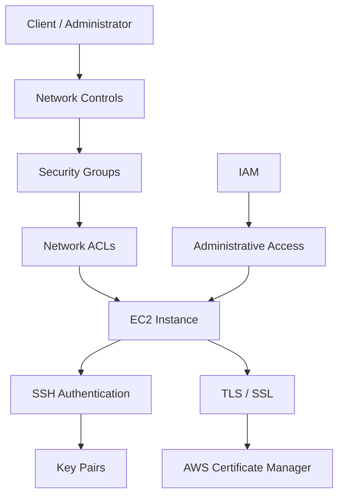
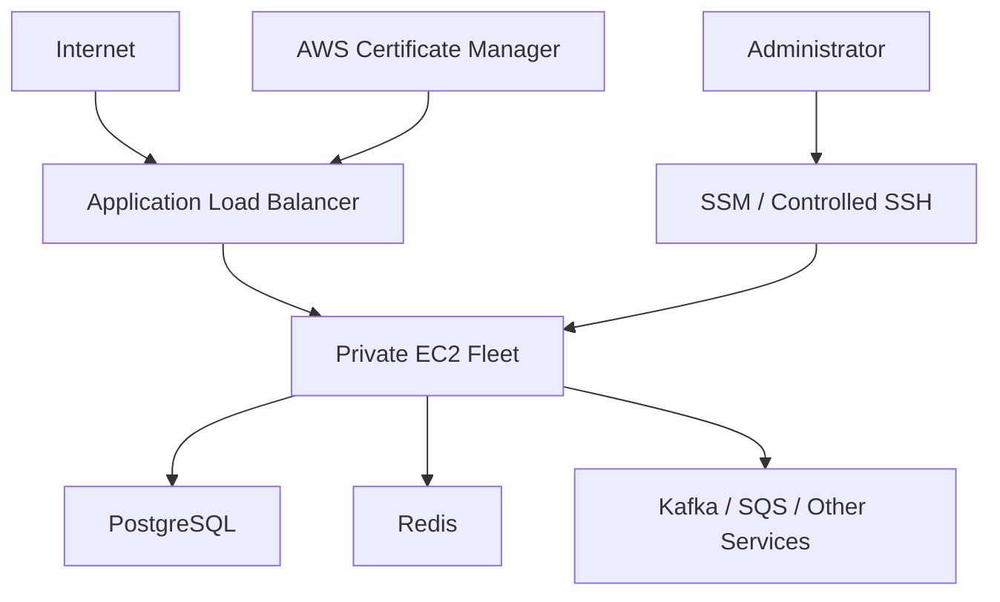
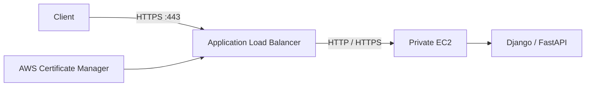
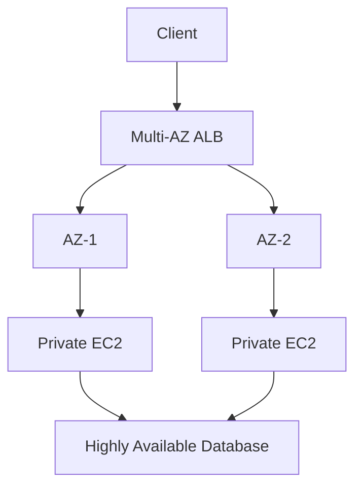
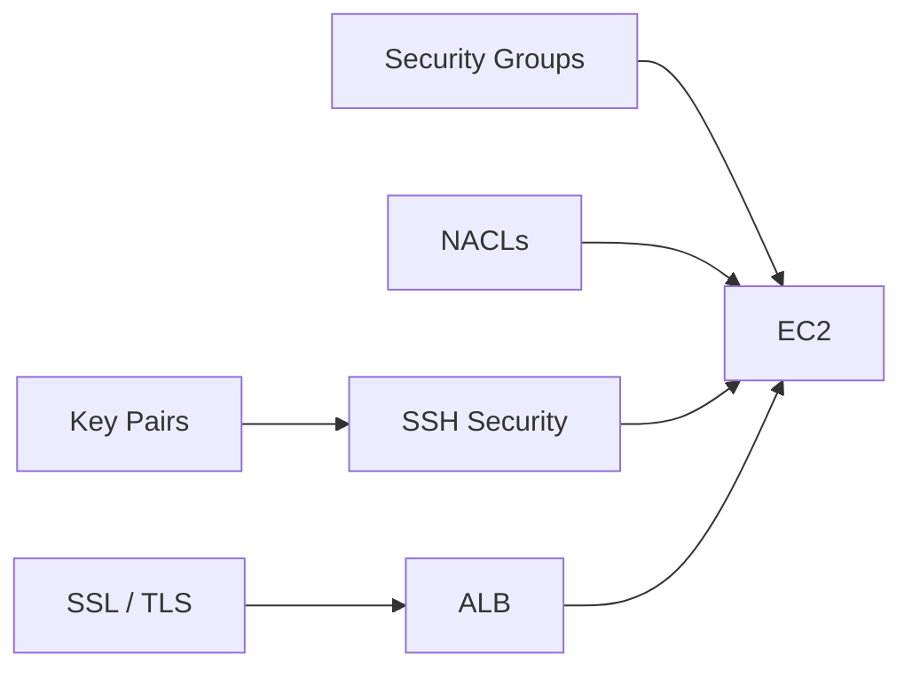

# README

## Overview

This directory contains security-focused documentation for Amazon EC2.

The material covers the controls used to secure administrative access, network connectivity, authentication, and encrypted communication for EC2 workloads.

The security model should be considered as multiple independent layers:



The key principle is **defense in depth**. No single control should be expected to provide complete EC2 security.

---

## Navigation

| # | File | Description |
|---|---|---|
| 01 | [01- Security Groups](./01-%20Security%20Groups.md) | Stateful instance-level network filtering and least-privilege traffic rules |
| 02 | [02- Network ACLs vs Security Groups](./02-%20Network%20ACLs%20vs%20Security%20Groups.md) | Comparison of subnet-level and resource-level network controls |
| 03 | [03- Key Pairs](./03-%20Key%20Pairs.md) | EC2 public-key authentication and key lifecycle management |
| 04 | [04- SSH Security](./04-%20SSH%20Security.md) | SSH hardening, access control, troubleshooting, and production practices |
| 05 | [05- SSL Certificates](./05-%20SSL%20Certificates.md) | TLS/SSL certificates, ACM, HTTPS termination, and certificate lifecycle |

## Security Topics

| File | Topic | Primary Focus |
|---|---|---|
| `01- Security Groups.md` | Security Groups | Stateful instance-level network filtering |
| `02- Network ACLs vs Security Groups.md` | NACLs vs Security Groups | Subnet-level vs instance-level network controls |
| `03- Key Pairs.md` | EC2 Key Pairs | Public-key authentication and credential management |
| `04- SSH Security.md` | SSH Security | Hardening and securing administrative SSH access |
| `05- SSL Certificates.md` | SSL Certificates | TLS certificates, ACM, HTTPS, and certificate lifecycle |

---

## Security Architecture

A typical production EC2 architecture separates public ingress from backend resources and administrative access.



The resulting security boundaries are:

```text
Internet
   |
   | HTTPS :443
   v
ALB
   |
   | Application traffic
   v
Private EC2
   |
   +--> PostgreSQL
   +--> Redis
   +--> Internal Services

Administrator
   |
   v
Controlled Administrative Access
   |
   v
Private EC2
```

This prevents application servers from becoming directly exposed to the internet merely because they require administrative access.

---

## Security Control Layers

| Layer | Primary Control | Purpose |
|---|---|---|
| Identity | IAM | Control AWS API and administrative permissions |
| Network | Security Groups | Control traffic to and from EC2 ENIs |
| Subnet | Network ACLs | Stateless subnet-level traffic filtering |
| Authentication | Key Pairs / SSH | Authenticate operating-system users |
| Host | OS permissions / firewall | Control local access and processes |
| Transport | TLS certificates | Authenticate endpoints and encrypt traffic |
| Operations | Monitoring / logging | Detect and investigate security events |
| Architecture | Private subnets / ALB | Reduce public attack surface |

These controls address different problems and should not be treated as interchangeable.

---

## Security Groups

`01- Security Groups.md` covers Security Groups as the primary network firewall mechanism for EC2.

Key concepts include:

- Stateful traffic filtering
- Inbound rules
- Outbound rules
- CIDR-based rules
- Security Group references
- Least-privilege access
- ALB-to-EC2 traffic
- EC2-to-database traffic
- EC2-to-Redis traffic
- Microservice communication
- Security Group vs NACL
- Operational troubleshooting

A common production pattern is:

```text
Internet
    |
    | TCP 443
    v
ALB Security Group
    |
    | Application Port
    v
EC2 Security Group
    |
    | PostgreSQL Port
    v
Database Security Group
```

Each tier should accept traffic only from the systems that actually require it.

---

## Network ACLs vs Security Groups

`02- Network ACLs vs Security Groups.md` explains the distinction between subnet-level and resource-level network controls.

The fundamental comparison is:

| Characteristic | Security Group | Network ACL |
|---|---|---|
| Scope | Resource / ENI | Subnet |
| Stateful | Yes | No |
| Rules | Allow | Allow and deny |
| Rule evaluation | Matching allow rules | Lowest-numbered matching rule |
| Return traffic | Automatically allowed by state | Must be explicitly permitted |
| Typical role | Primary workload firewall | Additional subnet-level control |

A production architecture can use both:

```text
VPC
 |
 +-- Network ACL
 |
 +-- Subnet
       |
       +-- Security Group
             |
             +-- EC2
```

Security Groups are generally the primary mechanism for controlling application-level EC2 network access, while NACLs can provide an additional subnet-level defense layer.

---

## Key Pairs

`03- Key Pairs.md` covers EC2 public-key authentication.

The model is:

```text
Administrator
     |
     | Private Key
     v
   SSH Client
     |
     | Authentication
     v
EC2 Instance
     |
     | Public Key
     v
authorized_keys
```

Important operational principles:

- AWS does not provide the private key after creation.
- Private keys must be treated as credentials.
- Key pairs are Regional resources.
- Public keys can be imported into EC2.
- Key rotation requires careful validation.
- Deleting an EC2 key-pair resource does not automatically remove a public key already installed on an instance.
- Production fleets should consider centralized access mechanisms.

For Auto Scaling environments, manually maintaining SSH credentials on individual instances is fragile. Systems Manager or other centralized access mechanisms can provide a more scalable operational model.

---

## SSH Security

`04- SSH Security.md` focuses specifically on securing administrative SSH access.

The recommended access path is:

```text
Administrator
      |
      v
IAM / Controlled Access
      |
      +--> Systems Manager
      |
      +--> EC2 Instance Connect
      |
      +--> Restricted SSH
              |
              v
           EC2
```

When SSH is required:

- Restrict TCP/22 to trusted networks.
- Avoid `0.0.0.0/0` and `::/0`.
- Use key-based authentication.
- Protect private keys.
- Disable unnecessary password authentication.
- Avoid direct root login.
- Use individual administrative identities.
- Monitor authentication activity.
- Keep OpenSSH and the operating system patched.
- Prefer `ProxyJump` over unnecessary SSH agent forwarding.
- Validate SSH configuration before restarting the service.

For production EC2 fleets, SSH should generally be an administrative capability rather than the primary deployment mechanism.

---

## SSL Certificates and TLS

`05- SSL Certificates.md` covers TLS certificates and HTTPS security for EC2-backed applications.

The preferred AWS architecture for many web applications is:



This centralizes:

- Certificate management
- TLS termination
- Certificate renewal
- TLS security policies
- SNI-based certificate selection

ACM is particularly useful when TLS terminates at AWS-managed services such as an ALB.

---

## Security by Traffic Direction

Security decisions should be made based on the actual communication flow.

### Internet to ALB

```text
Internet
   |
   | HTTPS :443
   v
ALB
```

Allow only the required public application ports.

### ALB to EC2

```text
ALB
 |
 | Application Port
 v
EC2
```

The EC2 Security Group should generally allow the application port from the ALB Security Group rather than from the internet.

### EC2 to PostgreSQL

```text
EC2
 |
 | TCP 5432
 v
PostgreSQL
```

The database Security Group should allow access from the application tier only.

### EC2 to Redis

```text
EC2
 |
 | TCP 6379
 v
Redis
```

Redis should not be exposed publicly.

### Administrator to EC2

```text
Administrator
 |
 +--> Systems Manager
 |
 +--> Restricted SSH
 |
 v
EC2
```

Administrative access should remain separate from normal application traffic.

---

## Public vs Private EC2

A production application server generally does not need a public IP merely because users need to access the application.

Prefer:

```text
Internet
   |
   v
ALB
   |
   v
Private EC2
```

instead of:

```text
Internet
   |
   +--> Public EC2
   +--> Public EC2
   +--> Public EC2
```

Private EC2 instances reduce direct exposure and allow the ALB to act as the controlled application entry point.

---

## Security Group Design by Role

Security Groups should represent communication relationships rather than individual servers.

Example:

```text
sg-alb
  |
  +-- HTTPS from Internet

sg-api
  |
  +-- Application port from sg-alb

sg-worker
  |
  +-- Internal services as required

sg-db
  |
  +-- PostgreSQL from sg-api / sg-worker

sg-redis
  |
  +-- Redis from sg-api / sg-worker
```

This is preferable to broad CIDR-based access between application tiers when Security Group references can express the relationship directly.

---

## Administrative Access Architecture

A production EC2 environment should distinguish between:

```text
Application Access
    |
    v
ALB
    |
    v
EC2

Administrative Access
    |
    v
SSM / Controlled SSH
    |
    v
EC2
```

This separation makes it easier to:

- Restrict network exposure
- Audit access
- Rotate credentials
- Replace instances
- Operate Auto Scaling fleets
- Apply least privilege
- Maintain break-glass procedures

---

## TLS and Application Security

TLS protects the network transport but does not replace application authentication or authorization.

For example:

```text
TLS
 |
 +-- Encrypts transport
 +-- Authenticates server
```

Application security still requires:

```text
Authentication
      +
Authorization
      +
Input Validation
      +
Session Security
      +
API Security
```

For a Django or FastAPI API, HTTPS should therefore be treated as one layer of the security architecture rather than the complete security model.

---

## Security and Auto Scaling

Security configuration should be reproducible for replaceable instances.

A typical pattern is:

```text
Launch Template
 |
 +-- AMI
 +-- IAM Role
 +-- Security Groups
 +-- User Data
 |
 v
Auto Scaling Group
 |
 +--> EC2
 +--> EC2
 +--> EC2
```

Avoid depending on manual configuration performed after an instance launches.

Security controls should preferably be defined through:

- Launch Templates
- Infrastructure as Code
- IAM policies
- Security Groups
- Automated configuration
- Golden AMIs
- CI/CD
- Systems Manager

This ensures that a replacement instance receives the expected security posture automatically.

---

## Security and High Availability

Security controls should not introduce unnecessary single points of failure.

A resilient architecture can look like:



Administrative access should also work when individual EC2 instances are replaced.

This is one reason centralized access mechanisms are valuable for Auto Scaling environments.

---

## Monitoring and Security Operations

Security controls are only useful if they can be observed and investigated.

Relevant operational signals include:

- Security Group changes
- Network ACL changes
- IAM activity
- SSH authentication failures
- Successful administrative sessions
- Unexpected open ports
- Certificate expiration
- Certificate renewal failures
- EC2 status checks
- VPC Flow Logs
- Systems Manager sessions
- Load balancer TLS errors

A practical operational model is:

```text
AWS / EC2 Activity
       |
       v
Logs / Events / Metrics
       |
       v
Detection
       |
       v
Alert
       |
       v
Investigation
       |
       v
Remediation
```

Security should be observable rather than treated as a static configuration exercise.

---

## Common Security Mistakes

### Public SSH

```text
TCP 22 -> 0.0.0.0/0
```

This unnecessarily exposes administrative access to the internet.

### Public Database Access

```text
TCP 5432 -> 0.0.0.0/0
```

Application databases should normally be private and accessible only from trusted application tiers.

### Public Redis

Redis should not be directly exposed to the internet.

### Shared SSH Credentials

Sharing one private key across an organization reduces accountability and makes rotation difficult.

### Secrets in Git

Never commit:

```text
.pem
.key
private certificates
database passwords
API keys
```

### Manual Production Configuration

Manual changes are difficult to reproduce and are easily lost when Auto Scaling replaces an instance.

### Relying on One Security Layer

A Security Group does not replace:

- IAM
- OS permissions
- SSH hardening
- TLS
- Application authentication
- Monitoring

### Assuming HTTPS Solves Everything

TLS encrypts and authenticates the transport but does not determine whether a user is authorized to perform an application operation.

---

## Security Decision Framework

When evaluating an EC2 security requirement, work through the layers:

```text
Who needs access?
       |
       v
What resource needs access?
       |
       v
From where?
       |
       v
Over which protocol and port?
       |
       v
Which network control permits it?
       |
       v
How is identity authenticated?
       |
       v
What authorization is required?
       |
       v
How is the activity monitored?
       |
       v
How is access revoked?
```

This prevents the common mistake of solving every security problem with a single mechanism.

---

## Production Security Checklist

### Network

- [ ] EC2 instances are private where practical.
- [ ] Public access is terminated at controlled entry points.
- [ ] Security Groups follow least privilege.
- [ ] NACLs are understood and configured where required.
- [ ] Databases and Redis are not publicly exposed.
- [ ] Administrative ports are restricted.

### Authentication

- [ ] IAM permissions follow least privilege.
- [ ] SSH uses strong authentication.
- [ ] Private keys are securely stored.
- [ ] Shared administrative credentials are avoided.
- [ ] Root SSH access is disabled where appropriate.
- [ ] Centralized access is used where practical.

### TLS

- [ ] Public endpoints use HTTPS.
- [ ] Certificates are managed centrally where practical.
- [ ] Certificate renewal is monitored.
- [ ] TLS policies are appropriate.
- [ ] Backend encryption is enabled when required.

### Operations

- [ ] Security changes are managed through IaC where possible.
- [ ] Security Group modifications are monitored.
- [ ] Authentication events are logged.
- [ ] Certificate expiration is monitored.
- [ ] Incident-response procedures exist.
- [ ] Break-glass access is documented and tested.

### Reliability

- [ ] Security configuration is reproducible.
- [ ] Auto Scaling instances do not depend on manual security changes.
- [ ] Multi-AZ architecture is used where required.
- [ ] Administrative access remains available during instance replacement.
- [ ] Disaster recovery includes access and credential recovery procedures.

---

## Navigation

### Security Concepts

| Document | Description |
|---|---|
| [01- Security Groups](01-%20Security%20Groups.md) | Stateful EC2 network filtering and least-privilege traffic rules |
| [02- Network ACLs vs Security Groups](02-%20Network%20ACLs%20vs%20Security%20Groups.md) | Comparison of subnet-level and resource-level network controls |
| [03- Key Pairs](03-%20Key%20Pairs.md) | EC2 public-key authentication and key lifecycle management |
| [04- SSH Security](04-%20SSH%20Security.md) | SSH hardening, access control, troubleshooting, and production practices |
| [05- SSL Certificates](05-%20SSL%20Certificates.md) | TLS, ACM, HTTPS, certificate lifecycle, and ALB integration |

---

## Security Learning Flow

The recommended reading order follows the security layers:

```text
Security Groups
      |
      v
NACLs vs Security Groups
      |
      v
Key Pairs
      |
      v
SSH Security
      |
      v
SSL Certificates
```

This builds from network-level controls toward host authentication and encrypted application traffic.

The concepts then connect to the broader EC2 architecture:



## Key Takeaways

- **EC2 security is layered: IAM, network controls, host authentication, TLS, OS permissions, and monitoring address different security boundaries.**
- **Use Security Groups as the primary workload-level network control and apply least-privilege rules between ALB, EC2, database, cache, and other service tiers.**
- **Minimize direct administrative exposure by preferring private EC2 instances and centralized access mechanisms such as Systems Manager where practical.**
- **Treat SSH keys, TLS private keys, and other credentials as sensitive assets with controlled storage, rotation, monitoring, and recovery procedures.**
- **Make security configuration reproducible through Launch Templates, Infrastructure as Code, automated configuration, and CI/CD so replacement EC2 instances inherit the intended security posture.**