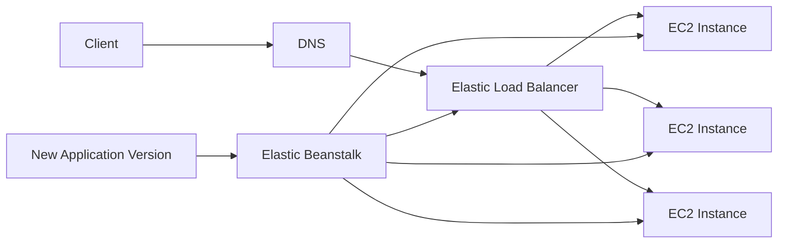
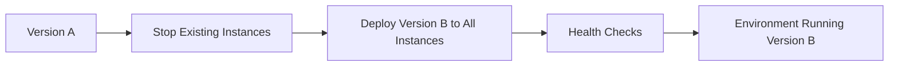
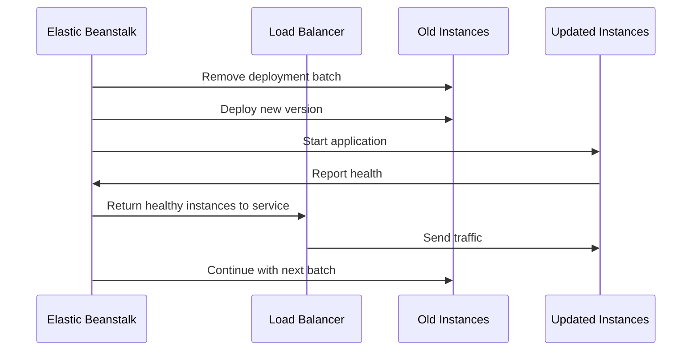
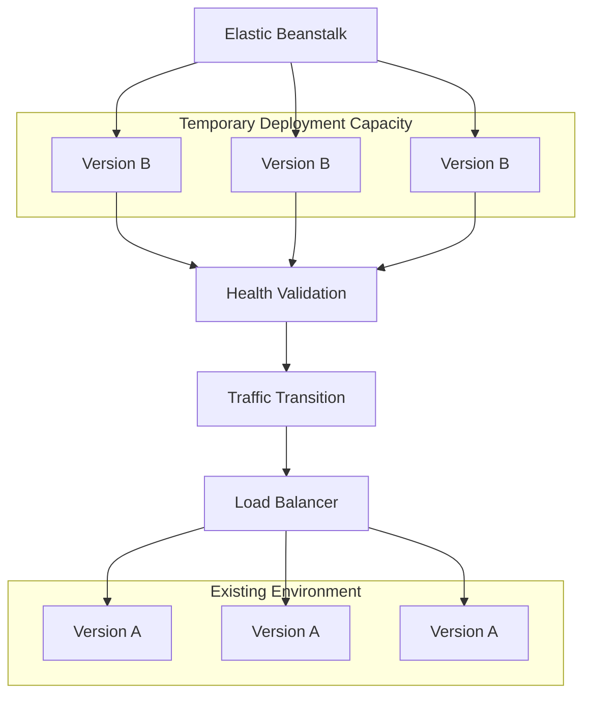
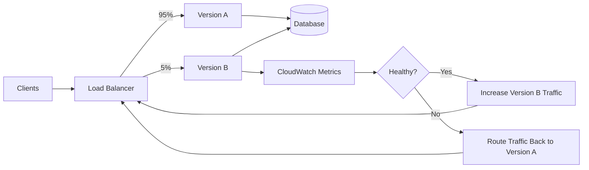
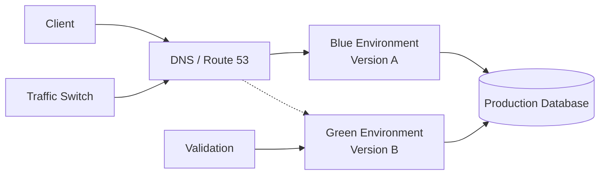
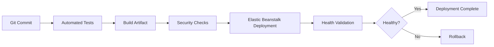

# 01- Deployment Strategies

## Overview

Elastic Beanstalk deployment strategy determines how application versions are introduced into running environments and how much production risk is exposed during a release.

The important distinction is between **deploying a new application version into an existing environment** and **creating or switching to a separate environment**. Elastic Beanstalk supports multiple deployment policies, including rolling, rolling with additional batch, immutable, traffic splitting, and all-at-once deployments.

For production backend systems, deployment strategy should be selected based on:

- Application startup time
- Instance count
- Deployment duration
- Health-check behavior
- Backward compatibility
- Database migration requirements
- Acceptable downtime
- Rollback requirements
- Infrastructure cost
- Blast radius

A deployment strategy is therefore a reliability decision, not merely a deployment configuration.

## Deployment Architecture

A typical Elastic Beanstalk application receives traffic through a load balancer and distributes requests across EC2 instances.



During deployment, Elastic Beanstalk changes the application version running on some or all instances according to the selected deployment policy.

The critical operational question is:

> **How many healthy instances remain available while the new version is being introduced?**

## Deployment Policies

| Strategy | Downtime | Capacity During Deployment | Deployment Risk | Rollback Speed | Cost |
|---|---:|---:|---|---|---|
| All at once | Possible | Reduced | High | Fast | Low |
| Rolling | Usually none | Reduced | Medium | Medium | Low |
| Rolling with additional batch | Usually none | Preserved | Medium-Low | Medium | Medium |
| Immutable | Usually none | Preserved | Low | Fast | High |
| Traffic splitting | Usually none | Preserved | Very Low | Very Fast | High |
| Blue/Green | Usually none | Preserved | Very Low | Very Fast | High |

The exact behavior depends on environment topology, load balancer configuration, health checks, and deployment settings.

## All-at-Once Deployment

### What It Is

All-at-once deployment updates every instance in the environment to the new application version at approximately the same time.

The existing application version is stopped or replaced across the environment before the new version becomes available.

### How It Works



### Advantages

- Fastest deployment method
- Minimal deployment orchestration
- Lowest infrastructure cost
- Useful for development and disposable environments

### Limitations

- Can cause downtime
- Large blast radius
- No meaningful instance-level fallback
- Failed deployments can affect the entire environment

### Production Considerations

Avoid all-at-once deployments for critical production APIs unless downtime and full-environment impact are explicitly acceptable.

It can be appropriate for:

- Development
- Temporary environments
- Low-criticality internal applications
- Applications where downtime is explicitly tolerated

## Rolling Deployment

### What It Is

Rolling deployment updates instances in batches rather than replacing the entire environment simultaneously.

For example, with four instances and a batch size of two:

```text
Before:

Instance 1 -> Version A
Instance 2 -> Version A
Instance 3 -> Version A
Instance 4 -> Version A

Batch 1:

Instance 1 -> Version B
Instance 2 -> Version B

Batch 2:

Instance 3 -> Version B
Instance 4 -> Version B
```

### Request Flow



### Advantages

- Reduces deployment blast radius
- Usually maintains application availability
- Requires fewer additional resources than immutable deployments
- Suitable for environments where deployment cost matters

### Limitations

During a rolling deployment, available capacity can temporarily decrease.

For example, an application running four instances might temporarily operate with only two active instances during part of the deployment.

That can create problems when:

- Existing instances are already highly utilized
- Traffic is unpredictable
- Requests are CPU-intensive
- Memory utilization is high
- Auto Scaling cannot react quickly enough

### Production Recommendation

Maintain sufficient spare capacity before starting a rolling deployment.

A production environment operating at 80–90% sustained utilization should not assume that a rolling deployment will remain safe simply because the load balancer remains available.

## Rolling with Additional Batch

### What It Is

Rolling with additional batch launches additional capacity so that the environment does not have to sacrifice existing serving capacity while the deployment proceeds.

Conceptually:

```text
Existing capacity:
    A A A A

Additional deployment capacity:
    B B

Deployment progresses:
    A A A A
    B B

After validation:
    B B B B
```

### Advantages

- Preserves existing serving capacity
- Reduces performance degradation during deployment
- Lower risk than standard rolling deployments
- Does not require maintaining a completely separate environment

### Limitations

- Temporarily increases infrastructure cost
- Deployment still occurs inside the same environment
- Does not provide the same isolation as immutable or blue/green deployment

### When to Use

This is useful when:

- The application requires high availability
- Instance utilization is normally high
- A separate blue/green environment is unnecessary
- Temporary additional capacity is acceptable

## Immutable Deployment

### What It Is

An immutable deployment launches a completely new set of EC2 instances with the new application version.

The existing instances remain untouched while the new instances are created and validated.

Conceptually:



### Why It Is Safer

The existing instances remain available while the new version is initialized.

If the new version fails to start, the original instances have not been modified.

This provides stronger deployment isolation than a normal rolling deployment.

### Advantages

- Stronger isolation
- Lower deployment blast radius
- Existing instances remain available
- Failed application startup is less disruptive
- Good fit for production workloads

### Limitations

- Temporarily requires additional EC2 capacity
- Deployment takes longer
- More expensive than rolling deployment
- Database compatibility still has to be handled separately

### Production Recommendation

Immutable deployments are a strong default when deployment safety is more important than minimizing temporary infrastructure cost.

## Traffic Splitting

### What It Is

Traffic splitting deploys the new version to a separate set of instances and gradually sends a configured percentage of production traffic to it.

For example:

```text
Version A: 95% traffic
Version B:  5% traffic

        ↓

Version A: 50% traffic
Version B: 50% traffic

        ↓

Version A:  0% traffic
Version B: 100% traffic
```

### Canary Architecture



### Advantages

- Very small initial blast radius
- Real production traffic validates the new version
- Fast rollback
- Excellent for high-risk releases

### Limitations

- Requires careful monitoring
- Additional capacity is required
- Database/schema compatibility becomes critical
- Application metrics must distinguish old and new versions

### Production Use

Traffic splitting is particularly valuable for:

- High-traffic APIs
- High-risk code changes
- Major dependency upgrades
- Performance-sensitive services
- Releases requiring real production validation

## Blue/Green Deployment

### What It Is

Blue/green deployment uses separate Elastic Beanstalk environments.

```text
Blue  -> Current production version
Green -> New application version
```

Traffic is directed to the active environment.



Once the green environment has been validated, traffic can be switched from blue to green.

### Advantages

- Strong environment isolation
- Very fast rollback
- Independent validation
- Minimal production downtime
- Useful for major infrastructure or application changes

### Limitations

- Requires two environments
- Higher infrastructure cost
- Configuration drift can occur
- Database migrations remain a shared dependency if both environments use the same database

### Production Recommendation

Blue/green is one of the strongest choices for applications where deployment rollback must be fast and predictable.

## Comparing Rolling, Immutable, and Blue/Green

| Characteristic | Rolling | Immutable | Blue/Green |
|---|---|---|---|
| Separate environment | No | No | Yes |
| Existing instances modified | Yes | No | No |
| Additional capacity | Optional | Required during deployment | Required |
| Rollback isolation | Moderate | Strong | Strong |
| Cost | Lower | Higher | Highest |
| Operational complexity | Lower | Medium | Higher |
| Suitable for critical production | Yes, with safeguards | Yes | Yes |
| Fast environment-level rollback | No | Limited | Yes |

## Database Migration Considerations

Deployment strategy does not solve database compatibility problems.

Consider a Django or FastAPI application changing:

```text
Version A
    application code
        ↓
    database schema A

Version B
    application code
        ↓
    database schema B
```

During rolling, immutable, or traffic-splitting deployments, both versions can temporarily exist.

Therefore, a migration that removes a column immediately can break the old version.

### Expand-and-Contract Pattern

Use backward-compatible migrations:


For example:

1. Add the new database column.
2. Deploy application code that can work with both schemas.
3. Backfill existing records.
4. Switch reads/writes to the new field.
5. Verify production behavior.
6. Remove the old field in a later deployment.

This pattern is particularly important for rolling and canary deployments.

## Application Startup Considerations

Elastic Beanstalk must be able to start the new application version successfully before it can become healthy.

Common startup dependencies include:

- Python package installation
- Environment variables
- Database connectivity
- Redis connectivity
- Static-file collection
- Django migrations
- Uvicorn/Gunicorn configuration
- Application import paths
- OS-level dependencies

A deployment can therefore fail even when the application code itself is syntactically valid.

For Python applications, verify startup independently in CI/CD before deploying:

```bash
python -m compileall .
python manage.py check --deploy
```

For FastAPI applications, validate application imports and the production server command before deployment.

## Health Checks During Deployment

Health checks are a critical part of deployment safety.

A deployment should not be considered successful merely because EC2 instances are running.

The application should also be able to:

- Start successfully
- Accept connections
- Respond to the configured health endpoint
- Reach required dependencies
- Process representative requests

A lightweight health endpoint is preferable to an endpoint that performs expensive database or downstream operations.

Example:

```python
from fastapi import FastAPI

app = FastAPI()


@app.get("/health")
async def health() -> dict[str, str]:
    return {"status": "ok"}
```

For deeper dependency validation, use a separate readiness or dependency health mechanism rather than making every load-balancer health check expensive.

## Deployment Configuration

Elastic Beanstalk deployment configuration can be managed through the EB CLI, console, or configuration files.

Example:

```bash
eb deploy
```

Check environment status before and after deployment:

```bash
eb status
```

View recent environment events:

```bash
eb events
```

Retrieve environment logs when investigating deployment failures:

```bash
eb logs
```

A production CI/CD pipeline should also record:

- Git commit SHA
- Application version
- Elastic Beanstalk environment
- Deployment timestamp
- Deployment strategy
- Deployment result
- Health status

## CI/CD Integration

A production pipeline should separate validation from deployment.



For example:

```yaml
name: Deploy

on:
  push:
    branches:
      - main

jobs:
  deploy:
    runs-on: ubuntu-latest

    steps:
      - uses: actions/checkout@v4

      - name: Run tests
        run: |
          python -m pytest

      - name: Deploy
        run: eb deploy production
```

The exact authentication mechanism should use short-lived AWS credentials or GitHub Actions OIDC rather than long-lived access keys stored in the repository.

## Rollback Strategies

Rollback should be designed before deployment.

Common rollback options include:

| Strategy | Rollback Approach |
|---|---|
| All at once | Redeploy previous application version |
| Rolling | Deploy previous version |
| Immutable | Restore previous version |
| Traffic splitting | Route traffic back to previous version |
| Blue/Green | Switch traffic back to previous environment |

The fastest rollback is generally one that does not require rebuilding the application.

Store immutable application artifacts and identify them by commit SHA or release version.

## Deployment Failure Troubleshooting

When a deployment fails, investigate in this order:

1. Check Elastic Beanstalk environment health.
2. Inspect environment events.
3. Inspect application and platform logs.
4. Verify instance health.
5. Verify application startup.
6. Verify environment variables.
7. Verify security groups and network connectivity.
8. Verify dependency availability.
9. Check database migrations.
10. Compare the new version with the last known-good version.

Useful commands include:

```bash
eb status
eb events
eb health
eb logs
```

Avoid immediately redeploying the same failed version without identifying the failure mode.

## Production Deployment Checklist

### Before Deployment

- [ ] Tests pass in CI
- [ ] Application artifact is immutable and identifiable
- [ ] Environment configuration has been reviewed
- [ ] Database migration is backward compatible
- [ ] Health endpoint has been validated
- [ ] Dependencies are available
- [ ] Capacity is sufficient for the deployment strategy
- [ ] Rollback version is known
- [ ] Monitoring and alerting are active

### During Deployment

- [ ] Monitor environment health
- [ ] Monitor HTTP 4xx/5xx rates
- [ ] Monitor latency
- [ ] Monitor CPU and memory
- [ ] Monitor database connections
- [ ] Monitor application logs
- [ ] Watch deployment events

### After Deployment

- [ ] Verify application health
- [ ] Verify representative API requests
- [ ] Check error rates
- [ ] Check latency
- [ ] Check background workers if applicable
- [ ] Verify database operations
- [ ] Confirm expected application version
- [ ] Keep the previous version available for rollback

## Common Mistakes

### Choosing All-at-Once for Critical Production Systems

The deployment is fast, but the entire environment can be affected simultaneously.

**Better approach:** Use immutable, traffic splitting, or blue/green deployment when availability and rollback safety are important.

### Ignoring Reduced Capacity During Rolling Deployments

Removing instances from service reduces available capacity.

**Better approach:** Calculate deployment-time capacity and maintain sufficient headroom.

### Running Destructive Database Migrations During Deployment

Dropping columns or changing incompatible types can break the previous application version.

**Better approach:** Use expand-and-contract migrations.

### Treating EC2 Health as Application Health

An EC2 instance can be running while the application is returning HTTP 500 responses.

**Better approach:** Use meaningful application health checks and monitor application-level metrics.

### Deploying Without a Known Rollback Version

A failed deployment becomes more difficult to recover when the previous version is not clearly identifiable.

**Better approach:** Store release identifiers and retain known-good application versions.

### Performing Long Migrations During Instance Startup

Long migrations can cause instances to fail health checks or exceed deployment timeouts.

**Better approach:** Separate large data migrations from application startup and execute them as controlled operational jobs.

### Using Long-Lived AWS Credentials in CI/CD

Static AWS access keys increase credential exposure risk.

**Better approach:** Use GitHub Actions OIDC with an appropriately scoped IAM role.

## Security Considerations

Deployment systems have privileged access to production infrastructure and must be treated as part of the production security boundary.

Recommended practices include:

- Use least-privilege IAM roles.
- Prefer OIDC for CI/CD authentication.
- Do not commit AWS credentials.
- Do not store secrets directly in source control.
- Restrict deployment permissions by environment.
- Encrypt sensitive configuration.
- Audit deployment activity.
- Protect production branches.
- Require review for production deployments.
- Separate development and production AWS accounts where practical.

## Scalability Considerations

Deployment strategy interacts directly with capacity planning.

For an application with high traffic:

```text
Normal capacity:
8 instances

Rolling deployment:
Potentially fewer serving instances

Immutable deployment:
8 old + 8 new instances temporarily

Blue/Green:
8 blue + 8 green instances
```

Therefore, deployment cost and capacity requirements should be included in the architecture decision.

For latency-sensitive systems, monitor:

- Request latency
- CPU saturation
- Memory pressure
- Connection pool utilization
- Database connections
- Queue depth
- Load balancer request count

## Monitoring During Deployments

At minimum, monitor:

| Signal | Why It Matters |
|---|---|
| HTTP 5xx | Detect application failures |
| HTTP latency | Detect performance regressions |
| Instance health | Detect deployment failures |
| CPU | Detect capacity pressure |
| Memory | Detect memory regressions |
| Load balancer health | Detect serving failures |
| Database connections | Detect connection exhaustion |
| Application logs | Diagnose runtime failures |
| Deployment events | Understand Elastic Beanstalk state changes |

A successful deployment should be defined by **application behavior**, not merely by deployment command completion.

## Cost Considerations

Deployment strategies have different temporary infrastructure requirements.

- All-at-once minimizes deployment infrastructure cost.
- Rolling generally uses existing capacity.
- Rolling with additional batch temporarily increases capacity.
- Immutable temporarily duplicates instance capacity.
- Blue/green generally requires two complete environments.
- Traffic splitting requires additional deployment capacity.

For critical production workloads, temporary infrastructure cost is usually less important than preventing an outage, but the trade-off should be explicit.

## Interview Traps

**Q: Which deployment strategy provides the strongest isolation without creating a second permanent environment?**

An immutable deployment creates new instances for the new version while leaving the existing instances unchanged during deployment.

**Q: Why can rolling deployments reduce application capacity?**

Because Elastic Beanstalk removes batches of existing instances from service while updating them.

**Q: Why is blue/green rollback fast?**

Because traffic can be redirected to the previous environment rather than rebuilding or redeploying the previous application version.

**Q: Why are database migrations important when using rolling deployments?**

Because old and new application versions can coexist temporarily and both must be able to operate against the database schema.

**Q: Is a successful `eb deploy` enough to declare a deployment successful?**

No. Application health, error rates, latency, dependencies, and representative application behavior must also be validated.

## Key Takeaways

- Deployment strategy is a **reliability and risk-management decision**, not just a deployment-speed decision.
- Use rolling deployments when cost efficiency and moderate deployment safety are required.
- Use rolling with additional batch when preserving serving capacity during deployment is important.
- Use immutable deployments when stronger instance-level isolation is required without maintaining a second permanent environment.
- Use traffic splitting for controlled canary releases and progressive production validation.
- Use blue/green when fast environment-level rollback and strong isolation justify the additional infrastructure cost.
- Design database migrations for backward compatibility because multiple application versions can coexist during deployment.
- Health checks should validate application readiness, not merely EC2 instance availability.
- Keep immutable, identifiable application versions so rollback does not depend on rebuilding artifacts.
- Monitor application behavior throughout deployment and validate the system after the deployment completes.
- Production deployment safety comes from combining **controlled rollout, health validation, observability, backward-compatible changes, and a tested rollback path**.