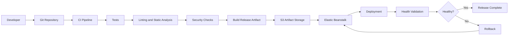
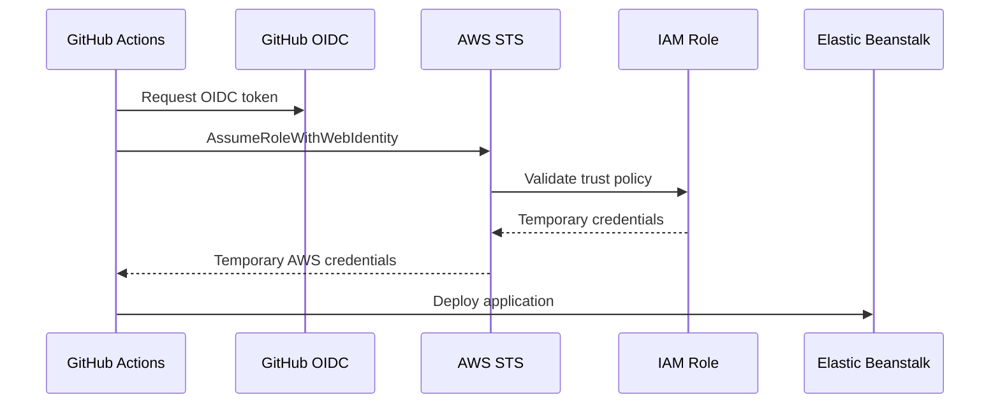
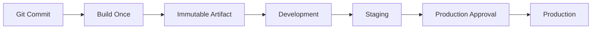
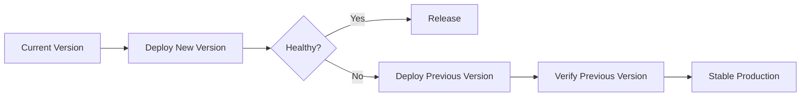

# 02- CI-CD

## Overview

CI/CD for Amazon Elastic Beanstalk should treat application delivery as a controlled production workflow rather than a simple `eb deploy` command.

A production pipeline should:

- Validate application code.
- Build a reproducible artifact.
- Run automated tests and security checks.
- Authenticate to AWS securely.
- Deploy a specific application version.
- Validate Elastic Beanstalk health.
- Verify application behavior.
- Stop or roll back failed releases.
- Preserve enough deployment metadata for auditing and recovery.

For Python applications such as Django and FastAPI, Elastic Beanstalk can handle much of the infrastructure lifecycle while the CI/CD system remains responsible for application validation, release orchestration, and deployment policy.

A useful mental model is:

```text
Git commit
    ↓
CI validation
    ↓
Build immutable artifact
    ↓
Security checks
    ↓
Publish artifact
    ↓
Create Elastic Beanstalk application version
    ↓
Deploy
    ↓
Health validation
    ↓
Application validation
    ↓
Release or rollback
```

## CI/CD Architecture

A typical GitHub Actions-based deployment pipeline can be structured as follows:



The pipeline should have clear boundaries between **validation**, **artifact creation**, **deployment**, and **post-deployment verification**.

## CI and CD Responsibilities

| Responsibility | CI | CD |
|---|---:|---:|
| Install dependencies | Yes | Sometimes |
| Run unit tests | Yes | No |
| Run integration tests | Yes | Optional |
| Lint/static analysis | Yes | No |
| Security scanning | Yes | Sometimes |
| Build artifact | Yes | No |
| Store release artifact | Yes | No |
| Deploy Elastic Beanstalk | No | Yes |
| Monitor deployment | No | Yes |
| Validate production health | No | Yes |
| Roll back release | No | Yes |

Keeping these responsibilities separate makes failures easier to diagnose.

## Source Control Strategy

A production deployment should originate from a known Git commit.

Avoid deploying arbitrary local working directories because the resulting release may be difficult to reproduce.

A useful release identifier is:

```text
production
    ↓
release
    ↓
git commit SHA
    ↓
Elastic Beanstalk application version
```

For example:

```text
backend-api-8f4a91c
```

The identifier should allow an engineer to answer:

> Which exact source revision is currently running in production?

## CI Pipeline

The CI pipeline should reject code before it reaches Elastic Beanstalk.

A Python backend pipeline commonly includes:

```text
Checkout
  ↓
Python setup
  ↓
Dependency installation
  ↓
Lint
  ↓
Static analysis
  ↓
Unit tests
  ↓
Integration tests
  ↓
Security scanning
  ↓
Build artifact
```

Example:

```yaml
name: CI

on:
  pull_request:
  push:
    branches:
      - main

jobs:
  test:
    runs-on: ubuntu-latest

    steps:
      - name: Checkout
        uses: actions/checkout@v4

      - name: Set up Python
        uses: actions/setup-python@v5
        with:
          python-version: "3.12"

      - name: Install dependencies
        run: |
          python -m pip install --upgrade pip
          pip install -r requirements.txt

      - name: Run tests
        run: |
          python -m pytest

      - name: Django deployment checks
        run: |
          python manage.py check --deploy
```

The exact commands should match the application's dependency and testing model.

## Building a Reproducible Artifact

A deployment artifact should be reproducible from source control.

For example:

```text
application/
├── app/
├── config/
├── manage.py
├── requirements.txt
├── Procfile
└── .ebextensions/
```

Avoid placing environment-specific secrets inside the artifact.

The same application artifact should be deployable to different environments with configuration supplied externally.

```text
Artifact
   +
Environment configuration
   +
AWS infrastructure
   =
Running application
```

This separation is fundamental to reliable CI/CD.

## Dependency Management

Pin production dependencies appropriately.

For example:

```text
Django==5.2.3
gunicorn==23.0.0
psycopg[binary]==3.2.9
```

Uncontrolled dependency resolution during deployment can introduce unexpected versions and make production incidents difficult to reproduce.

For larger systems, dependency locking should be incorporated into the project's package-management strategy.

## Elastic Beanstalk Application Versions

Elastic Beanstalk represents deployable application artifacts as application versions.

A useful release model is:

```text
Git SHA
   ↓
Build artifact
   ↓
S3
   ↓
Elastic Beanstalk Application Version
   ↓
Environment
```

This allows the same release to be identified and redeployed without rebuilding it.

Application versions should have meaningful identifiers rather than ambiguous names such as:

```text
latest.zip
new.zip
final.zip
final-final.zip
```

Prefer:

```text
backend-api-8f4a91c.zip
backend-api-2026-08-13-8f4a91c.zip
```

## GitHub Actions Authentication

CI/CD should not use long-lived AWS access keys when a short-lived identity mechanism is available.

For GitHub Actions, AWS IAM federation through OpenID Connect (OIDC) is the preferred architecture.



The GitHub repository or environment should be explicitly restricted in the IAM trust policy.

Avoid:

```text
AWS_ACCESS_KEY_ID
AWS_SECRET_ACCESS_KEY
```

as permanent credentials with broad production privileges.

## IAM Permissions

The deployment role should follow least privilege.

The exact permissions depend on the deployment architecture, but the role may need access to:

- Elastic Beanstalk
- S3 deployment artifacts
- CloudFormation
- EC2-related resources
- Auto Scaling
- Elastic Load Balancing
- CloudWatch
- IAM `PassRole` where required

Do not blindly grant:

```json
{
  "Effect": "Allow",
  "Action": "*",
  "Resource": "*"
}
```

A deployment role is a high-value production identity and should be tightly controlled.

## GitHub Actions Deployment

A simplified deployment workflow can look like:

```yaml
name: Deploy

on:
  push:
    branches:
      - main

permissions:
  contents: read
  id-token: write

jobs:
  deploy:
    runs-on: ubuntu-latest
    environment: production

    steps:
      - name: Checkout
        uses: actions/checkout@v4

      - name: Set up Python
        uses: actions/setup-python@v5
        with:
          python-version: "3.12"

      - name: Install dependencies
        run: |
          python -m pip install --upgrade pip
          pip install -r requirements.txt
          pip install pytest

      - name: Run tests
        run: |
          python -m pytest

      - name: Configure AWS credentials
        uses: aws-actions/configure-aws-credentials@v4
        with:
          role-to-assume: ${{ secrets.AWS_DEPLOY_ROLE_ARN }}
          aws-region: ap-south-1

      - name: Deploy
        run: |
          eb deploy production
```

In a mature pipeline, deployment should also explicitly identify the release version and perform post-deployment validation.

## Environment Separation

Do not treat Elastic Beanstalk environments as interchangeable.

A typical setup is:

```text
Development
    ↓
Staging
    ↓
Production
```

Each environment should have its own:

- Configuration
- Secrets
- Database
- IAM permissions
- Deployment controls
- Monitoring
- Scaling characteristics

Production deployment should normally require stronger controls than development deployment.

## Deployment Promotion

A strong CI/CD design promotes the same validated artifact between environments.



Avoid:

```text
Build for Development
Build again for Staging
Build again for Production
```

because different builds can theoretically contain different dependency resolution, generated files, or build-time behavior.

Prefer:

```text
Build once
    ↓
Promote same artifact
```

## Staging Validation

Staging should reproduce important production characteristics where practical.

Validate:

- Application startup
- HTTP endpoints
- Database connectivity
- Authentication
- External service integration
- Background workers
- Redis connectivity
- Celery integration
- Static assets
- Environment configuration
- Database migrations

For a Django application:

```bash
python manage.py check --deploy
python manage.py migrate --plan
python -m pytest
```

Do not blindly execute destructive production migrations as part of every application startup.

## Deployment Strategies

CI/CD should work together with the Elastic Beanstalk deployment strategy.

| Deployment Strategy | CI/CD Use Case |
|---|---|
| All at once | Development or low-risk workloads |
| Rolling | Cost-sensitive production deployments |
| Rolling with additional batch | Production with capacity requirements |
| Immutable | Safer production releases |
| Traffic splitting | Canary/progressive delivery |
| Blue/Green | Strong isolation and fast rollback |

The CI/CD pipeline should know which strategy is being used and apply appropriate validation.

## Health Validation

A successful deployment command does not necessarily mean the application is healthy.

The pipeline should verify:

```text
Deployment initiated
       ↓
Environment stable
       ↓
Instances healthy
       ↓
Load balancer healthy
       ↓
Application endpoint healthy
       ↓
Error rate acceptable
       ↓
Latency acceptable
       ↓
Release approved
```

Example validation:

```bash
eb status
eb health
eb events
```

For API applications, perform a representative HTTP request after deployment.

Example:

```bash
curl --fail --silent --show-error \
  https://api.example.com/health
```

For stronger validation, test a small set of critical read-only endpoints.

## Smoke Tests

Smoke tests should be fast and focused on detecting catastrophic deployment failures.

Example:

```python
import requests


def test_production_health() -> None:
    response = requests.get(
        "https://api.example.com/health",
        timeout=10,
    )

    response.raise_for_status()
    assert response.json()["status"] == "ok"
```

Production smoke tests should avoid destructive operations.

Do not create or delete customer data simply to validate that deployment succeeded.

## Database Migration Strategy

Database migrations are one of the highest-risk parts of automated deployment.

Consider:

```text
Version A
    ↓
Database Schema A

Version B
    ↓
Database Schema B
```

During a rolling or traffic-splitting deployment, Version A and Version B can coexist.

Therefore, migrations should normally follow an expand-and-contract pattern:


Avoid deployment sequences such as:

```text
Drop old column
    ↓
Deploy application that still expects old column
```

Instead:

```text
Add new column
    ↓
Deploy compatible application
    ↓
Migrate/backfill data
    ↓
Switch application behavior
    ↓
Remove old column later
```

## Secrets and Configuration

CI/CD should not embed secrets in:

- Git repositories
- Docker images
- ZIP artifacts
- GitHub workflow files
- Application source code

Configuration should be injected through environment-specific mechanisms.

For example:

```text
DJANGO_SETTINGS_MODULE
DATABASE_URL
REDIS_URL
SECRET_KEY
```

The values should come from appropriate secret/configuration management systems rather than source control.

A deployment artifact should contain application code, not production credentials.

## Environment Variables in CI/CD

Separate CI variables from application runtime configuration.

For example:

```text
CI/CD
├── AWS deployment identity
├── artifact configuration
└── deployment metadata

Elastic Beanstalk
├── DATABASE_URL
├── REDIS_URL
├── SECRET_KEY
└── application configuration
```

Do not assume that a secret available to GitHub Actions automatically becomes available to the Elastic Beanstalk application.

They are separate execution environments.

## Rollback

Rollback should be an explicit pipeline capability.

A good release pipeline knows:

- Current production version
- Previous known-good version
- Deployment identifier
- Git commit SHA
- Artifact location
- Deployment timestamp

Conceptually:



Avoid rebuilding the previous version during an incident if an immutable artifact already exists.

## Manual Approval

Production deployment should often require an explicit approval boundary.

```yaml
jobs:
  deploy-production:
    environment:
      name: production
```

Configure the production environment in GitHub with appropriate protection rules.

The goal is not to make deployment manual everywhere. The goal is to create an intentional control point around high-impact production changes.

## Branching Strategy

CI/CD should reflect the team's Git workflow.

A simple model is:

```text
feature/*
    ↓
pull request
    ↓
main
    ↓
staging
    ↓
production
```

Avoid creating unnecessarily complex branching models solely for deployment.

The important properties are:

- Every production deployment maps to a commit.
- Changes are reviewed before production.
- CI runs before merge.
- Production deployments are controlled.
- Rollback is possible.

## Artifact Versioning

A release should have a unique version.

For example:

```text
2026.08.13.1
```

or:

```text
backend-api-8f4a91c
```

A strong identifier should allow engineers to correlate:

```text
Git commit
    ↕
CI run
    ↕
Artifact
    ↕
Elastic Beanstalk application version
    ↕
Production deployment
```

This correlation is extremely valuable during incident response.

## Deployment Metadata

Record deployment metadata such as:

| Metadata | Purpose |
|---|---|
| Commit SHA | Source identification |
| Release version | Human-readable release |
| CI run ID | Pipeline traceability |
| Environment | Deployment target |
| Deployment time | Incident correlation |
| Deployment strategy | Operational context |
| Actor | Auditability |
| Result | Release status |

When an incident starts shortly after a deployment, this metadata can dramatically reduce investigation time.

## Monitoring and Observability

The CD pipeline should monitor both infrastructure and application behavior.

Important signals include:

- HTTP 5xx rate
- HTTP 4xx rate
- Request latency
- Instance health
- CPU utilization
- Memory utilization
- Load balancer health
- Database connection count
- Redis availability
- Celery queue depth
- Application exceptions

For a high-traffic backend, deployment validation should look for **regressions**, not just binary success/failure.

For example:

```text
Before deployment:
p95 latency = 180 ms

After deployment:
p95 latency = 650 ms
```

The environment may technically be healthy, but the release should still be considered problematic.

## Deployment Gates

A mature pipeline can implement gates such as:

```text
Tests pass
   ↓
Security checks pass
   ↓
Artifact generated
   ↓
Staging deployment
   ↓
Smoke tests pass
   ↓
Production approval
   ↓
Production deployment
   ↓
Health checks pass
   ↓
Error rate within threshold
   ↓
Latency within threshold
   ↓
Release complete
```

Deployment gates should be based on measurable conditions rather than subjective assumptions.

## Handling Failed Deployments

When deployment fails:

1. Stop treating the release as successful.
2. Inspect Elastic Beanstalk events.
3. Inspect environment health.
4. Inspect application/platform logs.
5. Verify configuration.
6. Verify dependencies.
7. Verify database migrations.
8. Compare with the previous release.
9. Roll back if production impact requires it.
10. Preserve deployment evidence for root-cause analysis.

Useful commands include:

```bash
eb status
eb health
eb events
eb logs
```

Do not repeatedly redeploy the same broken artifact without changing the underlying failure condition.

## CI/CD Security

Production deployment pipelines are part of the production security boundary.

Recommended controls:

- Use GitHub OIDC instead of long-lived AWS credentials.
- Scope IAM permissions to required resources.
- Restrict production deployment environments.
- Require pull-request review.
- Protect the production branch.
- Keep secrets out of artifacts.
- Rotate credentials where credentials are unavoidable.
- Audit deployment activity.
- Scan dependencies for known vulnerabilities.
- Restrict who can modify deployment workflows.
- Protect GitHub Actions environments and secrets.

A compromised CI pipeline can be equivalent to a compromised production administrator account.

## Reliability Considerations

A deployment pipeline should optimize for controlled failure.

Important properties include:

- Idempotent deployment steps
- Immutable artifacts
- Deterministic builds
- Explicit release identifiers
- Automated health checks
- Automated smoke tests
- Fast rollback
- Deployment auditability
- Backward-compatible migrations

The pipeline should make the safe path easier than the unsafe path.

## Cost Considerations

CI/CD costs include more than GitHub Actions execution time.

Consider:

- Elastic Beanstalk deployment capacity
- Immutable deployment instances
- Blue/green environments
- S3 artifact storage
- CloudWatch logging
- Test infrastructure
- Temporary staging environments
- Database resources used by CI
- Network transfer

For example, maintaining a permanent staging environment may cost more than creating an ephemeral environment for selected validation workflows, depending on the workload.

Cost optimization should never remove the validation required to protect production.

## Common Mistakes

### Deploying Directly From a Developer Laptop

This makes the release difficult to reproduce and audit.

**Better approach:** Build and deploy from a controlled CI/CD pipeline.

### Using Long-Lived AWS Access Keys

Static credentials can be leaked through logs, repository settings, or compromised runners.

**Better approach:** Use GitHub OIDC and short-lived AWS credentials.

### Building Different Artifacts for Each Environment

Different builds can introduce subtle differences between staging and production.

**Better approach:** Build once and promote the same artifact.

### Treating Deployment Success as Application Success

The deployment command can succeed while the application returns errors.

**Better approach:** Add health checks, smoke tests, and application-level monitoring.

### Running Destructive Migrations Automatically

A migration can irreversibly damage production data or break older application versions.

**Better approach:** Design backward-compatible migrations and separate high-risk data operations.

### Storing Secrets in the Repository

Repository access becomes equivalent to secret access.

**Better approach:** Use appropriate AWS or CI/CD secret-management mechanisms.

### No Rollback Plan

A pipeline that only supports forward deployment is incomplete.

**Better approach:** Keep known-good artifacts and make rollback executable.

### Excessive Pipeline Complexity

Overly complicated pipelines become difficult to maintain and debug.

**Better approach:** Keep the pipeline stages explicit:

```text
Validate
→ Build
→ Deploy
→ Verify
→ Release or Rollback
```

## Production Checklist

### CI

- [ ] Tests run automatically
- [ ] Dependencies are controlled
- [ ] Static analysis is executed
- [ ] Security checks are executed
- [ ] Artifact is reproducible
- [ ] Release identifier is generated

### Authentication

- [ ] GitHub OIDC is configured
- [ ] IAM role follows least privilege
- [ ] Production deployment permissions are restricted
- [ ] No long-lived AWS credentials are committed

### CD

- [ ] Environment is explicitly selected
- [ ] Deployment strategy is intentional
- [ ] Artifact version is identifiable
- [ ] Database migration is backward compatible
- [ ] Deployment events are captured

### Validation

- [ ] Elastic Beanstalk health is verified
- [ ] Application health endpoint is verified
- [ ] Smoke tests pass
- [ ] Error rate is acceptable
- [ ] Latency is acceptable
- [ ] Critical dependencies are healthy

### Recovery

- [ ] Previous known-good version is identified
- [ ] Rollback procedure is documented
- [ ] Artifacts are retained
- [ ] Deployment metadata is available
- [ ] Production approval controls are configured

## Interview Traps

**Q: Why should CI and CD be separated conceptually?**

CI validates and produces a deployable artifact. CD promotes and deploys that artifact into an environment and validates the resulting system.

**Q: Why is build-once-promote-many preferable to rebuilding for production?**

It ensures that the artifact tested in earlier environments is the artifact deployed to production.

**Q: Why use OIDC with GitHub Actions?**

OIDC allows GitHub Actions to obtain short-lived AWS credentials through an IAM trust relationship instead of storing long-lived AWS access keys.

**Q: Why isn't a successful Elastic Beanstalk deployment enough?**

Deployment completion does not guarantee that the application is serving correct responses, meeting latency requirements, or functioning correctly with its dependencies.

**Q: What makes a rollback reliable?**

A known-good immutable artifact, a clear release identifier, an executable rollback procedure, and sufficient observability to verify recovery.

**Q: Why can database migrations break rolling deployments?**

Because old and new application versions may execute concurrently against the same database.

## Key Takeaways

- CI/CD should produce **reproducible, identifiable, immutable releases**.
- CI validates code and produces artifacts; CD deploys and validates those artifacts.
- Build once and promote the same artifact across environments.
- Use GitHub Actions OIDC and short-lived AWS credentials instead of long-lived deployment keys.
- Keep IAM permissions narrowly scoped.
- Separate application artifacts from environment-specific configuration and secrets.
- Treat database migrations as part of deployment design, especially when multiple application versions can coexist.
- Deployment success must be validated through health checks, smoke tests, metrics, and application behavior.
- Every production deployment should have a known rollback path.
- Deployment metadata should connect the Git commit, CI run, artifact, Elastic Beanstalk version, and production environment.
- A production-grade pipeline is not merely an automation script; it is a **controlled release system designed to make deployment safe, observable, reproducible, and reversible**.