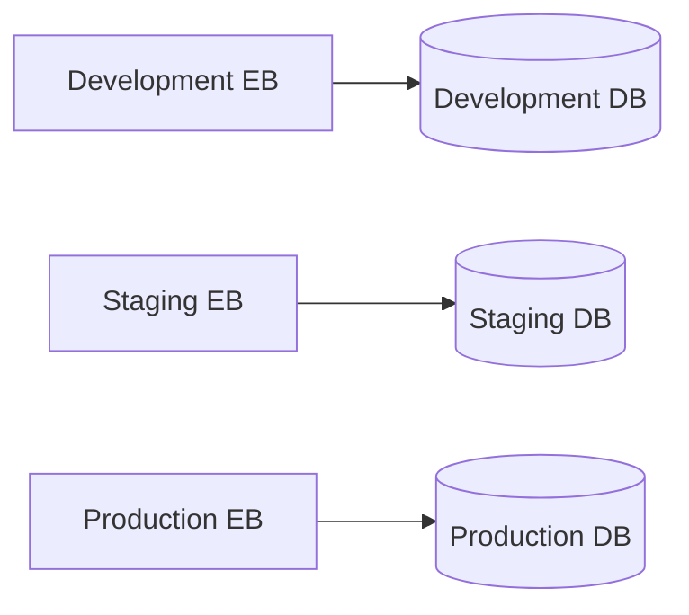
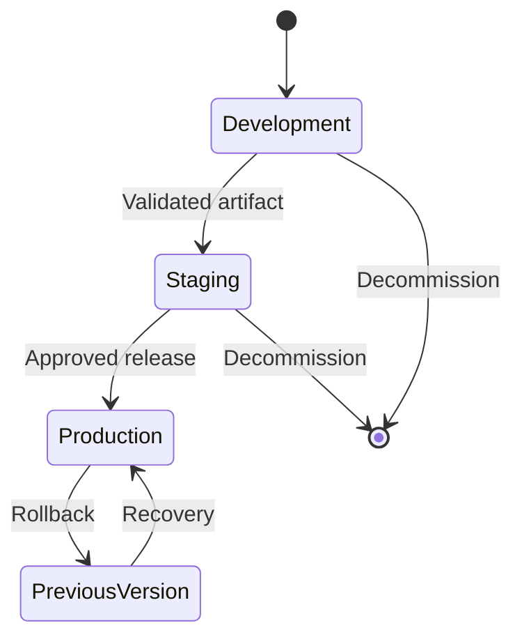
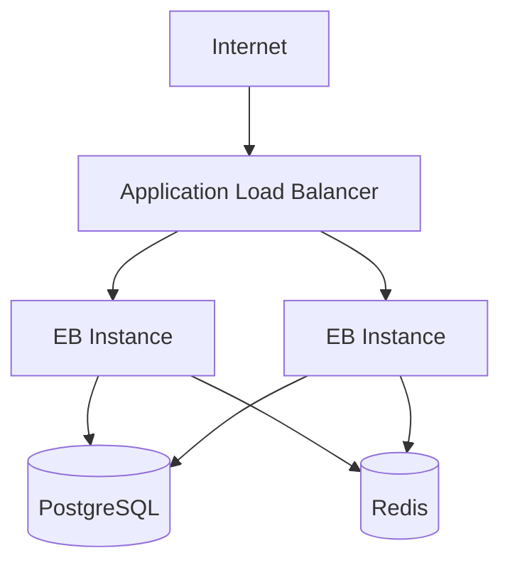

# 03- Environment Management

## Overview

Amazon Elastic Beanstalk environments represent the runtime boundaries in which an application version is deployed. Effective environment management is primarily about controlling configuration, isolation, scaling, deployment behavior, and operational ownership across environments.

A production backend should avoid treating environments as manually configured servers. Environment configuration should be reproducible, version-controlled where appropriate, and separated from application artifacts.

A typical lifecycle is:

```text
Development
    ↓
Staging
    ↓
Production
```

Each environment may use the same application artifact while having different:

- Runtime configuration
- Secrets
- Database endpoints
- Redis endpoints
- Scaling limits
- Instance sizes
- Monitoring configuration
- Deployment policies
- IAM permissions
- Network configuration

The goal is to make the application portable while keeping environment-specific behavior explicit.

## Elastic Beanstalk Environment Model

An Elastic Beanstalk environment is the operational unit where an application version runs.

Conceptually:

```text
Elastic Beanstalk Application
│
├── Development Environment
│   └── Application Version
│
├── Staging Environment
│   └── Application Version
│
└── Production Environment
    └── Application Version
```

The application is the logical container for versions and environments, while the environment represents the deployed runtime.

This distinction matters because an application version can be deployed to different environments without rebuilding the application.

## Environment Isolation

Production should be isolated from lower environments.

| Concern | Development | Staging | Production |
|---|---|---|---|
| Database | Dedicated | Dedicated | Dedicated |
| Redis | Dedicated/shared | Dedicated | Dedicated |
| Secrets | Development | Staging | Production |
| IAM permissions | Limited | Controlled | Strict |
| Scaling | Small | Production-like | Production-sized |
| Deployment approval | Usually automatic | Controlled | Explicit |
| Monitoring | Basic | Detailed | Comprehensive |
| Data | Synthetic/test | Sanitized/test | Production |
| Availability requirements | Low | Medium | High |

Never use a production database from development simply because it is convenient.

Environment isolation reduces the blast radius of configuration mistakes, credentials exposure, accidental writes, and destructive testing.

## Configuration Management

Elastic Beanstalk applications typically require configuration such as:

```text
DATABASE_URL
REDIS_URL
SECRET_KEY
DJANGO_SETTINGS_MODULE
LOG_LEVEL
ALLOWED_HOSTS
```

These values should be provided through environment-specific configuration rather than hard-coded into application source code.

For example:

```text
Development
DATABASE_URL=postgresql://dev-db/...

Staging
DATABASE_URL=postgresql://staging-db/...

Production
DATABASE_URL=postgresql://production-db/...
```

The application code remains unchanged while the runtime configuration changes.

## Configuration Hierarchy

Separate configuration into logical categories.

### Application Configuration

Values that control application behavior:

```text
DEBUG=false
LOG_LEVEL=INFO
WORKER_COUNT=4
```

### Infrastructure Configuration

Values that identify infrastructure:

```text
DATABASE_HOST
REDIS_HOST
AWS_REGION
```

### Secrets

Sensitive values:

```text
SECRET_KEY
DATABASE_PASSWORD
API_TOKEN
```

Secrets should be managed using appropriate secret-management mechanisms rather than committed to Git.

## Environment Variables

Environment variables provide a convenient runtime configuration boundary.

A Django application can read configuration using a settings layer:

```python
import os

DEBUG = os.getenv("DEBUG", "false").lower() == "true"
SECRET_KEY = os.environ["SECRET_KEY"]
DATABASE_URL = os.environ["DATABASE_URL"]
```

For production applications, use a configuration library or structured settings layer when configuration becomes more complex.

The important design principle is:

```text
Application code
      +
Runtime configuration
      ↓
Environment-specific behavior
```

## Avoid Configuration Drift

Configuration drift occurs when environments gradually become different because engineers manually change settings.

For example:

```text
Staging:
  Python 3.12
  Gunicorn 8 workers

Production:
  Python 3.12
  Gunicorn 12 workers

But nobody knows why.
```

Manual changes create hidden dependencies and make incident investigation difficult.

Prefer configuration-as-code and reproducible deployment configuration.

Useful sources include:

- Elastic Beanstalk configuration files
- `.ebextensions`
- `.platform`
- Infrastructure-as-code
- CI/CD configuration
- Version-controlled application configuration

## `.ebextensions`

Elastic Beanstalk supports `.ebextensions` configuration files for environment customization.

Example:

```yaml
option_settings:
  aws:elasticbeanstalk:application:environment:
    LOG_LEVEL: INFO
    DJANGO_SETTINGS_MODULE: config.settings.production
```

These files can be version-controlled alongside the application.

Do not use `.ebextensions` as a dumping ground for arbitrary infrastructure configuration. Keep configuration focused, documented, and deterministic.

## Platform Hooks

For more advanced deployment-time behavior, Elastic Beanstalk platform hooks can execute scripts during application deployment.

A typical structure may include:

```text
.platform/
└── hooks/
    └── postdeploy/
        └── 01-verify.sh
```

Example:

```bash
#!/bin/bash
set -euo pipefail

python manage.py check --deploy
```

Hooks are useful for controlled deployment-time operations, but they should remain:

- Idempotent
- Fast
- Observable
- Failure-aware
- Safe to execute during deployment

Do not place long-running background processes inside deployment hooks.

## Environment-Specific Django Configuration

A Django application may separate settings into environments:

```text
config/
├── settings/
│   ├── base.py
│   ├── development.py
│   ├── staging.py
│   └── production.py
```

For example:

```python
# production.py

from .base import *

DEBUG = False

ALLOWED_HOSTS = [
    "api.example.com",
]
```

Environment-specific settings should contain only genuine environment differences.

Avoid duplicating large portions of the application's configuration because duplicated settings eventually drift.

## FastAPI Configuration

FastAPI applications can use environment-driven configuration.

```python
from pydantic_settings import BaseSettings, SettingsConfigDict


class Settings(BaseSettings):
    app_name: str = "backend-api"
    environment: str
    database_url: str
    redis_url: str

    model_config = SettingsConfigDict(
        env_file=".env",
        extra="ignore",
    )


settings = Settings()
```

In production, the runtime environment should provide the actual values rather than relying on a local `.env` file.

## Environment Variables vs Secrets

Not every environment variable is a secret.

| Configuration | Secret? | Example |
|---|---:|---|
| `LOG_LEVEL` | No | `INFO` |
| `AWS_REGION` | No | `ap-south-1` |
| `DATABASE_HOST` | Usually no | `db.internal` |
| `SECRET_KEY` | Yes | Sensitive value |
| Database password | Yes | Sensitive value |
| API token | Yes | Sensitive value |

Treating every configuration value as a secret can make operations unnecessarily complicated, while treating secrets as ordinary configuration creates security risks.

## Database Isolation

Each environment should normally have its own database boundary.



This prevents development activity from accidentally modifying production data.

Production database access should also be restricted through:

- Security groups
- Network boundaries
- IAM/database authentication where applicable
- Application credentials
- Least-privilege database users

A backend application should not connect to PostgreSQL using an administrative database account.

## Redis Isolation

The same principle applies to Redis.

```text
Development → Redis Development
Staging     → Redis Staging
Production  → Redis Production
```

Sharing Redis between environments can cause:

- Cache collisions
- Session collisions
- Queue contamination
- Test data leaking into production
- Accidental key deletion

If shared infrastructure is unavoidable, use strong logical isolation and explicit namespaces, but dedicated production infrastructure is generally safer.

## Environment Naming

Environment names should be predictable.

Examples:

```text
backend-dev
backend-staging
backend-production
```

Avoid names such as:

```text
backend-new
backend-final
backend-test2
backend-temp
```

A predictable naming convention improves:

- CLI operations
- Monitoring
- Incident response
- IAM policies
- Automation
- Documentation

## Environment Lifecycle

A mature environment lifecycle can look like:



Environments should have clear ownership and a defined purpose.

Temporary environments should also have an explicit cleanup policy.

## Creating and Inspecting Environments

The Elastic Beanstalk CLI can be used to inspect environments.

```bash
eb list
```

Check environment status:

```bash
eb status
```

Inspect environment health:

```bash
eb health
```

Inspect recent environment events:

```bash
eb events
```

These commands are useful during deployment and incident investigation.

## Environment Configuration Inspection

Before changing an environment, inspect its current configuration.

```bash
eb printenv
```

This helps answer questions such as:

- Which environment variables are configured?
- Is the expected runtime configuration present?
- Does production differ from staging?
- Was a configuration change actually applied?

Be careful when displaying environment variables in shared terminals, logs, CI output, or screen recordings because sensitive values may be exposed.

## Configuration Changes

A configuration change should be treated similarly to a code change when it affects production behavior.

Examples include:

```text
DATABASE_URL
REDIS_URL
LOG_LEVEL
INSTANCE_TYPE
AUTOSCALING_LIMIT
HEALTH_CHECK_PATH
```

The change should have:

- A clear reason
- An identifiable owner
- An audit trail
- A rollback plan where applicable
- Post-change validation

Avoid making unexplained production changes directly from the CLI.

## Configuration as Code

Environment configuration should be reproducible.

For example:

```text
Repository
│
├── Application code
├── .ebextensions/
├── .platform/
├── CI/CD configuration
└── Infrastructure configuration
```

This allows a new engineer to understand how an environment is constructed without relying on undocumented console changes.

Not every value should be stored in Git. Secrets should remain in appropriate secret-management systems.

## Immutable Infrastructure Principles

Elastic Beanstalk environments should be treated as replaceable runtime infrastructure.

Avoid thinking:

```text
Production server
    ↓
SSH into server
    ↓
Modify files manually
    ↓
Leave server running
```

Prefer:

```text
Source
   ↓
Artifact
   ↓
Environment configuration
   ↓
Elastic Beanstalk deployment
   ↓
New runtime
```

This makes infrastructure changes reproducible and reduces configuration drift.

## SSH and Instance-Level Changes

SSH access can be useful for diagnosis, but it should not become the normal configuration mechanism.

Reasonable uses include:

- Investigating a failed deployment
- Inspecting runtime state
- Examining temporary diagnostic information
- Confirming a platform-level issue

Avoid using SSH to permanently install dependencies or modify application configuration.

If a change is required repeatedly, encode it into the deployment or infrastructure configuration.

## Scaling Configuration

Environment management also includes scaling policy.

Important settings include:

- Minimum instance count
- Maximum instance count
- Instance type
- Auto Scaling policy
- Health reporting
- Load balancer configuration

For example:

```text
Development
min = 1
max = 2

Staging
min = 2
max = 4

Production
min = 3
max = 20
```

The exact values depend on workload characteristics.

Production scaling should be based on measured traffic and resource utilization rather than arbitrary numbers.

## Environment Types and Deployment Risk

Different environments serve different purposes.

| Environment | Primary Purpose | Risk |
|---|---|---|
| Development | Fast iteration | Low |
| Test | Automated validation | Low |
| Staging | Production-like validation | Medium |
| Production | Customer traffic | High |

The closer an environment is to production, the more closely its:

- Runtime
- Networking
- Dependencies
- Deployment strategy
- Monitoring
- Scaling behavior

should resemble production.

## Staging Fidelity

Staging does not need to be identical to production in every dimension, but it should reproduce the failure modes that matter.

For example, if production uses:

```text
Django
Gunicorn
PostgreSQL
Redis
Celery
Nginx/load balancer
```

staging should use compatible versions and architecture.

A staging environment that runs SQLite while production uses PostgreSQL provides poor validation for database-dependent behavior.

## Environment Promotion

A strong promotion model is:

```text
Git commit
    ↓
CI
    ↓
Artifact
    ↓
Development
    ↓
Staging
    ↓
Production
```

The same artifact should be promoted rather than rebuilt.

This reduces the possibility that staging and production are running subtly different binaries or dependency sets.

## Production Environment Protection

Production environments should have stronger controls.

Recommended controls include:

- Restricted deployment permissions
- Protected Git branches
- Required code review
- CI checks
- Production approval
- Audit logging
- Limited console access
- Least-privilege IAM
- Strong monitoring
- Documented rollback procedures

The production environment should not be as easy to modify as a development environment.

## IAM and Environment Management

IAM policies should distinguish between environments where practical.

For example:

```text
Developer Role
    ↓
Development Environment

Release Role
    ↓
Staging + Production

ReadOnly Role
    ↓
Monitoring and Diagnosis
```

Avoid giving every engineer full administrator access merely because environment management is operationally convenient.

## Network Configuration

Elastic Beanstalk environments may run inside a VPC with configured subnets and security groups.

Production environments should normally use a deliberately designed network topology.

For example:



Database and cache infrastructure should not be exposed directly to the public internet.

Network configuration should remain consistent across environments where application behavior depends on it.

## Health Checks

Health checks are an important part of environment management.

The configured health endpoint should represent meaningful application availability.

For example:

```text
GET /health
```

A useful health endpoint should be fast and deterministic.

Avoid making a basic load-balancer health check depend on slow external systems unless the availability model explicitly requires that dependency.

For deeper diagnostics, maintain separate readiness or dependency checks.

## Environment Variables and Deployment

Changing an environment variable can cause application behavior to change without any source-code change.

For example:

```text
DATABASE_URL
```

can redirect the application to an entirely different database.

Therefore configuration changes should receive the same operational discipline as application releases.

A useful audit model is:

```text
Configuration change
      ↓
Who changed it?
      ↓
What changed?
      ↓
Why?
      ↓
When?
      ↓
What was the result?
```

## Background Workers

Applications using Celery or other background workers require special environment considerations.

For example:

```text
Web Environment
    ↓
Celery Broker
    ↓
Worker Environment
```

Do not assume that deploying the web application automatically updates independently managed workers.

A production architecture may require separate worker processes or environments with their own:

- Scaling policies
- Deployment lifecycle
- Configuration
- Monitoring
- Failure handling

## Environment-Specific Logging

Logging verbosity should normally differ by environment.

```text
Development → DEBUG
Staging     → INFO
Production  → INFO/WARN
```

Production should avoid excessive debug logging because it can:

- Increase CloudWatch costs
- Increase log volume
- Expose sensitive information
- Make useful events harder to identify

Structured logging is preferable for production backend services.

## Environment-Specific Monitoring

Monitoring requirements should increase with environment criticality.

| Capability | Development | Staging | Production |
|---|---:|---:|---:|
| Basic logs | Yes | Yes | Yes |
| Health monitoring | Yes | Yes | Yes |
| Application metrics | Optional | Yes | Yes |
| Alerts | Minimal | Selected | Comprehensive |
| Error tracking | Optional | Recommended | Required |
| Capacity monitoring | Basic | Yes | Yes |
| Deployment monitoring | Basic | Yes | Required |

Production alerts should focus on actionable signals rather than generating noise.

## Cost Management

Environment management directly affects AWS cost.

Common sources of unnecessary cost include:

- Oversized staging instances
- Always-running temporary environments
- Excessive log retention
- Unused databases
- Oversized Auto Scaling limits
- Duplicate infrastructure
- Unused Elastic Beanstalk environments

Development and staging can often use smaller capacity while preserving the architectural characteristics required for meaningful testing.

Do not reduce production capacity merely to save cost without understanding the reliability impact.

## Temporary Environments

Temporary environments can be useful for:

- Feature testing
- Release validation
- Incident reproduction
- Integration testing

But they should have lifecycle controls.

Example:

```text
Create
  ↓
Deploy
  ↓
Test
  ↓
Collect evidence
  ↓
Destroy
```

Without cleanup automation, temporary environments become permanent infrastructure and increase operational cost.

## Disaster Recovery Considerations

An Elastic Beanstalk environment should not be the only recovery mechanism.

A recovery strategy should account for:

- Application artifacts
- Environment configuration
- Database backups
- Secrets
- DNS
- External dependencies
- Infrastructure configuration
- Recovery procedures

For example:

```text
Source Repository
       +
Deployment Configuration
       +
Application Artifact
       +
Database Backup
       +
Secret Recovery
       ↓
New Elastic Beanstalk Environment
```

The ability to recreate an environment is more valuable than relying on a single manually configured environment.

## Environment Recreation

A production-grade environment should be reproducible.

If an environment is destroyed, the team should be able to recreate it using:

```text
Infrastructure configuration
        +
Application artifact
        +
Runtime configuration
        +
Secrets
        +
Database recovery
```

This is a core reliability principle.

## Common Mistakes

### Using One Environment for Everything

Development, staging, and production workloads become tightly coupled.

**Better approach:** Maintain explicit environment boundaries.

### Manually Changing Production Configuration

Manual changes create configuration drift.

**Better approach:** Manage repeatable configuration through version-controlled deployment or infrastructure configuration.

### Sharing Production Credentials

Production credentials should never be reused in lower environments.

**Better approach:** Use environment-specific identities and secrets.

### Sharing Databases Across Environments

A development migration or test script can corrupt production data.

**Better approach:** Isolate databases.

### Sharing Redis Without Isolation

Cache keys, sessions, and queues can collide.

**Better approach:** Use separate Redis infrastructure or deliberate namespace isolation.

### Treating SSH Changes as Permanent

Manual instance changes disappear when instances are replaced.

**Better approach:** Encode required configuration into deployment automation.

### Making Staging Too Different From Production

Tests pass in staging but fail after production deployment.

**Better approach:** Keep critical runtime and dependency characteristics aligned.

### No Environment Ownership

Nobody knows who is responsible for changing or maintaining an environment.

**Better approach:** Define environment ownership and operational responsibility.

### Storing Secrets in Configuration Files

A repository leak becomes a credential leak.

**Better approach:** Keep secrets outside source control.

## Production Checklist

### Environment Isolation

- [ ] Development, staging, and production are clearly separated
- [ ] Production has a dedicated database
- [ ] Production cache/queue infrastructure is isolated
- [ ] Environment-specific credentials are used
- [ ] Network boundaries are intentional

### Configuration

- [ ] Configuration is reproducible
- [ ] Secrets are not committed to Git
- [ ] Environment variables are documented
- [ ] Configuration drift is minimized
- [ ] Production changes are auditable

### Deployment

- [ ] Same artifact can be promoted across environments
- [ ] Deployment strategy is documented
- [ ] Production deployments are protected
- [ ] Rollback is possible
- [ ] Database migrations are backward compatible

### Operations

- [ ] Health checks are configured
- [ ] Logs are available
- [ ] Metrics are monitored
- [ ] Production alerts are actionable
- [ ] Environment ownership is defined

### Recovery

- [ ] Environment configuration can be recreated
- [ ] Application artifacts are retained
- [ ] Database backups exist
- [ ] Secrets can be recovered
- [ ] Disaster recovery procedures are documented and tested

## Interview Traps

**Q: Why should development, staging, and production use separate environments?**

To isolate configuration, credentials, data, scaling behavior, and operational failures. A mistake in development should not directly affect production.

**Q: Should staging use exactly the same infrastructure size as production?**

Not necessarily. Staging should reproduce important architectural and behavioral characteristics, but its capacity can often be smaller.

**Q: Why is configuration drift dangerous?**

Because the actual environment no longer matches the documented or automated configuration, making deployments unpredictable and incidents harder to reproduce.

**Q: Why shouldn't engineers permanently configure servers through SSH?**

Elastic Beanstalk instances can be replaced. Manual changes therefore disappear and cannot be reliably reproduced.

**Q: Should secrets be committed to `.ebextensions`?**

No. `.ebextensions` can be version-controlled, so sensitive credentials should be provided through appropriate secret-management mechanisms.

**Q: Why should the same artifact be promoted between environments?**

It ensures that the artifact validated in staging is the same artifact deployed to production.

**Q: What is environment configuration drift?**

It is the gradual divergence of environment configuration caused by undocumented or manual changes.

## Key Takeaways

- Treat each Elastic Beanstalk environment as an explicit operational boundary.
- Keep development, staging, and production isolated.
- Separate application artifacts from environment-specific configuration.
- Keep secrets outside source control and use environment-specific credentials.
- Prefer configuration-as-code over manual console or SSH changes.
- Minimize configuration drift through reproducible deployments.
- Keep staging sufficiently similar to production to expose meaningful deployment failures.
- Promote the same validated artifact across environments.
- Treat configuration changes with the same operational discipline as application changes.
- Isolate production databases, caches, queues, and credentials from lower environments.
- Design environments so they can be recreated rather than depending on undocumented instance-level changes.
- Protect production with stronger IAM, deployment, review, monitoring, and approval controls.
- Environment management is fundamentally about **reproducibility, isolation, controlled change, and predictable recovery**.