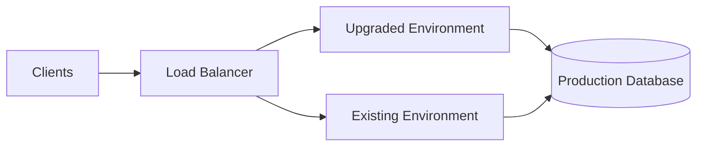
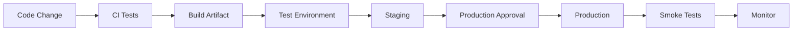

# 04- Platform Updates and Upgrades

## Overview

Amazon Elastic Beanstalk manages the underlying platform used to run an application, including the operating system, language runtime, web server, and other platform components. Platform updates are therefore infrastructure changes, not merely application deployments.

For a Python backend such as Django or FastAPI, a platform update can change:

- Python runtime version
- Operating system packages
- Web server components
- OpenSSL and other security libraries
- Runtime defaults
- Platform tooling
- Dependency compatibility
- Instance behavior

A safe upgrade process separates **application deployment** from **platform migration** and validates the new platform before production rollout.

```text
Current Platform
       │
       ▼
Compatibility Analysis
       │
       ▼
Test Environment
       │
       ▼
Platform Update
       │
       ▼
Application Validation
       │
       ▼
Staging
       │
       ▼
Production Rollout
       │
       ▼
Monitoring + Rollback
```

## What Is an Elastic Beanstalk Platform?

A platform defines the runtime environment in which Elastic Beanstalk launches application instances.

For a Python application, the platform determines important components such as:

```text
Operating System
       +
Python Runtime
       +
Web Server / Proxy
       +
Platform Utilities
       +
Elastic Beanstalk Integration
       ↓
Application Runtime
```

The platform is distinct from the application version.

| Component | Example Responsibility |
|---|---|
| Application version | Your Django/FastAPI code |
| Platform | Runtime and operating system |
| Environment configuration | Runtime configuration |
| Infrastructure | EC2, load balancer, Auto Scaling |
| Dependencies | Python packages installed by the application |

A platform update can therefore affect an application even when the application source code has not changed.

## Why Platform Updates Matter

Platform updates serve several purposes:

- Security patching
- Operating system maintenance
- Runtime upgrades
- Bug fixes
- Dependency updates
- Performance improvements
- Support for newer language versions
- Removal of obsolete platform versions

Running an old platform indefinitely increases operational and security risk.

However, upgrading blindly can introduce incompatibilities.

The engineering objective is therefore:

> Keep the platform current without allowing infrastructure upgrades to become uncontrolled application changes.

## Platform Updates vs Application Deployments

These are separate operational activities.

| Change | Primary Target | Typical Risk |
|---|---|---|
| Application deployment | Application code | Application-level |
| Configuration change | Environment behavior | Configuration-level |
| Platform update | Runtime/infrastructure | Runtime-level |
| Database migration | Persistent data | Data-level |

For example:

```text
Application:
Django 5.x
       ↓
New application version

Platform:
Python runtime
Amazon Linux
system libraries
       ↓
New platform version
```

Changing both simultaneously can make failures harder to diagnose.

When practical, isolate platform changes from major application changes.

## Platform Version Selection

Elastic Beanstalk environments are associated with a specific platform branch and version.

Before upgrading, determine:

- Current platform branch
- Current platform version
- Target platform branch
- Runtime version
- Operating system generation
- Supported application runtime
- Required configuration changes
- Dependency compatibility

Inspect the environment using:

```bash
eb status
```

and:

```bash
eb health
```

The Elastic Beanstalk console can also be used to inspect the current platform configuration.

## Platform Branch vs Platform Version

A platform branch represents the broader runtime family, while a platform version identifies a specific release within that branch.

Conceptually:

```text
Python Platform Branch
        │
        ├── Platform Version A
        ├── Platform Version B
        ├── Platform Version C
        └── Platform Version D
```

Moving between patch-level platform versions is generally less disruptive than moving between major runtime generations.

For example:

```text
Python 3.x patch update
```

is normally a smaller compatibility change than:

```text
Python 3.x → Python 4.x
```

The actual impact depends on the platform and application dependencies.

## Platform Upgrade Risk Classification

Not every platform update deserves the same rollout process.

| Upgrade | Typical Risk | Validation |
|---|---|---|
| Platform patch update | Lower | Smoke tests |
| OS package update | Low–Medium | Application + integration tests |
| Runtime minor update | Medium | Full compatibility testing |
| Runtime major update | High | Dedicated migration |
| Operating system generation change | High | Staging + production-like testing |
| Runtime + application dependency upgrade | High | Separate validation recommended |

Treat the target platform as a compatibility boundary.

## Pre-Upgrade Assessment

Before upgrading production, inspect the application for runtime assumptions.

For Python applications, review:

- Python version compatibility
- `requirements.txt`
- `pyproject.toml`
- Native dependencies
- Database drivers
- Cryptography libraries
- WSGI/ASGI server versions
- Gunicorn configuration
- System-level dependencies
- Startup scripts
- Platform hooks
- `.ebextensions`
- `.platform` configuration

For example:

```text
Django
   ↓
Gunicorn
   ↓
Python
   ↓
OpenSSL / system libraries
   ↓
Operating system
```

A platform update can affect any layer below the application.

## Dependency Compatibility

Native Python packages deserve special attention.

Examples include:

- `psycopg`
- `mysqlclient`
- `cryptography`
- `numpy`
- `Pillow`
- packages with C extensions

A package may depend on:

```text
Python ABI
+
Compiler
+
System libraries
+
OpenSSL
+
Database client libraries
```

A new platform can change those dependencies.

Always rebuild and test the application against the target runtime instead of assuming the existing dependency installation will remain compatible.

## Pin Application Dependencies

Avoid uncontrolled dependency upgrades during a platform migration.

Prefer reproducible dependency specifications.

For example:

```text
Django==5.x
gunicorn==23.x
psycopg==3.x
```

The exact versions should match the application's tested compatibility matrix.

The principle is:

```text
Platform change
+
Known application dependencies
=
Controlled upgrade
```

rather than:

```text
Platform change
+
Latest dependencies
=
Multiple simultaneous variables
```

## Test the Target Platform

Do not use production as the first environment where the new platform runs.

A safer sequence is:

```text
Development
     ↓
Dedicated Upgrade Test Environment
     ↓
Staging
     ↓
Production
```

The upgrade test environment should use the target platform and a representative application version.

Where practical, keep it isolated from production data.

## Staging Validation

Staging should validate both application functionality and platform behavior.

Test:

- Application startup
- Health checks
- API endpoints
- Database connectivity
- Redis connectivity
- Background workers
- Static files
- Media handling
- TLS behavior
- Scheduled jobs
- Celery tasks
- External API integrations
- Logging
- Metrics
- Deployment hooks

A successful platform update is not simply:

```text
Environment = Green
```

The application itself must remain functionally correct.

## Deployment Architecture

A production upgrade should minimize the amount of traffic exposed to the new platform at once.

A controlled architecture might look like:



The exact rollout strategy depends on the deployment model and the application's compatibility requirements.

The critical principle is to preserve a viable recovery path.

## In-Place Platform Updates

An environment can be updated to a newer platform version.

Advantages:

- Simple operational model
- Existing environment configuration is retained
- No need to create a separate permanent environment

Limitations:

- The existing environment is directly affected
- Rollback may be more complicated
- Platform and infrastructure changes happen in the existing environment
- Failure can affect production traffic

Use this approach when the platform change is well tested and the deployment strategy provides sufficient protection.

## Immutable or Replacement-Based Upgrades

A safer approach for higher-risk upgrades is to create a new environment using the target platform.

```text
Existing Production
       │
       │ continues serving traffic
       ▼
New Environment
       │
       ├── Target platform
       ├── Same application artifact
       └── Validated configuration
              │
              ▼
          Validation
              │
              ▼
        Traffic Migration
```

Advantages:

- Strong isolation
- Easier comparison
- Clear rollback path
- Reduced blast radius
- Easier validation

Limitations:

- Temporary additional infrastructure cost
- More environment management
- Requires careful handling of databases, secrets, DNS, and external integrations

For high-risk platform migrations, replacement-based deployment is often easier to reason about.

## Blue-Green Platform Upgrade

Blue-green deployment is particularly useful for platform migrations.

```text
Blue
Current Platform
       │
       │
       ├── Production traffic
       │
       ▼

Green
Target Platform
       │
       ├── New platform
       ├── Same application version
       └── Validation
```

After validation:

```text
Traffic
   │
   ▼
Green
```

If the new environment fails:

```text
Traffic
   │
   ▼
Blue
```

The old environment remains available until the new environment has been accepted.

## Rolling Platform Updates

A rolling strategy updates instances progressively rather than replacing the entire environment simultaneously.

Conceptually:

```text
Instance 1 → Updated
Instance 2 → Updated
Instance 3 → Updated
Instance 4 → Updated
```

This can reduce the immediate blast radius but introduces mixed-platform states during the rollout.

For a period, the environment may contain:

```text
Old Platform
+
New Platform
```

This is safe only when the application behaves consistently across both versions.

## Mixed-Version Risks

Mixed platform versions can expose subtle compatibility problems.

Examples:

- Different OpenSSL behavior
- Different Python runtime behavior
- Different system packages
- Different TLS behavior
- Different default configuration
- Different native library versions

For platform upgrades involving significant runtime changes, a replacement-based strategy can provide cleaner isolation.

## Platform Hooks During Upgrades

Platform hooks may execute during deployment.

For example:

```text
.platform/
└── hooks/
    ├── prebuild/
    ├── predeploy/
    └── postdeploy/
```

Hooks should be reviewed before a platform upgrade because their assumptions may depend on:

- File paths
- Operating system packages
- Shell behavior
- Runtime paths
- User permissions
- Installed binaries

A hook that worked on one platform generation may fail on another.

## Hook Compatibility

Avoid relying on undocumented system paths.

Fragile:

```bash
/usr/local/some-platform-specific-path/tool
```

Prefer predictable runtime discovery where possible:

```bash
command -v python
command -v gunicorn
```

Also use strict shell execution:

```bash
#!/bin/bash
set -euo pipefail
```

Hooks should fail explicitly rather than silently leaving the environment partially configured.

## `.ebextensions` Compatibility

Review `.ebextensions` during platform upgrades.

For example:

```yaml
option_settings:
  aws:elasticbeanstalk:application:environment:
    LOG_LEVEL: INFO
```

Configuration may become invalid if it depends on platform-specific assumptions.

Review:

- Package installation
- File locations
- Commands
- Services
- Permissions
- Environment options
- OS-specific configuration

Do not assume that every historical configuration remains appropriate on a newer platform.

## Runtime Upgrade Example

Suppose a FastAPI application currently runs on an older Python platform.

The migration should look conceptually like:

```text
Current:
Python Runtime A
     ↓
FastAPI
     ↓
Gunicorn/Uvicorn
     ↓
Application

Target:
Python Runtime B
     ↓
FastAPI
     ↓
Gunicorn/Uvicorn
     ↓
Application
```

The application should first be tested locally and in a target-platform environment before production migration.

## Database Compatibility

Platform upgrades can indirectly affect database connectivity.

Check:

- PostgreSQL driver
- TLS settings
- Connection pooling
- Authentication
- SSL certificates
- DNS resolution
- Network security groups
- Connection timeouts

A platform upgrade should not be allowed to accidentally change database behavior.

For Django:

```python
DATABASES = {
    "default": {
        "ENGINE": "django.db.backends.postgresql",
        "NAME": os.environ["DB_NAME"],
        "USER": os.environ["DB_USER"],
        "PASSWORD": os.environ["DB_PASSWORD"],
        "HOST": os.environ["DB_HOST"],
        "PORT": os.environ.get("DB_PORT", "5432"),
        "CONN_MAX_AGE": 60,
    }
}
```

The configuration should remain externalized from the platform itself.

## Redis and Celery Compatibility

If the application uses Redis and Celery, validate:

- Redis connectivity
- TLS configuration
- Celery worker startup
- Broker authentication
- Result backend behavior
- Task execution
- Connection pooling

A web application may appear healthy while background processing is broken.

For example:

```text
Load Balancer
      ↓
Web Instances
      ↓
Redis Broker
      ↓
Celery Workers
```

The complete request and asynchronous processing path must be tested.

## Observability During an Upgrade

Increase observability before starting a platform migration.

Monitor:

- HTTP 4xx rates
- HTTP 5xx rates
- Latency
- Request volume
- CPU
- Memory
- Instance health
- Application logs
- Deployment events
- Database errors
- Redis errors
- Worker failures

A useful comparison is:

```text
Before Upgrade
      ↓
Baseline Metrics
      ↓
Platform Upgrade
      ↓
After Upgrade
      ↓
Compare
```

Without a baseline, it is difficult to determine whether the new platform introduced a regression.

## Application-Level Health Validation

Platform health should not be the only validation signal.

A deployment may report a healthy environment while the application has functional failures.

Validate representative endpoints:

```bash
curl -f https://api.example.com/health
```

Then test application-specific behavior:

```text
Authentication
CRUD APIs
Database writes
Cache access
Background jobs
External integrations
```

For critical systems, automated smoke tests should run immediately after deployment.

## Monitoring During Rollout

Use a short observation window after upgrading.

Look for:

| Signal | Possible Problem |
|---|---|
| 5xx increase | Runtime/application incompatibility |
| Latency increase | Runtime or resource behavior |
| Memory growth | Runtime/library issue |
| CPU increase | Runtime or dependency change |
| Health degradation | Startup or platform issue |
| Worker failures | Runtime/dependency incompatibility |
| TLS errors | OpenSSL/platform change |
| Database errors | Driver/network compatibility |

Do not immediately terminate the old environment after a successful health check.

## Rollback Strategy

Every platform upgrade should have a defined rollback strategy before execution.

Possible strategies include:

- Restore the previous platform version
- Redeploy to the previous environment
- Switch traffic back to the old environment
- Restore the previous application/platform combination

The strongest rollback design is one where the previous environment remains operational until the new environment is accepted.

```text
New Environment
      │
      ├── Healthy → Keep traffic
      │
      └── Failure → Route traffic back
```

## Database Migration Compatibility

Platform upgrades become dangerous when coupled with irreversible database migrations.

Avoid:

```text
Platform upgrade
+
Application upgrade
+
Destructive DB migration
```

in a single uncontrolled change.

Prefer backward-compatible migrations:

```text
Add new schema
      ↓
Deploy compatible application
      ↓
Migrate traffic
      ↓
Remove obsolete schema later
```

This allows the old and new application versions to coexist during a rollback.

## Security Considerations

Platform upgrades are an important security maintenance mechanism.

Older platforms may contain outdated:

- Operating system packages
- Runtime libraries
- TLS libraries
- Security patches

However, security is not improved merely by selecting the newest platform.

Validate that:

- Application dependencies remain supported
- Configuration remains secure
- Secrets are not exposed
- IAM permissions remain correct
- Security groups remain unchanged as intended
- TLS behavior remains correct
- Logging does not expose credentials

A platform upgrade should preserve the application's security posture.

## IAM Considerations

Review environment roles and instance profiles after significant platform changes.

Validate:

- Instance profile
- Service role
- Deployment permissions
- S3 artifact access
- CloudWatch access
- Secrets access
- Parameter Store access

The platform upgrade should not become an excuse to grant broader IAM permissions.

Use least privilege.

## Cost Considerations

Platform upgrades can temporarily increase cost when using replacement environments.

For example:

```text
Existing Environment
+
Temporary Upgrade Environment
=
Additional EC2 / Load Balancer / Data Transfer Costs
```

The additional cost is often justified for high-risk production migrations because it reduces downtime and rollback risk.

Delete temporary infrastructure after successful migration.

## CI/CD Integration

Platform upgrades should be represented in the deployment process.

A mature pipeline can look like:



Platform changes should not bypass CI/CD merely because they are infrastructure changes.

The pipeline should provide traceability for:

- What was deployed
- Which platform was used
- Which application version was used
- Who approved the change
- What validation was performed

## Upgrade Runbook

A practical production upgrade can follow this procedure.

### Before the Upgrade

1. Record the current platform version.
2. Identify the target platform version.
3. Review AWS platform support and compatibility information.
4. Review Python/runtime compatibility.
5. Review application dependencies.
6. Review `.ebextensions` and `.platform` configuration.
7. Review platform hooks.
8. Verify database and Redis compatibility.
9. Establish monitoring baselines.
10. Confirm rollback strategy.
11. Confirm backups and recovery procedures.
12. Notify relevant stakeholders.

### During the Upgrade

1. Deploy the target application version to the upgrade environment.
2. Validate startup behavior.
3. Run health checks.
4. Run automated smoke tests.
5. Validate database connectivity.
6. Validate Redis and background workers.
7. Inspect application logs.
8. Compare metrics with the baseline.
9. Gradually expose production traffic if using a controlled rollout.
10. Monitor for regressions.

### After the Upgrade

1. Verify application functionality.
2. Verify environment health.
3. Verify error rates.
4. Verify latency.
5. Verify background processing.
6. Verify logs and monitoring.
7. Confirm production traffic is stable.
8. Retain the rollback environment for an appropriate observation period.
9. Document the upgrade.
10. Remove temporary infrastructure after acceptance.

## CLI Operations

Useful Elastic Beanstalk CLI commands include:

```bash
eb status
```

```bash
eb health
```

```bash
eb events
```

```bash
eb printenv
```

To deploy the current application:

```bash
eb deploy
```

Use the CLI as part of an auditable operational process rather than performing unexplained production changes manually.

## Upgrade Verification Matrix

A useful validation matrix is:

| Area | Validation |
|---|---|
| Runtime | Correct Python/runtime version |
| Startup | Application starts successfully |
| HTTP | Critical endpoints respond |
| Database | Queries and writes succeed |
| Redis | Cache/broker connectivity succeeds |
| Celery | Workers execute tasks |
| TLS | HTTPS works correctly |
| Logs | Application logs are generated |
| Metrics | Expected metrics continue |
| Health | Environment remains healthy |
| Performance | Latency and resource usage remain acceptable |
| Security | IAM and network controls remain correct |
| Rollback | Previous version/environment remains recoverable |

## Common Mistakes

### Upgrading Production First

Production should not be the first environment exposed to the target platform.

**Better approach:** Validate the target platform in an isolated environment and staging first.

### Changing Platform and Application at the Same Time

When both changes fail, root-cause analysis becomes difficult.

**Better approach:** Separate major platform and application changes when practical.

### Ignoring Native Dependencies

Packages with C extensions can depend on operating-system libraries and compiler/runtime behavior.

**Better approach:** Rebuild and test dependencies against the target platform.

### Assuming Green Health Means Success

Elastic Beanstalk health does not guarantee that every business-critical API works.

**Better approach:** Run application-level smoke and integration tests.

### Ignoring Deployment Hooks

Hooks can contain assumptions about operating system paths and installed utilities.

**Better approach:** Review and test every hook against the target platform.

### No Rollback Plan

A team may discover during an incident that the previous environment cannot be restored quickly.

**Better approach:** Define and test rollback before starting the upgrade.

### Combining an Upgrade With a Destructive Migration

A platform failure combined with an irreversible database change can make rollback impossible.

**Better approach:** Use backward-compatible database migration patterns.

### Deleting the Old Environment Immediately

The old environment may be the fastest recovery mechanism.

**Better approach:** Retain it until the new platform has passed an appropriate observation period.

### Unpinned Dependencies

An upgrade can accidentally install newer application dependencies at the same time.

**Better approach:** Use reproducible dependency versions.

### Testing Only Web Requests

Celery workers, scheduled jobs, Redis, and external integrations may fail while HTTP health checks remain green.

**Better approach:** Validate the complete application dependency graph.

## Production Best Practices

- Treat platform updates as infrastructure changes.
- Keep application artifacts and platform versions independently identifiable.
- Maintain a supported runtime version.
- Test platform updates outside production.
- Prefer replacement or blue-green strategies for high-risk migrations.
- Establish a performance and health baseline before upgrades.
- Keep application dependencies reproducible.
- Review platform hooks and `.ebextensions`.
- Validate native dependencies against the target runtime.
- Test database, Redis, Celery, and external integrations.
- Keep rollback paths available.
- Avoid irreversible database migrations during platform upgrades.
- Monitor both infrastructure health and business-critical application behavior.
- Use least-privilege IAM throughout the migration.
- Document the final platform version and configuration.
- Remove temporary upgrade infrastructure after successful migration.

## Interview Traps

**Q: Is a platform update the same as deploying a new application version?**

No. An application deployment changes application code, while a platform update changes the runtime and underlying platform components.

**Q: Why should platform upgrades be tested separately from application upgrades?**

Separating them reduces the number of variables in a failure and makes root-cause analysis easier.

**Q: Why is blue-green useful for platform upgrades?**

It allows the target platform to be validated independently while the existing environment continues serving traffic, providing a straightforward rollback path.

**Q: Why can an application break even when its source code has not changed?**

The platform can change the runtime, operating system libraries, TLS libraries, system packages, or other dependencies beneath the application.

**Q: Why are Python packages with native extensions important during platform upgrades?**

They may depend on operating-system libraries, compilers, ABI compatibility, and runtime libraries that can change with the platform.

**Q: Why should database migrations be backward compatible during a platform upgrade?**

Because rollback may temporarily restore the previous application/platform combination. An incompatible schema can prevent that rollback from working.

**Q: Is a successful Elastic Beanstalk health check enough to approve a platform upgrade?**

No. Health checks should be combined with application smoke tests, dependency validation, performance monitoring, and business-critical functionality checks.

**Q: Why keep the previous environment after a successful upgrade?**

It provides a rapid recovery path if delayed failures appear after production traffic reaches the new platform.

## Key Takeaways

- An Elastic Beanstalk platform defines the runtime and infrastructure layer beneath the application.
- Platform updates can change operating-system packages, language runtimes, system libraries, TLS behavior, and other runtime characteristics.
- Platform upgrades should be treated as infrastructure changes rather than ordinary application deployments.
- Validate the target platform before exposing production traffic.
- Review application dependencies, native packages, platform hooks, and `.ebextensions`.
- Avoid changing the platform, application dependencies, and database schema simultaneously when those changes can be separated.
- Use blue-green or replacement-based deployment for high-risk production platform migrations.
- Establish monitoring baselines before an upgrade and compare them after deployment.
- Validate the complete backend dependency chain, including PostgreSQL, Redis, Celery, external APIs, TLS, logging, and health checks.
- Keep the previous environment or another proven rollback mechanism available until the upgrade is accepted.
- Prefer backward-compatible database migrations so application rollback remains possible.
- Use reproducible dependencies and configuration to make platform migrations deterministic.
- Platform upgrades should improve security and maintainability without sacrificing application compatibility.
- The safest platform upgrade is one that is **tested, observable, reversible, and independently attributable**.