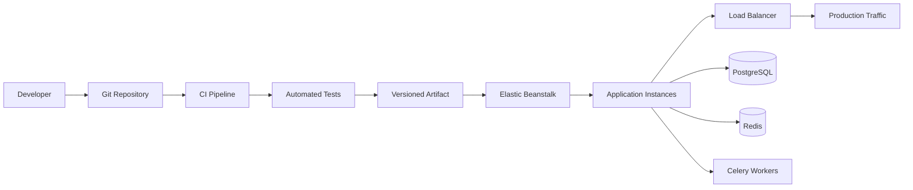

# 05- Production Deployment Practices

## Overview

Production deployment on Amazon Elastic Beanstalk is the process of moving a tested application version into a live environment while controlling availability, risk, configuration changes, and rollback.

For backend applications such as Django and FastAPI, production deployment is not simply:

```text
git push
    ↓
application deployed
```

A production deployment must account for:

- Application artifact integrity
- Environment configuration
- Platform compatibility
- Database migrations
- Health checks
- Traffic management
- Deployment strategy
- Secrets
- Background workers
- Observability
- Rollback
- Security
- Availability

The core objective is to make every production deployment **repeatable, observable, controlled, and reversible**.

## Production Deployment Model

A typical Elastic Beanstalk backend deployment can be represented as:



A mature deployment pipeline separates **building**, **testing**, **releasing**, and **operating** the application.

## Deployment Principles

Production deployments should follow several principles.

| Principle | Purpose |
|---|---|
| Immutable artifacts | Ensure the tested artifact is the deployed artifact |
| Automated validation | Reduce human error |
| Small changes | Reduce blast radius |
| Health checks | Detect deployment failures |
| Gradual rollout | Limit traffic exposure |
| Observability | Detect regressions quickly |
| Reversible deployment | Enable rapid recovery |
| Externalized configuration | Separate code from environment-specific settings |
| Backward-compatible migrations | Preserve rollback capability |
| Least privilege | Reduce security exposure |

The deployment process should be deterministic enough that another engineer can execute it without relying on undocumented tribal knowledge.

## Application Artifact

The production deployment should use a known application version.

For a Python application, this typically includes:

```text
Application Source
       ↓
Dependency Definition
       ↓
Build
       ↓
Test
       ↓
Versioned Artifact
       ↓
Elastic Beanstalk
```

Avoid building different artifacts for staging and production.

A safer model is:

```text
Build Once
    ↓
Test Artifact
    ↓
Deploy Same Artifact
    ├── Staging
    └── Production
```

This reduces environment-specific build differences.

## Versioned Application Releases

Every production deployment should have an identifiable version.

Useful identifiers include:

```text
application-name
commit SHA
build number
release version
deployment timestamp
```

For example:

```text
backend-api
commit: 8f4d2ab
release: 2026.08.13.1
```

This makes incident investigation significantly easier.

You should be able to answer:

> Which exact application version is serving production traffic?

## CI/CD Pipeline

A production-oriented pipeline can follow:


Typical stages include:

- Static analysis
- Unit tests
- Integration tests
- Dependency checks
- Build
- Artifact publishing
- Staging deployment
- Smoke tests
- Production approval
- Production deployment
- Post-deployment verification

Manual production deployment should be the exception rather than the normal workflow.

## Deployment Strategies

Elastic Beanstalk supports multiple deployment approaches with different availability and rollback characteristics.

| Strategy | Availability | Deployment Speed | Rollback | Typical Use |
|---|---|---|---|---|
| All at once | Lowest | Fast | Redeploy | Development/non-critical systems |
| Rolling | Moderate | Moderate | Redeploy | Controlled production changes |
| Rolling with additional batch | Higher | Moderate | Redeploy | Reduced capacity impact |
| Immutable | High | Slower | Strong | Safer production releases |
| Blue-green | Very high | Moderate | Fast | High-risk releases |

The correct strategy depends on application criticality, traffic, deployment duration, and rollback requirements.

## All-at-Once Deployment

All-at-once deployment updates all instances simultaneously.

```text
Before:

Instance A → Old
Instance B → Old
Instance C → Old

Deployment:

Instance A → New
Instance B → New
Instance C → New
```

### Advantages

- Fast
- Simple
- Low temporary infrastructure cost

### Limitations

- Can cause downtime
- Large blast radius
- Poor rollback characteristics
- All instances may fail simultaneously

Avoid this strategy for critical production APIs unless downtime is explicitly acceptable.

## Rolling Deployment

Rolling deployment updates instances in batches.

```text
Batch 1:
Old → New

Batch 2:
Old → New

Batch 3:
Old → New
```

Traffic continues to be served by the remaining instances.

### Advantages

- Lower blast radius
- No complete environment replacement
- Lower temporary infrastructure cost

### Limitations

- Old and new application versions can coexist
- Deployment takes longer
- Application must tolerate mixed versions

Rolling deployment is appropriate when the application is backward compatible across the deployment boundary.

## Rolling With Additional Batch

This strategy adds temporary capacity during the deployment.

Conceptually:

```text
Existing Capacity
       +
Temporary Batch
       ↓
Deploy New Instances
       ↓
Validate
       ↓
Remove Old Instances
```

The additional capacity reduces the risk of temporarily reducing application capacity.

The tradeoff is additional infrastructure cost during deployment.

## Immutable Deployment

Immutable deployment creates new instances rather than modifying existing production instances.

```text
Existing Instances
      │
      │ remain available
      ▼
New Instances
      │
      ├── New Application
      ├── New Configuration
      └── Validation
```

After validation, the new instances become the active production fleet.

### Advantages

- Strong isolation
- Lower configuration drift
- Easier rollback
- Safer production releases

### Limitations

- Higher temporary infrastructure cost
- Longer deployment time
- Requires capacity planning

For critical backend services, immutable deployment is often preferable to modifying live instances in place.

## Blue-Green Deployment

Blue-green deployment maintains two environments.

```text
Blue
Current Production
       │
       └── Live Traffic

Green
New Production
       │
       ├── New Application
       └── Validation
```

Traffic is switched only after Green has passed validation.

```text
Before:

Users → Blue

After:

Users → Green
```

If Green fails:

```text
Users → Blue
```

### Advantages

- Fast rollback
- Strong isolation
- Independent validation
- Reduced deployment blast radius

### Limitations

- Additional infrastructure
- Environment synchronization required
- Database compatibility becomes important
- External integrations must be considered carefully

Blue-green is especially useful for high-risk application or platform changes.

## Choosing a Deployment Strategy

Use the application's availability requirements to determine the strategy.

```text
Critical production API
        │
        ├── Need fast rollback?
        │       └── Yes → Blue-Green
        │
        ├── Need strong isolation?
        │       └── Yes → Immutable
        │
        └── Lower-risk change
                └── Rolling
```

Do not choose a deployment strategy solely because it is faster.

The relevant question is:

> What is the maximum acceptable blast radius if this deployment fails?

## Pre-Deployment Checklist

Before production deployment, verify:

### Application

- Tests are passing
- Dependencies are reproducible
- Application artifact is versioned
- Configuration changes are reviewed
- Startup command is validated
- Health endpoint is working

### Infrastructure

- Environment is healthy
- Required capacity exists
- Auto Scaling configuration is appropriate
- Load balancer is healthy
- Security groups are correct
- IAM permissions are correct

### Data

- Database backup strategy is available
- Database migrations are reviewed
- Migrations are backward compatible where required
- Redis compatibility is verified
- Background jobs are compatible

### Operations

- Monitoring is active
- Logs are available
- Alerts are configured
- Rollback procedure is known
- Stakeholders are informed for high-risk changes

## Health Checks

Health checks are essential during deployment.

A production application should expose a lightweight health endpoint.

For example:

```python
from django.http import JsonResponse


def health(request):
    return JsonResponse({"status": "ok"})
```

The endpoint should be designed carefully.

A simple liveness check should not necessarily execute expensive database queries or external API calls.

Different checks may be useful:

```text
Liveness
    ↓
Is the process running?

Readiness
    ↓
Can the instance safely receive traffic?

Dependency health
    ↓
Can required dependencies be reached?
```

Do not make every health check dependent on every external service. Otherwise, a temporary dependency failure can cause healthy application instances to be removed from service.

## Graceful Startup

An instance should not receive production traffic before the application is ready.

A typical lifecycle is:

```text
EC2 Instance Starts
       ↓
Platform Initialization
       ↓
Dependencies Installed
       ↓
Application Starts
       ↓
Health Check
       ↓
Ready
       ↓
Receive Traffic
```

Startup should be deterministic and should fail clearly when required configuration is missing.

## Graceful Shutdown

Applications should also handle termination safely.

This matters during:

- Rolling deployments
- Auto Scaling
- Immutable deployments
- Instance replacement
- Platform updates

For a Python application running under Gunicorn, graceful worker termination allows in-flight requests to complete where possible.

Background workers should similarly handle shutdown signals correctly.

## Database Migrations

Database migrations are one of the highest-risk parts of production deployment.

A deployment such as:

```text
Deploy Application
      ↓
Run Migration
```

can become dangerous when the migration is incompatible with the currently running application version.

Prefer the expand-and-contract pattern.

```text
Expand
  ↓
Add compatible schema
  ↓
Deploy new application
  ↓
Migrate data
  ↓
Switch application behavior
  ↓
Contract
  ↓
Remove obsolete schema later
```

For example, instead of immediately renaming a column:

```text
old_column → new_column
```

use a transitional period where both columns are supported.

## Backward Compatibility

During rolling deployments, two application versions may run simultaneously.

```text
Load Balancer
     │
     ├── Instance A → Version N
     ├── Instance B → Version N+1
     └── Instance C → Version N+1
```

The database and APIs must tolerate this state.

This is one reason senior engineers design deployments around **compatibility boundaries**, not only application versions.

## Secrets and Configuration

Never commit production credentials into the application repository.

Avoid:

```python
DATABASE_PASSWORD = "production-password"
```

Use environment configuration or AWS-managed secret mechanisms.

For example:

```python
import os

DATABASE_PASSWORD = os.environ["DATABASE_PASSWORD"]
```

Configuration should be separated from the application artifact.

Typical environment-specific configuration includes:

- Database endpoints
- Credentials
- API keys
- Redis endpoints
- Feature flags
- Logging levels
- External service URLs

## Configuration Drift

Manual changes to production environments can create configuration drift.

For example:

```text
Git / CI Configuration
        │
        └── Expected State

Production Environment
        │
        └── Manually Modified State
```

Over time:

```text
Expected State ≠ Actual State
```

Use version-controlled configuration and automated deployment wherever possible.

## Deployment Hooks

Elastic Beanstalk supports deployment-related configuration and hooks.

These can be used for tasks such as:

- Application setup
- Dependency preparation
- Configuration
- Service initialization

Keep hooks:

- Idempotent
- Explicit
- Version controlled
- Small
- Observable

Avoid putting large amounts of application logic into deployment hooks.

A deployment hook should not become an undocumented application framework.

## Static and Media Files

For Django applications, production deployment should distinguish between static assets and user-generated media.

Typical architecture:

```text
Django
  │
  ├── Static Assets → Object Storage / CDN
  │
  └── User Media → Durable Object Storage
```

Do not rely on local EC2 instance storage for persistent user-uploaded files.

Instances can be replaced at any time.

## Background Workers

If the application uses Celery:

```text
Web Application
      │
      ▼
Redis
      │
      ▼
Celery Workers
```

A production deployment must consider worker compatibility.

If a new application version changes task payloads, the old and new workers may need to coexist temporarily.

Avoid incompatible task contracts during rolling deployments.

A safe pattern is:

```text
Version N
  ↓
Compatible Task Contract
  ↓
Version N+1
  ↓
Remove Old Contract Later
```

## External API Compatibility

Production deployments may interact with external services.

Examples:

- Payment gateways
- Authentication providers
- Email providers
- Internal microservices
- AWS services

Validate:

- Authentication
- TLS
- Request schemas
- Response schemas
- Timeouts
- Retry behavior

A deployment can succeed technically while causing production failures because an external integration changed behavior.

## Observability

Deployment success should be measured through operational signals.

Monitor:

- HTTP 5xx rate
- HTTP 4xx rate
- Latency
- Request volume
- CPU
- Memory
- Instance health
- Application logs
- Database errors
- Redis errors
- Celery failures

A useful deployment sequence is:

```text
Deploy
  ↓
Smoke Test
  ↓
Observe
  ↓
Compare Against Baseline
  ↓
Accept or Roll Back
```

Do not consider a deployment successful merely because the deployment command returned successfully.

## Deployment Baselines

Before production deployment, understand normal behavior.

For example:

| Metric | Baseline |
|---|---:|
| Requests/sec | 1,500 |
| p95 latency | 180 ms |
| 5xx rate | < 0.1% |
| CPU | 45% |
| Memory | 55% |

After deployment, compare the same signals.

A regression might appear as:

```text
p95 latency
180 ms → 600 ms

5xx
0.05% → 2.5%
```

The deployment should be investigated or rolled back rather than accepted because instances remain technically healthy.

## Smoke Testing

Smoke tests should validate critical functionality immediately after deployment.

Example:

```bash
curl --fail --silent --show-error \
  https://api.example.com/health
```

For a backend API, additional smoke tests might validate:

```text
Authentication
      ↓
Read API
      ↓
Write API
      ↓
Database
      ↓
Cache
      ↓
Background task
```

Keep smoke tests fast enough to run automatically after deployment.

## Canary Releases

For high-risk releases, traffic can be exposed gradually.

Conceptually:

```text
100% Current
     ↓
95% Current / 5% New
     ↓
75% Current / 25% New
     ↓
50% Current / 50% New
     ↓
100% New
```

At each stage, evaluate:

- Error rate
- Latency
- Resource utilization
- Business metrics

If the new version behaves incorrectly:

```text
Stop rollout
    ↓
Return traffic to previous version
```

The exact traffic-shifting mechanism depends on the surrounding AWS architecture.

## Feature Flags

Feature flags can reduce deployment risk by separating code deployment from feature activation.

```text
Deploy Code
    ↓
Feature Disabled
    ↓
Validate
    ↓
Enable for Small Audience
    ↓
Monitor
    ↓
Enable Globally
```

This is particularly useful for large behavioral changes.

Feature flags should have:

- Clear ownership
- Defined lifecycle
- Secure configuration
- Removal plans

Permanent flags create unnecessary complexity.

## Security During Deployment

Production deployment should maintain the application's security boundaries.

Verify:

- HTTPS
- Least-privilege IAM
- Secure secrets
- Restricted security groups
- Dependency security
- No credentials in logs
- No credentials in artifacts
- No unnecessary public access

A deployment pipeline itself should also be protected.

Production deployment permissions should be restricted to authorized identities.

## IAM and Deployment Permissions

Separate application permissions from deployment permissions.

Conceptually:

```text
CI/CD Role
    │
    └── Deployment permissions

EC2 Instance Role
    │
    └── Runtime permissions

Developer Identity
    │
    └── Development permissions
```

Avoid giving the application instance broad administrative permissions merely because the deployment process requires them.

## Production Rollback

Rollback should be a normal operational capability, not an emergency improvisation.

A rollback might mean:

```text
Current Version
      ↓
Detect Regression
      ↓
Stop Deployment
      ↓
Restore Previous Version
      ↓
Verify Health
      ↓
Continue Monitoring
```

The rollback mechanism depends on the deployment strategy.

For blue-green deployments:

```text
Green → Failed
Blue  → Known Good

Traffic → Blue
```

This is generally simpler than reconstructing the previous state on the same instances.

## Rollback Decision Criteria

Define objective rollback signals.

Examples:

- Sustained 5xx increase
- Significant latency regression
- Application startup failures
- Database errors
- Critical business operation failures
- Worker failures
- Security regression

Avoid relying only on subjective judgment during an incident.

## Production Deployment Runbook

### Before Deployment

1. Verify CI is passing.
2. Confirm the artifact version.
3. Review application changes.
4. Review configuration changes.
5. Review database migrations.
6. Verify staging validation.
7. Verify environment health.
8. Verify monitoring and alerts.
9. Confirm rollback procedure.
10. Confirm required approvals.

### During Deployment

1. Start the deployment.
2. Observe Elastic Beanstalk events.
3. Monitor instance health.
4. Monitor application logs.
5. Watch HTTP error rates.
6. Watch latency.
7. Monitor database and Redis behavior.
8. Monitor Celery workers if applicable.
9. Execute smoke tests.
10. Stop or roll back if predefined failure criteria are reached.

### After Deployment

1. Verify application health.
2. Verify critical API paths.
3. Compare metrics against baseline.
4. Verify background processing.
5. Verify external integrations.
6. Review deployment logs.
7. Confirm no unexpected configuration changes.
8. Continue monitoring during the observation window.
9. Record deployment metadata and outcome.

## Production Deployment Checklist

| Area | Check |
|---|---|
| Code | Reviewed and tested |
| Artifact | Versioned and reproducible |
| Dependencies | Pinned/controlled |
| Platform | Supported and validated |
| Configuration | Reviewed |
| Secrets | Securely managed |
| Database | Migration reviewed |
| Health | Environment healthy |
| Monitoring | Active |
| Smoke tests | Ready |
| Rollback | Tested/known |
| Capacity | Sufficient |
| Security | IAM/network controls verified |
| Background jobs | Compatible |
| External APIs | Validated |
| Deployment strategy | Appropriate for risk |

## Common Mistakes

### Deploying Directly From a Developer Machine

Manual local deployments are difficult to audit and reproduce.

**Better approach:** Use CI/CD with versioned artifacts and controlled production permissions.

### Using All-at-Once for Critical Systems

The deployment may take the entire service offline or expose every instance to the same failure.

**Better approach:** Use rolling, immutable, or blue-green deployment according to the risk profile.

### Running Destructive Database Migrations First

A new schema can prevent the previous application version from functioning.

**Better approach:** Use backward-compatible migrations.

### Assuming Deployment Success Means Application Success

Infrastructure can report healthy while business functionality is broken.

**Better approach:** Combine platform health with smoke tests and application metrics.

### Deploying Unversioned Artifacts

Without a clear artifact identifier, determining what is running becomes difficult.

**Better approach:** Associate every deployment with a commit SHA or release identifier.

### Storing Secrets in Git

Credentials can leak through repository history and artifacts.

**Better approach:** Use environment configuration and appropriate AWS secret-management mechanisms.

### Ignoring Celery Workers

A web deployment may succeed while asynchronous jobs fail.

**Better approach:** Validate worker startup and task execution separately.

### Ignoring Static and Media Storage

Instance-local files disappear when instances are replaced.

**Better approach:** Store durable assets outside the instance filesystem.

### Changing Too Many Things at Once

Combining application, platform, dependency, database, and infrastructure changes makes failures difficult to attribute.

**Better approach:** Minimize independent variables in each production change.

### No Explicit Rollback Threshold

Teams can waste time debating whether a deployment is actually failing.

**Better approach:** Define measurable rollback criteria before deployment.

## Production Best Practices

- Build artifacts once and promote the same artifact through environments.
- Use automated CI/CD for production deployments.
- Version every application release.
- Prefer rolling, immutable, or blue-green deployments over all-at-once deployment for critical services.
- Keep application configuration separate from application code.
- Manage secrets outside source control.
- Use backward-compatible database migrations.
- Treat deployment hooks as production infrastructure code.
- Validate application health rather than relying only on infrastructure health.
- Monitor latency, error rates, resource usage, and business-critical operations.
- Keep rollback mechanisms fast and well understood.
- Ensure background workers and asynchronous tasks remain compatible during mixed-version deployments.
- Store persistent files outside ephemeral application instances.
- Minimize the number of unrelated changes in a single production release.
- Protect CI/CD credentials and production deployment permissions.
- Maintain sufficient capacity during deployments.
- Record deployment metadata for auditability and incident response.

## Interview Traps

**Q: Which Elastic Beanstalk deployment strategy is safest for a critical production service?**

There is no universally safest strategy. Immutable and blue-green approaches provide strong isolation, while blue-green additionally provides a straightforward traffic-level rollback path. The correct choice depends on availability, cost, architecture, and compatibility requirements.

**Q: Why are backward-compatible database migrations important during rolling deployments?**

Because old and new application versions may run simultaneously. Both versions must be able to operate against the database during the transition.

**Q: Why should the same artifact be promoted from staging to production?**

It eliminates differences caused by rebuilding the application and increases confidence that the artifact tested in staging is the artifact running in production.

**Q: Why is an application health endpoint not enough for deployment validation?**

A health endpoint may confirm that the process is running without proving that authentication, database operations, cache access, background jobs, or critical business workflows are functioning.

**Q: What is the main advantage of blue-green deployment?**

The new environment can be validated independently while the existing environment remains available, making traffic rollback fast.

**Q: Why can rolling deployments be dangerous for APIs?**

Because old and new application versions can coexist. If their API contracts, task contracts, or database expectations are incompatible, requests can fail depending on which instance receives them.

**Q: Why should deployment and runtime IAM permissions be separated?**

The deployment system and application have different responsibilities. Separating their permissions limits the blast radius if either credential or workload is compromised.

**Q: What should determine whether a deployment is successful?**

Not just whether Elastic Beanstalk reports success. Success should include application health, smoke tests, error rates, latency, dependency behavior, and relevant business signals.

## Key Takeaways

- Production deployment is an operational process, not simply an application upload.
- Use versioned, reproducible artifacts and promote the same artifact through environments.
- Choose the deployment strategy according to availability requirements and failure blast radius.
- Rolling deployments require backward compatibility because multiple application versions can coexist.
- Immutable and blue-green deployments provide stronger isolation for higher-risk releases.
- Database migrations must be designed around deployment and rollback compatibility.
- Keep configuration and secrets separate from application code.
- Validate web applications, databases, caches, background workers, and external integrations after deployment.
- Use health checks, smoke tests, logs, metrics, and alerts together.
- Define measurable rollback criteria before starting production deployment.
- Treat deployment hooks and environment configuration as production infrastructure code.
- Protect CI/CD and IAM permissions with least privilege.
- Avoid combining unrelated high-risk changes in a single deployment.
- Keep persistent data outside ephemeral application instances.
- A production deployment is successful only when the **application is healthy, observable, compatible, and recoverable**.