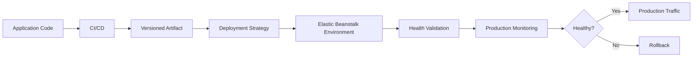

# README

## Overview

This section covers production deployment practices for **Amazon Elastic Beanstalk**, with a focus on releasing backend applications safely, consistently, and with minimal operational risk.

The documentation progresses from deployment strategies and CI/CD automation to environment management, platform upgrades, and production release practices.

## Quick Navigation

| Topic | Description |
|---|---|
| [Deployment Strategies](./01-%20Deployment%20Strategies.md) | Understand Elastic Beanstalk deployment strategies, rollout behavior, availability, rollback, and when to use each strategy. |
| [CI-CD](./02-%20CI-CD.md) | Build automated CI/CD pipelines for testing, packaging, and deploying Elastic Beanstalk applications. |
| [Environment Management](./03-%20Environment%20Management.md) | Manage Elastic Beanstalk environments, configuration, environment variables, capacity, and environment lifecycle. |
| [Platform Updates and Upgrades](./04-%20Platform%20Updates%20and%20Upgrades.md) | Safely manage Elastic Beanstalk platform updates, runtime upgrades, compatibility, and upgrade planning. |
| [Production Deployment Practices](./05-%20Production%20Deployment%20Practices.md) | Apply production-grade deployment, validation, rollback, observability, security, and operational practices. |

## Deployment Flow

## Recommended Reading Order

1. [Deployment Strategies](./01-%20Deployment%20Strategies.md)
2. [CI-CD](./02-%20CI-CD.md)
3. [Environment Management](./03-%20Environment%20Management.md)
4. [Platform Updates and Upgrades](./04-%20Platform%20Updates%20and%20Upgrades.md)
5. [Production Deployment Practices](./05-%20Production%20Deployment%20Practices.md)

## Key Takeaways

- Use controlled deployment strategies based on application availability and risk.
- Automate deployments through CI/CD rather than relying on manual production changes.
- Treat Elastic Beanstalk environments as managed production infrastructure that requires deliberate configuration management.
- Plan platform and runtime upgrades separately from application releases when possible.
- Validate deployments using application health, logs, metrics, and smoke tests.
- Maintain a tested rollback strategy for production releases.
- Keep production configuration and secrets separate from application source code.