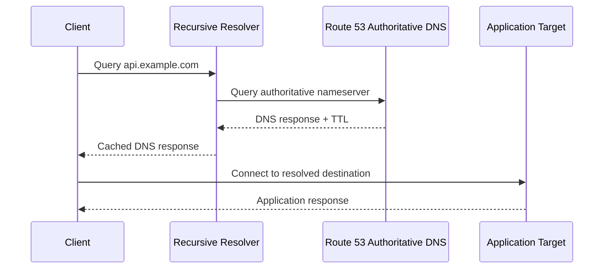
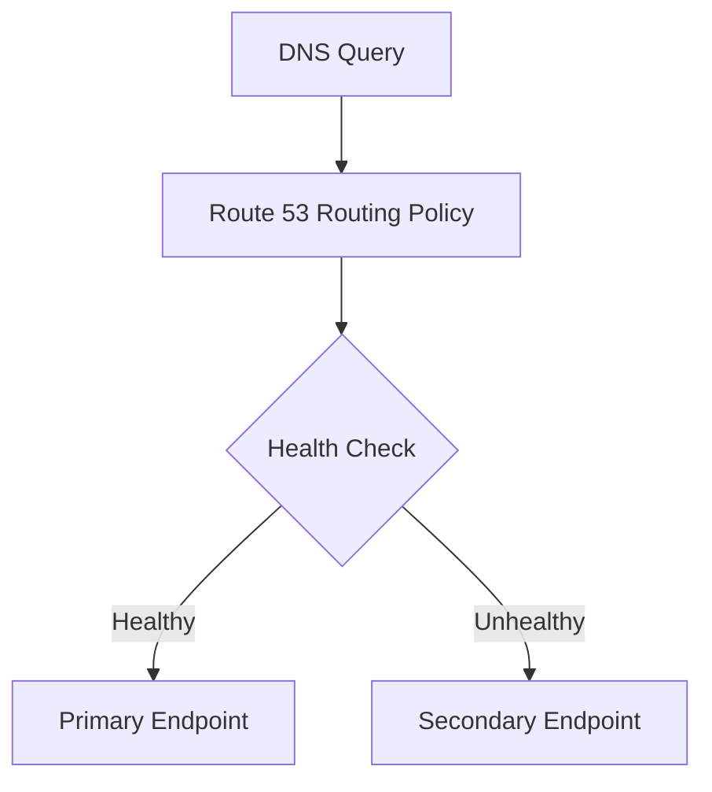
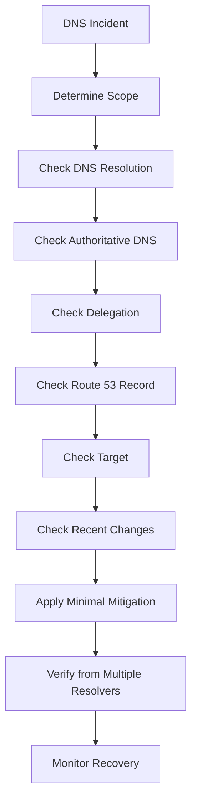

# 01- Troubleshooting Methodology

## Overview

Route 53 troubleshooting should be approached as a DNS resolution and traffic-routing investigation rather than as a simple record lookup problem.

A DNS request can fail at multiple layers:

```text
Client
  │
  ▼
Local DNS Cache
  │
  ▼
Recursive Resolver
  │
  ▼
Root / TLD DNS
  │
  ▼
Route 53 Authoritative Nameservers
  │
  ▼
Hosted Zone / Record
  │
  ▼
Target
  │
  ├── CloudFront
  ├── ALB / ELB
  ├── API Gateway
  ├── S3
  ├── EC2
  └── Other Service
```

A senior engineer should therefore answer three questions before changing anything:

1. **Where does the failure occur?**
2. **What is the expected DNS behavior?**
3. **What evidence proves the actual behavior differs from the expected behavior?**

The objective is not to randomly modify records until DNS starts working. The objective is to isolate the failing layer, identify the root cause, make the smallest safe change, and verify the complete request path.

---

## DNS Troubleshooting Mental Model

Route 53 troubleshooting becomes easier when DNS resolution is separated into distinct stages.



A successful DNS lookup does **not** guarantee a successful application request.

For example:

```text
DNS resolution
      │
      ▼
200.0.0.10
      │
      ▼
TCP connection
      │
      ▼
TLS handshake
      │
      ▼
HTTP request
      │
      ▼
Application
```

If DNS resolves correctly but the API returns `503`, Route 53 may not be the problem.

This distinction is one of the most important troubleshooting skills.

---

## Troubleshooting Layers

Use the following model to classify failures.

| Layer | Typical failure | Primary tools |
|---|---|---|
| Client cache | Stale DNS result | Browser, OS DNS cache |
| Recursive resolver | Cached or incorrect response | `dig`, `nslookup` |
| Delegation | Wrong nameservers | `dig NS`, `dig +trace` |
| Hosted zone | Missing or incorrect record | AWS CLI, Route 53 console |
| Record type | Wrong A/CNAME/alias configuration | `dig` |
| Routing policy | Unexpected target selection | Route 53 configuration |
| Health check | Unhealthy endpoint | Route 53 health checks |
| TTL | Old answer still cached | `dig`, resolver inspection |
| Target | ALB/CloudFront/API Gateway failure | AWS service tools |
| TLS | Certificate mismatch | `curl`, `openssl` |
| Application | HTTP/application failure | Logs, metrics, tracing |
| IAM | DNS configuration cannot be changed | IAM, CloudTrail |

---

## First Principle: Establish the Expected State

Before troubleshooting, establish what should happen.

For example:

```text
api.example.com
        │
        ▼
Route 53
        │
        ▼
ALB
        │
        ▼
ECS service
        │
        ▼
FastAPI application
```

Document:

- Domain name
- Record type
- Expected target
- Hosted zone
- Routing policy
- Health-check configuration
- TTL
- Expected HTTP behavior
- Expected TLS certificate
- AWS account and region
- Recent DNS changes
- Recent infrastructure changes

Without an expected state, it is difficult to determine whether the observed result is actually incorrect.

---

## Step-by-Step Troubleshooting Workflow

### Confirm the Domain

Start with the exact hostname.

```bash
dig api.example.com
```

Check:

- Status code
- Answer section
- Record type
- Returned address
- TTL
- Authority section
- Additional section

For a concise answer:

```bash
dig +short api.example.com
```

For a specific record type:

```bash
dig api.example.com A
dig api.example.com AAAA
dig api.example.com CNAME
```

Do not assume that querying one record type proves that the complete DNS configuration is correct.

---

### Confirm Authoritative Nameservers

Determine which nameservers are authoritative for the domain.

```bash
dig example.com NS
```

Then inspect the delegation path:

```bash
dig +trace api.example.com
```

`+trace` is particularly useful when you suspect delegation problems because it walks through the DNS hierarchy instead of relying entirely on the local recursive resolver.

A common production failure is:

```text
Registrar
   │
   ▼
Wrong NS delegation
   │
   ▼
Expected Route 53 hosted zone is never queried
```

In this case, modifying records inside Route 53 may have no effect because clients are reaching a different authoritative DNS provider.

---

## Verify the Hosted Zone

Confirm that the expected hosted zone exists.

```bash
aws route53 list-hosted-zones-by-name \
  --dns-name example.com
```

Then inspect its records:

```bash
aws route53 list-resource-record-sets \
  --hosted-zone-id Z123456789EXAMPLE
```

Verify:

- Hosted-zone name
- Hosted-zone ID
- Public vs private zone
- Record name
- Record type
- Alias configuration
- TTL
- Routing policy
- Health-check association

Be careful with domains that have both public and private hosted zones.

A private hosted zone may contain the expected record while public internet clients continue resolving a different public zone.

---

## Public vs Private Hosted Zone

This is a common source of confusion.

| Hosted zone | Resolver context |
|---|---|
| Public hosted zone | Internet DNS resolution |
| Private hosted zone | Associated VPCs and supported private DNS resolution |

Example:

```text
Public Internet
      │
      ▼
Public Route 53 Zone
      │
      ▼
api.example.com
```

versus:

```text
EC2 / ECS / EKS inside VPC
      │
      ▼
Private DNS resolution
      │
      ▼
Private Route 53 Zone
      │
      ▼
internal.example.com
```

A private hosted zone does not make a record publicly resolvable.

---

## Inspect the Record Directly

Once the hosted zone is known, inspect the exact record.

```bash
aws route53 list-resource-record-sets \
  --hosted-zone-id Z123456789EXAMPLE \
  --query "ResourceRecordSets[?Name=='api.example.com.']"
```

Compare the result with DNS resolution:

```bash
dig api.example.com
```

This comparison is valuable because it separates:

```text
Route 53 configuration
        vs
Observed DNS response
```

If the Route 53 configuration is correct but the resolver returns an old value, caching and TTL become primary suspects.

---

## Check TTL and DNS Caching

DNS responses are cached according to TTL.

For example:

```text
api.example.com
TTL = 300
```

A recursive resolver can continue serving the previous answer until the cached TTL expires.

A useful investigation is:

```bash
dig api.example.com
```

and:

```bash
dig @1.1.1.1 api.example.com
dig @8.8.8.8 api.example.com
```

Different resolvers returning different answers can indicate caching, propagation timing, or inconsistent delegation.

Do not assume that a successful Route 53 record update means every client will immediately receive the new answer.

---

## Compare Multiple Resolvers

A production investigation should distinguish authoritative state from recursive cache state.

```bash
dig @1.1.1.1 api.example.com
dig @8.8.8.8 api.example.com
```

You can also query the authoritative nameserver directly once identified:

```bash
dig @ns-123.awsdns-45.com api.example.com
```

This creates a useful comparison:

```text
Authoritative answer
        │
        ├── Correct
        │
        ▼
Recursive resolver
        │
        ├── Correct → likely healthy
        │
        └── Old     → investigate caching / TTL
```

---

## Validate the Complete Request Path

DNS troubleshooting should not stop after `dig`.

Suppose:

```text
api.example.com
        │
        ▼
ALB
        │
        ▼
FastAPI
```

Test the complete endpoint:

```bash
curl -v https://api.example.com/health
```

The `-v` output helps inspect:

- DNS resolution
- TCP connection
- TLS negotiation
- Certificate
- HTTP status
- HTTP headers

For a DNS-only investigation:

```bash
curl -I https://api.example.com
```

For certificate inspection:

```bash
openssl s_client \
  -connect api.example.com:443 \
  -servername api.example.com
```

This is important because:

```text
DNS works
≠
TLS works
≠
HTTP works
≠
Application works
```

---

## Diagnose Record-Type Problems

Different DNS record types have different semantics.

| Record | Typical use |
|---|---|
| A | IPv4 address |
| AAAA | IPv6 address |
| CNAME | Canonical hostname |
| NS | Nameserver delegation |
| MX | Mail routing |
| TXT | Verification/policy metadata |
| Alias | AWS resource routing |

Check multiple record types when appropriate:

```bash
dig api.example.com A
dig api.example.com AAAA
dig api.example.com CNAME
```

A common issue is configuring an `A` record while clients are using IPv6 and receiving an unexpected `AAAA` response.

---

## Alias Troubleshooting

Route 53 alias records can point to supported AWS resources without requiring a traditional CNAME.

Typical targets include:

- CloudFront distributions
- Application Load Balancers
- Network Load Balancers
- API Gateway
- S3 website endpoints
- Other supported AWS resources

Example architecture:

```text
api.example.com
      │
      ▼
Route 53 Alias
      │
      ▼
ALB
      │
      ▼
Target Group
      │
      ▼
Application
```

When troubleshooting an alias, verify both sides:

```text
Route 53 alias configuration
            │
            ▼
AWS target state
```

A correct Route 53 alias does not guarantee that the target is healthy.

---

## Health Check Troubleshooting

Routing policies can depend on Route 53 health checks.

A simplified flow is:



If failover occurs unexpectedly, inspect:

- Health-check status
- Endpoint address
- Protocol
- Port
- Path
- Expected response
- Failure threshold
- Recent application changes
- Network accessibility

A health check should represent the failure condition that actually matters.

For example, checking only TCP port availability may report an application as healthy even when the API returns `500`.

---

## Routing Policy Troubleshooting

Route 53 supports multiple routing strategies.

| Policy | Typical use |
|---|---|
| Simple | Single destination |
| Weighted | Traffic distribution |
| Latency-based | Lowest-latency region |
| Failover | Primary/secondary |
| Geolocation | Geographic routing |
| Geoproximity | Geographic resource routing |
| Multivalue answer | Multiple healthy responses |

When a client receives an unexpected target, determine which routing policy is active before changing records.

For weighted routing, inspect:

- Record weights
- Record names
- Health checks
- Policy configuration
- Whether the expected record is actually eligible

For failover routing, inspect:

- Primary health
- Secondary health
- Health-check association
- Failover record configuration

---

## Weighted Routing Example

Suppose:

```text
api.example.com
    │
    ├── Version A → weight 90
    │
    └── Version B → weight 10
```

A common mistake is expecting exactly 90% and 10% traffic for a small number of requests.

DNS-level distribution is probabilistic and influenced by resolver caching.

The effective application traffic distribution can therefore differ substantially from configured weights.

This matters when using Route 53 for:

- Canary deployments
- Blue/green releases
- Regional traffic distribution
- Gradual migrations

---

## DNS Propagation vs DNS Caching

"DNS propagation" is often used as a generic explanation, but troubleshooting should be more precise.

When a record changes:

```text
Route 53 authoritative state changes
              │
              ▼
Recursive resolvers continue using
cached answers until TTL expiration
              │
              ▼
Clients eventually observe new answers
```

There is no single global propagation event that instantly updates every resolver.

Investigate:

- Authoritative answer
- Resolver cache
- TTL
- Negative caching
- Local OS cache
- Browser/application DNS behavior

---

## Negative DNS Caching

A failed lookup can also be cached.

For example:

```text
api.example.com
        │
        ▼
NXDOMAIN
```

A resolver may cache the negative result according to the relevant DNS negative caching rules.

Therefore, creating the record immediately after an `NXDOMAIN` response does not guarantee that every client will resolve it immediately.

When investigating:

```bash
dig api.example.com
```

look for:

```text
status: NXDOMAIN
```

and inspect the authority section for relevant SOA information.

---

## Troubleshooting DNS Delegation

Delegation problems are among the highest-impact Route 53 failures.

The intended architecture is:

```text
Registrar
   │
   ▼
Route 53 NS delegation
   │
   ▼
Route 53 Public Hosted Zone
   │
   ▼
DNS Records
```

If the registrar delegates to the wrong nameservers:

```text
Registrar
   │
   ▼
Wrong Nameservers
   │
   ▼
Different DNS Provider
```

The Route 53 hosted zone can be perfectly configured and still have no effect on public DNS.

Use:

```bash
dig example.com NS
```

and:

```bash
dig +trace api.example.com
```

to investigate the delegation chain.

---

## DNS and TLS Troubleshooting

DNS and TLS are separate layers.

Example:

```text
api.example.com
      │
      ▼
Route 53
      │
      ▼
ALB
      │
      ▼
TLS Certificate
      │
      ▼
Application
```

A DNS record can resolve correctly while TLS fails because:

- Certificate does not cover the hostname.
- Incorrect certificate is attached.
- SNI selects a different certificate.
- Traffic reaches the wrong endpoint.
- Certificate is expired or invalid.
- CloudFront and origin configuration are inconsistent.

Use:

```bash
curl -v https://api.example.com
```

and:

```bash
openssl s_client \
  -connect api.example.com:443 \
  -servername api.example.com
```

---

## Route 53 with CloudFront

For:

```text
www.example.com
      │
      ▼
Route 53
      │
      ▼
CloudFront
      │
      ▼
Origin
```

verify:

- Route 53 record targets the intended distribution.
- CloudFront alternate domain names include the hostname.
- ACM certificate covers the hostname.
- Certificate is in the correct region for CloudFront.
- CloudFront distribution is deployed.
- Origin is healthy.
- Cache behavior is correct.

A DNS problem should not be diagnosed by modifying CloudFront configuration blindly.

---

## Route 53 with ALB

For:

```text
api.example.com
      │
      ▼
Route 53
      │
      ▼
ALB
      │
      ▼
Target Group
      │
      ▼
Application
```

check in this order:

1. DNS resolution.
2. Route 53 alias.
3. ALB listener.
4. TLS certificate.
5. Security groups.
6. Target-group health.
7. Application listener.
8. Application logs.

If DNS returns the correct ALB hostname but the ALB returns `503`, DNS troubleshooting should stop and ALB/backend troubleshooting should begin.

---

## Route 53 with API Gateway

For:

```text
api.example.com
      │
      ▼
Route 53
      │
      ▼
API Gateway
      │
      ▼
Lambda / Backend
```

verify:

- Custom domain configuration.
- API mapping.
- Route 53 alias.
- ACM certificate.
- API Gateway stage.
- Backend integration.
- Authorization configuration.

A `403`, `404`, or `5xx` response after successful DNS resolution generally requires investigation beyond Route 53.

---

## Route 53 with Kubernetes

Kubernetes environments often automate DNS through controllers.

A typical architecture is:

```text
Kubernetes Ingress
       │
       ▼
AWS Load Balancer
       │
       ▼
ExternalDNS
       │
       ▼
Route 53
```

If DNS unexpectedly changes, investigate:

- ExternalDNS configuration.
- IAM permissions.
- Kubernetes resources.
- Controller logs.
- Hosted-zone filters.
- Domain filters.
- Ownership records.
- Recent deployment changes.

A dangerous configuration is granting a DNS controller broad Route 53 permissions across every production hosted zone.

Prefer narrowly scoped permissions and explicit zone/domain filters.

---

## Infrastructure as Code

Production DNS should preferably be managed through controlled infrastructure-as-code workflows.

Typical options include:

- Terraform
- AWS CloudFormation
- AWS CDK

A controlled workflow looks like:

```text
Git Commit
    │
    ▼
Code Review
    │
    ▼
CI Validation
    │
    ▼
Terraform / CloudFormation Plan
    │
    ▼
Approval
    │
    ▼
Production DNS Change
    │
    ▼
Verification
```

This provides:

- Change history
- Peer review
- Repeatability
- Drift detection
- Controlled rollback
- Reduced manual configuration

Manual console changes may still be necessary during incidents, but they should be reconciled back into the source of truth.

---

## AWS CLI Investigation Commands

| Purpose | Command |
|---|---|
| List hosted zones | `aws route53 list-hosted-zones` |
| Find hosted zone | `aws route53 list-hosted-zones-by-name --dns-name example.com` |
| List records | `aws route53 list-resource-record-sets --hosted-zone-id ZONE_ID` |
| Inspect DNS | `dig example.com` |
| Inspect specific record | `dig api.example.com A` |
| Check nameservers | `dig example.com NS` |
| Trace delegation | `dig +trace api.example.com` |
| Query specific resolver | `dig @1.1.1.1 api.example.com` |
| Inspect HTTP/TLS | `curl -v https://api.example.com` |
| Inspect certificate | `openssl s_client -connect api.example.com:443 -servername api.example.com` |

---

## Useful `dig` Patterns

### Short Answer

```bash
dig +short api.example.com
```

### Full DNS Response

```bash
dig api.example.com
```

### Specific Record

```bash
dig api.example.com A
```

### Nameservers

```bash
dig example.com NS
```

### DNS Trace

```bash
dig +trace api.example.com
```

### Specific Recursive Resolver

```bash
dig @8.8.8.8 api.example.com
```

### Authoritative Resolver

```bash
dig @ns-123.awsdns-45.com api.example.com
```

### DNSSEC Information

```bash
dig api.example.com +dnssec
```

---

## Change History and CloudTrail

When a DNS record changes unexpectedly, investigate Route 53 API activity.

Look for operations such as:

- `ChangeResourceRecordSets`
- Hosted-zone modifications
- IAM role activity
- Automation identities
- CI/CD execution roles

The investigation should establish:

```text
What changed?
      │
      ▼
When did it change?
      │
      ▼
Who changed it?
      │
      ▼
From which identity?
      │
      ▼
Was the change expected?
```

CloudTrail should be treated as a key source of evidence for Route 53 control-plane incidents.

---

## Incident Response Workflow

For a production DNS incident:



During an incident:

- Avoid unrelated DNS changes.
- Capture the current state before modifying it.
- Record the exact hostname and record type.
- Query authoritative nameservers.
- Compare multiple recursive resolvers.
- Check recent Route 53 changes.
- Check deployment history.
- Check target health.
- Consider TTL and cached responses.
- Verify from more than one network location.
- Document the final root cause.

---

## Troubleshooting Decision Tree

```text
Does DNS resolve?
│
├── No
│   │
│   ├── NXDOMAIN?
│   │   ├── Check record
│   │   ├── Check hosted zone
│   │   └── Check delegation
│   │
│   ├── SERVFAIL?
│   │   ├── Check DNSSEC
│   │   ├── Check delegation
│   │   └── Check authoritative DNS
│   │
│   └── Timeout?
│       ├── Check resolver/network
│       └── Check DNS infrastructure
│
└── Yes
    │
    ├── Correct target?
    │   ├── No → Check record/routing policy/cache
    │   └── Yes
    │
    └── Application works?
        ├── No → Check TLS/ALB/API Gateway/application
        └── Yes → DNS likely healthy
```

---

## Common Failure Signatures

| Symptom | Likely area |
|---|---|
| `NXDOMAIN` | Missing record or wrong delegation |
| `SERVFAIL` | DNSSEC/delegation/authoritative failure |
| Old IP returned | Resolver cache / TTL |
| Correct DNS, HTTP `503` | ALB/backend health |
| Correct DNS, TLS error | Certificate/SNI/endpoint |
| Only internal clients resolve | Private DNS configuration |
| Public clients get wrong answer | Public delegation/record |
| Failover does not occur | Health check/routing policy |
| Unexpected weighted target | Resolver caching/weighted policy |
| DNS changes have no effect | Wrong hosted zone/delegation |
| Record keeps changing | Automation/controller/IaC |
| Intermittent DNS results | Routing policy, multiple records, caching, or inconsistent delegation |

---

## Common Mistakes

### Changing Records Before Checking Delegation

If the registrar points to different nameservers, changing Route 53 records may accomplish nothing.

**Better approach:** verify delegation first with:

```bash
dig example.com NS
dig +trace api.example.com
```

### Assuming DNS Resolution Means the Application Is Healthy

A valid DNS response only proves that name resolution produced an answer.

**Better approach:** continue through TCP, TLS, HTTP, and application health.

### Ignoring TTL

Engineers sometimes change a record and immediately assume every client should see the new value.

**Better approach:** inspect authoritative DNS and multiple recursive resolvers.

### Testing Only One Resolver

One resolver may have a cached answer while another already sees the new value.

**Better approach:**

```bash
dig @1.1.1.1 api.example.com
dig @8.8.8.8 api.example.com
```

### Confusing Public and Private Hosted Zones

A record existing in a private hosted zone does not make it available to internet clients.

**Better approach:** explicitly identify the resolver context.

### Treating Weighted Routing as Exact Traffic Distribution

DNS caching makes configured weights different from observed application traffic percentages.

**Better approach:** account for resolver caching when using weighted records for deployments.

### Ignoring Automation

If ExternalDNS, Terraform, CloudFormation, or another automation system manages records, a manual change may be overwritten.

**Better approach:** identify the authoritative configuration source before modifying production DNS.

### Debugging Only from the Browser

Browsers introduce local caching and application-level behavior.

**Better approach:** use `dig`, `curl`, and direct authoritative queries.

---

## Production Troubleshooting Principles

### Preserve Evidence

Before changing DNS, capture:

```bash
dig api.example.com
dig api.example.com A
dig api.example.com AAAA
dig example.com NS
dig +trace api.example.com
```

Also record:

- Route 53 record configuration
- Health-check status
- Recent deployments
- CloudTrail events
- Current target health

### Make the Smallest Change

During an incident, avoid restructuring the DNS architecture.

Prefer:

```text
One verified change
        ↓
Observe
        ↓
Verify
        ↓
Continue if necessary
```

rather than multiple simultaneous changes.

### Verify Authoritative State

When cache behavior is suspected, query the authoritative nameserver directly.

This answers:

> What is Route 53 currently serving?

rather than:

> What does my current recursive resolver have cached?

### Verify from Multiple Locations

For public DNS incidents, test from:

- Multiple recursive resolvers
- Multiple networks
- Different geographic locations when relevant

This helps distinguish a global DNS problem from a local resolver or network issue.

---

## Security Considerations

DNS troubleshooting often involves production infrastructure and privileged AWS APIs.

Follow these practices:

- Do not expose credentials in troubleshooting commands.
- Do not grant broad Route 53 write permissions simply to investigate.
- Prefer read-only IAM permissions for diagnostics.
- Use CloudTrail to attribute DNS changes.
- Protect production hosted zones from unauthorized modifications.
- Review DNS automation permissions.
- Treat DNS records as production configuration.
- Avoid publishing sensitive infrastructure information unnecessarily.
- Be cautious when sharing DNS output externally.
- Record emergency changes and reconcile them into infrastructure as code.

A troubleshooting engineer should generally need read access to diagnose DNS and write access only when an approved remediation requires it.

---

## Reliability Considerations

Route 53 is highly available, but the application architecture still needs to account for DNS behavior.

Consider:

- Multiple application endpoints where appropriate.
- Health-based routing when justified.
- Appropriate TTLs.
- Failover architecture.
- CloudFront or ALB integration.
- DNSSEC where required.
- Disaster-recovery domains and records.
- Documented DNS recovery procedures.

DNS failover is not instantaneous application failover because recursive resolvers can cache answers.

Therefore:

```text
Route 53 detects failure
        │
        ▼
Route 53 changes eligible answer
        │
        ▼
Resolvers eventually refresh
        │
        ▼
Clients receive new destination
```

TTL is part of the recovery-time design.

---

## Performance Considerations

DNS troubleshooting should distinguish DNS latency from application latency.

Useful measurements include:

```bash
dig api.example.com
```

and:

```bash
curl -w '\nDNS: %{time_namelookup}\nConnect: %{time_connect}\nTLS: %{time_appconnect}\nTTFB: %{time_starttransfer}\nTotal: %{time_total}\n' \
  -o /dev/null \
  -s \
  https://api.example.com/health
```

This separates:

- DNS lookup time
- TCP connection time
- TLS handshake time
- Time to first byte
- Total request time

A slow API is not automatically a slow DNS problem.

---

## Interview Traps

### "I changed the Route 53 record but the user still sees the old IP. Why?"

Possible causes include:

- Recursive DNS caching.
- Local OS cache.
- Browser cache.
- TTL.
- Wrong hosted zone.
- Incorrect nameserver delegation.

Do not answer only "DNS takes time to propagate."

### "DNS resolves but the API returns 503. Is Route 53 broken?"

Usually not.

First verify:

```text
DNS
  ↓
ALB
  ↓
Target Group
  ↓
Application
```

### "How would you troubleshoot NXDOMAIN?"

A strong answer includes:

1. Verify the exact hostname.
2. Query the record.
3. Verify the hosted zone.
4. Verify nameserver delegation.
5. Check authoritative nameservers.
6. Check negative caching.
7. Check recent DNS changes.

### "How do you know whether Route 53 or the resolver is returning the wrong value?"

Compare:

```text
Authoritative nameserver
        vs
Recursive resolver
```

For example:

```bash
dig @authoritative-nameserver api.example.com
dig @1.1.1.1 api.example.com
```

---

## Key Takeaways

Route 53 troubleshooting should be systematic and evidence-driven.

The most reliable workflow is:

```text
Identify hostname
      ↓
Check DNS response
      ↓
Check record type
      ↓
Check hosted zone
      ↓
Check nameserver delegation
      ↓
Check authoritative answer
      ↓
Compare recursive resolvers
      ↓
Check TTL / caching
      ↓
Check routing policy / health checks
      ↓
Check target
      ↓
Check TLS
      ↓
Check HTTP / application
```

The critical senior-level distinction is:

> **DNS resolution is only one stage of the request lifecycle.**

A production engineer should be able to determine whether the problem is caused by Route 53 configuration, DNS delegation, recursive caching, routing policy, health checks, the AWS target, TLS, or the application itself.

The safest troubleshooting approach is to identify the failing layer first, collect evidence, make the smallest controlled change, and verify the result from both authoritative and client perspectives.