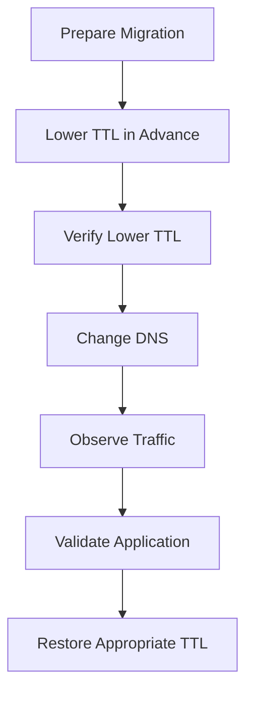

# 02- DNS Changes and Caching Issues

## Overview

DNS changes are frequently misunderstood because Route 53 updates its authoritative DNS data quickly, while recursive resolvers, operating systems, browsers, and applications may continue using cached responses.

A production DNS change therefore has two different states:

```text
Route 53 Authoritative State
            │
            ▼
     Recursive Resolver
            │
            ▼
       Client Cache
            │
            ▼
       Application
```

A record can already be correct in Route 53 while users continue receiving the previous value.

The correct troubleshooting model is:

```text
Configuration changed
        │
        ▼
Authoritative DNS updated?
        │
        ▼
Recursive resolver cache expired?
        │
        ▼
Client cache expired?
        │
        ▼
Application using fresh DNS result?
```

Understanding these layers is essential when performing production migrations, failovers, blue/green deployments, domain changes, and infrastructure changes.

---

## DNS Caching Layers

DNS responses can be cached at multiple levels.

| Layer | Example | Typical control |
|---|---|---|
| Browser | Chrome/Firefox DNS behavior | Browser/application |
| Operating system | Local resolver cache | OS |
| Corporate DNS | Enterprise resolver | Network administrator |
| ISP resolver | ISP recursive DNS | ISP |
| Public resolver | Cloudflare/Google DNS | Resolver operator |
| Route 53 | Authoritative DNS | AWS / zone configuration |

The important distinction is that **Route 53 authoritative DNS is not the same thing as the recursive resolver used by a client**.

For example:

```text
Client
  │
  │ Query api.example.com
  ▼
Recursive Resolver
  │
  │ Cached old answer?
  ├─────────────── Yes ──────────────► Return old answer
  │
  └─────────────── No
                    │
                    ▼
            Route 53 Authoritative DNS
                    │
                    ▼
              Return new answer
```

This explains why two users can temporarily receive different DNS answers.

---

## Authoritative DNS vs Recursive DNS

### Authoritative DNS

Route 53 hosted zones contain authoritative DNS information.

For example:

```text
api.example.com → ALB
```

When Route 53 serves the record authoritatively, it represents the current configured DNS state.

Query an authoritative nameserver directly:

```bash
dig @ns-123.awsdns-45.com api.example.com
```

The actual nameserver must be replaced with one authoritative for the domain.

### Recursive DNS

A recursive resolver retrieves DNS information on behalf of clients and caches the response.

Examples include:

- Enterprise DNS resolvers
- ISP resolvers
- Google Public DNS
- Cloudflare DNS
- Cloud provider DNS resolvers

A recursive resolver may return an older answer until the cached record's TTL expires.

---

## TTL and Cache Lifetime

TTL, or Time To Live, determines how long a DNS response may be cached.

Example:

```text
api.example.com
TTL = 300
```

A resolver receiving this response can cache it for approximately 300 seconds.

The simplified lifecycle is:

```text
Route 53
   │
   │ Answer + TTL=300
   ▼
Resolver
   │
   │ Cache for up to 300 seconds
   ▼
Client
```

TTL should be considered part of the operational design of a DNS record.

### Common TTL Choices

| TTL | Typical use | Operational characteristic |
|---|---|---|
| 30–60 seconds | Highly dynamic routing | Faster changes, more DNS queries |
| 300 seconds | Common production balance | Moderate caching |
| 900–3600 seconds | Relatively stable records | Better caching, slower changes |
| 86400 seconds | Very stable records | Long cache lifetime |

These are engineering guidelines rather than mandatory values.

A lower TTL does not guarantee instantaneous propagation because clients and intermediate systems can behave differently, and some applications may cache DNS independently.

---

## Why DNS Changes Are Not Instantaneous

Suppose the original configuration is:

```text
api.example.com
        │
        ▼
10.0.10.10
```

You change it to:

```text
api.example.com
        │
        ▼
10.0.20.10
```

A recursive resolver that already cached `10.0.10.10` may continue returning that address until the cached TTL expires.

The resulting state can temporarily look like:

```text
                    ┌── Resolver A → 10.0.10.10
Route 53 → New DNS ─┤
                    └── Resolver B → 10.0.20.10
```

This is expected DNS behavior.

The mistake is assuming that changing the authoritative record automatically invalidates every recursive cache.

---

## How to Verify Whether Route 53 Has the New Value

Start with the authoritative configuration.

Inspect the Route 53 record:

```bash
aws route53 list-resource-record-sets \
  --hosted-zone-id Z123456789EXAMPLE \
  --query "ResourceRecordSets[?Name=='api.example.com.']"
```

Then query DNS:

```bash
dig api.example.com
```

For a concise result:

```bash
dig +short api.example.com
```

If the public resolver returns an unexpected answer, query the authoritative nameserver directly.

```bash
dig @ns-123.awsdns-45.com api.example.com
```

The comparison is critical:

```text
Route 53 configuration
        │
        ▼
Authoritative DNS
        │
        ├── New value
        │
        ▼
Recursive resolver
        │
        └── Old value
```

This strongly suggests caching rather than an incorrect Route 53 record.

---

## Comparing Multiple Recursive Resolvers

When diagnosing caching issues, query multiple resolvers.

```bash
dig @1.1.1.1 api.example.com
dig @8.8.8.8 api.example.com
```

You can compare:

- Returned address
- TTL
- Response status
- Record type
- Authority section

For example:

```text
Resolver A → 10.0.10.10
Resolver B → 10.0.20.10
Authoritative → 10.0.20.10
```

This indicates that resolver A may still have a cached response.

If all resolvers return the old value while the authoritative nameserver also returns the old value, the Route 53 configuration or delegation should be investigated instead.

---

## `dig` for DNS Cache Investigation

### Full Response

```bash
dig api.example.com
```

### Short Answer

```bash
dig +short api.example.com
```

### Specific Record Type

```bash
dig api.example.com A
```

### Check Nameservers

```bash
dig example.com NS
```

### Trace Delegation

```bash
dig +trace api.example.com
```

### Query Cloudflare Resolver

```bash
dig @1.1.1.1 api.example.com
```

### Query Google Resolver

```bash
dig @8.8.8.8 api.example.com
```

### Query an Authoritative Nameserver

```bash
dig @ns-123.awsdns-45.com api.example.com
```

---

## Reading the TTL

A response may look conceptually like:

```text
api.example.com.  300  IN  A  10.0.20.10
```

The important values are:

```text
Name       → api.example.com
TTL        → 300
Class      → IN
Type       → A
Value      → 10.0.20.10
```

The TTL shown by a recursive resolver can decrease as the cached response ages.

For example:

```text
Initial response: 300
Later response:   240
Later response:   120
Later response:    20
```

This provides useful evidence that the resolver is serving a cached response.

---

## DNS Propagation

"Propagation" is commonly used to describe the period during which different DNS resolvers may return different answers.

A more precise model is:

```text
Route 53 authoritative state
            │
            ▼
Existing recursive caches
            │
            ▼
TTL expiration
            │
            ▼
Resolvers refresh
            │
            ▼
New DNS answer becomes common
```

There is no single global DNS cache that Route 53 needs to "push" the update into.

The behavior depends on:

- Existing cache state
- TTL
- Recursive resolver behavior
- Negative caching
- Local caches
- Application-level DNS caching
- DNS delegation

---

## Reducing TTL Before a Planned Change

For a high-risk migration, you may reduce TTL before changing the record.

For example:

```text
Normal TTL
    3600 seconds
        │
        ▼
Before migration
     300 seconds
        │
        ▼
Perform DNS change
        │
        ▼
Observe traffic
        │
        ▼
Restore appropriate TTL
```

The critical detail is timing.

Changing TTL immediately before the DNS change does not necessarily help if resolvers already cached the previous record with the old, higher TTL.

A safer migration process is:

1. Reduce TTL well before the planned change.
2. Allow the previous TTL window to pass.
3. Verify the lower TTL is being observed.
4. Perform the DNS change.
5. Monitor traffic and errors.
6. Restore the appropriate TTL after stabilization.

---

## TTL Reduction Does Not Flush Existing Caches

This is a common production misconception.

Suppose the record currently has:

```text
TTL = 3600
```

A resolver already cached that answer.

You immediately change Route 53 to:

```text
TTL = 60
```

The resolver that already has the old record may still retain the old answer for the remainder of its original cache lifetime.

The new TTL primarily affects newly retrieved responses.

Therefore:

```text
Existing cached response
        │
        └── Original TTL still applies

Newly fetched response
        │
        └── New TTL applies
```

---

## Planned DNS Migration

A production DNS migration should be treated as a traffic migration rather than merely a record update.

Example:



Before the migration:

- Confirm the target is healthy.
- Confirm TLS configuration.
- Confirm application readiness.
- Confirm monitoring.
- Confirm rollback procedure.
- Reduce TTL sufficiently in advance.
- Confirm the new target independently.

---

## Blue/Green DNS Migration

A DNS-based blue/green deployment may look like:

```text
                 Route 53
                    │
                    ▼
             api.example.com
                    │
             ┌──────┴──────┐
             │             │
             ▼             ▼
          Blue           Green
       Version A       Version B
```

Before switching traffic, validate Green independently.

For example:

```bash
curl -H "Host: api.example.com" https://green-endpoint.example.internal/health
```

The exact validation mechanism depends on the architecture.

Do not use DNS as a substitute for application validation.

---

## Weighted DNS Changes

Route 53 weighted routing can be used for gradual traffic migration.

Example:

```text
api.example.com

Blue   → weight 90
Green  → weight 10
```

Then:

```text
Blue   → 70
Green  → 30
```

Then:

```text
Blue   → 0
Green  → 100
```

However, DNS-level weights do not guarantee exact HTTP traffic percentages.

Recursive caching can cause clients to continue using a previously selected DNS response.

Therefore:

```text
Configured DNS weight
        ≠
Exact application traffic percentage
```

For precise request-level traffic shifting, application-layer or load-balancer-based mechanisms may be more appropriate.

---

## Failover and Cached DNS Answers

DNS failover has the same caching limitation.

Suppose:

```text
Primary
   │
   ▼
api.example.com
```

becomes unhealthy.

Route 53 can determine that the primary should no longer be returned and select the secondary.

However, clients using resolvers that already cached the primary answer may continue reaching it until the cached response expires.

Therefore:

```text
Health check detects failure
          │
          ▼
Route 53 changes eligible response
          │
          ▼
Recursive caches expire
          │
          ▼
Clients receive secondary
```

DNS failover should therefore be designed with realistic recovery expectations.

---

## Negative Caching

DNS caching also applies to failed lookups.

For example:

```bash
dig api.example.com
```

may return:

```text
status: NXDOMAIN
```

A recursive resolver can cache negative responses according to DNS negative caching rules.

This creates a common failure sequence:

```text
Record does not exist
        │
        ▼
Resolver caches NXDOMAIN
        │
        ▼
Engineer creates record
        │
        ▼
Resolver may still return NXDOMAIN
```

The record can already exist in Route 53 while some clients continue receiving `NXDOMAIN`.

Inspect the SOA information:

```bash
dig api.example.com
```

and examine the authority section.

---

## Troubleshooting `NXDOMAIN`

When a record does not resolve:

```bash
dig api.example.com
```

check the response status.

If:

```text
status: NXDOMAIN
```

investigate:

1. Does the record exist in Route 53?
2. Is the correct hosted zone being modified?
3. Is the zone public or private?
4. Is the domain delegated to Route 53?
5. Does the authoritative nameserver return `NXDOMAIN`?
6. Could the recursive resolver have cached an earlier negative response?
7. Was the record recently created?

Query the authoritative server directly when possible.

---

## Local DNS Cache

Even after recursive resolvers have updated, a local system may still have cached DNS information.

The exact cache mechanism depends on the operating system and network configuration.

For example, on Windows:

```powershell
ipconfig /flushdns
```

On Linux, the behavior depends on whether the system uses:

- `systemd-resolved`
- `dnsmasq`
- NetworkManager
- Another local resolver

A browser or application may also maintain its own DNS cache.

The important diagnostic principle is:

> Test the DNS layer independently before assuming the local machine represents global DNS behavior.

---

## Application-Level DNS Caching

Backend applications can introduce another caching layer.

For example:

```text
FastAPI / Django
       │
       ▼
HTTP client
       │
       ▼
DNS resolver
       │
       ▼
Recursive DNS
```

Some libraries, runtimes, connection pools, proxies, or service meshes can retain resolved addresses beyond the behavior expected from basic DNS queries.

This becomes particularly important when applications maintain long-lived connections.

Examples include:

- HTTP keep-alive
- gRPC channels
- Database connections
- Service mesh sidecars
- Connection pools

A DNS change does not necessarily terminate existing TCP connections.

---

## Long-Lived Connections

Suppose:

```text
api.example.com
      │
      ▼
10.0.10.10
```

A client establishes a connection.

Later, DNS changes:

```text
api.example.com
      │
      ▼
10.0.20.10
```

The existing connection to `10.0.10.10` does not automatically move to `10.0.20.10`.

The client must establish a new connection and perform DNS resolution according to its networking behavior.

This matters for:

- gRPC
- HTTP/2
- WebSockets
- Long-lived HTTP clients
- Database connections
- Service-to-service communication

DNS changes should therefore not be treated as an instantaneous connection migration mechanism.

---

## DNS and Connection Pools

Backend applications commonly use connection pools.

For example:

```text
FastAPI
  │
  ▼
HTTP Client Pool
  │
  ├── Connection → Old Target
  ├── Connection → Old Target
  └── New Connection → New Target
```

After a DNS migration, some connections may continue using the old destination until they are closed or recreated.

This is one reason load balancers are often preferable to directly switching application IP addresses.

With:

```text
Route 53
   │
   ▼
Stable ALB
   │
   ▼
Changing application targets
```

the DNS endpoint remains stable while backend instances change behind the load balancer.

---

## DNS Changes and Kubernetes

Kubernetes environments frequently use DNS automation.

A common flow is:

```text
Ingress
   │
   ▼
ExternalDNS
   │
   ▼
Route 53
```

When a Kubernetes resource changes, ExternalDNS may update Route 53 records.

Troubleshooting unexpected changes requires checking:

```text
Kubernetes resource
        │
        ▼
ExternalDNS
        │
        ▼
IAM permissions
        │
        ▼
Route 53
```

Useful investigation areas include:

- Controller logs
- Kubernetes resource state
- Hosted-zone filters
- Domain filters
- IAM permissions
- Ownership records
- Recent deployments

A manual Route 53 correction may be overwritten by the controller if the underlying Kubernetes state remains unchanged.

---

## Infrastructure as Code and DNS Drift

DNS records should normally have a clearly defined source of truth.

For example:

```text
Git
 │
 ▼
Terraform
 │
 ▼
Route 53
```

If someone changes Route 53 manually:

```text
Git state      → Old configuration
Route 53       → New configuration
```

the environment has drift.

A subsequent deployment may revert the manual change.

When investigating a DNS issue, determine whether the record is managed by:

- Terraform
- CloudFormation
- CDK
- ExternalDNS
- CI/CD scripts
- Manual console changes

---

## Checking Recent DNS Changes

When a DNS incident begins immediately after a deployment, correlate the timeline.

Useful evidence includes:

```text
DNS change time
Deployment time
Infrastructure change time
Application error time
Health-check failure time
```

CloudTrail can help identify Route 53 API operations such as:

```text
ChangeResourceRecordSets
```

A useful incident timeline might look like:

```text
10:00  Application deployment
10:02  Route 53 record changed
10:03  Error rate increases
10:04  Health check fails
10:05  DNS investigation begins
```

Correlation does not prove causation, but it provides a strong starting point for investigation.

---

## Cache-Related Failure Signatures

| Symptom | Likely cause |
|---|---|
| Authoritative DNS returns new value, public resolver returns old value | Recursive cache |
| Different resolvers return different answers | Cache differences or DNS configuration |
| DNS works on one machine but not another | Local/network/application cache |
| Record created but `NXDOMAIN` persists | Negative caching or wrong delegation |
| Route 53 shows new target but application still reaches old target | DNS cache or long-lived connections |
| TTL changed but old answer remains | Existing cache still uses previous TTL |
| DNS changed but gRPC clients remain on old backend | Long-lived connection/channel |
| Manual Route 53 change gets reverted | IaC/controller reconciliation |
| Failover does not immediately move all traffic | DNS caching |

---

## A Practical Investigation Example

Suppose:

```text
api.example.com
```

was changed from:

```text
old-alb.example.com
```

to:

```text
new-alb.example.com
```

but some users still reach the old ALB.

Start with:

```bash
dig api.example.com
```

Then query multiple resolvers:

```bash
dig @1.1.1.1 api.example.com
dig @8.8.8.8 api.example.com
```

Then query the authoritative nameserver:

```bash
dig @ns-123.awsdns-45.com api.example.com
```

Suppose the results are:

```text
Authoritative → new-alb.example.com
Cloudflare    → new-alb.example.com
Google        → old-alb.example.com
```

The evidence suggests that Google DNS still has a cached response.

Next, inspect TTL behavior and determine whether the resolver's cached response is still within the expected lifetime.

Do not immediately change Route 53 again.

---

## Production Migration Checklist

Before changing a critical DNS record:

- [ ] Confirm the correct hosted zone.
- [ ] Confirm public vs private DNS.
- [ ] Verify nameserver delegation.
- [ ] Verify the new target independently.
- [ ] Verify TLS for the target hostname.
- [ ] Confirm monitoring and alerting.
- [ ] Confirm rollback procedure.
- [ ] Reduce TTL in advance when appropriate.
- [ ] Allow enough time for the old TTL to age out.
- [ ] Perform the change during a controlled window when appropriate.
- [ ] Monitor both DNS and application metrics.
- [ ] Query multiple recursive resolvers.
- [ ] Verify the authoritative answer.
- [ ] Watch for long-lived client connections.
- [ ] Restore the desired TTL after stabilization.
- [ ] Reconcile the change into infrastructure as code.

---

## Rollback Strategy

DNS rollback should be prepared before the migration.

Example:

```text
Current
api.example.com → Blue

Migration
api.example.com → Green

Rollback
api.example.com → Blue
```

A rollback is not necessarily instantaneous for every client because recursive caches may continue serving the Green answer.

Therefore, the rollback plan should include:

- Expected DNS TTL.
- Application health monitoring.
- Target capacity on the old environment.
- Verification from multiple resolvers.
- Connection draining where applicable.
- Communication of expected recovery behavior.

Do not scale down the old environment immediately after a DNS switch if clients may still be using cached answers.

---

## Security Considerations

DNS changes are production infrastructure changes and should be treated accordingly.

Use:

- Least-privilege IAM policies.
- Separate deployment roles.
- MFA and strong authentication for privileged human access.
- CloudTrail auditing.
- Infrastructure-as-code review.
- Change approvals for critical zones.
- Restricted DNS automation permissions.

Avoid giving an application or controller unrestricted permissions such as the ability to modify every Route 53 hosted zone in the account when only one zone is required.

A DNS compromise can redirect legitimate application traffic to an attacker-controlled destination, making Route 53 configuration security a critical production concern.

---

## Reliability Considerations

DNS caching must be incorporated into recovery-time expectations.

For example, if a service has:

```text
DNS TTL = 300 seconds
```

you should not automatically promise that all clients will switch destinations within exactly five minutes.

Recovery behavior can also depend on:

- Existing cached responses.
- Negative caching.
- Client DNS behavior.
- Application DNS caching.
- Long-lived connections.
- Resolver behavior.
- Health-check detection time.

DNS should therefore be only one component of the overall failover architecture.

---

## Performance Considerations

Lower TTLs can increase the frequency with which recursive resolvers need to refresh records.

Conceptually:

```text
Lower TTL
   │
   ├── Faster DNS change visibility
   │
   └── More frequent DNS lookups

Higher TTL
   │
   ├── Better cache efficiency
   │
   └── Slower DNS change visibility
```

For stable production endpoints, unnecessarily low TTLs may provide little value.

For migration-sensitive endpoints, shorter TTLs can provide better operational flexibility.

Choose TTL based on actual change frequency, failure-recovery requirements, and architecture rather than using the lowest possible value everywhere.

---

## Common Mistakes

### Assuming Route 53 Updates Flush DNS Caches

They do not.

Route 53 changes authoritative DNS state. Recursive caches continue according to their cached TTL.

### Lowering TTL After the Change

If the old answer was already cached with a long TTL, lowering the new record's TTL does not retroactively shorten those cached entries.

Lower the TTL **before** the migration and allow the old cache window to expire.

### Calling Every DNS Delay "Propagation"

A better diagnosis distinguishes:

- Authoritative state.
- Recursive caching.
- Negative caching.
- Local caching.
- Application caching.

### Removing the Old Backend Immediately

Clients may still use the old DNS answer or existing connections.

Keep the old target available for an appropriate transition period.

### Testing Only `dig` from One Machine

A local resolver may have cached information.

Compare:

```bash
dig @1.1.1.1 api.example.com
dig @8.8.8.8 api.example.com
```

and, when necessary, query the authoritative nameserver directly.

### Changing DNS During an Incident Without Capturing State

This can make the original failure difficult to reconstruct.

Capture:

```bash
dig api.example.com
dig +trace api.example.com
```

and the Route 53 record configuration before making emergency changes when time permits.

### Ignoring IaC

A manual fix can be overwritten by the next Terraform, CloudFormation, CDK, or ExternalDNS reconciliation.

Identify the source of truth first.

---

## Interview Traps

### "Why do users still see the old IP after changing Route 53?"

Because recursive resolvers and clients may have cached the old DNS response until its TTL expires.

### "If I lower the TTL now, will old cached records disappear?"

No. Existing cached responses can retain the TTL they received when they were cached.

### "How do you prove that Route 53 has the correct value?"

Query the authoritative nameserver directly and compare it with recursive resolvers:

```bash
dig @authoritative-nameserver api.example.com
dig @1.1.1.1 api.example.com
```

### "Can DNS failover immediately move every client to the secondary?"

No. Route 53 can change the authoritative answer, but cached DNS responses may continue sending clients to the previous destination.

### "Why can a gRPC client still communicate with the old service after DNS changes?"

The existing gRPC channel may maintain a long-lived connection to the previous destination. DNS changes do not automatically terminate or migrate established connections.

---

## Key Takeaways

The most important distinction in DNS troubleshooting is:

```text
Route 53 authoritative state
        ≠
Recursive resolver state
        ≠
Client/application state
```

A production DNS change should account for all three.

Remember:

- Route 53 changes authoritative DNS data.
- Recursive resolvers cache responses according to TTL.
- Existing cached responses are not retroactively modified when TTL changes.
- Negative DNS responses can also be cached.
- Local applications and long-lived connections can introduce additional caching behavior.
- DNS failover is not instantaneous for every client.
- Lower TTLs should generally be introduced before planned migrations.
- DNS weights do not guarantee exact request-level traffic percentages.
- IaC and DNS controllers can overwrite manual changes.
- Always compare authoritative DNS with multiple recursive resolvers when investigating unexpected results.
- Keep old infrastructure available long enough to account for cached DNS answers and existing connections.

The senior-level approach is to treat DNS changes as a **distributed state transition** rather than a single configuration update:

```text
Change authoritative DNS
          ↓
Wait for cached state to expire
          ↓
Observe resolver behavior
          ↓
Observe client/application behavior
          ↓
Validate traffic
          ↓
Complete migration or rollback
```