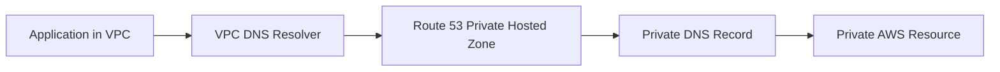
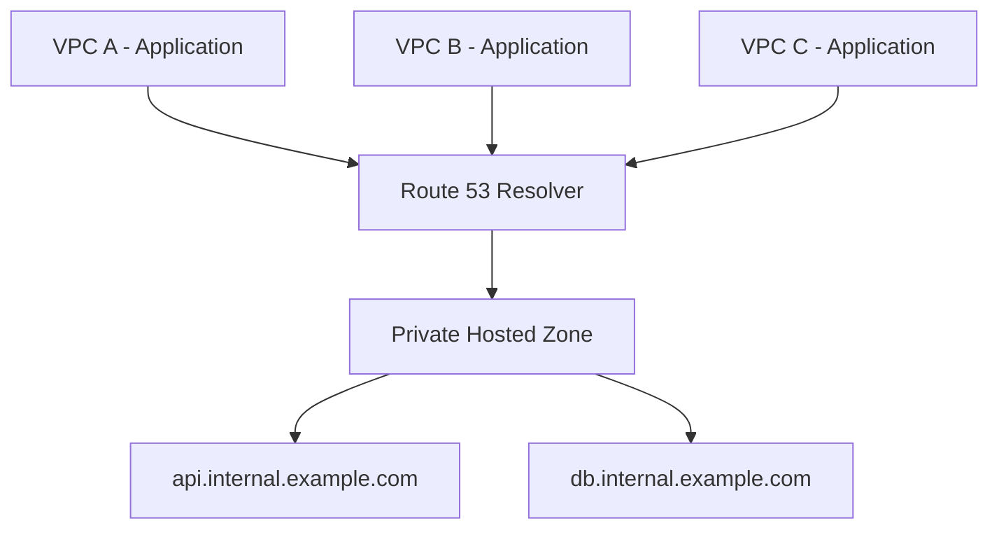
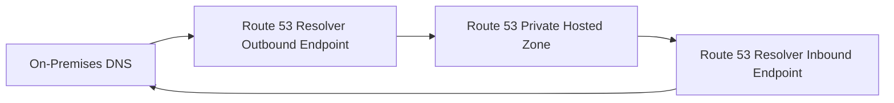
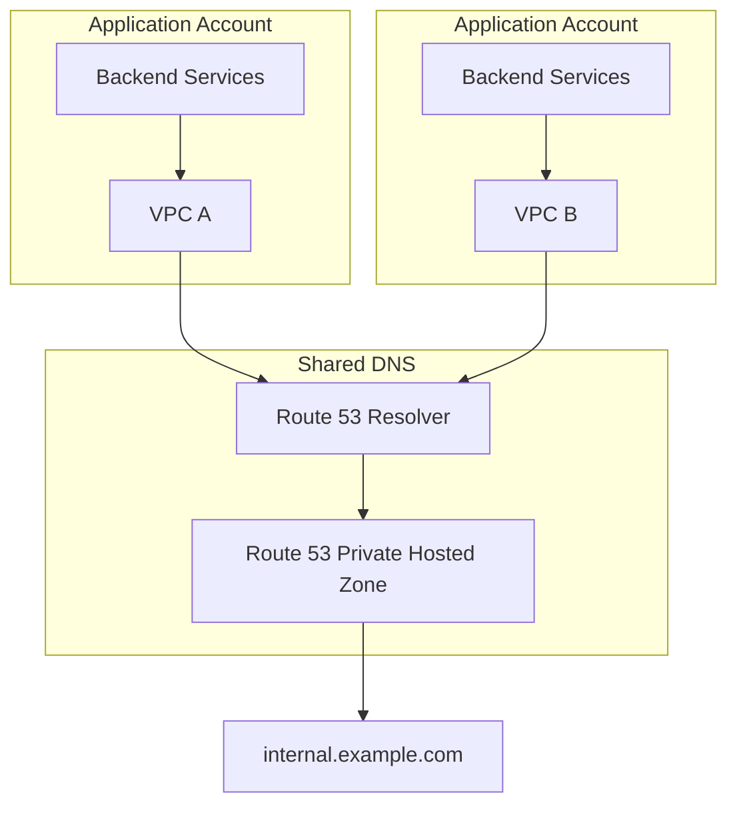

# 03- Private Hosted Zone Resolution Issues

## Overview

Amazon Route 53 Private Hosted Zones provide DNS resolution for resources inside associated VPCs. They are commonly used for internal service discovery, private application endpoints, databases, internal load balancers, and environment-specific service names.

A private hosted zone does not automatically make DNS records resolvable from every network connected to AWS. Resolution depends on the relationship between:

```text
Client
  │
  ▼
VPC DNS Resolver
  │
  ├── VPC DNS settings
  │
  ├── Private Hosted Zone association
  │
  ├── Resolver rules
  │
  └── Network connectivity
          │
          ▼
   Private Hosted Zone
          │
          ▼
       DNS record
```

Most private DNS incidents are caused by one of these conditions:

- The hosted zone is not associated with the VPC.
- VPC DNS support or DNS hostnames are disabled.
- The client is querying the wrong resolver.
- A conflicting private hosted zone exists.
- Route 53 Resolver rules route the query somewhere else.
- Hybrid DNS forwarding is incorrectly configured.
- The network path exists, but DNS resolution does not.
- The record exists in a different hosted zone.
- The application uses cached or stale DNS information.
- Infrastructure automation changed or removed the association.

The senior-level troubleshooting approach is to separate **DNS configuration**, **DNS resolution path**, and **network connectivity** rather than treating them as one problem.

---

## Private Hosted Zone Resolution Model

A typical private DNS architecture looks like:



For example:

```text
db.internal.example.com
        │
        ▼
10.20.30.50
```

The record is available only through DNS resolution paths that can reach the private hosted zone.

A private hosted zone is associated with one or more VPCs. Queries originating from an associated VPC can be resolved using the records in that zone.

---

## VPC DNS Requirements

Two VPC-level DNS attributes are fundamental:

- DNS support
- DNS hostnames

Check the VPC attributes:

```bash
aws ec2 describe-vpc-attribute \
  --vpc-id vpc-0123456789abcdef0 \
  --attribute enableDnsSupport
```

```bash
aws ec2 describe-vpc-attribute \
  --vpc-id vpc-0123456789abcdef0 \
  --attribute enableDnsHostnames
```

For normal Route 53 private DNS operation, these settings should be enabled.

A common production baseline is:

```text
enableDnsSupport   = true
enableDnsHostnames = true
```

If DNS support is disabled, the VPC's DNS resolution behavior is fundamentally broken.

---

## VPC DNS Resolver

AWS provides a DNS resolver inside each VPC.

The commonly used resolver address is:

```text
VPC network address + 2
```

For example, for:

```text
10.20.0.0/16
```

the resolver is typically:

```text
10.20.0.2
```

Applications generally use the DNS configuration supplied through the VPC and subnet networking rather than manually configuring Route 53 nameservers.

Inspect `/etc/resolv.conf` on a Linux host:

```bash
cat /etc/resolv.conf
```

You may see a resolver address associated with the VPC.

A useful diagnostic is:

```bash
dig internal-api.example.com
```

If the query is unexpectedly sent to a custom DNS server, the problem may be outside Route 53 itself.

---

## Hosted Zone Association

A private hosted zone must be associated with the VPC from which queries are expected.

List hosted zones:

```bash
aws route53 list-hosted-zones
```

Inspect a specific zone:

```bash
aws route53 get-hosted-zone \
  --id /hostedzone/Z0123456789EXAMPLE
```

The response includes the VPC associations.

Conceptually:

```text
Private Hosted Zone
        │
        ├── VPC A
        ├── VPC B
        └── VPC C
```

A client in VPC D cannot automatically resolve the private zone merely because VPC A can.

---

## Verify the VPC Association

When DNS works in one VPC but not another, check the associations first.

```bash
aws route53 get-hosted-zone \
  --id /hostedzone/Z0123456789EXAMPLE \
  --query "VPCs"
```

Expected output should include the VPC where the client is running.

If the VPC is missing, associate it:

```bash
aws route53 associate-vpc-with-hosted-zone \
  --hosted-zone-id Z0123456789EXAMPLE \
  --vpc VPCRegion=ap-south-1,VPCId=vpc-0123456789abcdef0
```

The IAM principal performing the operation needs appropriate permissions, and the operation must comply with Route 53 private hosted zone association rules.

---

## Common Failure: Wrong VPC Association

Consider:

```text
Private Hosted Zone
internal.example.com
        │
        └── VPC-A

Application
        │
        └── VPC-B
```

The application queries:

```bash
dig api.internal.example.com
```

and receives:

```text
NXDOMAIN
```

The record may be completely correct.

The problem is that VPC-B is not associated with the private hosted zone.

The correct investigation is:

```text
Does record exist?
       │
       ▼
Is hosted zone private?
       │
       ▼
Is client VPC associated?
       │
       ▼
Is client using VPC DNS resolver?
```

---

## Private Hosted Zone vs Public Hosted Zone

A common source of confusion is having both public and private zones for the same domain.

For example:

```text
Public Hosted Zone
example.com
    │
    └── api.example.com → Public ALB

Private Hosted Zone
example.com
    │
    └── api.example.com → Internal ALB
```

A query originating inside an associated VPC can resolve using the private hosted zone.

This allows architectures such as:

```text
Internet
   │
   ▼
Public DNS
   │
   ▼
Public ALB

Internal VPC
   │
   ▼
Private DNS
   │
   ▼
Internal ALB
```

The same hostname can therefore represent different destinations depending on where the query originates.

This is powerful but can make troubleshooting confusing.

---

## Split-Horizon DNS

Using public and private zones with the same domain is commonly called split-horizon DNS.

Example:

```text
api.example.com

External client
      │
      ▼
Public DNS
      │
      ▼
Public endpoint

Internal client
      │
      ▼
VPC Resolver
      │
      ▼
Private DNS
      │
      ▼
Internal endpoint
```

This architecture is useful when internal applications should use private networking while external users use public infrastructure.

However, engineers must explicitly understand which DNS view a client receives.

---

## Troubleshooting Split-Horizon DNS

Suppose an EC2 instance returns:

```text
10.20.10.50
```

while your laptop returns:

```text
203.0.113.50
```

This may be completely intentional.

Check:

```bash
dig api.example.com
```

from both environments.

Then identify:

- Which resolver each client uses.
- Whether the client VPC is associated with the private zone.
- Whether the private and public zones have the same domain.
- Whether the records differ.
- Whether custom Resolver rules are involved.

Do not assume that different DNS answers indicate a Route 53 failure.

---

## Record Existence vs Zone Existence

A private hosted zone can exist while the expected record does not.

For example:

```text
Private Hosted Zone
internal.example.com

Records:
db.internal.example.com
cache.internal.example.com
```

The application queries:

```text
api.internal.example.com
```

The result may be:

```text
NXDOMAIN
```

Inspect records:

```bash
aws route53 list-resource-record-sets \
  --hosted-zone-id Z0123456789EXAMPLE
```

For a specific record:

```bash
aws route53 list-resource-record-sets \
  --hosted-zone-id Z0123456789EXAMPLE \
  --query "ResourceRecordSets[?Name=='api.internal.example.com.']"
```

---

## `dig` as the Primary Diagnostic Tool

From a host inside the VPC:

```bash
dig api.internal.example.com
```

For a concise result:

```bash
dig +short api.internal.example.com
```

Query a specific record type:

```bash
dig api.internal.example.com A
```

For CNAME records:

```bash
dig api.internal.example.com CNAME
```

For detailed troubleshooting:

```bash
dig api.internal.example.com
```

Pay attention to:

- `status`
- `SERVER`
- `ANSWER`
- `AUTHORITY`
- TTL
- Returned record type
- Returned address

The `SERVER` line is particularly useful when verifying which DNS resolver answered the request.

---

## Expected Successful Resolution

A successful response might resemble:

```text
;; ->>HEADER<<- opcode: QUERY, status: NOERROR

;; ANSWER SECTION:
api.internal.example.com. 60 IN A 10.20.10.25

;; SERVER:
10.20.0.2#53
```

The important evidence is:

```text
status = NOERROR
answer = expected record
server = VPC DNS resolver
```

---

## `NXDOMAIN` vs `SERVFAIL` vs Timeout

These outcomes indicate different classes of problems.

| Result | Meaning | Typical investigation |
|---|---|---|
| `NOERROR` with expected answer | Resolution works | Investigate application/network if request still fails |
| `NXDOMAIN` | Name does not exist in the DNS view | Zone, record, association, delegation |
| `NOERROR` with no answer | Name exists but requested record type may not | Record type/configuration |
| `SERVFAIL` | Resolver could not complete resolution | Resolver rules, upstream DNS, DNSSEC, configuration |
| Timeout | Query/response path failed | Resolver configuration, network controls, custom DNS |

Do not treat every DNS failure as an `NXDOMAIN` problem.

---

## DNS Resolution Is Not Network Connectivity

Successful DNS resolution only proves that a name was mapped to an address.

It does not prove that the application can connect.

For example:

```text
api.internal.example.com
        │
        ▼
10.20.10.25
```

DNS works.

But:

```bash
curl https://api.internal.example.com
```

could still fail because of:

- Security groups
- Network ACLs
- Routing
- Load balancer configuration
- Target health
- TLS configuration
- Application failure
- Port restrictions

Troubleshoot in layers:

```text
DNS name
   │
   ▼
IP address
   │
   ▼
Network route
   │
   ▼
TCP connection
   │
   ▼
TLS
   │
   ▼
HTTP/gRPC
   │
   ▼
Application
```

---

## Testing the Resolved Address

After DNS resolution:

```bash
dig +short api.internal.example.com
```

Suppose:

```text
10.20.10.25
```

Test connectivity:

```bash
nc -vz 10.20.10.25 443
```

For HTTP:

```bash
curl -v https://api.internal.example.com/
```

This separates:

```text
DNS problem
```

from:

```text
Connectivity/application problem
```

---

## VPC Peering Does Not Automatically Solve DNS

VPC connectivity and DNS visibility are separate concerns.

Suppose:

```text
VPC-A
Private Hosted Zone
       │
       │
       ▼
VPC-B
Application
```

Even if VPC peering allows network connectivity, DNS resolution still needs an appropriate DNS architecture.

Depending on the design, this can involve:

- Private hosted zone association with multiple VPCs.
- Route 53 Resolver endpoints.
- Resolver forwarding rules.
- AWS RAM for sharing private hosted zones across accounts.
- Appropriate routing and security controls.

Do not assume:

```text
VPC connectivity = DNS connectivity
```

They are different layers.

---

## Multi-VPC Private DNS Architecture

A common production architecture is:



The private hosted zone can be associated with multiple VPCs where appropriate.

This is often simpler than deploying separate DNS infrastructure in every VPC.

---

## Multi-Account Architecture

Large organizations frequently separate workloads across AWS accounts.

For example:

```text
Shared Services Account
        │
        ▼
Private Hosted Zone
internal.example.com
        │
        ├─────────────┐
        ▼             ▼
Account A         Account B
VPC A             VPC B
```

AWS Resource Access Manager can be used to share private hosted zone resources across accounts where the architecture requires it.

When troubleshooting cross-account resolution, verify:

- Resource sharing.
- VPC association.
- Account ownership.
- Hosted zone identity.
- Region.
- IAM permissions.
- Resolver behavior.

---

## Cross-Region Resolution

A private hosted zone can be associated with VPCs in different AWS Regions, subject to Route 53 private hosted zone behavior and the required association configuration.

For example:

```text
Private Hosted Zone
        │
        ├── VPC Mumbai
        │
        ├── VPC Singapore
        │
        └── VPC Frankfurt
```

When diagnosing cross-region issues, do not assume that a record visible in one VPC is automatically visible everywhere.

Always verify the actual VPC association.

---

## Route 53 Resolver Rules

Private DNS resolution can be influenced by Route 53 Resolver rules.

Resolver rules are particularly important when integrating AWS DNS with external or corporate DNS.

Example:

```text
Application VPC
      │
      ▼
Route 53 Resolver
      │
      ├── AWS private zone
      │
      └── Forwarding rule
              │
              ▼
        Corporate DNS
```

A query may therefore not reach the private hosted zone if a forwarding rule sends it elsewhere.

---

## Custom DNS Servers

A frequent troubleshooting issue occurs when EC2, containers, or on-premises clients use a custom DNS server instead of the expected VPC resolver.

For example:

```text
Application
    │
    ▼
Corporate DNS
    │
    └── Does not know internal.example.com
```

while the expected path is:

```text
Application
    │
    ▼
VPC Resolver
    │
    ▼
Route 53 Private Hosted Zone
```

Inspect:

```bash
cat /etc/resolv.conf
```

Then test the expected resolver explicitly if appropriate:

```bash
dig @10.20.0.2 api.internal.example.com
```

If this succeeds while the default resolver fails, investigate the custom DNS configuration.

---

## On-Premises to Private Hosted Zone Resolution

Hybrid environments require explicit DNS architecture.

A typical design is:



The exact direction depends on which side owns the authoritative DNS namespace.

For example:

```text
onprem.example.com
```

may remain authoritative on corporate DNS, while:

```text
aws.internal.example.com
```

is authoritative in Route 53.

Resolver forwarding rules can connect these namespaces.

---

## Hybrid DNS Troubleshooting

When on-premises clients cannot resolve a private AWS name, investigate:

```text
On-prem client
      │
      ▼
Corporate DNS
      │
      ▼
Forwarding rule
      │
      ▼
Resolver endpoint
      │
      ▼
VPC DNS
      │
      ▼
Private Hosted Zone
```

Validate each hop.

Questions to answer:

- Is the corporate DNS forwarding the correct domain?
- Does the forwarding target resolve?
- Is the Resolver endpoint reachable?
- Are security groups permitting DNS traffic?
- Is the private hosted zone associated with the correct VPC?
- Does the record exist?
- Is the response returned to the original client?

---

## DNS Traffic Uses UDP and TCP

DNS commonly uses UDP port 53, but TCP port 53 is also required in some circumstances.

For Resolver endpoint architectures, security controls must account for the required DNS traffic.

A security group that allows only:

```text
UDP/53
```

may be insufficient for all DNS scenarios.

Where applicable, permit both:

```text
UDP/53
TCP/53
```

from only the required DNS clients or resolver infrastructure.

Avoid exposing DNS services broadly.

---

## Private Hosted Zone and Security Groups

Security groups do not normally control Route 53 private hosted zone record visibility.

They control network connectivity to resources such as:

- EC2
- Internal ALB
- RDS
- ECS services
- EKS services
- Resolver endpoints

For example:

```text
DNS resolution succeeds
        │
        ▼
10.20.10.25
        │
        ▼
Security Group denies TCP/443
```

The correct diagnosis is not a DNS failure.

---

## Private Hosted Zone Conflicts

Multiple private hosted zones can create confusing resolution behavior.

For example:

```text
Zone A:
example.com
api.example.com → 10.20.10.10

Zone B:
internal.example.com
api.internal.example.com → 10.20.20.10
```

Route 53 evaluates hosted zones based on the DNS name hierarchy and associated VPC context.

More-specific zones can take precedence over less-specific zones.

This means that simply finding "a matching hosted zone" is not enough.

You need to determine which zone is authoritative for the exact queried name.

---

## The Most-Specific Zone Principle

Consider:

```text
Private Zone A
example.com

Private Zone B
internal.example.com
```

For:

```text
api.internal.example.com
```

the more-specific namespace:

```text
internal.example.com
```

is relevant.

This can explain why an expected record in:

```text
example.com
```

is not being returned.

When troubleshooting, list private hosted zones associated with the VPC and check their names.

---

## Duplicate Private Hosted Zones

Organizations sometimes accidentally create multiple private hosted zones for the same domain.

For example:

```text
Zone 1
internal.example.com
VPC-A

Zone 2
internal.example.com
VPC-A
```

This can create confusing behavior and makes the DNS source of truth unclear.

Use:

```bash
aws route53 list-hosted-zones-by-vpc \
  --vpc-id vpc-0123456789abcdef0 \
  --vpc-region ap-south-1
```

This is a useful command when investigating which private hosted zones are associated with a VPC.

---

## Private DNS and ECS

ECS workloads may resolve private Route 53 names through the VPC DNS infrastructure.

A typical architecture:

```text
ECS Task
   │
   ▼
VPC DNS Resolver
   │
   ▼
Private Hosted Zone
   │
   ▼
Internal ALB
```

When an ECS application cannot resolve a private hostname, check:

- Task network mode.
- VPC configuration.
- Subnet.
- DNS attributes.
- Hosted zone association.
- Task-level DNS configuration.
- Container `/etc/resolv.conf`.
- Resolver rules.

---

## Private DNS and EKS

EKS workloads also depend on the underlying VPC DNS architecture.

For a pod:

```text
Pod
 │
 ▼
CoreDNS
 │
 ▼
VPC DNS / forwarding
 │
 ▼
Route 53 Private Hosted Zone
```

Kubernetes introduces another DNS layer.

Therefore:

```text
Pod DNS failure
```

does not necessarily mean:

```text
Route 53 failure
```

Test from inside the pod:

```bash
kubectl exec -it <pod-name> -- nslookup api.internal.example.com
```

Then compare with a direct query from the node or another VPC resource.

---

## Kubernetes CoreDNS Considerations

Kubernetes typically uses CoreDNS for cluster DNS.

The flow may therefore be:

```text
Application Pod
      │
      ▼
CoreDNS
      │
      ▼
VPC Resolver
      │
      ▼
Route 53 Private Hosted Zone
```

If CoreDNS is misconfigured, the private hosted zone may work correctly while pods cannot resolve it.

Investigate:

```bash
kubectl get pods -n kube-system
```

and:

```bash
kubectl logs -n kube-system -l k8s-app=kube-dns
```

Also inspect CoreDNS configuration:

```bash
kubectl get configmap coredns -n kube-system -o yaml
```

---

## Container DNS Troubleshooting

Inside a container:

```bash
cat /etc/resolv.conf
```

Then:

```bash
getent hosts api.internal.example.com
```

or:

```bash
nslookup api.internal.example.com
```

If the container cannot resolve the name but the underlying EC2 host can, investigate container DNS configuration.

For Docker-based workloads, verify:

- Container DNS configuration.
- Docker network.
- Custom DNS settings.
- `/etc/resolv.conf`.
- Host resolver behavior.

---

## Private Hosted Zone Resolution Checklist

When a private DNS name fails:

```text
1. Identify client VPC
        │
        ▼
2. Verify VPC DNS support
        │
        ▼
3. Verify VPC DNS hostnames
        │
        ▼
4. Verify private hosted zone association
        │
        ▼
5. Verify record exists
        │
        ▼
6. Verify resolver used by client
        │
        ▼
7. Check Resolver rules
        │
        ▼
8. Check DNS response
        │
        ▼
9. Check network connectivity
        │
        ▼
10. Check application behavior
```

This ordering prevents wasting time on application debugging when the DNS record itself is not being resolved.

---

## A Practical Troubleshooting Procedure

### Identify the Client Location

Determine:

- AWS account.
- VPC.
- Region.
- Subnet.
- EC2/ECS/EKS/on-premises environment.
- Container or host.
- DNS resolver.

For EC2, inspect instance metadata or infrastructure configuration to identify the VPC and subnet.

---

### Verify VPC DNS Settings

```bash
aws ec2 describe-vpc-attribute \
  --vpc-id vpc-0123456789abcdef0 \
  --attribute enableDnsSupport
```

```bash
aws ec2 describe-vpc-attribute \
  --vpc-id vpc-0123456789abcdef0 \
  --attribute enableDnsHostnames
```

Both should normally be enabled for standard private DNS resolution.

---

### Find Associated Private Hosted Zones

```bash
aws route53 list-hosted-zones-by-vpc \
  --vpc-id vpc-0123456789abcdef0 \
  --vpc-region ap-south-1
```

Confirm that the expected private namespace is present.

---

### Verify the Record

```bash
aws route53 list-resource-record-sets \
  --hosted-zone-id Z0123456789EXAMPLE \
  --query "ResourceRecordSets[?Name=='api.internal.example.com.']"
```

Check:

- Name.
- Type.
- Value.
- Alias configuration.
- TTL.
- Routing policy.

---

### Query From the Actual Workload

Do not rely exclusively on your workstation.

Run:

```bash
dig api.internal.example.com
```

from the actual application environment.

If possible:

```bash
dig +short api.internal.example.com
```

---

### Verify the Resolver

```bash
cat /etc/resolv.conf
```

Then inspect the DNS server shown by:

```bash
dig api.internal.example.com
```

A typical AWS workload should use the VPC-provided DNS resolver unless the architecture intentionally uses custom DNS.

---

### Test the VPC Resolver Directly

For a VPC using:

```text
10.20.0.0/16
```

test:

```bash
dig @10.20.0.2 api.internal.example.com
```

If this works but the application's configured resolver does not, the issue is likely in the custom DNS path.

---

### Test Network Connectivity

Once DNS returns an IP:

```bash
nc -vz 10.20.10.25 443
```

For HTTPS:

```bash
curl -v https://api.internal.example.com
```

This separates DNS from transport-layer problems.

---

## Failure Matrix

| Symptom | Most likely area | First check |
|---|---|---|
| `NXDOMAIN` from VPC | Zone/record/association | Private zone and record |
| `SERVFAIL` | Resolver/configuration | Resolver rules and DNS path |
| Timeout | Resolver/network | DNS server and network path |
| DNS works in VPC-A but not VPC-B | Association | Private zone VPC associations |
| Host works but pod fails | Kubernetes DNS | CoreDNS |
| EC2 works but container fails | Container DNS | `/etc/resolv.conf` |
| AWS works but on-prem fails | Hybrid DNS | Resolver endpoints/rules |
| DNS resolves but curl fails | Network/application | SG, routing, TLS, target |
| Private and public clients get different answers | Split-horizon DNS | Public/private zones |
| Expected record ignored | Zone conflict | More-specific private zone |
| DNS works manually but app fails | Application resolver/cache | Runtime/client behavior |

---

## Production Architecture Pattern

A robust multi-VPC environment might look like:



The important design principle is to establish a clear DNS ownership model.

For example:

```text
Git / IaC
   │
   ▼
Shared DNS module
   │
   ▼
Private Hosted Zone
   │
   ├── Service records
   ├── Database records
   └── Internal endpoints
```

Avoid allowing every application team to independently create overlapping private zones for the same namespace.

---

## Infrastructure as Code Considerations

Private hosted zones should normally be managed through a controlled source of truth such as Terraform, CloudFormation, or CDK.

Conceptually:

```text
Infrastructure Code
       │
       ▼
Hosted Zone
       │
       ├── VPC associations
       └── DNS records
```

A common production failure is manually associating a VPC and later having an infrastructure deployment remove the association.

When troubleshooting, determine whether the configuration is controlled by:

- Terraform.
- CloudFormation.
- CDK.
- CI/CD.
- AWS RAM.
- ExternalDNS.
- Manual changes.

---

## Monitoring and Observability

DNS should be observable as part of the application's dependency chain.

Useful signals include:

- DNS resolution failures.
- Application connection failures.
- Service discovery failures.
- Resolver endpoint health.
- CoreDNS errors in Kubernetes.
- Route 53 health checks where applicable.
- Application latency after endpoint changes.

For critical internal services, synthetic checks can periodically resolve important names:

```text
api.internal.example.com
db.internal.example.com
cache.internal.example.com
```

The check should ideally validate both:

```text
DNS resolution
       +
TCP/application connectivity
```

because successful DNS resolution alone does not prove service availability.

---

## Security Considerations

Private DNS should remain private.

Use:

- Least-privilege IAM permissions.
- Restricted hosted-zone modification permissions.
- Controlled VPC associations.
- Restricted Resolver endpoint security groups.
- CloudTrail auditing.
- Infrastructure-as-code review.
- Centralized DNS ownership where appropriate.

Avoid allowing arbitrary workloads to modify shared private DNS zones.

A compromised DNS record can redirect internal traffic to an unintended destination just as a public DNS compromise can redirect external traffic.

---

## Reliability Considerations

Private DNS is part of the service dependency chain.

If:

```text
Application
   │
   ▼
DNS
   │
   ▼
Service
```

DNS becomes unavailable or misconfigured, service discovery can fail even when the target service itself is healthy.

For critical environments:

- Avoid unnecessary custom DNS dependencies.
- Use highly available Resolver endpoint architectures for hybrid DNS.
- Maintain clear ownership of private hosted zones.
- Monitor DNS resolution failures.
- Test cross-VPC and cross-account resolution.
- Document DNS forwarding paths.
- Keep infrastructure changes version controlled.

---

## Performance Considerations

DNS resolution is normally inexpensive because resolvers cache responses.

However, unnecessarily bypassing caching or introducing multiple DNS forwarding layers can increase latency and operational complexity.

A complicated path might look like:

```text
Application
    │
    ▼
CoreDNS
    │
    ▼
Corporate DNS
    │
    ▼
Resolver Endpoint
    │
    ▼
VPC Resolver
    │
    ▼
Private Hosted Zone
```

Every additional DNS component introduces another potential failure point.

Prefer the simplest architecture that satisfies the organization's:

- Network boundaries.
- Security requirements.
- Multi-account design.
- Hybrid connectivity requirements.
- DNS ownership model.

---

## Disaster Recovery Considerations

Private DNS should be included in disaster recovery testing.

A DR environment may use:

```text
Production VPC
      │
      └── api.internal.example.com
             │
             ▼
        Production ALB

DR VPC
      │
      └── api.internal.example.com
             │
             ▼
           DR ALB
```

Verify that:

- The DR VPC has the expected private zone association.
- Required records exist.
- Resolver rules are available.
- Cross-account sharing remains functional.
- Applications can resolve the expected names.
- DNS failover behavior is understood.
- Network connectivity exists to the resolved destination.

A DR environment that has healthy compute but broken DNS is not operationally ready.

---

## Common Mistakes

### Assuming a Private Hosted Zone Is Global

It is not automatically visible from every VPC.

Always verify VPC associations.

### Confusing VPC Connectivity With DNS Connectivity

VPC peering, Transit Gateway, or VPN connectivity does not by itself guarantee that private DNS names resolve.

DNS requires its own architecture.

### Testing From the Wrong Environment

A laptop resolving a public DNS record tells you little about whether an EC2 instance or EKS pod can resolve a private record.

Test from the actual workload.

### Forgetting Kubernetes CoreDNS

If DNS fails only inside EKS pods, investigate CoreDNS before changing Route 53 records.

### Ignoring Custom DNS

A workload may be configured to use a corporate or third-party resolver instead of the VPC resolver.

Inspect:

```bash
cat /etc/resolv.conf
```

### Assuming DNS Success Means Application Success

This:

```bash
dig api.internal.example.com
```

returning an IP does not prove:

```bash
curl https://api.internal.example.com
```

will work.

### Creating Multiple Overlapping Private Zones

Overlapping namespaces make resolution behavior difficult to reason about and can produce unexpected answers.

### Manually Fixing IaC-Managed DNS

A manual change may be reverted by the next infrastructure deployment.

### Ignoring Resolver Rules

Forwarding rules can change where queries go and are especially important in hybrid environments.

### Debugging Security Groups Before DNS

If the hostname does not resolve, investigating TCP/443 security groups is premature.

Resolve the layers in order.

---

## Interview Traps

### "Does a private hosted zone work from any VPC?"

No. The VPC must have an appropriate association or DNS architecture that provides access to the private namespace.

### "Does VPC peering automatically provide private DNS resolution?"

No. Network connectivity and DNS resolution are separate concerns.

### "What DNS resolver does an EC2 instance normally use?"

The VPC-provided DNS resolver is normally used unless the environment intentionally configures a different DNS path.

### "DNS resolves successfully but the API is unreachable. Is Route 53 broken?"

Not necessarily. DNS resolution and network/application connectivity are separate layers.

### "Why does DNS work on EC2 but fail inside an EKS pod?"

Kubernetes introduces CoreDNS and potentially additional forwarding behavior. The pod's DNS configuration and CoreDNS path should be investigated.

### "Why can internal and external users receive different answers for the same hostname?"

Split-horizon DNS can intentionally provide different answers through public and private hosted zones.

### "How would you troubleshoot a private DNS failure?"

Start from the actual workload:

```text
Client
  ↓
Resolver configuration
  ↓
VPC DNS
  ↓
Private hosted zone association
  ↓
Record
  ↓
Resolved IP
  ↓
Network connectivity
  ↓
Application
```

Do not jump directly to the application layer.

---

## Key Takeaways

Private Hosted Zone troubleshooting is primarily about understanding the **DNS resolution path**.

Remember:

- A Route 53 Private Hosted Zone must be associated with the relevant VPCs.
- VPC DNS support should normally be enabled.
- VPC DNS hostnames should normally be enabled.
- The actual workload should be used for DNS testing.
- `dig` is one of the most useful tools for diagnosing DNS behavior.
- `NXDOMAIN`, `SERVFAIL`, and timeouts represent different failure classes.
- Private DNS resolution and network connectivity are separate concerns.
- VPC peering or Transit Gateway connectivity does not automatically solve DNS.
- Split-horizon DNS can intentionally return different answers to internal and external clients.
- More-specific private DNS namespaces can affect which hosted zone answers a query.
- Route 53 Resolver rules can redirect DNS queries and are critical in hybrid environments.
- Kubernetes adds CoreDNS as another DNS layer.
- Custom DNS servers can bypass the expected VPC DNS path.
- Cross-account and multi-VPC environments require explicit DNS association and sharing architecture.
- DNS should have a clear source of truth and should normally be managed through infrastructure as code.
- Security groups, routing, TLS, and application health must be investigated separately after DNS resolution succeeds.

The senior-level troubleshooting model is:

```text
                    DNS Incident
                         │
                         ▼
              Identify the workload
                         │
                         ▼
               Identify its VPC
                         │
                         ▼
              Check VPC DNS settings
                         │
                         ▼
           Check private zone association
                         │
                         ▼
                 Check DNS record
                         │
                         ▼
             Check resolver configuration
                         │
                         ▼
              Check Resolver rules
                         │
                         ▼
                 Test with dig
                         │
                         ▼
              Verify resolved address
                         │
                         ▼
             Test network connectivity
                         │
                         ▼
             Test TLS / HTTP / gRPC
                         │
                         ▼
                Check application
```

The key principle is simple:

> **Prove each layer independently instead of assuming that a DNS symptom represents a Route 53 configuration problem.**