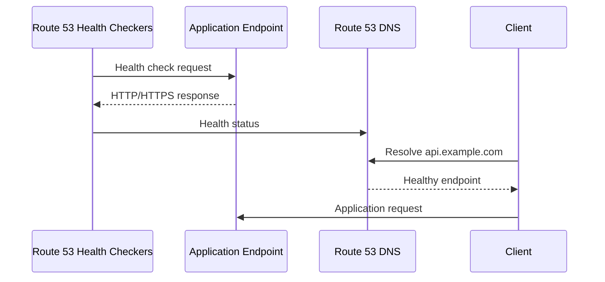
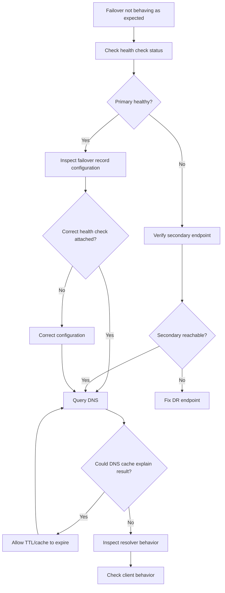

# 04- Failover and Health Check Issues

## Overview

Amazon Route 53 failover routing and health checks are commonly used to improve application availability by directing DNS traffic toward healthy endpoints.

A typical architecture is:

```text
                    Route 53
                       │
                Health Check
                       │
             ┌─────────┴─────────┐
             │                   │
          Primary              Secondary
             │                   │
             ▼                   ▼
       Primary ALB          DR ALB
             │                   │
             ▼                   ▼
        Application          Application
```

The important operational distinction is that **Route 53 health checks do not directly monitor the health of your application in every possible architecture**. They evaluate configured endpoints or health-check sources, and routing policies use health information to determine DNS responses.

A failover incident can therefore originate from several different layers:

```text
Health Check Configuration
        │
        ▼
Health Check Execution
        │
        ▼
Health Status
        │
        ▼
Routing Policy
        │
        ▼
DNS Response
        │
        ▼
Resolver Cache
        │
        ▼
Client
        │
        ▼
Application Endpoint
```

Troubleshooting should follow this chain rather than immediately assuming that Route 53 failed over incorrectly.

---

## Route 53 Failover Routing Model

Failover routing is designed around a primary and secondary record.

Conceptually:

```text
api.example.com
       │
       ▼
Route 53 Failover Policy
       │
       ├── PRIMARY
       │      │
       │      └── Healthy → Return primary
       │
       └── SECONDARY
              │
              └── Return when primary is unhealthy
```

A typical configuration might be:

| Record | Role | Destination |
|---|---|---|
| `api.example.com` | Primary | Production ALB |
| `api.example.com` | Secondary | DR ALB |

The primary record is associated with a health check. When Route 53 determines that the primary is unhealthy, DNS responses can be directed to the secondary record.

The key point is:

> Route 53 failover is DNS-based traffic steering, not an instantaneous network connection migration.

Existing client connections are not moved to the secondary endpoint. New DNS resolutions may receive the secondary destination.

---

## Health Check Lifecycle

A simplified health-check lifecycle is:



If the health check becomes unhealthy:

```text
Health Check
     │
     ▼
Unhealthy
     │
     ▼
Failover Routing
     │
     ▼
Secondary Record
     │
     ▼
DNS Response
```

The actual user-visible transition also depends on DNS caching and TTL behavior.

---

## What Route 53 Health Checks Monitor

Route 53 health checks can monitor endpoints using supported protocols and health-check mechanisms.

Common endpoint checks include:

- HTTP
- HTTPS
- TCP

Health checks can evaluate:

- Endpoint reachability.
- HTTP status behavior.
- Response-string matching where configured.
- Port availability.
- Health-check regions.
- Failure thresholds.

Route 53 also supports calculated health checks and health checks that can be used with other AWS resources depending on the architecture.

The correct health-check mechanism depends on what you are trying to prove.

---

## Liveness vs Application Health

One of the most important production decisions is defining what "healthy" means.

Consider:

```text
GET /health
```

If it always returns:

```text
200 OK
```

even when PostgreSQL is unavailable, the endpoint may be reachable while the application is not actually usable.

For a critical API, a more meaningful health endpoint may distinguish:

```text
Application process
       │
       ├── Database
       ├── Redis
       └── Critical dependency
```

However, making a health check depend on every dependency can introduce another problem.

If Redis temporarily fails:

```text
Redis failure
     │
     ▼
Health endpoint fails
     │
     ▼
Route 53 marks endpoint unhealthy
     │
     ▼
Traffic fails over
```

This may be correct or disastrous depending on the service's actual dependency model.

Health checks should therefore represent **service availability**, not merely "the process returned HTTP 200."

---

## Health Check Endpoint Design

A production health endpoint should be intentional.

For example:

```http
GET /health/live
```

can represent:

```text
Process is running
```

while:

```http
GET /health/ready
```

can represent:

```text
Service is capable of receiving production traffic
```

A backend service might expose:

```text
/live
/ready
```

with different semantics.

For Route 53, choose the endpoint that accurately represents whether the endpoint should receive traffic.

Avoid blindly exposing an internal diagnostic endpoint as a public health-check target.

---

## Health Check Failure Does Not Mean Immediate Failover

A common misconception is:

```text
One failed request
       ↓
Immediate DNS failover
```

That is not a safe mental model.

Health checks use configured failure thresholds and health-check behavior. Route 53 needs sufficient evidence before changing health state.

This prevents transient network failures from immediately causing DNS failover.

The practical implication is:

```text
Transient failure
     │
     ▼
Health checker retries / evaluates status
     │
     ▼
Health state changes when configured criteria are met
     │
     ▼
Routing behavior changes
```

The exact timing depends on health-check configuration and DNS caching.

---

## Why Failover Can Appear Slow

Suppose:

```text
TTL = 60 seconds
```

and the primary endpoint becomes unhealthy.

Even after Route 53 changes its routing decision, clients may continue using cached DNS answers until their resolver cache expires.

Therefore:

```text
Endpoint failure
      │
      ▼
Health check detects failure
      │
      ▼
Route 53 changes DNS decision
      │
      ▼
Recursive resolver cache expires
      │
      ▼
Client receives secondary
```

The DNS TTL is therefore part of the failover design.

---

## DNS TTL and Failover

TTL controls how long DNS answers can be cached by resolvers.

For example:

```text
api.example.com
TTL = 60
```

does not mean:

```text
Route 53 waits 60 seconds before failing over.
```

Instead, it means a resolver receiving the answer may cache it according to the TTL.

The complete failover time depends on:

- Health-check detection.
- Route 53 routing state.
- Resolver caching.
- Client DNS behavior.
- Application connection reuse.

---

## Existing Connections and DNS Failover

DNS failover does not terminate or migrate existing TCP connections.

Suppose:

```text
Client
  │
  │ TCP connection
  ▼
Primary ALB
```

The primary becomes unhealthy.

DNS failover may cause:

```text
New DNS resolution
       │
       ▼
Secondary ALB
```

But an already-established connection does not magically move.

This is particularly important for:

- Long-lived HTTP connections.
- gRPC channels.
- WebSockets.
- Database connections.
- Connection pools.

Applications need their own retry and reconnection behavior.

---

## gRPC and DNS Failover

gRPC clients often maintain long-lived HTTP/2 connections.

Consider:

```text
Client
   │
   ▼
DNS
   │
   ▼
Primary endpoint
   │
   ▼
Long-lived gRPC connection
```

A Route 53 failover event does not automatically force an existing gRPC channel to reconnect to the secondary endpoint.

A production gRPC client should therefore have appropriate:

- Connection retry behavior.
- Backoff.
- Deadline configuration.
- Service discovery behavior.
- Load-balancing strategy.

DNS failover and application-level retry are complementary mechanisms.

---

## Health Check Status

When troubleshooting, determine the actual health-check state instead of inferring it from application behavior.

List health checks:

```bash
aws route53 list-health-checks
```

Inspect a health check:

```bash
aws route53 get-health-check \
  --health-check-id 12345678-abcd-1234-abcd-123456789012
```

Inspect its status:

```bash
aws route53 get-health-check-status \
  --health-check-id 12345678-abcd-1234-abcd-123456789012
```

This helps distinguish:

```text
Endpoint is healthy
```

from:

```text
Route 53 believes endpoint is healthy
```

Those are not always equivalent.

---

## Health Check Configuration Inspection

When a health check behaves unexpectedly, inspect its configuration.

```bash
aws route53 get-health-check \
  --health-check-id 12345678-abcd-1234-abcd-123456789012
```

Look for:

- IP address or domain name.
- Port.
- Protocol.
- Resource path.
- Request interval.
- Failure threshold.
- String matching.
- Regions.
- Inverted status.
- Calculated health-check configuration.

A mismatch between the real application endpoint and the configured health check is a common cause of incidents.

---

## Common Health Check Configuration Errors

### Wrong Port

Application listens on:

```text
443
```

but the health check uses:

```text
80
```

Result:

```text
Connection failure
```

### Wrong Path

Application exposes:

```text
/health
```

but Route 53 checks:

```text
/status
```

Result:

```text
404
```

### Wrong Hostname

A virtual-hosted application may require a particular hostname for the request to reach the correct backend.

### Wrong Protocol

Checking:

```text
HTTP
```

against an endpoint that requires:

```text
HTTPS
```

can fail.

### Authentication Requirement

If the health endpoint requires authentication, Route 53 cannot necessarily perform the expected application-level authentication flow.

Health endpoints should be designed specifically for health monitoring.

---

## Health Check Against an ALB

A common architecture is:

```text
Route 53
    │
    ▼
Health Check
    │
    ▼
Application Load Balancer
    │
    ▼
Target Group
    │
    ├── EC2
    ├── ECS
    └── Kubernetes
```

This can work well when the ALB is the actual public or private traffic endpoint.

However, be careful about what the health check proves.

If the ALB is healthy but all application requests are logically broken because of a dependency failure, a basic TCP check against the ALB may still report healthy.

An HTTP application health check is usually more meaningful when the goal is application-level availability.

---

## AWS Load Balancer Health vs Route 53 Health

There can be multiple health layers:

```text
Route 53 Health Check
        │
        ▼
ALB
        │
        ▼
Target Group Health Check
        │
        ▼
Application
```

These health checks answer different questions.

| Health layer | Question |
|---|---|
| Route 53 | Should DNS consider this endpoint healthy? |
| ALB | Can the load balancer accept traffic? |
| Target Group | Are backend targets healthy? |
| Application | Can the service actually perform its function? |
| Dependency | Is a required downstream system available? |

A green ALB target group does not necessarily mean Route 53's health check is healthy.

---

## Failure Scenario: ALB Healthy, Route 53 Unhealthy

Suppose:

```text
ALB
 │
 ├── Target 1: Healthy
 └── Target 2: Healthy
```

but Route 53 checks:

```text
https://api.example.com/health
```

and the endpoint returns:

```text
503 Service Unavailable
```

Route 53 may consider the endpoint unhealthy even though the ALB target group reports healthy targets.

This is not contradictory.

The checks are measuring different things.

---

## Failure Scenario: Route 53 Healthy, Application Broken

The opposite can also happen.

Suppose Route 53 performs:

```text
TCP/443
```

and the port is accepting connections.

Meanwhile:

```text
PostgreSQL unavailable
```

The API is effectively broken.

Route 53 may still consider the endpoint healthy because the configured health check only verifies TCP reachability.

The lesson:

> Health-check design determines what failures Route 53 can detect.

---

## Failover Record Inspection

List records:

```bash
aws route53 list-resource-record-sets \
  --hosted-zone-id Z0123456789EXAMPLE
```

For a specific record:

```bash
aws route53 list-resource-record-sets \
  --hosted-zone-id Z0123456789EXAMPLE \
  --query "ResourceRecordSets[?Name=='api.example.com.']"
```

Inspect:

- `Failover`
- `SetIdentifier`
- `HealthCheckId`
- `TTL`
- `ResourceRecords`
- `AliasTarget`

A typical failover configuration contains:

```text
api.example.com
    │
    ├── PRIMARY
    │      └── HealthCheckId = ...
    │
    └── SECONDARY
           └── ...
```

---

## Primary and Secondary Record Mistakes

A common configuration error is attaching the health check incorrectly.

For example:

```text
PRIMARY
  └── No health check

SECONDARY
  └── Health check
```

This does not express the intended:

```text
Primary is healthy → use primary
Primary is unhealthy → use secondary
```

The routing policy must be reviewed carefully.

---

## Secondary Health Checks

A secondary endpoint may also need health evaluation depending on the architecture and routing configuration.

Do not assume that:

```text
Secondary exists
```

means:

```text
Secondary is operational.
```

A DR environment should be tested continuously enough to establish that:

- DNS records are correct.
- The endpoint exists.
- TLS works.
- Dependencies are available.
- Application startup succeeds.
- Network paths are valid.

A DR endpoint that has never been exercised is not a reliable failover target.

---

## The "Cold DR" Problem

A common anti-pattern is:

```text
Production
   │
   ▼
Primary
   │
   X
   │
   ▼
DR
   │
   └── Never tested
```

The DNS configuration may look perfect while the DR application has:

- Expired certificates.
- Broken database credentials.
- Missing environment variables.
- Incorrect security groups.
- Missing secrets.
- Outdated container images.
- Invalid DNS records.
- Unhealthy dependencies.

Route 53 can successfully fail over to an endpoint that is still unusable.

Failover architecture must therefore be tested end to end.

---

## Health Check From the Public Internet

Route 53 health checks can originate from AWS health-checker locations rather than from your private application network.

This matters when the target is private.

A health check that requires access to an internal-only endpoint may not work simply because the endpoint is reachable from your VPC.

For private resources, consider AWS-supported health-check patterns such as:

- CloudWatch alarm-based health checks.
- Calculated health checks.
- An appropriate publicly reachable monitoring endpoint where security requirements permit it.
- Application-controlled health signals.

Do not expose an internal service publicly merely to make a health check convenient.

---

## CloudWatch Alarm-Based Health Signals

For architectures where direct Route 53 health checking is not appropriate, health can be derived from CloudWatch metrics and alarms.

Conceptually:

```text
Application
    │
    ▼
CloudWatch Metric
    │
    ▼
CloudWatch Alarm
    │
    ▼
Route 53 Health Signal
    │
    ▼
Failover Routing
```

This can be useful for failures that cannot be detected through a simple HTTP request.

For example:

```text
Queue backlog
Database availability
Application error rate
Custom business metric
```

The health signal should represent a meaningful availability condition.

---

## Calculated Health Checks

Calculated health checks allow multiple health signals to be combined.

For example:

```text
Health Check A
API endpoint

Health Check B
Critical dependency

Health Check C
Regional endpoint

       │
       ▼
Calculated Health Check
       │
       ▼
Route 53 Routing
```

This is useful when a single endpoint check is insufficient.

However, complex health-check graphs can become difficult to reason about.

Document:

- Each child health check.
- The calculated condition.
- The intended failure behavior.
- The expected failover state.

---

## Health Check Inversion

Health checks can be configured with inverted behavior in supported scenarios.

This is powerful but dangerous if misunderstood.

An inverted health check changes the meaning of the health state.

When troubleshooting, explicitly inspect the health-check configuration instead of assuming:

```text
Healthy = endpoint returned success
```

If inversion or calculated health checks are involved, trace the entire health-state dependency graph.

---

## Health Check Region Considerations

Health checks can be performed from multiple AWS locations.

This matters because:

```text
Endpoint healthy from Region A
Endpoint unreachable from Region B
```

may produce different observations.

A regional network issue can therefore affect health-check results differently from a global application failure.

When diagnosing intermittent health failures, inspect the individual checker observations where available.

---

## Why Health Checks Can Flap

Health flapping means:

```text
Healthy
  ↓
Unhealthy
  ↓
Healthy
  ↓
Unhealthy
```

Common causes include:

- Borderline application latency.
- Intermittent packet loss.
- Overloaded servers.
- Dependency instability.
- Aggressive failure thresholds.
- Slow health endpoint.
- DNS instability.
- TLS issues.
- Regional network problems.

Flapping is dangerous because it can cause unstable traffic steering.

A health endpoint should be:

- Lightweight.
- Deterministic.
- Fast.
- Independent of unnecessary dependencies.
- Representative of actual service availability.

---

## Health Check Latency

A health endpoint should return quickly.

Avoid implementing:

```python
def health_check():
    query_database()
    query_redis()
    call_external_service()
    call_payment_provider()
    return "healthy"
```

for every Route 53 health request.

This creates a dependency chain:

```text
Route 53
   │
   ▼
Health Endpoint
   │
   ├── PostgreSQL
   ├── Redis
   ├── External API
   └── Other service
```

A failure in any dependency can cause the entire health signal to fail.

Instead, design health semantics intentionally.

---

## Health Endpoint Example

A lightweight FastAPI endpoint might look like:

```python
from fastapi import FastAPI
from fastapi.responses import JSONResponse

app = FastAPI()


@app.get("/health")
async def health() -> JSONResponse:
    return JSONResponse(
        status_code=200,
        content={"status": "healthy"},
    )
```

This only proves process-level availability.

A production application may use separate liveness and readiness semantics:

```python
@app.get("/health/live")
async def liveness() -> dict[str, str]:
    return {"status": "alive"}


@app.get("/health/ready")
async def readiness() -> dict[str, str]:
    # Add only dependencies that are genuinely required
    # for this service to accept production traffic.
    return {"status": "ready"}
```

The exact implementation should match the service's operational model.

---

## DNS-Level Failover vs Application-Level Retry

These mechanisms solve different problems.

| Mechanism | Purpose |
|---|---|
| Route 53 failover | Steer new DNS resolutions |
| HTTP retry | Retry failed application requests |
| gRPC retry | Recover failed RPCs |
| Load balancer | Distribute traffic among healthy targets |
| Circuit breaker | Prevent repeated calls to failing dependencies |
| Client-side service discovery | Dynamically select service instances |

A robust backend architecture often uses several layers:

```text
Route 53
   │
   ▼
ALB
   │
   ▼
Application
   │
   ▼
Retry / Circuit Breaker
   │
   ▼
Dependency
```

Do not expect Route 53 alone to provide application-level failover behavior.

---

## Failover Testing

Failover should be tested deliberately.

A controlled test might verify:

```text
1. Primary is healthy.
2. DNS returns primary.
3. Simulate primary failure.
4. Health check becomes unhealthy.
5. Route 53 selects secondary.
6. New DNS queries return secondary.
7. Application connects successfully.
8. Restore primary.
9. Health returns to normal.
10. Traffic behavior returns as expected.
```

The test should measure actual recovery behavior rather than simply checking Route 53 configuration.

---

## Testing DNS Responses

Use:

```bash
dig api.example.com
```

Then inspect:

```text
ANSWER SECTION
```

For repeated testing:

```bash
while true; do
  date
  dig +short api.example.com
  sleep 5
done
```

This can help observe when DNS responses change.

Remember that local or recursive DNS caching can make the observed transition different from Route 53's internal routing decision.

---

## Testing the Secondary Endpoint

Do not wait for an incident to discover that the secondary endpoint is broken.

Test it directly where possible:

```bash
curl -v https://dr-api.example.com/health
```

or through an appropriate temporary/test hostname.

Validate:

- DNS.
- TLS.
- Load balancer.
- Application.
- Database.
- Secrets.
- Network access.
- External dependencies.

The DR endpoint should be operationally testable without requiring a production failure.

---

## Route 53 Console vs CLI

The AWS console is useful for visual inspection, but CLI/API-based investigation is often more reproducible.

Useful commands:

```bash
aws route53 list-health-checks
```

```bash
aws route53 get-health-check \
  --health-check-id <health-check-id>
```

```bash
aws route53 get-health-check-status \
  --health-check-id <health-check-id>
```

```bash
aws route53 list-resource-record-sets \
  --hosted-zone-id <hosted-zone-id>
```

For production incidents, capture the configuration and state as evidence rather than relying only on screenshots.

---

## Troubleshooting Decision Tree



---

## Production Troubleshooting Workflow

### Verify the Incident

Establish:

```text
Expected:
Primary

Observed:
Secondary
```

or:

```text
Expected:
Secondary

Observed:
Primary
```

Do not start changing configuration until the actual DNS behavior is confirmed.

---

### Check Health Status

```bash
aws route53 get-health-check-status \
  --health-check-id <health-check-id>
```

Determine whether Route 53 considers the endpoint healthy.

---

### Inspect Health Configuration

```bash
aws route53 get-health-check \
  --health-check-id <health-check-id>
```

Verify:

- Endpoint.
- Port.
- Protocol.
- Path.
- Thresholds.
- Interval.
- Regions.
- Advanced configuration.

---

### Inspect Failover Records

```bash
aws route53 list-resource-record-sets \
  --hosted-zone-id <hosted-zone-id>
```

Verify:

```text
PRIMARY
SECONDARY
HealthCheckId
SetIdentifier
TTL
AliasTarget
```

---

### Query DNS From Multiple Locations

Run:

```bash
dig api.example.com
```

from:

- Application host.
- Container.
- Kubernetes pod.
- Different VPC.
- External workstation where appropriate.

Different answers can reveal split-horizon DNS or caching behavior.

---

### Validate Primary and Secondary Independently

Test:

```text
Primary endpoint
Secondary endpoint
```

independently from DNS failover.

For example:

```bash
curl -fsS https://primary.example.com/health
```

```bash
curl -fsS https://secondary.example.com/health
```

This isolates endpoint health from DNS routing.

---

## Failure Matrix

| Symptom | Likely Cause | First Check |
|---|---|---|
| Primary failed but DNS still returns primary | Health check still healthy or DNS cache | Health-check status |
| Primary is unhealthy but clients still see primary | Resolver/client cache | TTL and DNS query path |
| Secondary receives traffic but is broken | DR endpoint not tested | Direct secondary health test |
| Route 53 says healthy but application is broken | Health check too shallow | Health endpoint semantics |
| Health check intermittently changes state | Flapping endpoint | Checker observations and endpoint latency |
| Health check always unhealthy | Wrong path/port/protocol | Health check configuration |
| DNS changes but existing clients stay connected | Existing connection | Client connection behavior |
| EKS service does not switch correctly | Long-lived connection/CoreDNS behavior | Pod DNS and client behavior |
| Failover works manually but not automatically | Health check or record configuration | Health-check attachment |
| Primary and secondary answers vary by client | DNS caching/split horizon | Resolver and zone configuration |
| DR endpoint unreachable | Network/security/application issue | Direct endpoint test |
| Health check cannot reach private endpoint | Inappropriate health-check architecture | Monitoring design |

---

## Security Considerations

Health endpoints should expose minimal information.

Avoid returning:

```json
{
  "database_password": "...",
  "internal_hostname": "...",
  "redis_status": "...",
  "environment_variables": "..."
}
```

A health endpoint should generally expose only the information required to establish health.

Also consider:

- TLS for HTTPS health checks.
- Restricting administrative diagnostic endpoints.
- Least-privilege IAM for Route 53 changes.
- CloudTrail auditing.
- Controlled infrastructure deployment.
- Protection against unauthorized DNS record modification.
- Monitoring unexpected failover events.

A compromised DNS configuration can redirect clients to an attacker-controlled endpoint.

---

## Reliability Considerations

Route 53 failover should be treated as one component of a larger availability strategy.

A robust design may look like:

```text
                Route 53
                   │
            Failover Routing
              /          \
             ▼            ▼
        Primary ALB    Secondary ALB
             │            │
             ▼            ▼
        Primary App     DR App
             │            │
             ▼            ▼
         Data Layer     DR Data
```

The DNS layer cannot compensate for an unavailable or untested DR stack.

Reliability depends on:

- Correct health semantics.
- Appropriate TTLs.
- Healthy secondary infrastructure.
- Tested failover procedures.
- Application retry behavior.
- Data replication.
- Network connectivity.
- Operational readiness.

---

## Monitoring and Alerting

Monitor both the health signal and the actual service.

Useful alerts include:

```text
Primary Route 53 health check = unhealthy
```

```text
Unexpected failover detected
```

```text
Secondary endpoint unhealthy
```

```text
Health check flapping
```

```text
Application error rate increased
```

A particularly important production pattern is:

```text
Route 53 says primary is healthy
             +
Application monitoring says primary is failing
```

This indicates a potentially inadequate health-check definition.

---

## Cost Considerations

Health checks and associated monitoring features contribute to AWS operational cost.

Do not create unnecessary health checks for every minor internal endpoint.

Instead:

- Health-check critical customer-facing endpoints.
- Use application and infrastructure monitoring for lower-level diagnostics.
- Reuse calculated health signals where appropriate.
- Avoid redundant checks that do not influence routing or alerting.

Cost optimization should never come at the expense of critical availability signals.

---

## Infrastructure as Code

Failover routing should normally be managed through infrastructure as code.

A conceptual Terraform configuration might look like:

```hcl
resource "aws_route53_record" "primary" {
  zone_id = aws_route53_zone.public.zone_id
  name    = "api.example.com"
  type    = "A"

  failover_routing_policy {
    type = "PRIMARY"
  }

  health_check_id = aws_route53_health_check.primary.id

  alias {
    name                   = aws_lb.primary.dns_name
    zone_id                = aws_lb.primary.zone_id
    evaluate_target_health = true
  }

  set_identifier = "primary"
}
```

The exact configuration depends on the AWS resource and routing design.

Important operational properties include:

- Explicit primary/secondary identifiers.
- Explicit health-check references.
- Version-controlled TTLs.
- Reviewable changes.
- Automated validation.
- Controlled deployment.

---

## Common Mistakes

### Treating DNS Failover as Instantaneous

Failover is affected by health-check evaluation and DNS caching.

### Using a Weak Health Check

A TCP check may prove only that a port is open.

### Making Health Checks Too Deep

Checking every dependency can cause unnecessary failover during isolated dependency failures.

### Never Testing the Secondary

A DNS configuration can be syntactically correct while the DR application is unusable.

### Ignoring Existing Connections

DNS does not move existing TCP or gRPC connections.

### Using an Unreachable Health Endpoint

The health checker must be able to reach the configured endpoint.

### Ignoring TTL

Clients may continue using cached DNS responses after Route 53 has changed its routing decision.

### Confusing ALB Health With Route 53 Health

They are separate health signals.

### Ignoring Health Flapping

An unstable health endpoint can cause unstable routing behavior.

### Testing Only From One Client

Different resolvers and caches can produce different observations.

### Assuming "Healthy" Means "Fully Operational"

Healthy means healthy according to the configured health-check definition.

---

## Interview Traps

### Does Route 53 immediately redirect existing users when failover occurs?

No. DNS failover influences future DNS resolutions. Existing connections are not migrated.

### Does lowering TTL guarantee faster failover?

No. TTL affects DNS caching, but health-check detection and application connection behavior also influence recovery time.

### Why can Route 53 report an endpoint as healthy when the API is broken?

The health check may only verify TCP connectivity or a shallow HTTP endpoint that does not validate the application's actual readiness.

### Why should a DR endpoint be tested independently?

Because Route 53 can successfully route traffic to a secondary endpoint that is itself misconfigured or unhealthy.

### Is ALB target health the same as Route 53 health?

No. They are independent health mechanisms measuring different layers.

### Why can an application remain connected to the primary after DNS failover?

Existing TCP/HTTP/2 connections remain established until they close or fail. DNS affects subsequent resolution.

### What causes health-check flapping?

Intermittent endpoint failures, latency, network instability, dependency failures, aggressive thresholds, and poorly designed health endpoints are common causes.

### How would you debug "Route 53 did not fail over"?

Use this sequence:

```text
1. Confirm actual DNS response.
2. Check DNS cache/TTL.
3. Check Route 53 health-check status.
4. Inspect health-check configuration.
5. Inspect primary/secondary records.
6. Verify secondary endpoint independently.
7. Check resolver behavior.
8. Check existing client connections.
9. Check application-level retries.
```

---

## Key Takeaways

Route 53 failover is a **DNS-based availability mechanism**, not a connection-level failover system.

The most important operational points are:

- Health-check configuration determines what Route 53 considers healthy.
- A TCP health check proves reachability, not application correctness.
- Health endpoints should represent meaningful service availability.
- Health-check failure does not necessarily result in instantaneous DNS failover.
- DNS TTL and recursive resolver caching affect observed failover time.
- Existing TCP, HTTP/2, and gRPC connections are not migrated by DNS failover.
- Primary and secondary endpoints must be tested independently.
- ALB target health and Route 53 health are separate signals.
- Health checks that are too shallow can produce false positives.
- Health checks that are too dependency-heavy can produce false negatives.
- Health flapping can cause unstable routing behavior.
- Private endpoints require an appropriate health-check architecture.
- CloudWatch-based health signals can be useful when direct endpoint checks are insufficient.
- Calculated health checks can combine multiple health signals but increase operational complexity.
- DNS failover should complement, not replace, application retries and resilience patterns.
- DR infrastructure must be continuously validated rather than tested for the first time during an incident.
- Infrastructure-as-code should control health checks and failover records.
- Monitoring should detect unexpected failover, health-check flapping, and divergence between infrastructure health and application health.

The senior-level mental model is:

```text
                 Endpoint
                    │
                    ▼
              Health Check
                    │
                    ▼
              Health State
                    │
                    ▼
             Route 53 Policy
                    │
                    ▼
               DNS Answer
                    │
                    ▼
             Resolver Cache
                    │
                    ▼
                 Client
                    │
                    ▼
          Existing/New Connection
                    │
                    ▼
              Application
```

The critical distinction is:

> **Route 53 can only make failover decisions based on the health signals you configure, and DNS failover only influences clients when they perform a DNS resolution that can observe the new answer.**