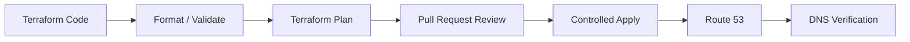

# 05- Infrastructure as Code Configuration Issues

## Overview

Infrastructure as Code (IaC) makes Route 53 configuration reproducible, reviewable, and deployable through version-controlled workflows. Terraform, AWS CloudFormation, AWS CDK, and similar tools can manage hosted zones, DNS records, health checks, routing policies, DNSSEC configuration, and related IAM resources.

The operational advantage is also the primary risk: an incorrect IaC change can modify authoritative DNS configuration and affect production traffic globally.

A Route 53 IaC incident should therefore be investigated across four layers:

```text
IaC Source
    │
    ▼
Plan / Synthesis
    │
    ▼
AWS API
    │
    ▼
Route 53 Configuration
    │
    ▼
Authoritative DNS Response
    │
    ▼
Resolvers / Clients
```

A successful Terraform apply does not necessarily mean that the resulting DNS architecture is correct.

---

## Why Route 53 IaC Requires Special Care

DNS is part of the application's production traffic path.

A small configuration change can affect:

- Public API availability.
- Web applications.
- Email routing.
- Service discovery.
- TLS validation.
- Failover behavior.
- Internal service resolution.
- Third-party integrations.
- Disaster recovery.

For example:

```text
Terraform change
      │
      ▼
api.example.com
      │
      ▼
Changed ALB target
      │
      ▼
Production traffic
      │
      ▼
Application outage
```

Unlike many application configuration changes, DNS mistakes can affect clients outside your immediate infrastructure and can remain observable through resolver caches after the configuration has been corrected.

---

## Route 53 Resources Commonly Managed by IaC

| Resource | Typical IaC Usage |
|---|---|
| Hosted zone | Domain DNS management |
| DNS record | A, AAAA, CNAME, MX, TXT, etc. |
| Alias record | ALB, CloudFront, API Gateway, and AWS endpoints |
| Health check | Endpoint availability |
| Failover record | Primary/secondary routing |
| Weighted record | Traffic distribution |
| Latency record | Region-based routing |
| Geolocation record | Location-based routing |
| DNSSEC configuration | Signed DNS zones |
| Key-signing key | DNSSEC key management |
| IAM policy | Permission to manage DNS |
| CloudWatch integration | Operational monitoring |

A senior engineer should understand not only how to create these resources, but also how state, dependencies, imports, replacement behavior, and deployment ordering affect production.

---

## Terraform State and Route 53

Terraform maintains state describing resources it manages.

Conceptually:

```text
Terraform Configuration
        │
        ▼
Terraform State
        │
        ▼
AWS Route 53
```

The state is not the DNS source of truth itself. AWS remains the actual infrastructure state.

Problems occur when these diverge:

```text
Terraform state
     │
     ├── Says: record exists
     │
     X
     │
AWS Route 53
     └── Record was changed manually
```

Terraform may then propose changes based on its state and configuration.

---

## Configuration Drift

Configuration drift occurs when infrastructure changes outside the IaC workflow.

Example:

```text
Terraform
  │
  └── api.example.com → ALB-A

Engineer manually changes Route 53
  │
  └── api.example.com → ALB-B
```

The repository still describes:

```text
ALB-A
```

while production uses:

```text
ALB-B
```

Detect drift with:

```bash
terraform plan
```

A non-empty plan does not automatically mean drift; the configuration itself may also have changed. The important point is to determine why Terraform proposes the change.

### Production Recommendation

Treat manual Route 53 changes as exceptional.

If an emergency manual change is necessary:

1. Record the reason.
2. Make the smallest possible change.
3. Capture the resulting AWS configuration.
4. Update IaC afterward.
5. Run a plan to confirm convergence.
6. Review the change before the next deployment.

---

## Terraform Resource Identity

Terraform identifies resources using addresses such as:

```text
aws_route53_record.api
```

Changing the resource address can make Terraform believe that an existing resource is new.

For example:

```hcl
resource "aws_route53_record" "api" {
  # ...
}
```

renamed to:

```hcl
resource "aws_route53_record" "public_api" {
  # ...
}
```

can produce an unexpected destroy/create plan unless the resource is moved appropriately.

Modern Terraform supports explicit resource moves:

```hcl
moved {
  from = aws_route53_record.api
  to   = aws_route53_record.public_api
}
```

This preserves resource identity while allowing the configuration to evolve.

---

## Importing Existing Route 53 Resources

A common situation is inheriting manually created DNS infrastructure.

Before modifying it through Terraform:

```text
Existing Route 53
       │
       ▼
Import into Terraform
       │
       ▼
Reconcile configuration
       │
       ▼
Managed infrastructure
```

Terraform supports importing existing resources.

For example:

```bash
terraform import \
  aws_route53_zone.primary \
  Z0123456789EXAMPLE
```

After importing:

```bash
terraform plan
```

Do not assume that successful import means the configuration is complete.

The Terraform configuration must accurately represent the desired resource attributes before normal deployments are allowed.

---

## Import Does Not Mean "Safe to Apply"

Suppose a production hosted zone contains:

```text
A
AAAA
CNAME
MX
TXT
NS
SOA
CAA
```

but the Terraform configuration declares only:

```text
A
CNAME
```

An incorrect configuration strategy can lead to unwanted changes.

Before importing or adopting an existing zone:

- Inventory records.
- Identify records managed by other systems.
- Identify provider-generated records.
- Identify validation records.
- Understand delegation.
- Understand DNSSEC status.
- Determine ownership boundaries.

Adopt existing infrastructure deliberately.

---

## Hosted Zone Ownership Problems

A frequent Route 53 problem is managing the wrong hosted zone.

A domain can have multiple hosted zones with the same name.

For example:

```text
Public hosted zone
example.com

Private hosted zone
example.com
```

They are distinct Route 53 resources.

A Terraform data source should therefore be selected carefully.

For example:

```hcl
data "aws_route53_zone" "public" {
  name         = "example.com"
  private_zone = false
}
```

For a private hosted zone:

```hcl
data "aws_route53_zone" "private" {
  name         = "example.com"
  private_zone = true
}
```

Do not identify a hosted zone solely by its DNS name when multiple zones can exist.

---

## Public vs Private Hosted Zone Mistakes

A common failure looks like:

```text
Terraform
   │
   ▼
Creates record in private zone
   │
   ▼
Public client queries DNS
   │
   ▼
Record does not exist publicly
```

The opposite can be equally problematic:

```text
Internal service
   │
   ▼
Expected private resolution
   │
   ▼
Record created in public zone
```

Always verify:

- Hosted zone ID.
- `private_zone`.
- VPC associations.
- Delegation.
- Resolver path.

---

## Private Hosted Zone VPC Associations

Private hosted zones require appropriate VPC associations.

A simplified model is:

```text
Private Hosted Zone
        │
        ├── VPC A
        ├── VPC B
        └── VPC C
```

A workload in an unassociated VPC may not resolve records from that private zone.

IaC should explicitly model the intended association.

Example:

```hcl
resource "aws_route53_zone" "internal" {
  name = "internal.example.com"

  vpc {
    vpc_id = aws_vpc.application.id
  }
}
```

For additional VPCs, manage the association explicitly when required.

---

## Record Replacement and Lifecycle Behavior

DNS records can be updated in place or replaced depending on the attributes involved and provider behavior.

A dangerous assumption is:

```text
Terraform update
      ↓
No traffic impact
```

Some changes can alter production resolution immediately after AWS accepts them.

Review:

```bash
terraform plan
```

before applying.

For critical records, treat any change to:

- Name.
- Type.
- Routing policy.
- Alias target.
- Health check.
- Set identifier.
- Record values.

as a production traffic change.

---

## Failover Record Configuration

Failover records require consistent identifiers and routing semantics.

A simplified Terraform configuration:

```hcl
resource "aws_route53_record" "api_primary" {
  zone_id = aws_route53_zone.public.zone_id
  name    = "api.example.com"
  type    = "A"

  set_identifier = "primary"

  failover_routing_policy {
    type = "PRIMARY"
  }

  health_check_id = aws_route53_health_check.primary.id

  alias {
    name                   = aws_lb.primary.dns_name
    zone_id                = aws_lb.primary.zone_id
    evaluate_target_health = true
  }
}

resource "aws_route53_record" "api_secondary" {
  zone_id = aws_route53_zone.public.zone_id
  name    = "api.example.com"
  type    = "A"

  set_identifier = "secondary"

  failover_routing_policy {
    type = "SECONDARY"
  }

  alias {
    name                   = aws_lb.secondary.dns_name
    zone_id                = aws_lb.secondary.zone_id
    evaluate_target_health = true
  }
}
```

The exact configuration should match the routing architecture.

The important operational properties are:

```text
Same DNS name
      │
      ├── PRIMARY
      └── SECONDARY
```

with unambiguous identifiers and appropriate health behavior.

---

## Duplicate Record Errors

Route 53 does not allow arbitrary duplicate records with the same identifying attributes.

Terraform errors may appear when configuration attempts to create a record that already exists.

Common causes:

- Record already exists manually.
- Another Terraform resource manages the same record.
- Two modules create the same record.
- Import was performed incorrectly.
- Resource addresses changed.
- Multiple stacks manage the same zone.

A useful diagnostic is:

```bash
aws route53 list-resource-record-sets \
  --hosted-zone-id Z0123456789EXAMPLE
```

Then compare AWS state with:

```bash
terraform state list
```

and the Terraform configuration.

---

## Multiple Terraform Modules Managing One Zone

A dangerous architecture is:

```text
Module A
   └── manages example.com

Module B
   └── also manages example.com
```

Both modules may attempt to control overlapping records.

This creates ownership ambiguity.

Prefer clear boundaries:

```text
DNS Module
   │
   ├── Public zone
   ├── Application records
   ├── Validation records
   └── Routing policies
```

If multiple teams must contribute records, define an explicit ownership model.

---

## Record Ownership Boundaries

A mature platform may separate ownership like this:

| Resource | Owner |
|---|---|
| Hosted zone | Platform team |
| Delegation | Platform / DNS team |
| Application A records | Application team |
| ACM validation records | Certificate automation |
| Email records | Messaging team |
| Internal service records | Platform / service discovery |
| DNSSEC | Security / platform team |

The important requirement is that **one authoritative IaC ownership path exists for each resource**.

---

## Dependency Ordering

DNS records often depend on other AWS resources.

Example:

```text
ALB
 │
 └── DNS name
       │
       ▼
Route 53 Alias Record
```

Terraform normally derives dependencies from references:

```hcl
alias {
  name    = aws_lb.api.dns_name
  zone_id = aws_lb.api.zone_id
}
```

Avoid manually duplicating resource values when Terraform can reference the actual resource.

References allow Terraform to understand the dependency graph.

---

## Dependency Graph Problems

A complex DNS stack can become:

```text
Certificate
     │
     ▼
ALB
     │
     ▼
Route 53
```

while another dependency goes:

```text
Route 53
   │
   ▼
Certificate validation
   │
   ▼
Certificate
```

This can create dependency cycles if the architecture is modeled incorrectly.

When Terraform reports a cycle:

```bash
terraform plan
```

inspect the dependency graph:

```bash
terraform graph
```

You can render the resulting Graphviz output if Graphviz is available.

The solution is usually to remove unnecessary dependencies rather than forcing Terraform to execute resources in an arbitrary order.

---

## `depends_on` Misuse

Explicit dependencies can be useful:

```hcl
depends_on = [
  aws_route53_zone_association.internal
]
```

But overusing `depends_on` makes the dependency graph less precise.

Prefer implicit dependencies through references:

```hcl
zone_id = aws_route53_zone.public.zone_id
```

rather than:

```hcl
depends_on = [aws_route53_zone.public]
```

when the reference already establishes the relationship.

Use explicit dependencies only when Terraform cannot infer a real dependency.

---

## Alias Record Configuration Issues

AWS alias records are commonly used for AWS-managed endpoints such as:

- Application Load Balancers.
- Network Load Balancers.
- CloudFront distributions.
- API Gateway endpoints.
- S3 website endpoints.

Example:

```hcl
alias {
  name                   = aws_lb.api.dns_name
  zone_id                = aws_lb.api.zone_id
  evaluate_target_health = true
}
```

A common mistake is treating an alias like a normal CNAME.

Alias records are Route 53-specific functionality and have different behavior from standard DNS CNAME records.

---

## `evaluate_target_health`

For supported alias targets, `evaluate_target_health` controls whether Route 53 considers the target's health when evaluating routing.

This can become confusing when combined with explicit Route 53 health checks and failover policies.

Before enabling it, determine:

```text
What health signal controls routing?
```

Possible signals include:

```text
Route 53 health check
        +
Alias target health
        +
Application health
```

Do not combine multiple health mechanisms without understanding their interaction.

---

## Weighted Routing IaC Issues

Weighted routing may look like:

```text
api.example.com
    │
    ├── Version A → 90
    └── Version B → 10
```

Terraform might define:

```hcl
weighted_routing_policy {
  weight = 90
}
```

and:

```hcl
weighted_routing_policy {
  weight = 10
}
```

Each record requires an appropriate `set_identifier`.

Common mistakes include:

- Incorrect weights.
- Duplicate identifiers.
- Missing records.
- Accidental `0` weight.
- Updating only one side of a rollout.
- Mixing routing policies unintentionally.

---

## Blue-Green DNS Deployment

Route 53 weighted records can support controlled application releases.

```text
                   Route 53
                       │
              Weighted Routing
                 /          \
                ▼            ▼
          Blue: 90%      Green: 10%
                │            │
                ▼            ▼
             Version A    Version B
```

A deployment might progress:

```text
90 / 10
   ↓
75 / 25
   ↓
50 / 50
   ↓
10 / 90
   ↓
0 / 100
```

IaC makes these changes reviewable, but the deployment process must account for DNS caching and traffic distribution variability.

A 10% DNS weight does not guarantee exactly 10% of application requests.

---

## State Locking and Concurrent DNS Changes

Multiple engineers or CI/CD jobs should not modify the same Terraform state simultaneously.

Without proper state locking:

```text
CI Job A ──┐
           ├── Terraform State
CI Job B ──┘
```

concurrent operations can produce inconsistent state or conflicting changes.

Use an appropriate remote backend and locking mechanism supported by your Terraform version and backend.

For production DNS:

```text
Developer
    │
    ▼
Pull Request
    │
    ▼
CI Plan
    │
    ▼
Review
    │
    ▼
Controlled Apply
```

is safer than allowing arbitrary concurrent local applies.

---

## Terraform Plan as a Safety Boundary

For DNS infrastructure, the plan is one of the most important review artifacts.

A reviewer should look for:

```text
+ create
~ update
- destroy
```

Pay particular attention to:

```text
- aws_route53_record.production
```

A DNS record destruction can be much more significant than the small Terraform diff suggests.

Before approving:

- Confirm record name.
- Confirm record type.
- Confirm routing policy.
- Confirm target.
- Confirm health check.
- Confirm TTL.
- Confirm replacement behavior.
- Confirm whether another environment is affected.

---

## Unexpected Destroy Plans

Suppose Terraform reports:

```text
-/+ aws_route53_record.api
```

This means replacement rather than a simple update.

Never approve blindly.

Determine why Terraform wants replacement:

```bash
terraform plan
```

Inspect the resource:

```bash
terraform state show aws_route53_record.api
```

Then compare it against the configuration and AWS state.

A replacement of a production DNS record should be treated as a potentially disruptive operation.

---

## Terraform State Inspection

Useful commands include:

```bash
terraform state list
```

```bash
terraform state show aws_route53_record.api
```

```bash
terraform show
```

These commands help determine what Terraform believes it manages.

Compare that with AWS:

```bash
aws route53 list-resource-record-sets \
  --hosted-zone-id Z0123456789EXAMPLE
```

The comparison is often more useful than repeatedly running `terraform apply`.

---

## State Corruption and Recovery

If Terraform state becomes inconsistent, do not immediately delete state resources.

A production DNS state recovery process should be deliberate:

```text
Backup / inspect state
        │
        ▼
Determine actual AWS state
        │
        ▼
Identify incorrect state entries
        │
        ▼
Correct state carefully
        │
        ▼
terraform plan
        │
        ▼
Verify convergence
```

State manipulation commands such as:

```bash
terraform state rm
```

should only be used when the ownership implications are understood.

Removing a resource from Terraform state does not delete the actual AWS resource, but Terraform may later attempt to recreate or otherwise manage it depending on the configuration.

---

## AWS CLI as Ground Truth During Incidents

When troubleshooting, inspect AWS directly.

List zones:

```bash
aws route53 list-hosted-zones
```

List records:

```bash
aws route53 list-resource-record-sets \
  --hosted-zone-id Z0123456789EXAMPLE
```

Inspect health checks:

```bash
aws route53 list-health-checks
```

This helps answer:

```text
What exists in AWS right now?
```

Terraform answers a different question:

```text
What does Terraform believe it should manage?
```

Both views are required when diagnosing drift.

---

## CI/CD Configuration Issues

Route 53 IaC deployments should normally pass through CI/CD.

A typical pipeline is:



Useful checks include:

```bash
terraform fmt -check
terraform validate
terraform plan
```

For larger environments, add:

- Static analysis.
- Policy checks.
- Security scanning.
- Plan artifact storage.
- Approval gates.
- Post-deployment DNS verification.

---

## Environment Separation

Avoid sharing mutable DNS resources across development and production Terraform states unless there is a deliberate architecture behind it.

A common structure is:

```text
environment/
├── dev/
├── staging/
└── production/
```

with environment-specific values.

Production should not accidentally inherit:

```text
dev ALB
```

because of an incorrect variable or workspace selection.

---

## Workspace and Account Confusion

A dangerous failure mode is applying the correct Terraform configuration to the wrong AWS account.

Verify:

```bash
aws sts get-caller-identity
```

before production changes.

Also verify:

- AWS account.
- AWS region where applicable.
- Terraform workspace or environment.
- Hosted zone ID.
- Backend state.
- IAM role.

A useful deployment log should clearly identify:

```text
Environment: production
AWS Account: <account>
Hosted Zone: <zone-id>
Terraform State: <state-location>
```

Never rely solely on the shell prompt to identify the target environment.

---

## IAM Permission Problems

Terraform requires appropriate permissions to manage Route 53.

A deployment may fail because the CI role lacks permissions such as:

```text
route53:ListHostedZones
route53:ListResourceRecordSets
route53:ChangeResourceRecordSets
route53:GetHealthCheck
route53:ListHealthChecks
```

The exact permission set should follow least privilege.

Avoid giving the CI role broad:

```text
route53:*
```

without a justified requirement.

Where possible, separate:

```text
Read-only plan permissions
```

from:

```text
Change permissions
```

depending on the deployment architecture.

---

## IAM Access vs DNS Correctness

A successful API call proves authorization and syntactic validity.

It does not prove that the resulting DNS architecture is correct.

For example:

```text
ChangeResourceRecordSets
        │
        ▼
AWS accepts change
        │
        ▼
DNS record exists
        │
        ▼
Application is still unreachable
```

IaC validation must therefore include functional DNS verification.

---

## Eventual Consistency and Verification

After applying a DNS change:

```bash
terraform apply
```

do not immediately assume every external resolver observes the new answer.

Verify authoritative state first, then test resolution.

For example:

```bash
dig @ns-123.awsdns-45.com api.example.com
```

Then:

```bash
dig api.example.com
```

The first query targets an authoritative nameserver directly; the second may traverse a recursive resolver.

This distinction is valuable during incident analysis.

---

## Delegation Issues

A Route 53 hosted zone can exist correctly while the domain is delegated elsewhere.

The chain is:

```text
Registrar
   │
   ▼
Parent Zone
   │
   ▼
NS Delegation
   │
   ▼
Route 53 Hosted Zone
   │
   ▼
DNS Records
```

Terraform can successfully create:

```text
example.com hosted zone
```

while the registrar still delegates the domain to another nameserver set.

Always distinguish:

```text
Hosted zone exists
```

from:

```text
Internet traffic is delegated to this hosted zone
```

---

## Nameserver Changes

When replacing or creating a hosted zone, nameservers can differ.

Check:

```bash
aws route53 get-hosted-zone \
  --id Z0123456789EXAMPLE
```

Inspect the delegated nameservers.

Then verify public delegation with:

```bash
dig NS example.com
```

If the parent zone delegates to different nameservers, changes in the new Route 53 hosted zone may not affect production traffic.

---

## DNSSEC IaC Issues

DNSSEC adds additional operational dependencies.

A simplified model is:

```text
Domain
  │
  ▼
Delegation
  │
  ▼
Route 53 Hosted Zone
  │
  ▼
DNSSEC Signing
  │
  ▼
DS Record at Parent
```

IaC must not treat DNSSEC as merely another record.

Incorrect DNSSEC deployment or key-management configuration can make a domain fail validation.

Before modifying DNSSEC infrastructure:

- Understand key-signing-key state.
- Understand parent DS records.
- Verify signing status.
- Plan rollback carefully.
- Avoid deleting cryptographic resources casually.

---

## Record TTL Configuration

TTL should be treated as part of the deployment design.

For example:

```hcl
ttl = 60
```

may be appropriate for a frequently changing record.

A longer TTL may reduce DNS query volume and improve cache efficiency, but can make changes take longer to propagate through recursive caches.

Do not use extremely low TTLs everywhere without understanding the operational and cost implications.

---

## Terraform Provider Version Changes

Route 53 resource behavior can be affected by Terraform AWS provider changes.

Before upgrading:

```text
Provider upgrade
       │
       ▼
terraform plan
       │
       ▼
Unexpected Route 53 changes?
       │
       ├── Yes → Investigate
       └── No  → Continue validation
```

For production DNS:

- Pin provider versions appropriately.
- Review provider changelogs.
- Run plans against representative environments.
- Never combine an infrastructure provider upgrade with a large DNS redesign unless necessary.

Reducing change scope makes incidents easier to diagnose.

---

## Module Versioning Issues

Reusable Terraform modules can hide Route 53 changes.

For example:

```text
Application
    │
    ▼
DNS Module v1
    │
    ▼
Route 53 Record
```

Changing to:

```text
DNS Module v2
```

may alter:

- Record naming.
- TTL.
- Alias behavior.
- Routing policy.
- Health checks.
- Resource addresses.

Always inspect the resulting plan rather than assuming a module version bump is harmless.

---

## Safe Module Design

A production DNS module should expose important routing decisions explicitly.

For example:

```hcl
variable "record_name" {
  type = string
}

variable "record_type" {
  type = string
}

variable "ttl" {
  type    = number
  default = 300
}

variable "health_check_id" {
  type    = string
  default = null
}
```

Avoid hiding critical production behavior deep inside module implementation.

A caller reviewing:

```hcl
health_check_id = aws_route53_health_check.api.id
```

can understand the operational relationship immediately.

---

## DNS Validation in CI/CD

IaC validation should extend beyond Terraform syntax.

A production pipeline can perform:

```text
terraform validate
        │
        ▼
terraform plan
        │
        ▼
Policy validation
        │
        ▼
Apply
        │
        ▼
Authoritative DNS query
        │
        ▼
Application health check
```

For example:

```bash
dig @<authoritative-nameserver> api.example.com
```

followed by:

```bash
curl -fsS https://api.example.com/health
```

This catches configuration that is syntactically valid but operationally incorrect.

---

## Policy as Code

Organizations managing critical DNS at scale can enforce policies such as:

- Production zones require approved ownership.
- Public records require explicit review.
- TTL cannot be below an organizational threshold without approval.
- Production records must use approved routing policies.
- DNSSEC must remain enabled where required.
- Wildcard records require review.
- CI roles must use least privilege.

The goal is to catch dangerous DNS configurations before deployment.

---

## Production Deployment Strategy

A safe Route 53 IaC deployment should follow:

```text
Change
  │
  ▼
Static validation
  │
  ▼
Terraform plan
  │
  ▼
Human / automated policy review
  │
  ▼
Apply
  │
  ▼
Authoritative DNS verification
  │
  ▼
Resolver verification
  │
  ▼
Application verification
  │
  ▼
Monitoring
```

For high-risk DNS changes, use staged deployments where the routing model permits it.

---

## Rollback Strategy

DNS rollback is not simply:

```bash
terraform apply
```

with an older commit.

The recovery plan must consider:

- DNS TTL.
- Resolver caching.
- Existing connections.
- Current AWS state.
- Terraform state.
- Whether the old target still exists.
- Health-check status.
- Delegation.
- DNSSEC.
- Application compatibility.

A rollback can restore the Route 53 configuration while clients continue seeing the previous answer for some period.

---

## Emergency Manual Changes

There are situations where an emergency DNS change may be justified.

Example:

```text
Production outage
      │
      ▼
IaC pipeline unavailable
      │
      ▼
Approved emergency DNS change
      │
      ▼
Service restored
      │
      ▼
IaC reconciled
```

The dangerous pattern is:

```text
Emergency manual change
       │
       ▼
Forgotten
       │
       ▼
Next Terraform apply
       │
       ▼
Change unexpectedly reverted
```

Every emergency change should therefore create a follow-up task to reconcile infrastructure state.

---

## Common IaC Failure Patterns

| Symptom | Likely Cause | Diagnostic |
|---|---|---|
| `already exists` | Resource exists outside state | AWS CLI + Terraform state |
| Unexpected record deletion | Configuration/state mismatch | `terraform plan` |
| Wrong hosted zone | Public/private or duplicate zone | Hosted zone inventory |
| No DNS effect | Wrong delegation | `dig NS` |
| Failover broken | Incorrect routing/health configuration | Route 53 record inspection |
| Private DNS unavailable | Missing VPC association | Hosted zone/VPC inspection |
| Apply denied | IAM permissions | CloudTrail/IAM |
| Terraform wants replacement | Attribute/resource identity change | Plan + state |
| Concurrent state errors | Multiple applies | CI/state backend |
| DNS changes revert | Manual drift | Plan after emergency change |
| Module update changes records | Provider/module behavior | Plan diff |
| DNSSEC validation fails | Signing/delegation mismatch | DNSSEC state + DS record |
| Correct IaC but wrong DNS response | Resolver cache | Authoritative vs recursive query |

---

## Troubleshooting Workflow

When a Route 53 IaC deployment causes unexpected behavior, follow this sequence.

### Confirm the Deployment

Identify:

```text
Git commit
Terraform version
AWS provider version
AWS account
Terraform state
Deployment identity
Hosted zone ID
```

---

### Inspect the Plan

If the change is still pending:

```bash
terraform plan
```

Look specifically for:

```text
route53_record
route53_zone
route53_health_check
route53_zone_association
```

and any destroy/replacement operations.

---

### Inspect Terraform State

```bash
terraform state list
```

Then:

```bash
terraform state show aws_route53_record.api
```

Determine whether Terraform's state matches expectations.

---

### Inspect AWS Directly

```bash
aws route53 get-hosted-zone \
  --id Z0123456789EXAMPLE
```

```bash
aws route53 list-resource-record-sets \
  --hosted-zone-id Z0123456789EXAMPLE
```

Compare AWS state with Terraform.

---

### Verify Authoritative DNS

Find the authoritative nameservers:

```bash
dig NS example.com
```

Then query an authoritative server:

```bash
dig @ns-123.awsdns-45.com api.example.com
```

This determines whether Route 53 itself is returning the expected answer.

---

### Verify Recursive Resolution

Then run:

```bash
dig api.example.com
```

If authoritative and recursive answers differ, investigate:

- TTL.
- Resolver cache.
- Delegation.
- Split-horizon DNS.
- Local DNS configuration.

---

### Verify the Application

Finally:

```bash
curl -fsS https://api.example.com/health
```

DNS correctness and application correctness are separate validation stages.

---

## Security Considerations

Route 53 IaC should be protected as production infrastructure.

Recommended controls include:

- Least-privilege IAM.
- Separate CI roles by environment.
- Mandatory pull-request review.
- Protected production branches.
- Remote state protection.
- State encryption.
- State locking.
- CloudTrail auditing.
- Secrets management outside source code.
- Policy-as-code validation.
- Restricted emergency access.

Avoid storing AWS credentials directly in Terraform configuration.

Bad:

```hcl
provider "aws" {
  access_key = "AKIA..."
  secret_key = "..."
}
```

Prefer CI/OIDC, IAM roles, or other short-lived credential mechanisms appropriate to the deployment environment.

---

## Reliability Considerations

For critical DNS:

- Keep configuration in version control.
- Use remote state.
- Review plans before production changes.
- Maintain clear resource ownership.
- Test failover.
- Monitor DNS health.
- Verify delegation.
- Keep rollback procedures documented.
- Avoid manual drift.
- Separate production state from lower environments.

DNS infrastructure should be treated as a highly sensitive production dependency.

---

## Monitoring and Auditing

Useful operational signals include:

```text
Route 53 record changes
Health-check state changes
Unexpected DNS responses
Terraform deployment failures
IAM authorization failures
DNSSEC status
Hosted-zone changes
```

AWS CloudTrail should be used to audit Route 53 API activity.

The goal is to answer:

```text
Who changed this record?
When?
Through which identity?
What was changed?
Was it an automated deployment or manual action?
```

This information is critical during DNS incidents.

---

## Disaster Recovery

Terraform provides an important recovery mechanism because DNS configuration can be reconstructed from version-controlled source.

However:

```text
Git repository
    ≠
complete DNS recovery plan
```

Recovery also requires:

- AWS account access.
- IAM permissions.
- Domain ownership.
- Registrar access where required.
- Hosted-zone delegation.
- DNSSEC key-management knowledge.
- Dependent AWS resources.
- Application infrastructure.
- Secrets.
- Data-layer recovery.

A production disaster recovery test should validate the entire chain.

---

## Cost Considerations

IaC itself does not eliminate Route 53 operational costs.

Review:

- Hosted zones.
- DNS queries.
- Health checks.
- Traffic-routing policies.
- CloudWatch monitoring.
- Logging.
- Cross-account architecture.
- Duplicate or abandoned hosted zones.

IaC can actually help control cost by making unused infrastructure discoverable and removable through code review.

---

## Beginner Mistakes

### Applying Without Reviewing the Plan

Always inspect production Route 53 plans.

### Managing the Same Record From Multiple Modules

This creates ownership conflicts.

### Assuming Terraform State Equals AWS State

State can become stale or drifted.

### Confusing Public and Private Zones

A matching domain name does not mean the same hosted zone.

### Ignoring Delegation

Creating a hosted zone does not automatically make it authoritative for the internet.

### Hardcoding Hosted Zone IDs

Prefer variables, data sources, or resource references appropriate to the architecture.

### Using Broad IAM Permissions

DNS administration should follow least privilege.

### Ignoring Resource Replacement

A `-/+` plan action requires careful investigation.

### Treating DNS Changes Like Normal Application Deployments

DNS affects external resolvers and client caches.

---

## Production Pitfalls

### One State File for Everything

A state file containing unrelated environments and services increases blast radius.

Prefer controlled state boundaries.

### Multiple Teams Editing One Zone

Define resource ownership and contribution mechanisms.

### Automatic Apply on Every Commit

Production DNS should normally have stronger approval controls.

### No Post-Deployment Verification

Terraform success is not DNS success.

### No Emergency Reconciliation

Manual DNS changes that are not reflected in IaC will eventually cause drift.

### Provider Upgrade Combined With DNS Redesign

Separate unrelated infrastructure changes whenever possible.

### No Authoritative DNS Verification

Testing only through a local resolver can hide delegation or caching problems.

---

## Interview Traps

### Does Terraform guarantee that DNS is working after `apply`?

No. Terraform confirms that the AWS API accepted the desired infrastructure changes. DNS and application behavior must still be verified.

### What is configuration drift?

A difference between the infrastructure managed by IaC and the actual infrastructure state.

### How do you troubleshoot an unexpected Route 53 Terraform change?

Compare:

```text
Terraform configuration
        ↓
Terraform state
        ↓
AWS Route 53 state
        ↓
Authoritative DNS
        ↓
Recursive DNS
        ↓
Application
```

### Why is Route 53 especially sensitive to IaC mistakes?

Because DNS sits directly in the traffic-resolution path and changes can affect external clients and cached responses.

### What is the difference between importing and creating a resource?

Importing associates an existing AWS resource with Terraform state. It does not automatically produce a complete, correct Terraform configuration.

### Why can Terraform successfully manage the wrong hosted zone?

Hosted zones are identified by AWS resource identity, and multiple public/private zones can share the same DNS name.

### Why should `depends_on` not be used everywhere?

Terraform can infer dependencies from resource references. Excessive explicit dependencies make the graph less precise and can increase unnecessary ordering constraints.

### How would you recover from Terraform state drift?

First determine actual AWS state, identify the intended source of truth, then reconcile state/configuration carefully. Never delete production state or resources blindly.

---

## Key Takeaways

Route 53 IaC troubleshooting requires understanding three distinct states:

```text
Desired State
Terraform Configuration
        │
        ▼
Terraform State
        │
        ▼
Actual AWS State
        │
        ▼
Authoritative DNS
        │
        ▼
Recursive Resolver
        │
        ▼
Client
```

The most important engineering practices are:

- Treat DNS IaC changes as production traffic changes.
- Always review `terraform plan` before applying production DNS changes.
- Maintain clear ownership of hosted zones and records.
- Use remote state and appropriate state locking.
- Detect and reconcile configuration drift.
- Import existing DNS resources carefully.
- Verify public versus private hosted zones explicitly.
- Model VPC associations intentionally for private DNS.
- Understand Terraform resource identity and replacement behavior.
- Avoid unnecessary `depends_on`.
- Inspect AWS directly when Terraform state and reality disagree.
- Verify authoritative DNS separately from recursive DNS.
- Treat hosted-zone delegation as separate from hosted-zone creation.
- Use least-privilege IAM for DNS automation.
- Protect production state and CI/CD credentials.
- Validate DNS behavior after successful IaC deployment.
- Test failover and DR records independently.
- Reconcile emergency manual changes back into IaC.
- Treat DNSSEC changes as high-risk infrastructure operations.
- Separate infrastructure state and deployment boundaries according to blast radius.
- Use policy-as-code and approval controls for critical DNS changes.
- Monitor Route 53 API changes and health-state transitions.

The senior-level mental model is:

```text
                 Git / IaC
                     │
                     ▼
             Terraform Plan
                     │
                     ▼
             Terraform State
                     │
                     ▼
                AWS API
                     │
                     ▼
              Route 53 State
                     │
                     ▼
            Authoritative DNS
                     │
                     ▼
             Recursive Resolver
                     │
                     ▼
                  Client
```

A Route 53 deployment is not complete when Terraform finishes. It is complete when **the desired infrastructure, Terraform state, AWS state, authoritative DNS behavior, resolver behavior, and application behavior all converge on the intended architecture**.