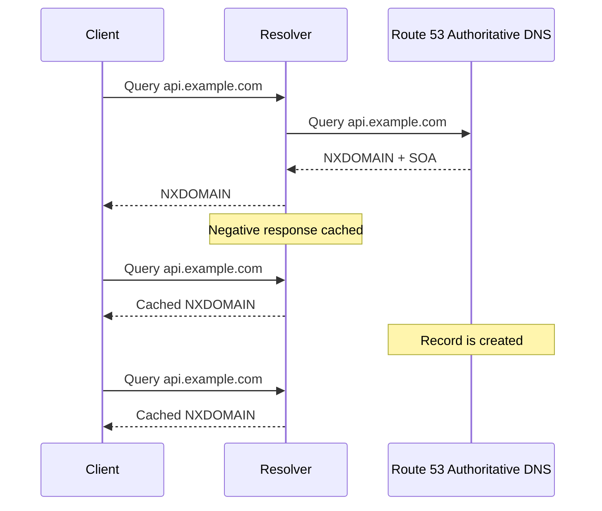
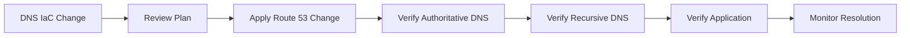

# 06- NXDOMAIN and Negative Caching Issues

## Overview

`NXDOMAIN` is a DNS response indicating that the queried domain name does not exist. In production systems, NXDOMAIN becomes particularly important when DNS records are created, deleted, renamed, delegated, or migrated.

The difficult part is that DNS does not only cache successful answers. Recursive resolvers can also cache negative responses. As a result, fixing a missing Route 53 record does not necessarily make the name immediately resolvable for every client.

A typical incident looks like:

```text
Client
  │
  ▼
Recursive Resolver
  │
  │  cached NXDOMAIN
  ▼
NXDOMAIN
  │
  │
  └── Route 53 record has already been fixed
```

The Route 53 configuration may be correct while clients continue receiving an old negative answer.

For senior backend engineers, the important distinction is between:

- The authoritative DNS state.
- The recursive resolver's cached state.
- The application's local DNS cache.
- The actual application endpoint.

---

## What NXDOMAIN Means

`NXDOMAIN` means that the DNS name itself does not exist according to the authoritative DNS server.

For example:

```text
api.example.com
```

may return:

```text
status: NXDOMAIN
```

This is different from a successful DNS response containing no useful application endpoint.

Conceptually:

```text
DNS query
   │
   ▼
Does the name exist?
   │
   ├── Yes ──► Answer / other DNS response
   │
   └── No  ──► NXDOMAIN
```

NXDOMAIN is therefore a statement about the **existence of the queried DNS name**, not simply the absence of an `A` record.

---

## NXDOMAIN vs NODATA

These two cases are frequently confused.

| Situation | Typical DNS Result |
|---|---|
| Name does not exist | `NXDOMAIN` |
| Name exists but requested record type does not exist | `NOERROR` with no answer records |
| Name exists with an `A` record | `NOERROR` with an `A` answer |
| Name exists with a `CNAME` | `NOERROR` with CNAME and potentially additional resolution |

Example:

```text
api.example.com
```

exists but only has:

```text
AAAA
```

A query for:

```text
A api.example.com
```

may return `NOERROR` with no `A` answer rather than NXDOMAIN.

This distinction is critical during troubleshooting.

---

## Why Negative Caching Exists

Negative caching prevents recursive resolvers from repeatedly querying authoritative nameservers for names that do not exist.

Without negative caching:

```text
Client 1 ──┐
Client 2 ──┤
Client 3 ──┼──► Recursive Resolver ──► Authoritative DNS
Client 4 ──┤
Client 5 ──┘
```

Every query for the nonexistent name could result in another authoritative lookup.

With negative caching:

```text
Client 1 ──┐
Client 2 ──┤
Client 3 ──┼──► Recursive Resolver
Client 4 ──┤          │
Client 5 ──┘          ▼
                  Cached NXDOMAIN
```

The resolver can answer subsequent requests without contacting Route 53 until the negative cache entry expires.

---

## Negative TTL

Negative caching has a TTL that determines how long a recursive resolver can retain the negative result.

For DNS negative caching, the relevant TTL is derived from the authoritative response and associated SOA information.

A simplified model is:

```text
Authoritative DNS
      │
      │ NXDOMAIN + SOA
      ▼
Recursive Resolver
      │
      │ caches negative result
      ▼
Clients
```

The exact behavior depends on the DNS response and resolver implementation.

The important operational rule is:

> Fixing the authoritative DNS configuration does not necessarily invalidate negative cache entries already held by recursive resolvers.

---

## Route 53 and SOA Records

Every Route 53 hosted zone has an SOA record.

A simplified SOA record contains fields such as:

```text
primary nameserver
responsible mailbox
serial
refresh
retry
expire
minimum
```

For negative caching, the SOA information is important because it contributes to the negative response's caching behavior.

Inspect a Route 53 zone:

```bash
aws route53 list-resource-record-sets \
  --hosted-zone-id Z0123456789EXAMPLE
```

Look for:

```text
example.com SOA
```

You can also query it directly:

```bash
dig SOA example.com
```

---

## Negative Caching Request Lifecycle

Consider a newly created API record:

```text
api.example.com → ALB
```

A client queries it before the record exists.



The final response can remain NXDOMAIN until the resolver's negative cache entry expires.

---

## The Classic Production Incident

A common deployment sequence is:

```text
1. Deploy application
2. Configure DNS
3. DNS record creation fails or happens late
4. External resolver queries hostname
5. Resolver receives NXDOMAIN
6. Resolver caches NXDOMAIN
7. DNS record is fixed
8. Clients still receive NXDOMAIN
```

The engineer then sees:

```text
Route 53:
api.example.com → exists
```

but the application still reports:

```text
DNS resolution failed
```

This is often interpreted incorrectly as a Route 53 propagation problem.

The more accurate model is:

```text
Route 53 authoritative state
        │
        └── Correct

Recursive resolver cache
        │
        └── Still contains NXDOMAIN
```

---

## Authoritative vs Recursive Queries

During an incident, always distinguish between these two questions.

### What does Route 53 currently say?

Query an authoritative nameserver:

```bash
dig @ns-123.awsdns-45.com api.example.com
```

### What does the client's recursive resolver currently say?

```bash
dig api.example.com
```

These can produce different results.

Example:

```text
Authoritative:

api.example.com. 60 IN A 203.0.113.10


Recursive resolver:

api.example.com. 120 IN NXDOMAIN
```

This strongly suggests a cached negative response rather than an incorrect current Route 53 record.

---

## Identifying Authoritative Nameservers

First inspect the domain's NS records:

```bash
dig NS example.com
```

Example:

```text
example.com. 172800 IN NS ns-123.awsdns-45.com.
example.com. 172800 IN NS ns-456.awsdns-78.net.
```

Then query one directly:

```bash
dig @ns-123.awsdns-45.com api.example.com
```

For troubleshooting, testing multiple authoritative nameservers can also be useful.

```bash
dig @ns-123.awsdns-45.com api.example.com
dig @ns-456.awsdns-78.net api.example.com
```

If authoritative servers consistently return the expected answer, Route 53 itself may no longer be the problem.

---

## Understanding the `dig` Output

A useful query is:

```bash
dig api.example.com
```

Important sections include:

```text
ANSWER SECTION
AUTHORITY SECTION
SERVER
```

For NXDOMAIN, the response may contain an authority section with the zone's SOA record.

Example:

```text
status: NXDOMAIN

;; AUTHORITY SECTION:
example.com. 300 IN SOA ns-123.awsdns-45.com. ...
```

The presence of the SOA in the negative response is useful evidence when investigating negative caching.

---

## Checking DNS Response Status

Use:

```bash
dig api.example.com
```

and inspect:

```text
status: NOERROR
```

versus:

```text
status: NXDOMAIN
```

You can make this easier to inspect with:

```bash
dig +noall +answer api.example.com
```

For more complete diagnostic output:

```bash
dig +noall +authority api.example.com
```

During an incident, do not rely only on the browser's error message.

---

## NXDOMAIN Does Not Mean Route 53 Is Down

If Route 53 returns NXDOMAIN, it generally means the queried name does not exist in the relevant DNS namespace.

Possible causes include:

- Record was never created.
- Record was deleted.
- Wrong hosted zone was modified.
- Domain is delegated to a different hosted zone.
- Typo in hostname.
- Parent zone does not delegate the expected zone.
- Private/public hosted zone confusion.
- Resolver is returning cached NXDOMAIN.
- DNS migration is incomplete.

Therefore:

```text
NXDOMAIN
   ≠
Route 53 outage
```

It is a DNS state that requires context.

---

## Wrong Hosted Zone

One of the most common Route 53 mistakes is modifying a hosted zone that is not authoritative for the domain.

Example:

```text
Hosted Zone A
example.com
    └── api.example.com → ALB-A

Hosted Zone B
example.com
    └── api.example.com → ALB-B
```

If the domain is delegated to Hosted Zone B, changing Hosted Zone A does not affect public DNS resolution.

Verify the authoritative nameservers:

```bash
dig NS example.com
```

Then compare them with the Route 53 hosted zone:

```bash
aws route53 get-hosted-zone \
  --id Z0123456789EXAMPLE
```

---

## Public and Private Hosted Zone Confusion

Route 53 supports both public and private hosted zones.

A private hosted zone can contain:

```text
api.internal.example.com
```

but public internet resolvers cannot use that private zone.

A common incident is:

```text
Application
   │
   ▼
Expected private DNS
   │
   ▼
Wrong VPC / resolver path
   │
   ▼
NXDOMAIN
```

When troubleshooting, determine:

- Is the zone public or private?
- Which VPC is querying it?
- Is the VPC associated with the hosted zone?
- Is the query going through Amazon Route 53 Resolver?
- Is split-horizon DNS being used?

---

## Split-Horizon DNS

A common production architecture uses the same domain name in public and private hosted zones.

```text
                 example.com
                     │
          ┌──────────┴──────────┐
          ▼                     ▼
    Public Hosted Zone     Private Hosted Zone
          │                     │
          ▼                     ▼
    Public ALB             Internal ALB
```

A query from inside the VPC can therefore produce a different answer from a query on the public internet.

During an NXDOMAIN incident, always test from the same network context as the affected workload.

---

## Application-Level DNS Caching

The recursive resolver is not necessarily the only cache.

A backend system may have:

```text
Application
    │
    ▼
OS resolver
    │
    ▼
Local DNS cache
    │
    ▼
Recursive resolver
    │
    ▼
Route 53
```

Examples of additional caching layers include:

- OS-level caching.
- Local DNS caching services.
- Container environments.
- JVM DNS caching.
- Application-specific resolver behavior.
- Service meshes.
- Sidecars.

Therefore, fixing Route 53 does not guarantee immediate resolution inside every process.

---

## Containers and Kubernetes

In Kubernetes, DNS typically involves CoreDNS.

The resolution path can look like:

```text
Application Pod
      │
      ▼
CoreDNS
      │
      ▼
VPC Resolver
      │
      ▼
Route 53
```

A cached negative response can therefore exist at multiple layers.

For example:

```text
Pod
 │
 ▼
CoreDNS
 │
 └── cached negative response
```

If public DNS works from your laptop but fails from a Kubernetes workload, test the DNS path from inside the cluster.

Example:

```bash
kubectl exec -it <pod> -- \
  getent hosts api.example.com
```

or:

```bash
kubectl exec -it <pod> -- \
  nslookup api.example.com
```

The exact availability of diagnostic tools depends on the container image.

---

## Docker DNS Troubleshooting

Containers may use Docker's embedded DNS behavior before forwarding queries upstream.

A useful diagnostic is:

```bash
cat /etc/resolv.conf
```

inside the container.

For example:

```bash
docker exec <container> cat /etc/resolv.conf
```

Then compare resolution from:

```text
Host
Container
VPC workload
External network
```

If only one environment returns NXDOMAIN, the issue may be resolver-specific rather than Route 53-specific.

---

## DNS Caching and Deployments

Avoid deployment workflows that require a hostname to exist only after clients have already started querying it.

Risky:

```text
Deploy clients
    │
    ▼
Clients query hostname
    │
    ▼
NXDOMAIN
    │
    ▼
DNS record created
```

Safer:

```text
Create DNS record
    │
    ▼
Verify authoritative DNS
    │
    ▼
Verify recursive resolution
    │
    ▼
Deploy application/client
```

For important production endpoints, DNS should generally be established before dependent traffic is introduced.

---

## Pre-Creating DNS Records

For blue-green or migration deployments, DNS records can often be created before traffic is switched.

Example:

```text
api.example.com
      │
      ▼
Existing production target

New target
      │
      ▼
Already represented in DNS configuration
```

This reduces the chance that a first client request generates an NXDOMAIN response before the record exists.

---

## DNS Migration Risks

DNS migrations commonly involve:

```text
Old DNS provider
       │
       ▼
New Route 53 hosted zone
       │
       ▼
Nameserver delegation
```

A common mistake is:

1. Create Route 53 hosted zone.
2. Add records.
3. Assume the domain is now using Route 53.
4. Forget to update delegation.

The Route 53 zone can be perfectly configured while public clients continue querying the old DNS provider.

---

## Parent Zone and Delegation

For a delegated subdomain:

```text
example.com
    │
    ▼
api.example.com
```

the parent zone may contain an NS delegation for the child zone.

If delegation is wrong:

```text
Client
  │
  ▼
Parent DNS
  │
  ▼
Wrong authoritative servers
  │
  ▼
NXDOMAIN
```

Always verify the delegation chain when investigating persistent NXDOMAIN responses.

---

## Wildcard Records

A wildcard record can answer queries for names that do not have explicit records.

Example:

```text
*.example.com → ALB
```

However, wildcard behavior does not mean every DNS failure will disappear.

An existing name can still produce different behavior based on the records and DNS hierarchy present.

Do not use a wildcard as a generic fix for an NXDOMAIN incident without understanding the intended DNS model.

Wildcards can also hide configuration errors by making unexpected hostnames resolve.

---

## CNAME and NXDOMAIN

Consider:

```text
api.example.com CNAME backend.example.net
```

The first name exists, but resolution may ultimately fail if:

```text
backend.example.net
```

does not exist.

The troubleshooting path is therefore:

```text
api.example.com
      │
      ▼
CNAME
      │
      ▼
backend.example.net
      │
      ▼
NXDOMAIN
```

Check the entire CNAME chain:

```bash
dig api.example.com
dig backend.example.net
```

Do not stop after confirming that the first DNS record exists.

---

## Alias Records and NXDOMAIN

Route 53 alias records can point to AWS resources such as:

- ALB.
- NLB.
- CloudFront.
- API Gateway.
- S3 website endpoints.

For example:

```text
api.example.com
      │
      ▼
Route 53 Alias
      │
      ▼
ALB
```

If the alias record itself exists, the problem may instead be:

- Wrong hosted zone.
- Wrong alias target.
- Incorrect delegation.
- Private/public resolution mismatch.
- Target resource problem.

An NXDOMAIN response still requires examining the DNS name's authoritative existence before debugging the target application.

---

## Negative Caching During Incident Recovery

Suppose:

```text
10:00 — api.example.com queried
10:00 — Route 53 returns NXDOMAIN
10:01 — resolver caches negative response
10:02 — DNS record created
10:03 — Route 53 returns A record
```

A client using the same recursive resolver may still observe:

```text
NXDOMAIN
```

until the negative cache expires.

The key distinction is:

```text
Authoritative state:
CORRECT

Cached resolver state:
STALE
```

Do not repeatedly modify the Route 53 record simply because one recursive resolver continues returning NXDOMAIN.

---

## Why Repeated DNS Changes Can Make Things Worse

During an incident, engineers sometimes repeatedly change:

```text
TTL
Record
Record value
Hosted zone
```

without identifying the cache layer.

This can create configuration churn without changing the cached response already held by resolvers.

A better approach is:

```text
Identify cache
    │
    ▼
Determine cached response TTL
    │
    ▼
Verify authoritative state
    │
    ▼
Wait for legitimate cache expiry
    │
    ▼
Retest
```

---

## Troubleshooting Workflow

Use the following sequence.

### Confirm the Exact Hostname

Check:

```text
api.example.com
```

against:

```text
api.exmaple.com
```

DNS troubleshooting often starts with a simple hostname mistake.

---

### Check the Public Delegation

```bash
dig NS example.com
```

Confirm that the expected Route 53 nameservers are authoritative.

---

### Query Route 53 Authoritatively

```bash
dig @ns-123.awsdns-45.com api.example.com
```

Determine whether the authoritative answer is:

```text
A / AAAA / CNAME
```

or:

```text
NXDOMAIN
```

---

### Query the Recursive Resolver

```bash
dig api.example.com
```

Compare the response with the authoritative result.

---

### Inspect the SOA

For NXDOMAIN:

```bash
dig api.example.com
```

Inspect the authority section.

You can also query:

```bash
dig SOA example.com
```

This provides useful information about negative caching behavior.

---

### Query Multiple Resolvers

Different recursive resolvers may have different cache states.

For example:

```bash
dig @1.1.1.1 api.example.com
```

```bash
dig @8.8.8.8 api.example.com
```

These public resolver addresses are examples only; use resolvers appropriate to your environment and troubleshooting policy.

If one resolver returns NXDOMAIN while another returns the correct answer, caching or resolver-specific behavior becomes a strong hypothesis.

---

### Test From the Affected Environment

If the issue affects:

- EC2.
- ECS.
- EKS.
- Lambda.
- Docker.
- Corporate networks.

test from that environment.

A laptop query may not reproduce the application's DNS path.

---

## Diagnostic Matrix

| Authoritative | Recursive | Likely Interpretation |
|---|---|---|
| NXDOMAIN | NXDOMAIN | Record/name likely does not exist |
| Correct answer | NXDOMAIN | Negative cache or resolver-specific issue |
| Correct answer | Correct answer | DNS likely functioning |
| NXDOMAIN | Correct answer | Resolver may have cached an older positive answer |
| Correct answer | SERVFAIL | Resolver/delegation/DNSSEC or upstream issue |
| Correct answer | Different answer | Split DNS, delegation, or resolver path |

This matrix is a useful starting point rather than a complete diagnosis.

---

## Using `dig +trace`

For delegation problems:

```bash
dig +trace api.example.com
```

This follows the DNS delegation chain from the root downward.

Conceptually:

```text
Root
 │
 ▼
.com
 │
 ▼
example.com
 │
 ▼
Route 53 authoritative servers
 │
 ▼
api.example.com
```

This can expose:

- Incorrect delegation.
- Missing delegation.
- Unexpected authoritative servers.
- DNS hierarchy problems.

`+trace` does not exactly reproduce every recursive resolver's behavior, so use it as a diagnostic tool rather than a replacement for querying the affected resolver.

---

## Route 53 AWS CLI Verification

List the hosted zones:

```bash
aws route53 list-hosted-zones
```

Inspect a specific zone:

```bash
aws route53 get-hosted-zone \
  --id Z0123456789EXAMPLE
```

List records:

```bash
aws route53 list-resource-record-sets \
  --hosted-zone-id Z0123456789EXAMPLE
```

For infrastructure incidents, combine AWS API inspection with DNS-level queries.

---

## Monitoring NXDOMAIN

A production DNS monitoring strategy should distinguish:

```text
Expected NXDOMAIN
```

from:

```text
Unexpected NXDOMAIN
```

Not every NXDOMAIN is an incident.

For example:

```text
random-invalid-subdomain.example.com
```

may legitimately return NXDOMAIN.

Monitoring should focus on known production names and expected DNS behavior.

Useful signals include:

- DNS resolution failures.
- NXDOMAIN rate for critical hostnames.
- SERVFAIL responses.
- Application connection failures.
- Resolver health.
- Route 53 health checks.
- DNS changes.

---

## Synthetic DNS Monitoring

A synthetic check can periodically query critical records:

```text
api.example.com
www.example.com
auth.example.com
```

The check should validate:

```text
Expected DNS status
Expected record type
Expected target
```

For example:

```text
Expected:
api.example.com → ALB

Observed:
NXDOMAIN

Alert
```

This can detect DNS failures before application-level monitoring detects them.

---

## Security Considerations

NXDOMAIN behavior also has security implications.

Unexpected NXDOMAIN responses can indicate:

- DNS misconfiguration.
- Domain takeover risk.
- Broken delegation.
- Missing records.
- DNSSEC problems.
- Compromised DNS configuration.

Avoid using wildcard DNS records simply to suppress NXDOMAIN responses.

Also protect Route 53 modification permissions because unauthorized deletion of a DNS record can intentionally produce an outage.

---

## Reliability Considerations

For critical DNS:

- Pre-create production records where practical.
- Verify authoritative DNS after changes.
- Monitor critical names.
- Understand negative caching.
- Keep TTL strategy deliberate.
- Test DNS migrations.
- Verify delegation.
- Test public and private resolution separately.
- Document rollback behavior.
- Avoid emergency changes without reconciliation.

DNS reliability depends on both authoritative correctness and resolver behavior.

---

## Deployment Best Practices

A robust deployment workflow is:



For critical endpoints:

1. Create or modify the DNS record.
2. Verify the authoritative nameserver.
3. Verify recursive resolution.
4. Verify the application endpoint.
5. Monitor the endpoint during the change window.
6. Keep the previous routing configuration available for rollback where appropriate.

---

## Common Mistakes

### Treating NXDOMAIN as a Generic DNS Error

NXDOMAIN specifically indicates nonexistence of the queried name.

### Checking Only Route 53

The authoritative zone can be correct while recursive resolvers still contain cached negative responses.

### Checking Only the Browser

Browsers and operating systems may have their own caching behavior.

### Forgetting Delegation

A correctly configured Route 53 zone is irrelevant if the domain is delegated elsewhere.

### Confusing NODATA With NXDOMAIN

A name can exist without having the requested record type.

### Ignoring Split-Horizon DNS

Public and private hosted zones can return different results.

### Assuming DNS Changes Are Instant

Recursive resolvers cache responses.

### Repeatedly Changing Records During an Incident

Configuration changes do not necessarily invalidate cached NXDOMAIN responses.

### Testing From the Wrong Network

A laptop may use a different DNS path from an EC2 instance, container, or Kubernetes pod.

---

## Production Pitfalls

### Creating Records After Dependent Traffic Starts

A client may receive NXDOMAIN before the record exists and cache the negative response.

### DNS Migration Without Delegation Verification

The new Route 53 zone may never become authoritative.

### Relying on a Single Resolver for Diagnosis

One resolver can have a different cache state from another.

### Ignoring SOA Information

The SOA in a negative response provides important evidence for understanding negative caching.

### Using Wildcards to Hide Configuration Problems

Wildcards can make unintended hostnames resolve and conceal missing explicit records.

### Assuming "Route 53 Is Correct" Means "DNS Is Correct"

DNS correctness must be evaluated across:

```text
Delegation
   ↓
Authoritative zone
   ↓
Recursive resolver
   ↓
Local resolver
   ↓
Application
```

---

## Interview Traps

### What is NXDOMAIN?

It is a DNS response indicating that the queried domain name does not exist.

### Is NXDOMAIN the same as "no A record"?

No. A name can exist while the requested record type does not. That case can produce `NOERROR` with an empty answer section rather than NXDOMAIN.

### Why can NXDOMAIN continue after creating the record?

A recursive resolver may have cached the previous negative response.

### How would you distinguish Route 53 failure from negative caching?

Query an authoritative Route 53 nameserver directly and compare its answer with the affected recursive resolver.

### What controls negative caching?

The negative response and its SOA information determine the caching behavior, subject to the recursive resolver's implementation.

### Does lowering the DNS record TTL immediately clear cached NXDOMAIN responses?

No. Changing the TTL of a newly created positive record does not retroactively invalidate negative cache entries that were already stored by recursive resolvers.

### What would you check first if Route 53 shows the record but clients receive NXDOMAIN?

Check:

```text
Authoritative response
        ↓
Recursive resolver response
        ↓
Delegation
        ↓
Negative cache
        ↓
Client-side DNS path
```

### Why might one resolver return the correct record while another returns NXDOMAIN?

Resolvers can have different cache states and may have observed the DNS name at different times.

---

## Key Takeaways

The most important mental model is:

```text
                    DNS Query
                       │
                       ▼
                Recursive Resolver
                       │
              ┌────────┴────────┐
              │                 │
       Cached NXDOMAIN      Cache Miss
              │                 │
              ▼                 ▼
           Client        Route 53 Authoritative
                                  │
                           ┌──────┴──────┐
                           │             │
                        NXDOMAIN       Answer
                           │             │
                           ▼             ▼
                    Negative Cache   Positive Cache
```

Remember:

- NXDOMAIN means the queried DNS name does not exist.
- NXDOMAIN is different from a name existing without the requested record type.
- Recursive resolvers can cache negative responses.
- Fixing a Route 53 record does not immediately invalidate existing negative cache entries.
- The authoritative Route 53 response and recursive resolver response can temporarily differ.
- The SOA record is important when diagnosing negative caching.
- Always distinguish authoritative DNS from recursive DNS.
- Verify domain delegation before assuming Route 53 is authoritative.
- Public and private hosted zones can produce different answers.
- Test DNS from the same environment as the affected application.
- CNAME chains can move the actual failure to another hostname.
- `dig +trace` is useful for delegation analysis.
- Do not repeatedly modify DNS records without first identifying the cache layer.
- Pre-create critical DNS records before dependent production traffic starts when practical.
- Monitor critical hostnames rather than treating every NXDOMAIN as an incident.
- Protect Route 53 modification permissions because unauthorized record deletion can cause DNS outages.
- A successful Route 53 configuration change is not the same as successful end-to-end DNS resolution.

The senior-level troubleshooting model is:

```text
Client
  │
  ▼
Application / OS DNS Cache
  │
  ▼
Recursive Resolver
  │
  ├── Cached NXDOMAIN?
  │
  └── Cache Miss
        │
        ▼
    DNS Delegation
        │
        ▼
Route 53 Authoritative DNS
        │
        ├── NXDOMAIN
        │
        └── Expected Answer
```

When diagnosing NXDOMAIN, do not ask only **"Does the Route 53 record exist?"**. Ask **"What does the authoritative server return, what does the affected resolver return, where is the response being cached, and is the domain actually delegated to this Route 53 hosted zone?"**