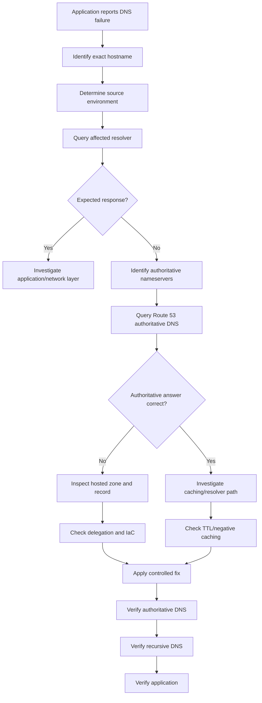

# README

## Overview

This folder contains a production-oriented troubleshooting playbook for **Amazon Route 53**.

The focus is not on learning DNS syntax from scratch. Instead, these notes provide a systematic approach to diagnosing Route 53 failures across authoritative DNS, recursive resolvers, private hosted zones, DNS caching, health checks, infrastructure as code, and application environments.

Route 53 incidents often require reasoning across multiple layers:

```text
Application
    │
    ▼
Container / Host Resolver
    │
    ▼
Recursive DNS Resolver
    │
    ▼
DNS Delegation
    │
    ▼
Route 53 Authoritative DNS
    │
    ▼
AWS Target / Application
```

A Route 53 record can be correctly configured while the application still experiences DNS failures because the problem may exist in delegation, caching, resolver configuration, private DNS, health-check evaluation, or infrastructure automation.

---

## Troubleshooting Philosophy

Route 53 troubleshooting should be evidence-driven.

Avoid immediately changing DNS records when an application reports a resolution failure. First determine **which layer is returning the unexpected result**.

A useful mental model is:

```text
What hostname is being queried?
        │
        ▼
Where is the query originating?
        │
        ▼
Which resolver receives it?
        │
        ▼
Is the answer cached?
        │
        ▼
Which nameservers are authoritative?
        │
        ▼
What does Route 53 return?
        │
        ▼
Is the returned record correct?
        │
        ▼
Does the application reach the resolved target?
```

The most useful distinction during an incident is:

| Observation | Primary Question |
|---|---|
| `NXDOMAIN` | Does the queried name exist? |
| `SERVFAIL` | Why could the resolver not obtain a valid answer? |
| Wrong IP | Which authoritative record or resolver path produced it? |
| Intermittent answers | Are multiple resolvers, records, or routing policies involved? |
| Private DNS failure | Is the query using the expected VPC resolver path? |
| Failover not occurring | Is the health check state and routing policy behaving as expected? |
| DNS works externally but not internally | Is split-horizon/private DNS involved? |
| DNS works after waiting | Is caching or TTL behavior involved? |

---

## Troubleshooting Workflow

Use this sequence before making corrective changes.



### Core diagnostic commands

```bash
dig api.example.com

dig NS example.com

dig SOA example.com

dig +trace api.example.com
```

Query a specific authoritative nameserver:

```bash
dig @ns-123.awsdns-45.com api.example.com
```

Inspect the Route 53 hosted zone:

```bash
aws route53 get-hosted-zone \
  --id Z0123456789EXAMPLE
```

Inspect records:

```bash
aws route53 list-resource-record-sets \
  --hosted-zone-id Z0123456789EXAMPLE
```

---

## Contents

### Troubleshooting Methodology

**File:** `01- Troubleshooting Methodology.md`

Covers the overall Route 53 troubleshooting process, including:

- DNS request lifecycle.
- Authoritative vs recursive DNS.
- Systematic diagnosis.
- `dig` and DNS inspection techniques.
- Route 53 CLI verification.
- Layer-by-layer troubleshooting.
- Production incident methodology.
- Evidence collection.
- Common diagnostic mistakes.

**Use this first when an unfamiliar Route 53 problem occurs.**

---

### DNS Changes and Caching Issues

**File:** `02- DNS Changes and Caching Issues.md`

Covers problems where DNS configuration has changed but clients continue receiving old results.

Topics include:

- DNS TTL behavior.
- Recursive resolver caching.
- Local caching.
- Deployment sequencing.
- DNS propagation misconceptions.
- Positive caching.
- Negative caching.
- DNS migration behavior.
- Cache-aware incident response.

**Use this when a DNS change appears correct in Route 53 but clients still see an old result.**

---

### Private Hosted Zone Resolution Issues

**File:** `03- Private Hosted Zone Resolution Issues.md`

Covers DNS failures inside AWS VPC environments.

Topics include:

- Private hosted zones.
- VPC associations.
- Route 53 Resolver.
- Split-horizon DNS.
- EC2 resolution.
- ECS and EKS DNS paths.
- Hybrid DNS.
- Resolver configuration.
- Public vs private hosted zones.

**Use this when DNS works publicly but fails from an AWS workload, or when internal hostnames cannot be resolved.**

---

### Failover and Health Check Issues

**File:** `04- Failover and Health Check Issues.md`

Covers Route 53 routing behavior and DNS-based failover problems.

Topics include:

- Route 53 health checks.
- Primary/secondary failover.
- Health-check state.
- Routing policy behavior.
- DNS-level failover.
- Target health vs application health.
- False assumptions about health checks.
- Failover verification.

**Use this when Route 53 does not appear to switch traffic after an endpoint failure.**

---

### Infrastructure as Code Configuration Issues

**File:** `05- Infrastructure as Code Configuration Issues.md`

Covers Route 53 failures caused by infrastructure automation.

Topics include:

- Terraform/CloudFormation configuration.
- Hosted zone identification.
- Record lifecycle.
- Dependency ordering.
- Drift.
- Import and replacement behavior.
- CI/CD DNS changes.
- Safe production changes.
- State management.
- Deployment validation.

**Use this when DNS configuration is managed through IaC or CI/CD and the deployed state differs from expectations.**

---

### NXDOMAIN and Negative Caching Issues

**File:** `06- NXDOMAIN and Negative Caching Issues.md`

Covers situations where DNS names return `NXDOMAIN`, including cases where the record has already been created or corrected.

Topics include:

- Meaning of `NXDOMAIN`.
- `NXDOMAIN` vs `NODATA`.
- Negative caching.
- SOA records.
- Recursive resolver behavior.
- DNS delegation.
- CNAME chains.
- Public/private resolution differences.
- Kubernetes and CoreDNS behavior.
- Production incident diagnosis.

**Use this when a hostname reports that it does not exist or continues returning NXDOMAIN after a DNS change.**

---

## Recommended Reading Order

The troubleshooting documents are designed to be used as both a learning sequence and an incident reference.

```text
01- Troubleshooting Methodology
              │
              ▼
02- DNS Changes and Caching Issues
              │
              ▼
03- Private Hosted Zone Resolution Issues
              │
              ▼
04- Failover and Health Check Issues
              │
              ▼
05- Infrastructure as Code Configuration Issues
              │
              ▼
06- NXDOMAIN and Negative Caching Issues
```

For learning, read them in order.

For production incidents, jump directly to the document matching the observed failure and use the methodology document as the diagnostic framework.

---

## Route 53 Troubleshooting Matrix

| Problem | First Things to Check | Primary Tool |
|---|---|---|
| Hostname returns `NXDOMAIN` | Authoritative DNS, delegation, negative cache | `dig` |
| DNS returns old IP | TTL, recursive cache, authoritative record | `dig` |
| DNS works publicly but not internally | Private hosted zone, VPC association, Resolver | `dig`, AWS CLI |
| Failover does not occur | Health check state, routing policy, target | Route 53 console/CLI |
| DNS changes revert | IaC state and CI/CD pipeline | Terraform/CloudFormation |
| Wrong hosted zone appears updated | Domain delegation and hosted-zone NS | `dig NS` |
| DNS works on laptop but not EC2 | VPC resolver and private DNS | `dig`, `/etc/resolv.conf` |
| DNS works on EC2 but not EKS | CoreDNS and pod resolver configuration | `kubectl`, `dig` |
| Intermittent DNS answers | Multiple records, routing policy, resolver caches | `dig` |
| DNS migration fails | NS delegation and registrar configuration | `dig NS`, `dig +trace` |
| Route 53 record exists but application fails | DNS target, network path, target health | `dig`, AWS networking tools |
| Newly created hostname remains unavailable | Negative caching | `dig`, SOA inspection |

---

## Production DNS Investigation Model

For senior backend troubleshooting, separate the problem into these layers:

### DNS Configuration Layer

Check:

- Hosted zone.
- Record name.
- Record type.
- Record value.
- Routing policy.
- Alias configuration.
- Health-check association.

### Delegation Layer

Check:

- Registrar nameservers.
- Parent-zone delegation.
- Route 53 authoritative nameservers.
- Delegated subdomains.

### Resolver Layer

Check:

- Recursive resolver.
- Resolver cache.
- Negative caching.
- VPC DNS.
- CoreDNS.
- Local DNS services.

### Application Layer

Check:

- Hostname being used.
- Runtime DNS behavior.
- Container configuration.
- Connection errors.
- Application-level retries.
- Connection pooling.

### Target Layer

Once DNS resolution succeeds, continue checking:

- ALB/NLB.
- CloudFront.
- API Gateway.
- EC2.
- ECS.
- EKS.
- Service endpoints.
- Security groups.
- Network ACLs.
- Application health.

A successful DNS lookup only proves that name resolution worked. It does **not** prove that the backend is reachable.

---

## Useful `dig` Reference

| Command | Purpose |
|---|---|
| `dig example.com` | Query configured recursive resolver |
| `dig A example.com` | Query A record |
| `dig AAAA example.com` | Query IPv6 record |
| `dig CNAME example.com` | Query CNAME |
| `dig NS example.com` | Inspect delegation |
| `dig SOA example.com` | Inspect SOA information |
| `dig +trace example.com` | Trace DNS delegation |
| `dig @server example.com` | Query a specific DNS server |
| `dig +noall +answer example.com` | Show answer section |
| `dig +noall +authority example.com` | Show authority section |

---

## AWS CLI Reference

List hosted zones:

```bash
aws route53 list-hosted-zones
```

Inspect a hosted zone:

```bash
aws route53 get-hosted-zone \
  --id Z0123456789EXAMPLE
```

List records:

```bash
aws route53 list-resource-record-sets \
  --hosted-zone-id Z0123456789EXAMPLE
```

Inspect health checks:

```bash
aws route53 list-health-checks
```

Get a specific health check:

```bash
aws route53 get-health-check \
  --health-check-id HEALTH_CHECK_ID
```

Inspect DNSSEC configuration where applicable:

```bash
aws route53 get-dnssec \
  --hosted-zone-id Z0123456789EXAMPLE
```

---

## Production Best Practices

### Verify Authoritative DNS Before Changing Configuration

Always determine what the authoritative nameserver currently returns.

```bash
dig @<authoritative-nameserver> api.example.com
```

This prevents recursive cache state from being mistaken for Route 53 configuration state.

### Test From the Affected Environment

If an EKS pod cannot resolve a hostname, testing from a developer laptop is insufficient.

Test:

```text
Developer machine
EC2
ECS task
EKS pod
Lambda
Corporate network
```

as appropriate.

### Treat DNS Changes as Deployments

Production DNS changes should have:

- Review.
- Change tracking.
- IaC where appropriate.
- Validation.
- Rollback strategy.
- Monitoring.

### Avoid Emergency Configuration Churn

Do not repeatedly change records simply because one resolver still has stale data.

First identify:

```text
Authoritative state
        ↓
Recursive state
        ↓
Local/application state
```

### Monitor Critical Hostnames

Synthetic DNS checks should validate important production names independently of application health checks.

---

## Common Mistakes

| Mistake | Why It Happens | Better Approach |
|---|---|---|
| Checking only Route 53 console | Assumes authoritative state equals client state | Compare authoritative and recursive responses |
| Calling DNS changes "propagation" | Simplifies resolver caching into a vague concept | Identify the exact cache and TTL |
| Modifying the wrong hosted zone | Multiple environments may use similar zones | Verify delegation |
| Ignoring private DNS | AWS workloads can use different resolution paths | Test from the affected VPC |
| Treating NXDOMAIN as a generic error | DNS response semantics are misunderstood | Distinguish NXDOMAIN, NODATA, and SERVFAIL |
| Testing only from a laptop | Local DNS path differs from production | Test from production environment |
| Ignoring IaC | Manual changes can be overwritten | Inspect Terraform/CloudFormation state |
| Assuming health checks equal application health | DNS health checks have specific semantics | Understand what the health check actually tests |
| Changing TTL during an incident | TTL does not retroactively invalidate cached responses | Determine existing cache state |
| Using wildcards as a generic fix | Wildcards can hide missing records | Model DNS names explicitly |

---

## Incident Checklist

Use this checklist during a Route 53 incident.

### Identification

- [ ] What exact hostname is failing?
- [ ] What record type is being queried?
- [ ] Which environment is affected?
- [ ] Is the failure public, private, or both?
- [ ] When did the failure begin?
- [ ] Was a DNS change recently deployed?

### Resolver Investigation

- [ ] Query the affected recursive resolver.
- [ ] Query the authoritative nameserver.
- [ ] Compare the answers.
- [ ] Inspect TTL.
- [ ] Inspect SOA information for negative responses.
- [ ] Test another resolver when appropriate.

### Route 53 Investigation

- [ ] Verify hosted zone.
- [ ] Verify record.
- [ ] Verify record type.
- [ ] Verify routing policy.
- [ ] Verify alias target.
- [ ] Verify health-check configuration.
- [ ] Verify public/private hosted-zone behavior.

### Delegation Investigation

- [ ] Check parent-zone delegation.
- [ ] Check NS records.
- [ ] Verify registrar configuration where applicable.
- [ ] Use `dig +trace` for delegation problems.

### AWS Network Investigation

- [ ] Verify VPC association for private zones.
- [ ] Verify Route 53 Resolver path.
- [ ] Check `/etc/resolv.conf`.
- [ ] Check CoreDNS for Kubernetes workloads.
- [ ] Verify network connectivity after DNS resolution succeeds.

### Infrastructure Investigation

- [ ] Check Terraform/CloudFormation state.
- [ ] Check recent CI/CD deployments.
- [ ] Check for configuration drift.
- [ ] Determine whether manual changes will be overwritten.

### Recovery Verification

- [ ] Verify authoritative DNS.
- [ ] Verify recursive DNS.
- [ ] Verify from affected production environment.
- [ ] Verify application connectivity.
- [ ] Monitor for recurrence.

---

## Key Takeaways

Route 53 troubleshooting is fundamentally a **distributed-state debugging problem**.

The authoritative DNS configuration is only one part of the system:

```text
                ┌─────────────────────┐
                │ Route 53 Hosted Zone│
                └──────────┬──────────┘
                           │
                           ▼
                    Authoritative DNS
                           │
                           ▼
                  Recursive Resolver
                           │
                    ┌──────┴──────┐
                    │             │
                 Cache         Query Route 53
                    │             │
                    └──────┬──────┘
                           ▼
                    Local Resolver
                           │
                           ▼
                      Application
```

The most important operational principles are:

- Always distinguish authoritative DNS from recursive DNS.
- Use `dig` to observe the actual DNS response rather than relying on application errors alone.
- Verify delegation before assuming Route 53 is authoritative.
- Understand positive and negative caching.
- Treat public and private DNS as separate resolution paths.
- Test from the same network environment as the failing workload.
- Investigate health checks separately from backend application health.
- Treat Route 53 configuration as production infrastructure.
- Prefer IaC and controlled deployments for DNS changes.
- Verify DNS changes at multiple layers after deployment.
- Do not confuse DNS resolution success with application reachability.
- When an incident occurs, identify the failing layer before changing configuration.

The senior-level question is not simply:

> "Does the Route 53 record exist?"

It is:

> "What answer is authoritative, what answer is being returned to the affected client, which resolver path produced it, where could that answer be cached or altered, and what happens after DNS resolution succeeds?"