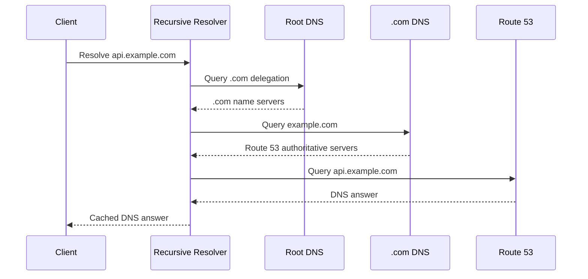
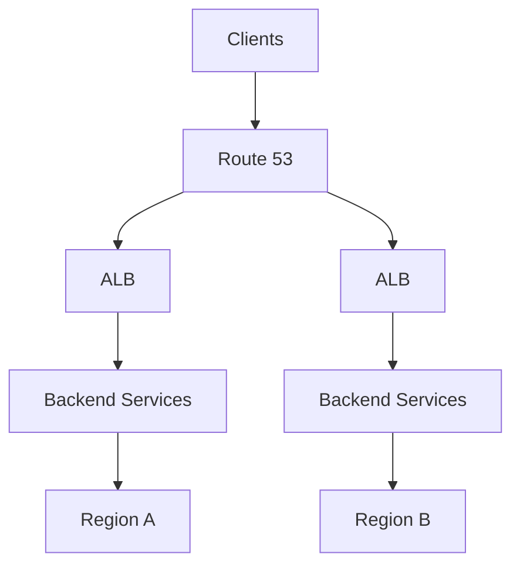

# 01- Core Interview Questions

## Overview

Amazon Route 53 interview questions usually test more than the ability to define DNS records. At backend and senior engineering levels, interviewers expect you to reason about DNS resolution, routing policies, health checks, private DNS, caching, failover, security, and production architecture.

A strong answer should connect Route 53 to the complete request path:

```text
Client
  │
  ▼
Recursive DNS Resolver
  │
  ▼
Route 53 Authoritative DNS
  │
  ▼
Routing Policy
  │
  ├── Load Balancer
  ├── CloudFront
  ├── API Gateway
  ├── EC2
  ├── Kubernetes ingress
  └── Another service
       │
       ▼
Backend Application
```

The questions below progress from core DNS concepts to production-level architecture and troubleshooting.

---

## Core Route 53 Questions

### What is Amazon Route 53?

Amazon Route 53 is AWS's managed DNS service that provides authoritative DNS hosting, domain registration, DNS routing, health checks, and related service-discovery capabilities.

For backend systems, Route 53 commonly sits at the DNS layer in front of:

- CloudFront.
- Application Load Balancers.
- Network Load Balancers.
- API Gateway.
- S3 website endpoints.
- EC2-based applications.
- Multi-region applications.
- Private AWS services.

The important distinction is that Route 53 is primarily a **DNS control and routing layer**. It does not process HTTP application requests itself.

---

### Why is Route 53 called "Route 53"?

DNS traditionally uses port **53** for both UDP and TCP DNS traffic.

The name combines:

```text
Route + DNS port 53
```

The "route" part also reflects Route 53's ability to route DNS responses according to policies such as latency, failover, weighted, geolocation, and geoproximity routing.

---

### Is Route 53 a DNS resolver?

Route 53 provides multiple DNS capabilities, but it is important to distinguish **authoritative DNS** from **recursive DNS resolution**.

A public hosted zone makes Route 53 authoritative for a domain.

For example:

```text
api.example.com
       │
       ▼
Authoritative Route 53 Hosted Zone
       │
       ▼
A / AAAA / CNAME / Alias Record
```

Route 53 Resolver is a separate capability used for DNS resolution within AWS environments and for integrating AWS DNS resolution with external networks.

A common interview mistake is saying simply:

> "Route 53 resolves all DNS requests."

A more accurate answer distinguishes authoritative DNS hosting from recursive resolution.

---

### What is a hosted zone?

A hosted zone is a container for DNS records associated with a domain or DNS namespace.

There are two major types:

| Hosted Zone | Purpose |
|---|---|
| Public hosted zone | Authoritative DNS records accessible through the public DNS system |
| Private hosted zone | DNS records resolvable from associated VPCs |

Example public zone:

```text
example.com
├── api.example.com
├── www.example.com
├── auth.example.com
└── static.example.com
```

Example private zone:

```text
internal.example.com
├── api.internal.example.com
├── db.internal.example.com
└── redis.internal.example.com
```

---

### What is the difference between a public and private hosted zone?

| Aspect | Public Hosted Zone | Private Hosted Zone |
|---|---|---|
| Visibility | Public DNS | Associated VPCs |
| Typical use | Internet-facing services | Internal services |
| Resolution | Public DNS infrastructure | Route 53 Resolver inside associated VPCs |
| Example | `api.example.com` | `db.internal.example.com` |
| Internet accessibility | Potentially public | Not inherently public |

A private hosted zone is useful for service-to-service communication where internal DNS names should not be exposed publicly.

---

### What is an A record?

An A record maps a hostname to an IPv4 address.

```text
api.example.com → 203.0.113.10
```

Example:

```text
api.example.com
Type: A
Value: 203.0.113.10
```

A records are appropriate when the DNS answer needs to contain IPv4 addresses.

---

### What is an AAAA record?

An AAAA record maps a hostname to an IPv6 address.

```text
api.example.com → 2001:db8::10
```

Modern applications supporting IPv6 may publish both:

```text
A     → IPv4
AAAA  → IPv6
```

---

### What is a CNAME record?

A CNAME creates an alias from one DNS name to another DNS name.

```text
api.example.com
       │
       ▼
service.example.net
```

The resolver ultimately follows the target hostname to obtain its address.

A major DNS rule is that a traditional CNAME cannot coexist with other record types at the same name, and a CNAME cannot be used at the zone apex.

---

### What is an Alias record in Route 53?

An Alias record is an AWS-specific mechanism that allows a Route 53 record to point to supported AWS resources.

Common targets include:

- CloudFront distributions.
- Application Load Balancers.
- Network Load Balancers.
- API Gateway endpoints.
- S3 website endpoints.
- Route 53 resources.

For example:

```text
api.example.com
       │
       ▼
Alias A
       │
       ▼
Application Load Balancer
```

Alias records are particularly useful because AWS can manage the underlying resource address while Route 53 resolves the alias appropriately.

---

### Alias vs CNAME: what is the difference?

| Feature | Alias | CNAME |
|---|---|---|
| AWS-specific | Yes | No |
| DNS standard record | No | Yes |
| Zone apex | Supported for supported targets | Not supported |
| AWS resource integration | Strong | Generic |
| Common AWS use | ALB, CloudFront, API Gateway | External hostname |
| Can return A/AAAA semantics | Yes | No, CNAME semantics |

A common production pattern is:

```text
example.com
    │
    ▼
Alias A
    │
    ▼
CloudFront / ALB
```

---

### Why can't a CNAME normally be used at the zone apex?

The zone apex is the root of the DNS zone.

For:

```text
example.com
```

the apex is:

```text
example.com
```

A CNAME at the apex conflicts with the requirement that the zone apex contain authoritative records such as NS and SOA records.

Route 53 Alias records solve this problem for supported AWS targets.

---

## DNS Resolution Questions

### Explain what happens when a user requests `api.example.com`.

A simplified resolution path is:



In practice, the recursive resolver may already have cached some or all delegation information, so the complete root-to-authoritative sequence does not necessarily happen for every request.

The key concept is that the client typically does not directly perform the entire authoritative lookup itself.

---

### What is TTL?

TTL stands for **Time To Live**.

It tells DNS resolvers and caches how long a DNS response can be cached.

For example:

```text
api.example.com
TTL: 60 seconds
```

A shorter TTL generally allows changes to propagate through recursive caches sooner, while increasing DNS query frequency.

A longer TTL reduces repeated DNS lookups but causes changes to remain cached longer.

---

### What happens when you change a DNS record?

Suppose:

```text
api.example.com
Old → ALB-A
New → ALB-B
```

Changing Route 53 does not mean every client immediately receives the new value.

Previously returned answers may remain cached according to their TTL and related DNS caching behavior.

Therefore:

```text
Route 53 changed
      │
      ▼
Authoritative answer changed
      │
      ▼
Recursive caches expire
      │
      ▼
Clients gradually observe new answer
```

This is why DNS changes should be planned around caching behavior.

---

### Does lowering TTL immediately speed up propagation?

No.

If a resolver already cached a record with a long TTL, lowering the TTL at the authoritative server does not retroactively change that existing cached entry.

For planned migrations, reduce the TTL **before** the migration and allow existing long-lived cache entries to expire.

---

### What is DNS propagation?

The term "DNS propagation" is often used loosely.

DNS does not push a new record to every client globally.

Instead:

1. The authoritative DNS server changes.
2. Recursive resolvers continue serving cached responses.
3. Cached responses expire.
4. Resolvers query authoritative servers again.
5. New responses become available to clients.

Understanding caching is more useful operationally than thinking of DNS as a global push mechanism.

---

## Routing Policy Questions

### What routing policies does Route 53 support?

Important Route 53 routing policies include:

| Policy | Primary Use |
|---|---|
| Simple | Basic DNS response |
| Weighted | Traffic distribution by configured weights |
| Latency-based | Route to lowest-latency AWS region |
| Failover | Primary/secondary architecture |
| Geolocation | Route based on client geographic location |
| Geoproximity | Route based on geographic proximity and bias |
| IP-based | Route based on source IP ranges |
| Multivalue answer | Return multiple healthy records |

The correct policy depends on the business and system requirement.

---

### When would you use weighted routing?

Weighted routing is useful when traffic should be distributed according to configured percentages or weights.

Example:

```text
api.example.com

Region A → Weight 90
Region B → Weight 10
```

This can support:

- Canary deployments.
- Gradual migrations.
- Traffic splitting.
- Blue/green strategies.

However, DNS-level weights are not equivalent to an application-layer load balancer's exact traffic distribution.

Caching means the actual distribution seen by individual backend instances can differ from the configured percentages.

---

### How does latency-based routing work?

Latency-based routing attempts to route users to the AWS region that provides the lowest latency according to AWS's latency measurements.

Example:

```text
                    Route 53
                   /        \
              Region A     Region B
               us-east      eu-west
                  │            │
                ALB          ALB
```

This is useful for multi-region applications where minimizing network latency is important.

Latency-based routing is not the same as:

> "Always send the user to the geographically closest region."

Network latency and geographic distance are not identical.

---

### What is failover routing?

Failover routing supports a primary/secondary model.

```text
                Route 53
                    │
          ┌─────────┴─────────┐
          │                   │
       Primary             Secondary
          │                   │
       Healthy?              Standby
          │
          ▼
       Primary
```

If the primary is considered unhealthy according to the configured health-check behavior, Route 53 can return the secondary record.

Failover is useful for:

- Disaster recovery.
- Active/passive architectures.
- Regional failover.
- Backup endpoints.

---

### Does Route 53 health checking automatically make an application highly available?

No.

A health check only provides a signal that Route 53 can use for routing decisions.

If the secondary environment is broken, failover can simply redirect users from one failure to another.

A real HA design requires:

- Healthy secondary infrastructure.
- Correct application configuration.
- Data availability.
- Dependency availability.
- Valid certificates.
- Working networking.
- Tested recovery procedures.

---

### What is multivalue answer routing?

Multivalue answer routing allows Route 53 to return multiple healthy records for a DNS query.

It can improve availability when multiple endpoints are available.

It is not a replacement for a dedicated load balancer.

For sophisticated traffic distribution, connection management, health-aware load balancing, and application-layer routing, use the appropriate load-balancing service.

---

## Health Check Questions

### What is a Route 53 health check?

A Route 53 health check determines whether an endpoint or configured health-check target is considered healthy.

Health checks can be used with routing policies such as failover and other routing configurations.

A good health check should validate something meaningful about service availability.

---

### What should a production health check test?

A health endpoint should usually be lightweight and deterministic.

For example:

```http
GET /health
```

Possible response:

```http
HTTP/1.1 200 OK
Content-Type: application/json

{
  "status": "healthy"
}
```

However, blindly checking only HTTP 200 can be misleading.

For a backend service, distinguish:

```text
Liveness
    │
    └── Process can respond

Readiness
    │
    └── Service can safely receive traffic

Dependency health
    │
    ├── Database
    ├── Redis
    └── External APIs
```

A DNS failover health check should represent the business requirement for receiving traffic, not merely whether a web server process is alive.

---

### Should a Route 53 health check query the database?

Usually, avoid making the external DNS health check dependent on every downstream dependency.

Consider:

```text
Route 53
   │
   ▼
/health
   │
   ├── PostgreSQL
   ├── Redis
   ├── Kafka
   └── External API
```

If every dependency failure causes the endpoint to become unhealthy, a transient dependency problem can cause DNS-level failover and potentially amplify the incident.

Health checks should be designed carefully around the failure domain.

---

## Private DNS Questions

### What is Route 53 Resolver?

Route 53 Resolver provides DNS resolution capabilities for AWS VPCs and supports DNS integration between AWS and external networks.

It is important in hybrid environments involving:

- AWS VPCs.
- On-premises networks.
- VPN.
- Direct Connect.
- Private hosted zones.
- Conditional DNS forwarding.

---

### How does a private hosted zone work?

A private hosted zone is associated with one or more VPCs.

For example:

```text
VPC
 │
 ├── Application
 │       │
 │       ▼
 │   api.internal.example.com
 │       │
 │       ▼
 └── Route 53 Resolver
         │
         ▼
    Private Hosted Zone
```

The DNS name is not intended to be publicly resolvable.

---

### Can two private hosted zones have the same domain name?

Yes, Route 53 can support private hosted zones with overlapping namespaces under specific configurations.

This creates an important operational consideration: DNS resolution behavior depends on VPC associations and the Route 53 Resolver rules that apply.

Overlapping private namespaces should therefore be designed deliberately rather than used casually.

---

## Security Questions

### How can Route 53 be secured?

Important controls include:

- Least-privilege IAM.
- MFA for privileged users.
- Separate production deployment roles.
- CloudTrail auditing.
- Controlled CI/CD permissions.
- DNSSEC where appropriate.
- Restricted access to DNS query logs.
- Strong ownership boundaries.

The highest-risk permission is generally the ability to modify production DNS records.

---

### Why is DNS modification access sensitive?

Consider:

```text
Attacker
   │
   ▼
Compromised IAM Role
   │
   ▼
Route 53 Record Modified
   │
   ▼
api.example.com
   │
   ▼
Attacker-controlled endpoint
```

A DNS modification can redirect users without modifying the application itself.

This makes Route 53 configuration access a high-value security boundary.

---

### What is DNSSEC?

DNSSEC adds cryptographic authentication to DNS responses.

Its purpose is to allow resolvers to validate that DNS data originated from the expected DNS zone and was not modified in transit.

Conceptually:

```text
DNS Query
   │
   ▼
DNS Response
   │
   ▼
DNSSEC Validation
   │
   ├── Valid → Accept
   └── Invalid → Reject
```

DNSSEC addresses DNS data authenticity and integrity concerns; it does not encrypt ordinary DNS queries.

---

## Troubleshooting Questions

### A user says the DNS record was changed but they still reach the old server. What do you check?

Start with the complete resolution path.

```text
Client
  │
  ▼
Local DNS Cache
  │
  ▼
Recursive Resolver
  │
  ▼
Route 53
```

Check:

1. The authoritative Route 53 record.
2. Record TTL.
3. Recursive resolver response.
4. Local OS/browser cache.
5. Whether the client is using the expected DNS resolver.
6. Whether the domain delegates to the expected Route 53 name servers.
7. Whether another DNS provider is authoritative.

Useful commands include:

```bash
dig api.example.com
dig +trace api.example.com
dig @8.8.8.8 api.example.com
dig @1.1.1.1 api.example.com
```

The important diagnostic principle is to distinguish **authoritative state** from **cached state**.

---

### How would you determine whether Route 53 is actually authoritative for a domain?

Inspect the NS delegation.

```bash
dig NS example.com
```

Then compare the delegated name servers with the authoritative Route 53 hosted zone.

You can also trace resolution:

```bash
dig +trace example.com
```

If the domain is delegated to another DNS provider, changing a record in a Route 53 hosted zone that is not authoritative for the domain will not affect public resolution.

---

### What is NXDOMAIN?

NXDOMAIN means the queried DNS name does not exist.

For example:

```text
missing.example.com
        │
        ▼
NXDOMAIN
```

It differs from an existing hostname that simply has no address record.

NXDOMAIN responses can also be cached, which can make newly created records appear unavailable for some time.

---

### Why can DNS changes appear inconsistent across users?

Different recursive resolvers may have different cache states.

For example:

```text
User A → Resolver A → Cached old record
User B → Resolver B → New authoritative record
User C → Resolver C → Cached old record
```

This can produce apparently inconsistent behavior during a DNS migration.

---

## Architecture Questions

### How would you design Route 53 for a multi-region application?

A common architecture is:



The routing policy depends on the requirement:

- Failover for active/passive DR.
- Latency for latency-sensitive active/active systems.
- Weighted routing for controlled traffic distribution.
- Geolocation/geoproximity for location-based requirements.

The DNS design must be combined with data replication, application deployment, and recovery architecture.

---

### How would you use Route 53 for blue/green deployment?

One approach is weighted DNS routing:

```text
api.example.com

Blue  → Weight 90
Green → Weight 10
```

Traffic can gradually move:

```text
90/10
  ↓
75/25
  ↓
50/50
  ↓
10/90
  ↓
0/100
```

However, DNS caching means this is not an exact per-request traffic switch.

For precise application-level traffic management, a load balancer or service-mesh-based strategy may be more appropriate.

---

### How would you design DNS for microservices?

Do not automatically expose every microservice through public DNS.

A typical architecture is:

```text
Public
api.example.com
        │
        ▼
API Gateway / ALB
        │
        ▼
Internal Services
        │
        ├── users.internal.example.com
        ├── orders.internal.example.com
        └── payments.internal.example.com
```

Internal service names can be backed by private DNS.

For Kubernetes environments, Kubernetes-native service discovery may be more appropriate for pod-to-service communication, while Route 53 can remain useful for external or broader infrastructure boundaries.

---

## Production Scenario Questions

### Your primary region is down. How would Route 53 help?

Route 53 can participate in failover by returning a secondary endpoint when the primary is considered unhealthy.

A complete response should mention that Route 53 is only one part of the solution:

```text
Primary Region Failure
        │
        ▼
Health Check
        │
        ▼
Route 53 Failover
        │
        ▼
Secondary Region
        │
        ▼
Healthy Application
```

You should also verify:

- Secondary infrastructure is operational.
- Data is available.
- Secrets and configuration exist.
- Certificates are valid.
- Networking works.
- Dependencies are available.
- Recovery has been tested.

---

### Your application is returning HTTP 500 errors, but Route 53 reports the endpoint as healthy. Why?

A health check may not represent actual application correctness.

For example:

```text
/health → 200 OK
/api/orders → 500
```

The process is reachable, but the application may still be functionally broken.

The health-check endpoint should therefore represent the intended traffic-readiness condition.

---

### DNS failover is configured, but users still reach the failed region. Why?

Possible causes include:

- DNS caching.
- TTL.
- Recursive resolver behavior.
- Client-side caching.
- Health-check status.
- Incorrect routing configuration.
- The wrong hosted zone being modified.
- Domain delegation pointing elsewhere.

The key interview point is:

> Route 53 changes authoritative answers; it cannot instantly invalidate every cached DNS response worldwide.

---

## Scenario-Based Senior Questions

### How would you safely migrate a production domain from one load balancer to another?

A safe approach is:

1. Verify the new load balancer independently.
2. Configure the target application.
3. Validate TLS and health checks.
4. Lower the DNS TTL ahead of the migration.
5. Wait for existing long-lived cache entries to expire.
6. Introduce controlled traffic routing.
7. Monitor application and DNS metrics.
8. Gradually increase traffic to the new target.
9. Keep the old target available during rollback.
10. Restore normal TTL after stabilization.

The critical principle is to prepare the caching environment **before** the change.

---

### How would you prevent a DNS change from becoming a production outage?

Use multiple layers of control:

```text
Developer
   │
   ▼
Git
   │
   ▼
CI Validation
   │
   ▼
Code Review
   │
   ▼
Deployment
   │
   ▼
Route 53
   │
   ▼
Monitoring
```

Recommended controls include:

- IaC.
- Peer review.
- Environment separation.
- Least-privilege deployment roles.
- Change validation.
- Automated tests.
- Health checks.
- Monitoring.
- Rollback procedures.

---

### What would you monitor for a critical Route 53 configuration?

Monitor both **configuration state** and **runtime behavior**.

| Area | Example Signal |
|---|---|
| Health | Health-check status |
| DNS | Query behavior |
| Changes | Route 53 configuration changes |
| Resolution | Expected DNS responses |
| Application | HTTP 4xx/5xx |
| Availability | Endpoint reachability |
| Routing | Traffic distribution |
| Security | Unauthorized configuration changes |

The objective is not simply to monitor Route 53. It is to detect when DNS behavior is causing or contributing to an application incident.

---

## Common Interview Traps

| Trap | Better Answer |
|---|---|
| "Route 53 is a load balancer." | Route 53 is a DNS service with routing capabilities; it does not replace an L4/L7 load balancer |
| "DNS changes are immediate." | Authoritative changes can be delayed by recursive and client-side caching |
| "Low TTL means no caching." | Low TTL reduces cache lifetime; it does not eliminate caching |
| "CNAME can be used everywhere." | CNAME cannot be used at the DNS zone apex |
| "Alias is the same as CNAME." | Alias is a Route 53-specific mechanism with AWS resource integration |
| "Health checks make the application highly available." | They provide health signals; the failover architecture must also be healthy |
| "Latency routing means nearest geographic region." | It uses AWS latency measurements, not simply geographic distance |
| "Private hosted zones are public DNS." | Private hosted zones are designed for DNS resolution within associated VPC environments |
| "Route 53 controls application traffic directly." | It controls DNS answers; caching affects the resulting traffic distribution |
| "DNSSEC encrypts DNS." | DNSSEC provides authentication/integrity; it does not encrypt normal DNS traffic |

---

## Rapid-Fire Questions

### What port does DNS normally use?

DNS normally uses port **53**.

UDP is commonly used for DNS queries, while TCP is also used in cases such as larger responses and DNS operations that require TCP.

### What is the difference between authoritative and recursive DNS?

An authoritative server provides the definitive DNS records for a zone.

A recursive resolver obtains answers on behalf of clients and may cache them.

### What is the SOA record?

The Start of Authority record contains administrative and zone-level information about a DNS zone.

### What is an NS record?

An NS record identifies the authoritative name servers for a DNS zone.

### What is DNS caching?

DNS caching stores DNS responses temporarily so future queries can be answered without repeatedly querying authoritative servers.

### What happens when TTL expires?

The cached response becomes eligible for refresh, and the recursive resolver may query the authoritative DNS server again.

### Can Route 53 route HTTP requests?

Not directly. Route 53 routes DNS responses. The selected endpoint then handles the actual application request.

### Can Route 53 replace an ALB?

No. Route 53 and an ALB operate at different layers.

```text
Route 53 → DNS
ALB      → HTTP/HTTPS load balancing
```

### Can Route 53 point to an external service?

Yes. DNS records can point to appropriate external hostnames or IP addresses, subject to DNS record semantics.

### What is a private hosted zone commonly used for?

Internal DNS names for resources and services that should not be exposed through public DNS.

### What is the main purpose of Route 53 failover routing?

To return different DNS answers based on the health state of primary and secondary targets.

### Why are DNS migrations difficult?

Caching prevents an authoritative change from being observed immediately by every client.

### Why is DNS important for microservices?

Stable DNS names provide an abstraction between clients and the infrastructure implementing a service.

### What is split-horizon DNS?

Using different DNS answers for the same namespace depending on where the request originates, commonly using public and private DNS views.

### Why should production DNS be managed through IaC?

It provides version control, reviewability, repeatability, auditability, and protection against configuration drift.

---

## Key Takeaways

- Route 53 is fundamentally a managed DNS service with powerful routing and health-check capabilities.
- Understand the distinction between authoritative DNS, recursive resolution, and Route 53 Resolver.
- Public and private hosted zones serve different architectural purposes.
- A records map names to IPv4 addresses; AAAA records map names to IPv6 addresses.
- CNAME records cannot be used at the DNS zone apex, while supported Route 53 Alias records can.
- TTL controls DNS cache lifetime and directly affects migration and failover behavior.
- DNS changes are not instant because recursive resolvers and clients cache responses.
- Routing policies should be selected based on system requirements rather than familiarity.
- Weighted routing is useful for controlled DNS-level traffic distribution but does not provide exact per-request percentages.
- Latency-based routing is based on AWS latency measurements, not simply geographic distance.
- Failover routing requires a genuinely healthy secondary environment.
- Route 53 health checks should represent meaningful service health without creating unnecessary dependency coupling.
- Private DNS is an important building block for internal service architectures.
- DNS modification permissions are highly sensitive and should be protected with least-privilege IAM and auditing.
- DNSSEC provides DNS data authenticity and integrity, not general DNS encryption.
- DNS troubleshooting should always distinguish authoritative answers from cached answers.
- Route 53 can participate in blue/green and multi-region architectures, but DNS caching limits the precision of traffic control.
- Production DNS should be version-controlled, reviewed, monitored, and included in disaster-recovery planning.
- At senior level, Route 53 questions are primarily architecture and failure-mode questions rather than record-definition questions.