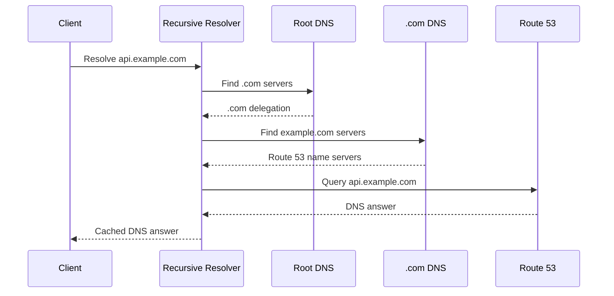
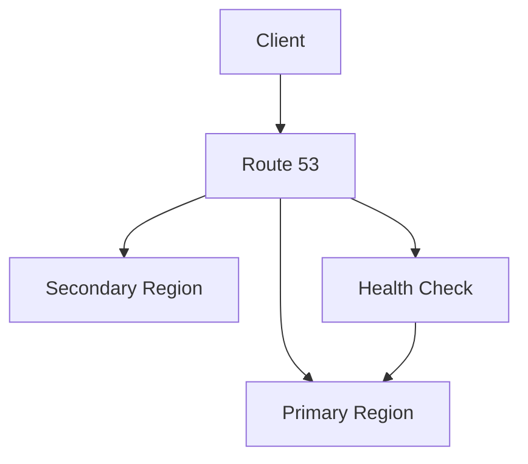
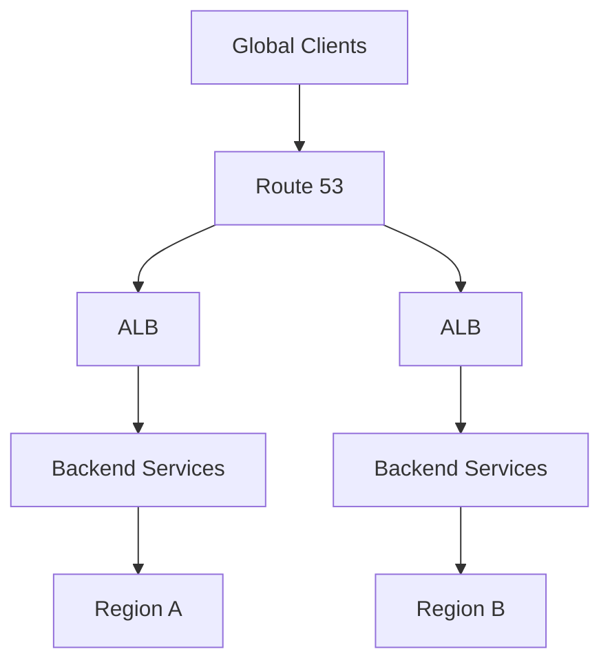

# 02- DNS and Routing Questions

## Overview

Route 53 interview questions at the senior backend level typically focus on how DNS resolution, routing policies, caching, health checks, and application architecture interact.

The important skill is not memorizing routing-policy names. It is being able to reason about the complete request path:

```text
Client
  │
  ▼
Recursive DNS Resolver
  │
  ▼
Route 53 Authoritative DNS
  │
  ▼
Routing Policy
  │
  ▼
AWS Endpoint
  │
  ├── CloudFront
  ├── ALB / NLB
  ├── API Gateway
  └── Other supported target
        │
        ▼
Backend Application
```

A strong interview answer should also account for DNS caching. Route 53 controls the authoritative DNS response, but recursive resolvers and clients may continue using cached responses until their applicable TTL expires.

---

## DNS Fundamentals

### What happens when a client resolves `api.example.com`?

The client generally asks a recursive DNS resolver to resolve the hostname.

A simplified resolution flow is:



In production, the recursive resolver may already have cached the relevant delegation or DNS answer, so it does not necessarily perform every step for every request.

The important distinction is:

```text
Client
  │
  ▼
Recursive Resolver
  │
  ▼
Authoritative DNS
```

The authoritative DNS server owns the answer for the zone; the recursive resolver obtains and caches answers on behalf of clients.

---

### What is the difference between recursive and authoritative DNS?

| Type | Responsibility |
|---|---|
| Recursive resolver | Finds DNS answers for clients and caches them |
| Authoritative server | Provides the definitive records for a DNS zone |

Route 53 hosted zones provide authoritative DNS service.

Route 53 Resolver provides DNS resolution capabilities within AWS and supports hybrid DNS architectures.

A strong interview answer should avoid saying simply:

> "Route 53 is the DNS resolver."

That statement is incomplete.

---

### What is DNS delegation?

DNS delegation tells the DNS hierarchy which name servers are authoritative for a domain or zone.

For example:

```text
example.com
     │
     ▼
NS records
     │
     ▼
Route 53 authoritative name servers
```

When registering a domain outside Route 53, you generally configure the domain registrar to delegate the domain to the Route 53 name servers associated with the public hosted zone.

---

### What is an NS record?

An NS record identifies the authoritative name servers for a DNS zone.

For example:

```text
example.com
    │
    └── NS
         ├── ns-123.awsdns-xx.org
         ├── ns-456.awsdns-xx.com
         └── ...
```

If the domain's delegation does not point to the expected authoritative name servers, modifying records in a Route 53 hosted zone may have no effect on public DNS resolution.

---

### What is an SOA record?

SOA stands for **Start of Authority**.

It contains authoritative information about a DNS zone, including information such as:

- Primary name-server information.
- Zone administrator information.
- Serial information.
- Refresh-related values.
- Retry-related values.
- Expiration-related values.
- Minimum/negative-caching-related information.

The SOA record is especially relevant when troubleshooting DNS behavior and negative caching.

---

## DNS Record Questions

### What is the difference between A and AAAA records?

| Record | Maps hostname to |
|---|---|
| A | IPv4 address |
| AAAA | IPv6 address |

Example:

```text
api.example.com
    │
    ├── A     → 203.0.113.10
    └── AAAA  → 2001:db8::10
```

A modern dual-stack service may publish both records.

---

### What is a CNAME record?

A CNAME creates an alias from one hostname to another hostname.

```text
api.example.com
       │
       ▼
service.example.net
```

The resolver then follows the target hostname to obtain the final address.

CNAME is useful when the destination is another DNS name rather than a fixed IP address.

---

### What is an Alias record?

An Alias record is a Route 53-specific mechanism that allows a DNS name to point to supported AWS resources.

Common targets include:

- CloudFront.
- Application Load Balancer.
- Network Load Balancer.
- API Gateway.
- S3 website endpoints.
- Route 53 resources.

Example:

```text
api.example.com
       │
       ▼
Alias A
       │
       ▼
Application Load Balancer
```

Alias records are particularly useful for AWS-managed resources whose underlying IP addresses may change.

---

### Alias vs CNAME

| Characteristic | Alias | CNAME |
|---|---|---|
| DNS standard record | No | Yes |
| Route 53-specific | Yes | No |
| Zone apex | Supported for supported AWS targets | Not supported |
| AWS resource integration | Strong | Generic DNS |
| Typical AWS use | ALB, CloudFront, API Gateway | Hostname-to-hostname aliasing |

A common production pattern is:

```text
example.com
    │
    ▼
Alias A
    │
    ▼
CloudFront
```

---

### Why can't a CNAME normally be used at the zone apex?

A DNS zone apex must contain records such as NS and SOA records.

A traditional CNAME cannot coexist with the required authoritative records at the same DNS name.

For example:

```text
example.com
```

is the apex of:

```text
example.com
```

Route 53 Alias records provide an AWS-specific solution for supported targets.

---

## TTL and DNS Caching

### What is TTL?

TTL, or Time To Live, specifies how long a DNS response may be cached by a resolver.

Example:

```text
api.example.com
TTL = 60 seconds
```

A shorter TTL can make DNS changes observable sooner after cached responses expire, while increasing the frequency with which resolvers need to refresh the record.

A longer TTL can reduce DNS query volume and improve caching efficiency, but makes changes take longer to propagate through existing caches.

---

### Does changing a Route 53 record immediately change every user's DNS response?

No.

Suppose:

```text
api.example.com

Old → ALB-A
New → ALB-B
```

Route 53 can immediately serve the new authoritative answer, but a recursive resolver may still have the old answer cached.

```text
Route 53
   │
   │ New answer
   ▼
Authoritative DNS

Recursive Resolver
   │
   │ Old cached answer
   ▼
Client
```

This is one of the most important concepts in DNS troubleshooting.

---

### Does lowering TTL immediately remove existing cached values?

No.

Suppose a record had:

```text
TTL = 3600
```

and you change it to:

```text
TTL = 60
```

A resolver that already cached the old response can continue using it according to the previously received TTL.

For planned DNS migrations, lower the TTL **before** the migration and allow existing caches to age out.

---

### What is negative DNS caching?

DNS systems can cache negative responses such as NXDOMAIN.

Example:

```text
api.example.com
       │
       ▼
NXDOMAIN
```

If the hostname is subsequently created, clients may still receive the cached negative response until the relevant negative cache lifetime expires.

This is a common reason a newly created DNS record appears not to work immediately.

---

## Route 53 Routing Policies

### What routing policies does Route 53 provide?

Important Route 53 routing policies include:

| Policy | Primary purpose |
|---|---|
| Simple | Basic DNS routing |
| Weighted | Controlled distribution between records |
| Latency-based | Route toward lower-latency AWS regions |
| Failover | Primary/secondary routing |
| Geolocation | Route based on client geographic location |
| Geoproximity | Route based on geographic proximity and bias |
| IP-based | Route based on source IP ranges |
| Multivalue answer | Return multiple healthy records |

The correct policy depends on the system requirement.

---

### What is simple routing?

Simple routing is the basic routing behavior where a record provides an answer without advanced routing logic.

It is appropriate when:

- There is a single primary endpoint.
- No traffic splitting is required.
- No geographic routing is required.
- No DNS-level failover is required.

Example:

```text
api.example.com
       │
       ▼
ALB
```

Simple routing is often the correct choice for straightforward architectures.

---

### What is weighted routing?

Weighted routing distributes DNS responses according to configured weights.

Example:

```text
api.example.com

Blue   → Weight 90
Green  → Weight 10
```

This can support:

- Canary deployments.
- Blue/green migration.
- Gradual regional migration.
- Controlled DNS-level traffic distribution.

A critical limitation is that DNS routing is affected by caching. A 90/10 configuration does not guarantee that exactly 90% of every HTTP request reaches Blue.

---

### How would you implement a canary deployment using Route 53?

A simple approach is:

```text
api.example.com
       │
       ▼
Route 53 Weighted Routing
       │
       ├── Blue  → 90
       │
       └── Green → 10
```

After validating Green:

```text
90/10
  ↓
75/25
  ↓
50/50
  ↓
25/75
  ↓
0/100
```

Monitor:

- HTTP 5xx rate.
- Latency.
- Application errors.
- Dependency failures.
- Business metrics.
- Health-check status.

For precise request-level traffic control, use an application-aware load-balancing or deployment mechanism instead of relying solely on DNS.

---

### What is latency-based routing?

Latency-based routing attempts to return the endpoint associated with the AWS region that provides the lowest latency from the client perspective according to AWS's latency measurements.

Example:

```text
                 Route 53
                /        \
               /          \
        us-east-1        eu-west-1
            │                │
           ALB              ALB
            │                │
        Backend          Backend
```

It is useful for active/active multi-region systems.

Latency routing should not be described as:

> "Route 53 always chooses the geographically closest region."

Geographic distance and network latency are not equivalent.

---

### When would you choose latency routing over failover routing?

Use **latency-based routing** when multiple regions should actively serve traffic and minimizing network latency is important.

Use **failover routing** when there is a primary region and a secondary region that should receive traffic only when the primary is considered unhealthy.

| Requirement | Better fit |
|---|---|
| Active/active | Latency |
| Active/passive DR | Failover |
| Canary | Weighted |
| Geographic restrictions | Geolocation |
| Geographic traffic balancing | Geoproximity |

---

### What is geolocation routing?

Geolocation routing makes routing decisions based on the geographic location associated with the DNS query.

Example:

```text
Client
  │
  ▼
Route 53
  │
  ├── Europe → EU endpoint
  ├── Asia   → Asia endpoint
  └── US     → US endpoint
```

Use cases include:

- Regulatory requirements.
- Regional content.
- Localization.
- Data residency architectures.

Geolocation should not be treated as a generic latency optimization mechanism.

---

### What is geoproximity routing?

Geoproximity routing considers geographic proximity between users and resources and supports geographic bias.

The bias can effectively expand or shrink the geographic area from which a resource receives traffic.

It is useful when traffic distribution needs to be influenced geographically rather than using fixed location categories.

---

### What is IP-based routing?

IP-based routing allows DNS responses to be selected based on source IP ranges.

It can be useful when known client networks need to be mapped to particular endpoints.

This is more specialized than typical public application routing and should be used only when the source-IP requirement is explicit.

---

### What is multivalue answer routing?

Multivalue answer routing allows Route 53 to return multiple healthy records.

Example:

```text
api.example.com
   │
   ├── Endpoint A
   ├── Endpoint B
   └── Endpoint C
```

Health checks can influence which records are returned.

It can improve availability, but it should not be confused with a full-featured application load balancer.

---

## Failover and Health Check Questions

### How does Route 53 failover routing work?

A typical architecture is:



Conceptually:

```text
Primary healthy
    │
    ▼
Return primary

Primary unhealthy
    │
    ▼
Return secondary
```

The health-check state influences which DNS answer Route 53 returns.

---

### Does Route 53 failover guarantee zero downtime?

No.

DNS failover does not eliminate all failure or recovery time.

Potential delays include:

- Health-check detection.
- DNS response caching.
- Client-side caching.
- Application startup.
- Data replication lag.
- Dependency recovery.
- Connection reuse.
- Client behavior.

A production DR design must consider the complete recovery path.

---

### What should a health check verify?

A health check should represent whether an endpoint should receive traffic.

A basic application endpoint might be:

```http
GET /health
```

However, health-check design requires care.

A process-level check:

```text
/health → HTTP 200
```

does not necessarily mean:

```text
Application → Fully operational
```

A service may return 200 while PostgreSQL, Redis, or another critical dependency is unavailable.

---

### Should a health endpoint check every dependency?

Not automatically.

Consider:

```text
Route 53
    │
    ▼
/health
    │
    ├── PostgreSQL
    ├── Redis
    ├── Kafka
    └── External API
```

If every dependency failure causes DNS failover, a localized dependency problem can trigger a large-scale routing change.

Health checks should be aligned with the actual requirement:

> Should this endpoint continue receiving production traffic?

That is a more useful question than:

> Is every dependency currently perfect?

---

## Private DNS and Routing

### How does Route 53 work with private hosted zones?

Private hosted zones provide DNS names that are resolvable from associated VPCs.

Example:

```text
Application VPC
       │
       ▼
api.internal.example.com
       │
       ▼
Route 53 Private Hosted Zone
       │
       ▼
Internal Load Balancer
```

This is useful for internal service-to-service communication.

---

### How would you design DNS for microservices?

Avoid exposing every internal service publicly.

A common architecture is:

```text
Internet
   │
   ▼
api.example.com
   │
   ▼
ALB / API Gateway
   │
   ▼
Internal Services
   │
   ├── users.internal.example.com
   ├── orders.internal.example.com
   └── payments.internal.example.com
```

In Kubernetes, Kubernetes-native service discovery may handle communication between cluster services, while Route 53 can remain useful for external DNS and infrastructure-level DNS integration.

---

## Architecture Questions

### How would you design a multi-region backend using Route 53?

A typical active/active design is:



The Route 53 policy might be latency-based.

However, DNS is only one part of the architecture. A senior-level design must also address:

- Database replication.
- Data consistency.
- Session management.
- Authentication.
- Secrets.
- Deployment synchronization.
- Regional dependencies.
- Observability.
- Disaster recovery.

---

### How would you implement active/passive disaster recovery?

Use failover routing:

```text
                 Route 53
                /        \
               /          \
        Primary Region   DR Region
             │               │
            ALB             ALB
             │               │
          Active           Standby
```

The DR region must be genuinely deployable and operational.

Verify:

- Application artifacts.
- Infrastructure.
- Database recovery.
- Secrets.
- IAM.
- Networking.
- TLS certificates.
- External integrations.
- Monitoring.
- Recovery procedures.

A DNS record pointing to a non-functional DR environment is not a DR strategy.

---

### How would you use Route 53 with CloudFront?

A common architecture is:

```text
Client
  │
  ▼
Route 53
  │
  ▼
CloudFront
  │
  ▼
ALB / S3 / Application Origin
```

Route 53 provides DNS resolution while CloudFront provides CDN functionality.

The responsibilities are different:

| Component | Responsibility |
|---|---|
| Route 53 | DNS |
| CloudFront | CDN and edge request processing |
| ALB | L7 load balancing |
| Application | Business logic |

---

### How would you use Route 53 with an ALB?

A common record configuration is:

```text
api.example.com
       │
       ▼
Alias A
       │
       ▼
Application Load Balancer
```

The ALB then distributes HTTP/HTTPS traffic across backend targets.

This creates a clean separation:

```text
DNS routing
    ↓
Load balancing
    ↓
Application routing
    ↓
Backend service
```

---

## DNS Troubleshooting Questions

### Users are still reaching the old server after a DNS change. How do you troubleshoot?

Start by identifying where the old answer originates.

```bash
dig api.example.com
dig @8.8.8.8 api.example.com
dig @1.1.1.1 api.example.com
dig +trace api.example.com
```

Then verify:

1. Route 53 authoritative record.
2. Public hosted zone.
3. Domain delegation.
4. TTL.
5. Recursive resolver cache.
6. Local DNS cache.
7. Browser or operating-system caching.
8. Whether multiple DNS providers are involved.

The key diagnostic distinction is:

```text
Authoritative answer
        vs
Cached answer
```

---

### How do you determine whether Route 53 is authoritative?

Check the domain's NS records:

```bash
dig NS example.com
```

Then compare the delegated name servers with the Route 53 hosted zone.

You can also use:

```bash
dig +trace example.com
```

If the delegation points to another DNS provider, modifying Route 53 records will not affect public resolution.

---

### How do you troubleshoot an NXDOMAIN response?

Use:

```bash
dig api.example.com
```

Look for:

```text
status: NXDOMAIN
```

Then verify:

- The hostname exists in the authoritative hosted zone.
- The correct hosted zone is being modified.
- Domain delegation is correct.
- The record name is correct.
- The record type is correct.
- Negative caching is not masking a recently created record.

Querying multiple recursive resolvers can help distinguish authoritative state from cached state:

```bash
dig @8.8.8.8 api.example.com
dig @1.1.1.1 api.example.com
```

---

### What does `dig +trace` help you determine?

It shows the iterative DNS delegation path from the root through the DNS hierarchy.

For example:

```bash
dig +trace api.example.com
```

It can help identify:

- Incorrect delegation.
- Unexpected authoritative name servers.
- Missing delegation.
- DNS hierarchy problems.

It is particularly useful when a record appears correct in Route 53 but public resolution does not match the expected answer.

---

## Security and Operational Questions

### Why is Route 53 configuration security-sensitive?

DNS controls where clients are directed.

If an attacker modifies:

```text
api.example.com
```

they may redirect users to an attacker-controlled endpoint.

Therefore, production DNS modification permissions should be tightly controlled.

Recommended controls include:

- Least-privilege IAM.
- Separate production roles.
- MFA for privileged access.
- CI/CD-based changes.
- CloudTrail auditing.
- Code review.
- Infrastructure as Code.
- Change management.

---

### Why should DNS be managed using Infrastructure as Code?

IaC provides:

- Version history.
- Peer review.
- Repeatability.
- Automated deployment.
- Auditability.
- Drift detection.
- Easier rollback.

Example Terraform pattern:

```hcl
resource "aws_route53_record" "api" {
  zone_id = aws_route53_zone.example.zone_id
  name    = "api.example.com"
  type    = "A"

  alias {
    name                   = aws_lb.api.dns_name
    zone_id                = aws_lb.api.zone_id
    evaluate_target_health = true
  }
}
```

The exact configuration depends on the target and routing requirements.

---

### What should be monitored for production Route 53?

Monitor both DNS infrastructure and application behavior.

| Area | What to monitor |
|---|---|
| Health checks | Healthy/unhealthy state |
| DNS configuration | Unexpected changes |
| Query behavior | Query volume and patterns where logging is enabled |
| Application | 4xx/5xx, latency, availability |
| Routing | Unexpected traffic distribution |
| Security | Unauthorized DNS changes |
| DR | Failover readiness |

CloudTrail is particularly important for auditing Route 53 API activity.

---

## Senior-Level Scenario Questions

### You need to migrate `api.example.com` from one ALB to another with minimal risk. What is your approach?

A production migration could follow this sequence:

1. Deploy and validate the new ALB.
2. Validate TLS configuration.
3. Validate application health.
4. Confirm dependencies.
5. Lower DNS TTL in advance.
6. Wait for existing longer-lived caches to expire.
7. Introduce weighted DNS routing if appropriate.
8. Monitor application behavior.
9. Gradually increase traffic.
10. Keep the old ALB available for rollback.
11. Complete the migration.
12. Restore an appropriate TTL.

The important principle is that DNS migration planning begins **before** the DNS record changes.

---

### You configured weighted routing at 90/10, but the observed traffic is 80/20. Is Route 53 broken?

Not necessarily.

DNS weights operate on DNS responses, not individual HTTP requests.

Recursive resolvers cache DNS answers, so many clients may share the same cached answer.

Additionally:

- Resolver populations differ.
- TTL affects cache duration.
- Client populations differ.
- Query patterns differ.

Therefore, DNS weighted routing should be treated as approximate traffic distribution rather than precise request-level load balancing.

---

### Your Route 53 health check is healthy, but users receive HTTP 500 responses. What could be wrong?

Possible causes include:

- Health endpoint is too shallow.
- Health check tests only network reachability.
- Health endpoint does not exercise a critical dependency.
- Different URL path has the failure.
- Host-header behavior differs.
- Application failure affects only certain requests.
- Load balancer target health differs from Route 53 health.

A health check must be designed around the failure mode you actually want to detect.

---

### Your primary region is unavailable, but Route 53 has not switched traffic. What do you investigate?

Check:

```text
Route 53
   │
   ├── Routing policy
   ├── Health-check association
   ├── Health-check status
   └── Record configuration
```

Then inspect:

- Health-check endpoint.
- Health-check protocol.
- Health-check path.
- Network accessibility.
- Failure thresholds.
- Primary record configuration.
- Secondary record configuration.
- DNS caching.
- Resolver behavior.

Do not immediately assume the routing policy is broken.

---

### How would you design a safe DNS rollback?

A rollback should already exist before the change.

For example:

```text
             Route 53
             /      \
        Old ALB    New ALB
           │          │
       Rollback      Active
```

If the new environment fails:

```text
New ALB
   │
   ▼
Detected failure
   │
   ▼
Route 53 rollback
   │
   ▼
Old ALB
```

Keep the previous endpoint operational until the migration is considered stable.

---

## Interview Comparison Questions

### Route 53 vs ALB

| Route 53 | ALB |
|---|---|
| DNS layer | Application/load-balancing layer |
| Returns DNS answers | Proxies HTTP/HTTPS requests |
| DNS routing policies | Listener/rule-based routing |
| DNS caching applies | Request-level traffic handling |
| Global DNS architecture | Regional load balancing |

They are complementary rather than interchangeable.

---

### Route 53 vs CloudFront

| Route 53 | CloudFront |
|---|---|
| DNS | CDN/edge network |
| Resolves names | Processes edge requests |
| Routing policies | Cache and origin routing |
| DNS TTL | CDN cache TTL |
| Does not serve application content | Can serve cached content |

A common architecture uses both:

```text
Client
  │
  ▼
Route 53
  │
  ▼
CloudFront
  │
  ▼
Origin
```

---

### Weighted vs Latency vs Failover

| Requirement | Policy |
|---|---|
| Split traffic | Weighted |
| Minimize regional latency | Latency |
| Primary/secondary | Failover |
| Geographic location | Geolocation |
| Geographic bias | Geoproximity |
| Source IP mapping | IP-based |

---

## Common Interview Traps

| Incorrect assumption | Correct reasoning |
|---|---|
| Route 53 is a load balancer | Route 53 is primarily DNS with routing capabilities |
| DNS changes are immediate | Cached answers may remain until TTL-related expiration |
| Weighted routing means exact request percentages | DNS caching makes the resulting traffic distribution approximate |
| Low TTL eliminates caching | It only reduces cache lifetime |
| CNAME works at the apex | Traditional CNAME cannot be used at the zone apex |
| Latency routing means nearest geographic region | It is based on AWS latency measurements |
| Health checks guarantee HA | They provide health signals; the architecture must support failover |
| Route 53 sends HTTP requests | Route 53 returns DNS answers |
| Private hosted zones are accessible from the internet | They are designed for private DNS resolution |
| DNSSEC encrypts DNS traffic | DNSSEC provides DNS data authentication/integrity |
| Route 53 failover immediately moves all clients | Existing DNS caches can delay observation of the new answer |
| Route 53 can replace an ALB | DNS routing and HTTP load balancing solve different problems |

---

## Rapid-Fire Questions

### What port does DNS use?

DNS normally uses port **53**.

### What protocol does DNS use?

DNS commonly uses UDP, while TCP is also used for cases requiring it, including larger DNS responses and DNS operations where TCP is required.

### What is DNS TTL?

The amount of time a DNS response can be cached before it needs to be refreshed.

### What is an NS record?

A record identifying authoritative name servers for a DNS zone.

### What is an SOA record?

A record containing authoritative and administrative information about a DNS zone.

### What is NXDOMAIN?

A DNS response indicating that the queried domain name does not exist.

### Can DNS cache NXDOMAIN?

Yes. Negative DNS responses can be cached.

### What is the Route 53 zone apex?

The root name of a hosted DNS zone.

For:

```text
example.com
```

the apex is:

```text
example.com
```

### Can a CNAME point to an IP address?

No. A CNAME points to another DNS name.

### Can an Alias point to an AWS load balancer?

Yes, supported Route 53 Alias records can target supported AWS load balancers.

### Which policy is appropriate for canary traffic?

Weighted routing can be used for DNS-level canary distribution.

### Which policy is appropriate for active/active multi-region traffic?

Latency-based routing is a common choice when minimizing latency is the primary routing objective.

### Which policy is appropriate for active/passive DR?

Failover routing is a common choice.

### Does Route 53 perform HTTP load balancing?

No.

### Does Route 53 health checking guarantee application health?

No. The health check only evaluates the condition it has been configured to evaluate.

### Why can two users receive different DNS answers?

Their recursive resolvers may have different cached responses or different routing context.

### Why is DNS difficult to troubleshoot?

The resolution path includes multiple layers of delegation, recursive caching, local caching, TTLs, and potentially multiple DNS providers.

### What command is useful for checking DNS delegation?

```bash
dig NS example.com
```

### What command helps trace DNS delegation?

```bash
dig +trace example.com
```

### What commands can compare recursive resolver responses?

```bash
dig @8.8.8.8 api.example.com
dig @1.1.1.1 api.example.com
```

---

## Key Takeaways

- Route 53 is primarily a DNS service, not an HTTP load balancer.
- Understand the distinction between recursive DNS resolution and authoritative DNS hosting.
- DNS delegation determines which DNS provider is authoritative for a domain.
- A and AAAA records map names to IPv4 and IPv6 addresses respectively.
- CNAME records point to hostnames and cannot normally be used at the zone apex.
- Route 53 Alias records provide AWS-specific integration with supported resources and can be used at the apex for supported targets.
- TTL controls DNS cache lifetime and directly affects migration, rollback, and failover behavior.
- DNS changes modify authoritative state but do not instantly invalidate cached responses.
- Negative responses such as NXDOMAIN can also be cached.
- Weighted routing is useful for controlled DNS-level traffic distribution but does not provide exact request-level percentages.
- Latency-based routing is useful for active/active multi-region architectures.
- Failover routing is appropriate for primary/secondary architectures.
- Geolocation and geoproximity solve different geographic-routing requirements.
- Route 53 health checks should represent whether an endpoint should receive traffic, not blindly test every dependency.
- Route 53 Resolver and private hosted zones are important components of private and hybrid DNS architectures.
- DNS configuration should be treated as production infrastructure and managed with IaC, review, least-privilege IAM, and auditing.
- DNS troubleshooting should distinguish authoritative answers from recursive and local cached answers.
- `dig`, `dig +trace`, and queries against multiple recursive resolvers are essential troubleshooting tools.
- DNS routing and application load balancing operate at different layers and should generally complement each other.
- Senior-level Route 53 design requires reasoning about caching, failure modes, regional architecture, data consistency, security, and rollback—not just DNS record types.