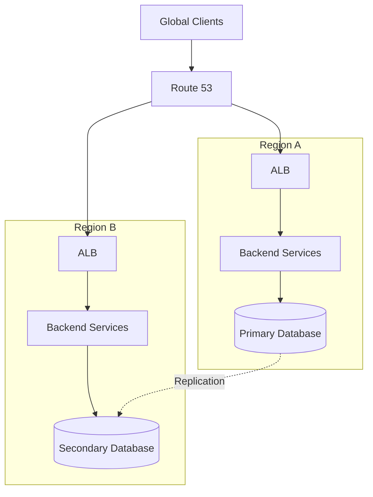
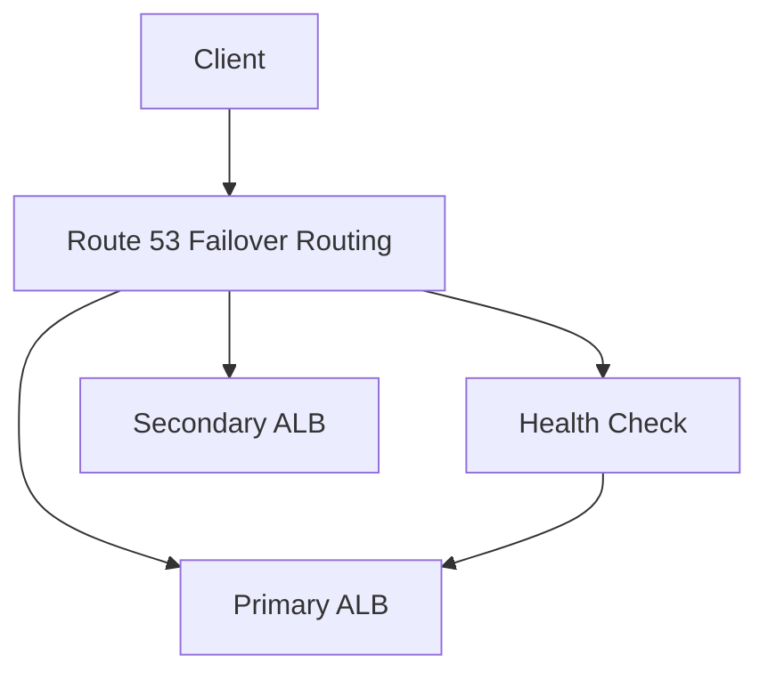

# 03- Architecture and Disaster Recovery Questions

## Overview

Route 53 architecture and disaster recovery questions test whether you can reason about DNS as part of a larger distributed system rather than treating it as a simple record-management service.

At senior backend level, the interviewer is usually evaluating whether you understand:

- DNS resolution and caching.
- Route 53 routing policies.
- Multi-region architecture.
- Active/active versus active/passive systems.
- Health-check behavior.
- DNS-based failover limitations.
- Data replication and consistency.
- Recovery Time Objective (RTO).
- Recovery Point Objective (RPO).
- Infrastructure as Code.
- Operational readiness and rollback.

A strong answer should separate **DNS failover** from **application failover**.

For example:

```text
                    Route 53
                       │
          ┌────────────┴────────────┐
          │                         │
    Region A                   Region B
          │                         │
         ALB                       ALB
          │                         │
      Backend                   Backend
          │                         │
       Database  ───── Replication ─── Database
```

Route 53 can influence where new DNS resolutions are directed, but it cannot by itself guarantee that the secondary application, database, dependencies, and operational processes are ready to serve production traffic.

---

## What Makes Route 53 Disaster Recovery Different from Application Failover?

DNS operates before an application connection is established.

A simplified request path is:

```text
Client
  │
  ▼
Recursive DNS Resolver
  │
  ▼
Route 53
  │
  ▼
Endpoint Selection
  │
  ▼
ALB / CloudFront / API Gateway
  │
  ▼
Backend Application
```

This means Route 53 can control the endpoint returned during DNS resolution, but it cannot directly control:

- Existing TCP connections.
- Existing HTTP keep-alive connections.
- Cached DNS responses.
- Application state.
- Database replication.
- In-flight requests.
- Client retry behavior.

Therefore:

> DNS failover is one component of disaster recovery, not the complete disaster recovery mechanism.

---

## Architecture Fundamentals

### How would you design a highly available multi-region API?

A common architecture is:



The DNS routing policy depends on the desired behavior.

For active/active:

```text
Route 53
   │
   ├── Region A
   └── Region B
```

For active/passive:

```text
Route 53
   │
   ├── Primary Region
   └── DR Region
```

A senior-level answer must also discuss the database and state-management model.

---

### What should you consider beyond Route 53 in multi-region architecture?

At minimum:

| Area | Questions |
|---|---|
| Compute | Is the application deployed in every region? |
| Database | How is data replicated? |
| Consistency | Is the system strongly or eventually consistent? |
| Sessions | Are sessions regional or globally accessible? |
| Cache | How is Redis state handled? |
| Messaging | What happens to Kafka/SQS/SNS traffic? |
| Storage | How is object data replicated? |
| Secrets | Are secrets available in the DR region? |
| IAM | Can the DR environment access required resources? |
| Networking | Are VPC, routing, and security controls ready? |
| Observability | Can operators detect and diagnose regional failures? |
| Deployment | Can both regions receive compatible releases? |

A DNS record pointing to a second region is meaningless if that region cannot actually process requests.

---

## Active/Active Architecture Questions

### What is active/active multi-region architecture?

Both regions actively serve production traffic.

```text
                    Route 53
                   /        \
                  /          \
             Region A      Region B
                │              │
               ALB            ALB
                │              │
              App A          App B
```

Traffic may be distributed using latency-based, weighted, geoproximity, or other appropriate routing mechanisms.

### Advantages

- Both regions provide useful production capacity.
- Better regional fault tolerance.
- Faster failover potential.
- Better global latency when appropriately designed.
- Infrastructure is continuously exercised.

### Limitations

- Higher infrastructure cost.
- More complex deployments.
- Cross-region data consistency becomes harder.
- More complex observability.
- More complicated debugging.
- Stateful workloads become significantly harder to design.

Active/active is not automatically better than active/passive.

The correct architecture depends on availability requirements, budget, data model, and operational maturity.

---

### How would you handle database consistency in active/active?

This is one of the most important senior-level questions.

Consider:

```text
Region A
   │
   ▼
Database A

Region B
   │
   ▼
Database B
```

If both regions accept writes, you must define how conflicting writes are prevented or resolved.

Possible approaches include:

- Single-writer database architecture.
- Globally distributed database.
- Partitioning ownership by tenant or region.
- Application-level conflict resolution.
- Event-driven synchronization.
- Strongly consistent distributed data stores where appropriate.

Do not answer:

> "Just replicate PostgreSQL between the regions."

Replication solves data movement, not necessarily global write consistency.

---

## Active/Passive Disaster Recovery

### What is active/passive architecture?

One region serves production traffic while another is maintained as a recovery environment.

```text
                 Route 53
                    │
                    ▼
              Primary Region
                    │
                   ALB
                    │
                Backend

              DR Region
                 │
              Standby
```

The DR environment may be:

- Fully running.
- Partially running.
- Scaled down.
- Infrastructure-only with rapid application startup.

The choice depends on the RTO and cost requirements.

---

### When should active/passive be preferred?

It is often appropriate when:

- A secondary region is primarily for disaster recovery.
- Active/active complexity is unnecessary.
- Database writes are difficult to distribute globally.
- Cost must be controlled.
- The business accepts a recovery process during regional failure.

For example:

```text
Primary:
  20 application instances

DR:
  2 warm instances
  + autoscaling configuration
```

This can significantly reduce cost while preserving a recovery path.

---

## RTO and RPO Questions

### What is RTO?

**Recovery Time Objective** is the target maximum amount of time required to restore service after a failure.

Example:

```text
RTO = 15 minutes
```

The system should be designed to recover service within approximately 15 minutes according to the organization's defined objectives.

---

### What is RPO?

**Recovery Point Objective** defines how much data loss the business can tolerate.

Example:

```text
RPO = 5 minutes
```

This means the architecture should aim to recover with no more than approximately five minutes of potentially lost data, depending on the recovery mechanism.

---

### How do RTO and RPO affect Route 53 architecture?

Suppose:

```text
RTO = 5 minutes
RPO = near-zero
```

A DNS-only strategy is insufficient.

You also need:

- Rapid application availability.
- Rapid detection.
- Fast DNS failover.
- Appropriate DNS TTL strategy.
- Continuous data replication.
- Automated recovery.
- Tested operational procedures.

A low RTO and RPO generally require more automation and higher infrastructure cost.

---

### RTO vs RPO

| Requirement | Meaning | Architectural impact |
|---|---|---|
| RTO | How quickly service must recover | Compute readiness, automation, failover speed |
| RPO | How much data loss is acceptable | Replication frequency and consistency |
| Low RTO | Recover quickly | Warm/hot standby, automation |
| Low RPO | Minimize data loss | Near-real-time replication or distributed storage |

---

## Route 53 Failover Questions

### How does Route 53 failover routing work?

A typical design is:



Conceptually:

```text
Primary healthy
      │
      ▼
Return primary

Primary unhealthy
      │
      ▼
Return secondary
```

The actual behavior must be evaluated together with DNS caching and resolver behavior.

---

### Does Route 53 immediately redirect every user during failover?

No.

Suppose a resolver has cached:

```text
api.example.com → Primary ALB
TTL = 300
```

Even if Route 53 changes its authoritative answer to the DR ALB, that resolver may continue returning the cached primary answer until its cache lifetime expires.

Therefore:

```text
Authoritative failover
        ≠
Immediate global client failover
```

This distinction is critical in interviews.

---

### Can lowering TTL guarantee faster failover?

No.

Lower TTLs reduce the maximum intended caching period for future DNS responses, but they do not:

- Flush existing cached answers.
- Control clients that ignore DNS TTL.
- Terminate existing connections.
- Fix application failures.
- Guarantee immediate resolver behavior.

TTL should be treated as one part of failover planning.

---

## Health Check Architecture

### What should a Route 53 health check monitor?

The health check should represent whether the endpoint should receive traffic.

For example:

```text
GET /health/route53
```

The endpoint might verify essential application functionality without requiring every external dependency to succeed.

The correct depth depends on the failure mode.

---

### Should the health endpoint query PostgreSQL?

It depends.

A shallow endpoint:

```text
GET /health
   │
   ▼
Process running → 200
```

can detect process failure but miss dependency failure.

A deeper endpoint:

```text
GET /health
   │
   ├── Application
   └── PostgreSQL
```

can detect more failure conditions.

However, checking every dependency can create cascading failover.

For example:

```text
External API failure
       │
       ▼
Health endpoint fails
       │
       ▼
Route 53 marks region unhealthy
       │
       ▼
Entire region removed from DNS
```

A dependency outage that should have been handled by retries or graceful degradation could accidentally trigger regional failover.

---

### What makes a good production health check?

A good health check should be:

- Deterministic.
- Fast.
- Representative.
- Low-cost.
- Safe under load.
- Independent enough to avoid circular dependencies.

Avoid health endpoints that depend on the same failing infrastructure they are supposed to diagnose.

---

## DNS Failover Limitations

### What can DNS failover not solve?

DNS failover does not directly solve:

- In-flight requests.
- Existing TCP connections.
- Existing HTTP keep-alive connections.
- Application state loss.
- Database corruption.
- Replication lag.
- Incorrect application deployments.
- Client-side DNS caching.
- Resolver TTL violations.
- Broken DR infrastructure.

A complete DR strategy must cover these layers.

---

### Why are long-lived connections a problem?

Consider gRPC:

```text
Client
  │
  │ Long-lived HTTP/2 connection
  ▼
Region A
```

A Route 53 change does not necessarily terminate that existing connection.

The client may continue using Region A until:

- The connection fails.
- The client reconnects.
- The application implements retry/reconnection logic.

This makes DNS-only failover particularly important to reason about for:

- gRPC.
- WebSockets.
- Long-lived HTTP connections.
- Streaming APIs.

---

## Multi-Region API Architecture

### How would you design an active/active REST API?

Example:

```text
                    Route 53
                  Latency Routing
                  /             \
                 /               \
            Region A           Region B
               │                  │
              ALB                ALB
               │                  │
           FastAPI/Django     FastAPI/Django
               │                  │
              DB A              DB B
```

The API layer is relatively easy to duplicate.

The difficult parts are usually:

- Data consistency.
- Idempotency.
- Authentication state.
- Background jobs.
- Event processing.
- File storage.
- Distributed locking.
- Cache invalidation.

---

### How should sessions be handled in multi-region architecture?

Avoid storing session state only in one region unless routing guarantees that users remain there.

Options include:

- Stateless JWT-based authentication.
- Globally accessible session storage.
- Region-aware session architecture.
- Sticky routing where appropriate.

For backend APIs, stateless authentication often simplifies multi-region failover, but token revocation and security requirements still need to be addressed.

---

## Redis and Multi-Region Disaster Recovery

### How does Redis affect DR architecture?

If an application depends on Redis:

```text
Application
    │
    ▼
Redis
```

you must determine whether Redis contains:

- Disposable cache data.
- Sessions.
- Locks.
- Critical state.
- Queue-related state.

If Redis is only a cache, losing it may primarily cause a performance impact.

If Redis contains authoritative application state, recovery becomes much more complicated.

A senior engineer should always ask:

> Is this data recoverable from the source of truth?

---

## Kafka and Multi-Region DR

### What should you consider for Kafka in a DR design?

If applications consume and produce Kafka events, regional failover must account for:

- Event replication.
- Consumer offsets.
- Duplicate processing.
- Ordering.
- Producer failover.
- Consumer failover.
- Idempotency.

For example:

```text
Region A Kafka
      │
      │ Replication
      ▼
Region B Kafka
```

A DNS change alone does not migrate Kafka processing state.

A senior-level answer should mention idempotent consumers and replay/recovery strategies where appropriate.

---

## Storage and DR

### How would object storage fit into a multi-region architecture?

For workloads using S3:

```text
Region A Application
        │
        ▼
       S3 A
        │
   Replication
        │
        ▼
       S3 B
```

The exact replication strategy depends on application requirements.

You must understand:

- Replication timing.
- Versioning.
- Delete behavior.
- Encryption.
- IAM permissions.
- Recovery procedures.

The application should not assume that a DNS failover automatically makes all data available in the secondary region.

---

## CloudFront and Route 53 Disaster Recovery

### How does CloudFront fit into a multi-region architecture?

A common architecture is:

```text
                 Route 53
                    │
                    ▼
                CloudFront
                    │
             ┌──────┴──────┐
             │             │
         Region A       Region B
             │             │
            ALB           ALB
```

CloudFront can provide edge distribution while Route 53 manages DNS.

Depending on the architecture, CloudFront can also route requests between origins.

This can reduce the amount of failover responsibility placed directly on DNS.

---

### Route 53 vs CloudFront for failover

| Requirement | Route 53 | CloudFront |
|---|---|---|
| DNS resolution | Yes | No |
| DNS-level routing | Yes | No |
| Edge request routing | No | Yes |
| Existing connection handling | No | Request-layer behavior |
| CDN caching | No | Yes |
| Multi-origin architecture | DNS targets | Origin configuration |

They can be combined rather than treated as alternatives.

---

## Kubernetes and Route 53 DR

### How does Kubernetes change the Route 53 architecture?

Inside a Kubernetes cluster, service discovery can be handled by Kubernetes DNS.

Example:

```text
service.namespace.svc.cluster.local
```

Route 53 is typically more relevant for:

- Public DNS.
- External endpoints.
- Cross-cluster DNS.
- AWS-integrated DNS.
- Hybrid networking.

A typical architecture might be:

```text
Internet
   │
   ▼
Route 53
   │
   ▼
AWS Load Balancer
   │
   ▼
Kubernetes
   │
   ▼
Service
   │
   ▼
Pods
```

Do not use Route 53 for every internal service-discovery requirement simply because it is available.

---

## Disaster Recovery Readiness Questions

### How do you know whether a DR environment is actually ready?

Do not rely on:

```text
EC2 running
```

or:

```text
ALB healthy
```

Validate the complete application path.

A useful readiness model is:

```text
DNS
 │
 ▼
Network
 │
 ▼
Load Balancer
 │
 ▼
Application
 │
 ├── Database
 ├── Cache
 ├── Messaging
 ├── Object Storage
 └── External Dependencies
```

Every critical dependency should have a defined recovery strategy.

---

### What should a DR readiness checklist contain?

| Area | Validation |
|---|---|
| DNS | Records and failover policy |
| Health checks | Correct endpoint and behavior |
| Networking | VPC, routing, security groups |
| Compute | Application deployment |
| Load balancing | ALB/NLB configuration |
| Database | Recovery and replication |
| Cache | Rebuild or replication strategy |
| Messaging | Recovery and replay |
| Storage | Replication and recovery |
| IAM | Required permissions |
| Secrets | Available in DR |
| TLS | Certificates and DNS validation |
| Observability | Logs, metrics, alerts |
| CI/CD | Deployment works in DR |
| Operations | Runbook tested |

---

## Disaster Recovery Testing

### Why should DNS failover be tested regularly?

A DR system that has never been tested is only a theoretical recovery plan.

Testing can reveal:

- Broken health checks.
- Expired certificates.
- Missing secrets.
- Incorrect IAM permissions.
- Missing database replication.
- Invalid DNS records.
- Deployment drift.
- Application assumptions about region.
- Missing observability.
- Incorrect client behavior.

---

### What is a DNS failover game day?

A game day intentionally exercises failure procedures.

For example:

```text
1. Primary region healthy
        │
        ▼
2. Inject regional failure
        │
        ▼
3. Observe health checks
        │
        ▼
4. Route 53 changes DNS answers
        │
        ▼
5. Validate DR traffic
        │
        ▼
6. Validate application behavior
        │
        ▼
7. Restore primary
        │
        ▼
8. Validate rollback
```

The objective is to verify the entire recovery mechanism rather than merely confirming that Route 53 can change a record.

---

## Infrastructure as Code Questions

### How should Route 53 DR configuration be managed?

Use Infrastructure as Code such as Terraform or AWS CloudFormation.

Example:

```hcl
resource "aws_route53_record" "api_primary" {
  zone_id = aws_route53_zone.example.zone_id
  name    = "api.example.com"
  type    = "A"
  set_identifier = "primary"

  failover_routing_policy {
    type = "PRIMARY"
  }

  alias {
    name                   = aws_lb.primary.dns_name
    zone_id                = aws_lb.primary.zone_id
    evaluate_target_health = true
  }

  health_check_id = aws_route53_health_check.primary.id
}

resource "aws_route53_record" "api_secondary" {
  zone_id = aws_route53_zone.example.zone_id
  name    = "api.example.com"
  type    = "A"
  set_identifier = "secondary"

  failover_routing_policy {
    type = "SECONDARY"
  }

  alias {
    name                   = aws_lb.secondary.dns_name
    zone_id                = aws_lb.secondary.zone_id
    evaluate_target_health = true
  }
}
```

The exact health-check and alias configuration should be validated against the target resource and desired failover semantics.

---

### What are the advantages of IaC for disaster recovery?

IaC provides:

- Repeatability.
- Version control.
- Reviewability.
- Automated deployment.
- Drift detection.
- Easier environment recreation.
- Documented infrastructure intent.

The most important benefit is that the DR environment can be recreated consistently rather than relying on manually documented console steps.

---

## Security Questions

### How can Route 53 configuration become a security risk?

Unauthorized DNS changes can redirect clients to attacker-controlled infrastructure.

Potential consequences include:

- Credential theft.
- Phishing.
- API traffic interception.
- Application impersonation.
- Service disruption.

Protect DNS using:

- Least-privilege IAM.
- Separate production accounts or roles where appropriate.
- MFA for privileged operations.
- CI/CD-controlled changes.
- Code review.
- CloudTrail auditing.
- Change detection.
- Strong access controls.

---

### Should developers have direct production Route 53 write access?

Normally, production DNS modification should be tightly controlled.

A safer workflow is:

```text
Developer
   │
   ▼
Pull Request
   │
   ▼
Review
   │
   ▼
CI/CD
   │
   ▼
Terraform / CloudFormation
   │
   ▼
Production Route 53
```

Emergency access can exist, but it should be restricted and audited.

---

## Failure Scenario Questions

### Region A is down. What happens?

A strong answer starts by clarifying the architecture.

If using active/passive failover:

```text
Region A unhealthy
       │
       ▼
Route 53 health state
       │
       ▼
Secondary answer
       │
       ▼
Region B
```

But the complete recovery process depends on:

- DNS TTL.
- Resolver caches.
- Health-check detection.
- DR readiness.
- Database state.
- Client behavior.
- Existing connections.

---

### Route 53 reports the primary as unhealthy, but users still reach it. Why?

Possible reasons include:

- Recursive DNS caches still contain the primary answer.
- Clients cache DNS results.
- Existing connections remain established.
- The client uses a different resolver.
- The client ignores TTL behavior.
- The application uses a different hostname.
- The failover record configuration is incorrect.

This is why DNS failover should never be interpreted as an instantaneous global switch.

---

### The DR region is receiving traffic, but returns errors. What could be wrong?

Investigate the entire dependency graph:

```text
Route 53
   │
   ▼
DR ALB
   │
   ▼
Application
   │
   ├── Database
   ├── Redis
   ├── Kafka
   ├── S3
   ├── Secrets
   └── External APIs
```

Common causes include:

- Database not synchronized.
- Missing secrets.
- Incorrect IAM.
- Missing environment variables.
- Region-specific configuration.
- Empty cache assumptions.
- Missing messaging consumers.
- Incorrect network routes.
- External dependencies restricted to the primary region.

---

## Migration and Rollback Questions

### How would you migrate from single-region to multi-region?

A safe approach is incremental:

```text
Single Region
     │
     ▼
Deploy secondary region
     │
     ▼
Validate infrastructure
     │
     ▼
Replicate data
     │
     ▼
Validate application
     │
     ▼
Introduce controlled DNS traffic
     │
     ▼
Monitor
     │
     ▼
Increase traffic
```

Do not introduce DNS failover before validating that the secondary region can serve real production workloads.

---

### How would you roll back a failed regional migration?

Keep the old environment operational until the migration is stable.

For DNS-based migration:

```text
Current
  │
  ▼
Primary → 90%
Secondary → 10%
```

If errors appear:

```text
Secondary traffic
       │
       ▼
Reduce / remove secondary weight
       │
       ▼
Primary restored
```

For active/passive failover, rollback requires restoring the primary health state and ensuring it is genuinely ready before directing traffic back.

---

### Why should DNS TTL be considered before migration?

Suppose:

```text
Current TTL = 3600 seconds
```

Changing the record immediately before migration does not mean all clients will respect a new one-minute TTL.

A safer process is:

```text
Days / hours before migration
        │
        ▼
Lower TTL
        │
        ▼
Allow old TTL caches to expire
        │
        ▼
Begin migration
        │
        ▼
Observe traffic
```

The exact timing depends on the existing TTL and operational risk.

---

## Senior Architecture Trade-Offs

### Active/active vs active/passive

| Characteristic | Active/Active | Active/Passive |
|---|---|---|
| Both regions serve traffic | Yes | Usually no |
| Infrastructure cost | Higher | Lower |
| Operational complexity | Higher | Lower |
| Regional utilization | High | Lower |
| Failover speed | Potentially fast | Depends on DR readiness |
| Data architecture | More complex | Usually simpler |
| Deployment complexity | Higher | Lower |
| Best for | High availability/global workloads | DR-focused workloads |

Neither architecture is universally superior.

---

### DNS failover vs application failover

| DNS Failover | Application Failover |
|---|---|
| Operates at DNS layer | Operates at request/application layer |
| Affected by DNS caching | Can react per request |
| Useful for regional endpoint changes | Useful for fine-grained traffic control |
| Does not handle existing connections | Can control new requests directly |
| Simple architecture | More application/load-balancer complexity |

A mature architecture may use both.

---

## Interview Scenarios

### Scenario: Design a globally available payment API

A strong answer should address:

```text
Global Clients
      │
      ▼
Route 53
      │
      ▼
Global Routing
      │
 ┌────┴────┐
 ▼         ▼
Region A  Region B
 │         │
ALB       ALB
 │         │
API       API
 │         │
 └────┬────┘
      │
   Data Layer
```

Then discuss:

- Idempotency.
- Duplicate payment prevention.
- Database consistency.
- Regional failure.
- Retry behavior.
- Message processing.
- Auditability.
- Security.
- RPO/RTO.
- Disaster recovery testing.

For payment systems, DNS alone is nowhere near enough to guarantee correctness during failover.

---

### Scenario: Design a multi-region Django or FastAPI application

A practical architecture could be:

```text
                  Route 53
                     │
          ┌──────────┴──────────┐
          │                     │
       Region A              Region B
          │                     │
         ALB                   ALB
          │                     │
    Django/FastAPI        Django/FastAPI
          │                     │
       Cache A                Cache B
          │                     │
       Database             Database
```

The key design questions are:

- Is the API stateless?
- Where does session state live?
- How are databases synchronized?
- How are background jobs handled?
- How are Kafka events replicated?
- How are secrets synchronized?
- How are files replicated?
- What happens during partial regional failure?

---

### Scenario: Your company requires 99.99% availability. Is Route 53 failover enough?

No.

99.99% availability permits only a small amount of downtime, so the entire system must be engineered for that target.

You need to consider:

- Application redundancy.
- Load balancers.
- Multi-AZ architecture.
- Multi-region strategy if required.
- Database availability.
- Dependency availability.
- DNS behavior.
- Monitoring.
- Automated recovery.
- Incident response.
- Deployment safety.

Availability is an end-to-end property.

---

## Common Interview Traps

| Trap | Strong answer |
|---|---|
| "Route 53 immediately redirects all users." | DNS caches can delay the new answer |
| "Health check means the application is healthy." | It only verifies the configured health condition |
| "Multi-region means no downtime." | Data, dependencies, clients, and failover can still fail |
| "Active/active is always better." | It increases complexity and cost |
| "Just replicate PostgreSQL." | Replication does not automatically solve multi-region write consistency |
| "DNS handles gRPC failover." | Existing HTTP/2 connections may remain open |
| "DR means another ALB exists." | The complete dependency graph must be recoverable |
| "Low TTL means zero failover delay." | Existing caches and client behavior still matter |
| "Route 53 controls HTTP traffic." | It controls DNS answers |
| "The DR region is ready because EC2 is running." | Application and dependency readiness must be validated |
| "DNS rollback is instant." | Cached DNS answers and existing connections complicate rollback |
| "A health endpoint should check everything." | Overly deep checks can cause unnecessary failover |

---

## Rapid-Fire Questions

### What is the primary purpose of Route 53 in disaster recovery?

To provide DNS-based endpoint selection and, with appropriate routing policies and health checks, direct new DNS resolutions toward healthy endpoints.

### What is active/active?

Multiple regions actively serve production traffic.

### What is active/passive?

One region serves production while another is primarily used as a standby or recovery environment.

### What is RTO?

The target time required to recover service.

### What is RPO?

The target amount of data loss that can be tolerated.

### Does Route 53 guarantee the RTO?

No. DNS is only one component of the recovery process.

### Does Route 53 guarantee the RPO?

No. RPO is primarily determined by the data replication and recovery architecture.

### Can Route 53 terminate existing client connections?

No.

### Why can gRPC complicate DNS failover?

gRPC commonly uses long-lived HTTP/2 connections, so an existing connection can remain connected to the old region even after DNS changes.

### What is a good health-check endpoint?

A fast, deterministic endpoint that represents whether the endpoint should continue receiving production traffic.

### Should a health check always test the database?

No. It depends on the failure semantics and can cause unnecessary failover if designed too deeply.

### What is the biggest challenge in active/active architecture?

Maintaining correct state and data consistency across regions.

### Why is IaC important for DR?

It makes infrastructure reproducible, reviewable, version-controlled, and easier to validate.

### How should DR be tested?

Regularly perform controlled failover exercises and validate the entire application and dependency stack.

### What is a warm standby?

A secondary environment that is already partially or fully running and can be scaled or promoted relatively quickly.

### What is a cold standby?

A secondary environment that requires significant provisioning or startup work before it can serve production.

### Why is warm standby usually faster?

Because infrastructure and application components are already available, reducing recovery steps.

### What should happen before increasing traffic to a DR region?

Validate application behavior, dependencies, data state, observability, security, and operational readiness.

---

## Key Takeaways

- Route 53 can provide DNS-based failover, but DNS failover is not the same as complete application failover.
- DNS operates before the application connection is established, so it cannot directly terminate or migrate existing connections.
- Recursive DNS caching means a Route 53 failover is not necessarily visible to every client immediately.
- Active/active architectures provide higher utilization and potentially faster regional recovery but introduce significantly more operational and data-consistency complexity.
- Active/passive architectures are often simpler and cheaper when the secondary region primarily exists for disaster recovery.
- RTO determines how quickly service must recover; RPO determines how much data loss is acceptable.
- Low RTO generally requires warm or hot infrastructure and automation.
- Low RPO generally requires frequent or near-real-time data replication.
- Health checks should represent whether an endpoint should receive production traffic rather than blindly checking every dependency.
- Overly deep health checks can turn localized dependency failures into unnecessary regional failovers.
- DNS failover is particularly limited for long-lived connections such as gRPC, WebSockets, and streaming workloads.
- Multi-region architecture requires explicit strategies for databases, Redis, Kafka, object storage, authentication, sessions, secrets, and external dependencies.
- Database replication alone does not solve multi-region write consistency.
- Stateless backend services simplify regional failover, but stateful dependencies still require explicit recovery strategies.
- Route 53, CloudFront, ALB, and Kubernetes solve different layers of the architecture and should not be treated as interchangeable components.
- Disaster recovery infrastructure must be continuously tested rather than assumed to work.
- Infrastructure as Code makes Route 53 and DR configuration reproducible, reviewable, auditable, and easier to recover.
- Production DNS changes should be protected with least-privilege IAM, controlled deployment workflows, auditing, and change review.
- DNS TTL planning should happen before migrations and planned failovers, not immediately after an incident begins.
- A senior engineer evaluates Route 53 failover as part of an end-to-end recovery system involving DNS, networking, compute, data, dependencies, observability, and operations.