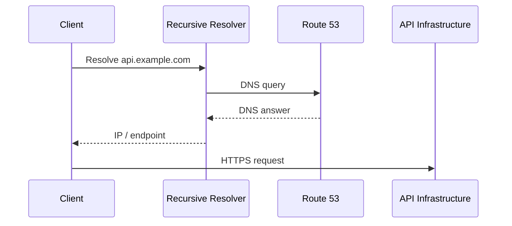
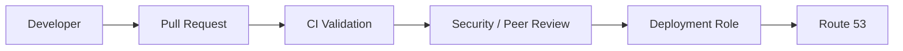
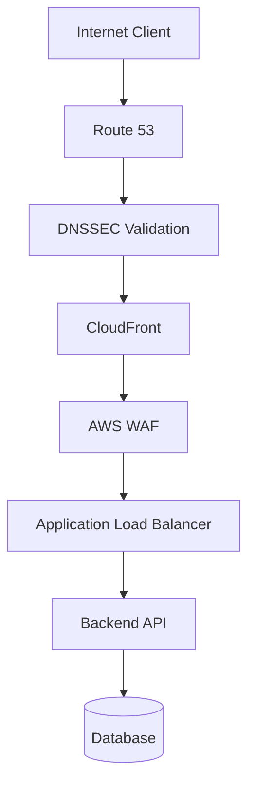

# 04- Security Questions

## Overview

Route 53 security questions test whether you understand that DNS is a critical control plane for application availability, traffic routing, domain ownership, and trust boundaries.

At senior backend level, interviewers expect more than knowing that Route 53 provides DNS. You should be able to reason about:

- Unauthorized DNS changes.
- Domain and hosted-zone security.
- IAM least privilege.
- DNSSEC.
- Domain registration security.
- Public versus private hosted zones.
- VPC DNS behavior.
- Query logging and auditing.
- DNS-based attack scenarios.
- DNS spoofing and cache poisoning.
- DDoS protection.
- Failover abuse.
- Infrastructure as Code.
- Production change controls.

A useful security model is:

```text
                    DNS Security
                         │
       ┌─────────────────┼─────────────────┐
       │                 │                 │
   Ownership           Access            Integrity
       │                 │                 │
 Domain Registration   IAM             DNSSEC
       │                 │                 │
       └─────────────────┼─────────────────┘
                         │
                    Observability
                         │
                 Logs + CloudTrail
```

The most important principle is:

> Protect DNS with the same rigor used to protect production application infrastructure.

A compromised DNS configuration can redirect legitimate clients away from trusted infrastructure even when the application itself has not been compromised.

---

## Why DNS Is a Security Boundary

DNS translates names such as:

```text
api.example.com
```

into network destinations.

A backend client might perform:

```text
https://api.example.com/orders
```

The request depends on DNS resolution before reaching the application.



If an attacker can manipulate the DNS answer or the authoritative DNS configuration, the attacker may influence where users connect.

Potential consequences include:

- Traffic redirection.
- Phishing.
- Credential harvesting.
- API impersonation.
- Service disruption.
- Malware distribution.
- Domain takeover.
- TLS certificate acquisition attempts.
- Reputation damage.

DNS therefore belongs inside the application's security threat model.

---

## Route 53 Security Model

Route 53 security has several distinct layers.

| Layer | Primary concern | Example control |
|---|---|---|
| Domain registration | Who controls the domain | Registrar protection |
| Hosted zone | Who controls DNS records | IAM |
| DNS integrity | Whether DNS responses can be authenticated | DNSSEC |
| VPC DNS | Internal name resolution | VPC DNS settings |
| Changes | Who changed DNS | CloudTrail |
| Queries | Who is requesting DNS data | Query logging |
| Infrastructure | How DNS is deployed | IaC and CI/CD |
| Availability | DNS disruption | Route 53 resilience, AWS Shield where applicable |

A common interview mistake is to answer every DNS security question with DNSSEC.

DNSSEC protects DNS data integrity and authenticity, but it does not replace IAM, domain-registration controls, logging, or application-layer security.

---

## IAM and Route 53 Security

### Why is IAM important for Route 53?

Route 53 configuration changes are AWS API operations.

An identity with excessive permissions may be able to:

- Create records.
- Delete records.
- Modify routing policies.
- Change health checks.
- Modify hosted zones.
- Potentially disrupt production traffic.

The primary control is least-privilege IAM.

---

### Should developers have `route53:*` permissions?

Generally, no.

Avoid broad permissions such as:

```json
{
  "Effect": "Allow",
  "Action": "route53:*",
  "Resource": "*"
}
```

A production environment should instead provide only the permissions required for the approved workflow.

For example, a deployment role might require specific Route 53 change permissions rather than unrestricted administration.

The exact policy should be scoped according to the resources and deployment mechanism being used.

---

### What is a safer Route 53 change workflow?

A production-grade workflow is:



This approach provides:

- Reviewability.
- Auditability.
- Separation of duties.
- Repeatability.
- Reduced console-based changes.

For production DNS, direct human modification should be the exception rather than the normal workflow.

---

## Infrastructure as Code Security

### Why should Route 53 be managed through IaC?

Infrastructure as Code allows DNS configuration to be:

- Version-controlled.
- Reviewed.
- Tested.
- Audited.
- Reproduced.
- Rolled back.

Example:

```hcl
resource "aws_route53_record" "api" {
  zone_id = aws_route53_zone.production.zone_id
  name    = "api.example.com"
  type    = "A"

  alias {
    name                   = aws_lb.api.dns_name
    zone_id                = aws_lb.api.zone_id
    evaluate_target_health = true
  }
}
```

A senior engineer should also consider the security of the IaC pipeline itself.

```text
Git Repository
      │
      ▼
CI/CD
      │
      ▼
Assumed AWS Role
      │
      ▼
Route 53
```

The CI/CD role should not have unrestricted access to the AWS account.

---

## DNSSEC

### What is DNSSEC?

DNSSEC adds cryptographic authentication to DNS responses.

Its primary purpose is to allow resolvers to validate that DNS data originated from the authorized DNS zone and was not modified in transit.

Conceptually:

```text
DNS without DNSSEC

Resolver
   │
   ▼
DNS answer
   │
   ?
Is this answer authentic?


DNSSEC

Resolver
   │
   ▼
DNS answer + signatures
   │
   ▼
Cryptographic validation
   │
   ▼
Accept / reject
```

DNSSEC addresses **DNS data integrity and authenticity**.

It does not encrypt DNS queries.

---

### What problem does DNSSEC solve?

Without DNSSEC, a resolver receiving DNS information needs other mechanisms to establish trust in the DNS data.

DNSSEC provides a chain of cryptographic trust.

A simplified model is:

```text
Root
  │
  ▼
TLD
  │
  ▼
example.com
  │
  ▼
api.example.com
```

Each layer participates in establishing trust through DNSSEC delegation and signatures.

---

### What does DNSSEC not protect against?

DNSSEC does not protect against:

- Compromised AWS credentials.
- Unauthorized Route 53 record changes.
- Compromised registrar accounts.
- Application vulnerabilities.
- Server compromise.
- DDoS by itself.
- Compromised client devices.
- Incorrect DNS configuration.

If an attacker legitimately changes DNS records using compromised credentials, DNSSEC does not determine that the authorized administrator was malicious or compromised.

This distinction is important in interviews.

---

## DNSSEC vs TLS

DNSSEC and TLS solve different problems.

| Technology | Protects |
|---|---|
| DNSSEC | Authenticity and integrity of DNS data |
| TLS | Confidentiality and integrity of application connections |
| HTTPS | HTTP communication over TLS |
| IAM | AWS resource authorization |
| CloudTrail | AWS API activity auditing |

For:

```text
https://api.example.com
```

a secure system may rely on both DNSSEC and TLS, but they protect different parts of the request lifecycle.

---

## Domain Registration Security

### Why is domain registration security important?

Route 53 can manage domain registration, but the domain itself is a critical security asset.

An attacker who obtains control of the domain can potentially manipulate authoritative DNS delegation.

This is fundamentally different from merely modifying a Route 53 record.

The security chain is approximately:

```text
Domain Ownership
      │
      ▼
Registrar
      │
      ▼
Name Server Delegation
      │
      ▼
Route 53 Hosted Zone
      │
      ▼
DNS Records
```

Compromise higher in the chain can invalidate protections lower in the chain.

---

### What should protect a production domain?

Important controls include:

- Strong registrar authentication.
- MFA.
- Restricted administrative access.
- Domain transfer protection.
- Controlled account ownership.
- Monitoring for unexpected registrar changes.
- Separation of registrar and application privileges where appropriate.
- Documented domain recovery procedures.

Domain ownership should be treated as a high-value production credential.

---

## Public vs Private Hosted Zone Security

### What is a public hosted zone?

A public hosted zone contains DNS records intended to be resolvable from the public DNS system.

Example:

```text
api.example.com
www.example.com
```

These records may point toward:

- CloudFront.
- ALB.
- API Gateway.
- Public services.

Because public records are externally observable, never assume that DNS itself provides secrecy.

---

### What is a private hosted zone?

A private hosted zone provides DNS resolution within associated VPCs.

Example:

```text
payments.internal.example.com
```

The intention is to keep internal service names inside controlled network boundaries.

```text
VPC
 │
 ├── Application
 │
 ├── PostgreSQL
 │
 └── Private Hosted Zone
          │
          └── db.internal.example.com
```

Private hosted zones are useful for internal service discovery, but access to the VPC itself must still be properly secured.

---

### Can private hosted zones replace network security?

No.

DNS controls name resolution.

It does not replace:

- Security groups.
- Network ACLs.
- IAM.
- VPC routing.
- Application authentication.
- TLS.

For example:

```text
DNS allows:
db.internal.example.com → 10.0.10.25
```

That does not mean every workload should be allowed to connect to port `5432`.

DNS resolution and network authorization are separate controls.

---

## VPC DNS Security

Private DNS depends on correct VPC DNS configuration.

Important VPC DNS attributes include:

- DNS resolution.
- DNS hostnames.

A private service architecture might look like:

```text
Application VPC
      │
      ▼
VPC Resolver
      │
      ▼
Private Hosted Zone
      │
      ▼
Internal Service
```

Security concerns include:

- Which VPCs are associated with the private zone.
- Which accounts can modify the hosted zone.
- Whether cross-account associations are controlled.
- Whether DNS forwarding rules are trusted.
- Whether internal names expose sensitive architecture information.

Internal DNS is not automatically safe merely because it is not publicly resolvable.

---

## DNS Query Logging and Security Monitoring

### Why should DNS queries be logged?

DNS logs can provide useful evidence about:

- Unexpected domains.
- Malware communication.
- Suspicious workloads.
- DNS tunneling indicators.
- Misconfigured applications.
- Unexpected external dependencies.

For example:

```text
Application
    │
    ▼
VPC Resolver
    │
    ├── api.example.com
    ├── database.internal
    └── suspicious-domain.example
```

Unexpected DNS behavior can reveal compromise even when application logs do not.

---

### What should be monitored?

Useful signals include:

| Signal | Security relevance |
|---|---|
| Unexpected Route 53 record change | Possible unauthorized modification |
| Hosted-zone deletion | Potential service disruption |
| Registrar changes | Potential domain takeover |
| Unusual DNS queries | Possible malware or tunneling |
| Unexpected external domains | Possible compromised workload |
| DNSSEC validation failures | Possible DNS integrity issue |
| Health-check state changes | Possible availability attack or failure |
| IAM activity | Potential credential compromise |

CloudTrail should be used to audit Route 53 API activity.

---

## CloudTrail and DNS Auditing

### What does CloudTrail provide?

CloudTrail records AWS API activity and can help answer:

- Who changed the DNS configuration?
- Which role made the change?
- When did it happen?
- Which API operation was called?
- From where did the API request originate?

A useful investigation flow is:

```text
DNS anomaly
    │
    ▼
Check current Route 53 records
    │
    ▼
Check CloudTrail
    │
    ▼
Identify principal
    │
    ▼
Inspect IAM / CI/CD activity
    │
    ▼
Determine authorized vs unauthorized change
```

CloudTrail should be integrated into the organization's broader security monitoring strategy.

---

## DNS Spoofing and Cache Poisoning

### What is DNS cache poisoning?

DNS cache poisoning attempts to cause a resolver to cache an incorrect DNS answer.

Conceptually:

```text
Client
  │
  ▼
Recursive Resolver
  │
  ├── Legitimate DNS infrastructure
  │
  └── Malicious response
```

If the resolver accepts the malicious response, clients using that resolver may receive incorrect DNS information.

Modern DNS implementations use mechanisms that make many traditional poisoning attacks significantly harder, but DNS integrity remains an important security concern.

DNSSEC provides cryptographic validation against forged DNS data where correctly deployed.

---

### Is HTTPS enough to prevent DNS attacks?

HTTPS provides strong protection once the client reaches a server and validates its TLS certificate.

However, DNS manipulation can still cause:

- Service disruption.
- Redirect attempts.
- Phishing.
- Connection failures.
- Infrastructure discovery.

TLS certificate validation is an additional defense, not a reason to ignore DNS security.

---

## DNS Hijacking

### What is DNS hijacking?

DNS hijacking occurs when an attacker gains the ability to influence DNS resolution or DNS configuration.

Potential attack paths include:

```text
Compromised AWS credentials
          │
          ▼
Unauthorized Route 53 change
```

or:

```text
Compromised Registrar Account
          │
          ▼
Name Server Delegation Change
```

or:

```text
Compromised DNS Provider
          │
          ▼
Authoritative DNS Manipulation
```

The mitigation depends on where the compromise occurs.

---

## DDoS and Route 53

### Is Route 53 itself a DDoS protection service?

Route 53 provides highly available DNS infrastructure, but DNS availability and application-layer DDoS protection are different concerns.

A production architecture may combine:

```text
Internet
   │
   ▼
Route 53
   │
   ▼
CloudFront / AWS WAF
   │
   ▼
ALB
   │
   ▼
Application
```

AWS Shield can provide additional DDoS protection for supported AWS resources and architectures.

The exact protection strategy should be based on the application's threat model and AWS architecture.

---

### Can an attacker abuse DNS health checks?

Health checks can become part of an availability failure if poorly designed.

For example:

```text
Dependency failure
      │
      ▼
Health endpoint fails
      │
      ▼
Route 53 removes endpoint
      │
      ▼
Traffic shifts unexpectedly
```

If the secondary endpoint is also unhealthy, the system can enter a worse state.

Health checks should therefore be designed around actual traffic-serving readiness rather than simply checking whether every dependency is available.

---

## DNS Amplification Attacks

### What is DNS amplification?

DNS amplification is a reflection-based DDoS technique where attackers cause DNS infrastructure to send larger responses toward a victim.

The general pattern is:

```text
Attacker
   │
   │ Spoofed source
   ▼
DNS infrastructure
   │
   │ Large response
   ▼
Victim
```

The attack exploits asymmetric request/response sizes and spoofed source addresses.

Application teams should distinguish between:

- Attacks against authoritative DNS infrastructure.
- Attacks against the application's endpoint.
- DNS-based reflection attacks.

These are different threat scenarios requiring different controls.

---

## DNS Tunneling

### What is DNS tunneling?

DNS tunneling uses DNS queries or responses to transport data through DNS infrastructure.

A compromised workload might generate unusual queries such as:

```text
<encoded-data>.example-attacker.com
```

repeatedly.

Indicators can include:

- High query volume.
- Long hostnames.
- High-entropy subdomains.
- Unusual TXT queries.
- Repeated requests to suspicious domains.
- Workloads contacting domains they normally should not access.

DNS query logs can be valuable for detecting this behavior.

---

## Subdomain Takeover

### What is a subdomain takeover?

A subdomain takeover can occur when a DNS record points to an external resource that has been deleted or released, while the DNS record remains active.

Example:

```text
old-api.example.com
        │
        ▼
External service
        │
     Deleted
```

If another party can claim the released resource, they may gain control over the subdomain's content.

This is particularly relevant when using:

- SaaS platforms.
- Cloud hosting.
- Load balancers.
- Static hosting.
- CDN resources.

---

### How do you prevent subdomain takeover?

Operational controls include:

- Inventory DNS records.
- Remove stale records.
- Track external dependencies.
- Detect orphaned DNS records.
- Review DNS during infrastructure teardown.
- Automate cleanup through IaC.

A common production failure is deleting infrastructure while leaving the corresponding DNS record behind.

---

## CNAME and Alias Security

### Why should CNAME records be reviewed carefully?

A CNAME creates an indirect dependency:

```text
api.example.com
       │
       ▼
service.example-provider.com
       │
       ▼
External infrastructure
```

If the target is abandoned or misconfigured, the application's DNS security posture may be affected.

Every external DNS dependency should have:

- An owner.
- A lifecycle.
- Monitoring.
- Decommissioning procedures.

---

## Least Privilege for DNS Automation

A mature deployment system should use separate roles for different operations.

Example:

```text
Developer Role
   │
   └── Read-only DNS visibility

CI/CD Deployment Role
   │
   └── Required production DNS changes

Security Role
   │
   └── Audit / investigation

Break-glass Role
   │
   └── Emergency administrative access
```

This is preferable to giving every engineer administrator-level Route 53 access.

---

## Break-Glass Access

### Why is emergency DNS access necessary?

A production outage may require urgent DNS changes when the normal deployment pipeline is unavailable.

A break-glass role can provide emergency access.

It should have:

- Strong authentication.
- MFA.
- Limited membership.
- Auditing.
- Alerting.
- Documented procedures.
- Post-incident review.

Break-glass access should be difficult to use, but available when normal mechanisms fail.

---

## Change Management

### How should production DNS changes be controlled?

A good workflow is:

```text
Change Request
      │
      ▼
Configuration Review
      │
      ▼
Automated Validation
      │
      ▼
Security / Peer Review
      │
      ▼
Deployment
      │
      ▼
Monitoring
```

DNS changes should include:

- Reason for change.
- Expected behavior.
- Rollback procedure.
- TTL considerations.
- Health-check implications.
- Blast radius.
- Validation steps.

DNS changes can have global impact, so treating them as ordinary low-risk configuration changes is dangerous.

---

## DNS Security and CI/CD

### What security controls should a DNS deployment pipeline have?

Recommended controls include:

- Protected branches.
- Required pull-request reviews.
- Restricted deployment roles.
- Secret-free configuration where possible.
- IaC validation.
- Policy-as-code.
- Terraform plan review.
- Change logging.
- Deployment notifications.
- Post-deployment verification.

Example:

```text
Git
 │
 ▼
Terraform Plan
 │
 ▼
Policy Checks
 │
 ▼
Security Review
 │
 ▼
Approval
 │
 ▼
Assume Deployment Role
 │
 ▼
Route 53
```

The deployment role should be separated from developer credentials.

---

## Domain Security and TLS

### Does controlling DNS automatically give an attacker a valid HTTPS certificate?

Not automatically.

TLS certificate issuance has its own validation mechanisms.

However, unauthorized control over DNS can be security-critical because DNS may participate in domain validation processes used by certificate authorities.

Therefore:

```text
Domain Security
      +
DNS Security
      +
Certificate Security
```

should be treated as related controls.

Certificate lifecycle monitoring should be part of the broader domain-security strategy.

---

## Private DNS Security in Microservices

A microservices architecture may use private DNS:

```text
orders.internal.example.com
payments.internal.example.com
inventory.internal.example.com
```

A request might look like:

```text
Order Service
     │
     ▼
payments.internal.example.com
     │
     ▼
Private DNS
     │
     ▼
Payments Service
```

Security still requires:

- Network segmentation.
- Security-group controls.
- Service authentication.
- TLS where appropriate.
- Authorization.
- IAM where AWS APIs are involved.

DNS only tells the caller where to connect.

It does not establish that the caller is authorized.

---

## DNS and Zero Trust

A common misconception is:

> "The service is internal, so it is trusted."

That is not a valid zero-trust assumption.

For example:

```text
Internal DNS
     │
     ▼
payments.internal.example.com
```

should not imply:

```text
Caller = Trusted
```

Authentication and authorization should still occur at the service layer.

A secure architecture may use:

```text
DNS
 │
 ▼
Network Controls
 │
 ▼
TLS
 │
 ▼
Authentication
 │
 ▼
Authorization
 │
 ▼
Application
```

---

## Security Incident Response

### What should you do if production DNS was unexpectedly modified?

Treat it as a potential security incident.

A high-level response is:

```text
Unexpected DNS change
        │
        ▼
Preserve evidence
        │
        ▼
Inspect CloudTrail
        │
        ▼
Identify IAM principal
        │
        ▼
Determine compromise
        │
        ▼
Contain credentials
        │
        ▼
Restore known-good DNS
        │
        ▼
Validate TLS / application
        │
        ▼
Investigate blast radius
```

Do not immediately delete all evidence.

Preserve:

- CloudTrail events.
- DNS configuration history.
- CI/CD logs.
- IAM activity.
- Registrar activity.
- Application logs.
- Security findings.

---

## Common Security Misconfigurations

| Misconfiguration | Risk | Mitigation |
|---|---|---|
| Broad `route53:*` permissions | Unauthorized DNS changes | Least privilege |
| Shared AWS credentials | Poor accountability | Individual identities / roles |
| No MFA for privileged access | Credential compromise | MFA |
| Direct console changes | Configuration drift | IaC |
| No CloudTrail monitoring | Delayed detection | Centralized auditing |
| Stale CNAME records | Subdomain takeover | DNS inventory |
| Unprotected registrar account | Domain takeover | Strong authentication |
| No DNSSEC where required | Reduced DNS integrity assurance | Evaluate and deploy DNSSEC |
| Publicly exposing internal names | Information disclosure | Use private DNS appropriately |
| Overly deep health checks | Unnecessary failover | Design health semantics carefully |
| No DNS change review | High blast radius | PR-based workflow |
| Shared production roles | Excessive access | Role separation |

---

## Interview Scenario: An Attacker Changed `api.example.com`

### How would you investigate?

Start with the DNS control plane rather than immediately assuming application compromise.

```text
Unexpected DNS result
        │
        ├── Check Route 53 record
        │
        ├── Check CloudTrail
        │
        ├── Identify IAM principal
        │
        ├── Check CI/CD deployments
        │
        ├── Check registrar changes
        │
        ├── Check DNSSEC state
        │
        ├── Check TLS / certificate activity
        │
        └── Check application logs
```

Then:

1. Determine whether the change was authorized.
2. Identify the identity or system that made it.
3. Revoke or contain compromised credentials if necessary.
4. Restore known-good DNS.
5. Validate the application endpoint and TLS.
6. Determine whether users were redirected.
7. Investigate possible credential exposure.
8. Preserve evidence for incident analysis.

A senior answer should explicitly mention **CloudTrail, IAM, registrar security, DNSSEC, and incident containment**.

---

## Interview Scenario: Should DNSSEC Be Enabled for Every Domain?

A strong answer should avoid an absolute yes/no response.

Discuss:

- Business requirements.
- Registrar and DNS architecture.
- Operational capability.
- Key-management responsibilities.
- Failure/recovery procedures.
- Validation support.
- Importance of DNS integrity for the domain.

DNSSEC provides important integrity guarantees, but it introduces operational considerations.

The real senior-level answer is:

> Evaluate DNSSEC as part of the domain's security requirements and ensure the organization can operate and recover the DNSSEC configuration correctly.

---

## Interview Scenario: Is Private Hosted Zone DNS Secure?

A strong answer is:

> Private hosted zones reduce public exposure of internal DNS records, but they do not replace authorization or network security.

Then discuss:

- VPC association controls.
- IAM permissions.
- Security groups.
- VPC routing.
- TLS.
- Service authentication.
- Internal DNS query visibility.

---

## Interview Scenario: Can DNSSEC Prevent DNS Hijacking?

Not by itself.

DNSSEC can help a resolver detect forged or modified DNS data, but it does not prevent an attacker from obtaining legitimate administrative access to the DNS provider or registrar.

You still need:

```text
IAM Security
+
Registrar Security
+
DNSSEC
+
CloudTrail
+
Monitoring
+
Change Control
```

---

## Security Architecture Example

A production backend architecture can combine multiple controls:



Security controls operate at different layers:

| Layer | Example |
|---|---|
| Domain | Registrar protection |
| DNS | DNSSEC |
| AWS control plane | IAM |
| Audit | CloudTrail |
| Edge | CloudFront |
| Application firewall | AWS WAF |
| Network | VPC / Security Groups |
| Transport | TLS |
| Application | Authentication / authorization |
| Data | Encryption and access control |

No single control provides complete protection.

---

## Security Best Practices

### Identity

- Use IAM roles rather than long-lived access keys.
- Apply least privilege.
- Require MFA for privileged human access.
- Separate developer, deployment, security, and break-glass roles.

### DNS

- Evaluate DNSSEC for domains requiring stronger DNS integrity.
- Keep public and private DNS boundaries intentional.
- Remove stale DNS records.
- Review external DNS dependencies.

### Domain

- Protect registrar access.
- Restrict domain-transfer operations.
- Monitor domain configuration changes.
- Maintain a documented recovery process.

### Infrastructure

- Manage DNS through IaC.
- Require peer review for production changes.
- Validate changes automatically.
- Minimize direct console modifications.

### Monitoring

- Enable and retain CloudTrail appropriately.
- Monitor unexpected Route 53 changes.
- Monitor DNS query behavior where relevant.
- Alert on suspicious domain and registrar activity.

### Operations

- Test DNS rollback.
- Test disaster recovery.
- Document emergency procedures.
- Periodically review DNS ownership and permissions.

---

## Beginner Mistakes

### Treating DNS as application security

DNS determines where traffic goes. It does not authenticate users or authorize API requests.

### Giving developers administrator access

Broad Route 53 permissions increase the blast radius of compromised credentials and accidental changes.

### Assuming private DNS means trusted traffic

Private DNS provides name-resolution isolation, not application authorization.

### Ignoring stale DNS records

Orphaned records can create subdomain takeover risks.

### Thinking DNSSEC encrypts DNS

DNSSEC provides authenticity and integrity validation. It is not an encryption mechanism for DNS queries.

### Ignoring registrar security

A secure Route 53 hosted zone does not help if an attacker compromises domain registration or delegation controls.

---

## Production Security Checklist

| Control | Production expectation |
|---|---|
| IAM least privilege | Required |
| MFA for privileged users | Required |
| CloudTrail | Enabled and monitored |
| IaC | Preferred |
| PR approval | Preferred for production |
| Registrar protection | Required |
| DNSSEC | Evaluate based on requirements |
| DNS inventory | Maintained |
| Stale-record detection | Recommended |
| Query logging | Recommended where useful |
| Break-glass role | Recommended |
| DNS rollback procedure | Required |
| DR testing | Required for critical systems |
| Security incident runbook | Required for critical domains |

---

## Interview Traps

| Weak answer | Senior-level correction |
|---|---|
| "DNSSEC encrypts DNS." | DNSSEC authenticates DNS data; it does not provide DNS query confidentiality |
| "Private hosted zones are secure." | They reduce public exposure but do not replace IAM, network controls, or authentication |
| "Route 53 is protected because AWS manages it." | AWS secures the underlying service, while customers control IAM and configuration |
| "DNSSEC prevents DNS hijacking." | It helps validate DNS authenticity but does not prevent compromised administrative access |
| "HTTPS makes DNS security irrelevant." | TLS protects the application connection; DNS remains an important control plane |
| "Give CI/CD administrator access." | Use a narrowly scoped deployment role |
| "CloudTrail isn't necessary because DNS changes are rare." | Rare changes make unexpected changes especially valuable security signals |
| "Delete suspicious DNS records immediately." | Preserve evidence and follow incident-response procedures before destructive actions |
| "Internal DNS means trusted service." | Internal reachability does not imply authorization |
| "A health check can check every dependency." | Overly deep checks can cause unnecessary failover |

---

## Key Takeaways

- Route 53 is part of the application's security boundary because DNS determines where clients connect.
- Unauthorized DNS changes can cause traffic redirection, phishing, credential theft, and service disruption.
- IAM least privilege is the primary control for protecting Route 53 configuration changes.
- Avoid broad permissions such as unrestricted `route53:*` access in production.
- Production DNS changes should preferably flow through reviewed Infrastructure as Code and controlled CI/CD roles.
- CloudTrail is essential for determining who changed Route 53 configuration and when.
- Domain registration security is as important as hosted-zone security because control of the domain can affect DNS delegation.
- DNSSEC provides cryptographic authenticity and integrity for DNS data; it does not encrypt DNS queries or replace IAM.
- DNSSEC does not protect against compromised AWS credentials or registrar accounts.
- Private hosted zones reduce public DNS exposure but do not replace security groups, TLS, authentication, or authorization.
- DNS is not an authorization mechanism in a zero-trust architecture.
- Stale CNAME and external-service records can create subdomain takeover risks.
- DNS query logging can provide valuable signals for detecting suspicious workloads, malware, and DNS tunneling.
- Health checks should be designed carefully because overly aggressive checks can cause unnecessary failover.
- Route 53 availability and application DDoS protection are different concerns and should be addressed at the appropriate architectural layers.
- CloudFront, WAF, TLS, IAM, DNSSEC, network controls, and application authorization provide complementary protections.
- Break-glass access can be necessary for production incidents but must be strongly protected and audited.
- Unexpected production DNS changes should be investigated as potential security incidents.
- A senior engineer protects the complete DNS chain: domain ownership, registrar, delegation, hosted zone, records, IAM, deployment pipeline, auditing, and application endpoints.