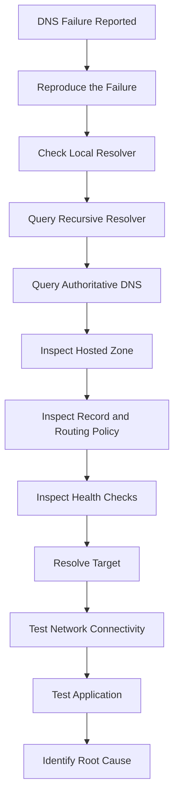
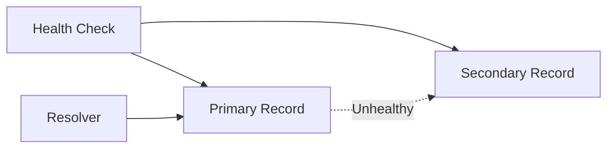
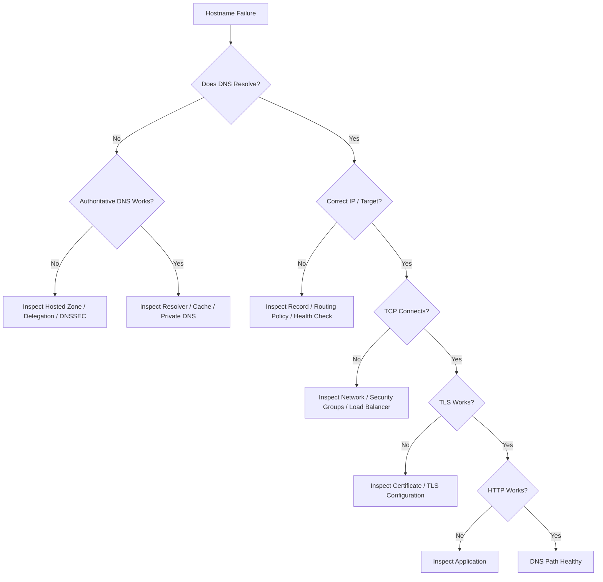

# 05- Troubleshooting Scenarios

## Overview

Route 53 troubleshooting questions test whether you can reason through DNS failures systematically rather than simply memorizing Route 53 features.

At senior backend level, the expected approach is to separate the problem into layers:

```text
Client
  │
  ▼
Local DNS Cache
  │
  ▼
Recursive Resolver
  │
  ▼
Authoritative DNS
  │
  ▼
Route 53
  │
  ▼
DNS Record / Routing Policy
  │
  ▼
Target
  │
  ▼
Application
```

A DNS-related incident can originate at any of these layers. A strong troubleshooting process therefore starts by identifying **where the failure occurs**, then validating the relevant layer with evidence.

Typical symptoms include:

- `NXDOMAIN`
- `SERVFAIL`
- DNS timeout
- Wrong IP address
- Old DNS response
- Private hostname not resolving
- Public hostname resolving internally but not externally
- Health-check failover not occurring
- Traffic going to the wrong region
- DNS changes appearing inconsistent
- Application reachable by IP but not hostname
- Intermittent resolution failures
- Unexpected DNS answers

The key senior-engineering principle is:

> Do not change DNS configuration until you have established which part of the DNS resolution path is failing.

---

## A Production DNS Troubleshooting Model

Use a layered approach.

| Layer | Question |
|---|---|
| Client | Is the client using the expected resolver? |
| Local cache | Is a stale answer cached locally? |
| Recursive resolver | What answer is the resolver returning? |
| Authoritative DNS | What does Route 53 actually return? |
| Hosted zone | Is the correct hosted zone authoritative? |
| Record | Does the expected record exist? |
| Routing policy | Is Route 53 selecting the expected record? |
| Health check | Is the endpoint considered healthy? |
| Network | Can the resolved target be reached? |
| Application | Is the application responding correctly? |

This prevents a common mistake: treating every hostname failure as a Route 53 configuration problem.

---

## Core Troubleshooting Workflow

A practical workflow is:



Start with:

```bash
dig api.example.com
```

Then query a known recursive resolver if appropriate:

```bash
dig @8.8.8.8 api.example.com
```

Query the authoritative nameserver directly:

```bash
dig @ns-123.awsdns-45.com api.example.com
```

The exact authoritative nameserver should come from the domain's actual NS records.

The important comparison is:

```text
Client resolver answer
        vs
Recursive resolver answer
        vs
Authoritative Route 53 answer
```

If the authoritative answer is correct but the recursive answer is stale, the problem is different from an incorrect Route 53 record.

---

## Scenario: `api.example.com` Returns NXDOMAIN

### Symptoms

A client reports:

```text
api.example.com does not exist
```

You run:

```bash
dig api.example.com
```

and receive:

```text
status: NXDOMAIN
```

### Investigation

First determine whether the authoritative DNS service also returns `NXDOMAIN`.

```bash
dig api.example.com
```

Then identify the authoritative nameservers:

```bash
dig NS example.com
```

Query one directly:

```bash
dig @<authoritative-nameserver> api.example.com
```

### Possible causes

| Cause | Explanation |
|---|---|
| Record does not exist | No matching record exists |
| Wrong hosted zone | Record was created in another zone |
| Wrong domain delegation | Domain delegates to different nameservers |
| Typo in hostname | Client is requesting another name |
| Recently created record | Resolver behavior may differ depending on prior negative caching |
| Private/public mismatch | Record exists only in a private hosted zone |
| Stale delegation | Parent zone points elsewhere |

### Senior-level reasoning

Do not immediately create the record.

First verify:

```text
Who is authoritative for example.com?
        │
        ▼
Does that authoritative system contain api.example.com?
        │
        ▼
Is the client querying the expected DNS path?
```

---

## Scenario: DNS Record Exists in Route 53 but Clients Get NXDOMAIN

This is a common interview scenario.

Suppose the Route 53 console shows:

```text
api.example.com → 10.0.10.20
```

but:

```bash
dig api.example.com
```

returns `NXDOMAIN`.

Possible explanations include:

- The record exists in a private hosted zone.
- The public hosted zone is different.
- The domain delegates to another DNS provider.
- The authoritative nameservers are not the ones associated with the expected hosted zone.
- The query is being sent to a resolver with stale negative caching.

Check delegation:

```bash
dig NS example.com
```

Then inspect the authority directly:

```bash
dig @<authoritative-nameserver> api.example.com
```

If the authoritative response is already `NXDOMAIN`, the problem is upstream of the client cache.

---

## Scenario: `SERVFAIL` Instead of `NXDOMAIN`

`SERVFAIL` means the resolver failed to successfully obtain or validate an answer.

It is not equivalent to:

```text
The record does not exist.
```

Possible causes include:

- DNSSEC validation failure.
- Broken delegation.
- Authoritative DNS failure.
- DNS configuration problems.
- Resolver inability to reach authoritative servers.
- Incorrect DNSSEC configuration.

Start with:

```bash
dig api.example.com
```

Then inspect DNSSEC-related information where applicable:

```bash
dig +dnssec api.example.com
```

A useful diagnostic distinction is:

| Response | Typical meaning |
|---|---|
| `NOERROR` | Successful DNS response |
| `NXDOMAIN` | Requested name does not exist |
| `SERVFAIL` | Resolver could not successfully process the query |
| `REFUSED` | Server refused the query |
| Timeout | No usable response received |

---

## Scenario: DNSSEC Causes Resolution Failure

### Symptoms

Some users can resolve the domain while others receive:

```text
SERVFAIL
```

This is especially suspicious when DNSSEC was recently enabled or modified.

### Investigation

Check:

```bash
dig +dnssec example.com
```

Also inspect:

- DNSSEC configuration.
- DS records at the parent.
- DNSKEY records.
- Signing state.
- Registrar configuration.
- Recent DNS changes.

The conceptual chain is:

```text
Parent DS
   │
   ▼
Child DNSKEY
   │
   ▼
RRSIG
   │
   ▼
DNS Answer
```

If the trust chain is broken, validating resolvers can reject the response.

### Interview point

A strong answer is:

> If DNSSEC validation fails, different resolvers may behave differently depending on whether they validate DNSSEC, which can make the problem appear intermittent or geographically inconsistent.

---

## Scenario: DNS Works on One Network but Not Another

### Symptoms

```text
Office network      → Works
Mobile network      → Fails
Home network        → Works
```

Do not immediately assume Route 53 is unstable.

Compare resolver behavior:

```bash
dig @8.8.8.8 api.example.com
dig @1.1.1.1 api.example.com
```

Then query the authoritative server directly.

Possible causes include:

- Resolver-specific caching.
- DNSSEC validation differences.
- Split-horizon DNS.
- Private/public hosted zones.
- Local DNS forwarding.
- Enterprise DNS policies.
- Stale negative caching.

The goal is to determine whether the inconsistency occurs:

```text
Client-specific
      or
Resolver-specific
      or
Authoritative-DNS-specific
```

---

## Scenario: DNS Changes Are Not Visible Immediately

### Symptoms

A record was changed from:

```text
203.0.113.10
```

to:

```text
203.0.113.20
```

but some clients continue receiving:

```text
203.0.113.10
```

### Root cause

DNS caching.

A resolver can continue using a cached answer until the record's TTL expires.

Check:

```bash
dig api.example.com
```

Look at the remaining TTL.

Example:

```text
api.example.com.  300  IN  A  203.0.113.20
```

The `300` represents the remaining TTL in this response.

### Important distinction

Changing the TTL today does not retroactively change copies that were already cached with the previous TTL.

This is a frequent interview trap.

---

## Scenario: A Low TTL Does Not Seem to Work

Suppose the team changes:

```text
TTL = 60
```

but users still see an old address.

Possible reasons include:

- The old record was cached before the TTL was reduced.
- Client-side caches have their own behavior.
- Intermediate DNS infrastructure may behave unexpectedly.
- Multiple records or hosted zones may exist.
- The query is reaching a different authoritative DNS configuration.

Do not assume:

```text
TTL = 60
```

means:

```text
Every client will update within exactly 60 seconds.
```

TTL controls caching behavior; it is not a globally synchronized update timer.

---

## Scenario: Public DNS Works but Private DNS Fails

Suppose:

```bash
curl https://api.example.com
```

works from the internet, but:

```bash
curl https://api.internal.example.com
```

fails from an EC2 instance.

First determine whether the hostname resolves:

```bash
dig api.internal.example.com
```

Then inspect:

- VPC DNS settings.
- Private hosted-zone association.
- Route 53 Resolver behavior.
- VPC association.
- DNS forwarding rules.
- Security controls.
- Network routes.

The troubleshooting distinction is:

```text
Name does not resolve
        ≠
Name resolves but connection fails
```

If DNS returns an IP, move to network troubleshooting.

---

## Scenario: Private Hosted Zone Record Does Not Resolve

### Symptoms

A private hosted zone contains:

```text
db.internal.example.com
```

but an EC2 instance cannot resolve it.

Check:

```bash
cat /etc/resolv.conf
```

Then:

```bash
dig db.internal.example.com
```

Check whether the VPC is associated with the private hosted zone.

Also verify that DNS resolution is enabled for the VPC.

### Common causes

| Cause | Result |
|---|---|
| VPC not associated | Private zone unavailable |
| Incorrect VPC | Query goes through wrong DNS context |
| DNS resolution disabled | Internal names fail |
| Wrong hostname | No matching record |
| Conflicting private zones | Unexpected answer |
| Resolver forwarding issue | Query sent to wrong DNS path |

---

## Scenario: Public and Private Hosted Zones Use the Same Domain

A company may have:

```text
Public zone:
example.com

Private zone:
example.com
```

This can be intentional for split-horizon DNS.

For example:

```text
Internet:
api.example.com → CloudFront

VPC:
api.example.com → Internal Load Balancer
```

The resolution path depends on where the query originates.

### Troubleshooting approach

Compare:

```text
Internet client
      │
      ▼
Public DNS
```

with:

```text
VPC workload
      │
      ▼
VPC Resolver
      │
      ▼
Private Hosted Zone
```

A common mistake is assuming the public record must be returned everywhere.

---

## Scenario: Application Resolves to the Wrong IP

### Symptoms

Expected:

```text
api.example.com → 203.0.113.20
```

Actual:

```text
api.example.com → 203.0.113.10
```

Investigate:

```bash
dig api.example.com
```

Then:

```bash
dig +trace api.example.com
```

Inspect:

- Record type.
- Multiple records.
- Routing policy.
- Weighted routing.
- Latency routing.
- Geolocation routing.
- Failover configuration.
- Alias target.
- Health checks.
- Hosted-zone duplication.

If multiple valid records exist, receiving a different answer does not necessarily mean DNS is broken.

---

## Scenario: Weighted Routing Does Not Behave as Expected

Suppose:

```text
Version A → Weight 90
Version B → Weight 10
```

The team expects exactly:

```text
90% → A
10% → B
```

That is not how to interpret weighted DNS routing operationally.

DNS responses are affected by:

- Recursive resolver caching.
- TTL.
- Client behavior.
- Query distribution.
- Resolver selection.

The weights influence Route 53's selection behavior, but they do not guarantee exact request-level percentages at the application.

### Interview point

> DNS routing policies influence DNS answers, not individual HTTP requests.

If precise request-level traffic splitting is required, application-layer or load-balancer mechanisms may be more appropriate.

---

## Scenario: Failover Routing Does Not Fail Over

### Symptoms

Primary endpoint is unavailable, but clients continue receiving the primary endpoint.

Investigate:

1. Is the health check actually failing?
2. Is the health check attached to the correct record?
3. Is the health-check status expected?
4. Is the record configured as a failover record?
5. Is the secondary record healthy?
6. Are clients receiving cached answers?
7. Is the target itself reachable from the health-check system?

Conceptually:



A common mistake is assuming:

```text
Application is down
=
Route 53 immediately stops returning it
```

Caching and health-check evaluation affect the observed behavior.

---

## Scenario: Health Check Is Healthy but Application Is Down

A Route 53 health check may verify a specific endpoint.

For example:

```text
/health
```

might return:

```text
200 OK
```

while:

```text
/orders
```

is completely broken.

This is a health-check design problem.

A production health endpoint should represent **traffic-serving readiness**, not merely process liveness.

Avoid blindly checking every dependency:

```text
API
 ├── PostgreSQL
 ├── Redis
 ├── Kafka
 ├── External API
 └── Third-party service
```

If every dependency is required for the health check, a temporary dependency failure can cause unnecessary DNS failover.

---

## Scenario: Health Check Always Fails

Check:

- Endpoint path.
- Port.
- Protocol.
- TLS certificate.
- Security groups.
- Network ACLs.
- Endpoint accessibility.
- Expected HTTP response.
- Host header behavior where relevant.
- Whether the health check is compatible with the endpoint.

A backend endpoint such as:

```text
GET /health
```

should return quickly and deterministically.

Example:

```python
from fastapi import FastAPI

app = FastAPI()


@app.get("/health")
async def health() -> dict[str, str]:
    return {"status": "ok"}
```

The endpoint should not perform expensive business operations.

---

## Scenario: DNS Resolves but API Is Unreachable

This is an important troubleshooting distinction.

Suppose:

```bash
dig api.example.com
```

returns:

```text
203.0.113.20
```

but:

```bash
curl https://api.example.com
```

times out.

DNS is probably working.

Continue down the stack:

```text
DNS
 │
 ▼
IP Address
 │
 ▼
TCP Connectivity
 │
 ▼
TLS
 │
 ▼
HTTP
 │
 ▼
Application
```

Test:

```bash
curl -v https://api.example.com
```

For TCP-level testing:

```bash
nc -vz api.example.com 443
```

Possible causes include:

- Security group.
- Network ACL.
- Routing.
- Load balancer.
- Firewall.
- Application listener.
- TLS configuration.

Do not keep modifying Route 53 after the hostname already resolves correctly.

---

## Scenario: DNS Works but HTTPS Certificate Fails

Symptoms:

```text
DNS resolution succeeds
TCP connection succeeds
TLS handshake fails
```

Investigate:

```bash
curl -v https://api.example.com
```

Potential causes include:

- Certificate does not include the hostname.
- Incorrect certificate attached to the load balancer.
- SNI-related configuration.
- Expired certificate.
- TLS policy mismatch.

This demonstrates why DNS and TLS must be troubleshot independently.

---

## Scenario: `dig` Returns Multiple Addresses

Example:

```text
api.example.com. 60 IN A 203.0.113.10
api.example.com. 60 IN A 203.0.113.20
```

This is not automatically a problem.

Possible explanations include:

- Multiple A records.
- Weighted routing.
- Latency routing.
- Multi-value answer routing.
- Alias behavior.
- CDN or load-balancer architecture.

The next question should be:

> What routing policy is configured, and is the observed answer consistent with that policy?

---

## Scenario: Route 53 Record Exists but the Domain Is Still Unreachable

A record in Route 53 does not prove Route 53 is authoritative for the domain.

Check:

```bash
dig NS example.com
```

The returned nameservers must correspond to the authoritative DNS configuration expected for the domain.

The chain is:

```text
Registrar
   │
   ▼
NS Delegation
   │
   ▼
Authoritative Nameservers
   │
   ▼
Hosted Zone
   │
   ▼
DNS Record
```

If the registrar delegates the domain to different nameservers, modifying an unused Route 53 hosted zone has no effect on public DNS.

This is one of the most important Route 53 troubleshooting concepts.

---

## Scenario: Multiple Hosted Zones Exist for the Same Domain

It is possible to accidentally create multiple hosted zones for the same domain.

Example:

```text
example.com
example.com
example.com
```

Only the hosted zone associated with the authoritative nameserver delegation matters for public DNS.

When troubleshooting, identify:

- Hosted-zone ID.
- Nameservers.
- Registrar delegation.
- Record contents.
- Public vs private zone.

Do not assume the first hosted zone shown in the console is authoritative.

---

## Scenario: `dig +trace` Reveals a Different Delegation

Run:

```bash
dig +trace api.example.com
```

This helps visualize the DNS delegation chain.

Conceptually:

```text
Root
 │
 ▼
.com
 │
 ▼
example.com
 │
 ▼
Authoritative Route 53
 │
 ▼
api.example.com
```

If the trace points to unexpected nameservers, investigate domain delegation before modifying application records.

---

## Scenario: DNS Changes Were Applied Through Terraform but Did Not Take Effect

Check the Terraform state and actual AWS configuration.

```bash
terraform plan
```

Then:

```bash
terraform state list
```

Inspect the actual Route 53 record:

```bash
aws route53 list-resource-record-sets \
  --hosted-zone-id <HOSTED_ZONE_ID>
```

Possible causes:

- Wrong hosted-zone ID.
- Terraform state drift.
- Different AWS account.
- Different AWS region/account context.
- Record managed manually.
- Wrong record name.
- Private/public zone confusion.
- CI/CD deployed to another environment.

DNS resources are global or region-independent in ways that differ from many other AWS resources, so account and hosted-zone identity are particularly important.

---

## Scenario: CI/CD Accidentally Modified Production DNS

### Symptoms

A deployment unexpectedly changes production traffic.

Investigate:

```text
Git commit
   │
   ▼
CI/CD workflow
   │
   ▼
AWS role
   │
   ▼
Route 53 API
   │
   ▼
DNS change
```

Check:

- Git history.
- Terraform plan.
- CI/CD logs.
- IAM role used.
- CloudTrail events.
- Hosted-zone ID.
- Environment variables.
- Deployment account.

### Prevention

Use:

- Separate AWS accounts where appropriate.
- Separate production roles.
- Protected environments.
- Manual approval for high-risk DNS changes.
- IaC review.
- Policy-as-code.
- Explicit hosted-zone identifiers.

---

## Scenario: DNS Query Times Out

### Symptoms

```bash
dig api.example.com
```

hangs or times out.

First determine whether the issue is:

```text
Client
   │
   ▼
Recursive Resolver
```

or:

```text
Recursive Resolver
   │
   ▼
Authoritative DNS
```

Test multiple resolvers:

```bash
dig @8.8.8.8 api.example.com
dig @1.1.1.1 api.example.com
```

If all public resolvers fail but the authoritative nameserver responds, investigate resolver or network behavior.

If authoritative servers also cannot be reached, investigate delegation and DNS infrastructure.

---

## Scenario: DNS Resolution Is Slow

DNS latency can affect backend request latency because name resolution happens before connection establishment.

Potential causes include:

- Slow recursive resolver.
- DNS retries.
- Network path problems.
- Resolver configuration.
- Excessive dependency lookups.
- Poorly configured application DNS behavior.

For a backend service:

```text
HTTP Request
    │
    ├── DNS lookup
    ├── TCP connection
    ├── TLS handshake
    └── HTTP request
```

Connection pooling and DNS caching can reduce repeated resolution overhead.

In Python applications, libraries and HTTP clients may maintain connection pools, reducing the frequency of DNS and TCP setup.

---

## Scenario: Kubernetes Workload Cannot Resolve Route 53 Name

A Kubernetes workload may use:

```text
Pod
 │
 ▼
CoreDNS
 │
 ▼
VPC Resolver
 │
 ▼
Route 53
```

Troubleshoot from the pod:

```bash
kubectl exec -it <pod> -- nslookup api.example.com
```

or:

```bash
kubectl exec -it <pod> -- getent hosts api.example.com
```

Then inspect CoreDNS configuration:

```bash
kubectl -n kube-system get configmap coredns -o yaml
```

Possible causes include:

- CoreDNS failure.
- Incorrect forwarding.
- VPC DNS configuration.
- Network policies.
- Private hosted-zone configuration.
- Incorrect resolver configuration.

The important distinction is that Kubernetes may add another DNS layer between the application and Route 53.

---

## Scenario: Docker Container Cannot Resolve a Hostname

Check inside the container:

```bash
docker exec -it <container> getent hosts api.example.com
```

Inspect DNS configuration:

```bash
docker exec -it <container> cat /etc/resolv.conf
```

Compare:

```text
Host DNS
   │
   ▼
Docker DNS
   │
   ▼
Recursive Resolver
   │
   ▼
Route 53
```

Do not assume that DNS behavior on the host and inside the container is identical.

---

## Scenario: Application Uses Stale DNS After Failover

A service may continue connecting to an old IP after DNS has changed.

Potential causes include:

- DNS cache.
- Long-lived HTTP connection.
- Connection pool.
- Application-level caching.
- JVM/runtime-specific DNS caching.
- Sidecar or service-mesh caching.

This is especially important in microservices.

```text
Route 53
   │
   ▼
New DNS answer
   │
   ▼
Application
   │
   └── Existing connection → Old endpoint
```

DNS changes do not necessarily terminate existing TCP connections.

A senior engineer must distinguish between:

```text
DNS cache
```

and:

```text
Existing network connection
```

---

## Scenario: Failover Appears Slow

A team expects:

```text
Primary fails
    ↓
Immediate traffic to secondary
```

but users continue reaching the primary.

Investigate the complete timeline:

```text
Endpoint failure
      │
      ▼
Health check detects failure
      │
      ▼
Route 53 changes routing decision
      │
      ▼
Recursive resolver receives new answer
      │
      ▼
Cached TTL expires
      │
      ▼
Client receives new answer
      │
      ▼
New connection reaches secondary
```

Multiple stages contribute to observed failover time.

Also remember that existing client connections may remain connected to the old endpoint.

---

## Scenario: Geolocation Routing Returns Unexpected Region

Suppose:

```text
India → ap-south-1
US → us-east-1
Europe → eu-west-1
```

but a user receives an unexpected endpoint.

Investigate:

- DNS resolver location.
- Routing policy.
- Geolocation configuration.
- Default record.
- Client network path.
- Recursive resolver behavior.

DNS routing decisions are not necessarily based on the user's exact physical GPS location.

The relevant routing context may be associated with the resolver or configured geolocation behavior.

---

## Scenario: Latency Routing Sends Traffic to an Unexpected Region

Latency routing attempts to select the AWS Region that provides the lowest latency according to Route 53's routing data.

It does not mean:

```text
Nearest geographic region = selected region
```

Network latency is not determined purely by physical distance.

For troubleshooting, inspect:

- Configured regions.
- Health status.
- Record type.
- Alias configuration.
- Resolver location.
- Current network conditions.

---

## Scenario: Alias Record Does Not Behave as Expected

Alias records can point Route 53 records toward supported AWS resources such as:

- CloudFront distributions.
- Elastic Load Balancing resources.
- API Gateway.
- S3 website endpoints in supported configurations.

Check:

- Alias target.
- Hosted-zone ID where applicable.
- Record type.
- Evaluate target health setting.
- Target resource state.

A useful troubleshooting distinction is:

```text
DNS record
   │
   ▼
Alias target
   │
   ▼
AWS resource
   │
   ▼
Actual backend
```

If DNS resolves correctly but the target is unhealthy, continue troubleshooting the target service.

---

## Scenario: DNS Works but Route 53 Health Check Does Not

Do not test only from your laptop.

The health check may originate from AWS-managed infrastructure rather than your local network.

Verify:

- Public reachability.
- Port.
- Protocol.
- Path.
- Response code.
- TLS.
- Firewall rules.
- Endpoint behavior.

A private endpoint generally requires a different architecture if you need health checking from inside the VPC.

---

## Scenario: Users See Different DNS Answers

This can be expected.

DNS answers may differ because of:

- TTL.
- Recursive resolver cache.
- Routing policies.
- Geographic location.
- Health-check state.
- Multi-value routing.
- Public/private DNS context.

The first question should be:

> Are the different answers incorrect, or are they valid results of the configured routing policy?

---

## Scenario: DNS Record Was Deleted Accidentally

### Immediate response

1. Identify the affected hosted zone.
2. Determine the previous known-good configuration.
3. Restore the record.
4. Validate authoritative DNS.
5. Validate recursive DNS.
6. Validate the application.
7. Review CloudTrail.
8. Identify how the deletion occurred.
9. Prevent recurrence.

Inspect records:

```bash
aws route53 list-resource-record-sets \
  --hosted-zone-id <HOSTED_ZONE_ID>
```

For production environments, maintain DNS configuration in version control so restoration does not depend on manually reconstructing records.

---

## Scenario: Route 53 Hosted Zone Was Deleted

Hosted-zone deletion is more severe than deleting an individual record.

Investigate:

- CloudTrail.
- IaC state.
- Hosted-zone ID.
- Domain delegation.
- Backup or source-controlled DNS configuration.

A recovery process should be documented before an incident occurs.

The organization should know:

```text
Who owns the domain?
Which hosted zone is authoritative?
Which nameservers are delegated?
Where is the source of truth?
How is DNS restored?
Who can perform emergency changes?
```

---

## Scenario: Domain Delegation Is Broken

### Symptoms

The hosted zone contains the correct records, but public DNS does not resolve them.

Check:

```bash
dig NS example.com
```

Then:

```bash
dig +trace example.com
```

Compare the delegated nameservers with the Route 53 hosted zone.

If the parent delegates to:

```text
ns-100.awsdns-xx.com
```

but the intended hosted zone uses a different set of nameservers, the public domain will not use the intended zone.

This is a delegation problem, not an application-record problem.

---

## Scenario: DNS Is Correct but Clients Still Fail

At this point, stop troubleshooting Route 53.

Validate:

```bash
dig api.example.com
```

Then:

```bash
curl -v https://api.example.com
```

Then inspect:

```text
DNS
 ↓
IP
 ↓
TCP
 ↓
TLS
 ↓
HTTP
 ↓
Application
 ↓
Database / dependencies
```

If DNS and TCP are correct, investigate:

- TLS.
- Load balancer.
- Security groups.
- Application.
- Database.
- Redis.
- Kafka.
- External dependencies.

This is a key senior-engineering behavior:

> Stop troubleshooting a layer once evidence proves that layer is functioning correctly.

---

## Useful Diagnostic Commands

| Command | Purpose |
|---|---|
| `dig example.com` | Basic DNS query |
| `dig A example.com` | Query A record |
| `dig AAAA example.com` | Query IPv6 record |
| `dig CNAME example.com` | Query CNAME |
| `dig NS example.com` | Query authoritative nameservers |
| `dig SOA example.com` | Inspect SOA |
| `dig +trace example.com` | Trace DNS delegation |
| `dig +dnssec example.com` | Inspect DNSSEC-related responses |
| `dig @8.8.8.8 example.com` | Query a specific resolver |
| `dig @<authoritative-server> example.com` | Query authoritative DNS directly |
| `nslookup example.com` | Basic DNS troubleshooting |
| `getent hosts example.com` | Test OS-level hostname resolution |
| `curl -v https://example.com` | Test DNS + TCP + TLS + HTTP |
| `nc -vz example.com 443` | Test TCP connectivity |

---

## AWS CLI Investigation

List hosted zones:

```bash
aws route53 list-hosted-zones
```

List records:

```bash
aws route53 list-resource-record-sets \
  --hosted-zone-id <HOSTED_ZONE_ID>
```

List health checks:

```bash
aws route53 list-health-checks
```

Inspect a specific health check:

```bash
aws route53 get-health-check \
  --health-check-id <HEALTH_CHECK_ID>
```

List hosted-zone nameservers:

```bash
aws route53 get-hosted-zone \
  --id <HOSTED_ZONE_ID>
```

The exact commands and permissions available to an engineer should be constrained by the organization's IAM model.

---

## DNS Troubleshooting Decision Tree



This decision tree prevents random configuration changes.

---

## Troubleshooting Evidence Collection

During a production incident, collect evidence before changing configuration.

Useful evidence includes:

```text
Current Route 53 records
Hosted zone ID
Authoritative nameservers
DNS query results
TTL values
Routing policy
Health-check state
CloudTrail events
Terraform state
CI/CD logs
Client resolver
Application logs
Network connectivity
TLS output
```

For example:

```bash
dig api.example.com
dig NS example.com
dig +trace api.example.com
curl -v https://api.example.com
```

Record timestamps because DNS state and health-check state can change during an incident.

---

## Production Troubleshooting Checklist

### DNS Resolution

- [ ] Confirm the hostname.
- [ ] Confirm the record type.
- [ ] Query the local resolver.
- [ ] Query an independent recursive resolver.
- [ ] Query the authoritative nameserver.
- [ ] Check TTL.
- [ ] Check for `NXDOMAIN`, `SERVFAIL`, or timeout.
- [ ] Check public/private DNS context.

### Route 53

- [ ] Confirm hosted-zone ID.
- [ ] Confirm public/private hosted zone.
- [ ] Confirm record exists.
- [ ] Confirm routing policy.
- [ ] Confirm alias target.
- [ ] Confirm health-check configuration.
- [ ] Confirm authoritative nameservers.

### AWS

- [ ] Check CloudTrail.
- [ ] Check IAM role used for changes.
- [ ] Check CI/CD activity.
- [ ] Check Terraform state.
- [ ] Check target resource health.

### Network

- [ ] Confirm resolved IP.
- [ ] Test TCP connectivity.
- [ ] Check security groups.
- [ ] Check routing.
- [ ] Check load balancer.
- [ ] Check firewall controls.

### Application

- [ ] Validate TLS.
- [ ] Validate HTTP status.
- [ ] Check application logs.
- [ ] Check dependency health.
- [ ] Check existing connection pools.

---

## Common Troubleshooting Mistakes

### Changing DNS before proving DNS is the problem

If:

```bash
dig api.example.com
```

returns the expected IP, changing the record is unlikely to fix an HTTP timeout.

### Looking only at the Route 53 console

The console shows configuration, not necessarily what clients are currently receiving.

Always compare authoritative and recursive answers.

### Ignoring domain delegation

A perfectly configured hosted zone is useless if the domain is delegated elsewhere.

### Confusing `NXDOMAIN` with `SERVFAIL`

They represent fundamentally different failure conditions.

### Ignoring DNS caching

Different users can temporarily receive different answers after a DNS change.

### Assuming weighted routing equals request-level load balancing

DNS routing controls DNS responses, not every HTTP request.

### Ignoring private DNS

An internal record may work inside a VPC and not exist publicly by design.

### Assuming DNS resolution means connectivity

A successful DNS lookup proves name resolution, not TCP, TLS, or application health.

### Troubleshooting only from a laptop

Kubernetes, Docker, VPC, enterprise resolvers, and service meshes may introduce additional DNS layers.

### Changing health checks during an incident without understanding them

Poorly designed health checks can increase the blast radius of an outage.

---

## Senior-Level Troubleshooting Principles

### Separate DNS from connectivity

Always distinguish:

```text
Name resolution
```

from:

```text
Network connectivity
```

and:

```text
Application availability
```

### Compare authoritative and recursive responses

This is one of the fastest ways to localize DNS problems.

```text
Authoritative = correct
Recursive     = incorrect
→ caching / resolver path

Authoritative = incorrect
Recursive     = incorrect
→ Route 53 / delegation / configuration

DNS = correct
Application = unavailable
→ network / TLS / application
```

### Follow the dependency chain

For a production API:

```text
Domain
  ↓
DNS delegation
  ↓
Hosted zone
  ↓
Record
  ↓
Routing policy
  ↓
Health check
  ↓
AWS target
  ↓
Network
  ↓
TLS
  ↓
Application
```

### Use evidence before remediation

Avoid changing several DNS records simultaneously.

Every unnecessary change makes the incident harder to reason about.

---

## Interview Traps

| Question | Strong answer |
|---|---|
| "The record exists, why does DNS return NXDOMAIN?" | Verify public/private zone, authoritative delegation, and resolver behavior |
| "DNS resolves, why is the API down?" | DNS is likely functioning; investigate TCP, TLS, load balancer, and application |
| "Why do users see different IPs?" | Caching and routing policies can legitimately produce different answers |
| "Why didn't lowering TTL immediately fix caching?" | Existing cached responses retain their previously received TTL |
| "Why isn't Route 53 failing over?" | Check health-check state, routing policy, cached answers, and existing connections |
| "Why does the private hostname work only in AWS?" | It may belong to a private hosted zone intentionally |
| "Why does Terraform show the correct record but DNS is wrong?" | Verify hosted-zone ID and authoritative delegation |
| "Why does weighted routing not produce exact percentages?" | DNS caching and resolver behavior prevent request-level precision |
| "What does `SERVFAIL` mean?" | The resolver failed to successfully process or validate the DNS query |
| "What does `NXDOMAIN` mean?" | The requested DNS name does not exist according to the responding authoritative DNS context |
| "Can DNS be correct while HTTPS fails?" | Yes; TLS and application connectivity are separate layers |
| "How do you prove Route 53 is not the problem?" | Show that authoritative and recursive DNS return the expected answer, then move down the stack |

---

## Production Best Practices

- Maintain DNS configuration through Infrastructure as Code.
- Keep hosted-zone IDs and domain ownership clearly documented.
- Monitor production DNS changes through CloudTrail.
- Use least-privilege IAM roles for DNS automation.
- Keep public and private DNS architectures explicit.
- Test DNS failover before relying on it during an incident.
- Maintain a documented DNS recovery procedure.
- Monitor health checks and routing changes.
- Keep DNS records synchronized with infrastructure lifecycle.
- Remove stale records during service decommissioning.
- Test DNS from multiple resolver locations when diagnosing global incidents.
- Maintain low-risk operational procedures for emergency DNS changes.
- Avoid changing multiple DNS variables simultaneously during an incident.
- Include DNS in disaster-recovery exercises.
- Document registrar access and domain delegation.
- Treat domain and DNS credentials as high-value production assets.

---

## Key Takeaways

- DNS troubleshooting should be performed layer by layer rather than by changing Route 53 records blindly.
- Always distinguish client, recursive resolver, authoritative DNS, Route 53 configuration, network, TLS, and application failures.
- `NXDOMAIN` means the requested name does not exist in the relevant authoritative DNS context; `SERVFAIL` means the resolver failed to successfully process or validate the query.
- A record appearing in the Route 53 console does not prove that the public internet is using that hosted zone.
- Domain delegation and authoritative nameservers must be verified when public DNS behaves unexpectedly.
- Compare recursive DNS answers with authoritative Route 53 answers to localize caching and resolver problems.
- DNS TTL controls caching behavior; reducing TTL does not invalidate already-cached records.
- DNS routing policies influence DNS answers, not individual HTTP requests.
- Failover depends on health-check state, routing configuration, DNS caching, and existing client connections.
- A healthy DNS response does not prove that the resolved endpoint is reachable.
- Kubernetes, Docker, VPC Resolver, CoreDNS, and enterprise DNS infrastructure can introduce additional resolution layers.
- Private hosted zones intentionally behave differently from public hosted zones.
- DNSSEC failures can produce `SERVFAIL` and may affect validating and non-validating clients differently.
- Terraform troubleshooting should verify hosted-zone identity, state, account, delegation, and actual AWS configuration.
- Health checks should represent meaningful traffic-serving readiness without becoming overly dependent on every backend dependency.
- The fastest troubleshooting path is usually: **reproduce → query resolver → query authoritative DNS → inspect Route 53 → validate target → validate network → validate TLS → validate application**.
- A senior engineer stops troubleshooting Route 53 once evidence proves DNS is functioning and moves to the next failing layer.