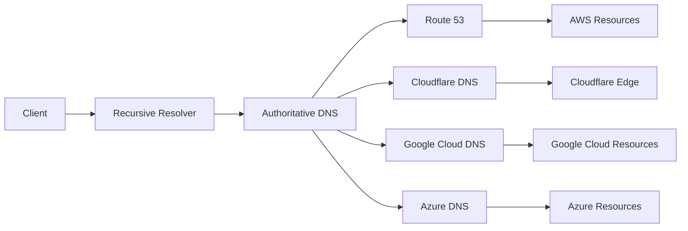
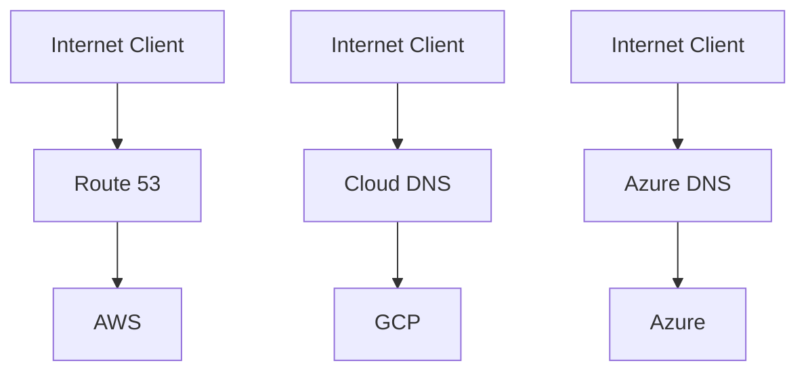
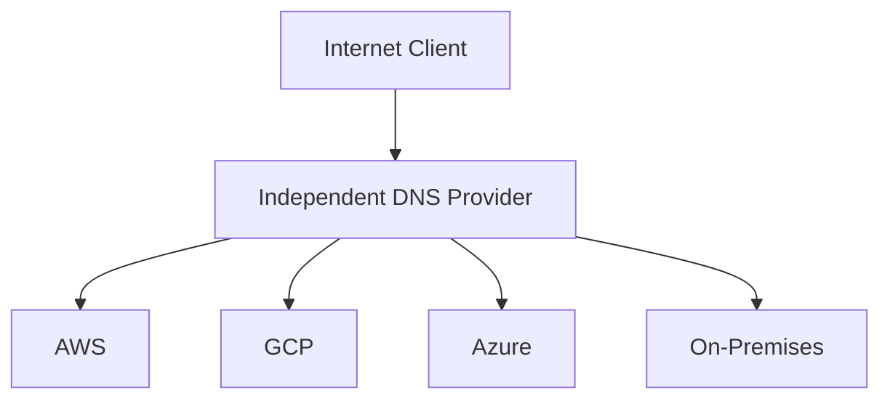
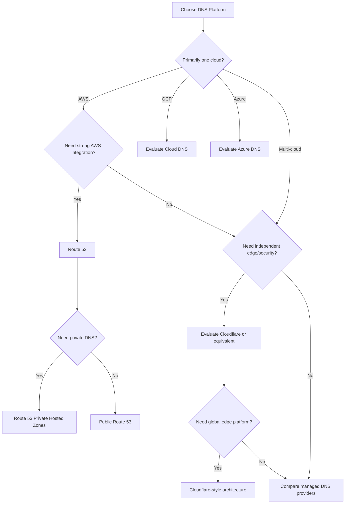

# 06- Route 53 vs Other DNS Solutions

## Overview

Amazon Route 53 is AWS's managed DNS service, but it is not the only production-grade DNS platform. Senior backend engineers should understand how Route 53 compares with alternatives such as Cloudflare DNS, Google Cloud DNS, Azure DNS, and self-managed DNS.

The important comparison is not simply:

> Which DNS provider is better?

The better question is:

> Which DNS architecture best fits the application's cloud environment, traffic-management requirements, security model, operational model, and availability strategy?

Route 53 provides authoritative public DNS, private hosted zones, health checks, multiple DNS routing policies, domain registration, and integration with AWS services. AWS also provides Route 53 Resolver capabilities for VPC DNS resolution. :contentReference[oaicite:0]{index=0}

Other providers solve similar DNS problems but differ significantly in:

- Cloud integration
- Global traffic management
- Private DNS
- DNS security
- DDoS protection
- Edge networking
- DNS analytics
- Hybrid-cloud integration
- Automation APIs
- Operational model
- Vendor lock-in

---

## What Is Actually Being Compared?

A common mistake is comparing services that are not equivalent.

A production DNS architecture may contain several layers:



The primary comparison in this document is **authoritative DNS hosting and related traffic-management capabilities**.

Recursive DNS resolution is a separate concern.

---

## Route 53 in the AWS Architecture

Route 53 is tightly integrated with AWS networking and infrastructure.

A typical AWS application may look like:

```text
                         Internet
                            │
                            ▼
                    Route 53 Public DNS
                            │
                ┌───────────┼───────────┐
                │           │           │
                ▼           ▼           ▼
           CloudFront     ALB         API Gateway
                │           │
                │           ▼
                │          ECS
                │           │
                │           ▼
                │         Service
                │
                ▼
             S3
```

For internal applications:

```text
EC2 / ECS / EKS
       │
       ▼
VPC DNS Resolver
       │
       ▼
Route 53 Private Hosted Zone
       │
       ▼
Internal AWS Service
```

Route 53 supports both public and private hosted zones. Private hosted zones provide DNS records for resources inside associated VPCs and support split-view DNS architectures. :contentReference[oaicite:1]{index=1}

---

## Core Comparison

| Capability | Route 53 | Cloudflare DNS | Google Cloud DNS | Azure DNS |
|---|---|---|---|---|
| Public authoritative DNS | Yes | Yes | Yes | Yes |
| Private DNS | Yes | Yes, through Cloudflare's private DNS capabilities | Yes | Yes |
| AWS integration | Excellent | External | External | External |
| GCP integration | External | External | Excellent | External |
| Azure integration | External | External | External | Excellent |
| Health checks | Yes | Yes, depending on product | Available through Google Cloud traffic-management ecosystem | Yes through Traffic Manager |
| DNS routing policies | Extensive | Extensive, product-dependent | Supported | Supported |
| DNSSEC | Yes | Yes | Yes | Yes |
| Domain registration | Yes | Available through Cloudflare Registrar | Available through Google Cloud ecosystem depending on offering/region | Available through Azure ecosystem |
| Global edge network | AWS DNS infrastructure | Extremely strong edge platform | Google global network | Microsoft global network |
| CDN/WAF integration | Strong AWS integration | Extremely strong | Strong GCP integration | Strong Azure integration |
| Private VPC DNS | Strong | Different architectural model | Strong | Strong |
| Hybrid DNS | Strong with Route 53 Resolver | Strong with Cloudflare Gateway/Zero Trust products | Strong | Strong |
| Best fit | AWS-centric workloads | Edge/security-centric architectures | GCP-centric workloads | Azure-centric workloads |

The feature sets overlap, but the architectural integration is different.

---

## Route 53 vs Cloudflare DNS


::contentReference[oaicite:2]{index=2}


Cloudflare is more than a DNS provider. Its platform combines DNS with services such as:

- CDN
- WAF
- DDoS protection
- Edge compute
- Load balancing
- Zero Trust
- Bot management
- TLS
- Traffic management

This makes the comparison particularly important.

### Route 53 strengths

Route 53 is usually attractive when the infrastructure is heavily AWS-oriented.

Examples:

```text
Route 53
   ↓
CloudFront
   ↓
ALB
   ↓
ECS / EKS
```

or:

```text
Route 53
   ↓
Private Hosted Zone
   ↓
VPC
   ↓
ECS / EKS / EC2
```

Route 53 supports routing policies including:

- Simple
- Failover
- Weighted
- Latency-based
- Geolocation
- Geoproximity
- IP-based
- Multivalue answer

AWS documents these as mechanisms that determine how Route 53 responds to DNS queries. :contentReference[oaicite:3]{index=3}

### Cloudflare strengths

Cloudflare is particularly attractive when DNS is part of a broader edge-security architecture.

For example:

```text
Client
  │
  ▼
Cloudflare
 ├── DNS
 ├── DDoS protection
 ├── WAF
 ├── CDN
 ├── TLS
 └── Edge routing
        │
        ▼
     AWS / GCP / Azure
```

This can be useful for multi-cloud environments where the DNS and security edge should remain independent of the underlying cloud provider.

### Architectural difference

The important distinction is:

```text
Route 53:
DNS is deeply integrated into AWS infrastructure.

Cloudflare:
DNS is part of a broader independent edge platform.
```

Neither is universally superior.

---

## Route 53 vs Google Cloud DNS

Google Cloud DNS is Google's managed authoritative DNS service. It provides public and private managed zones and integrates with Google Cloud VPC networking. Google's documentation describes Cloud DNS as a global, high-volume authoritative DNS service and supports public/private zones, IAM, forwarding, policies, and DNSSEC. :contentReference[oaicite:4]{index=4}

A GCP-centric architecture may look like:

```text
Client
  │
  ▼
Cloud DNS
  │
  ▼
Google Cloud Load Balancer
  │
  ▼
GKE / Compute Engine
```

The decision between Route 53 and Cloud DNS is usually driven more by infrastructure ownership than by basic DNS functionality.

### AWS-centric

```text
Route 53
   ↓
AWS resources
```

### GCP-centric

```text
Cloud DNS
   ↓
Google Cloud resources
```

### Multi-cloud

```text
                 DNS
                  │
        ┌─────────┼─────────┐
        ▼         ▼         ▼
       AWS       GCP      Azure
```

For a multi-cloud environment, an independent DNS provider may reduce cloud coupling.

---

## Route 53 vs Azure DNS

Azure DNS provides public and private DNS capabilities, while Azure Traffic Manager provides DNS-based traffic routing and endpoint health monitoring. Microsoft describes Traffic Manager as a DNS-based traffic load balancer for directing users toward appropriate public endpoints. :contentReference[oaicite:5]{index=5}

An Azure architecture might be:

```text
Client
  │
  ▼
Azure DNS
  │
  ▼
Azure Traffic Manager
  │
  ├── Region A
  ├── Region B
  └── Region C
```

The equivalent AWS architecture could use:

```text
Client
  │
  ▼
Route 53
  │
  ├── Region A
  ├── Region B
  └── Region C
```

The architectural pattern is similar, but the surrounding cloud ecosystem differs.

---

## Route 53 vs Self-Managed BIND

Self-managed DNS is fundamentally different.

A typical BIND architecture could be:

```text
Internet
   │
   ▼
Authoritative DNS
   │
   ├── DNS Server A
   ├── DNS Server B
   └── DNS Server C
```

The engineering team is responsible for:

- DNS server deployment
- Configuration
- Patching
- Capacity
- Redundancy
- Monitoring
- Network connectivity
- DDoS resilience
- DNSSEC configuration
- Backups
- Disaster recovery
- Failover
- Anycast architecture if required

With Route 53:

```text
AWS-managed DNS infrastructure
        │
        ▼
Managed Route 53 service
```

### Comparison

| Concern | Route 53 | Self-managed BIND |
|---|---|---|
| Infrastructure management | AWS | Engineering team |
| Patching | AWS | Team |
| DNS server scaling | Managed | Team |
| Availability architecture | Managed | Team |
| DNSSEC | Managed capability | Team |
| Configuration control | High | Very high |
| Operational complexity | Low | High |
| Custom behavior | Limited to service capabilities | Very high |
| Cloud dependency | AWS | Lower |
| Engineering effort | Lower | Higher |

Self-managed DNS can make sense when there are unusual requirements that managed DNS cannot satisfy.

For ordinary production backend systems, the operational burden usually outweighs the flexibility.

---

## Authoritative DNS vs Application Traffic Management

A critical architectural distinction is that DNS routing is not the same as application load balancing.

For example:

```text
Route 53 Weighted Routing
```

does not provide the same behavior as:

```text
Application Load Balancer
```

DNS works at the name-resolution layer:

```text
Client
  │
  │ DNS query
  ▼
Route 53
  │
  ▼
IP address
  │
  ▼
Client connection
```

A load balancer works after resolution:

```text
Client
  │
  ▼
Load Balancer
  │
  ├── Backend A
  ├── Backend B
  └── Backend C
```

Route 53 weighted routing can distribute DNS responses according to configured weights, but DNS caching means it should not be interpreted as precise per-request load balancing. AWS documents weighted routing as proportional routing among records in the same weighted group. :contentReference[oaicite:6]{index=6}

---

## When Route 53 Is the Better Choice

Route 53 is usually a strong choice when:

- Most infrastructure runs on AWS.
- AWS service integration matters.
- Private DNS is important.
- VPC-based service discovery is required.
- DNS and infrastructure are managed together.
- AWS IAM should control DNS changes.
- Terraform manages AWS infrastructure.
- Route 53 health checks are useful.
- AWS-native routing policies are sufficient.
- The team wants low DNS operational overhead.

Example:

```text
Route 53
   │
   ├── Public Hosted Zone
   │       │
   │       └── CloudFront / ALB
   │
   └── Private Hosted Zone
           │
           └── ECS / EKS / RDS / internal services
```

This is a natural AWS architecture.

---

## When Cloudflare May Be the Better Choice

Cloudflare can be attractive when:

- The organization operates across multiple clouds.
- DNS should remain independent from AWS.
- WAF and CDN are central requirements.
- Edge security is a primary architectural concern.
- Traffic should pass through a global edge platform.
- Zero Trust capabilities are required.
- The organization wants one edge platform across AWS, GCP, Azure, and on-premises infrastructure.

Example:

```text
                    Cloudflare
                ┌───────┼────────┐
                │       │        │
               DNS     WAF      CDN
                │
       ┌────────┼────────┐
       ▼        ▼        ▼
      AWS      GCP     Azure
```

This architecture can reduce dependence on any one cloud provider.

---

## When Google Cloud DNS May Be the Better Choice

Cloud DNS is a natural choice when:

- Workloads are primarily on Google Cloud.
- GCP VPC DNS integration is important.
- Google Cloud IAM should manage DNS.
- GCP-native networking is already the operational standard.
- Hybrid DNS forwarding is required.

Google Cloud DNS supports public and private zones as well as DNS forwarding and server policies for VPC networks. :contentReference[oaicite:7]{index=7}

---

## When Azure DNS May Be the Better Choice

Azure DNS is generally a natural choice when:

- Infrastructure is primarily on Azure.
- Azure VNet private DNS is important.
- Azure-native identity and management are preferred.
- Azure Traffic Manager is used for DNS-based global routing.
- Hybrid Azure/on-premises DNS is required.

Azure also provides Private Resolver capabilities for hybrid DNS architectures. :contentReference[oaicite:8]{index=8}

---

## Multi-Cloud DNS Architecture

A senior architecture decision should consider whether DNS itself should be cloud-independent.

### Cloud-specific DNS



This works well when each cloud owns independent applications.

### Independent DNS provider



This can simplify global traffic management across clouds.

However, it introduces another external dependency.

---

## Multi-Cloud Trade-Off

| Strategy | Advantages | Limitations |
|---|---|---|
| Route 53 as primary DNS | Excellent AWS integration | AWS dependency |
| Cloudflare as primary DNS | Cloud-independent edge | Additional platform |
| Separate DNS per cloud | Strong cloud-local integration | More complex global management |
| Self-managed DNS | Maximum control | High operational burden |
| Secondary DNS architecture | Better resilience | More operational complexity |

The correct choice depends on the organization's failure model.

---

## DNS Provider Independence

One senior-level consideration is whether a DNS provider becoming unavailable should be treated as a catastrophic dependency.

A highly critical domain could use a secondary DNS strategy:

```text
                Domain
                  │
             Delegation
                  │
        ┌─────────┴─────────┐
        ▼                   ▼
 Primary DNS          Secondary DNS
 Provider              Provider
        │                   │
        └─────────┬─────────┘
                  ▼
               Records
```

However, secondary DNS introduces:

- Zone synchronization.
- Operational complexity.
- Change propagation concerns.
- Monitoring requirements.
- Provider compatibility concerns.
- More complicated incident response.

Do not introduce multi-provider DNS simply because it sounds more resilient.

The additional system must reduce more risk than it introduces.

---

## DNSSEC Comparison

DNSSEC provides cryptographic validation of DNS responses.

At a high level:

```text
DNS Record
    │
    ▼
DNSSEC Signature
    │
    ▼
Recursive Resolver
    │
    ▼
Validation
```

Modern managed DNS platforms support DNSSEC, but implementation details differ.

| Concern | Route 53 | Cloudflare | Google Cloud DNS | Azure DNS |
|---|---|---|---|---|
| DNSSEC | Yes | Yes | Yes | Yes |
| Managed signing | Yes | Yes | Yes | Yes |
| Parent DS management | Domain/registrar dependent | Provider/registrar dependent | Registrar dependent | Registrar dependent |
| Operational complexity | Managed | Managed | Managed | Managed |

The important engineering lesson is:

> DNSSEC protects DNS integrity; it does not replace TLS, WAF, DDoS protection, or application authentication.

---

## Private DNS Comparison

Private DNS becomes important for microservices and internal APIs.

### Route 53

```text
EKS
 │
 ▼
VPC Resolver
 │
 ▼
Private Hosted Zone
 │
 ▼
orders.internal.example.com
```

Route 53 private hosted zones are associated with VPCs and can support split-view DNS. AWS also requires VPC DNS support settings to be enabled for private hosted zones. :contentReference[oaicite:9]{index=9}

### Google Cloud DNS

```text
GKE
 │
 ▼
VPC
 │
 ▼
Cloud DNS Private Zone
```

### Azure

```text
AKS
 │
 ▼
VNet
 │
 ▼
Azure Private DNS
```

The same conceptual model exists across clouds, but implementation and integration differ.

---

## Hybrid DNS

Hybrid environments often require:

```text
AWS VPC
   │
   ▼
Route 53 Resolver
   │
   ▼
On-Premises DNS
```

or:

```text
On-Premises
   │
   ▼
DNS Forwarder
   │
   ▼
Cloud DNS
```

Google Cloud explicitly supports inbound and outbound DNS forwarding through server policies, while Azure provides Private Resolver for hybrid DNS scenarios. :contentReference[oaicite:10]{index=10}

The architectural requirement is usually:

```text
Cloud workloads
       ↕
Hybrid DNS
       ↕
On-premises workloads
```

The DNS provider is only one component of the solution.

---

## Routing Capability Comparison

| Routing requirement | Route 53 | Cloudflare | Google Cloud | Azure |
|---|---|---|---|---|
| Simple DNS | Yes | Yes | Yes | Yes |
| Weighted | Yes | Yes/product-dependent | Yes | Yes |
| Failover | Yes | Yes/product-dependent | Ecosystem-dependent | Traffic Manager |
| Latency-based | Yes | Yes/product-dependent | Routing capabilities available | Traffic Manager |
| Geographic routing | Yes | Yes | Yes | Traffic Manager |
| Health-based routing | Yes | Yes/product-dependent | Available through cloud services | Yes |
| Private DNS routing | Strong | Different architecture | Strong | Strong |
| Cloud-native aliases | Excellent AWS integration | Different model | GCP integration | Azure integration |

Do not compare a single DNS service against an entire traffic-management platform without accounting for the surrounding services.

---

## Cloud Vendor Lock-In

Route 53 can increase AWS coupling, but that is not automatically bad.

Consider:

```text
Application
   │
   ├── ECS
   ├── ALB
   ├── CloudFront
   ├── RDS
   ├── S3
   └── Route 53
```

If the application is already deeply AWS-native, avoiding Route 53 solely to reduce DNS lock-in may provide little practical value.

Conversely, if the architecture is:

```text
AWS
GCP
Azure
On-Premises
```

then using a cloud-independent DNS and edge layer may make more architectural sense.

Senior engineering decisions should optimize for **total system complexity**, not theoretical portability.

---

## Operational Comparison

| Operational area | Route 53 | Cloudflare | Google Cloud DNS | Azure DNS |
|---|---|---|---|---|
| AWS Console/IAM integration | Excellent | External | External | External |
| Terraform | Strong | Strong | Strong | Strong |
| CLI/API | AWS CLI/API | API | gcloud/API | Azure CLI/API |
| Cloud-native monitoring | CloudWatch ecosystem | Cloudflare analytics | Cloud Monitoring | Azure Monitor |
| Cloud-native access control | IAM | Cloudflare identity/access model | IAM | Azure RBAC |
| Private networking | VPC-centric | Different model | VPC-centric | VNet-centric |
| Infrastructure automation | Excellent | Excellent | Excellent | Excellent |

The provider should fit the organization's existing operational model.

---

## Infrastructure as Code

All major managed DNS providers can be automated.

A Route 53 Terraform example:

```hcl
resource "aws_route53_record" "api" {
  zone_id = var.hosted_zone_id
  name    = "api.example.com"
  type    = "A"

  alias {
    name                   = aws_lb.api.dns_name
    zone_id                = aws_lb.api.zone_id
    evaluate_target_health = true
  }
}
```

The important production property is not Terraform itself.

It is having:

```text
Git
 │
 ▼
Pull Request
 │
 ▼
Terraform Plan
 │
 ▼
Review
 │
 ▼
Terraform Apply
 │
 ▼
DNS
```

This gives DNS changes the same review and audit process as application infrastructure.

---

## API and CLI Philosophy

Route 53 integrates with AWS APIs and the AWS CLI.

For example:

```bash
aws route53 list-hosted-zones
```

Cloudflare:

```bash
curl -X GET \
  "https://api.cloudflare.com/client/v4/zones" \
  -H "Authorization: Bearer $CLOUDFLARE_API_TOKEN"
```

Google Cloud:

```bash
gcloud dns managed-zones list
```

Azure:

```bash
az network dns zone list
```

The important architectural principle is:

> DNS should be treated as infrastructure, not as a configuration that engineers manually modify in a console during normal operations.

---

## Cost Considerations

DNS cost should be evaluated as part of the entire architecture.

Consider:

- Hosted-zone charges.
- DNS query volume.
- Health-check charges.
- Traffic-management features.
- CDN/WAF costs.
- Resolver costs.
- Cross-cloud traffic.
- Operational engineering cost.

A provider that appears cheaper at the DNS layer may be more expensive when its missing capabilities require additional services.

Likewise, a more expensive DNS provider may reduce operational complexity elsewhere.

### Cost comparison principle

Do not ask only:

```text
Which DNS provider has the lowest DNS price?
```

Ask:

```text
Which architecture provides the required capabilities
with the lowest total cost of ownership?
```

---

## Security Considerations

DNS should be treated as a production control plane.

An attacker or accidental deployment that changes:

```text
api.example.com → malicious endpoint
```

can redirect application traffic without modifying the application itself.

Use:

- Least-privilege IAM.
- MFA for privileged administrative access.
- Separate production accounts where appropriate.
- Infrastructure as Code.
- Protected CI/CD environments.
- Change review.
- Cloud audit logging.
- DNSSEC where appropriate.
- Strong API credentials.
- Short-lived credentials for automation.

Route 53 supports resource-level permissions for several resource types, including hosted zones and health checks, although not every Route 53 resource supports resource-level authorization. :contentReference[oaicite:11]{index=11}

---

## Reliability Considerations

DNS is part of the application's availability path.

A simplified dependency chain is:

```text
User
 │
 ▼
DNS
 │
 ▼
Endpoint
 │
 ▼
Load Balancer
 │
 ▼
Application
```

If DNS is unavailable or incorrectly configured, the application may be unreachable even when every backend server is healthy.

For critical systems:

- Use managed authoritative DNS.
- Maintain tested DNS recovery procedures.
- Monitor DNS failures.
- Protect DNS administration.
- Document domain delegation.
- Keep DNS configuration in version control.
- Test failover.
- Understand TTL behavior.
- Consider secondary DNS only when the threat model justifies it.

---

## Disaster Recovery

DNS is often overlooked during disaster recovery planning.

Suppose the primary AWS Region fails:

```text
Primary Region
     X
     │
     ▼
Route 53
     │
     ▼
Secondary Region
```

Route 53 can participate in DNS-level failover using health checks and routing policies. AWS supports failover routing for active-passive architectures. :contentReference[oaicite:12]{index=12}

However, DNS failover does not automatically solve:

- Database replication.
- Data consistency.
- Application deployment.
- Secrets.
- Network configuration.
- Authentication.
- Existing client connections.

DNS is one component of disaster recovery, not the disaster-recovery system itself.

---

## Performance Considerations

DNS performance matters because name resolution precedes application connectivity.

```text
Client
 │
 ├── DNS
 │
 ├── TCP
 │
 ├── TLS
 │
 └── HTTP
```

Managed authoritative DNS providers generally use globally distributed infrastructure.

The more important application-level considerations are often:

- TTL strategy.
- Resolver caching.
- Number of DNS lookups.
- Connection reuse.
- HTTP keep-alive.
- CDN usage.
- Service discovery architecture.

Do not attempt to solve application latency by changing DNS routing without understanding the complete request path.

---

## Route 53 Routing Policies vs Other Providers

Route 53 provides several routing policies, including simple, failover, geolocation, geoproximity, latency-based, IP-based, multivalue answer, and weighted routing. :contentReference[oaicite:13]{index=13}

A useful mental model is:

| Requirement | Typical Route 53 choice |
|---|---|
| One endpoint | Simple |
| Active/passive DR | Failover |
| Gradual traffic distribution | Weighted |
| Lowest-latency AWS Region | Latency |
| User geography | Geolocation |
| Resource geography | Geoproximity |
| Source IP based routing | IP-based |
| Multiple healthy answers | Multivalue |

Other providers may offer similar concepts, but the implementation, health-check model, geographic data, and surrounding edge capabilities differ.

---

## DNS Provider Selection Framework

A senior engineer can use the following decision framework.



---

## Decision Matrix

| Requirement | Recommended Direction |
|---|---|
| AWS-first backend | Route 53 |
| GCP-first backend | Cloud DNS |
| Azure-first backend | Azure DNS |
| Multi-cloud edge architecture | Cloudflare or another independent provider |
| AWS private DNS | Route 53 |
| GCP private DNS | Cloud DNS |
| Azure private DNS | Azure DNS |
| Global CDN + WAF + DNS | Cloudflare-style edge platform |
| Maximum custom DNS control | Self-managed DNS |
| Minimum operational overhead | Managed DNS |
| Strong AWS IaC integration | Route 53 |
| Hybrid AWS/on-prem DNS | Route 53 Resolver architecture |
| Hybrid GCP/on-prem DNS | Cloud DNS forwarding architecture |
| Hybrid Azure/on-prem DNS | Azure Private Resolver architecture |

This matrix is a starting point, not a substitute for architecture analysis.

---

## Common Architecture Mistakes

### Choosing DNS purely on price

DNS is a foundational infrastructure dependency.

A small difference in DNS pricing may be irrelevant compared with the operational cost of an outage.

### Assuming all DNS providers are interchangeable

They implement similar DNS standards but differ in:

- Routing capabilities.
- Private DNS.
- Health checks.
- Edge integration.
- APIs.
- Security controls.
- Operational tooling.

### Using DNS as a replacement for load balancing

DNS cannot provide the same request-level control as an application or network load balancer.

### Adding multiple DNS providers without a failure model

Secondary DNS adds complexity.

Use it when it addresses a clearly identified availability or independence requirement.

### Ignoring private DNS

Internal microservices often require a different DNS architecture from public applications.

### Treating DNS as application configuration

DNS is infrastructure and should be managed with appropriate access control, automation, review, and auditability.

### Over-optimizing for cloud portability

If the entire platform is AWS-native, avoiding Route 53 may increase complexity without creating meaningful portability.

### Assuming DNS provider independence eliminates all cloud dependencies

Even if DNS is independent, the application may still depend on:

- AWS networking.
- AWS load balancers.
- AWS databases.
- AWS IAM.
- Cloud-specific storage.

DNS independence is not equivalent to cloud independence.

---

## Interview Questions

### Why would you choose Route 53 over Cloudflare?

A strong answer:

> If the workload is primarily AWS-native and relies heavily on AWS services, Route 53 provides tight integration with AWS hosted zones, VPC DNS, routing policies, health checks, IAM, and infrastructure automation. Cloudflare may be preferable when DNS is part of a broader independent edge platform involving CDN, WAF, DDoS protection, and multi-cloud traffic management.

### Is Route 53 better than Cloudflare?

There is no universal answer.

The decision depends on:

- Cloud architecture.
- Edge requirements.
- Security requirements.
- Private DNS.
- Multi-cloud strategy.
- Operational model.
- Cost.
- Vendor independence.

### Why not use self-managed BIND?

Managed DNS removes significant operational responsibilities such as server deployment, patching, scaling, redundancy, and DNS infrastructure management.

Self-managed DNS is justified when the organization needs capabilities or control that managed DNS cannot provide.

### Does Route 53 replace a load balancer?

No.

Route 53 handles DNS resolution and DNS-level traffic routing.

A load balancer handles network/application traffic after the client resolves the destination.

### Can Cloudflare front an AWS application?

Yes.

A common architecture is:

```text
Client
  │
  ▼
Cloudflare
  ├── DNS
  ├── WAF
  ├── DDoS
  └── CDN
        │
        ▼
       AWS
        │
        ▼
       ALB
        │
        ▼
    Application
```

### When would you keep DNS outside AWS?

A strong reason is organizational or architectural independence.

For example:

```text
AWS
GCP
Azure
On-Premises
```

If the company wants one independent DNS/edge control plane across all environments, an external DNS provider may be appropriate.

### What is the biggest advantage of Route 53 for an AWS backend engineer?

The strongest advantage is integration.

Route 53 can participate naturally in:

```text
Domains
   ↓
Public DNS
   ↓
CloudFront / ALB / API Gateway
   ↓
AWS workloads

and

VPC
   ↓
Private Hosted Zone
   ↓
Internal services
```

---

## Interview Traps

| Trap | Correct reasoning |
|---|---|
| "Route 53 is an AWS load balancer" | It provides DNS and DNS-level routing, not request-level load balancing |
| "Cloudflare is only DNS" | Cloudflare is a broader edge/security platform |
| "Private DNS is the same everywhere" | Cloud-specific private DNS implementations differ |
| "DNS weights guarantee exact HTTP traffic percentages" | Resolver caching prevents request-level precision |
| "Using an external DNS provider removes AWS dependency" | Only DNS dependency is reduced |
| "Self-managed DNS gives better reliability" | Reliability depends on the engineering architecture and operational maturity |
| "Lower DNS TTL means instant failover" | Existing cached answers and connections can persist |
| "All DNS providers offer identical routing features" | Feature semantics and integration differ |
| "DNSSEC replaces HTTPS" | DNSSEC authenticates DNS data; TLS protects application connections |
| "More DNS providers means more availability" | It can also create synchronization and operational failure modes |

---

## Production Recommendation

For an AWS-centric backend platform, Route 53 should normally be the default choice unless there is a specific architectural reason to use another provider.

A typical production architecture is:

```text
                    Internet
                       │
                       ▼
                  Route 53
                 /         \
                /           \
       Public Hosted       Private Hosted
            Zone               Zone
              │                  │
              ▼                  ▼
        CloudFront / ALB      VPC Resolver
              │                  │
              ▼                  ▼
         AWS Services       Internal Services
```

For a multi-cloud platform:

```text
                     Global DNS / Edge
                            │
             ┌──────────────┼──────────────┐
             ▼              ▼              ▼
            AWS            GCP           Azure
             │              │              │
          Services       Services       Services
```

The second architecture may justify an independent DNS or edge provider when cloud neutrality, centralized security, or global traffic management is more important than cloud-native integration.

The right decision is therefore based on the **system architecture**, not on a feature checklist alone.

---

## Key Takeaways

- Route 53 is a managed authoritative DNS platform deeply integrated with AWS.
- Cloudflare, Google Cloud DNS, and Azure DNS provide comparable DNS capabilities but optimize for different surrounding ecosystems.
- Cloudflare is particularly differentiated when DNS is part of a broader CDN, WAF, DDoS, Zero Trust, and edge architecture.
- Google Cloud DNS is a natural fit for GCP-centric workloads and provides public/private DNS and VPC-oriented DNS capabilities.
- Azure DNS is a natural fit for Azure-centric environments, with Azure Traffic Manager providing DNS-based global traffic routing.
- Self-managed BIND provides maximum control but transfers availability, scaling, security, patching, and operational responsibility to the engineering team.
- Route 53 is usually the simplest choice for AWS-first architectures because of its integration with AWS services, VPC DNS, IAM, health checks, and infrastructure automation.
- A cloud-independent DNS provider can make sense for multi-cloud architectures where DNS and edge services should remain independent of any single cloud.
- DNS routing is not equivalent to application-level load balancing.
- DNS weighted routing influences DNS responses and should not be treated as precise request-level traffic splitting.
- Private DNS is an important differentiator for backend and microservice architectures.
- DNSSEC protects DNS integrity but does not replace TLS, WAF, authentication, or DDoS protection.
- Secondary DNS can improve provider independence, but it also introduces synchronization and operational complexity.
- The best DNS platform is the one that minimizes total architectural and operational complexity while satisfying the application's reliability, security, networking, and traffic-management requirements.
- For a senior backend engineer, the correct question is not **"Which DNS provider is best?"** but **"Which DNS architecture best fits the failure model and operating model of this system?"**