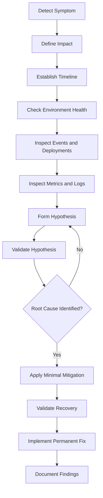
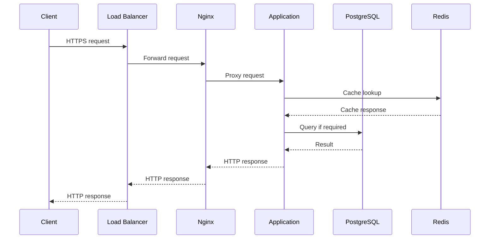
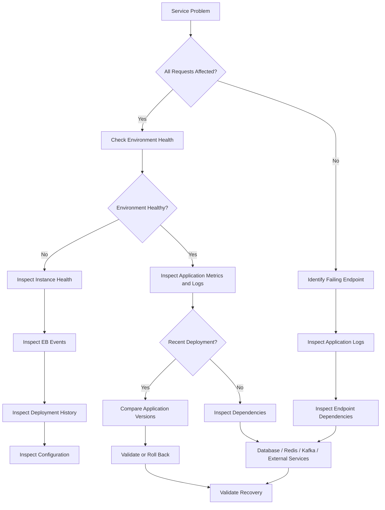

# 01- Troubleshooting Methodology

## Overview

Troubleshooting Amazon Elastic Beanstalk requires a structured approach that separates **symptoms, evidence, hypotheses, and corrective actions**.

An Elastic Beanstalk environment can fail at multiple layers:

```text
Client
  ↓
DNS
  ↓
Load Balancer
  ↓
Elastic Beanstalk Environment
  ↓
EC2 Instances
  ↓
Nginx / Reverse Proxy
  ↓
Application Server
  ↓
Django / FastAPI Application
  ↓
Redis / PostgreSQL / Kafka / External Services
```

A production incident should therefore not begin with random commands or immediate redeployment. The objective is to determine:

- What is failing?
- When did it start?
- Which users or requests are affected?
- Which layer is responsible?
- What changed immediately before the failure?
- Is the failure isolated or systemic?
- What is the safest mitigation?
- How can the fix be made permanent?

A useful troubleshooting lifecycle is:



## Troubleshooting Principles

### Start With Evidence

Do not begin with assumptions such as:

```text
"The application is down, so Django must be broken."
```

Instead establish observable facts:

```text
HTTP 5xx increased at 14:32 UTC.
Environment health changed from Green to Yellow at 14:33 UTC.
Version orders-api-42 was deployed at 14:30 UTC.
Three of six instances report elevated errors.
```

Facts narrow the investigation space.

### Change One Variable at a Time

Changing several components simultaneously makes it difficult to identify the actual cause.

Avoid:

```text
Restart application
Change environment variable
Increase instance size
Modify security group
Redeploy
```

all during the same investigation.

Prefer:

```text
Observe
→ Hypothesize
→ Change one relevant variable
→ Validate
→ Continue
```

### Separate Mitigation From Root Cause

A mitigation restores service.

A root-cause fix prevents recurrence.

For example:

```text
High CPU
    ↓
Temporary scale-out
    ↓
Service recovers
```

The scale-out may be a valid mitigation, but it does not explain why CPU increased.

The permanent investigation may reveal:

```text
New application version
    ↓
Inefficient database query
    ↓
Higher request latency
    ↓
More concurrent requests
    ↓
CPU saturation
```

### Preserve Evidence

Before restarting or replacing infrastructure, collect enough information to support diagnosis.

Useful evidence includes:

- Environment health
- Instance health
- Recent Elastic Beanstalk events
- Application version
- Deployment history
- Configuration changes
- CloudWatch metrics
- Application logs
- Nginx logs
- Load balancer metrics
- Database metrics
- Redis metrics
- External dependency status

## Establish the Scope of the Failure

The first major question is **how much of the system is affected**.

| Scope | Possible indication |
|---|---|
| One request | Application-specific failure |
| One endpoint | Route or dependency problem |
| One instance | Instance-specific issue |
| Multiple instances | Application or environment issue |
| Entire environment | Deployment, configuration, networking, or dependency issue |
| Multiple services | Shared infrastructure or external dependency |
| All users | System-wide availability issue |
| Specific users/regions | Routing, authorization, data, or regional issue |

For example:

```text
GET /healthz       → 200
GET /orders        → 500
GET /users         → 200
```

This is substantially different from:

```text
All endpoints → 500
```

The first suggests an endpoint-specific failure; the second indicates a broader application or infrastructure problem.

## Establish the Timeline

Time correlation is one of the highest-value troubleshooting techniques.

Build a timeline around the incident:

```text
14:10  Normal operation
14:25  New application version deployed
14:27  Latency begins increasing
14:29  HTTP 5xx increases
14:31  Environment health becomes Yellow
14:35  Environment becomes Red
```

Then compare the timeline with:

- Deployments
- Configuration changes
- Scaling events
- Instance replacement
- Database changes
- Redis failures
- External API incidents
- DNS changes
- Certificate changes

A recent change does not automatically prove causality, but it is a strong hypothesis candidate.

## Elastic Beanstalk Health Investigation

Start with:

```bash
eb status
```

This establishes the current environment context.

Then inspect health:

```bash
eb health
```

Look for:

- Environment health
- Instance health
- Request failures
- Latency
- Instance state
- Health transitions

The distinction between environment health and instance health is important.

For example:

```text
Environment: Yellow

Instance A → Green
Instance B → Green
Instance C → Red
Instance D → Green
```

This suggests a potentially isolated instance problem rather than an application-wide failure.

## Inspect Elastic Beanstalk Events

Use:

```bash
eb events
```

Events provide operational context around changes occurring in the environment.

Look for:

- Deployment events
- Instance launches
- Instance termination
- Configuration updates
- Health changes
- Scaling activity
- Failed operations

A useful correlation might look like:

```text
Configuration update
        ↓
Instance replacement
        ↓
Application startup failure
        ↓
Unhealthy instance
        ↓
Environment degradation
```

Events should be correlated with metrics and logs rather than interpreted in isolation.

## Inspect Logs

Retrieve Elastic Beanstalk logs with:

```bash
eb logs
```

Depending on the platform and logging configuration, investigate relevant sources such as:

```text
Application logs
Nginx logs
Application server logs
System logs
Deployment logs
```

For a Python backend, application logs should provide enough context to identify:

- Exceptions
- Request failures
- Database errors
- Redis failures
- External API failures
- Startup errors
- Configuration errors

Avoid logging secrets, authentication tokens, passwords, or sensitive personal information.

## Check CloudWatch Metrics

Elastic Beanstalk CLI output should be correlated with CloudWatch metrics.

Important signals include:

| Signal | Possible problem |
|---|---|
| CPU utilization | CPU-bound application or insufficient capacity |
| Memory utilization | Memory leak or undersized instances |
| Request count | Traffic increase or routing issue |
| HTTP 4xx | Client/authentication/routing issue |
| HTTP 5xx | Application/infrastructure failure |
| Latency | Application or dependency slowdown |
| Disk utilization | Log growth or temporary-file accumulation |
| Network traffic | Traffic anomaly or dependency behavior |

Metrics help answer:

```text
What changed?
When did it change?
How large was the change?
Did it affect all instances?
```

## Application-Level Troubleshooting

Elastic Beanstalk can be healthy while the application is unhealthy.

For example:

```text
Elastic Beanstalk → Green
Load Balancer     → Healthy
EC2 instances     → Healthy
Django API        → /orders returning 500
PostgreSQL        → Connection exhaustion
```

Infrastructure health does not guarantee application correctness.

For Django or FastAPI services, investigate:

- Application exceptions
- Database connectivity
- Connection pools
- Slow queries
- Redis connectivity
- Celery workers
- Kafka consumers
- External API calls
- Authentication failures
- Configuration differences

## Request Lifecycle Analysis

For an HTTP API deployed on Elastic Beanstalk, reason through the request path:



When a request fails, investigate each boundary.

For example:

```text
Client
  ↓
200?
  ↓
Load Balancer
  ↓
Healthy?
  ↓
Nginx
  ↓
502?
  ↓
Application server
  ↓
Running?
  ↓
Django / FastAPI
  ↓
Database
  ↓
Reachable?
```

This prevents treating the entire system as a single component.

## HTTP Status Code Diagnosis

Status codes provide an initial classification.

| Status | Typical troubleshooting direction |
|---|---|
| `400` | Request validation or malformed input |
| `401` | Authentication |
| `403` | Authorization |
| `404` | Routing or resource lookup |
| `408` | Request timeout |
| `429` | Rate limiting or capacity protection |
| `500` | Application failure |
| `502` | Proxy/upstream failure |
| `503` | Service unavailable or unhealthy target |
| `504` | Upstream timeout |

These are signals, not definitive root causes.

For example, a `502` from Nginx may indicate that the application server is unavailable, but the underlying reason could be:

- Application crash
- Startup failure
- Incorrect process configuration
- Port mismatch
- Resource exhaustion
- Deployment issue

## Deployment-Related Failures

A strong initial hypothesis is required when an incident begins immediately after deployment.

Check:

```bash
eb status
eb events
eb appversion
```

Compare:

```text
Previous version
Current version
Deployment time
Incident start time
```

If the incident is strongly correlated with a new version, compare the versions and consider rollback according to the deployment strategy and operational policy.

A rollback should be deliberate rather than automatic guesswork.

## Configuration-Related Failures

Configuration problems are common because the same application may behave differently across environments.

Compare:

```text
Development
Staging
Production
```

Potential differences include:

- Environment variables
- Database endpoints
- Redis endpoints
- AWS region
- IAM permissions
- Security groups
- Subnet configuration
- Application server settings
- Feature flags

Inspect runtime variables when appropriate:

```bash
eb printenv
```

Treat the output as sensitive.

## Database Troubleshooting

When the application reports database failures, determine whether the problem is:

```text
DNS
  ↓
Network
  ↓
Security group
  ↓
Authentication
  ↓
Connection limit
  ↓
Database availability
  ↓
Query performance
```

Common PostgreSQL-related symptoms include:

```text
connection refused
connection timeout
too many connections
authentication failed
statement timeout
deadlock
slow query
```

Do not immediately increase database capacity without understanding the failure mode.

A connection leak, for example, may continue exhausting the new capacity.

## Redis Troubleshooting

For applications using Redis as a cache or session store, investigate:

- Redis availability
- Network connectivity
- Authentication
- Connection limits
- Memory pressure
- Eviction behavior
- Latency
- Application fallback behavior

A critical question is whether Redis is:

```text
Required for correctness
```

or:

```text
Used only as a cache
```

If Redis is only a cache, the application may be able to degrade gracefully.

If Redis is required for session state or distributed coordination, the failure can have a much larger impact.

## Celery Troubleshooting

For asynchronous workloads, distinguish between:

```text
API request succeeds
        ↓
Task queued
        ↓
Task consumed
        ↓
Task executes
        ↓
Task completes
```

A successful API response does not guarantee that the background operation succeeded.

Investigate:

- Queue depth
- Worker availability
- Worker memory
- Task failures
- Retry storms
- Broker connectivity
- Task execution latency

## Kafka Troubleshooting

For Kafka-backed services, investigate:

- Consumer lag
- Consumer health
- Broker availability
- Partition assignment
- Authentication
- Network connectivity
- Message processing failures

A service can appear healthy at the HTTP layer while asynchronous processing is severely delayed.

## Instance-Level Troubleshooting

If one instance appears unhealthy, use:

```bash
eb ssh
```

Then inspect:

```bash
uptime
free -h
df -h
ps aux
ss -lntp
```

Useful questions include:

```text
Is the instance overloaded?
Is memory exhausted?
Is disk full?
Is the application process running?
Is the expected port listening?
```

Do not permanently modify the instance during troubleshooting.

Instance-level changes can disappear when Elastic Beanstalk replaces the instance.

## Networking Troubleshooting

When an application cannot reach a dependency, follow the network path systematically.

```text
Application
    ↓
DNS resolution
    ↓
Route table
    ↓
Security group
    ↓
Network ACL
    ↓
Target endpoint
    ↓
Target service
```

Typical failures include:

- Incorrect hostname
- Incorrect port
- Missing route
- Security group restriction
- Network ACL restriction
- Private subnet routing issue
- NAT configuration issue
- TLS failure

Avoid changing multiple networking controls simultaneously.

## Security Troubleshooting

Security failures may appear as application failures.

Examples:

```text
403 → IAM/authentication/authorization issue
Timeout → Security group/network issue
TLS error → Certificate/trust/configuration issue
Access denied → IAM policy or resource policy
```

Verify:

- IAM role
- Security groups
- Network ACLs
- TLS certificates
- Secrets configuration
- Resource policies
- Application authentication
- AWS region/account context

Do not solve permission issues by blindly granting:

```text
AdministratorAccess
```

Instead identify the exact missing permission and apply least privilege.

## Health Check Troubleshooting

Elastic Beanstalk health checks determine whether instances are suitable for receiving traffic.

A poor health endpoint can create misleading results.

A health endpoint should generally be:

- Fast
- Deterministic
- Lightweight
- Free from unnecessary external dependencies

For example:

```text
GET /healthz
```

can verify application process availability.

A deeper readiness check may verify required dependencies separately:

```text
GET /ready
    ↓
Application ready?
    ↓
Database reachable?
    ↓
Required dependency available?
```

Do not make every health check depend on slow downstream services unless that dependency is genuinely required for serving traffic.

## Common Failure Patterns

| Symptom | Likely investigation |
|---|---|
| Environment Red | Health, events, logs, instances |
| One instance unhealthy | Instance resources, process, local logs |
| All instances unhealthy | Deployment, configuration, application startup |
| HTTP 500 | Application logs, database, dependencies |
| HTTP 502 | Nginx/application server/upstream |
| HTTP 503 | Health checks, capacity, unavailable application |
| HTTP 504 | Application or dependency latency |
| Sudden latency increase | Database, external API, CPU, network |
| Deployment fails | EB events, application startup, platform logs |
| Application cannot reach DB | DNS, networking, security groups, credentials |
| Redis failures | Connectivity, memory, authentication, fallback |
| Background tasks delayed | Celery/Kafka worker health and queue/lag |

## Troubleshooting Decision Tree



## Production Incident Workflow

A disciplined incident workflow can be reduced to:

```text
Detect
  ↓
Scope
  ↓
Timeline
  ↓
Observe
  ↓
Hypothesize
  ↓
Validate
  ↓
Mitigate
  ↓
Verify
  ↓
Fix
  ↓
Document
```

### Detect

Identify the initial symptom through:

- Monitoring
- Alerts
- Logs
- User reports
- Synthetic checks
- Health checks

### Scope

Determine:

- Number of users affected
- Affected endpoints
- Affected regions
- Affected instances
- Affected dependencies

### Timeline

Identify:

- First observed failure
- First metric anomaly
- Recent deployment
- Recent configuration change
- Recent infrastructure change

### Observe

Collect:

```bash
eb status
eb health
eb events
eb logs
```

Then correlate with CloudWatch and application telemetry.

### Hypothesize

Examples:

```text
Recent deployment caused startup failure.
```

or:

```text
Database connection exhaustion caused request failures.
```

### Validate

Use targeted evidence to test the hypothesis.

Do not make a change merely because it might help.

### Mitigate

Choose the smallest safe action that restores service.

Possible mitigations include:

- Rollback
- Scaling
- Traffic reduction
- Configuration correction
- Instance replacement
- Dependency failover

### Verify

Confirm that:

- Error rate decreased
- Latency recovered
- Health returned to normal
- Application behavior is correct
- Background processing recovered

### Fix

Implement the permanent correction in:

- Application code
- Infrastructure configuration
- CI/CD
- Monitoring
- Architecture
- Operational procedures

### Document

Capture:

- Root cause
- Impact
- Timeline
- Mitigation
- Permanent fix
- Preventive action

## Common Troubleshooting Mistakes

### Restarting Before Collecting Evidence

Restarting an application can remove useful evidence and hide the original failure.

Collect relevant logs and metrics first unless immediate service restoration requires otherwise.

### Assuming the Most Recent Change Is the Root Cause

A deployment immediately preceding an incident is a strong hypothesis, not proof.

Validate the relationship.

### Treating Green Health as Proof of Application Correctness

Elastic Beanstalk health does not validate every business operation.

Application-level monitoring is still required.

### Making Many Changes at Once

Multiple simultaneous changes destroy the ability to establish causality.

Prefer controlled experimentation.

### Using SSH as Configuration Management

Manual instance modifications are not durable.

Fix the deployment or configuration source instead.

### Ignoring Dependencies

An API failure may originate from:

```text
PostgreSQL
Redis
Kafka
External APIs
DNS
IAM
Networking
```

Always inspect the dependency chain.

### Increasing Capacity Without Understanding the Cause

Scaling may temporarily mask:

- Memory leaks
- Connection leaks
- Inefficient queries
- Traffic anomalies
- Retry storms

Capacity changes should be accompanied by root-cause analysis.

### Exposing Secrets During Diagnosis

Avoid sharing:

```bash
eb printenv
```

output or logs containing credentials.

Redact sensitive information before sharing diagnostic evidence.

## Production Troubleshooting Checklist

```text
[ ] Confirm AWS account and region
[ ] Confirm application
[ ] Confirm environment
[ ] Confirm deployed application version
[ ] Establish incident start time
[ ] Determine scope of impact
[ ] Check environment health
[ ] Check instance health
[ ] Review Elastic Beanstalk events
[ ] Review application logs
[ ] Review Nginx/application-server logs
[ ] Review CloudWatch metrics
[ ] Check recent deployments
[ ] Check recent configuration changes
[ ] Check database health
[ ] Check Redis if applicable
[ ] Check Celery/Kafka if applicable
[ ] Check external dependencies
[ ] Validate networking where required
[ ] Validate IAM permissions where required
[ ] Form a specific hypothesis
[ ] Validate the hypothesis
[ ] Apply minimal mitigation
[ ] Verify recovery
[ ] Implement permanent fix
[ ] Document root cause and corrective actions
```

## Interview Traps

### Is `eb health` enough to troubleshoot a production incident?

No. It provides environment and instance health information, but production troubleshooting requires correlation with logs, metrics, events, deployments, configuration, and dependencies.

### What should you check first after a production deployment causes failures?

Establish the timeline and compare the deployed version with the previous known-good version. Inspect:

```bash
eb status
eb events
eb logs
```

Then determine whether the deployment is actually causal.

### Why should you avoid immediately restarting an unhealthy instance?

Restarting may remove evidence required to identify the root cause. If immediate recovery is necessary, collect enough evidence first when operationally possible.

### Why can an Elastic Beanstalk environment be healthy while an API is failing?

Health checks may only validate specific infrastructure or application conditions. Individual endpoints, business operations, and downstream dependencies can still fail.

### How would you investigate a `502` response?

Start by identifying where the `502` originated and then inspect the proxy-to-upstream path:

```text
Load Balancer
    ↓
Nginx
    ↓
Application Server
    ↓
Application
```

Check process availability, listening ports, application logs, Nginx logs, and recent deployments.

### Why is scaling not always a root-cause fix?

Scaling increases available capacity but does not eliminate application defects such as memory leaks, inefficient queries, connection leaks, or retry storms.

### What is the most important troubleshooting principle?

**Use evidence to reduce uncertainty before making changes.**

## Key Takeaways

- Troubleshooting should be systematic rather than command-driven.
- Start by defining the symptom, scope, impact, and timeline.
- Verify the Elastic Beanstalk environment before making production changes.
- Use `eb status`, `eb health`, `eb events`, and `eb logs` as foundational diagnostic tools.
- Correlate Elastic Beanstalk information with CloudWatch metrics and application telemetry.
- Treat recent deployments and configuration changes as hypotheses to validate, not automatic root causes.
- Investigate the complete request path from client to load balancer, Nginx, application server, application, and dependencies.
- Distinguish infrastructure health from application health.
- Investigate PostgreSQL, Redis, Kafka, Celery, DNS, IAM, and networking when they are part of the request or processing path.
- Use SSH for targeted diagnostics, not permanent instance configuration.
- Avoid making multiple production changes simultaneously.
- Separate immediate mitigation from permanent root-cause remediation.
- Preserve evidence before restarting or replacing infrastructure whenever operationally possible.
- Protect secrets and sensitive information during incident investigation.
- Validate recovery using metrics, health checks, logs, and real application behavior.
- A senior engineer's goal is not merely to restore service, but to establish why the failure occurred and reduce the probability of recurrence.