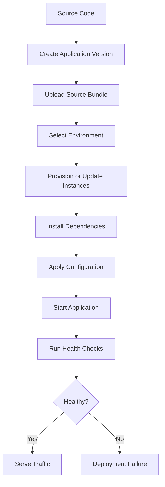
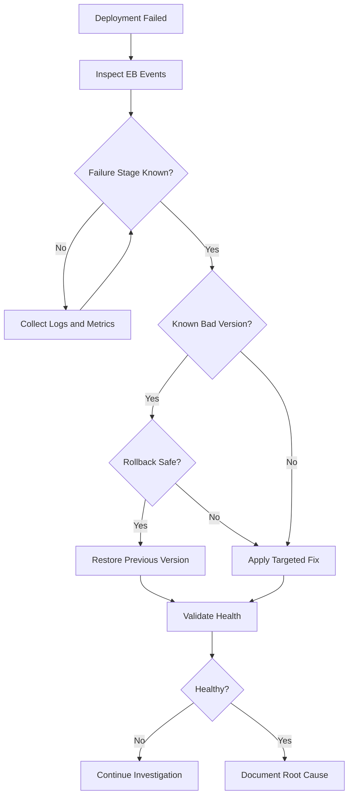

# 02- Deployment Failures

## Overview

Deployment failures in Amazon Elastic Beanstalk occur when a new application version cannot be successfully prepared, deployed, started, or brought into service.

A deployment can fail at several distinct stages:

```text
Application Source
       ↓
Application Version
       ↓
Elastic Beanstalk Deployment
       ↓
EC2 Instance
       ↓
Platform Initialization
       ↓
Dependency Installation
       ↓
Application Startup
       ↓
Health Check
       ↓
Load Balancer Traffic
```

A deployment that uploads successfully is not necessarily a successful deployment. The application must also start correctly, become healthy, and serve traffic as expected.

The most important troubleshooting distinction is:

> **Deployment failure is not one problem. Identify the exact deployment stage that failed before changing anything.**

## Deployment Failure Categories

| Failure category | Typical symptom | Primary investigation |
|---|---|---|
| Source packaging | Missing files or invalid archive | Source bundle and repository |
| Application version | Version cannot be created or selected | EB application versions |
| Platform setup | Platform initialization failure | EB events and instance logs |
| Dependency installation | `pip`, npm, OS package failures | Deployment logs |
| Configuration | Missing or invalid environment variables | EB configuration |
| Application startup | Gunicorn/Uvicorn/Django startup failure | Application logs |
| Health checks | Instances become unhealthy | EB health and application endpoint |
| Networking | Dependencies cannot be reached | VPC, security groups, DNS |
| IAM | Access denied errors | Instance profile and IAM policies |
| Resource exhaustion | OOM, disk full, CPU saturation | CloudWatch and instance metrics |
| Migration | Database migration fails | Application and database logs |
| Platform mismatch | Runtime or dependency incompatibility | EB platform and application dependencies |
| Post-deployment | Deployment completes but application fails | Health, logs, metrics |

## Deployment Lifecycle

A useful mental model is to treat an Elastic Beanstalk deployment as a pipeline.



The investigation should identify the first failed stage rather than focusing only on the final `Failed` status.

## First Response Checklist

When a deployment fails, establish the current state before making changes.

```bash
eb status
eb health
eb events
```

Then inspect the application versions:

```bash
eb appversion
```

Retrieve logs:

```bash
eb logs
```

A useful initial sequence is:

```text
1. Confirm the environment.
2. Confirm the deployed application version.
3. Identify when the deployment started.
4. Identify the first deployment error.
5. Inspect deployment and application logs.
6. Compare with the previous known-good version.
7. Determine whether the failure is application, configuration, platform, infrastructure, or dependency related.
8. Apply the smallest safe corrective action.
9. Validate health after remediation.
```

## Inspect Elastic Beanstalk Events

Elastic Beanstalk events are usually the first high-value source of deployment information.

```bash
eb events
```

Look for:

- Deployment start
- Deployment completion
- Deployment failure
- Instance replacement
- Configuration changes
- Health transitions
- Application startup errors
- Failed commands
- Platform provisioning errors

For example:

```text
14:20  Updating environment
14:21  Deploying application version api-42
14:22  Instance command failed
14:22  Application failed to start
14:23  Environment health changed to Red
```

The first meaningful error is generally more valuable than the final failure message.

## Inspect the Application Version

Verify which version is being deployed:

```bash
eb appversion
```

A common production mistake is troubleshooting the wrong artifact.

Establish:

```text
Environment
    ↓
Currently deployed version
    ↓
Version being deployed
    ↓
Source commit
```

Maintain traceability between:

- Git commit
- CI/CD build
- Elastic Beanstalk application version
- Production deployment

For example:

```text
Git commit:
a91f6c2

CI build:
backend-api-2026.08.13.1420

Elastic Beanstalk version:
backend-api-1420
```

This makes deployment failures significantly easier to correlate.

## Source Bundle Problems

Elastic Beanstalk deploys an application source bundle. Incorrect packaging can cause deployment failures before the application even starts.

Common problems include:

- Missing application files
- Incorrect directory nesting
- Missing `requirements.txt`
- Missing `Procfile`
- Missing platform configuration
- Incorrect file paths
- Unintentionally included development files
- Incorrect archive structure

A problematic archive may look like:

```text
application.zip
└── project/
    ├── manage.py
    └── requirements.txt
```

when the deployment expects:

```text
application.zip
├── manage.py
├── requirements.txt
└── project/
```

Always inspect the generated artifact before deploying it.

## Python Dependency Failures

Python applications frequently fail during dependency installation.

Typical errors include:

```text
Could not build wheels
No matching distribution found
ModuleNotFoundError
Compilation failed
```

Investigate:

- Python runtime version
- Package versions
- Native dependencies
- `requirements.txt`
- Platform compatibility
- Architecture compatibility
- Build tooling

For example, a package may work locally with:

```text
Python 3.12
```

but fail on an environment running:

```text
Python 3.11
```

The dependency set and Elastic Beanstalk platform should be intentionally aligned.

### Dependency Best Practice

Pin production dependencies where appropriate:

```text
Django==5.2.3
gunicorn==23.0.0
psycopg[binary]==3.2.9
redis==6.4.0
```

Avoid relying on uncontrolled dependency upgrades during production deployment.

## Application Startup Failures

A deployment can successfully install dependencies and still fail when the application starts.

For Django:

```text
Gunicorn
    ↓
Django WSGI application
    ↓
Application initialization
```

For FastAPI:

```text
Gunicorn/Uvicorn
    ↓
FastAPI application
    ↓
Application initialization
```

Typical startup errors include:

```text
ModuleNotFoundError
ImportError
ImproperlyConfigured
SyntaxError
Invalid environment variable
Database configuration error
Port binding failure
```

Inspect the application logs before modifying infrastructure.

## Process Configuration

Incorrect process configuration is a common cause of startup failures.

A Django deployment might use:

```text
gunicorn config.wsgi:application
```

A FastAPI deployment might use:

```text
gunicorn -k uvicorn.workers.UvicornWorker app.main:app
```

The exact command must match the actual project structure.

For example, if the project contains:

```text
src/
└── api/
    └── main.py
```

then an incorrect module reference can cause:

```text
ModuleNotFoundError
```

Verify:

- Module path
- Working directory
- Application object
- Python path
- Process command
- Listening port

## Environment Variable Failures

Applications frequently depend on environment-specific configuration.

Examples include:

```text
DATABASE_URL
REDIS_URL
SECRET_KEY
AWS_REGION
DJANGO_SETTINGS_MODULE
```

A deployment may succeed in staging but fail in production because a required variable is missing or malformed.

Inspect configuration carefully:

```bash
eb printenv
```

Do not expose its output in tickets, chat messages, logs, or documentation if it contains secrets.

Common symptoms include:

```text
KeyError
ImproperlyConfigured
Connection refused
Authentication failed
```

Treat configuration as part of the deployment artifact even when the values themselves are stored outside source control.

## Configuration File Failures

Elastic Beanstalk configuration files can alter deployment behavior.

Common locations include:

```text
.ebextensions/
.platform/
```

Failures can result from:

- Invalid YAML
- Incorrect paths
- Unsupported commands
- Incorrect permissions
- Shell command failures
- Incorrect platform assumptions
- Configuration ordering issues

A configuration command that works locally is not necessarily valid in the Elastic Beanstalk instance environment.

Keep platform configuration:

- Minimal
- Version-controlled
- Explicit
- Tested
- Environment-appropriate

## Deployment Hooks

Elastic Beanstalk supports platform hooks that can execute commands during deployment.

Typical lifecycle stages include:

```text
prebuild
    ↓
build
    ↓
postbuild
    ↓
predeploy
    ↓
postdeploy
```

Use hooks carefully for operations such as:

- Collecting static files
- Installing application-specific components
- Running controlled deployment commands
- Preparing runtime configuration

A failing hook can cause the deployment to fail even though the application itself is valid.

Avoid placing fragile or unnecessary operations in deployment hooks.

## Database Migration Failures

Database migrations deserve special attention because they can fail independently of application startup.

A deployment might execute:

```text
Deploy application
    ↓
Run migrations
    ↓
Migration fails
    ↓
Deployment fails
```

Possible causes include:

- Database unavailable
- Invalid credentials
- Missing permissions
- Long-running migration
- Migration conflict
- Existing schema mismatch
- Lock contention
- Incompatible application/database state

For production systems, avoid treating schema migration as an incidental side effect of application startup.

Prefer an explicit migration strategy with:

- Backward-compatible schema changes
- Controlled execution
- Migration observability
- Rollback planning
- Separation of application and schema rollout when required

## Health Check Failures

A deployment may complete technically but fail because instances do not become healthy.

Investigate:

```bash
eb health
```

Common causes include:

- Application process not running
- Incorrect port
- Incorrect health endpoint
- Startup takes too long
- Application returns `5xx`
- Database unavailable
- Dependency failure
- Security group/network issue
- Resource exhaustion

The health check path should be intentional.

For example:

```text
GET /healthz
```

should generally be lightweight and deterministic.

Do not make the health endpoint perform expensive database queries or external API calls unless that dependency is genuinely part of application readiness.

## Port and Listener Problems

A common deployment failure is a mismatch between:

```text
Load Balancer
    ↓
Nginx
    ↓
Application server
```

and the ports configured by the application.

Investigate:

```bash
ss -lntp
```

Look for:

- Expected listener
- Process bound to the expected port
- Incorrect bind address
- Port conflicts

A process bound only to:

```text
127.0.0.1
```

may behave differently from one bound to:

```text
0.0.0.0
```

depending on the proxy architecture.

## Nginx and Reverse Proxy Failures

If Nginx is part of the environment, investigate both sides of the proxy boundary.

```text
Client
  ↓
Load Balancer
  ↓
Nginx
  ↓
Gunicorn/Uvicorn
  ↓
Django/FastAPI
```

Typical errors:

```text
502 Bad Gateway
503 Service Unavailable
504 Gateway Timeout
```

Investigate:

- Nginx configuration
- Upstream address
- Upstream port
- Application process
- Application startup logs
- Timeout settings
- File permissions

A `502` is a symptom of an upstream communication failure, not necessarily an Nginx configuration problem.

## IAM Failures

Elastic Beanstalk instances require IAM permissions for AWS operations performed by the application or platform.

A deployment may fail with:

```text
AccessDenied
UnauthorizedOperation
```

Investigate:

- EC2 instance profile
- Elastic Beanstalk service role
- IAM policies
- Resource policies
- AWS account
- AWS region

Do not fix IAM failures by attaching broad administrative permissions.

Determine the exact required action and apply least privilege.

## Networking Failures

A deployment may fail because the application cannot reach required dependencies.

Typical dependency flow:

```text
Elastic Beanstalk EC2
        ↓
VPC routing
        ↓
Security Group
        ↓
Network ACL
        ↓
Database / Redis / External Service
```

Investigate:

- DNS resolution
- Route tables
- Security groups
- Network ACLs
- NAT gateway
- Subnet placement
- Destination port
- TLS configuration

For private resources, verify that the Elastic Beanstalk instances are placed in subnets with appropriate routes and security controls.

## Resource Exhaustion During Deployment

Deployment itself consumes resources.

Potential problems include:

- High CPU
- Insufficient memory
- Disk exhaustion
- Large source bundles
- Expensive build steps
- Excessive parallel processes

Useful instance diagnostics include:

```bash
free -h
df -h
uptime
ps aux
```

CloudWatch metrics should be used to determine whether resource exhaustion is isolated or systemic.

### Memory Exhaustion

A Python application may consume more memory during:

```text
Dependency installation
Application startup
Static file collection
Database migration
Worker initialization
```

than during normal request processing.

If an instance repeatedly reaches memory limits during deployment, increasing instance size may help, but first determine what is consuming memory.

## Deployment Strategy Matters

Different deployment strategies have different failure characteristics.

| Strategy | Failure isolation | Downtime risk | Operational complexity |
|---|---|---|---|
| All at once | Low | Higher | Low |
| Rolling | Medium | Lower | Medium |
| Rolling with additional batch | Higher | Lower | Medium |
| Immutable | High | Low | Higher |
| Traffic splitting | High | Low | Higher |

The appropriate strategy depends on:

- Application architecture
- Deployment frequency
- Rollback requirements
- Cost constraints
- Availability requirements
- Database compatibility

For critical production systems, deployment strategy should be designed around failure containment rather than merely deployment speed.

## Rollback Strategy

When a new version is confirmed to be defective, rollback may be the safest mitigation.

The key principle is:

```text
Known-good version
       ↓
Production
       ↓
Known-bad version
       ↓
Failure
       ↓
Restore known-good version
```

Do not assume rollback is always safe.

Database schema changes can make application rollback difficult.

For example:

```text
Version A
    ↓
Adds database column
    ↓
Version B deployed
    ↓
Migration changes schema
    ↓
Version B fails
```

Rolling the application back to Version A may fail if Version A cannot operate against the changed schema.

This is why production database changes should generally be backward compatible.

## Failed Deployment With Partial Success

A deployment can leave an environment in a mixed state.

For example:

```text
Instance A → New version
Instance B → New version
Instance C → Previous version
Instance D → Previous version
```

This creates additional debugging complexity.

Check:

```bash
eb health
eb events
```

and verify the actual version running on instances where possible.

Mixed-version behavior is particularly dangerous when:

- API contracts changed
- Database schema changed
- Shared cache format changed
- Kafka message formats changed
- Session formats changed

Backward compatibility is therefore important during rolling deployments.

## Deployment Failure Investigation Matrix

| Symptom | Likely cause | First checks |
|---|---|---|
| Upload fails | Source/package issue | Source bundle |
| Version creation fails | Artifact/configuration | `eb appversion` |
| Dependency installation fails | Runtime/package issue | Deployment logs |
| Application won't start | Process/import/config | Application logs |
| `502` | Upstream failure | Nginx + app logs |
| `503` | Health/capacity issue | `eb health` |
| `504` | Timeout | App + dependency latency |
| Migration fails | Database/schema issue | DB + migration logs |
| Access denied | IAM | Instance/service roles |
| Cannot reach DB | Networking/auth | DNS, SG, routes, credentials |
| Disk full | Logs/build artifacts | `df -h` |
| OOM | Memory pressure | CloudWatch + `free -h` |
| Health turns Red | Application/instance failure | `eb health`, events, logs |
| Deployment succeeds but users fail | Post-deployment application issue | Metrics + endpoint logs |

## Production Troubleshooting Procedure

Use the following sequence for a failed production deployment.

### Establish Environment State

```bash
eb status
eb health
```

### Inspect Deployment Events

```bash
eb events
```

Identify the first meaningful failure.

### Inspect Versions

```bash
eb appversion
```

Determine:

```text
Current version
Previous version
Target version
```

### Retrieve Logs

```bash
eb logs
```

Inspect:

```text
Deployment logs
Application logs
Nginx logs
System logs
```

### Compare Configuration

```bash
eb printenv
```

Check for:

- Missing variables
- Incorrect endpoints
- Incorrect environment-specific values
- Configuration drift

### Validate Application Startup

Check:

- Process command
- Python module path
- Gunicorn/Uvicorn configuration
- Listening port
- Application imports

### Validate Dependencies

Check:

```text
PostgreSQL
Redis
Kafka
Celery broker
External APIs
AWS services
```

### Validate Health

```bash
eb health
```

Confirm that instances become healthy and traffic is being served normally.

## Safe Mitigation Strategy

During a production incident, prioritize service restoration while preserving evidence.

A typical decision tree is:



The safest action depends on the failure mode.

## Common Mistakes

### Looking Only at the Final Error

The final event may say:

```text
Environment update failed
```

That is rarely enough to identify the root cause.

Find the first actionable failure.

### Rebuilding Everything Without Investigation

Repeated deployments can:

- Waste time
- Overwrite evidence
- Introduce additional variables
- Increase production risk

Diagnose first.

### Treating a Successful Upload as a Successful Deployment

Uploading a source bundle does not prove:

- Dependencies installed
- Application started
- Health checks passed
- Traffic is working

### Ignoring Platform Compatibility

A dependency can be valid for one Python/platform version and invalid for another.

Always verify runtime compatibility.

### Running Destructive Database Operations During a Deployment

Commands such as destructive schema changes can make rollback difficult.

Use controlled database migration practices.

### Manually Fixing a Single Instance

A manual fix may disappear when Elastic Beanstalk replaces the instance.

Make durable changes through:

- Source code
- Configuration
- Platform hooks
- Infrastructure configuration
- CI/CD

### Increasing Instance Size Without Investigation

Larger instances can hide resource problems without fixing:

- Memory leaks
- Inefficient builds
- Excessive worker counts
- Large migrations
- Unbounded application memory

## Production Best Practices

### Maintain a Known-Good Version

Always know which application version is currently considered safe.

### Make Deployments Traceable

Connect:

```text
Git commit
    ↓
CI build
    ↓
Artifact
    ↓
Elastic Beanstalk version
    ↓
Environment
```

### Test the Exact Artifact

The artifact tested by CI should be as close as possible to the artifact deployed to production.

### Keep Configuration Version-Controlled

Do not allow undocumented manual changes to become part of production state.

### Use Backward-Compatible Database Changes

Prefer:

```text
Expand
  ↓
Deploy compatible application
  ↓
Migrate data
  ↓
Switch behavior
  ↓
Contract
```

rather than changes that require application and database rollback to happen simultaneously.

### Monitor Deployment Health

Deployment monitoring should include:

- Error rate
- Latency
- HTTP status codes
- Instance health
- CPU
- Memory
- Request volume
- Application logs

### Design for Rollback

A rollback strategy should be defined before an incident.

Consider:

- Application version compatibility
- Database schema compatibility
- Cache compatibility
- Message compatibility
- External API compatibility

## Interview Traps

### Does a failed deployment always mean the application code is wrong?

No. Deployment failures can originate from:

- Packaging
- Dependencies
- Configuration
- IAM
- Networking
- Platform compatibility
- Infrastructure
- Health checks
- Database migrations

### Why can a deployment succeed while the application remains unavailable?

Because deployment completion does not necessarily mean that the application is healthy and serving traffic correctly.

### Why are database migrations dangerous during deployment?

Because application rollback may not be compatible with the changed database schema.

### Why is the first deployment error important?

Later errors can be cascading symptoms of the original failure.

### Why can a rolling deployment create inconsistent behavior?

Different instances may temporarily run different application versions. This can cause compatibility problems when APIs, schemas, caches, or message formats change.

### What is the safest general troubleshooting strategy?

Identify the failed stage, collect evidence, form a hypothesis, apply the smallest safe mitigation, validate recovery, and implement a durable fix.

## Key Takeaways

- Elastic Beanstalk deployment failures can occur during packaging, provisioning, dependency installation, configuration, startup, health checks, or post-deployment traffic handling.
- Always identify the exact stage that failed before changing infrastructure or code.
- Start with `eb status`, `eb health`, `eb events`, `eb appversion`, and `eb logs`.
- The first meaningful deployment error is usually more valuable than the final environment failure message.
- Verify the exact application version and source artifact involved in the deployment.
- Python dependency failures commonly result from runtime, package, native-library, or platform incompatibilities.
- Application startup failures commonly involve import paths, process configuration, environment variables, or dependency connectivity.
- Health-check failures do not necessarily mean that the application code itself is invalid.
- `502`, `503`, and `504` responses should be traced through the load balancer, Nginx, application server, application, and downstream dependencies.
- IAM and networking problems can appear as application deployment failures.
- Database migrations must be designed with rollback and backward compatibility in mind.
- Rolling deployments can temporarily create mixed-version environments, making backward-compatible APIs, schemas, caches, and messages important.
- Manual fixes on individual instances are not durable.
- Scaling may mitigate resource exhaustion but does not necessarily solve the underlying cause.
- Production deployment strategies should prioritize failure isolation, observability, and safe rollback.
- A successful deployment is not complete until the application is healthy and serving expected traffic.