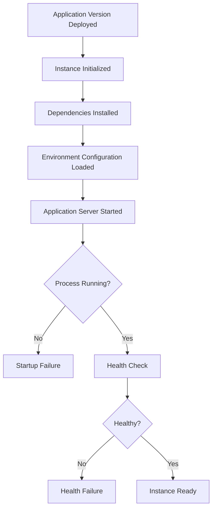
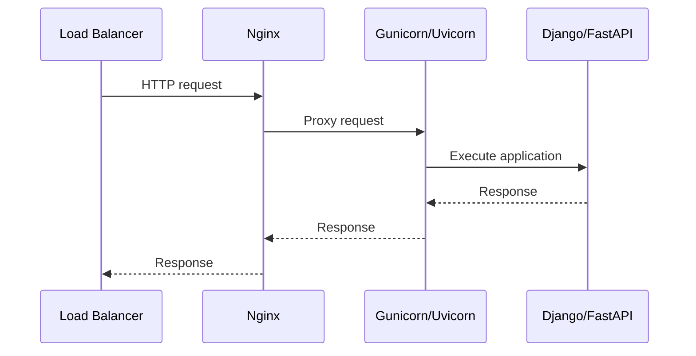

# 03- Application Startup Failures

## Overview

Application startup failures occur when an Elastic Beanstalk instance successfully receives an application version but the application process cannot initialize and remain available.

A deployment can therefore progress through source upload, instance provisioning, and dependency installation while still failing at the application startup stage.

Typical startup flow:

```text
Elastic Beanstalk
       ↓
EC2 Instance
       ↓
Platform Initialization
       ↓
Application Dependencies
       ↓
Process Configuration
       ↓
Gunicorn / Uvicorn / Application Server
       ↓
Django / FastAPI Application
       ↓
Health Check
       ↓
Healthy Instance
```

Startup failures are particularly important because they often appear as secondary symptoms:

- `502 Bad Gateway`
- `503 Service Unavailable`
- Failed health checks
- Repeated instance replacement
- Deployment timeout
- Environment health changing to `Red`
- Application process repeatedly restarting

The investigation should focus on **why the application process failed to become healthy**, rather than treating the load balancer or Elastic Beanstalk itself as the root cause.

## Startup Failure Lifecycle

A useful troubleshooting model is:



A failure can originate at any stage between dependency installation and successful health validation.

## Common Startup Failure Categories

| Category | Typical symptom | Primary cause |
|---|---|---|
| Import failure | `ModuleNotFoundError` | Incorrect module path or missing dependency |
| Configuration failure | `ImproperlyConfigured` | Missing or invalid environment variable |
| Process command failure | Process exits immediately | Incorrect startup command |
| Port failure | Health check cannot connect | Incorrect listener or port |
| Database failure | Application exits during initialization | Database unavailable or authentication failure |
| Redis failure | Startup dependency error | Redis unreachable or misconfigured |
| Permission failure | Permission denied | File or process permissions |
| Runtime mismatch | Application crashes immediately | Unsupported Python/runtime version |
| Migration failure | Startup/deployment fails | Database schema problem |
| Static file failure | Application initialization fails | Incorrect collection/configuration |
| Memory failure | Process killed | Insufficient memory |
| Native dependency failure | Import/build error | Missing OS-level dependency |
| Nginx failure | `502`/`503` | Upstream process unavailable |
| Health-check failure | Instance unhealthy | Incorrect endpoint or application response |

## First Response Checklist

Start by determining whether the failure is actually an application startup failure.

```bash
eb status
eb health
eb events
```

Then retrieve logs:

```bash
eb logs
```

Inspect the application version:

```bash
eb appversion
```

Check environment configuration:

```bash
eb printenv
```

Do not blindly restart or redeploy the environment before inspecting the available evidence.

A useful first-pass sequence is:

```text
1. Identify the affected environment.
2. Identify the deployed application version.
3. Inspect Elastic Beanstalk events.
4. Inspect application and deployment logs.
5. Determine whether the process starts.
6. Determine whether the process remains running.
7. Determine whether the process listens on the expected port.
8. Determine whether health checks succeed.
9. Inspect downstream dependencies.
10. Apply the smallest safe remediation.
```

## Inspect Elastic Beanstalk Events

Elastic Beanstalk events provide the deployment-level timeline.

```bash
eb events
```

Look for messages related to:

- Application startup
- Process termination
- Failed commands
- Health transitions
- Instance replacement
- Deployment timeout
- Configuration changes
- Platform initialization

For example:

```text
Updating environment
Deploying application version api-42
Application deployment completed
Application failed to start
Environment health changed to Red
```

The important question is:

> What happened immediately before the application became unhealthy?

## Retrieve Application Logs

Application logs are usually the highest-value source for startup failures.

```bash
eb logs
```

Depending on the platform and configuration, investigate:

- Application logs
- Web server logs
- Deployment logs
- System logs
- Platform logs

Look for:

```text
Traceback
ModuleNotFoundError
ImportError
SyntaxError
ImproperlyConfigured
PermissionError
ConnectionError
TimeoutError
```

The first Python exception in the startup sequence is often more useful than later errors caused by the failed initialization.

## SSH Into an Instance

When logs are insufficient, inspect the running instance directly.

```bash
eb ssh
```

Once connected, inspect processes:

```bash
ps aux
```

Check listening ports:

```bash
ss -lntp
```

Check memory:

```bash
free -h
```

Check disk:

```bash
df -h
```

Check system uptime and load:

```bash
uptime
```

These commands help distinguish application-level failures from instance-level resource problems.

## Process Startup Failures

The application server must successfully start and remain running.

For a Django application, a typical process might be:

```text
Gunicorn
   ↓
Django WSGI application
```

For FastAPI:

```text
Gunicorn/Uvicorn
   ↓
FastAPI ASGI application
```

A process command can be syntactically valid but point to the wrong module.

For example:

```bash
gunicorn config.wsgi:application
```

requires a project structure compatible with:

```text
config/
└── wsgi.py
```

If the actual structure is:

```text
src/
└── config/
    └── wsgi.py
```

the Python import path and working directory must be configured accordingly.

## Django Startup Failures

Django applications commonly fail during initialization because of:

- Incorrect `DJANGO_SETTINGS_MODULE`
- Incorrect WSGI module
- Missing Python dependency
- Invalid settings
- Missing environment variables
- Database connection failures
- Incorrect installed applications
- Invalid middleware configuration
- Syntax/import errors

Typical errors include:

```text
ModuleNotFoundError
django.core.exceptions.ImproperlyConfigured
ImportError
django.db.utils.OperationalError
```

Verify the startup chain:

```text
Gunicorn
   ↓
wsgi.py
   ↓
settings.py
   ↓
INSTALLED_APPS
   ↓
Middleware
   ↓
Application initialization
```

A failure anywhere in this chain can prevent the process from becoming healthy.

## FastAPI Startup Failures

FastAPI applications commonly fail because of:

- Incorrect ASGI module path
- Incorrect application object
- Missing dependencies
- Invalid Pydantic configuration
- Database initialization failures
- Redis connection failures
- Import errors

A typical startup command might be:

```bash
gunicorn \
  -k uvicorn.workers.UvicornWorker \
  app.main:app
```

This assumes:

```text
app/
└── main.py
```

contains:

```python
from fastapi import FastAPI

app = FastAPI()
```

If the module or object name differs, the process may terminate immediately.

## Import Errors

Import failures are among the most common Python startup problems.

Example:

```text
ModuleNotFoundError: No module named 'application'
```

Investigate:

- Application directory
- Python working directory
- `PYTHONPATH`
- Package structure
- Installed dependencies
- Case-sensitive paths
- Deployment artifact structure

Verify that the deployed source bundle contains the expected modules.

A local development environment can hide packaging problems because the developer's shell may have additional paths or installed packages that are absent from Elastic Beanstalk.

## Dependency Failures

A successful local startup does not guarantee that production can start.

Compare:

```text
Local Python runtime
Production Python runtime
```

and:

```text
Local dependencies
Production dependencies
```

Check the production dependency file:

```text
requirements.txt
```

For production applications, pin important dependencies:

```text
Django==5.2.3
gunicorn==23.0.0
fastapi==0.116.1
```

The exact versions should match the tested application environment.

## Environment Variable Failures

Applications frequently fail before serving the first request because required configuration is missing.

Examples:

```text
SECRET_KEY
DATABASE_URL
REDIS_URL
DJANGO_SETTINGS_MODULE
AWS_REGION
```

Inspect configured environment variables:

```bash
eb printenv
```

Never expose secrets from this output in logs, tickets, documentation, or chat.

A typical Django failure might be:

```text
django.core.exceptions.ImproperlyConfigured:
The SECRET_KEY setting must not be empty.
```

The underlying problem is configuration, not Elastic Beanstalk.

## Configuration Precedence

Startup behavior can depend on several configuration sources:

```text
Application Code
      ↓
Environment Variables
      ↓
Elastic Beanstalk Configuration
      ↓
Platform Defaults
      ↓
Operating System
```

A production startup problem can occur when a value expected locally is not present in the Elastic Beanstalk environment.

Keep configuration explicit and avoid hidden dependencies on local shell configuration.

## Database Connection Failures

Applications should not assume that the database is always reachable during startup.

Typical errors include:

```text
connection refused
authentication failed
timeout
could not translate host name
```

Investigate:

- Database hostname
- Database port
- Credentials
- Security groups
- Subnet routing
- DNS resolution
- TLS configuration
- Database availability

A useful dependency path is:

```text
Elastic Beanstalk Instance
        ↓
VPC Routing
        ↓
Security Group
        ↓
PostgreSQL
```

For a PostgreSQL-backed Django application, the application process may start but fail during initialization or the first database operation.

## Redis Connection Failures

Redis is frequently used for:

- Caching
- Sessions
- Celery
- Rate limiting
- Distributed locks

A startup dependency on Redis can cause the entire application to fail if Redis is unavailable.

Prefer lazy initialization for non-critical dependencies where possible.

For example:

```text
Application startup
      ↓
Start successfully
      ↓
Redis unavailable
      ↓
Cache operations degrade gracefully
```

is often more resilient than:

```text
Application startup
      ↓
Connect to Redis
      ↓
Redis unavailable
      ↓
Process exits
```

The correct choice depends on whether Redis is a hard dependency for application correctness.

## Celery and Worker Startup

If Celery workers are deployed alongside the backend, investigate them independently.

```text
Web Process
    ↓
Django / FastAPI

Celery Worker
    ↓
Redis / Broker
```

A web application can be healthy while Celery workers are failing.

Do not treat worker failure as an application web-process startup failure unless the web application explicitly depends on the worker during initialization.

Check:

- Worker command
- Broker URL
- Redis connectivity
- Python dependencies
- Worker concurrency
- IAM/network permissions

## Port and Binding Failures

The application must listen where the platform expects it to listen.

Inspect active listeners:

```bash
ss -lntp
```

A process listening on:

```text
127.0.0.1
```

is different from one listening on:

```text
0.0.0.0
```

depending on the proxy architecture.

Verify:

- Application server port
- Nginx upstream port
- Elastic Beanstalk proxy configuration
- Process bind address
- Health-check configuration

A port mismatch can result in:

```text
502 Bad Gateway
503 Service Unavailable
```

even when the application process itself appears to be running.

## Nginx and Application Server Failures

A typical request path may be:



If the application server fails to start:

```text
Load Balancer
      ↓
Nginx
      ↓
X upstream unavailable
```

The resulting `502` is a symptom of the failed upstream process.

Check both Nginx and application logs before changing Nginx configuration.

## Health Check Failures

A process can be running while the instance remains unhealthy.

For example:

```text
Gunicorn → Running
Nginx → Running
Health endpoint → 500
```

The instance can still be considered unhealthy.

Inspect:

```bash
eb health
```

Investigate:

- Health endpoint
- HTTP status
- Response time
- Application startup time
- Database availability
- Dependency availability
- Load balancer configuration

A health endpoint should normally be lightweight.

For example:

```text
GET /healthz
```

should not perform expensive operations unnecessarily.

## Startup Timeout Problems

Some applications take longer to initialize because they perform:

- Database migrations
- Large configuration loading
- Cache warming
- Model loading
- Static asset processing
- External service initialization

Long startup times can cause deployment or health-check timeouts.

Measure actual startup time rather than arbitrarily increasing timeouts.

A better architecture is often:

```text
Fast application initialization
        ↓
Application becomes ready
        ↓
Background initialization
```

for operations that do not need to block request serving.

## Database Migrations During Startup

Running migrations automatically as part of application startup can create deployment problems.

For example:

```text
Instance starts
    ↓
Application runs migrations
    ↓
Migration takes 5 minutes
    ↓
Health check times out
    ↓
Instance considered unhealthy
```

It can also cause concurrency problems when multiple instances start simultaneously.

For production systems, prefer controlled migration execution when migrations are:

- Long-running
- Lock-heavy
- Destructive
- Data-intensive
- Incompatible with rolling deployments

## Static Files and Startup

Django applications may require static assets to be collected during deployment.

A failure such as:

```text
Permission denied
No space left on device
Missing package
Invalid storage configuration
```

can prevent the deployment from completing.

Keep static collection deterministic and avoid expensive work during every instance startup.

## File Permission Failures

Linux permissions can differ between local development and production.

Inspect:

```bash
ls -la
```

and:

```bash
namei -l /path/to/file
```

Common problems include:

- Application user cannot read files
- Process cannot write temporary files
- Nginx cannot access static files
- Startup script is not executable

Avoid solving permission problems with:

```bash
chmod -R 777
```

Use the smallest required permission change.

## Runtime Version Mismatch

A runtime mismatch can cause immediate startup failure.

For example:

```text
Application tested with Python 3.12
        ↓
Elastic Beanstalk platform uses Python 3.11
        ↓
Dependency incompatible
        ↓
Application fails to start
```

Verify the runtime available on the instance:

```bash
python --version
```

and:

```bash
which python
```

Also verify:

```bash
pip --version
```

The Python interpreter and installed packages must correspond to the runtime expected by the application.

## Native Dependency Failures

Some Python packages require operating-system libraries.

Examples include packages involving:

- PostgreSQL
- MySQL
- Cryptography
- Image processing
- Scientific computing

A package may install locally because the developer's machine already has the required native libraries.

Elastic Beanstalk may not have them available.

Typical symptoms:

```text
error: command failed
fatal error: header.h: No such file
unable to build wheel
```

Treat native dependencies as part of the deployment platform requirements.

## Memory Exhaustion

An application may be killed during startup if it consumes too much memory.

Inspect:

```bash
free -h
```

and:

```bash
ps aux --sort=-%mem | head
```

Potential causes include:

- Excessive Gunicorn workers
- Large in-memory datasets
- Model loading
- Cache initialization
- Memory leaks
- Multiple processes starting simultaneously

For Python applications, worker count should be based on measured workload and available memory, not a copied formula.

## Disk Exhaustion

Startup can fail when the instance has insufficient disk space.

Inspect:

```bash
df -h
```

Find large directories:

```bash
sudo du -xhd1 /var | sort -h
```

Potential causes include:

- Large logs
- Temporary files
- Build artifacts
- Dependency caches
- Core dumps
- Application-generated files

Disk exhaustion can cause apparently unrelated errors such as failed logging, package installation, or application initialization.

## Startup Failure Diagnostic Matrix

| Symptom | Likely cause | First check |
|---|---|---|
| `ModuleNotFoundError` | Missing package/module | Application structure and dependencies |
| `ImportError` | Dependency/runtime issue | Installed packages |
| `ImproperlyConfigured` | Configuration | Environment variables |
| `Connection refused` | Dependency unavailable | Network and service |
| `502` | Upstream unavailable | Nginx + app process |
| `503` | Instance/application unhealthy | `eb health` |
| Process exits immediately | Startup exception | Application logs |
| Port not listening | Process/bind configuration | `ss -lntp` |
| Health check timeout | Slow startup or endpoint | Health endpoint and startup timing |
| `Permission denied` | File permissions | `ls -la` |
| OOM kill | Memory pressure | `free -h`, CloudWatch |
| `No space left on device` | Disk exhaustion | `df -h` |
| Database timeout | Network/database | VPC, SG, DNS, DB |
| Package build failure | Native dependency | Platform packages |
| Migration failure | Schema/database issue | Migration logs |
| Worker unavailable | Celery/broker issue | Worker and Redis logs |

## A Structured Troubleshooting Workflow

### Establish Environment State

```bash
eb status
eb health
```

Determine:

- Environment status
- Health status
- Number of instances
- Current application version

### Inspect Events

```bash
eb events
```

Identify the first startup-related failure.

### Inspect Logs

```bash
eb logs
```

Look for:

```text
Application server errors
Python tracebacks
Nginx errors
Deployment hook failures
Dependency errors
System errors
```

### Inspect Configuration

```bash
eb printenv
```

Check:

- Required variables
- Database URL
- Redis URL
- Application settings
- Runtime configuration

Never publish secret values.

### Inspect the Instance

If necessary:

```bash
eb ssh
```

Then:

```bash
ps aux
ss -lntp
free -h
df -h
```

### Validate the Process

Determine:

```text
Is the process running?
        ↓
Is it listening?
        ↓
Is it listening on the expected address?
        ↓
Can the proxy reach it?
```

### Validate Dependencies

Check only the dependencies that are relevant to the startup path:

```text
PostgreSQL
Redis
Kafka
AWS APIs
External APIs
File systems
```

### Validate Health

```bash
eb health
```

Confirm that instances transition to the expected health state.

## Production Remediation Strategy

During an incident, separate **mitigation** from **root-cause correction**.

For example:

```text
Startup failure
      ↓
Production unavailable
      ↓
Rollback to known-good version
      ↓
Service restored
      ↓
Investigate failed version
      ↓
Fix root cause
      ↓
Test
      ↓
Redeploy
```

Do not immediately modify multiple configuration values at once.

Multiple simultaneous changes make it difficult to determine which change actually fixed the problem.

## Rollback Considerations

Rollback is appropriate when:

- The previous version is known to be healthy.
- The database schema remains compatible.
- Configuration remains compatible.
- External contracts remain compatible.

Rollback can be dangerous when the failed deployment already changed:

- Database schema
- Data format
- Cache format
- Kafka message schema
- External API contract

Prefer backward-compatible changes so application versions can coexist safely during deployment.

## Startup Observability

Production systems should make startup failures easy to identify.

Useful signals include:

| Signal | Purpose |
|---|---|
| Application logs | Identify startup exceptions |
| Deployment logs | Identify deployment-stage failures |
| Nginx logs | Identify proxy/upstream problems |
| Health status | Determine instance readiness |
| CPU metrics | Detect resource pressure |
| Memory metrics | Detect OOM risk |
| Disk metrics | Detect storage exhaustion |
| Request latency | Detect degraded service |
| HTTP `5xx` rate | Detect application failures |

Startup logs should clearly identify:

```text
Application version
Environment
Runtime version
Process command
Startup timestamp
Configuration validation result
```

Never log:

- Passwords
- API keys
- Session tokens
- Database credentials
- Secrets

## Preventing Startup Failures

### Validate Configuration in CI/CD

Required configuration should be validated before deployment.

For example:

```python
import os

required = [
    "DATABASE_URL",
    "SECRET_KEY",
]

missing = [name for name in required if not os.getenv(name)]

if missing:
    raise RuntimeError(
        f"Missing required environment variables: {', '.join(missing)}"
    )
```

This moves predictable configuration failures earlier in the deployment lifecycle.

### Test the Production Startup Command

The exact production command should be tested in an environment that resembles Elastic Beanstalk.

For example:

```bash
gunicorn config.wsgi:application
```

or:

```bash
gunicorn -k uvicorn.workers.UvicornWorker app.main:app
```

Do not rely solely on:

```bash
python manage.py runserver
```

because the development server does not reproduce the production process model.

### Keep Startup Lightweight

Avoid unnecessary startup work such as:

- Large database queries
- Full-table scans
- Expensive cache warming
- Long migrations
- External API calls
- Large file processing

The application should become ready as quickly and deterministically as possible.

### Make Dependencies Explicit

A production application should clearly define:

```text
Python version
Dependencies
Process command
Environment variables
Required services
Network requirements
Health endpoint
```

Hidden dependencies are a major source of deployment failures.

## Common Mistakes

### Debugging Nginx Before Checking the Application

A `502` frequently means the upstream application process is unavailable.

Check the application process first.

### Assuming the Process Is Healthy Because It Exists

A process may exist but still be:

- Starting
- Restarting
- Hung
- Listening on the wrong port
- Returning errors

Check both process state and actual connectivity.

### Running Heavy Initialization During Startup

Expensive initialization increases:

- Deployment time
- Health-check failures
- Instance replacement
- Resource consumption

Move non-critical work out of the critical startup path.

### Using Development Commands in Production

Avoid relying on:

```bash
python manage.py runserver
```

for production traffic.

Use an appropriate production application server.

### Ignoring Environment Differences

Local environments often contain:

- Additional packages
- Different Python versions
- Different environment variables
- Different filesystem permissions
- Different network access

Production startup must be tested independently.

### Using Broad File Permissions

Do not solve permission problems with:

```bash
chmod -R 777
```

Determine which user and permission are actually required.

### Assuming Rollback Is Always Safe

A previous application version may be incompatible with a newly modified database schema.

Design deployments for rollback from the beginning.

## Interview Traps

### Why can an Elastic Beanstalk deployment succeed but the application still be unavailable?

Because deployment completion and application readiness are different states. The process may fail to start, fail health checks, or be unreachable through the proxy.

### What is the first thing to check after an application startup failure?

Check Elastic Beanstalk events and application/deployment logs to identify the first actionable error.

### What does a `502 Bad Gateway` usually indicate?

It generally indicates that the proxy could not successfully communicate with the upstream application server. The application process, port, bind address, or upstream configuration should be investigated.

### Why is `eb health` important?

It provides environment and instance health information that helps determine whether the application is actually ready to receive traffic.

### Why can an application work locally but fail during Elastic Beanstalk startup?

Production may use a different runtime, dependency set, filesystem, environment configuration, network, IAM permissions, or process command.

### Why should database migrations not automatically be tied to application startup?

Because migrations can be slow, lock tables, fail independently, or create schema changes that make rollback unsafe.

### Why is a lightweight health endpoint important?

Health checks run frequently and are part of determining whether an instance should receive traffic. Expensive checks can create unnecessary load and false health failures.

### Why should startup configuration be validated before deployment?

It moves predictable failures earlier in the delivery pipeline and avoids discovering missing configuration only after production instances have been replaced.

## Production Checklist

Before deploying:

- [ ] Production runtime version is verified.
- [ ] Dependencies are tested against the production runtime.
- [ ] Production startup command is tested.
- [ ] Required environment variables are defined.
- [ ] Database connectivity is validated.
- [ ] Redis connectivity is validated when required.
- [ ] Health endpoint is available.
- [ ] Deployment hooks are tested.
- [ ] Static file handling is validated.
- [ ] Database migrations are backward compatible.
- [ ] Rollback compatibility is understood.
- [ ] Application logs are available.
- [ ] Resource requirements are understood.

After deployment:

- [ ] Application process is running.
- [ ] Expected port is listening.
- [ ] Instances are healthy.
- [ ] Health endpoint returns expected status.
- [ ] HTTP `5xx` rate is normal.
- [ ] Latency is normal.
- [ ] CPU and memory are within expected ranges.
- [ ] Database connectivity is healthy.
- [ ] Redis/Celery dependencies are healthy where applicable.
- [ ] No repeated instance replacement is occurring.

## Key Takeaways

- Application startup failures occur after deployment reaches the instance/application initialization stage but before the application becomes ready to serve traffic.
- `eb status`, `eb health`, `eb events`, `eb appversion`, `eb logs`, and `eb printenv` are core troubleshooting commands.
- The first actionable exception is usually more valuable than the final deployment failure message.
- Django startup failures commonly involve settings, imports, dependencies, environment variables, database connectivity, and WSGI configuration.
- FastAPI startup failures commonly involve ASGI module paths, application objects, dependencies, configuration, and downstream services.
- A running process is not necessarily a healthy process.
- Always verify the actual listening port and bind address.
- A `502` usually indicates a failure between the proxy and upstream application process, while `503` commonly indicates service or health unavailability.
- Runtime and dependency mismatches are frequent causes of startup failures.
- Environment variables should be validated before deployment and secrets should never be logged.
- Database, Redis, Kafka, and external services should be treated according to whether they are hard or soft startup dependencies.
- Heavy initialization work increases deployment time and health-check risk.
- Database migrations should generally be separated from application startup when they are complex or operationally risky.
- Resource exhaustion can cause processes to be killed even when application code is correct.
- Manual fixes on individual instances are not durable in Elastic Beanstalk.
- Rollbacks are safest when application, database, cache, and message formats remain backward compatible.
- Production startup commands should be tested independently of development servers.
- The goal of troubleshooting is not merely to make the process start once, but to make startup deterministic, observable, repeatable, and safe across every instance.