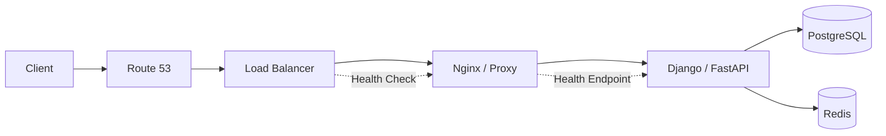
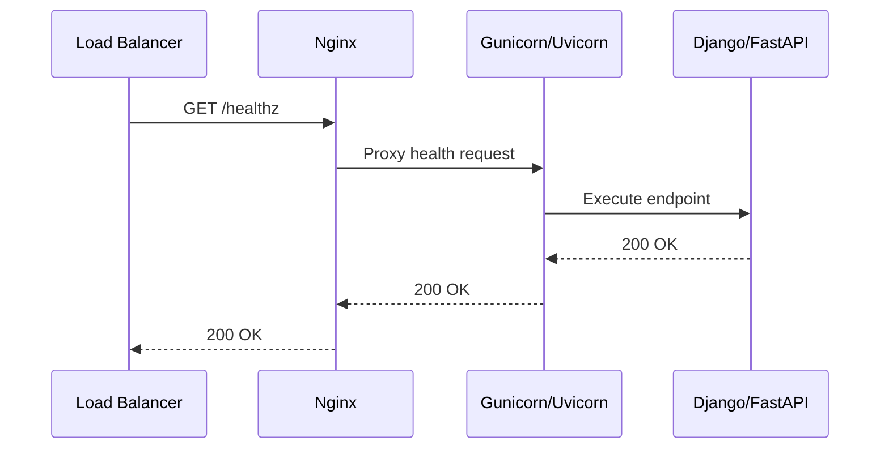
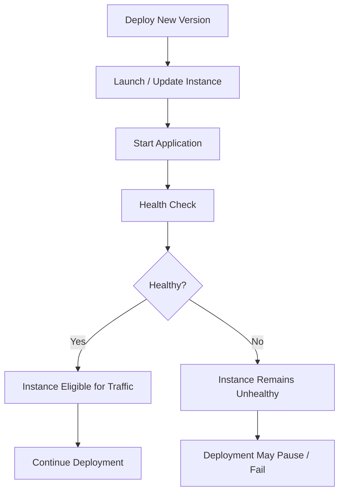

# 04- Health Check Failures

## Overview

Elastic Beanstalk health checks determine whether application instances are capable of receiving traffic. An instance can be successfully provisioned, have the application process running, and still be considered unhealthy because the configured health endpoint is failing, timing out, or returning an unexpected response.

Health failures are therefore different from application startup failures:

```text
Startup Failure
    ↓
Application process cannot initialize
    ↓
No usable application process

Health Check Failure
    ↓
Application process may be running
    ↓
Health check cannot confirm readiness
    ↓
Instance remains unhealthy
```

A typical production request path is:



Health checks are a critical part of deployment safety, high availability, rolling deployments, and automatic instance replacement.

## How Elastic Beanstalk Health Checks Work

At a high level, the load-balancing layer periodically sends requests to a configured health-check path on application instances.

```text
Load Balancer
      │
      │ HTTP health check
      ▼
Instance
      │
      ▼
Proxy / Web Server
      │
      ▼
Application
      │
      ▼
Health Endpoint
      │
      ▼
HTTP Status
```

The result is used to determine whether an instance is suitable for traffic.

A simplified model is:

```text
Health Request
      ↓
Can network path reach instance?
      ↓
Can proxy accept request?
      ↓
Can application respond?
      ↓
Does response satisfy health-check requirements?
      ↓
Healthy / Unhealthy
```

A failure at any layer can produce an unhealthy instance.

## Health Check Versus Application Monitoring

Health checks answer a narrow operational question:

> Can this instance currently serve traffic?

Monitoring answers broader questions:

- Is latency increasing?
- Are errors increasing?
- Is memory exhausted?
- Is the database slow?
- Are requests failing?
- Are background workers healthy?
- Is the application approaching capacity?

Do not use the health endpoint as a replacement for full observability.

| Mechanism | Primary purpose |
|---|---|
| Load balancer health check | Determine whether an instance can receive traffic |
| Elastic Beanstalk health | Determine environment and instance health |
| Application logs | Diagnose application behavior |
| CloudWatch metrics | Observe resource and application signals |
| Distributed tracing | Diagnose request paths across services |
| Synthetic monitoring | Validate application behavior externally |

## Elastic Beanstalk Health States

Elastic Beanstalk environments expose health information that helps identify whether instances are operating normally.

Common states include:

| State | Meaning |
|---|---|
| `Green` | Environment is operating normally |
| `Yellow` | Degraded or warning condition |
| `Red` | Severe health problem |
| `Grey` | Health information unavailable or not yet established |

The exact reason for a state transition should be investigated through events, health information, logs, and metrics rather than assuming the color identifies the root cause.

## Inspect Environment Health

Start with:

```bash
eb health
```

For more detailed information:

```bash
eb health --refresh
```

This helps identify:

- Instance health
- Instance status
- Application version
- Request activity
- HTTP error indicators
- Latency indicators
- Environment-level degradation

During an incident, observe the environment for several refresh cycles rather than relying on a single snapshot.

## Inspect Environment Events

Use:

```bash
eb events
```

Events provide the operational timeline around health changes.

Look for messages indicating:

- Health state changes
- Instance replacement
- Failed deployments
- Application failures
- Load balancer failures
- Configuration changes
- Instance launch problems

The sequence is often more valuable than an isolated error.

For example:

```text
Deployment started
      ↓
New instance launched
      ↓
Application deployed
      ↓
Health check failed
      ↓
Instance became unhealthy
      ↓
Instance replaced
```

This points toward application readiness or health-check configuration rather than instance provisioning.

## Common Health Check Failure Categories

| Failure | Typical symptom | Investigation |
|---|---|---|
| Wrong path | `404` | Verify health-check URL |
| Application error | `500` | Inspect application logs |
| Timeout | No response | Check latency and dependencies |
| Wrong port | Connection failure | Inspect listener configuration |
| Wrong bind address | Connection failure | Check process binding |
| Nginx failure | `502`/`503` | Inspect proxy and upstream |
| Database dependency | Slow/failed response | Check database |
| Redis dependency | Timeout/error | Check Redis |
| Security group | Connection failure | Verify network rules |
| TLS mismatch | Connection failure | Verify protocol configuration |
| Redirect loop | Health check fails | Inspect endpoint behavior |
| Host-header dependency | Unexpected response | Test request headers |
| Resource exhaustion | Intermittent failures | Check CPU/memory |
| Deployment mismatch | New instances fail | Compare application versions |

## Health Check Endpoint Design

A good health endpoint should be:

- Fast
- Deterministic
- Lightweight
- Authentication-independent
- Safe to call frequently
- Free from unnecessary side effects

For example:

```text
GET /healthz
```

A minimal response might be:

```json
{
  "status": "ok"
}
```

The endpoint should normally return a successful HTTP status when the application process is capable of serving traffic.

Avoid making the endpoint perform expensive operations such as:

```text
Health check
    ↓
Query millions of database rows
    ↓
Call five external APIs
    ↓
Warm Redis cache
    ↓
Publish Kafka event
```

Health checks can run frequently. Expensive health checks therefore multiply unnecessary load.

## Liveness Versus Readiness

A senior-level distinction is between **liveness** and **readiness**.

### Liveness

Liveness asks:

> Is the application process alive?

A simple endpoint may return success if the process can execute application code.

### Readiness

Readiness asks:

> Is the application capable of serving production traffic?

Readiness may consider critical dependencies.

For example:

```text
Liveness
    ↓
Process is running

Readiness
    ↓
Process is running
    ↓
Application initialized
    ↓
Critical dependencies available
    ↓
Instance can serve traffic
```

Elastic Beanstalk deployments benefit from a health endpoint that represents actual traffic readiness rather than merely proving that Python is running.

## Dependency Checks

Whether dependencies belong in the health check depends on whether they are required for serving requests.

Consider PostgreSQL.

If every meaningful request requires PostgreSQL:

```text
Health Check
     ↓
Application
     ↓
PostgreSQL
```

then database availability may be relevant to readiness.

However, if the application can safely serve cached or static responses without PostgreSQL, making PostgreSQL availability mandatory can cause unnecessary instance removal.

The correct design depends on application semantics.

## Health Check and Redis

Redis should be included in readiness checks only when Redis is a hard dependency for serving traffic.

For example:

```text
Request
  ↓
Session stored in Redis
  ↓
Redis unavailable
  ↓
Request cannot succeed
```

In this case Redis availability may be part of readiness.

But for an optional cache:

```text
Request
  ↓
Try Redis
  ↓
Redis unavailable
  ↓
Use database
```

forcing Redis into the health check can unnecessarily mark otherwise functional instances unhealthy.

## Health Check and External APIs

Avoid making third-party APIs mandatory health-check dependencies unless the application genuinely cannot serve traffic without them.

This is dangerous:

```text
Health Check
    ↓
Application
    ↓
Third-party API
    ↓
Third-party timeout
    ↓
Health check timeout
    ↓
Instance marked unhealthy
```

A temporary failure in an external provider can then cause healthy application instances to be removed from service.

Prefer resilience patterns such as:

- Timeouts
- Circuit breakers
- Fallbacks
- Caching
- Asynchronous processing

where appropriate.

## HTTP Status Codes

Health-check endpoints should have predictable HTTP semantics.

| Response | Typical interpretation |
|---|---|
| `2xx` | Successful health response |
| `3xx` | Redirect; usually undesirable for health endpoints |
| `4xx` | Request/configuration problem |
| `5xx` | Application/server failure |
| Timeout | Application or network problem |

A health endpoint should generally avoid redirects.

For example, do not depend on:

```text
/health
   ↓
301
   ↓
/health/
```

Use the exact configured path instead.

## Authentication and Health Checks

Do not require normal user authentication for a load balancer health endpoint unless the health-check architecture explicitly supports it.

This can fail:

```text
Load Balancer
      ↓
GET /healthz
      ↓
Authentication middleware
      ↓
401 Unauthorized
      ↓
Instance unhealthy
```

A health endpoint should be intentionally designed for infrastructure access.

This does not mean it should expose sensitive information.

Avoid responses such as:

```json
{
  "database_password": "...",
  "redis_url": "...",
  "aws_credentials": "..."
}
```

A health endpoint should reveal only the minimum information required.

## Health Check Timeouts

A timeout can indicate:

- Slow application code
- Database latency
- Redis latency
- Network problems
- CPU saturation
- Memory pressure
- Thread/process exhaustion
- Deadlocks
- Dependency timeouts

Do not immediately increase the health-check timeout.

First determine why the endpoint is slow.

For example:

```text
Health endpoint latency
        │
        ├── Application processing
        ├── Database query
        ├── Redis operation
        ├── External API
        └── Network/proxy delay
```

Increasing a timeout can hide an underlying capacity or dependency problem.

## Health Check Latency

A health endpoint should normally complete much faster than ordinary business requests.

For example:

```text
Normal API request: 250 ms
Health endpoint:     5 ms
```

is generally preferable to:

```text
Normal API request: 250 ms
Health endpoint:   900 ms
```

A slow health endpoint increases the chance of false negatives during load spikes.

## Nginx and Health Checks

In environments using Nginx as a reverse proxy, the request path may be:



A failure can occur at every hop.

For example:

```text
LB → Nginx        ✓
Nginx → Gunicorn  ✗
```

can produce a proxy error even though the load balancer itself is operating correctly.

Inspect both proxy and application logs.

## `502 Bad Gateway`

A `502` commonly indicates that the proxy could not obtain a valid response from its upstream server.

Possible causes include:

- Gunicorn/Uvicorn is not running
- Wrong upstream port
- Process crashed
- Process is restarting
- Invalid upstream configuration
- Connection reset
- Application server unavailable

Investigate:

```bash
eb logs
```

and, when necessary:

```bash
eb ssh
```

Then:

```bash
ps aux
ss -lntp
```

Do not assume that `502` means the load balancer itself is broken.

## `503 Service Unavailable`

A `503` can indicate that the service is currently unable to handle the request.

Potential causes include:

- No healthy instances
- Application unavailable
- Proxy unavailable
- Deployment state
- Capacity problems
- Health-check failures

Use environment health and event information to determine which layer is responsible.

## Network-Level Health Failures

Health checks can fail before reaching the application.

The network path may look like:

```text
Load Balancer
      ↓
Security Group
      ↓
Subnet / Route
      ↓
Instance Network Interface
      ↓
Proxy
      ↓
Application
```

Investigate:

- Security groups
- Subnet configuration
- Network ACLs
- Routing
- Listener configuration
- Instance availability
- Application listener

Do not modify security groups broadly as a first response.

Use the minimum required network permissions.

## Security Group Mistakes

A common mistake is configuring application security groups without understanding the traffic source.

For a load-balanced environment, the application instance should generally allow the required application traffic from the appropriate load-balancer security group rather than exposing the application port publicly.

Conceptually:

```text
Internet
   ↓
Load Balancer
   ↓
Application Security Group
   ↓
EC2 Instance
```

Avoid:

```text
0.0.0.0/0
   ↓
Application Port
```

unless there is a specific architectural reason.

## Host Header and Health Checks

Some applications behave differently depending on the HTTP `Host` header.

For example:

```python
ALLOWED_HOSTS = [
    "api.example.com",
]
```

A health-check request that uses a different host can result in a `400` or equivalent application-level rejection.

If the application depends on host-based routing, verify the health-check request and application configuration.

For Django, review:

```python
ALLOWED_HOSTS = [
    "api.example.com",
    # Include only hosts required by the deployment architecture.
]
```

Do not solve host validation problems by allowing every host:

```python
ALLOWED_HOSTS = ["*"]
```

unless there is a deliberate and justified security model around it.

## Health Checks During Deployments

Health checks are particularly important during rolling deployments.

A simplified flow is:



A faulty health endpoint can therefore make an otherwise valid application deployment fail.

This is one reason health-check behavior should be tested before production rollout.

## Deployment and Health Check Interaction

Consider:

```text
Version 41
    ↓
Healthy

Version 42
    ↓
Application starts
    ↓
Health check returns 500
    ↓
Instance unhealthy
    ↓
Deployment fails or rolls back
```

This behavior is desirable because the health system prevents an invalid application version from silently receiving production traffic.

## Health Check and Auto Scaling

Health status can also influence instance lifecycle behavior in a managed environment.

A repeatedly unhealthy instance may be replaced.

This creates a dangerous feedback loop when the root cause is systemic:

```text
Instance unhealthy
      ↓
Instance replaced
      ↓
New instance starts
      ↓
Same configuration
      ↓
Same health failure
      ↓
Instance replaced again
```

This is an important production signal.

If multiple newly created instances fail the same health check, suspect a shared problem such as:

- Application version
- Configuration
- Database connectivity
- Security groups
- IAM permissions
- Dependency availability
- Health endpoint logic

rather than individual EC2 hardware.

## Intermittent Health Failures

Intermittent failures are harder to diagnose than permanent failures.

Example:

```text
Instance 1 → Healthy
Instance 2 → Healthy
Instance 3 → Unhealthy
Instance 4 → Healthy
```

Possible causes include:

- Resource imbalance
- Instance-specific process failure
- Memory pressure
- Network differences
- Corrupted local state
- Uneven application configuration
- Dependency connection exhaustion

Compare healthy and unhealthy instances.

Useful commands:

```bash
eb health
```

and:

```bash
eb ssh
```

Then inspect:

```bash
ps aux
free -h
df -h
ss -lntp
```

## Resource Exhaustion

Health-check failures can be secondary symptoms of resource exhaustion.

### CPU

High CPU can cause:

```text
Health request
    ↓
Request waits for CPU
    ↓
Timeout
    ↓
Instance unhealthy
```

### Memory

Memory pressure can cause application workers to be killed.

```bash
free -h
```

Inspect memory-heavy processes:

```bash
ps aux --sort=-%mem | head
```

### Disk

Disk exhaustion can break:

- Logging
- Temporary files
- Application startup
- Package operations
- Nginx
- Database-related operations

Check:

```bash
df -h
```

Health failures should therefore be correlated with infrastructure metrics.

## Database-Dependent Health Checks

Database checks require careful design.

A simple database connectivity check can be useful:

```text
Health request
    ↓
Open database connection
    ↓
Execute lightweight operation
    ↓
Return health status
```

But doing this on every health request can create significant connection and query traffic.

At scale:

```text
N instances
×
health checks per minute
=
additional database activity
```

Prefer connection pooling and lightweight checks where database readiness must be verified.

Do not execute expensive application queries merely to prove database connectivity.

## Health Check Cascading Failures

A poorly designed health endpoint can amplify an existing outage.

Example:

```text
PostgreSQL becomes slow
        ↓
Health endpoint performs DB query
        ↓
Health requests become slow
        ↓
Instances become unhealthy
        ↓
Healthy capacity decreases
        ↓
Remaining instances receive more traffic
        ↓
Load increases
        ↓
More health failures
```

This is a cascading failure.

Health checks should provide useful readiness information without creating unnecessary dependency pressure.

## Health Check Architecture for Django

A practical Django architecture is:

```text
Load Balancer
      ↓
/healthz
      ↓
Django
      ↓
Minimal readiness logic
```

Example:

```python
from django.http import JsonResponse


def healthz(request):
    return JsonResponse({"status": "ok"})
```

The endpoint should remain deliberately small.

If database readiness is mandatory, use a lightweight, controlled check rather than executing business logic.

## Health Check Architecture for FastAPI

A minimal FastAPI endpoint:

```python
from fastapi import FastAPI

app = FastAPI()


@app.get("/healthz")
async def healthz() -> dict[str, str]:
    return {"status": "ok"}
```

For production readiness, additional dependency checks should be introduced only when those dependencies are truly required for serving traffic.

## Health Check Logging

Avoid generating excessive application logs for every health-check request.

At high request frequency, logging every successful check can produce:

- Large log volumes
- Higher CloudWatch ingestion costs
- Noisy application logs
- Difficult incident analysis

Prefer access-log filtering or appropriate log-level configuration when infrastructure health traffic is predictable.

However, failed health checks should remain observable.

## Troubleshooting Workflow

Use a consistent sequence.

### Check Environment Health

```bash
eb health
```

Determine:

- Which instances are unhealthy
- Whether all instances are affected
- Whether the problem is intermittent
- Whether the environment is degrading

### Check Events

```bash
eb events
```

Look for the first health-related transition.

### Check Logs

```bash
eb logs
```

Inspect:

- Application logs
- Nginx logs
- Deployment logs
- System logs

### Identify the Health Endpoint

Determine:

```text
Path
Port
Protocol
Expected status
Timeout
```

Do not troubleshoot the application without first knowing what the load balancer is actually checking.

### Test the Endpoint Locally on the Instance

SSH into the instance:

```bash
eb ssh
```

Then test the application locally:

```bash
curl -i http://127.0.0.1/healthz
```

If the application listens on a different port:

```bash
curl -i http://127.0.0.1:8000/healthz
```

This helps distinguish:

```text
Application failure
```

from:

```text
Network / proxy / load-balancer failure
```

### Test Through the Proxy

If Nginx is involved:

```bash
curl -i http://127.0.0.1/healthz
```

Compare the result with direct application-server access.

For example:

```text
Nginx → 502
Gunicorn → 200
```

strongly suggests a proxy/upstream configuration issue.

### Check Resource Utilization

```bash
free -h
df -h
uptime
```

Then inspect processes:

```bash
ps aux --sort=-%cpu | head
ps aux --sort=-%mem | head
```

### Check Dependencies

Only investigate dependencies relevant to the endpoint.

Potential dependencies include:

- PostgreSQL
- Redis
- Kafka
- External APIs
- AWS services

Avoid broad infrastructure changes before identifying the failing dependency.

## Health Check Diagnostic Matrix

| Symptom | Likely cause | Validation |
|---|---|---|
| `404` | Wrong health path | `curl` endpoint |
| `400` | Host/header validation | Inspect request and app config |
| `401` | Authentication required | Remove unnecessary auth requirement |
| `403` | Access restriction | Inspect proxy/security configuration |
| `500` | Application error | Application logs |
| `502` | Upstream failure | Nginx + process |
| `503` | Service unavailable | Environment and instance health |
| Timeout | Slow dependency or overloaded instance | Latency + resource metrics |
| Connection refused | Nothing listening | `ss -lntp` |
| Intermittent failure | Resource or instance-specific issue | Compare instances |
| All instances fail | Shared configuration/deployment issue | Version + environment config |
| Only new instances fail | Deployment/startup issue | New version logs |
| Only one instance fails | Instance-specific problem | Instance-level diagnostics |

## Common Mistakes

### Using an Expensive Health Endpoint

Bad design:

```text
/healthz
    ↓
Complex database query
    ↓
Redis query
    ↓
External API call
    ↓
Kafka operation
```

Health checks should not become mini integration tests.

### Returning `200` When the Application Cannot Serve Traffic

A health endpoint that always returns `200` can hide serious readiness problems.

The endpoint should reflect the operational definition of readiness.

### Returning `500` for Optional Dependencies

If Redis is only a cache and the application can continue without it, Redis failure should not necessarily make the entire instance unhealthy.

### Requiring Authentication

Infrastructure health checks should not accidentally depend on application-user authentication.

### Making Third-Party APIs Mandatory

A temporary third-party outage should not automatically remove all application instances from service unless the application genuinely cannot function without that service.

### Increasing Timeouts Without Finding the Cause

A larger timeout may hide:

- Database slowness
- CPU saturation
- Deadlocks
- Connection exhaustion
- Network problems

Fix the underlying latency problem first.

### Opening Security Groups Broadly

Do not respond to a health-check failure by allowing application ports from:

```text
0.0.0.0/0
```

Use the narrowest required source.

### Ignoring Instance Differences

If only one instance is unhealthy, compare it against healthy instances before changing the entire environment.

### Treating Every Health Failure as an Application Bug

Health failures can originate from:

```text
Network
Proxy
Application
Database
Redis
CPU
Memory
Disk
Security configuration
Deployment configuration
```

Investigate the complete request path.

## Production Best Practices

### Keep Health Endpoints Lightweight

Prefer:

```text
Fast
Deterministic
Low CPU
Low memory
No side effects
```

### Separate Liveness and Readiness Concepts

Use different semantics when the architecture requires it.

```text
Liveness
    ↓
Process is alive

Readiness
    ↓
Process can serve production traffic
```

### Make Readiness Dependency-Aware

Only include dependencies that are required for meaningful request processing.

### Make Deployments Backward Compatible

Health-check failures during rolling deployments are easier to recover from when application versions remain compatible with:

- Database schemas
- Cache formats
- Message schemas
- External APIs

### Monitor Health Trends

Do not monitor only the current health color.

Track:

- Health transitions
- `5xx` rates
- Latency
- CPU
- Memory
- Request count
- Instance replacement
- Deployment failures

### Test Health Checks Before Production

Validate:

```text
Healthy instance → expected success
Application stopped → expected failure
Dependency failure → expected readiness behavior
High load → acceptable response time
Deployment → successful health transition
```

## Incident Response Example

Suppose the environment suddenly becomes `Red`.

Start with:

```bash
eb health
```

You discover:

```text
All instances unhealthy
```

Then:

```bash
eb events
```

shows:

```text
Health changed from Green to Red
```

Next:

```bash
eb logs
```

shows:

```text
GET /healthz → 500
```

Now inspect the application logs and discover:

```text
Database connection timeout
```

The investigation becomes:

```text
Health Failure
      ↓
/healthz returns 500
      ↓
Health endpoint depends on PostgreSQL
      ↓
PostgreSQL connection timeout
      ↓
Investigate database/network path
```

This is substantially more useful than restarting the Elastic Beanstalk environment.

## Production Health Checklist

### Application

- [ ] Health endpoint exists.
- [ ] Endpoint returns the expected HTTP status.
- [ ] Endpoint is lightweight.
- [ ] Endpoint does not expose secrets.
- [ ] Endpoint does not require user authentication.
- [ ] Readiness semantics are explicitly defined.
- [ ] Critical dependencies are checked appropriately.
- [ ] Optional dependencies do not unnecessarily make instances unhealthy.

### Networking

- [ ] Health-check path is correct.
- [ ] Health-check port is correct.
- [ ] Security groups allow required traffic.
- [ ] Routing is correct.
- [ ] Proxy configuration is correct.
- [ ] Application binds to the expected interface.

### Application Server

- [ ] Gunicorn/Uvicorn is running.
- [ ] Expected port is listening.
- [ ] Worker processes remain healthy.
- [ ] Nginx can reach the upstream.
- [ ] Application server logs are available.

### Infrastructure

- [ ] CPU is within expected range.
- [ ] Memory is within expected range.
- [ ] Disk has sufficient capacity.
- [ ] Database connectivity is healthy.
- [ ] Redis connectivity is healthy when required.
- [ ] No repeated instance replacement is occurring.

### Deployment

- [ ] Health endpoint is tested before deployment.
- [ ] New application versions pass readiness checks.
- [ ] Rolling deployment behavior is understood.
- [ ] Database changes remain backward compatible.
- [ ] Rollback compatibility is verified.

## Interview Traps

### Is a running application automatically healthy?

No. A process can be running while the health endpoint returns errors, times out, or cannot be reached through the proxy.

### What is the difference between liveness and readiness?

Liveness indicates that a process is alive. Readiness indicates that the process is capable of serving production traffic.

### Should a health endpoint always query the database?

No. Database checks should be included only when database availability is required for the application to serve traffic. Even then, the check should be lightweight.

### Why can a third-party API cause health-check failures?

If the health endpoint synchronously calls that API, an external timeout can make the endpoint fail and cause the instance to be marked unhealthy.

### Why can all new instances become unhealthy simultaneously?

A shared configuration, application version, security rule, dependency failure, or health-check configuration can affect every newly created instance.

### Why should you inspect `502` and `503` differently?

A `502` often points toward an upstream/proxy communication problem, while a `503` commonly indicates that the service currently has no usable capacity or is unavailable. The exact cause must be established from environment and application evidence.

### Why is making health checks too strict dangerous?

An overly strict health check can turn a partial dependency failure into a complete capacity reduction by removing otherwise usable instances from service.

### Why is making health checks too simple dangerous?

An endpoint that always returns `200` can report an instance as healthy even when the application cannot actually serve production requests.

## Key Takeaways

- Health checks determine whether an Elastic Beanstalk instance is suitable for serving traffic.
- A running process is not necessarily a healthy or ready process.
- `eb health` and `eb events` are primary commands for investigating environment health.
- A health failure can originate at the load balancer, network, proxy, application server, application, or downstream dependency.
- A good health endpoint is fast, deterministic, lightweight, and free from unnecessary side effects.
- Liveness and readiness represent different operational concepts.
- Only hard dependencies should normally influence readiness.
- Avoid making third-party services mandatory health-check dependencies unless the application genuinely cannot operate without them.
- Avoid expensive database queries, Redis operations, Kafka operations, or external API calls inside frequently executed health checks.
- `502` commonly indicates an upstream/proxy communication problem, while `503` commonly indicates service unavailability.
- A `404` usually indicates that the configured health-check path does not match the application route.
- A timeout should trigger investigation into application latency, dependency latency, resource exhaustion, and networking rather than an immediate timeout increase.
- Health checks should be tested during deployments because they directly influence instance readiness and deployment safety.
- If every new instance fails the same health check, investigate shared configuration, application versions, networking, and dependencies.
- If only one instance fails, compare it with healthy instances before modifying the environment globally.
- Health checks should not expose secrets or require normal user authentication.
- A poorly designed health endpoint can amplify outages by causing healthy capacity to be removed.
- Health status should be correlated with logs, metrics, latency, resource utilization, and deployment events.
- The objective is not merely to make the health endpoint return `200`; it is to accurately represent whether the instance can safely serve production traffic.